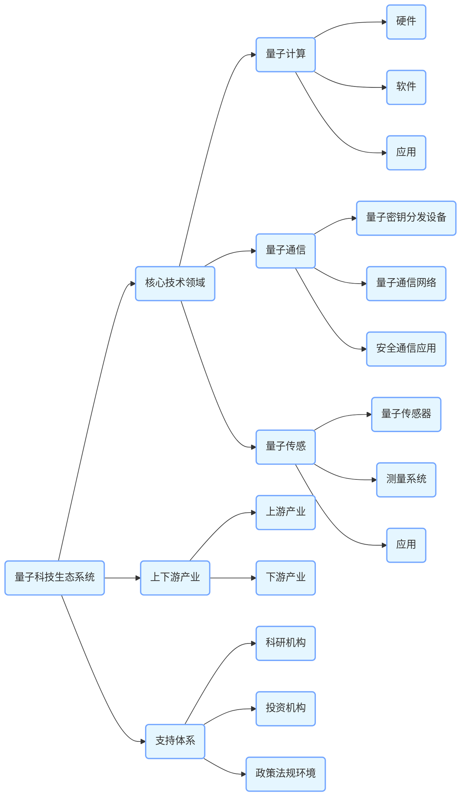

# 巴菲特的并购艺术：量子科技生态系统的整合策略

> 关键词：巴菲特并购艺术、量子科技、生态系统整合、并购策略、科技投资

> 摘要：本文深入探讨了巴菲特的并购艺术在量子科技生态系统整合中的应用。首先介绍了研究的背景、目的、预期读者和文档结构，阐述了相关术语。接着分析了量子科技生态系统的核心概念及各部分之间的联系，给出了原理和架构的文本示意图与 Mermaid 流程图。详细讲解了适用于量子科技并购整合的核心算法原理，并提供了 Python 源代码示例。同时，介绍了相关的数学模型和公式，结合实际例子进行说明。通过项目实战，展示了在量子科技领域进行并购整合的代码实现及解读。探讨了量子科技并购整合的实际应用场景，推荐了学习资源、开发工具框架以及相关论文著作。最后总结了未来发展趋势与挑战，解答了常见问题，并提供了扩展阅读和参考资料。

## 1. 背景介绍 
### 1.1 目的和范围
本研究的主要目的是深入剖析巴菲特的并购艺术在量子科技生态系统整合中的应用。巴菲特以其卓越的并购眼光和策略在传统金融和商业领域取得了巨大成功，而量子科技作为新兴且具有颠覆性的技术领域，其生态系统的构建和整合面临着诸多独特的挑战和机遇。通过研究如何将巴菲特的并购理念和方法应用于量子科技领域，旨在为投资者、科技企业管理者和研究人员提供有价值的参考和指导。

研究范围涵盖了量子科技生态系统的各个层面，包括量子计算、量子通信、量子传感等核心领域，以及与之相关的上下游产业。同时，分析了在并购过程中涉及的财务、技术、市场和管理等多个方面的因素，探讨如何实现量子科技生态系统的有效整合和协同发展。

### 1.2 预期读者
本文的预期读者包括：
- **投资者**：对量子科技领域有投资意向或已经参与投资的个人和机构投资者，希望通过了解巴菲特的并购艺术，更好地把握量子科技投资机会，制定合理的投资策略。
- **科技企业管理者**：量子科技企业以及相关上下游企业的管理者，期望借鉴巴菲特的并购经验，在企业发展过程中通过并购实现资源整合、技术升级和市场拓展，提升企业的竞争力。
- **研究人员**：从事量子科技、金融并购等领域研究的学者和科研人员，为其研究提供新的视角和思路，促进跨学科研究的发展。

### 1.3 文档结构概述
本文将按照以下结构进行组织：
- **核心概念与联系**：介绍量子科技生态系统的核心概念，分析各部分之间的联系，通过文本示意图和 Mermaid 流程图进行直观展示。
- **核心算法原理 & 具体操作步骤**：讲解适用于量子科技并购整合的核心算法原理，并用 Python 源代码详细阐述具体操作步骤。
- **数学模型和公式 & 详细讲解 & 举例说明**：引入相关的数学模型和公式，结合实际例子进行详细讲解，帮助读者理解并购整合过程中的量化分析方法。
- **项目实战：代码实际案例和详细解释说明**：通过实际项目案例，展示在量子科技领域进行并购整合的代码实现和详细解读，包括开发环境搭建、源代码实现和代码分析。
- **实际应用场景**：探讨量子科技并购整合在不同场景下的应用，分析其实际价值和意义。
- **工具和资源推荐**：推荐学习量子科技和并购整合相关的资源，包括书籍、在线课程、技术博客和网站等，同时介绍开发工具框架和相关论文著作。
- **总结：未来发展趋势与挑战**：总结量子科技生态系统整合的未来发展趋势，分析面临的挑战和机遇。
- **附录：常见问题与解答**：解答读者在阅读过程中可能遇到的常见问题。
- **扩展阅读 & 参考资料**：提供相关的扩展阅读材料和参考资料，方便读者进一步深入研究。

### 1.4 术语表
#### 1.4.1 核心术语定义
- **巴菲特并购艺术**：指巴菲特在长期的投资和并购实践中形成的一套独特的理念、方法和策略，包括价值投资、深入研究、长期持有、注重协同效应等。
- **量子科技**：基于量子力学原理发展起来的一系列前沿技术，主要包括量子计算、量子通信和量子传感等领域，具有高速计算、绝对安全通信等独特优势。
- **生态系统整合**：将量子科技领域内的各个企业、机构、技术和资源进行有机结合和优化配置，形成一个相互协作、共同发展的生态系统，以实现资源共享、优势互补和协同创新。
- **并购**：指企业通过购买其他企业的股权或资产，从而取得对该企业的控制权或实现业务整合的行为。

#### 1.4.2 相关概念解释
- **量子计算**：利用量子比特的叠加和纠缠特性进行信息处理的新型计算模式，具有比传统计算机更快的计算速度和更强的计算能力，可用于解决复杂的科学计算、优化问题和密码破解等。
- **量子通信**：基于量子力学原理实现信息安全传输的通信技术，主要包括量子密钥分发和量子隐形传态等，具有绝对的安全性，可有效防止信息被窃听和破解。
- **量子传感**：利用量子系统对物理量的高灵敏度响应进行测量的技术，可实现高精度的测量和检测，在导航、地质勘探、生物医学等领域具有广泛的应用前景。

#### 1.4.3 缩略词列表
- **QC**：Quantum Computing，量子计算
- **QComm**：Quantum Communication，量子通信
- **QS**：Quantum Sensing，量子传感

## 2. 核心概念与联系 
### 核心概念原理
量子科技生态系统主要由量子计算、量子通信和量子传感三个核心领域以及相关的上下游产业组成。

#### 量子计算原理
量子计算基于量子比特（qubit）的特性进行信息处理。与传统计算机的比特只能处于 0 或 1 两种状态不同，量子比特可以处于 0 和 1 的叠加态，即同时处于 0 和 1 的状态。通过量子门操作，可以对量子比特的叠加态进行控制和变换，从而实现并行计算。例如，一个包含 n 个量子比特的量子计算机可以同时处理 $2^n$ 个状态，这使得量子计算机在处理某些复杂问题时具有指数级的速度优势。

#### 量子通信原理
量子通信的核心是量子密钥分发（QKD）。量子密钥分发利用量子态的不可克隆定理和测不准原理，确保通信双方能够安全地共享密钥。在量子密钥分发过程中，发送方通过发送单光子等量子态来编码密钥信息，接收方通过测量这些量子态来获取密钥。由于量子态的测量会改变其状态，任何试图窃听的行为都会被通信双方察觉，从而保证了密钥的安全性。量子隐形传态则是利用量子纠缠现象，将一个量子态的信息从一个地方传输到另一个地方，而无需传输实际的物理粒子。

#### 量子传感原理
量子传感利用量子系统对外部物理量的高灵敏度响应来实现测量。例如，某些量子系统的能量状态会受到外部磁场、电场、温度等物理量的影响，通过测量这些量子系统的状态变化，就可以精确地测量出外部物理量的大小。量子传感具有高精度、高灵敏度和高分辨率等优点，可用于检测微弱信号和微小变化。

### 架构的文本示意图
```plaintext
量子科技生态系统
├── 核心技术领域
│   ├── 量子计算
│   │   ├── 硬件（量子芯片、量子比特操控设备等）
│   │   ├── 软件（量子算法、量子编程语言等）
│   │   └── 应用（密码破解、药物研发、金融建模等）
│   ├── 量子通信
│   │   ├── 量子密钥分发设备
│   │   ├── 量子通信网络
│   │   └── 安全通信应用
│   └── 量子传感
│       ├── 量子传感器
│       ├── 测量系统
│       └── 应用（导航、地质勘探、生物医学等）
├── 上下游产业
│   ├── 上游产业（原材料供应、设备制造等）
│   └── 下游产业（应用服务、解决方案提供商等）
├── 支持体系
│   ├── 科研机构（高校、科研院所等）
│   ├── 投资机构
│   └── 政策法规环境
```

### Mermaid 流程图


从流程图和文本示意图可以看出，量子科技生态系统是一个复杂的、相互关联的整体。核心技术领域是整个生态系统的基础，上下游产业为核心技术的发展提供支持和应用场景，支持体系则为生态系统的发展提供科研、资金和政策保障。各部分之间相互依存、相互促进，共同推动量子科技的发展和应用。

## 3. 核心算法原理 & 具体操作步骤 
### 核心算法原理
在量子科技生态系统的并购整合中，需要综合考虑多个因素，如企业的财务状况、技术实力、市场前景等。一种常用的算法是多目标优化算法，通过建立多目标优化模型，对不同的并购方案进行评估和选择。

假设我们有 $n$ 个待评估的并购方案，每个方案有 $m$ 个评估指标，如财务指标（净利润、资产负债率等）、技术指标（专利数量、研发投入等）和市场指标（市场份额、增长率等）。我们的目标是找到一个最优的并购方案，使得所有评估指标都能得到较好的满足。

多目标优化问题可以表示为：
$$
\begin{cases}
\max f_i(x), & i = 1, 2, \cdots, m \\
\text{s.t.} \quad g_j(x) \leq 0, & j = 1, 2, \cdots, k \\
x \in X
\end{cases}
$$
其中，$x$ 是并购方案的决策变量，$f_i(x)$ 是第 $i$ 个评估指标的目标函数，$g_j(x)$ 是第 $j$ 个约束条件，$X$ 是决策变量的可行域。

### 具体操作步骤
#### 步骤 1：确定评估指标和权重
首先，需要确定用于评估并购方案的指标，并为每个指标分配相应的权重。权重的分配可以根据决策者的偏好和经验进行确定，也可以通过层次分析法（AHP）等方法进行量化计算。

#### 步骤 2：数据收集和预处理
收集每个并购方案在各个评估指标上的数据，并进行预处理，如数据标准化、缺失值处理等，以确保数据的可比性和有效性。

#### 步骤 3：建立多目标优化模型
根据确定的评估指标和权重，建立多目标优化模型。可以使用线性加权法、理想点法等方法将多目标优化问题转化为单目标优化问题。

#### 步骤 4：求解优化模型
使用优化算法求解建立的优化模型，得到最优的并购方案。常用的优化算法包括遗传算法、粒子群算法等。

#### 步骤 5：结果分析和决策
对求解得到的最优并购方案进行分析和评估，结合实际情况进行决策。如果需要，可以对模型和算法进行调整和优化，以得到更符合实际需求的结果。

### Python 源代码示例
```python
import numpy as np
from scipy.optimize import minimize

# 定义评估指标和权重
evaluation_metrics = ['profit', 'patents', 'market_share']
weights = np.array([0.4, 0.3, 0.3])

# 定义并购方案数据
acquisition_schemes = np.array([
    [100, 20, 0.1],
    [120, 15, 0.15],
    [80, 25, 0.08]
])

# 数据标准化
def standardize(data):
    mean = np.mean(data, axis=0)
    std = np.std(data, axis=0)
    return (data - mean) / std

standardized_data = standardize(acquisition_schemes)

# 定义目标函数
def objective_function(x):
    return -np.dot(weights, np.dot(x, standardized_data))

# 定义约束条件
constraints = ({'type': 'eq', 'fun': lambda x: np.sum(x) - 1})
bounds = [(0, 1) for _ in range(len(acquisition_schemes))]

# 初始猜测
initial_guess = np.ones(len(acquisition_schemes)) / len(acquisition_schemes)

# 求解优化问题
result = minimize(objective_function, initial_guess, method='SLSQP', bounds=bounds, constraints=constraints)

# 输出结果
optimal_scheme_index = np.argmax(result.x)
print(f"最优并购方案的索引为: {optimal_scheme_index}")
print(f"最优并购方案的评估指标值为: {acquisition_schemes[optimal_scheme_index]}")
```

在上述代码中，我们首先定义了评估指标和权重，然后收集了并购方案的数据并进行了标准化处理。接着，我们定义了目标函数和约束条件，使用 `scipy.optimize.minimize` 函数求解优化问题，得到最优的并购方案。最后，我们输出了最优并购方案的索引和评估指标值。

## 4. 数学模型和公式 & 详细讲解 & 举例说明 
### 数学模型
在量子科技生态系统的并购整合中，除了前面提到的多目标优化模型，还可以使用其他数学模型来评估并购的价值和风险。下面介绍几种常用的数学模型。

#### 贴现现金流模型（DCF）
贴现现金流模型是一种常用的估值模型，用于评估企业的内在价值。该模型的基本思想是将企业未来的现金流折现到当前时刻，得到企业的现值。

假设企业在未来 $n$ 期的现金流分别为 $CF_1, CF_2, \cdots, CF_n$，贴现率为 $r$，则企业的现值 $V$ 可以表示为：
$$
V = \sum_{t=1}^{n} \frac{CF_t}{(1 + r)^t} + \frac{TV}{(1 + r)^n}
$$
其中，$TV$ 是企业在第 $n$ 期的终值，可以通过永续增长模型等方法进行估算。

#### 协同效应模型
协同效应是并购的重要目标之一，通过协同效应可以实现企业价值的提升。协同效应可以分为经营协同效应、财务协同效应和管理协同效应等。

假设并购前企业 A 的价值为 $V_A$，企业 B 的价值为 $V_B$，并购后企业的价值为 $V_{AB}$，则协同效应 $S$ 可以表示为：
$$
S = V_{AB} - (V_A + V_B)
$$

### 详细讲解
#### 贴现现金流模型
贴现现金流模型的核心是预测企业未来的现金流和确定合适的贴现率。预测现金流需要考虑企业的经营状况、市场前景、行业竞争等因素，可以通过历史数据分析、市场调研和专家预测等方法进行。贴现率则反映了资金的时间价值和投资的风险，通常可以使用加权平均资本成本（WACC）来确定。

#### 协同效应模型
协同效应的来源主要包括成本节约、收入增长和财务优化等。成本节约可以通过合并采购、生产和管理等环节来实现；收入增长可以通过拓展市场、交叉销售和新产品开发等方式来实现；财务优化可以通过降低融资成本、提高资金使用效率等方式来实现。

### 举例说明
#### 贴现现金流模型举例
假设一家量子科技企业预计未来 5 年的现金流分别为 100 万元、120 万元、150 万元、180 万元和 200 万元，第 5 年后的现金流以 5% 的增长率永续增长，贴现率为 10%。则该企业的现值计算如下：

首先，计算前 5 年现金流的现值：
$$
PV_1 = \frac{100}{(1 + 0.1)^1} + \frac{120}{(1 + 0.1)^2} + \frac{150}{(1 + 0.1)^3} + \frac{180}{(1 + 0.1)^4} + \frac{200}{(1 + 0.1)^5} \approx 597.35 \text{（万元）}
$$

然后，计算第 5 年后现金流的终值：
$$
TV = \frac{200 \times (1 + 0.05)}{0.1 - 0.05} = 4200 \text{（万元）}
$$

最后，计算第 5 年后现金流终值的现值：
$$
PV_2 = \frac{4200}{(1 + 0.1)^5} \approx 2603.03 \text{（万元）}
$$

该企业的现值为：
$$
V = PV_1 + PV_2 \approx 597.35 + 2603.03 = 3200.38 \text{（万元）}
$$

#### 协同效应模型举例
假设企业 A 的价值为 5000 万元，企业 B 的价值为 3000 万元，并购后企业的价值为 9000 万元。则协同效应为：
$$
S = 9000 - (5000 + 3000) = 1000 \text{（万元）}
$$

这表明通过并购，企业实现了 1000 万元的协同效应，可能是由于成本节约、收入增长或财务优化等原因导致的。

## 5. 项目实战：代码实际案例和详细解释说明 
### 5.1  开发环境搭建
#### 操作系统
本项目可以在 Windows、Linux 或 macOS 等主流操作系统上进行开发。建议使用 Linux 系统，因为它具有良好的开源生态和稳定性。

#### Python 环境
安装 Python 3.7 或更高版本。可以从 Python 官方网站（https://www.python.org/downloads/）下载安装包进行安装。安装完成后，建议使用虚拟环境来管理项目的依赖库，避免不同项目之间的库冲突。可以使用 `venv` 或 `conda` 来创建虚拟环境。

```bash
# 使用 venv 创建虚拟环境
python -m venv quantum_m&A_env

# 激活虚拟环境
# Windows
quantum_m&A_env\Scripts\activate
# Linux 或 macOS
source quantum_m&A_env/bin/activate
```

#### 依赖库安装
安装项目所需的依赖库，包括 `numpy`、`pandas`、`scipy` 等。可以使用 `pip` 进行安装。

```bash
pip install numpy pandas scipy
```

### 5.2  源代码详细实现和代码解读
#### 数据准备
首先，我们需要准备并购方案的数据。假设我们有 3 个并购方案，每个方案有 4 个评估指标：净利润、专利数量、市场份额和研发投入。

```python
import numpy as np
import pandas as pd

# 定义评估指标和权重
evaluation_metrics = ['profit', 'patents', 'market_share', 'R&D_investment']
weights = np.array([0.3, 0.2, 0.3, 0.2])

# 定义并购方案数据
acquisition_schemes = np.array([
    [100, 20, 0.1, 50],
    [120, 15, 0.15, 60],
    [80, 25, 0.08, 40]
])

# 将数据转换为 DataFrame 格式
df = pd.DataFrame(acquisition_schemes, columns=evaluation_metrics)
print("并购方案数据：")
print(df)
```

#### 数据标准化
为了使不同评估指标具有可比性，我们需要对数据进行标准化处理。

```python
# 数据标准化
def standardize(data):
    mean = np.mean(data, axis=0)
    std = np.std(data, axis=0)
    return (data - mean) / std

standardized_data = standardize(acquisition_schemes)
df_standardized = pd.DataFrame(standardized_data, columns=evaluation_metrics)
print("标准化后的数据：")
print(df_standardized)
```

#### 多目标优化模型求解
使用线性加权法将多目标优化问题转化为单目标优化问题，并使用 `scipy.optimize.minimize` 函数求解。

```python
from scipy.optimize import minimize

# 定义目标函数
def objective_function(x):
    return -np.dot(weights, np.dot(x, standardized_data))

# 定义约束条件
constraints = ({'type': 'eq', 'fun': lambda x: np.sum(x) - 1})
bounds = [(0, 1) for _ in range(len(acquisition_schemes))]

# 初始猜测
initial_guess = np.ones(len(acquisition_schemes)) / len(acquisition_schemes)

# 求解优化问题
result = minimize(objective_function, initial_guess, method='SLSQP', bounds=bounds, constraints=constraints)

# 输出结果
optimal_scheme_index = np.argmax(result.x)
print(f"最优并购方案的索引为: {optimal_scheme_index}")
print(f"最优并购方案的评估指标值为: {acquisition_schemes[optimal_scheme_index]}")
```

### 5.3  代码解读与分析
#### 数据准备部分
- 使用 `numpy` 数组存储并购方案的数据，并使用 `pandas` 的 `DataFrame` 格式进行展示，方便数据的查看和处理。
- 定义了评估指标和权重，权重的分配可以根据实际情况进行调整。

#### 数据标准化部分
- 定义了 `standardize` 函数，使用均值和标准差对数据进行标准化处理，使得不同评估指标具有相同的尺度。

#### 多目标优化模型求解部分
- 定义了目标函数 `objective_function`，使用线性加权法将多目标优化问题转化为单目标优化问题。
- 定义了约束条件和边界条件，确保决策变量的取值范围在合理范围内。
- 使用 `scipy.optimize.minimize` 函数求解优化问题，得到最优的并购方案。

通过以上代码，我们可以根据不同的评估指标和权重，选择最优的并购方案，为量子科技生态系统的整合提供决策支持。

## 6. 实际应用场景 
### 量子计算领域的并购整合
#### 硬件企业并购
在量子计算硬件领域，一些企业可能拥有先进的量子芯片制造技术，但在量子比特操控设备和系统集成方面存在不足。通过并购拥有相关技术的企业，可以实现技术的互补和整合，提高量子计算机的性能和稳定性。例如，一家专注于超导量子芯片研发的企业并购一家在低温制冷设备方面有优势的企业，可以解决量子芯片在低温环境下运行的关键问题，加速量子计算机的商业化进程。

#### 软件企业并购
量子计算软件企业主要涉及量子算法设计、量子编程语言开发和量子云计算平台搭建等方面。不同的软件企业可能在不同的领域有专长，通过并购可以整合软件资源，提供更全面的量子计算软件解决方案。例如，一家擅长量子算法设计的企业并购一家在量子云计算平台方面有经验的企业，可以将算法优势与平台优势相结合，为用户提供更便捷的量子计算服务。

### 量子通信领域的并购整合
#### 设备制造企业并购
量子通信设备制造企业包括量子密钥分发设备制造商和量子通信网络设备制造商等。通过并购，可以扩大企业的生产规模，降低生产成本，提高产品的市场竞争力。例如，一家量子密钥分发设备制造商并购另一家规模较小的同类企业，可以整合生产资源，优化生产流程，提高设备的产量和质量。

#### 应用服务企业并购
量子通信应用服务企业主要提供安全通信解决方案和服务，如金融机构的量子加密通信服务、政府部门的保密通信服务等。通过并购，可以拓展市场份额，提高服务质量。例如，一家专注于金融领域量子通信服务的企业并购一家在政务领域有客户资源的企业，可以快速进入政务市场，实现业务的多元化发展。

### 量子传感领域的并购整合
#### 传感器企业并购
量子传感企业主要从事量子传感器的研发和生产。不同的量子传感器可能适用于不同的应用场景，通过并购可以丰富企业的产品种类，满足不同客户的需求。例如，一家专注于磁场传感器研发的企业并购一家在电场传感器方面有优势的企业，可以为客户提供更全面的量子传感解决方案。

#### 应用开发企业并购
量子传感应用开发企业主要将量子传感器应用于具体的领域，如导航、地质勘探、生物医学等。通过并购，可以整合应用开发资源，加快技术的产业化进程。例如，一家在导航领域有应用开发经验的企业并购一家在生物医学领域有研究成果的企业，可以将量子传感技术快速推广到生物医学领域，开拓新的市场。

## 7. 工具和资源推荐
### 7.1 学习资源推荐
#### 7.1.1 书籍推荐
- 《量子计算与量子信息》（*Quantum Computation and Quantum Information*）：由 Michael A. Nielsen 和 Isaac L. Chuang 所著，是量子计算领域的经典教材，全面介绍了量子计算和量子信息的基本理论、算法和应用。
- 《巴菲特致股东的信：投资者和公司高管教程》（*The Essays of Warren Buffett: Lessons for Corporate America*）：收录了巴菲特历年致股东的信，深入阐述了他的投资理念、并购策略和企业管理思想，是学习巴菲特并购艺术的重要参考书籍。
- 《并购创造价值》（*Creating Value through Mergers and Acquisitions*）：由 Mark L. Sirower 所著，系统介绍了并购的理论、方法和实践，分析了并购过程中创造价值的关键因素和挑战。

#### 7.1.2 在线课程
- Coursera 上的“量子计算基础”（*Fundamentals of Quantum Computation*）课程：由知名高校的教授授课，介绍了量子计算的基本概念、原理和算法，适合初学者入门。
- edX 上的“投资与估值”（*Investment and Valuation*）课程：涵盖了投资分析、企业估值和并购决策等方面的知识，有助于学习巴菲特的投资和并购理念。
- Udemy 上的“并购与收购实战”（*Mergers and Acquisitions in Practice*）课程：通过实际案例分析，介绍了并购的流程、策略和技巧，对从事并购工作的人员有很大的帮助。

#### 7.1.3 技术博客和网站
- Quantum Computing Report：提供量子计算领域的最新技术动态、研究成果和市场分析，是了解量子计算发展趋势的重要网站。
- Seeking Alpha：专注于金融投资领域，有大量关于巴菲特投资和并购的分析文章和评论，为投资者提供了有价值的参考。
- MergerMarket：是全球领先的并购信息服务提供商，提供并购交易的实时数据、分析报告和行业动态，对研究并购市场有很大的帮助。

### 7.2 开发工具框架推荐
#### 7.2.1 IDE和编辑器
- PyCharm：是一款专业的 Python 集成开发环境，具有强大的代码编辑、调试和项目管理功能，适合开发量子科技和并购相关的 Python 代码。
- Jupyter Notebook：是一个交互式的开发环境，支持多种编程语言，方便进行数据探索、模型开发和结果展示，常用于量子计算和数据分析领域。
- Visual Studio Code：是一款轻量级的代码编辑器，具有丰富的插件和扩展功能，支持多种编程语言，可用于开发量子科技和并购相关的代码。

#### 7.2.2 调试和性能分析工具
- Py-Spy：是一个用于 Python 代码性能分析的工具，可以实时监测 Python 程序的运行状态，找出性能瓶颈，提高代码的执行效率。
- cProfile：是 Python 标准库中的一个性能分析工具，可以统计 Python 程序中各个函数的执行时间和调用次数，帮助开发者优化代码。
- PDB：是 Python 标准库中的一个调试工具，可以在代码中设置断点，逐行执行代码，查看变量的值，方便调试代码。

#### 7.2.3 相关框架和库
- Qiskit：是 IBM 开发的一个开源量子计算框架，提供了量子算法设计、量子电路模拟和量子计算机编程等功能，方便开发者进行量子计算的研究和开发。
- PennyLane：是一个跨平台的量子机器学习框架，支持多种量子计算硬件和模拟器，可用于开发量子机器学习算法和应用。
- Numpy 和 Pandas：是 Python 中常用的科学计算和数据分析库，提供了高效的数组操作和数据处理功能，在量子科技和并购数据分析中广泛应用。

### 7.3 相关论文著作推荐
#### 7.3.1 经典论文
- “Quantum Computing in the NISQ era and beyond”：由 John Preskill 发表，首次提出了“含噪声中等规模量子”（NISQ）的概念，对量子计算的发展阶段和研究方向进行了重要的阐述。
- “The Hubris Hypothesis of Corporate Takeovers”：由 Richard Roll 发表，提出了并购中的“傲慢假说”，认为并购决策往往受到管理者过度自信的影响，对并购的动机和绩效进行了深入的分析。
- “The Market for ‘Lemons’: Quality Uncertainty and the Market Mechanism”：由 George A. Akerlof 发表，提出了信息不对称理论，对并购中的信息问题和交易成本进行了重要的探讨。

#### 7.3.2 最新研究成果
- 关注 arXiv 等预印本平台上关于量子科技和并购领域的最新研究论文，了解前沿的研究动态和技术进展。
- 阅读顶级学术期刊如 *Nature*、*Science*、*Journal of Financial Economics* 等上发表的相关研究成果，获取高质量的学术研究信息。

#### 7.3.3 应用案例分析
- 研究知名企业在量子科技领域的并购案例，如 Google 收购量子计算初创公司等，分析其并购策略、整合过程和绩效影响。
- 参考专业的并购咨询公司发布的并购案例分析报告，了解不同行业和领域的并购实践经验和教训。

## 8. 总结：未来发展趋势与挑战
### 未来发展趋势
#### 量子科技与传统产业深度融合
随着量子科技的不断发展和成熟，将与金融、医疗、能源等传统产业进行深度融合。例如，量子计算可以用于金融风险分析和投资组合优化，量子通信可以保障金融交易的安全；量子传感可以用于医疗诊断和生物成像，提高医疗服务的质量和效率。通过并购整合，量子科技企业可以快速进入传统产业市场，传统产业企业可以借助量子科技提升自身的竞争力。

#### 国际合作与竞争加剧
量子科技是全球科技竞争的焦点领域，各国政府和企业都在加大对量子科技的研发投入和产业布局。未来，国际间的合作与竞争将更加激烈。一方面，各国企业可能会通过跨国并购和合作，整合全球资源，共同推动量子科技的发展；另一方面，也会面临来自国际竞争对手的挑战，需要不断提升自身的技术实力和创新能力。

#### 并购规模和频率增加
随着量子科技市场的不断扩大和成熟，并购活动将更加频繁，并购规模也将不断增加。大型科技企业可能会通过并购快速获取量子科技领域的核心技术和人才，小型初创企业可能会通过被并购实现自身的价值和发展。同时，并购的形式也将更加多样化，除了传统的股权收购和资产收购外，还可能出现战略合作、技术转让等形式。

### 挑战
#### 技术不确定性
量子科技仍处于发展初期，技术还不够成熟，存在许多不确定性。例如，量子计算机的稳定性和可扩展性问题、量子通信的传输距离和速率问题等。在并购过程中，需要准确评估目标企业的技术实力和发展前景，避免因技术风险导致并购失败。

#### 人才短缺
量子科技是一个高度专业化的领域，需要大量的专业人才。目前，全球量子科技领域的人才短缺问题较为严重，这给企业的发展和并购整合带来了一定的困难。在并购过程中，需要考虑如何吸引和留住优秀的人才，确保企业的技术创新能力和竞争力。

#### 政策法规风险
量子科技涉及国家安全和信息安全等重要领域，受到政府的严格监管。不同国家和地区的政策法规存在差异，可能会对企业的并购活动产生影响。在并购过程中，需要了解和遵守相关的政策法规，避免因政策法规风险导致并购受阻。

## 9. 附录：常见问题与解答
### 问题 1：巴菲特的并购艺术在量子科技领域是否适用？
解答：巴菲特的并购艺术在量子科技领域仍然具有一定的适用性。虽然量子科技是新兴技术领域，具有与传统行业不同的特点，但巴菲特的价值投资理念、注重协同效应和长期持有的策略仍然可以为量子科技领域的并购提供指导。例如，在选择并购目标时，可以关注企业的技术实力、市场前景和团队能力等方面的价值；在并购整合过程中，注重实现资源共享和协同发展，提高企业的整体竞争力。

### 问题 2：量子科技生态系统整合中如何评估协同效应？
解答：评估协同效应可以从多个方面进行考虑。首先，可以从财务角度评估成本节约和收入增长的潜力，如合并采购、生产和管理等环节是否可以降低成本，拓展市场和交叉销售是否可以增加收入。其次，可以从技术角度评估技术互补和创新的可能性，如不同企业的技术是否可以相互融合，产生新的技术和产品。此外，还可以从市场和管理角度评估品牌提升、市场份额扩大和管理效率提高等方面的协同效应。可以使用协同效应模型和相关的财务指标进行量化评估，同时结合定性分析进行综合判断。

### 问题 3：在量子科技并购中，如何处理技术知识产权问题？
解答：在量子科技并购中，技术知识产权问题至关重要。首先，在并购前需要对目标企业的知识产权进行全面的尽职调查，了解其专利、商标、著作权等知识产权的情况，包括知识产权的归属、有效性、侵权风险等。其次，在并购协议中需要明确知识产权的转让和许可条款，确保并购后企业对知识产权的合法使用和保护。此外，还需要建立健全的知识产权管理体系，加强对知识产权的保护和管理，防止知识产权的泄露和侵权。

### 问题 4：量子科技并购整合过程中可能会遇到哪些文化冲突问题？如何解决？
解答：量子科技并购整合过程中可能会遇到文化冲突问题，如不同企业的价值观、管理风格和工作方式等方面的差异。解决文化冲突问题可以采取以下措施：首先，在并购前进行文化评估，了解双方企业的文化特点和差异，制定相应的文化整合策略。其次，加强沟通和交流，促进双方员工的相互了解和信任，建立共同的目标和价值观。此外，还可以通过培训和教育等方式，帮助员工适应新的文化环境，提高文化认同感和归属感。

## 10. 扩展阅读 & 参考资料
### 扩展阅读
- 《量子物理史话：上帝掷骰子吗？》：以生动有趣的方式介绍了量子物理的发展历程和基本概念，帮助读者更好地理解量子科技的理论基础。
- 《资本的冒险：投资银行与金融衍生品的故事》：讲述了投资银行在并购和金融市场中的角色和作用，对了解并购的金融运作机制有很大的帮助。
- 《创新者的窘境》：探讨了企业在面对技术创新和市场变革时的困境和挑战，对量子科技企业的发展和并购具有一定的启示意义。

### 参考资料
- Nielsen, M. A., & Chuang, I. L. (2010). *Quantum Computation and Quantum Information*. Cambridge University Press.
- Buffett, W. E. (2008). *The Essays of Warren Buffett: Lessons for Corporate America*. Cunningham Group.
- Sirower, M. L. (1997). *Creating Value through Mergers and Acquisitions*. The Free Press.
- Preskill, J. (2018). Quantum Computing in the NISQ era and beyond. *Quantum*, 2, 79.
- Roll, R. (1986). The Hubris Hypothesis of Corporate Takeovers. *Journal of Business*, 59(2), 197-216.
- Akerlof, G. A. (1970). The Market for ‘Lemons’: Quality Uncertainty and the Market Mechanism. *The Quarterly Journal of Economics*, 84(3), 488-500.

作者：AI天才研究院/AI Genius Institute & 禅与计算机程序设计艺术 /Zen And The Art of Computer Programming