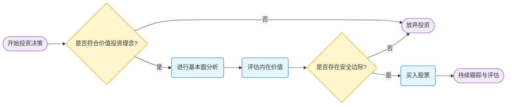

# 巴菲特的投资原则：永远不要亏损

> 关键词：巴菲特、投资原则、永远不要亏损、价值投资、风险控制

> 摘要：本文围绕巴菲特“永远不要亏损”的投资原则展开深入探讨。从背景介绍入手，阐述该原则的目的、适用范围、预期读者以及文档结构等内容。详细解析核心概念，包括价值投资、安全边际等，并给出相应的原理示意图和流程图。深入讲解核心算法原理及具体操作步骤，运用 Python 代码进行阐述。介绍相关数学模型和公式，并举例说明。通过项目实战，展示如何在实际中应用该原则，包括开发环境搭建、源代码实现与解读。分析该原则的实际应用场景，推荐学习该原则所需的工具和资源，涵盖书籍、在线课程、技术博客、开发工具等。最后总结未来投资领域的发展趋势与挑战，解答常见问题，并提供扩展阅读和参考资料，帮助读者全面理解和运用巴菲特的投资原则。

## 1. 背景介绍 
### 1.1 目的和范围
巴菲特作为全球知名的投资大师，其“永远不要亏损”的投资原则影响深远。本文的目的在于深入剖析这一原则，不仅要理解其表面含义，更要探究其背后的投资逻辑和策略。范围涵盖从理论层面的核心概念、算法原理、数学模型，到实践层面的项目实战、实际应用场景等多个方面，旨在为投资者提供全面且深入的学习和参考。

### 1.2 预期读者
本文预期读者包括对投资领域感兴趣的初学者，希望通过学习巴菲特的投资原则建立正确的投资理念；有一定投资经验的投资者，想要进一步优化自己的投资策略，提升投资绩效；金融专业的学生和研究人员，从学术角度深入研究巴菲特的投资思想。

### 1.3 文档结构概述
本文首先介绍背景信息，让读者了解文章的目的、受众和整体结构。接着阐述核心概念，包括与“永远不要亏损”原则相关的重要投资理念及其联系。然后讲解核心算法原理和具体操作步骤，用 Python 代码详细说明。之后介绍数学模型和公式，并举例加深理解。通过项目实战展示该原则在实际中的应用，包括环境搭建、代码实现与解读。分析实际应用场景，推荐学习所需的工具和资源。最后总结未来发展趋势与挑战，解答常见问题，并提供扩展阅读和参考资料。

### 1.4 术语表
#### 1.4.1 核心术语定义
- **价值投资**：一种寻找被低估股票的投资策略，投资者通过分析公司的基本面，如财务状况、盈利能力、竞争优势等，以低于其内在价值的价格买入股票，等待价值回归以获取收益。
- **安全边际**：指股票的市场价格低于其内在价值的幅度。安全边际越大，投资风险越低，当市场价格向内在价值回归时，投资者获利的可能性和空间越大。
- **内在价值**：公司未来现金流的折现值，是评估公司真实价值的重要指标。它反映了公司在未来经营过程中所能产生的经济利益的现值。

#### 1.4.2 相关概念解释
- **护城河**：由巴菲特提出，指企业拥有的可持续竞争优势，如品牌优势、成本优势、技术优势等，能够保护企业在市场竞争中获得稳定的利润和市场份额。
- **现金流贴现模型（DCF）**：一种估算企业内在价值的方法，通过预测企业未来的现金流，并将其按照一定的贴现率折现到当前，得到企业的内在价值。

#### 1.4.3 缩略词列表
- **DCF**：Discounted Cash Flow，现金流贴现模型

## 2. 核心概念与联系 

### 核心概念原理
“永远不要亏损”这一原则并非指投资过程中绝对不会出现账面亏损，而是强调在投资决策时要将风险控制放在首位，通过合理的投资策略和方法，降低亏损的可能性，确保长期投资的本金安全和增值。

价值投资是实现这一原则的重要手段。其原理是通过深入研究公司的基本面，评估其内在价值。当股票的市场价格低于其内在价值时，意味着该股票被低估，具有投资价值。投资者买入被低估的股票，等待市场对其价值的重新发现，从而实现资产的增值。

安全边际则是价值投资的核心要素之一。它为投资者提供了一个缓冲地带，即使在对公司内在价值的评估出现一定误差，或者市场出现不利变化时，由于有安全边际的存在，投资者的本金也能得到一定程度的保护。

### 架构的文本示意图
```plaintext
永远不要亏损
|
|-- 价值投资
|   |-- 基本面分析
|       |-- 财务状况
|       |-- 盈利能力
|       |-- 竞争优势
|   |-- 内在价值评估
|       |-- 现金流贴现模型
|       |-- 其他估值方法
|-- 安全边际
|   |-- 价格与内在价值差距
|   |-- 风险缓冲
```

### Mermaid 流程图


## 3. 核心算法原理 & 具体操作步骤 

### 核心算法原理
在巴菲特的投资原则中，评估公司的内在价值是关键环节，常用的方法是现金流贴现模型（DCF）。该模型的核心思想是，公司的内在价值等于其未来预期产生的现金流的折现值之和。

### 具体操作步骤
1. **预测未来现金流**：通过对公司的历史财务数据、行业发展趋势、市场竞争状况等进行分析，预测公司未来若干年的自由现金流。自由现金流是指公司在满足了所有必要的资本支出后，剩余的可用于分配给股东或进行再投资的现金流量。
2. **确定贴现率**：贴现率反映了投资者对资金时间价值和投资风险的预期。一般可以使用资本资产定价模型（CAPM）来确定贴现率，其公式为：$R_i = R_f+\beta\times (R_m - R_f)$，其中 $R_i$ 是股票的预期收益率，$R_f$ 是无风险收益率，$\beta$ 是股票的贝塔系数，$R_m$ 是市场组合的预期收益率。
3. **计算现金流折现值**：将预测的未来各期现金流按照确定的贴现率折现到当前时刻，然后将各期折现值相加，得到公司的内在价值。

### Python 代码实现
```python
import numpy as np

def dcf_valuation(free_cash_flows, discount_rate):
    """
    计算公司的内在价值
    :param free_cash_flows: 未来各期的自由现金流列表
    :param discount_rate: 贴现率
    :return: 公司的内在价值
    """
    n = len(free_cash_flows)
    present_values = []
    for i in range(n):
        present_value = free_cash_flows[i] / ((1 + discount_rate) ** (i + 1))
        present_values.append(present_value)
    intrinsic_value = np.sum(present_values)
    return intrinsic_value

# 示例数据
free_cash_flows = [100, 120, 150, 180, 200]  # 未来五年的自由现金流
discount_rate = 0.1  # 贴现率为 10%

# 计算内在价值
intrinsic_value = dcf_valuation(free_cash_flows, discount_rate)
print(f"公司的内在价值为: {intrinsic_value}")
```
### 代码解释
- `dcf_valuation` 函数接受两个参数：`free_cash_flows` 是未来各期的自由现金流列表，`discount_rate` 是贴现率。
- 在函数内部，通过循环计算每一期现金流的折现值，并将其添加到 `present_values` 列表中。
- 最后，使用 `np.sum` 函数将所有折现值相加，得到公司的内在价值。

## 4. 数学模型和公式 & 详细讲解 & 举例说明 

### 现金流贴现模型（DCF）公式
$$V = \sum_{t = 1}^{n}\frac{FCF_t}{(1 + r)^t}$$
其中：
- $V$ 是公司的内在价值
- $FCF_t$ 是第 $t$ 期的自由现金流
- $r$ 是贴现率
- $n$ 是预测的期数

### 详细讲解
该公式的核心思想是将未来各期的自由现金流按照贴现率折现到当前时刻。因为货币具有时间价值，未来的一元钱在当前的价值要低于一元钱，所以需要通过贴现的方式将未来现金流转换为当前的等价价值。贴现率 $r$ 反映了投资者对资金时间价值和投资风险的预期，贴现率越高，未来现金流的折现值越低。

### 举例说明
假设一家公司未来五年的自由现金流分别为 $100$ 万元、$120$ 万元、$150$ 万元、$180$ 万元和 $200$ 万元，投资者要求的贴现率为 $10\%$。

1. 计算第一年现金流的折现值：
$$PV_1=\frac{100}{(1 + 0.1)^1}=\frac{100}{1.1}\approx90.91$$（万元）
2. 计算第二年现金流的折现值：
$$PV_2=\frac{120}{(1 + 0.1)^2}=\frac{120}{1.21}\approx99.17$$（万元）
3. 以此类推，计算第三年、第四年和第五年现金流的折现值。
4. 将各年的折现值相加，得到公司的内在价值：
$$V = PV_1+PV_2+PV_3+PV_4+PV_5$$
$$V\approx90.91 + 99.17+112.70+122.94+124.18 = 549.90$$（万元）

## 5. 项目实战：代码实际案例和详细解释说明 

### 5.1  开发环境搭建
- **Python 安装**：访问 Python 官方网站（https://www.python.org/downloads/），根据自己的操作系统选择合适的 Python 版本进行下载和安装。建议安装 Python 3.7 及以上版本。
- **开发工具**：可以选择 PyCharm、Jupyter Notebook 等开发工具。PyCharm 是一款功能强大的 Python 集成开发环境（IDE），适合大型项目开发；Jupyter Notebook 则更适合交互式编程和数据分析，方便代码的调试和展示。
- **必要的库安装**：在命令行中使用 `pip` 命令安装所需的库，如 `numpy`、`pandas` 等。示例命令如下：
```sh
pip install numpy pandas
```

### 5.2  源代码详细实现和代码解读
```python
import numpy as np
import pandas as pd

def predict_free_cash_flows(historical_fcf, growth_rate, years):
    """
    预测未来若干年的自由现金流
    :param historical_fcf: 历史自由现金流
    :param growth_rate: 自由现金流的增长率
    :param years: 预测的年数
    :return: 未来各年的自由现金流列表
    """
    fcf_list = []
    current_fcf = historical_fcf
    for i in range(years):
        current_fcf = current_fcf * (1 + growth_rate)
        fcf_list.append(current_fcf)
    return fcf_list

def calculate_intrinsic_value(free_cash_flows, discount_rate):
    """
    计算公司的内在价值
    :param free_cash_flows: 未来各期的自由现金流列表
    :param discount_rate: 贴现率
    :return: 公司的内在价值
    """
    n = len(free_cash_flows)
    present_values = []
    for i in range(n):
        present_value = free_cash_flows[i] / ((1 + discount_rate) ** (i + 1))
        present_values.append(present_value)
    intrinsic_value = np.sum(present_values)
    return intrinsic_value

# 示例数据
historical_fcf = 100  # 历史自由现金流为 100 万元
growth_rate = 0.1  # 自由现金流的年增长率为 10%
years = 5  # 预测未来五年的自由现金流
discount_rate = 0.1  # 贴现率为 10%

# 预测未来自由现金流
future_fcf = predict_free_cash_flows(historical_fcf, growth_rate, years)
print(f"未来五年的自由现金流预测值: {future_fcf}")

# 计算公司的内在价值
intrinsic_value = calculate_intrinsic_value(future_fcf, discount_rate)
print(f"公司的内在价值为: {intrinsic_value}")

# 假设当前股票价格对应的市值为 500 万元，判断是否具有投资价值
market_value = 500
if intrinsic_value > market_value:
    print("股票被低估，具有投资价值")
else:
    print("股票未被低估，不建议投资")
```

### 代码解读与分析
- `predict_free_cash_flows` 函数：根据历史自由现金流和增长率，预测未来若干年的自由现金流。通过循环不断计算每年的自由现金流，并将其添加到列表中。
- `calculate_intrinsic_value` 函数：使用现金流贴现模型计算公司的内在价值。将预测的未来各期自由现金流按照贴现率折现到当前时刻，并将各期折现值相加。
- 示例部分：首先设置了历史自由现金流、增长率、预测年数和贴现率等参数。然后调用 `predict_free_cash_flows` 函数预测未来五年的自由现金流，调用 `calculate_intrinsic_value` 函数计算公司的内在价值。最后，假设当前股票价格对应的市值为 500 万元，通过比较内在价值和市值，判断股票是否具有投资价值。

## 6. 实际应用场景 
### 股票投资
在股票市场中，投资者可以运用巴菲特“永远不要亏损”的投资原则，通过价值投资和安全边际的理念选择股票。首先，对上市公司进行基本面分析，评估其内在价值。当股票价格低于内在价值且存在足够的安全边际时，买入该股票。例如，巴菲特投资可口可乐公司，通过深入研究其品牌优势、市场份额、盈利能力等基本面因素，发现其内在价值被低估，从而大量买入并长期持有，获得了丰厚的回报。

### 债券投资
在债券投资中，同样可以遵循这一原则。投资者需要评估债券发行人的信用状况、偿债能力等基本面因素，确定债券的内在价值。当债券价格低于其内在价值时，意味着该债券具有投资价值。例如，在经济衰退期间，一些优质企业发行的债券价格可能会因市场恐慌而下跌，但只要企业的基本面没有发生实质性变化，其内在价值仍然存在，投资者可以在此时买入，等待债券价格回归内在价值。

### 基金投资
对于基金投资，投资者可以选择遵循价值投资理念的基金。这些基金通常会深入研究上市公司的基本面，寻找被低估的股票进行投资。投资者可以通过分析基金的持仓结构、历史业绩、投资策略等因素，选择符合巴菲特投资原则的基金进行投资。例如，一些价值型基金长期持有具有稳定现金流和竞争优势的企业股票，通过长期投资实现资产的增值。

### 房地产投资
在房地产投资中，“永远不要亏损”的原则也同样适用。投资者需要对房地产的地理位置、市场需求、租金回报率等因素进行分析，评估房地产的内在价值。当房地产价格低于其内在价值且存在安全边际时，投资者可以考虑买入。例如，在一些新兴发展区域，由于基础设施建设尚未完善，房地产价格可能相对较低，但随着区域的发展和市场需求的增加，房地产的内在价值会逐渐提升，投资者可以在价格低估时买入，等待价值增值。

## 7. 工具和资源推荐
### 7.1 学习资源推荐
#### 7.1.1 书籍推荐
- 《聪明的投资者》（The Intelligent Investor）：作者本杰明·格雷厄姆（Benjamin Graham）是价值投资理论的奠基人，这本书是巴菲特向投资者推荐最多的书籍之一。书中详细阐述了价值投资的理念和方法，强调了安全边际的重要性。
- 《巴菲特致股东的信：投资者和公司高管教程》（Letters to Shareholders of Berkshire Hathaway）：这本书收录了巴菲特历年致股东的信，通过阅读这些信件，投资者可以深入了解巴菲特的投资思想、决策过程和对市场的看法。
- 《穷查理宝典：查理·芒格的智慧箴言录》（Poor Charlie's Almanack）：查理·芒格是巴菲特的长期合作伙伴，这本书汇集了芒格的演讲、文章和访谈等内容，展现了他独特的思维方式和投资哲学，对理解巴菲特的投资原则有很大的帮助。

#### 7.1.2 在线课程
- Coursera 平台上的“投资学原理”（Principles of Investing）课程：由知名大学的教授授课，系统介绍了投资学的基本原理和方法，包括价值投资、资产定价等内容。
- Udemy 平台上的“巴菲特投资策略实战课程”：该课程结合实际案例，详细讲解了巴菲特的投资策略和方法，帮助学员掌握如何运用这些策略进行投资决策。

#### 7.1.3 技术博客和网站
- 雪球网（https://xueqiu.com/）：国内知名的投资社区，汇聚了众多投资者和投资专家。在雪球网上，投资者可以分享和交流投资经验，获取上市公司的研究报告和分析文章。
- Seeking Alpha（https://seekingalpha.com/）：国外著名的投资研究网站，提供丰富的金融市场分析、股票研究报告和投资策略建议。

### 7.2 开发工具框架推荐
#### 7.2.1 IDE和编辑器
- PyCharm：功能强大的 Python 集成开发环境，提供代码编辑、调试、版本控制等功能，适合专业开发者使用。
- Jupyter Notebook：交互式编程环境，支持 Python、R 等多种编程语言，方便代码的调试和展示，适合数据分析和机器学习领域的开发者。

#### 7.2.2 调试和性能分析工具
- PDB：Python 内置的调试器，可以帮助开发者在代码中设置断点、单步执行代码，方便查找和解决代码中的问题。
- cProfile：Python 标准库中的性能分析工具，可以分析代码的执行时间和函数调用次数，帮助开发者找出代码中的性能瓶颈。

#### 7.2.3 相关框架和库
- Pandas：用于数据处理和分析的 Python 库，提供了丰富的数据结构和数据操作方法，方便处理和分析金融数据。
- NumPy：Python 的数值计算库，提供了高效的多维数组对象和数学函数，是进行金融计算和数据分析的基础库。

### 7.3 相关论文著作推荐
#### 7.3.1 经典论文
- 《证券分析》（Security Analysis）：本杰明·格雷厄姆和戴维·多德（David Dodd）合著的经典著作，奠定了价值投资的理论基础。该论文详细阐述了如何通过分析公司的财务报表和基本面因素，评估股票的内在价值。
- 《有效市场假说》（Efficient Markets Hypothesis）：由尤金·法玛（Eugene F. Fama）提出，该理论认为在有效市场中，股票价格已经反映了所有可用的信息，投资者无法通过分析历史数据或其他公开信息获得超额收益。虽然该理论与价值投资理念存在一定的争议，但对于理解市场的运行机制具有重要意义。

#### 7.3.2 最新研究成果
- 近年来，随着人工智能和大数据技术的发展，一些学者开始将这些技术应用于投资领域，研究如何通过机器学习算法预测股票价格和评估公司的内在价值。相关研究成果可以在学术期刊如《金融研究》《管理科学学报》等上查找。

#### 7.3.3 应用案例分析
- 一些知名的投资机构和研究机构会发布关于巴菲特投资原则应用的案例分析报告，例如高盛、摩根士丹利等。这些报告通过实际案例展示了如何运用巴菲特的投资原则进行投资决策，以及取得的投资效果。

## 8. 总结：未来发展趋势与挑战
### 未来发展趋势
- **科技与投资的融合加深**：随着人工智能、大数据、区块链等技术的不断发展，这些技术将在投资领域得到更广泛的应用。例如，人工智能可以通过分析海量的金融数据，帮助投资者更准确地评估公司的内在价值和预测市场走势；区块链技术可以提高金融交易的透明度和安全性。
- **社会责任投资兴起**：越来越多的投资者开始关注企业的社会责任，如环境保护、社会公平、公司治理等方面。未来，符合社会责任标准的企业可能会更受投资者青睐，社会责任投资将成为投资领域的一个重要发展趋势。
- **全球化投资加速**：随着全球经济一体化的深入发展，投资者将有更多的机会参与全球市场的投资。跨国投资将变得更加便捷，投资者可以通过投资不同国家和地区的资产，实现资产的多元化配置，降低投资风险。

### 挑战
- **市场不确定性增加**：全球政治、经济环境的不确定性不断增加，如贸易摩擦、地缘政治冲突、经济衰退等，这些因素都会对金融市场产生影响，增加投资的难度和风险。投资者需要更加谨慎地评估市场风险，制定合理的投资策略。
- **技术发展带来的挑战**：虽然科技的发展为投资带来了机遇，但也带来了一些挑战。例如，人工智能和大数据技术的应用需要投资者具备一定的技术知识和分析能力，否则可能会被技术误导。此外，技术的发展也可能导致市场竞争加剧，投资者需要不断学习和创新，才能在市场中取得优势。
- **投资者情绪波动**：投资者情绪对市场的影响越来越大，恐慌和贪婪等情绪往往会导致市场的过度波动。投资者需要保持理性和冷静，避免受到情绪的影响，做出错误的投资决策。

## 9. 附录：常见问题与解答
### 问题 1：“永远不要亏损”是否意味着投资不会出现亏损？
答：“永远不要亏损”并不是指投资过程中绝对不会出现账面亏损，而是强调在投资决策时要将风险控制放在首位，通过合理的投资策略和方法，降低亏损的可能性，确保长期投资的本金安全和增值。在投资过程中，由于市场的波动和不确定性，短期的账面亏损是难以避免的，但只要投资者坚持价值投资理念，选择具有内在价值的资产，从长期来看，投资获得正收益的可能性较大。

### 问题 2：如何准确评估公司的内在价值？
答：评估公司的内在价值是一个复杂的过程，需要综合考虑多个因素。常用的方法包括现金流贴现模型（DCF）、相对估值法（如市盈率、市净率等）。在使用 DCF 模型时，需要准确预测公司未来的现金流和确定合适的贴现率，这需要对公司的基本面、行业发展趋势等进行深入研究。相对估值法相对简单，但需要选择合适的可比公司和估值指标。此外，还可以结合定性分析，如评估公司的竞争优势、管理团队能力等，来更全面地评估公司的内在价值。

### 问题 3：安全边际应该设置为多少合适？
答：安全边际的设置没有一个固定的标准，它取决于多个因素，如投资者的风险偏好、市场环境、公司的稳定性等。一般来说，风险偏好较低的投资者可能会要求更高的安全边际，例如股票价格低于内在价值 30% 甚至更多才会考虑买入。在市场不确定性较大或公司面临一定风险时，也需要设置较高的安全边际。而对于一些稳定性较高、具有强大竞争优势的公司，安全边际可以相对较低。投资者需要根据自己的实际情况和对市场的判断来合理设置安全边际。

### 问题 4：巴菲特的投资原则适用于所有投资者吗？
答：巴菲特的投资原则具有一定的普遍性和借鉴意义，但并不一定适用于所有投资者。这些原则更适合那些具有长期投资理念、愿意深入研究公司基本面、有一定风险承受能力的投资者。对于一些短期投机者或风险偏好极低的投资者来说，可能不太适合完全遵循巴菲特的投资原则。此外，不同的市场环境和投资品种也可能对投资原则的应用产生影响。投资者需要根据自己的投资目标、风险偏好和投资经验，灵活运用巴菲特的投资原则。

## 10. 扩展阅读 & 参考资料
### 扩展阅读
- 《投资最重要的事》（The Most Important Thing Illuminated）：作者霍华德·马克斯（Howard Marks）是著名的投资大师，这本书分享了他在投资领域的经验和智慧，强调了在投资中应对风险和把握机会的重要性。
- 《金融炼金术》（The Alchemy of Finance）：乔治·索罗斯（George Soros）的著作，书中提出了反身性理论，探讨了金融市场的运行机制和投资者的心理因素对市场的影响。

### 参考资料
- 巴菲特历年致股东的信：可以在伯克希尔·哈撒韦公司的官方网站（https://www.berkshirehathaway.com/）上查阅。
- 金融学术期刊：如《Journal of Finance》《Journal of Financial Economics》《金融研究》等，这些期刊发表了大量关于投资理论和实践的研究论文。

作者：AI天才研究院/AI Genius Institute & 禅与计算机程序设计艺术 /Zen And The Art of Computer Programming