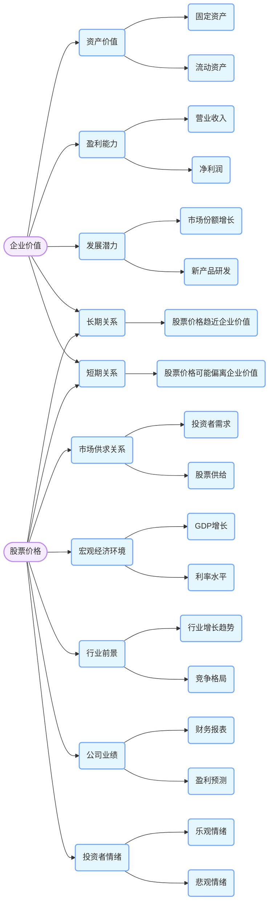

# 巴菲特的投资哲学：企业价值与股票价格的关系

> 关键词：巴菲特投资哲学、企业价值、股票价格、内在价值评估、安全边际

> 摘要：本文深入探讨了巴菲特的投资哲学中企业价值与股票价格的关系。首先介绍了研究此关系的目的、适用读者、文档结构及相关术语。接着阐述了企业价值和股票价格的核心概念及联系，通过流程图展示其逻辑。详细讲解了评估企业价值的核心算法原理，并给出Python代码示例。用数学模型和公式进一步剖析两者关系，结合实际例子加深理解。通过项目实战展示如何搭建环境、实现代码及解读分析。探讨了该投资哲学在不同场景的实际应用，推荐了学习资源、开发工具和相关论文。最后总结未来发展趋势与挑战，解答常见问题，并提供扩展阅读和参考资料，旨在帮助投资者更好地理解和运用巴菲特的投资理念。

## 1. 背景介绍 
### 1.1 目的和范围
本文章的主要目的是深入剖析巴菲特的投资哲学中企业价值与股票价格之间的关系。通过对这一关系的研究，帮助投资者理解如何基于企业的真实价值进行股票投资决策，避免被市场短期的价格波动所误导。范围涵盖了企业价值的评估方法、股票价格的形成机制、两者之间的动态关系，以及如何运用这些知识在实际投资中获取长期稳定的收益。

### 1.2 预期读者
本文预期读者包括对价值投资感兴趣的个人投资者、金融从业者、投资机构研究人员以及相关专业的学生。无论是初涉投资领域的新手，还是有一定经验的投资者，都可以从本文中获取有价值的信息，提升对巴菲特投资哲学的理解和应用能力。

### 1.3 文档结构概述
本文将按照以下结构展开：首先介绍相关的核心概念，包括企业价值和股票价格的定义、内涵以及它们之间的联系，并通过流程图进行直观展示。接着讲解评估企业价值的核心算法原理，并用Python代码实现具体操作步骤。然后运用数学模型和公式进一步阐述两者关系，并结合实际例子进行说明。通过项目实战，展示如何在实际中运用这些知识进行股票投资分析。探讨该投资哲学在不同场景下的实际应用。推荐相关的学习资源、开发工具和论文著作。最后总结未来发展趋势与挑战，解答常见问题，并提供扩展阅读和参考资料。

### 1.4 术语表
#### 1.4.1 核心术语定义
- **企业价值（Enterprise Value）**：指企业的整体价值，包括股权价值和债务价值，反映了企业的内在经济价值。它是对企业未来现金流的折现评估，考虑了企业的资产、负债、盈利能力等多个因素。
- **股票价格（Stock Price）**：指股票在证券市场上的交易价格，由市场供求关系决定，受到众多因素的影响，如宏观经济环境、行业前景、公司业绩、投资者情绪等。
- **内在价值（Intrinsic Value）**：企业的真实价值，是基于企业的基本面和未来发展潜力所估算的价值。巴菲特认为，投资者应该关注企业的内在价值，而不是短期的股票价格波动。
- **安全边际（Margin of Safety）**：指股票价格低于其内在价值的幅度。巴菲特强调，投资者应该在股票价格低于内在价值时买入，以获得安全边际，降低投资风险。

#### 1.4.2 相关概念解释
- **现金流折现模型（Discounted Cash Flow Model）**：一种评估企业价值的常用方法，通过预测企业未来的现金流，并将其折现到当前时刻，得到企业的内在价值。
- **市盈率（Price-to-Earnings Ratio，P/E）**：股票价格与每股收益的比率，反映了市场对企业盈利能力的预期。市盈率越高，说明市场对企业的未来增长预期越高。
- **市净率（Price-to-Book Ratio，P/B）**：股票价格与每股净资产的比率，反映了市场对企业资产价值的评估。市净率越低，说明股票价格相对企业净资产越便宜。

#### 1.4.3 缩略词列表
- **DCF**：Discounted Cash Flow，现金流折现
- **P/E**：Price-to-Earnings Ratio，市盈率
- **P/B**：Price-to-Book Ratio，市净率

## 2. 核心概念与联系 

### 企业价值的概念
企业价值是企业作为一个整体所具有的经济价值，它不仅仅取决于企业当前的资产和负债状况，更重要的是考虑了企业未来的盈利能力和发展潜力。从财务角度来看，企业价值可以通过多种方法进行评估，其中最常用的是现金流折现模型。该模型认为，企业的价值等于其未来预期现金流的现值之和。

### 股票价格的概念
股票价格是股票在证券市场上的交易价格，它是由市场供求关系决定的。当市场上对某只股票的需求大于供给时，股票价格就会上涨；反之，当供给大于需求时，股票价格就会下跌。股票价格受到众多因素的影响，包括宏观经济环境、行业前景、公司业绩、投资者情绪等。

### 企业价值与股票价格的联系
企业价值是股票价格的基础，股票价格应该围绕企业价值上下波动。从长期来看，股票价格会趋近于企业的内在价值。然而，在短期内，股票价格可能会受到市场情绪、投机行为等因素的影响，偏离企业的内在价值。巴菲特认为，投资者应该关注企业的内在价值，而不是短期的股票价格波动。当股票价格低于企业的内在价值时，投资者可以买入股票，获得安全边际；当股票价格高于企业的内在价值时，投资者应该卖出股票。

### 文本示意图
```plaintext
企业价值
|-- 资产价值
|   |-- 固定资产
|   |-- 流动资产
|-- 盈利能力
|   |-- 营业收入
|   |-- 净利润
|-- 发展潜力
|   |-- 市场份额增长
|   |-- 新产品研发

股票价格
|-- 市场供求关系
|   |-- 投资者需求
|   |-- 股票供给
|-- 宏观经济环境
|   |-- GDP增长
|   |-- 利率水平
|-- 行业前景
|   |-- 行业增长趋势
|   |-- 竞争格局
|-- 公司业绩
|   |-- 财务报表
|   |-- 盈利预测
|-- 投资者情绪
|   |-- 乐观情绪
|   |-- 悲观情绪

企业价值与股票价格的关系
|-- 长期：股票价格趋近于企业价值
|-- 短期：股票价格可能偏离企业价值
```

### Mermaid流程图


## 3. 核心算法原理 & 具体操作步骤 

### 现金流折现模型原理
现金流折现模型（DCF）是评估企业价值的核心方法之一。该模型的基本思想是，企业的价值等于其未来预期现金流的现值之和。具体步骤如下：
1. **预测未来现金流**：根据企业的历史财务数据、行业发展趋势和公司战略规划，预测企业未来若干年的自由现金流。自由现金流是指企业在满足了所有必要的资本支出后，剩余的可用于分配给股东和债权人的现金流量。
2. **确定折现率**：折现率是将未来现金流折现到当前时刻的利率，反映了投资者对投资风险的预期。折现率通常采用加权平均资本成本（WACC），它考虑了企业的股权成本和债务成本。
3. **计算现值**：将预测的未来现金流按照折现率折现到当前时刻，得到每个现金流的现值。
4. **计算企业价值**：将所有现金流的现值相加，得到企业的内在价值。

### Python代码实现
```python
import numpy as np

def dcf_valuation(free_cash_flows, discount_rate, terminal_growth_rate):
    """
    现金流折现模型计算企业价值
    :param free_cash_flows: 未来若干年的自由现金流列表
    :param discount_rate: 折现率
    :param terminal_growth_rate: 永续增长率
    :return: 企业的内在价值
    """
    n = len(free_cash_flows)
    # 计算预测期内现金流的现值
    present_values = []
    for i, fcf in enumerate(free_cash_flows):
        pv = fcf / ((1 + discount_rate) ** (i + 1))
        present_values.append(pv)
    
    # 计算终值
    last_fcf = free_cash_flows[-1]
    terminal_value = last_fcf * (1 + terminal_growth_rate) / (discount_rate - terminal_growth_rate)
    terminal_pv = terminal_value / ((1 + discount_rate) ** n)
    
    # 计算企业价值
    enterprise_value = sum(present_values) + terminal_pv
    
    return enterprise_value

# 示例数据
free_cash_flows = [100, 120, 140, 160, 180]
discount_rate = 0.1
terminal_growth_rate = 0.03

# 计算企业价值
value = dcf_valuation(free_cash_flows, discount_rate, terminal_growth_rate)
print(f"企业的内在价值为: {value}")
```

### 代码解释
1. **函数定义**：`dcf_valuation` 函数接受三个参数：未来若干年的自由现金流列表 `free_cash_flows`、折现率 `discount_rate` 和永续增长率 `terminal_growth_rate`。
2. **预测期内现金流的现值计算**：通过循环遍历自由现金流列表，将每个现金流按照折现率折现到当前时刻，得到其现值，并将所有现值存储在 `present_values` 列表中。
3. **终值计算**：使用最后一年的自由现金流，结合永续增长率和折现率，计算企业的终值。终值表示企业在预测期结束后持续经营的价值。
4. **企业价值计算**：将预测期内现金流的现值和终值相加，得到企业的内在价值。

### 具体操作步骤
1. **数据收集**：收集企业的历史财务数据，包括营业收入、净利润、资本支出等，以便预测未来的自由现金流。
2. **未来现金流预测**：根据企业的历史数据和行业发展趋势，使用适当的方法（如线性回归、趋势分析等）预测企业未来若干年的自由现金流。
3. **折现率确定**：确定合适的折现率，通常可以参考同行业的平均加权平均资本成本（WACC）。
4. **永续增长率估计**：估计企业在预测期结束后的永续增长率，一般可以参考行业的长期平均增长率。
5. **计算企业价值**：使用上述代码实现现金流折现模型，计算企业的内在价值。

## 4. 数学模型和公式 & 详细讲解 & 举例说明 

### 现金流折现模型公式
现金流折现模型的基本公式为：
$$
V = \sum_{t=1}^{n} \frac{FCF_t}{(1 + r)^t} + \frac{FCF_n(1 + g)}{(r - g)(1 + r)^n}
$$
其中：
- $V$ 表示企业的内在价值；
- $FCF_t$ 表示第 $t$ 年的自由现金流；
- $r$ 表示折现率；
- $n$ 表示预测期的年数；
- $g$ 表示永续增长率。

### 公式详细讲解
1. **预测期内现金流的现值**：$\sum_{t=1}^{n} \frac{FCF_t}{(1 + r)^t}$ 表示预测期内各年自由现金流的现值之和。将每年的自由现金流按照折现率 $r$ 折现到当前时刻，得到其现值。
2. **终值**：$\frac{FCF_n(1 + g)}{(r - g)(1 + r)^n}$ 表示企业在预测期结束后的终值。假设企业在预测期结束后以永续增长率 $g$ 持续增长，使用戈登增长模型计算终值，并将其折现到当前时刻。

### 举例说明
假设某企业未来 5 年的自由现金流分别为 100 万元、120 万元、140 万元、160 万元和 180 万元，折现率为 10%，永续增长率为 3%。则该企业的内在价值计算如下：

1. **预测期内现金流的现值计算**：
    - 第 1 年：$\frac{100}{(1 + 0.1)^1} \approx 90.91$（万元）
    - 第 2 年：$\frac{120}{(1 + 0.1)^2} \approx 99.17$（万元）
    - 第 3 年：$\frac{140}{(1 + 0.1)^3} \approx 105.18$（万元）
    - 第 4 年：$\frac{160}{(1 + 0.1)^4} \approx 109.29$（万元）
    - 第 5 年：$\frac{180}{(1 + 0.1)^5} \approx 111.77$（万元）
    - 预测期内现金流的现值之和：$90.91 + 99.17 + 105.18 + 109.29 + 111.77 = 516.32$（万元）

2. **终值计算**：
    - 第 5 年的自由现金流为 180 万元，则终值为：
    $\frac{180(1 + 0.03)}{(0.1 - 0.03)(1 + 0.1)^5} \approx \frac{185.4}{0.07 \times 1.61051} \approx 1634.74$（万元）

3. **企业价值计算**：
    - 企业的内在价值为预测期内现金流的现值之和加上终值，即：$516.32 + 1634.74 = 2151.06$（万元）

通过以上计算，我们可以得出该企业的内在价值约为 2151.06 万元。如果该企业的股票价格低于这个价值，那么从巴菲特的投资哲学来看，这可能是一个投资机会。

## 5. 项目实战：代码实际案例和详细解释说明 

### 5.1  开发环境搭建
在进行项目实战之前，我们需要搭建一个合适的开发环境。以下是具体步骤：

#### 安装Python
首先，确保你已经安装了 Python 环境。可以从 Python 官方网站（https://www.python.org/downloads/）下载适合你操作系统的 Python 安装包，并按照安装向导进行安装。建议安装 Python 3.7 及以上版本。

#### 安装必要的库
我们需要安装一些必要的 Python 库，用于数据处理、财务分析和可视化。可以使用以下命令通过 pip 进行安装：
```sh
pip install numpy pandas matplotlib
```
- `numpy`：用于数值计算和数组操作。
- `pandas`：用于数据处理和分析。
- `matplotlib`：用于数据可视化。

### 5.2  源代码详细实现和代码解读
以下是一个完整的项目实战代码示例，用于评估某企业的内在价值，并将结果进行可视化展示。

```python
import numpy as np
import pandas as pd
import matplotlib.pyplot as plt

def dcf_valuation(free_cash_flows, discount_rate, terminal_growth_rate):
    """
    现金流折现模型计算企业价值
    :param free_cash_flows: 未来若干年的自由现金流列表
    :param discount_rate: 折现率
    :param terminal_growth_rate: 永续增长率
    :return: 企业的内在价值
    """
    n = len(free_cash_flows)
    # 计算预测期内现金流的现值
    present_values = []
    for i, fcf in enumerate(free_cash_flows):
        pv = fcf / ((1 + discount_rate) ** (i + 1))
        present_values.append(pv)
    
    # 计算终值
    last_fcf = free_cash_flows[-1]
    terminal_value = last_fcf * (1 + terminal_growth_rate) / (discount_rate - terminal_growth_rate)
    terminal_pv = terminal_value / ((1 + discount_rate) ** n)
    
    # 计算企业价值
    enterprise_value = sum(present_values) + terminal_pv
    
    return enterprise_value

# 示例数据
years = [2024, 2025, 2026, 2027, 2028]
free_cash_flows = [100, 120, 140, 160, 180]
discount_rate = 0.1
terminal_growth_rate = 0.03

# 计算企业价值
value = dcf_valuation(free_cash_flows, discount_rate, terminal_growth_rate)
print(f"企业的内在价值为: {value}")

# 可视化自由现金流和现值
df = pd.DataFrame({
    'Year': years,
    'Free Cash Flow': free_cash_flows
})

# 计算现值
present_values = []
for i, fcf in enumerate(free_cash_flows):
    pv = fcf / ((1 + discount_rate) ** (i + 1))
    present_values.append(pv)

df['Present Value'] = present_values

# 绘制图表
plt.figure(figsize=(10, 6))
plt.bar(df['Year'], df['Free Cash Flow'], label='Free Cash Flow', color='blue')
plt.bar(df['Year'], df['Present Value'], label='Present Value', color='orange')
plt.title('Free Cash Flow and Present Value')
plt.xlabel('Year')
plt.ylabel('Amount')
plt.legend()
plt.grid(True)
plt.show()
```

### 代码解读与分析
#### 现金流折现模型函数
`dcf_valuation` 函数用于计算企业的内在价值，其原理和实现与前面介绍的一致。该函数接受未来若干年的自由现金流列表、折现率和永续增长率作为输入，返回企业的内在价值。

#### 数据准备
我们定义了示例数据，包括未来 5 年的年份、自由现金流、折现率和永续增长率。这些数据可以根据实际情况进行修改。

#### 企业价值计算
调用 `dcf_valuation` 函数计算企业的内在价值，并将结果打印输出。

#### 数据可视化
使用 `pandas` 库将年份、自由现金流和现值数据存储在一个数据框中。然后使用 `matplotlib` 库绘制柱状图，直观地展示自由现金流和现值的变化情况。

通过这个项目实战，我们可以更直观地理解现金流折现模型的应用，以及如何使用 Python 进行企业价值评估和数据可视化。

## 6. 实际应用场景 
### 股票投资决策
巴菲特的投资哲学在股票投资决策中具有重要的应用价值。投资者可以通过评估企业的内在价值，判断股票价格是否被低估或高估。当股票价格低于企业的内在价值时，投资者可以考虑买入股票；当股票价格高于企业的内在价值时，投资者可以考虑卖出股票。例如，巴菲特在投资可口可乐公司时，通过深入分析公司的基本面和未来发展潜力，认为其内在价值远高于当时的股票价格，于是大量买入可口可乐的股票，最终获得了丰厚的回报。

### 企业并购评估
在企业并购中，收购方需要评估目标企业的价值，以确定合理的收购价格。现金流折现模型可以帮助收购方估算目标企业的内在价值，从而避免支付过高的收购价格。例如，在某公司收购另一家公司的案例中，收购方通过使用现金流折现模型，评估了目标企业的未来现金流和盈利能力，最终确定了一个合理的收购价格，实现了双赢的局面。

### 投资组合管理
投资者可以运用巴菲特的投资哲学来构建和管理投资组合。通过选择具有较高内在价值和安全边际的股票，投资者可以降低投资组合的风险，提高投资回报率。例如，投资者可以将资金分散投资于不同行业、不同规模的优质企业，以实现投资组合的多元化和稳定性。

### 企业战略规划
企业管理者可以借鉴巴菲特的投资哲学，从价值创造的角度进行企业战略规划。通过关注企业的核心竞争力和未来发展潜力，制定合理的战略目标和行动计划，提高企业的内在价值。例如，企业可以加大研发投入，推出新产品，拓展市场份额，从而提升企业的盈利能力和市场价值。

## 7. 工具和资源推荐
### 7.1 学习资源推荐
#### 7.1.1 书籍推荐
- 《聪明的投资者》（The Intelligent Investor）：本杰明·格雷厄姆（Benjamin Graham）著，被誉为投资界的圣经。这本书介绍了价值投资的基本理念和方法，对巴菲特的投资哲学产生了深远的影响。
- 《巴菲特致股东的信：股份公司教程》（Letters to Shareholders of Berkshire Hathaway）：沃伦·巴菲特（Warren Buffett）著，收录了巴菲特历年写给股东的信，从中可以深入了解他的投资思想、管理理念和对市场的看法。
- 《穷查理宝典：查理·芒格的智慧箴言录》（Poor Charlie's Almanack: The Wit and Wisdom of Charles T. Munger）：彼得·考夫曼（Peter D. Kaufman）编著，介绍了巴菲特的合作伙伴查理·芒格的投资智慧和多元思维模型。

#### 7.1.2 在线课程
- Coursera 上的“投资学原理”（Principles of Investing）：由哥伦比亚大学教授授课，介绍了投资的基本原理和方法，包括价值投资、资产定价等内容。
- edX 上的“财务分析与决策”（Financial Analysis and Decision Making）：由麻省理工学院教授授课，帮助学习者掌握财务分析的基本方法和工具，提高投资决策能力。

#### 7.1.3 技术博客和网站
- 雪球网（https://xueqiu.com/）：国内知名的投资社区，提供股票、基金等投资产品的资讯、分析和讨论。
- 价值投资网（https://www.value-investing.info/）：专注于价值投资的知识分享和交流，提供大量的投资案例和分析文章。

### 7.2 开发工具框架推荐
#### 7.2.1 IDE和编辑器
- PyCharm：一款专业的 Python 集成开发环境，提供丰富的代码编辑、调试和分析功能，适合开发复杂的 Python 项目。
- Jupyter Notebook：一种交互式的开发环境，支持代码、文本、图表等多种形式的展示，非常适合进行数据探索和分析。

#### 7.2.2 调试和性能分析工具
- pdb：Python 内置的调试工具，可以帮助开发者逐行调试代码，查找问题。
- cProfile：Python 标准库中的性能分析工具，可以分析代码的运行时间和函数调用情况，帮助优化代码性能。

#### 7.2.3 相关框架和库
- Pandas：用于数据处理和分析的 Python 库，提供了高效的数据结构和数据分析工具。
- NumPy：用于数值计算的 Python 库，提供了多维数组对象和各种数学函数。
- Matplotlib：用于数据可视化的 Python 库，可以绘制各种类型的图表和图形。

### 7.3 相关论文著作推荐
#### 7.3.1 经典论文
- “The Theory of Investment Value”（投资价值理论）：约翰·伯尔·威廉姆斯（John Burr Williams）著，提出了现金流折现模型的基本思想，为价值投资奠定了理论基础。
- “Security Analysis”（证券分析）：本杰明·格雷厄姆（Benjamin Graham）和大卫·多德（David Dodd）著，系统地阐述了价值投资的理论和方法，是价值投资领域的经典之作。

#### 7.3.2 最新研究成果
- 《价值投资的新时代》（The New Era of Value Investing）：探讨了在新的市场环境下，价值投资的理论和方法的发展和应用。
- 《行为金融学与价值投资》（Behavioral Finance and Value Investing）：研究了投资者的行为心理对价值投资的影响，为价值投资提供了新的视角。

#### 7.3.3 应用案例分析
- 《巴菲特投资案例集》：收集了巴菲特历年的投资案例，详细分析了他的投资决策过程和成功经验。
- 《企业并购中的价值评估案例分析》：通过实际案例，介绍了在企业并购中如何运用现金流折现模型等方法进行价值评估。

## 8. 总结：未来发展趋势与挑战
### 未来发展趋势
#### 数字化和智能化应用
随着科技的不断发展，数字化和智能化技术将在价值投资领域得到更广泛的应用。例如，利用大数据和人工智能技术可以更准确地预测企业的未来现金流和盈利能力，提高企业价值评估的准确性和效率。

#### 跨学科融合
价值投资将与其他学科，如行为金融学、管理学、经济学等进行更深入的融合。通过综合运用不同学科的知识和方法，可以更好地理解市场和企业的行为，为投资决策提供更全面的支持。

#### 社会责任投资
越来越多的投资者开始关注企业的社会责任和可持续发展。未来，价值投资将更加注重企业的社会价值和环境影响，将社会责任纳入企业价值评估的范畴。

### 挑战
#### 数据质量和可靠性
价值投资依赖于准确的财务数据和市场信息。然而，数据质量和可靠性可能存在问题，如财务报表造假、市场信息不对称等。投资者需要具备较强的数据分析和判断能力，以确保所使用的数据的真实性和有效性。

#### 市场不确定性
市场环境充满不确定性，宏观经济波动、政策变化、行业竞争等因素都可能对企业的价值和股票价格产生影响。投资者需要具备较强的风险意识和应对能力，及时调整投资策略。

#### 投资者情绪和行为偏差
投资者的情绪和行为偏差可能导致市场价格偏离企业的内在价值。例如，投资者的过度乐观或悲观情绪可能引发市场的泡沫或恐慌。投资者需要保持理性和冷静，避免受到情绪的影响。

## 9. 附录：常见问题与解答
### 问题1：现金流折现模型的假设条件有哪些？
答：现金流折现模型的主要假设条件包括：未来现金流可以准确预测；折现率在预测期内保持不变；企业在预测期结束后以永续增长率持续增长。然而，在实际应用中，这些假设条件可能并不完全成立，因此需要投资者根据实际情况进行合理调整。

### 问题2：如何确定折现率和永续增长率？
答：折现率通常采用加权平均资本成本（WACC），它考虑了企业的股权成本和债务成本。可以通过参考同行业的平均 WACC 或使用资本资产定价模型（CAPM）来确定折现率。永续增长率一般可以参考行业的长期平均增长率，但要注意不能过高估计，以免高估企业的价值。

### 问题3：企业价值评估的结果是否准确可靠？
答：企业价值评估的结果受到多种因素的影响，如预测的准确性、假设条件的合理性等。因此，评估结果只是一个估计值，具有一定的不确定性。投资者应该将评估结果作为参考，结合其他因素进行综合分析和判断。

### 问题4：巴菲特的投资哲学是否适用于所有投资者？
答：巴菲特的投资哲学强调长期价值投资，注重企业的基本面和内在价值。虽然这种投资哲学具有一定的普遍性和适用性，但并不适用于所有投资者。不同的投资者具有不同的投资目标、风险承受能力和投资期限，需要根据自身情况选择合适的投资策略。

## 10. 扩展阅读 & 参考资料
### 扩展阅读
- 《金融炼金术》（The Alchemy of Finance）：乔治·索罗斯（George Soros）著，介绍了他的反身性理论和投资哲学。
- 《黑天鹅：如何应对不可预知的未来》（The Black Swan: The Impact of the Highly Improbable）：纳西姆·尼古拉斯·塔勒布（Nassim Nicholas Taleb）著，探讨了不确定性和随机性对投资的影响。

### 参考资料
- Graham, B., & Dodd, D. (1934). Security Analysis. McGraw-Hill.
- Williams, J. B. (1938). The Theory of Investment Value. Harvard University Press.
- Buffett, W. (Various years). Letters to Shareholders of Berkshire Hathaway. Berkshire Hathaway.

作者：AI天才研究院/AI Genius Institute & 禅与计算机程序设计艺术 /Zen And The Art of Computer Programming