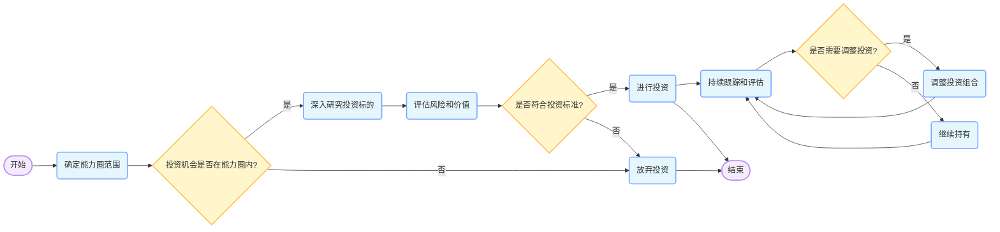

# 巴菲特的投资哲学：理解你的能力圈

> 关键词：巴菲特、投资哲学、能力圈、价值投资、风险控制

> 摘要：本文深入探讨了巴菲特的投资哲学中“理解你的能力圈”这一核心观点。从背景介绍入手，阐述了目的、预期读者、文档结构和相关术语。详细解释了能力圈的核心概念及其与投资的联系，分析了相关的核心算法原理和操作步骤，并通过数学模型和公式进行说明。结合项目实战给出实际代码案例及解读，探讨了该投资哲学在不同场景下的应用，推荐了学习资源、开发工具和相关论文著作。最后总结了未来发展趋势与挑战，提供常见问题解答和扩展阅读参考资料，旨在帮助投资者更好地理解和运用巴菲特的能力圈投资哲学。

## 1. 背景介绍 
### 1.1 目的和范围
本文章的主要目的是深入剖析巴菲特投资哲学中“理解你的能力圈”这一关键理念。通过详细的分析和阐述，帮助投资者准确理解能力圈的概念、重要性以及如何在实际投资中应用这一理念。范围涵盖了能力圈的理论基础、实际操作方法、在不同市场环境下的应用场景，以及相关的学习资源和未来发展趋势等方面。

### 1.2 预期读者
本文预期读者主要包括各类投资者，无论是初入投资领域的新手，还是有一定经验的专业投资者，都能从文章中获得有价值的信息。同时，对于对金融投资理论感兴趣的学者、研究人员，以及从事金融相关工作的从业者，本文也具有一定的参考价值。

### 1.3 文档结构概述
本文将按照以下结构进行阐述：首先介绍背景信息，包括目的、读者群体、文档结构和术语表；接着详细讲解能力圈的核心概念及其与投资的联系，并给出相应的示意图和流程图；然后分析核心算法原理和具体操作步骤，用Python代码进行说明；再通过数学模型和公式进一步解释能力圈的应用；结合实际项目给出代码案例并进行详细解读；探讨能力圈投资哲学在不同场景下的实际应用；推荐相关的学习资源、开发工具和论文著作；最后总结未来发展趋势与挑战，提供常见问题解答和扩展阅读参考资料。

### 1.4 术语表
#### 1.4.1 核心术语定义
- **能力圈**：指投资者所具备的对特定行业、公司或投资领域的知识、经验和理解的范围。在这个范围内，投资者能够相对准确地评估投资机会的价值和风险。
- **价值投资**：一种投资策略，强调通过分析公司的基本面，寻找被低估的股票，以长期持有为目标，获取企业内在价值增长带来的收益。
- **安全边际**：在投资中，安全边际是指股票的市场价格低于其内在价值的程度。它为投资者提供了一定的缓冲，降低了投资风险。

#### 1.4.2 相关概念解释
- **内在价值**：公司的内在价值是指其未来现金流的现值。它是基于公司的财务状况、盈利能力、行业前景等因素综合评估得出的一个理论价值。
- **护城河**：这一概念由巴菲特提出，指的是公司所拥有的可持续竞争优势，如同城堡周围的护城河一样，能够保护公司的市场份额和盈利能力，使其在竞争中脱颖而出。

#### 1.4.3 缩略词列表
- **PE**：市盈率（Price-to-Earnings Ratio），是指股票价格除以每股收益的比率，用于衡量股票的估值水平。
- **ROE**：净资产收益率（Return on Equity），是指公司净利润与净资产的比率，反映了公司运用自有资本的效率。

## 2. 核心概念与联系 
### 能力圈的核心概念原理
巴菲特认为，投资者应该专注于自己熟悉的领域，即能力圈。每个人的知识和经验都是有限的，只有在自己擅长的领域内，投资者才能更准确地评估公司的价值和风险。能力圈的形成是一个长期的过程，它基于投资者的学习、实践和经验积累。例如，一个有多年医药行业工作经验的投资者，对医药公司的研发、生产、销售等环节有深入的了解，那么医药行业就可能是他的能力圈范围。

### 能力圈与投资的联系
能力圈与投资决策密切相关。在能力圈内进行投资，投资者能够更好地理解公司的业务模式、竞争优势和发展前景，从而做出更明智的投资决策。同时，能力圈也有助于投资者控制风险。因为投资者对能力圈内的公司有更深入的了解，能够更准确地评估其风险水平，避免盲目投资。例如，如果一个投资者不了解科技行业的技术发展趋势和竞争格局，却贸然投资科技股，就可能面临较大的风险。

### 文本示意图
```plaintext
能力圈
|--知识储备
|   |--行业知识
|   |--公司分析方法
|--经验积累
|   |--投资实践经验
|   |--行业观察经验
|--投资决策
|   |--筛选投资标的
|   |--评估风险和价值
|--风险控制
|   |--避免盲目投资
|   |--降低投资损失
```

### Mermaid流程图


## 3. 核心算法原理 & 具体操作步骤 
### 核心算法原理
从投资的角度来看，我们可以将能力圈的评估过程看作一个筛选和评估的算法。其核心思想是通过对投资标的的各项指标进行评估，判断其是否在投资者的能力圈内，以及是否具有投资价值。以下是一个简化的算法步骤：
1. **确定能力圈范围**：根据投资者的知识和经验，确定自己熟悉的行业、公司类型等范围。
2. **筛选投资标的**：从市场上的众多投资标的中，筛选出位于能力圈内的标的。
3. **评估投资标的**：对筛选出的投资标的进行详细评估，包括公司的财务状况、盈利能力、竞争优势等。
4. **判断投资价值**：根据评估结果，判断投资标的是否具有投资价值，是否符合投资者的投资标准。

### 具体操作步骤及Python代码实现
```python
# 步骤1：确定能力圈范围
# 假设能力圈范围用行业列表表示
ability_circle = ['医药', '消费']

# 步骤2：筛选投资标的
# 假设有一个投资标的列表，每个标的用字典表示，包含名称和行业信息
investment_targets = [
    {'name': '公司A', 'industry': '医药'},
    {'name': '公司B', 'industry': '科技'},
    {'name': '公司C', 'industry': '消费'}
]

# 筛选出位于能力圈内的投资标的
selected_targets = []
for target in investment_targets:
    if target['industry'] in ability_circle:
        selected_targets.append(target)

print("筛选出的投资标的：", selected_targets)

# 步骤3：评估投资标的
# 假设我们使用市盈率（PE）和净资产收益率（ROE）来评估公司的投资价值
# 定义一个函数来评估投资标的
def evaluate_target(target):
    # 这里假设我们已经有了公司的PE和ROE数据
    # 为了简化，我们随机生成一些数据
    import random
    pe = random.uniform(10, 30)
    roe = random.uniform(0.1, 0.3)
    # 设定评估标准：PE < 20 且 ROE > 0.2
    if pe < 20 and roe > 0.2:
        return True
    else:
        return False

# 对筛选出的投资标的进行评估
qualified_targets = []
for target in selected_targets:
    if evaluate_target(target):
        qualified_targets.append(target)

print("符合投资标准的投资标的：", qualified_targets)

# 步骤4：判断投资价值
# 这里我们简单地认为符合评估标准的标的就具有投资价值
# 可以根据实际情况进一步完善判断逻辑
```

## 4. 数学模型和公式 & 详细讲解 & 举例说明 
### 内在价值评估模型
在价值投资中，评估公司的内在价值是核心环节。一个常用的数学模型是现金流折现模型（Discounted Cash Flow, DCF）。该模型的基本思想是将公司未来的现金流折现到当前时刻，以此来估算公司的内在价值。

#### 公式
$$V = \sum_{t=1}^{n} \frac{CF_t}{(1 + r)^t}$$

其中：
- $V$ 表示公司的内在价值
- $CF_t$ 表示第 $t$ 期的现金流
- $r$ 表示折现率
- $n$ 表示预测的期数

#### 详细讲解
- **现金流（$CF_t$）**：指公司在未来各期产生的现金流量。它可以通过公司的财务报表和业务分析来预测。例如，对于一家制造业公司，现金流可能包括销售收入减去成本、费用和税收后的剩余现金。
- **折现率（$r$）**：反映了资金的时间价值和投资的风险。一般来说，折现率越高，未来现金流的现值就越低。折现率的确定需要考虑多种因素，如市场利率、公司的风险水平等。
- **预测期数（$n$）**：表示我们预测公司现金流的期限。通常，预测期数越长，不确定性就越大。

#### 举例说明
假设我们要评估一家公司的内在价值，预测该公司未来 5 年的现金流分别为 100 万元、120 万元、150 万元、180 万元和 200 万元，折现率为 10%。则该公司的内在价值计算如下：

$$
\begin{align*}
V &= \frac{100}{(1 + 0.1)^1} + \frac{120}{(1 + 0.1)^2} + \frac{150}{(1 + 0.1)^3} + \frac{180}{(1 + 0.1)^4} + \frac{200}{(1 + 0.1)^5}\\
&= \frac{100}{1.1} + \frac{120}{1.21} + \frac{150}{1.331} + \frac{180}{1.4641} + \frac{200}{1.61051}\\
&\approx 90.91 + 99.17 + 112.69 + 122.94 + 124.18\\
&= 549.89 \text{（万元）}
\end{align*}
$$

### 安全边际计算
安全边际是价值投资中的另一个重要概念，它可以用以下公式计算：

#### 公式
$$安全边际 = \frac{内在价值 - 市场价格}{内在价值} \times 100\%$$

#### 详细讲解
安全边际反映了股票的市场价格低于其内在价值的程度。安全边际越高，投资的风险就越低。例如，如果一家公司的内在价值为 100 元，市场价格为 80 元，则安全边际为：

$$安全边际 = \frac{100 - 80}{100} \times 100\% = 20\%$$

#### 举例说明
假设我们通过现金流折现模型计算出一家公司的内在价值为 200 元，而该公司的当前市场价格为 150 元。则安全边际为：

$$安全边际 = \frac{200 - 150}{200} \times 100\% = 25\%$$

这意味着该股票的市场价格相对于其内在价值有 25% 的折扣，为投资者提供了一定的安全缓冲。

## 5. 项目实战：代码实际案例和详细解释说明 
### 5.1  开发环境搭建
- **操作系统**：可以选择 Windows、Mac OS 或 Linux 操作系统。
- **Python 环境**：安装 Python 3.x 版本。可以从 Python 官方网站（https://www.python.org/downloads/）下载并安装。
- **开发工具**：推荐使用 PyCharm 或 Jupyter Notebook。PyCharm 是一款专业的 Python 集成开发环境，提供了丰富的功能和工具；Jupyter Notebook 则适合进行交互式编程和数据分析。
- **第三方库**：需要安装一些常用的第三方库，如 `pandas`、`numpy`、`matplotlib` 等。可以使用 `pip` 命令进行安装，例如：
```bash
pip install pandas numpy matplotlib
```

### 5.2  源代码详细实现和代码解读
以下是一个更完整的投资项目实战代码案例，用于筛选符合能力圈和投资标准的股票：

```python
import pandas as pd
import numpy as np
import matplotlib.pyplot as plt

# 步骤1：确定能力圈范围
ability_circle = ['医药', '消费']

# 步骤2：读取股票数据
# 假设我们有一个包含股票信息的 CSV 文件，文件名为 stocks.csv
# 文件包含列：股票名称、行业、市盈率（PE）、净资产收益率（ROE）
data = pd.read_csv('stocks.csv')

# 步骤3：筛选出位于能力圈内的股票
selected_stocks = data[data['行业'].isin(ability_circle)]

# 步骤4：评估股票的投资价值
# 设定评估标准：PE < 20 且 ROE > 0.2
qualified_stocks = selected_stocks[(selected_stocks['市盈率'] < 20) & (selected_stocks['净资产收益率'] > 0.2)]

# 步骤5：可视化分析
# 绘制合格股票的市盈率和净资产收益率散点图
plt.scatter(qualified_stocks['市盈率'], qualified_stocks['净资产收益率'])
plt.xlabel('市盈率')
plt.ylabel('净资产收益率')
plt.title('符合投资标准的股票')
plt.show()

# 步骤6：输出结果
print("符合投资标准的股票：")
print(qualified_stocks[['股票名称', '行业', '市盈率', '净资产收益率']])
```

### 代码解读与分析
- **步骤1**：确定能力圈范围，使用一个列表 `ability_circle` 来表示。
- **步骤2**：使用 `pandas` 库的 `read_csv` 函数读取包含股票信息的 CSV 文件，将数据存储在 `data` 变量中。
- **步骤3**：使用 `isin` 方法筛选出位于能力圈内的股票，将结果存储在 `selected_stocks` 变量中。
- **步骤4**：根据设定的评估标准（PE < 20 且 ROE > 0.2），筛选出符合投资价值的股票，将结果存储在 `qualified_stocks` 变量中。
- **步骤5**：使用 `matplotlib` 库绘制合格股票的市盈率和净资产收益率散点图，直观展示股票的投资价值。
- **步骤6**：输出符合投资标准的股票的相关信息，包括股票名称、行业、市盈率和净资产收益率。

## 6. 实际应用场景 
### 个人投资者
对于个人投资者来说，理解和运用能力圈投资哲学可以帮助他们避免盲目跟风投资，降低投资风险。例如，一个有医学背景的个人投资者可以专注于医药行业的股票投资。他可以凭借自己对医药行业的专业知识，深入了解医药公司的研发管线、产品竞争力等因素，从而更准确地评估公司的价值和发展前景。同时，在能力圈内投资也可以让个人投资者更有信心地长期持有股票，享受企业成长带来的收益。

### 机构投资者
机构投资者管理着大量的资金，需要进行多元化的投资组合管理。能力圈投资哲学同样适用于机构投资者。例如，一家专注于消费行业的基金公司，其投资团队对消费行业有深入的研究和了解。在选择投资标的时，他们会优先考虑消费行业内的优质公司，通过对公司的财务状况、品牌影响力、市场份额等方面的分析，筛选出具有投资价值的股票。同时，机构投资者还可以利用自己的资源和专业优势，对能力圈内的公司进行更深入的调研和跟踪，及时调整投资组合。

### 创业投资
在创业投资领域，能力圈投资哲学也具有重要的指导意义。创业投资者需要对不同的创业项目进行评估和选择。如果投资者对某个行业有丰富的经验和深入的了解，那么他在评估该行业的创业项目时会更有优势。例如，一个有互联网行业背景的创业投资者，他能够更好地理解互联网创业项目的商业模式、技术创新和市场潜力，从而更准确地判断项目的投资价值。同时，投资者还可以利用自己的人脉和资源，为创业项目提供支持和帮助，提高项目的成功率。

## 7. 工具和资源推荐
### 7.1 学习资源推荐
#### 7.1.1 书籍推荐
- 《聪明的投资者》（The Intelligent Investor）：作者是本杰明·格雷厄姆（Benjamin Graham），这本书是价值投资的经典之作，对巴菲特的投资哲学产生了深远的影响。书中详细阐述了价值投资的理念、方法和策略，适合投资者深入学习。
- 《巴菲特致股东的信：股份公司教程》（Letters to Shareholders of Berkshire Hathaway）：这本书收录了巴菲特历年致股东的信，通过这些信件，读者可以直接了解巴菲特的投资思想、决策过程和对市场的看法。
- 《穷查理宝典：查理·芒格的智慧箴言录》（Poor Charlie's Almanack: The Wit and Wisdom of Charles T. Munger）：查理·芒格是巴菲特的长期合作伙伴，这本书汇集了芒格的演讲、文章和名言，展现了他独特的思维方式和投资哲学。

#### 7.1.2 在线课程
- Coursera 上的“投资学原理”（Principles of Investing）课程：该课程由知名教授授课，涵盖了投资的基本概念、理论和方法，对理解巴菲特的投资哲学有很大的帮助。
- edX 上的“价值投资基础”（Foundations of Value Investing）课程：课程详细介绍了价值投资的核心原理和分析方法，适合初学者和有一定投资基础的学习者。

#### 7.1.3 技术博客和网站
- 雪球网（https://xueqiu.com/）：国内知名的投资社区，提供股票、基金等投资品种的分析和讨论。投资者可以在雪球网上关注巴菲特的相关话题，与其他投资者交流投资经验。
- Seeking Alpha（https://seekingalpha.com/）：国外的投资研究网站，提供大量的股票分析报告和投资策略文章。网站上有很多关于巴菲特投资哲学的讨论和解读。

### 7.2 开发工具框架推荐
#### 7.2.1 IDE和编辑器
- PyCharm：专业的 Python 集成开发环境，具有代码编辑、调试、代码分析等功能，适合进行投资数据分析和算法实现。
- Jupyter Notebook：交互式编程环境，支持 Python、R 等多种编程语言。可以方便地进行数据可视化和代码演示，适合进行投资项目的探索和实验。

#### 7.2.2 调试和性能分析工具
- `pdb`：Python 自带的调试工具，可以帮助开发者定位代码中的问题。
- `cProfile`：Python 的性能分析工具，可以分析代码的运行时间和函数调用情况，帮助优化代码性能。

#### 7.2.3 相关框架和库
- `pandas`：强大的数据处理和分析库，提供了丰富的数据结构和数据操作方法，适合进行股票数据的处理和分析。
- `numpy`：用于科学计算的基础库，提供了高效的数组操作和数学函数，在投资数据分析中经常使用。
- `matplotlib`：用于数据可视化的库，可以绘制各种类型的图表，如折线图、散点图、柱状图等，帮助投资者直观地展示数据和分析结果。

### 7.3 相关论文著作推荐
#### 7.3.1 经典论文
- “The Superinvestors of Graham-and-Doddsville”：巴菲特在 1984 年发表的论文，通过分析多位遵循格雷厄姆价值投资理念的投资者的业绩，证明了价值投资的有效性。
- “Security Analysis”：本杰明·格雷厄姆和大卫·多德（David Dodd）撰写的经典论文，奠定了价值投资的理论基础。

#### 7.3.2 最新研究成果
- 关注顶级金融学术期刊，如《Journal of Finance》、《Journal of Financial Economics》等，这些期刊会发表关于投资理论和实践的最新研究成果。
- 一些知名研究机构，如沃顿商学院、芝加哥大学布斯商学院等的研究报告，也会对巴菲特的投资哲学进行深入研究和分析。

#### 7.3.3 应用案例分析
- 可以通过研究巴菲特旗下伯克希尔·哈撒韦公司的年报和投资案例，了解巴菲特在实际投资中的决策过程和方法。
- 一些投资研究机构和咨询公司也会发布关于巴菲特投资案例的分析报告，帮助投资者更好地理解和应用能力圈投资哲学。

## 8. 总结：未来发展趋势与挑战
### 未来发展趋势
- **科技与投资的融合**：随着科技的不断发展，人工智能、大数据等技术将在投资领域得到更广泛的应用。投资者可以利用这些技术更高效地分析数据、筛选投资标的，提高投资决策的准确性。例如，通过机器学习算法对大量的财务数据和市场数据进行分析，挖掘潜在的投资机会。
- **全球投资视野**：经济全球化的趋势使得投资市场越来越互联互通。投资者需要具备更广阔的全球投资视野，不仅关注国内市场，还要关注国际市场的动态。巴菲特的能力圈投资哲学也需要在全球范围内进行拓展和应用，投资者需要不断学习和了解不同国家和地区的市场特点和投资环境。
- **可持续投资的兴起**：随着社会对环境保护、社会责任等问题的关注度不断提高，可持续投资将成为未来的发展趋势。投资者在进行投资决策时，不仅要考虑公司的财务业绩，还要考虑公司的环境、社会和治理（ESG）因素。能力圈投资哲学也需要适应这一趋势，投资者需要在自己的能力圈内关注和研究具有良好 ESG 表现的公司。

### 挑战
- **知识更新的压力**：投资市场和经济环境不断变化，新的行业和技术不断涌现。投资者需要不断学习和更新自己的知识，以适应市场的变化。保持和拓展自己的能力圈需要付出大量的时间和精力，这对投资者来说是一个巨大的挑战。
- **市场情绪的影响**：市场情绪往往会对投资者的决策产生影响。在市场繁荣时期，投资者容易受到乐观情绪的影响，盲目扩大自己的投资范围，超出自己的能力圈；在市场低迷时期，投资者又容易受到恐慌情绪的影响，做出错误的投资决策。如何克服市场情绪的影响，坚持在能力圈内进行投资，是投资者需要面对的一个重要挑战。
- **竞争加剧**：随着投资市场的发展，越来越多的投资者和投资机构进入市场，竞争日益激烈。在能力圈内寻找具有投资价值的标的变得越来越困难。投资者需要不断提高自己的分析能力和投资技巧，才能在竞争中脱颖而出。

## 9. 附录：常见问题与解答
### 问题1：如何确定自己的能力圈范围？
答：确定自己的能力圈范围需要考虑多个因素。首先，可以从自己的专业背景、工作经验和兴趣爱好入手。例如，如果你是一名医生，那么医药行业可能是你的能力圈范围；如果你对科技行业有浓厚的兴趣，并且有一定的学习和研究，那么科技行业也可以纳入你的能力圈。其次，可以通过不断学习和实践来拓展自己的能力圈。阅读相关的书籍、文章，参加培训课程，与行业内的人士交流等，都可以帮助你增加对不同行业的了解。最后，要通过实际投资经验来检验和调整自己的能力圈。在投资过程中，不断总结经验教训，发现自己的优势和不足，及时调整能力圈的范围。

### 问题2：如果投资机会不在能力圈内，是否一定不能投资？
答：不一定。虽然巴菲特强调要在能力圈内进行投资，但这并不意味着绝对不能投资能力圈外的机会。如果投资者有足够的时间和精力去学习和了解一个新的行业或领域，并且能够对投资机会进行充分的评估和分析，那么也可以考虑进行投资。不过，在投资能力圈外的机会时，投资者需要更加谨慎，要充分认识到其中的风险。可以从小额投资开始，逐步积累经验，同时要密切关注投资项目的进展情况，及时调整投资策略。

### 问题3：能力圈会随着时间变化吗？
答：会的。能力圈不是一成不变的，它会随着时间的推移和投资者自身的发展而发生变化。一方面，随着投资者不断学习和实践，他们的知识和经验会不断增加，能力圈也会相应地扩大。例如，一个原本只熟悉消费行业的投资者，通过学习和研究，逐渐对科技行业有了更深入的了解，那么科技行业就可能纳入他的能力圈范围。另一方面，市场环境和行业发展也会发生变化，一些原本熟悉的行业可能会变得陌生，投资者需要及时调整自己的能力圈。例如，随着科技的快速发展，一些传统行业可能会面临转型和升级，如果投资者不能及时跟上行业的变化，那么这些行业可能就不再属于他的能力圈了。

## 10. 扩展阅读 & 参考资料
### 扩展阅读
- 《金融炼金术》（The Alchemy of Finance）：作者是乔治·索罗斯（George Soros），这本书阐述了索罗斯的投资哲学和金融市场理论，与巴菲特的投资哲学形成了鲜明的对比，可以帮助读者从不同的角度理解投资。
- 《黑天鹅：如何应对不可预知的未来》（The Black Swan: The Impact of the Highly Improbable）：作者是纳西姆·尼古拉斯·塔勒布（Nassim Nicholas Taleb），书中探讨了极端事件对金融市场和投资的影响，提醒投资者要关注不确定性和风险。

### 参考资料
- 巴菲特历年致股东的信：可以从伯克希尔·哈撒韦公司的官方网站（https://www.berkshirehathaway.com/）获取。
- 本杰明·格雷厄姆的著作《聪明的投资者》和《证券分析》的电子版和纸质版。
- 相关的金融学术期刊和研究报告，如《Journal of Finance》、《Journal of Financial Economics》等。

作者：AI天才研究院/AI Genius Institute & 禅与计算机程序设计艺术 /Zen And The Art of Computer Programming