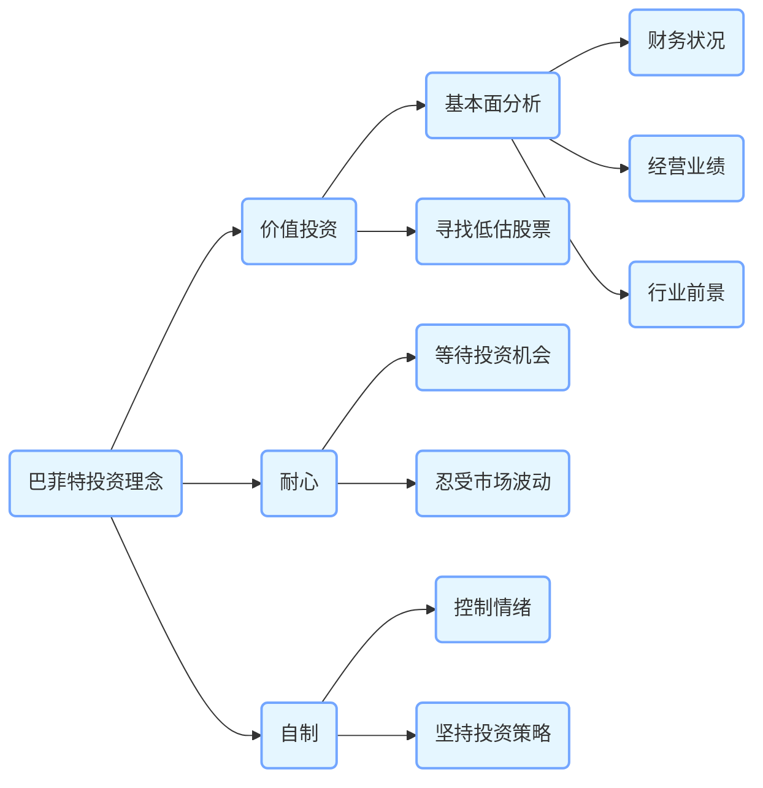

# 巴菲特的投资纪律：耐心和自制的重要性

> 关键词：巴菲特、投资纪律、耐心、自制、价值投资

> 摘要：本文围绕巴菲特投资纪律中耐心和自制的重要性展开深入探讨。通过详细介绍相关背景知识，阐述核心概念及联系，分析核心算法原理和操作步骤，引入数学模型和公式进行说明，结合项目实战案例解读，探讨实际应用场景，推荐学习资源、开发工具和相关论文著作等内容，全面揭示了耐心和自制在投资领域的关键作用，同时对未来投资领域中坚持这些纪律面临的趋势与挑战进行了总结，并提供常见问题解答和扩展阅读参考资料。

## 1. 背景介绍 
### 1.1 目的和范围
本文旨在深入剖析巴菲特投资纪律中耐心和自制的重要性。通过多维度的分析，包括理论原理、实际案例、数学模型等，让投资者全面理解耐心和自制在投资决策、资产配置、风险控制等方面所起到的关键作用。范围涵盖了股票投资、基金投资等常见的投资领域，同时探讨在不同市场环境下，如牛市、熊市、震荡市中耐心和自制的具体应用。

### 1.2 预期读者
本文预期读者为广大投资者，包括初涉投资领域的新手、有一定投资经验的中级投资者以及专业的投资人士。同时，对于对金融投资理论和实践感兴趣的学者、研究人员也具有一定的参考价值。

### 1.3 文档结构概述
本文首先介绍相关背景知识，包括目的、预期读者和文档结构等内容。接着阐述核心概念与联系，分析核心算法原理和具体操作步骤，并引入数学模型和公式进行详细讲解。然后通过项目实战案例展示耐心和自制在实际投资中的应用，探讨实际应用场景。之后推荐学习资源、开发工具和相关论文著作。最后对未来投资领域中坚持耐心和自制面临的趋势与挑战进行总结，提供常见问题解答和扩展阅读参考资料。

### 1.4 术语表
#### 1.4.1 核心术语定义
- **投资纪律**：指投资者在投资过程中遵循的一系列规则和原则，以确保投资决策的科学性、合理性和一致性。
- **耐心**：在投资中表现为不急于求成，能够等待合适的投资机会出现，不被短期市场波动所影响。
- **自制**：投资者能够控制自己的情绪和行为，避免因贪婪、恐惧等情绪而做出错误的投资决策。
- **价值投资**：一种投资策略，强调通过分析公司的基本面，寻找被低估的股票进行投资，以获取长期的投资回报。

#### 1.4.2 相关概念解释
- **基本面分析**：通过研究公司的财务状况、经营业绩、行业前景等因素，评估公司的内在价值。
- **市场波动**：指股票、基金等金融资产价格在短期内的上下波动，是市场不确定性的表现。
- **长期投资**：投资者持有资产的时间较长，通常为数年甚至数十年，以获取资产的长期增值。

#### 1.4.3 缩略词列表
- **PE**：市盈率，是指股票价格除以每股收益的比率，用于衡量股票的估值水平。
- **PB**：市净率，是指股票价格除以每股净资产的比率，反映了股票的市场价格与每股净资产的关系。

## 2. 核心概念与联系 

### 核心概念原理
巴菲特的投资理念以价值投资为核心，而耐心和自制是实现价值投资的重要保障。价值投资的原理是通过对公司基本面的深入分析，寻找那些内在价值被低估的股票。然而，市场往往是无效的，股票价格可能会在短期内偏离其内在价值。这就需要投资者具备耐心，等待市场发现股票的真正价值，从而实现投资回报。

自制则体现在投资者能够控制自己的情绪和行为。在投资过程中，市场的波动会引发投资者的情绪变化，如贪婪和恐惧。贪婪会使投资者在市场上涨时盲目追高，而恐惧会使投资者在市场下跌时恐慌抛售。具备自制能力的投资者能够克服这些情绪的影响，坚持自己的投资策略。

### 架构的文本示意图
```plaintext
巴菲特投资理念
|
|-- 价值投资
|   |-- 基本面分析
|   |   |-- 财务状况
|   |   |-- 经营业绩
|   |   |-- 行业前景
|   |
|   |-- 寻找低估股票
|
|-- 耐心
|   |-- 等待投资机会
|   |-- 忍受市场波动
|
|-- 自制
|   |-- 控制情绪
|   |-- 坚持投资策略
```

### Mermaid 流程图


## 3. 核心算法原理 & 具体操作步骤 

### 核心算法原理
在投资中，我们可以通过一些指标来评估股票的价值，从而判断是否值得投资。这里以市盈率（PE）和市净率（PB）为例。

市盈率（PE）的计算公式为：$PE = \frac{股价}{每股收益}$

市净率（PB）的计算公式为：$PB = \frac{股价}{每股净资产}$

一般来说，较低的市盈率和市净率意味着股票可能被低估，具有投资价值。然而，这只是一个初步的判断，还需要结合公司的基本面进行综合分析。

### 具体操作步骤

#### 步骤1：筛选股票
使用金融数据平台或数据库，筛选出市盈率和市净率低于行业平均水平的股票。以下是一个简单的 Python 代码示例：

```python
import pandas as pd

# 假设我们有一个包含股票信息的 DataFrame
data = {
    '股票代码': ['000001', '000002', '000003'],
    '股价': [10, 20, 30],
    '每股收益': [1, 2, 3],
    '每股净资产': [5, 10, 15]
}

df = pd.DataFrame(data)

# 计算市盈率和市净率
df['PE'] = df['股价'] / df['每股收益']
df['PB'] = df['股价'] / df['每股净资产']

# 假设行业平均 PE 为 20，平均 PB 为 3
industry_avg_pe = 20
industry_avg_pb = 3

# 筛选出 PE 和 PB 低于行业平均水平的股票
filtered_df = df[(df['PE'] < industry_avg_pe) & (df['PB'] < industry_avg_pb)]

print(filtered_df)
```

#### 步骤2：基本面分析
对筛选出的股票进行基本面分析，包括研究公司的财务报表、经营模式、行业竞争力等。可以使用财务分析工具和行业研究报告来辅助分析。

#### 步骤3：等待投资机会
在完成基本面分析后，并不急于买入股票。而是要耐心等待合适的投资机会，例如市场出现短期波动导致股票价格进一步下跌，或者公司发布重大利好消息但股价尚未充分反映等情况。

#### 步骤4：控制情绪和坚持策略
在投资过程中，要时刻保持自制，控制自己的情绪。当市场上涨时，不盲目追高；当市场下跌时，不恐慌抛售。坚持自己的投资策略，直到达到预期的投资目标。

## 4. 数学模型和公式 & 详细讲解 & 举例说明 

### 数学模型和公式
#### 市盈率（PE）
$PE = \frac{P}{EPS}$

其中，$P$ 表示股票价格，$EPS$ 表示每股收益。市盈率反映了投资者为获取公司每股收益所愿意支付的价格倍数。一般来说，较低的市盈率意味着股票可能被低估，但也可能反映了公司的业绩不佳或行业前景不乐观。

#### 市净率（PB）
$PB = \frac{P}{BVPS}$

其中，$P$ 表示股票价格，$BVPS$ 表示每股净资产。市净率反映了股票价格与每股净资产的关系。较低的市净率可能意味着股票被低估，但也需要注意公司的资产质量和盈利能力。

#### 投资回报率（ROI）
$ROI = \frac{V_f - V_i}{V_i} \times 100\%$

其中，$V_f$ 表示投资期末的资产价值，$V_i$ 表示投资期初的资产价值。投资回报率衡量了投资的收益情况。

### 详细讲解
市盈率和市净率是常用的估值指标，但它们都有一定的局限性。市盈率没有考虑公司的资产负债情况和现金流状况，而市净率则没有考虑公司的盈利能力和成长潜力。因此，在使用这些指标时，需要结合其他因素进行综合分析。

投资回报率是衡量投资收益的重要指标，但它也没有考虑投资的时间因素和风险因素。为了更准确地评估投资的效果，可以使用内部收益率（IRR）等更复杂的指标。

### 举例说明
假设我们有两只股票 A 和 B，它们的相关信息如下：

| 股票 | 股价 | 每股收益 | 每股净资产 |
| ---- | ---- | ---- | ---- |
| A | 10 | 1 | 5 |
| B | 20 | 2 | 10 |

计算它们的市盈率和市净率：

股票 A 的市盈率：$PE_A = \frac{10}{1} = 10$

股票 A 的市净率：$PB_A = \frac{10}{5} = 2$

股票 B 的市盈率：$PE_B = \frac{20}{2} = 10$

股票 B 的市净率：$PB_B = \frac{20}{10} = 2$

从市盈率和市净率来看，两只股票的估值水平相同。但我们还需要进一步分析它们的基本面，如公司的财务状况、经营业绩、行业前景等，才能做出更准确的投资决策。

假设我们以 10 元的价格买入股票 A，一年后以 12 元的价格卖出。则投资回报率为：

$ROI = \frac{12 - 10}{10} \times 100\% = 20\%$

这表明我们的投资获得了 20% 的收益。

## 5. 项目实战：代码实际案例和详细解释说明 

### 5.1  开发环境搭建
为了实现投资分析的代码，我们需要搭建以下开发环境：

- **Python 环境**：建议使用 Python 3.7 及以上版本。可以从 Python 官方网站（https://www.python.org/downloads/）下载安装。
- **开发工具**：推荐使用 PyCharm 或 Jupyter Notebook。PyCharm 是一款专业的 Python 集成开发环境，功能强大；Jupyter Notebook 则适合交互式编程和数据分析。
- **相关库**：需要安装 pandas、numpy 等常用的数据分析库。可以使用 pip 命令进行安装：

```bash
pip install pandas numpy
```

### 5.2  源代码详细实现和代码解读

#### 代码实现
```python
import pandas as pd
import numpy as np

# 模拟股票数据
data = {
    '股票代码': ['000001', '000002', '000003', '000004', '000005'],
    '股价': [10, 20, 30, 40, 50],
    '每股收益': [1, 2, 3, 4, 5],
    '每股净资产': [5, 10, 15, 20, 25]
}

df = pd.DataFrame(data)

# 计算市盈率和市净率
df['PE'] = df['股价'] / df['每股收益']
df['PB'] = df['股价'] / df['每股净资产']

# 假设行业平均 PE 为 20，平均 PB 为 3
industry_avg_pe = 20
industry_avg_pb = 3

# 筛选出 PE 和 PB 低于行业平均水平的股票
filtered_df = df[(df['PE'] < industry_avg_pe) & (df['PB'] < industry_avg_pb)]

# 模拟投资过程
initial_investment = 10000
num_shares = {}
for index, row in filtered_df.iterrows():
    stock_code = row['股票代码']
    price = row['股价']
    num_shares[stock_code] = initial_investment // price

# 模拟一年后股价变化
new_prices = {
    '000001': 12,
    '000002': 22,
    '000003': 32,
    '000004': 42,
    '000005': 52
}

total_value = 0
for stock_code, shares in num_shares.items():
    new_price = new_prices[stock_code]
    total_value += shares * new_price

# 计算投资回报率
roi = (total_value - initial_investment) / initial_investment * 100

print("筛选出的股票：")
print(filtered_df)
print("投资的股票数量：", num_shares)
print("一年后的总价值：", total_value)
print("投资回报率：", roi, "%")
```

#### 代码解读
1. **数据模拟**：使用字典 `data` 模拟了 5 只股票的相关信息，包括股票代码、股价、每股收益和每股净资产。然后使用 `pandas` 库将数据转换为 DataFrame 格式。
2. **指标计算**：计算每只股票的市盈率和市净率，并将结果添加到 DataFrame 中。
3. **股票筛选**：根据行业平均市盈率和市净率，筛选出 PE 和 PB 低于行业平均水平的股票。
4. **投资模拟**：假设初始投资为 10000 元，计算可以购买的每只筛选出的股票的数量。
5. **股价变化模拟**：模拟一年后每只股票的新价格，并计算投资的总价值。
6. **投资回报率计算**：根据投资的初始价值和一年后的总价值，计算投资回报率。

### 5.3  代码解读与分析
通过上述代码，我们可以看到如何使用 Python 进行股票筛选和投资模拟。代码的核心在于使用市盈率和市净率等指标筛选出可能被低估的股票，并模拟投资过程计算投资回报率。

需要注意的是，这只是一个简单的模拟，实际投资中需要考虑更多的因素，如市场风险、公司基本面变化等。同时，市盈率和市净率等指标也有一定的局限性，不能完全准确地评估股票的价值。

## 6. 实际应用场景 
### 股票投资
在股票投资中，耐心和自制是非常重要的。投资者需要耐心等待合适的投资机会，不被短期市场波动所影响。例如，在市场下跌时，很多投资者会恐慌抛售股票，但具备耐心和自制的投资者会冷静分析，寻找那些被低估的优质股票。巴菲特就是通过长期持有那些具有竞争优势和稳定现金流的公司股票，获得了丰厚的回报。

### 基金投资
在基金投资中，耐心同样重要。投资者不能因为基金短期内的业绩波动而频繁买卖。一些优质的基金可能在短期内表现不佳，但从长期来看，它们能够实现较好的收益。例如，一些指数基金，通过跟踪市场指数，长期来看能够获得市场平均收益。投资者需要耐心持有，避免因短期波动而错失长期收益。

### 资产配置
在进行资产配置时，自制能力可以帮助投资者合理分配资产。投资者需要根据自己的风险承受能力和投资目标，制定合理的资产配置方案，并严格执行。例如，一个投资者的风险承受能力较低，那么他可以将大部分资产配置到债券、货币基金等低风险产品中，而将小部分资产配置到股票、股票型基金等高风险产品中。在市场波动时，投资者要控制自己的情绪，不随意改变资产配置方案。

## 7. 工具和资源推荐
### 7.1 学习资源推荐
#### 7.1.1 书籍推荐
- 《聪明的投资者》：本杰明·格雷厄姆著，被誉为投资界的圣经，详细阐述了价值投资的理念和方法。
- 《巴菲特致股东的信：投资者和公司高管教程》：沃伦·巴菲特著，通过巴菲特致股东的信，深入了解他的投资哲学和管理理念。
- 《穷查理宝典：查理·芒格的智慧箴言录》：查理·芒格著，介绍了芒格的多元思维模型和投资策略。

#### 7.1.2 在线课程
- Coursera 上的“投资学原理”课程：由知名大学教授授课，系统讲解投资学的基本原理和方法。
- 网易云课堂上的“巴菲特的投资智慧”课程：深入剖析巴菲特的投资理念和实践案例。

#### 7.1.3 技术博客和网站
- 雪球网：国内知名的投资交流社区，提供丰富的股票、基金等投资信息和分析。
- 价值投资网：专注于价值投资领域，分享价值投资的理论和实践经验。

### 7.2 开发工具框架推荐
#### 7.2.1 IDE和编辑器
- PyCharm：功能强大的 Python 集成开发环境，适合专业的 Python 开发者。
- Jupyter Notebook：交互式编程环境，方便进行数据分析和代码演示。

#### 7.2.2 调试和性能分析工具
- Py-Spy：用于分析 Python 程序的性能瓶颈，找出程序中耗时较长的部分。
- PDB：Python 自带的调试工具，方便调试 Python 代码。

#### 7.2.3 相关框架和库
- Pandas：用于数据处理和分析的 Python 库，提供了丰富的数据结构和函数。
- Numpy：用于科学计算的 Python 库，支持多维数组和矩阵运算。

### 7.3 相关论文著作推荐
#### 7.3.1 经典论文
- 《证券分析》：本杰明·格雷厄姆和戴维·多德著，奠定了价值投资的理论基础。
- 《有效市场假说》：尤金·法玛著，探讨了市场效率和股票价格的关系。

#### 7.3.2 最新研究成果
- 《行为金融学》领域的相关研究：探讨投资者的心理和行为对投资决策的影响。
- 《量化投资》领域的最新研究：介绍利用数学模型和计算机算法进行投资决策的方法。

#### 7.3.3 应用案例分析
- 《巴菲特投资案例集》：收集了巴菲特历年的投资案例，详细分析了他的投资决策过程和思路。
- 《基金投资成功案例分析》：分析了一些成功的基金投资案例，总结了投资经验和策略。

## 8. 总结：未来发展趋势与挑战
### 未来发展趋势
- **数字化投资**：随着科技的不断发展，数字化投资将成为未来的发展趋势。投资者可以利用大数据、人工智能等技术进行投资分析和决策，提高投资效率和准确性。
- **社会责任投资**：越来越多的投资者开始关注企业的社会责任，将环境、社会和治理（ESG）因素纳入投资决策中。未来，社会责任投资将成为一种主流的投资理念。
- **全球资产配置**：随着全球化的发展，投资者将更加注重全球资产配置，分散投资风险。通过投资不同国家和地区的资产，投资者可以获得更稳定的投资回报。

### 挑战
- **市场不确定性增加**：未来市场的不确定性将增加，如宏观经济环境的变化、政策调整、地缘政治风险等。投资者需要具备更强的风险意识和应对能力。
- **技术变革带来的挑战**：数字化投资虽然带来了机遇，但也带来了挑战。投资者需要不断学习和掌握新的技术和知识，以适应市场的变化。
- **投资者情绪管理难度加大**：随着信息传播的速度加快，投资者更容易受到市场情绪的影响。如何控制自己的情绪，避免盲目跟风和恐慌抛售，将是投资者面临的重要挑战。

## 9. 附录：常见问题与解答
### 问题1：如何培养投资中的耐心和自制能力？
答：培养投资中的耐心和自制能力需要长期的实践和学习。可以通过以下方法来培养：
- 学习投资知识：了解投资的基本原理和方法，提高自己的投资素养，从而更加理性地进行投资决策。
- 制定投资计划：明确自己的投资目标和风险承受能力，制定合理的投资计划，并严格执行。
- 控制情绪：在投资过程中，要时刻保持冷静，不被市场情绪所左右。可以通过冥想、运动等方式来缓解压力，控制情绪。

### 问题2：市盈率和市净率越低，股票就一定越好吗？
答：不一定。市盈率和市净率只是评估股票价值的参考指标，不能完全准确地反映股票的真实价值。较低的市盈率和市净率可能意味着股票被低估，但也可能反映了公司的业绩不佳或行业前景不乐观。因此，在使用这些指标时，需要结合公司的基本面进行综合分析。

### 问题3：投资回报率高就一定是好的投资吗？
答：不一定。投资回报率高可能意味着投资获得了较高的收益，但也可能伴随着较高的风险。在评估投资时，需要综合考虑投资回报率、风险水平、投资时间等因素。一个好的投资应该是在风险可控的前提下，获得合理的投资回报。

## 10. 扩展阅读 & 参考资料
### 扩展阅读
- 《金融炼金术》：乔治·索罗斯著，介绍了索罗斯的投资哲学和金融市场的运作规律。
- 《漫步华尔街》：伯顿·马尔基尔著，探讨了股票市场的有效性和投资策略。

### 参考资料
- 相关金融数据网站，如东方财富网、新浪财经等。
- 金融学术期刊，如《金融研究》、《投资研究》等。

作者：AI天才研究院/AI Genius Institute & 禅与计算机程序设计艺术 /Zen And The Art of Computer Programming