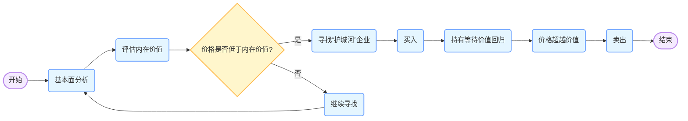

# 巴菲特的投资错误：从失败中吸取教训

> 关键词：巴菲特、投资错误、失败教训、价值投资、风险管理

> 摘要：沃伦·巴菲特作为全球闻名的投资大师，其投资理念和策略影响深远。然而，即使是他也并非没有经历过投资失败。本文旨在深入剖析巴菲特的投资错误案例，探讨这些错误背后的原因，从中提炼出可供投资者借鉴的教训。通过对具体案例的分析、相关算法原理的阐述、数学模型的解读以及实际应用场景的探讨，帮助投资者更好地理解投资中的风险与挑战，提升投资决策的科学性和准确性。

## 1. 背景介绍 
### 1.1 目的和范围
本研究的主要目的是通过对巴菲特投资错误案例的全面分析，揭示投资过程中可能面临的各种陷阱和挑战，为广大投资者提供宝贵的经验教训。我们将深入研究巴菲特在不同时期、不同领域的投资失误，分析其决策过程、市场环境以及导致失败的关键因素。同时，探讨如何从这些错误中学习，优化投资策略，提高投资回报率。研究范围涵盖了巴菲特在股票、企业收购等方面的主要投资活动，重点关注那些具有代表性和借鉴意义的失败案例。

### 1.2 预期读者
本文预期读者主要包括各类投资者，无论是专业的投资机构从业者，还是普通的个人投资者，都能从本文中获得有价值的信息和启示。此外，金融专业的学生、研究人员以及对投资领域感兴趣的人士也可以通过阅读本文，加深对投资实践和风险管理的理解。

### 1.3 文档结构概述
本文将按照以下结构展开：首先介绍核心概念，包括巴菲特的投资理念、价值投资的基本原理等，并通过文本示意图和Mermaid流程图展示其内在联系。接着详细阐述核心算法原理和具体操作步骤，使用Python源代码进行说明。然后介绍相关的数学模型和公式，并结合实际案例进行详细讲解。之后通过项目实战部分，给出实际的代码案例并进行详细解释。再探讨这些投资错误在实际应用场景中的体现和应对策略。最后推荐相关的学习资源、开发工具和论文著作，总结未来投资领域的发展趋势与挑战，并提供常见问题的解答和扩展阅读参考资料。

### 1.4 术语表
#### 1.4.1 核心术语定义
- **价值投资**：一种投资策略，强调通过分析公司的基本面，如财务状况、盈利能力、竞争优势等，寻找被低估的股票或资产进行投资，以获取长期的价值增长。
- **护城河**：指企业所拥有的可持续竞争优势，使其在市场中能够抵御竞争对手的侵蚀，保持长期的盈利能力。
- **安全边际**：投资者在购买股票或资产时，为了降低风险，所要求的价格低于其内在价值的幅度。

#### 1.4.2 相关概念解释
- **内在价值**：公司或资产的真实价值，通常通过对未来现金流的折现计算得出。它反映了公司的长期盈利能力和资产的实际价值。
- **格雷厄姆-多德式投资**：由本杰明·格雷厄姆和戴维·多德提出的投资方法，强调以低于内在价值的价格购买股票，注重公司的财务报表分析和安全边际。

#### 1.4.3 缩略词列表
- **ROE**：Return on Equity，净资产收益率，反映股东权益的收益水平。
- **PEG**：Price/Earnings to Growth ratio，市盈率相对盈利增长比率，用于衡量股票的估值是否合理。

## 2. 核心概念与联系 
### 核心概念原理
巴菲特的投资理念核心是价值投资，他深受本杰明·格雷厄姆和菲利普·费雪的影响。价值投资的基本原理是通过对公司基本面的深入分析，评估其内在价值，然后在价格低于内在价值时买入，等待价格回归价值甚至超越价值时卖出。巴菲特强调寻找具有宽阔“护城河”的企业，即那些具有可持续竞争优势的公司，如品牌优势、成本优势、技术优势等。同时，他注重安全边际的重要性，认为只有在价格足够低时才能降低投资风险。

### 文本示意图
```plaintext
价值投资理念
|
|-- 基本面分析
|   |-- 财务状况
|   |-- 盈利能力
|   |-- 竞争优势
|
|-- 内在价值评估
|   |-- 现金流折现模型
|
|-- 安全边际
|   |-- 价格低于内在价值
|
|-- 寻找“护城河”企业
|   |-- 品牌优势
|   |-- 成本优势
|   |-- 技术优势
```

### Mermaid流程图


## 3. 核心算法原理 & 具体操作步骤 
### 现金流折现模型原理
现金流折现模型（Discounted Cash Flow, DCF）是价值投资中常用的评估企业内在价值的方法。其基本原理是将企业未来的现金流按照一定的折现率折现到当前时刻，得到企业的内在价值。公式如下：

$$V = \sum_{t=1}^{n} \frac{CF_t}{(1 + r)^t}$$

其中，$V$ 表示企业的内在价值，$CF_t$ 表示第 $t$ 期的现金流，$r$ 表示折现率，$n$ 表示预测的期数。

### Python代码实现
```python
def dcf_valuation(cash_flows, discount_rate):
    """
    计算企业的内在价值
    :param cash_flows: 未来各期的现金流列表
    :param discount_rate: 折现率
    :return: 企业的内在价值
    """
    intrinsic_value = 0
    for t, cf in enumerate(cash_flows, start=1):
        present_value = cf / ((1 + discount_rate) ** t)
        intrinsic_value += present_value
    return intrinsic_value

# 示例
cash_flows = [100, 120, 130, 140, 150]  # 未来5年的现金流
discount_rate = 0.1  # 折现率为10%
intrinsic_value = dcf_valuation(cash_flows, discount_rate)
print(f"企业的内在价值为: {intrinsic_value}")
```

### 具体操作步骤
1. **预测现金流**：对企业未来的现金流进行预测，这需要对企业的业务模式、市场前景、竞争环境等进行深入分析。可以参考企业的历史财务数据、行业发展趋势等因素。
2. **确定折现率**：折现率反映了资金的时间价值和投资风险。一般可以使用企业的加权平均资本成本（WACC）作为折现率。WACC的计算公式为：

$$WACC = E/V \times r_E + D/V \times r_D \times (1 - T_c)$$

其中，$E$ 表示股权价值，$D$ 表示债务价值，$V = E + D$ 表示企业总价值，$r_E$ 表示股权成本，$r_D$ 表示债务成本，$T_c$ 表示企业所得税税率。

3. **计算内在价值**：将预测的现金流代入现金流折现模型，按照上述Python代码的方法计算企业的内在价值。
4. **比较价格与内在价值**：将计算得到的内在价值与企业当前的市场价格进行比较。如果市场价格低于内在价值，且企业具有一定的竞争优势，那么可以考虑买入该股票；反之，则继续寻找其他投资机会。

## 4. 数学模型和公式 & 详细讲解 & 举例说明 
### 净资产收益率（ROE）模型
净资产收益率（ROE）是衡量企业盈利能力的重要指标，它反映了股东权益的收益水平。公式如下：

$$ROE = \frac{净利润}{净资产}$$

ROE越高，说明企业利用自有资本获取收益的能力越强。巴菲特非常重视ROE指标，他认为长期来看，优秀企业的ROE应该保持在较高水平。

### 举例说明
假设一家公司的净利润为1000万元，净资产为5000万元，则该公司的ROE为：

$$ROE = \frac{1000}{5000} = 0.2 = 20\%$$

这意味着该公司每投入1元的净资产，可以获得0.2元的净利润，盈利能力较强。

### 市盈率相对盈利增长比率（PEG）模型
PEG模型是在市盈率（PE）的基础上，考虑了企业的盈利增长因素，用于评估股票的估值是否合理。公式如下：

$$PEG = \frac{PE}{盈利增长率}$$

其中，$PE$ 表示市盈率，计算公式为：

$$PE = \frac{股票价格}{每股收益}$$

一般来说，PEG值小于1表示股票被低估，具有投资价值；PEG值大于1表示股票可能被高估。

### 举例说明
假设某股票的价格为20元，每股收益为1元，则该股票的PE为：

$$PE = \frac{20}{1} = 20$$

如果该公司的盈利增长率为30%，则其PEG为：

$$PEG = \frac{20}{30} \approx 0.67$$

由于PEG值小于1，说明该股票可能被低估，具有一定的投资价值。

## 5. 项目实战：代码实际案例和详细解释说明 
### 5.1  开发环境搭建
- **Python环境**：建议使用Python 3.7及以上版本。可以从Python官方网站（https://www.python.org/downloads/）下载并安装。
- **开发工具**：推荐使用PyCharm作为开发工具，它具有强大的代码编辑、调试和项目管理功能。可以从JetBrains官方网站（https://www.jetbrains.com/pycharm/download/）下载并安装。
- **必要的库**：在项目中需要使用到一些Python库，如`pandas`用于数据处理，`numpy`用于数值计算。可以使用以下命令进行安装：

```sh
pip install pandas numpy
```

### 5.2  源代码详细实现和代码解读
以下是一个简单的股票筛选程序，根据ROE和PEG指标筛选具有投资价值的股票。

```python
import pandas as pd
import numpy as np

# 假设我们有一个包含股票信息的CSV文件，文件名为'stock_data.csv'
# 文件包含以下列：'股票代码', '股票名称', '每股收益', '股票价格', '净资产', '净利润', '盈利增长率'
def screen_stocks(file_path, roe_threshold=0.15, peg_threshold=1):
    """
    根据ROE和PEG指标筛选股票
    :param file_path: 股票信息CSV文件的路径
    :param roe_threshold: ROE阈值，默认为0.15（15%）
    :param peg_threshold: PEG阈值，默认为1
    :return: 筛选后的股票数据
    """
    # 读取CSV文件
    data = pd.read_csv(file_path)
    
    # 计算ROE
    data['ROE'] = data['净利润'] / data['净资产']
    
    # 计算PE
    data['PE'] = data['股票价格'] / data['每股收益']
    
    # 计算PEG
    data['PEG'] = data['PE'] / data['盈利增长率']
    
    # 筛选符合条件的股票
    selected_stocks = data[(data['ROE'] >= roe_threshold) & (data['PEG'] <= peg_threshold)]
    
    return selected_stocks

# 示例
file_path = 'stock_data.csv'
selected_stocks = screen_stocks(file_path)
print(selected_stocks[['股票代码', '股票名称', 'ROE', 'PEG']])
```

### 代码解读与分析
1. **数据读取**：使用`pandas`库的`read_csv`函数读取包含股票信息的CSV文件。
2. **指标计算**：根据公式计算ROE、PE和PEG指标，并将结果添加到数据框中。
3. **筛选股票**：使用布尔索引筛选出ROE大于等于阈值且PEG小于等于阈值的股票。
4. **结果输出**：打印筛选后的股票代码、股票名称、ROE和PEG信息。

通过这个程序，我们可以快速筛选出具有一定盈利能力和估值优势的股票，为投资决策提供参考。

## 6. 实际应用场景 
### 个人投资者
对于个人投资者来说，学习巴菲特的投资错误案例可以帮助他们避免犯类似的错误。例如，在投资过程中，个人投资者往往容易受到市场情绪的影响，盲目跟风买入热门股票，而忽略了公司的基本面。通过分析巴菲特的错误，个人投资者可以更加注重价值投资，深入研究公司的财务状况和竞争优势，选择具有长期投资价值的股票。同时，个人投资者可以运用现金流折现模型、ROE和PEG等指标来评估股票的内在价值和估值水平，提高投资决策的科学性。

### 投资机构
投资机构在进行大规模投资时，需要更加谨慎地评估风险和收益。巴菲特的投资错误案例可以为投资机构提供宝贵的借鉴，帮助他们完善投资策略和风险管理体系。例如，在企业收购方面，投资机构可以学习巴菲特的经验教训，充分评估目标企业的行业前景、竞争环境和整合难度，避免盲目扩张和高溢价收购。此外，投资机构可以利用先进的数据分析技术和量化模型，对投资组合进行优化和风险管理，提高投资回报率。

### 金融教育领域
在金融教育领域，巴菲特的投资错误案例可以作为生动的教学案例，帮助学生更好地理解投资理论和实践。通过分析这些案例，学生可以深入了解投资过程中可能面临的各种风险和挑战，学习如何运用投资工具和方法进行决策。同时，学生可以从巴菲特的错误中吸取教训，培养正确的投资心态和风险意识，为未来的投资生涯打下坚实的基础。

## 7. 工具和资源推荐
### 7.1 学习资源推荐
#### 7.1.1 书籍推荐
- 《聪明的投资者》（The Intelligent Investor）：本杰明·格雷厄姆著，被誉为投资领域的圣经，详细阐述了价值投资的理念和方法。
- 《巴菲特致股东的信：股份公司教程》（Letters to Shareholders of Berkshire Hathaway）：沃伦·巴菲特著，收录了巴菲特多年来致股东的信，包含了他的投资哲学、管理理念和对市场的看法。
- 《怎样选择成长股》（Common Stocks and Uncommon Profits）：菲利普·费雪著，介绍了寻找成长股的方法和技巧，对巴菲特的投资理念产生了重要影响。

#### 7.1.2 在线课程
- Coursera上的“投资学原理”（Principles of Investing）：由知名教授授课，涵盖了投资领域的基本概念、理论和方法。
- edX上的“金融市场”（Financial Markets）：耶鲁大学教授罗伯特·席勒主讲，深入探讨了金融市场的运行机制和投资策略。

#### 7.1.3 技术博客和网站
- 雪球网（https://xueqiu.com/）：国内知名的投资社区，提供股票、基金等投资产品的资讯、分析和讨论。
- Seeking Alpha（https://seekingalpha.com/）：国外知名的投资研究网站，提供大量的股票分析报告和投资观点。

### 7.2 开发工具框架推荐
#### 7.2.1 IDE和编辑器
- PyCharm：功能强大的Python集成开发环境，适合进行数据分析和算法开发。
- Jupyter Notebook：交互式的开发环境，方便进行数据探索和可视化。

#### 7.2.2 调试和性能分析工具
- pdb：Python自带的调试器，用于调试Python代码。
- cProfile：Python标准库中的性能分析工具，用于分析代码的性能瓶颈。

#### 7.2.3 相关框架和库
- pandas：用于数据处理和分析的Python库，提供了高效的数据结构和数据分析工具。
- numpy：用于数值计算的Python库，提供了多维数组和各种数学函数。
- scikit-learn：用于机器学习的Python库，提供了丰富的机器学习算法和工具。

### 7.3 相关论文著作推荐
#### 7.3.1 经典论文
- 《证券分析》（Security Analysis）：本杰明·格雷厄姆和戴维·多德著，奠定了价值投资的理论基础。
- 《有效市场假说》（Efficient Markets Hypothesis）：尤金·法玛著，探讨了市场效率和股票价格的形成机制。

#### 7.3.2 最新研究成果
- 《行为金融学》（Behavioral Finance）：研究投资者的心理和行为对金融市场的影响，为投资决策提供了新的视角。
- 《量化投资》（Quantitative Investment）：运用数学模型和计算机技术进行投资决策，提高投资效率和回报率。

#### 7.3.3 应用案例分析
- 《巴菲特的投资组合》（The Warren Buffett Portfolio）：分析了巴菲特的投资组合和投资策略，为投资者提供了实践参考。
- 《投资最重要的事》（The Most Important Thing Illuminated）：霍华德·马克斯著，分享了投资过程中的重要经验和教训。

## 8. 总结：未来发展趋势与挑战
### 未来发展趋势
- **数字化和智能化**：随着科技的不断发展，投资领域将越来越数字化和智能化。投资者可以利用大数据、人工智能等技术进行市场分析、风险评估和投资决策，提高投资效率和准确性。
- **多元化投资**：未来投资者将更加注重多元化投资，不仅投资于股票、债券等传统资产，还会涉足房地产、大宗商品、数字货币等领域，以降低投资风险。
- **社会责任投资**：越来越多的投资者开始关注企业的社会责任和可持续发展，将环境、社会和治理（ESG）因素纳入投资决策过程，推动经济的可持续发展。

### 挑战
- **市场不确定性增加**：全球经济形势复杂多变，政治、地缘政治等因素可能导致市场波动加剧，增加投资风险。投资者需要更加敏锐地捕捉市场信息，及时调整投资策略。
- **技术变革带来的挑战**：虽然数字化和智能化为投资带来了机遇，但也带来了技术风险。例如，人工智能算法的黑箱性可能导致投资决策的不可解释性，投资者需要加强对技术的理解和监管。
- **投资者情绪管理**：在市场波动较大的情况下，投资者容易受到情绪的影响，做出不理性的投资决策。投资者需要加强情绪管理，培养正确的投资心态。

## 9. 附录：常见问题与解答
### 问题1：巴菲特的投资错误对普通投资者有多大的借鉴意义？
解答：巴菲特作为投资大师，他的投资错误具有很高的借鉴意义。虽然普通投资者的资金规模和投资能力与巴菲特不同，但投资的基本原理和面临的风险是相似的。通过分析巴菲特的错误，普通投资者可以学习到如何避免盲目跟风、如何评估企业的内在价值、如何控制投资风险等重要知识和技能，从而提高自己的投资水平。

### 问题2：现金流折现模型在实际应用中存在哪些局限性？
解答：现金流折现模型在实际应用中存在一些局限性。首先，该模型需要对企业未来的现金流进行预测，而未来是不确定的，预测结果可能存在较大误差。其次，折现率的确定也比较困难，不同的折现率会导致不同的内在价值计算结果。此外，该模型假设企业的现金流是稳定增长的，但在现实中，企业的经营状况可能会受到多种因素的影响，导致现金流波动较大。

### 问题3：如何判断一个企业是否具有“护城河”？
解答：判断一个企业是否具有“护城河”可以从以下几个方面入手：
- **品牌优势**：企业是否拥有知名品牌，消费者是否愿意为其品牌支付更高的价格。
- **成本优势**：企业是否能够以较低的成本生产产品或提供服务，从而在市场竞争中占据优势。
- **技术优势**：企业是否拥有先进的技术和研发能力，能够不断推出新产品或改进现有产品。
- **网络效应**：企业的产品或服务是否具有网络效应，即使用的用户越多，产品或服务的价值越高。
- **转换成本**：消费者从一个企业的产品或服务转换到另一个企业的产品或服务时，是否需要付出较高的成本。

### 问题4：投资过程中如何平衡风险和收益？
解答：投资过程中平衡风险和收益是一个关键问题。投资者可以采取以下措施：
- **多元化投资**：将资金分散投资于不同的资产类别、行业和地区，降低单一资产或行业的风险。
- **设置止损点**：在投资前设定一个止损点，当投资损失达到一定程度时，及时卖出，避免损失进一步扩大。
- **评估风险承受能力**：投资者需要根据自己的财务状况、投资目标和风险偏好，评估自己的风险承受能力，选择适合自己的投资产品和策略。
- **定期调整投资组合**：根据市场情况和投资目标的变化，定期调整投资组合，保持投资组合的合理性和有效性。

## 10. 扩展阅读 & 参考资料
### 扩展阅读
- 《穷查理宝典：查理·芒格的智慧箴言录》（Poor Charlie's Almanack: The Wit and Wisdom of Charles T. Munger）：介绍了查理·芒格的投资哲学和人生智慧，与巴菲特的投资理念相互补充。
- 《漫步华尔街》（A Random Walk Down Wall Street）：探讨了股票市场的随机性和有效市场假说，对投资者的投资观念产生了重要影响。

### 参考资料
- Warren Buffett's Annual Letters to Shareholders: https://www.berkshirehathaway.com/letters/letters.html
- Benjamin Graham, "The Intelligent Investor", HarperBusiness, 2003.
- Philip Fisher, "Common Stocks and Uncommon Profits", HarperBusiness, 1996.

作者：AI天才研究院/AI Genius Institute & 禅与计算机程序设计艺术 /Zen And The Art of Computer Programming