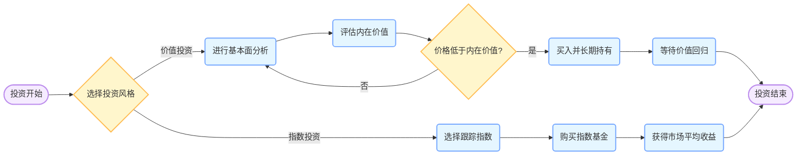

# 巴菲特的投资风格：价值投资vs指数投资

> 关键词：巴菲特、价值投资、指数投资、投资风格、投资策略、股票市场、长期收益

> 摘要：本文深入探讨了巴菲特所涉及的两种重要投资风格——价值投资与指数投资。详细介绍了这两种投资风格的核心概念、原理及架构，分析了相关的核心算法和数学模型。通过实际案例展示了它们在项目实战中的应用，阐述了各自的实际应用场景。同时推荐了学习这两种投资风格所需的工具和资源，最后总结了它们未来的发展趋势与挑战，并对常见问题进行了解答。旨在帮助投资者更全面地理解这两种投资风格，以便做出更合理的投资决策。

## 1. 背景介绍 
### 1.1 目的和范围
本文的目的在于深入剖析巴菲特所倡导的价值投资和指数投资这两种投资风格，对比它们的特点、优势和适用场景。范围涵盖了从基本概念到具体操作步骤，从数学模型到实际案例分析，为投资者提供全面且深入的理解，帮助他们在投资决策中更好地选择适合自己的投资方式。

### 1.2 预期读者
本文预期读者包括对投资领域感兴趣的初学者、有一定投资经验但希望深入了解不同投资风格的投资者、金融专业的学生以及从事金融分析和投资研究的专业人士。

### 1.3 文档结构概述
本文首先介绍价值投资和指数投资的核心概念及它们之间的联系，通过文本示意图和 Mermaid 流程图进行直观展示。接着阐述两种投资风格的核心算法原理，并给出具体操作步骤，同时用 Python 源代码进行详细说明。然后介绍相关的数学模型和公式，并举例说明其应用。再通过项目实战，展示实际代码案例并进行详细解读。之后分析两种投资风格的实际应用场景。随后推荐学习这两种投资风格所需的工具和资源。最后总结它们未来的发展趋势与挑战，解答常见问题，并提供扩展阅读和参考资料。

### 1.4 术语表
#### 1.4.1 核心术语定义
- **价值投资**：是一种通过对公司基本面进行深入分析，寻找被市场低估的股票，长期持有以获取价值回归带来收益的投资策略。
- **指数投资**：是一种通过购买跟踪特定市场指数的基金，以获得与该指数大致相同收益的投资方式。
- **内在价值**：指公司的真实价值，通过对公司的财务状况、盈利能力、竞争优势等因素进行评估得出。
- **安全边际**：指股票的市场价格低于其内在价值的幅度，为投资提供一定的风险缓冲。

#### 1.4.2 相关概念解释
- **基本面分析**：通过研究公司的财务报表、行业前景、管理团队等因素，评估公司的内在价值和投资价值。
- **市场指数**：是衡量整个市场或特定行业表现的指标，如标普 500 指数、沪深 300 指数等。
- **被动投资**：指数投资通常被认为是一种被动投资方式，因为投资者不需要主动选择股票，只需跟随指数的涨跌。

#### 1.4.3 缩略词列表
- **PE**：市盈率（Price-to-Earnings Ratio），反映股票价格与每股收益之间的关系。
- **PB**：市净率（Price-to-Book Ratio），反映股票价格与每股净资产之间的关系。
- **ETF**：交易型开放式指数基金（Exchange-Traded Fund），是一种在证券交易所上市交易的开放式基金，跟踪特定的市场指数。

## 2. 核心概念与联系 

### 价值投资核心概念
价值投资的核心在于寻找那些市场价格低于其内在价值的股票。投资者通过对公司的基本面进行深入研究，包括财务报表分析、行业竞争格局评估、管理团队能力考察等，来确定公司的内在价值。一旦发现市场价格低于内在价值的股票，投资者就会买入并长期持有，等待市场发现该股票的真实价值，从而实现价值回归，获得投资收益。

### 指数投资核心概念
指数投资则是基于市场有效性的假设，认为市场整体是难以被超越的。投资者通过购买跟踪特定市场指数的基金，如 ETF，来获得与该指数大致相同的收益。指数投资的优势在于成本低、分散风险，无需投资者进行复杂的个股分析。

### 两者联系
价值投资和指数投资并非完全对立，而是可以相互补充的。对于一些缺乏专业知识和时间进行个股分析的投资者来说，指数投资是一种简单有效的投资方式。而对于有能力进行深入基本面分析的投资者来说，价值投资可以帮助他们挖掘出具有更高投资价值的个股。在实际投资中，投资者可以根据自己的风险承受能力、投资目标和投资经验，将价值投资和指数投资结合起来，构建多元化的投资组合。

### 文本示意图
```plaintext
              投资风格
               /       \
          价值投资     指数投资
          /    |        |
基本面分析 安全边际  跟踪指数
   |             |
评估内在价值   获得市场平均收益
```

### Mermaid 流程图


## 3. 核心算法原理 & 具体操作步骤 

### 价值投资核心算法原理
价值投资的核心算法原理是通过对公司的财务数据进行分析，计算出公司的内在价值。一种常用的方法是使用现金流折现模型（DCF），其基本思想是将公司未来的现金流折现到当前，以确定公司的内在价值。

#### Python 实现现金流折现模型
```python
import numpy as np

def dcf_valuation(free_cash_flows, discount_rate, terminal_growth_rate):
    """
    现金流折现模型计算公司内在价值
    :param free_cash_flows: 未来各期的自由现金流列表
    :param discount_rate: 折现率
    :param terminal_growth_rate: 永续增长率
    :return: 公司内在价值
    """
    num_years = len(free_cash_flows)
    discounted_cash_flows = []
    for i in range(num_years):
        discounted_cash_flow = free_cash_flows[i] / ((1 + discount_rate) ** (i + 1))
        discounted_cash_flows.append(discounted_cash_flow)

    # 计算终值
    terminal_value = free_cash_flows[-1] * (1 + terminal_growth_rate) / (discount_rate - terminal_growth_rate)
    discounted_terminal_value = terminal_value / ((1 + discount_rate) ** num_years)

    # 计算内在价值
    intrinsic_value = sum(discounted_cash_flows) + discounted_terminal_value
    return intrinsic_value

# 示例数据
free_cash_flows = [100, 120, 140, 160, 180]
discount_rate = 0.1
terminal_growth_rate = 0.03

intrinsic_value = dcf_valuation(free_cash_flows, discount_rate, terminal_growth_rate)
print(f"公司内在价值: {intrinsic_value}")
```

### 价值投资具体操作步骤
1. **选择研究对象**：选择具有一定规模、行业地位和竞争优势的公司进行研究。
2. **收集数据**：收集公司的财务报表、行业研究报告、新闻资讯等相关数据。
3. **进行基本面分析**：分析公司的盈利能力、偿债能力、运营能力等财务指标，评估公司的竞争优势和行业前景。
4. **计算内在价值**：使用现金流折现模型或其他估值方法计算公司的内在价值。
5. **确定安全边际**：根据公司的内在价值和市场价格，确定安全边际。一般来说，安全边际越大，投资风险越小。
6. **做出投资决策**：如果市场价格低于内在价值且安全边际足够大，则考虑买入该股票；否则，继续寻找其他投资机会。

### 指数投资核心算法原理
指数投资的核心算法原理是跟踪特定市场指数的表现。指数基金通过复制指数的成分股及其权重，来实现与指数大致相同的收益。

#### Python 模拟指数基金收益
```python
import numpy as np
import pandas as pd
import yfinance as yf

# 选择跟踪的指数
index_symbol = '^GSPC'  # 标普 500 指数
start_date = '2020-01-01'
end_date = '2023-01-01'

# 获取指数数据
index_data = yf.download(index_symbol, start=start_date, end=end_date)
index_returns = index_data['Close'].pct_change().dropna()

# 模拟指数基金收益
initial_investment = 10000
portfolio_value = [initial_investment]
for return_rate in index_returns:
    new_value = portfolio_value[-1] * (1 + return_rate)
    portfolio_value.append(new_value)

# 绘制收益曲线
import matplotlib.pyplot as plt

plt.plot(pd.date_range(start=start_date, end=end_date, freq='D')[1:], portfolio_value[1:])
plt.xlabel('Date')
plt.ylabel('Portfolio Value')
plt.title('Simulated Index Fund Returns')
plt.show()
```

### 指数投资具体操作步骤
1. **选择指数**：根据自己的投资目标和风险承受能力，选择适合的市场指数，如大盘指数、中小盘指数、行业指数等。
2. **选择指数基金**：选择跟踪所选指数的指数基金，比较不同基金的费用率、跟踪误差等指标。
3. **开户并购买基金**：在证券公司或基金销售平台开户，然后购买所选的指数基金。
4. **定期投资**：可以采用定期定额投资的方式，降低市场波动对投资收益的影响。
5. **长期持有**：指数投资是一种长期投资策略，投资者应避免频繁买卖，长期持有以获得市场平均收益。

## 4. 数学模型和公式 & 详细讲解 & 举例说明 

### 价值投资数学模型和公式
#### 现金流折现模型（DCF）
现金流折现模型的基本公式为：
$$
V = \sum_{t=1}^{n} \frac{FCF_t}{(1 + r)^t} + \frac{FCF_n(1 + g)}{(r - g)(1 + r)^n}
$$
其中：
- $V$ 表示公司的内在价值；
- $FCF_t$ 表示第 $t$ 期的自由现金流；
- $r$ 表示折现率；
- $n$ 表示预测期数；
- $g$ 表示永续增长率。

**详细讲解**：
该公式的前半部分 $\sum_{t=1}^{n} \frac{FCF_t}{(1 + r)^t}$ 表示预测期内各期自由现金流的折现值之和，后半部分 $\frac{FCF_n(1 + g)}{(r - g)(1 + r)^n}$ 表示预测期结束后永续现金流的折现值。折现率 $r$ 反映了投资者对资金时间价值和投资风险的要求，永续增长率 $g$ 表示公司在预测期结束后长期的增长率。

**举例说明**：
假设某公司未来 5 年的自由现金流分别为 100 万元、120 万元、140 万元、160 万元、180 万元，折现率为 10%，永续增长率为 3%。则该公司的内在价值计算如下：
- 预测期内各期自由现金流的折现值：
    - 第 1 年：$PV_1 = \frac{100}{(1 + 0.1)^1} = 90.91$（万元）
    - 第 2 年：$PV_2 = \frac{120}{(1 + 0.1)^2} = 99.17$（万元）
    - 第 3 年：$PV_3 = \frac{140}{(1 + 0.1)^3} = 105.18$（万元）
    - 第 4 年：$PV_4 = \frac{160}{(1 + 0.1)^4} = 109.29$（万元）
    - 第 5 年：$PV_5 = \frac{180}{(1 + 0.1)^5} = 111.78$（万元）
- 预测期结束后永续现金流的折现值：
    - 第 5 年末的终值：$TV = \frac{180(1 + 0.03)}{(0.1 - 0.03)} = 2657.14$（万元）
    - 终值的折现值：$PV_{TV} = \frac{2657.14}{(1 + 0.1)^5} = 1652.95$（万元）
- 公司的内在价值：$V = 90.91 + 99.17 + 105.18 + 109.29 + 111.78 + 1652.95 = 2169.28$（万元）

#### 市盈率估值法
市盈率估值法的公式为：
$$
P = EPS \times PE
$$
其中：
- $P$ 表示股票价格；
- $EPS$ 表示每股收益；
- $PE$ 表示市盈率。

**详细讲解**：
市盈率是衡量股票估值的常用指标，反映了投资者为获得每股收益所愿意支付的价格倍数。通过将公司的每股收益乘以合理的市盈率，可以估算出股票的合理价格。

**举例说明**：
假设某公司的每股收益为 2 元，行业平均市盈率为 15 倍。则该公司股票的合理价格为：$P = 2 \times 15 = 30$（元）

### 指数投资数学模型和公式
#### 指数收益率计算公式
指数收益率的计算公式为：
$$
R = \frac{I_t - I_{t-1}}{I_{t-1}}
$$
其中：
- $R$ 表示指数收益率；
- $I_t$ 表示第 $t$ 期的指数值；
- $I_{t-1}$ 表示第 $t - 1$ 期的指数值。

**详细讲解**：
该公式用于计算指数在某一期间的收益率，反映了指数的涨跌情况。

**举例说明**：
假设某指数在第 1 期的指数值为 1000 点，在第 2 期的指数值为 1050 点。则该指数在第 2 期的收益率为：$R = \frac{1050 - 1000}{1000} = 0.05 = 5\%$

#### 指数基金跟踪误差计算公式
指数基金跟踪误差的计算公式为：
$$
TE = \sqrt{\frac{1}{n} \sum_{i=1}^{n} (R_{f,i} - R_{i})^2}
$$
其中：
- $TE$ 表示跟踪误差；
- $R_{f,i}$ 表示指数基金在第 $i$ 期的收益率；
- $R_{i}$ 表示指数在第 $i$ 期的收益率；
- $n$ 表示计算期间的期数。

**详细讲解**：
跟踪误差反映了指数基金的收益率与所跟踪指数收益率之间的偏离程度。跟踪误差越小，说明指数基金对指数的跟踪效果越好。

**举例说明**：
假设某指数基金和所跟踪指数在过去 5 期的收益率如下表所示：
| 期数 | 指数基金收益率 | 指数收益率 |
| ---- | ---- | ---- |
| 1 | 0.05 | 0.06 |
| 2 | 0.03 | 0.04 |
| 3 | 0.02 | 0.03 |
| 4 | 0.04 | 0.05 |
| 5 | 0.06 | 0.07 |

则该指数基金的跟踪误差计算如下：
- 计算每期的收益率差值：
    - 第 1 期：$0.05 - 0.06 = -0.01$
    - 第 2 期：$0.03 - 0.04 = -0.01$
    - 第 3 期：$0.02 - 0.03 = -0.01$
    - 第 4 期：$0.04 - 0.05 = -0.01$
    - 第 5 期：$0.06 - 0.07 = -0.01$
- 计算差值的平方和：
    - $(-0.01)^2 + (-0.01)^2 + (-0.01)^2 + (-0.01)^2 + (-0.01)^2 = 0.0005$
- 计算跟踪误差：
    - $TE = \sqrt{\frac{0.0005}{5}} = 0.01 = 1\%$

## 5. 项目实战：代码实际案例和详细解释说明 

### 5.1  开发环境搭建
#### 安装 Python
首先，需要安装 Python 环境。可以从 Python 官方网站（https://www.python.org/downloads/）下载适合自己操作系统的 Python 安装包，并按照安装向导进行安装。

#### 安装必要的库
在安装好 Python 后，需要安装一些必要的库，如 `numpy`、`pandas`、`yfinance`、`matplotlib` 等。可以使用以下命令进行安装：
```sh
pip install numpy pandas yfinance matplotlib
```

### 5.2  源代码详细实现和代码解读
#### 价值投资实战案例
```python
import yfinance as yf
import pandas as pd

# 选择研究对象
ticker = 'AAPL'  # 苹果公司股票代码
start_date = '2020-01-01'
end_date = '2023-01-01'

# 获取股票数据
stock_data = yf.download(ticker, start=start_date, end=end_date)

# 进行基本面分析（示例：计算市盈率）
income_statement = yf.Ticker(ticker).financials
eps = income_statement.loc['Net Income'] / yf.Ticker(ticker).info['sharesOutstanding']
pe_ratio = stock_data['Close'] / eps[-1]

# 绘制市盈率曲线
import matplotlib.pyplot as plt

plt.plot(stock_data.index, pe_ratio)
plt.xlabel('Date')
plt.ylabel('PE Ratio')
plt.title('Apple PE Ratio')
plt.show()

# 假设合理市盈率为 20，判断是否具有投资价值
if pe_ratio[-1] < 20:
    print("苹果股票具有投资价值")
else:
    print("苹果股票不具有投资价值")
```

**代码解读**：
1. **选择研究对象**：选择苹果公司的股票进行研究，使用 `yfinance` 库下载股票数据。
2. **进行基本面分析**：通过 `yfinance` 库获取苹果公司的财务报表，计算每股收益（EPS），然后计算市盈率（PE）。
3. **绘制市盈率曲线**：使用 `matplotlib` 库绘制苹果公司的市盈率曲线，以便观察市盈率的变化趋势。
4. **判断投资价值**：假设合理市盈率为 20，如果当前市盈率低于 20，则认为苹果股票具有投资价值；否则，认为不具有投资价值。

#### 指数投资实战案例
```python
import yfinance as yf
import pandas as pd
import matplotlib.pyplot as plt

# 选择跟踪的指数
index_symbol = '^GSPC'  # 标普 500 指数
start_date = '2020-01-01'
end_date = '2023-01-01'

# 获取指数数据
index_data = yf.download(index_symbol, start=start_date, end=end_date)
index_returns = index_data['Close'].pct_change().dropna()

# 模拟定期定额投资
initial_investment = 1000
monthly_investment = 100
portfolio_value = [initial_investment]
investment_dates = pd.date_range(start=start_date, end=end_date, freq='M')
for date in investment_dates:
    if date in index_returns.index:
        new_value = portfolio_value[-1] * (1 + index_returns[date]) + monthly_investment
        portfolio_value.append(new_value)
    else:
        portfolio_value.append(portfolio_value[-1])

# 绘制投资收益曲线
plt.plot(investment_dates, portfolio_value[1:])
plt.xlabel('Date')
plt.ylabel('Portfolio Value')
plt.title('Simulated Index Fund Returns with Monthly Investment')
plt.show()
```

**代码解读**：
1. **选择跟踪的指数**：选择标普 500 指数进行跟踪，使用 `yfinance` 库下载指数数据。
2. **计算指数收益率**：计算标普 500 指数的每日收益率。
3. **模拟定期定额投资**：假设初始投资为 1000 元，每月追加投资 100 元，根据指数收益率计算投资组合的价值。
4. **绘制投资收益曲线**：使用 `matplotlib` 库绘制投资组合的收益曲线，以便观察投资收益的变化情况。

### 5.3  代码解读与分析
#### 价值投资代码分析
- **数据获取**：使用 `yfinance` 库可以方便地获取股票的历史数据和财务报表，为基本面分析提供数据支持。
- **基本面分析**：通过计算市盈率等指标，可以对股票的估值进行评估，判断股票是否具有投资价值。
- **可视化分析**：使用 `matplotlib` 库绘制市盈率曲线，可以直观地观察市盈率的变化趋势，为投资决策提供参考。

#### 指数投资代码分析
- **数据获取**：同样使用 `yfinance` 库获取指数的历史数据，计算指数收益率。
- **模拟投资**：通过模拟定期定额投资，可以展示指数投资的长期收益效果，帮助投资者理解指数投资的特点。
- **可视化分析**：使用 `matplotlib` 库绘制投资收益曲线，直观地展示投资组合的价值变化情况。

## 6. 实际应用场景 
### 价值投资实际应用场景
- **长期投资**：价值投资强调长期持有被低估的股票，等待价值回归。对于那些具有长期投资目标，如养老、子女教育等的投资者来说，价值投资是一种合适的投资策略。
- **寻找优质企业**：通过对公司基本面的深入分析，价值投资者可以发现那些具有竞争优势、盈利能力强的优质企业。投资这些企业可以分享企业成长带来的收益。
- **市场低迷时投资**：在市场低迷时，很多股票的价格会被低估，此时是价值投资者寻找投资机会的好时机。通过在市场底部买入被低估的股票，投资者可以在市场反弹时获得较高的收益。

### 指数投资实际应用场景
- **分散风险**：指数投资通过投资跟踪市场指数的基金，可以分散投资风险。对于那些缺乏专业知识和时间进行个股分析的投资者来说，指数投资是一种简单有效的分散风险的方式。
- **获取市场平均收益**：指数投资可以获得与市场指数大致相同的收益，适合那些对市场走势没有明确判断，希望获得市场平均收益的投资者。
- **长期投资**：与价值投资一样，指数投资也是一种长期投资策略。长期持有指数基金可以享受市场长期上涨带来的收益，同时避免了频繁买卖带来的交易成本和风险。

## 7. 工具和资源推荐
### 7.1 学习资源推荐
#### 7.1.1 书籍推荐
- 《聪明的投资者》（The Intelligent Investor）：本杰明·格雷厄姆（Benjamin Graham）著，被誉为价值投资的圣经，详细介绍了价值投资的理念和方法。
- 《证券分析》（Security Analysis）：本杰明·格雷厄姆和大卫·多德（David Dodd）著，是价值投资领域的经典著作，对公司基本面分析和估值方法进行了深入探讨。
- 《漫步华尔街》（A Random Walk Down Wall Street）：伯顿·马尔基尔（Burton Malkiel）著，介绍了指数投资的理论和实践，对有效市场假说进行了详细阐述。

#### 7.1.2 在线课程
- Coursera 上的“投资学原理”（Principles of Investing）：由哥伦比亚大学教授授课，系统介绍了投资学的基本原理和方法，包括价值投资和指数投资。
- edX 上的“金融市场”（Financial Markets）：由耶鲁大学教授罗伯特·席勒（Robert Shiller）授课，对金融市场的运行机制和投资策略进行了深入分析。

#### 7.1.3 技术博客和网站
- Seeking Alpha：提供股票分析、投资策略和市场评论等内容，是投资者获取信息和交流的重要平台。
- Morningstar：提供基金评级、分析和研究报告等服务，对指数基金的选择和评估有很大帮助。
- 雪球：国内知名的投资社区，提供股票、基金等投资产品的讨论和分析，投资者可以在这里分享经验和交流观点。

### 7.2 开发工具框架推荐
#### 7.2.1 IDE和编辑器
- PyCharm：一款功能强大的 Python 集成开发环境，提供代码编辑、调试、版本控制等功能，适合 Python 开发者使用。
- Jupyter Notebook：一种交互式的开发环境，支持 Python、R 等多种编程语言，适合数据分析师和研究者使用。

#### 7.2.2 调试和性能分析工具
- pdb：Python 自带的调试工具，可以帮助开发者定位和解决代码中的问题。
- cProfile：Python 自带的性能分析工具，可以分析代码的运行时间和资源消耗情况，帮助开发者优化代码性能。

#### 7.2.3 相关框架和库
- yfinance：用于获取股票和指数的历史数据，方便进行投资分析和模拟。
- pandas：用于数据处理和分析，提供了丰富的数据结构和函数，提高了数据处理的效率。
- matplotlib：用于数据可视化，支持绘制各种类型的图表，帮助投资者直观地展示数据和分析结果。

### 7.3 相关论文著作推荐
#### 7.3.1 经典论文
- 《有效资本市场：理论与实证研究回顾》（Efficient Capital Markets: A Review of Theory and Empirical Work）：尤金·法玛（Eugene F. Fama）著，提出了有效市场假说，对现代金融理论和投资实践产生了深远影响。
- 《股票市场价格行为》（The Behavior of Stock-Market Prices）：保罗·萨缪尔森（Paul A. Samuelson）著，对股票市场价格的随机游走特性进行了研究，为指数投资提供了理论基础。

#### 7.3.2 最新研究成果
- 《行为金融学：对金融市场的新视角》（Behavioral Finance: A New Perspective on Financial Markets）：理查德·泰勒（Richard H. Thaler）等著，探讨了投资者的心理和行为对金融市场的影响，为价值投资和指数投资提供了新的视角。
- 《因子投资：从理论到实践》（Factor Investing: From Theory to Practice）：费边·英奇尼（Fabio C. Inchingolo）等著，介绍了因子投资的理论和方法，为投资者构建多元化投资组合提供了参考。

#### 7.3.3 应用案例分析
- 《巴菲特致股东的信：股份公司教程》（The Essays of Warren Buffett: Lessons for Corporate America）：沃伦·巴菲特（Warren Buffett）著，收录了巴菲特历年致股东的信，通过实际案例展示了价值投资的理念和方法。
- 《指数基金投资指南》（The Little Book of Common Sense Investing）：约翰·博格（John C. Bogle）著，介绍了指数基金的发展历程和投资优势，通过实际案例分析了指数投资的效果。

## 8. 总结：未来发展趋势与挑战
### 价值投资未来发展趋势与挑战
#### 发展趋势
- **科技赋能**：随着人工智能、大数据等技术的发展，价值投资者可以利用这些技术更高效地进行基本面分析和数据挖掘，提高投资决策的准确性。
- **全球视野**：经济全球化的趋势使得价值投资者可以将投资范围扩大到全球市场，寻找更多的投资机会。
- **社会责任投资**：越来越多的投资者开始关注企业的社会责任，价值投资也将更加注重企业的环境、社会和治理（ESG）因素。

#### 挑战
- **市场有效性提高**：随着市场信息的传播速度加快和投资者素质的提高，市场的有效性不断提高，寻找被低估的股票变得更加困难。
- **宏观经济不确定性**：宏观经济环境的不确定性增加，如经济衰退、通货膨胀、利率波动等，会对企业的盈利能力和股票价格产生影响，增加了价值投资的风险。
- **新兴行业估值难题**：新兴行业如科技、生物制药等的发展迅速，但这些行业的企业往往具有高成长、高风险的特点，传统的估值方法可能不再适用，给价值投资者带来了估值难题。

### 指数投资未来发展趋势与挑战
#### 发展趋势
- **产品创新**：指数基金的产品不断创新，除了传统的宽基指数基金外，还出现了行业指数基金、主题指数基金、Smart Beta 指数基金等，满足了不同投资者的需求。
- **低成本竞争**：随着市场竞争的加剧，指数基金的费用率不断降低，低成本将成为指数基金的核心竞争力之一。
- **国际化发展**：指数投资的国际化趋势明显，投资者可以通过投资海外指数基金，实现全球资产配置。

#### 挑战
- **市场波动风险**：指数投资虽然可以分散风险，但仍然无法避免市场波动的影响。在市场下跌时，指数基金的净值也会随之下降。
- **跟踪误差问题**：指数基金存在跟踪误差，即基金的收益率与所跟踪指数的收益率之间存在一定的偏离。跟踪误差过大可能会影响投资者的收益。
- **投资者教育不足**：部分投资者对指数投资的理解不够深入，存在盲目跟风投资的现象，容易在市场波动时做出错误的投资决策。

## 9. 附录：常见问题与解答
### 价值投资相关问题
#### 如何确定公司的内在价值？
确定公司的内在价值需要综合考虑多个因素，如公司的财务状况、盈利能力、竞争优势、行业前景等。常用的估值方法包括现金流折现模型、市盈率估值法、市净率估值法等。投资者可以根据公司的特点和行业情况选择合适的估值方法。

#### 价值投资需要多长时间才能获得收益？
价值投资是一种长期投资策略，获得收益的时间因人而异。一般来说，需要持有股票数年甚至更长时间，等待公司的价值被市场发现和认可。在持有过程中，投资者需要耐心等待，不要被短期的市场波动所影响。

#### 价值投资适合所有投资者吗？
价值投资并不适合所有投资者。价值投资需要投资者具备一定的财务知识和分析能力，能够对公司的基本面进行深入研究。同时，价值投资需要投资者有足够的耐心和长期投资的理念，能够承受短期的市场波动。对于那些缺乏专业知识和时间的投资者来说，指数投资可能是一种更合适的选择。

### 指数投资相关问题
#### 指数基金和主动管理基金哪个更好？
指数基金和主动管理基金各有优缺点，无法简单地说哪个更好。指数基金具有成本低、分散风险、透明度高等优点，适合那些希望获得市场平均收益、对市场走势没有明确判断的投资者。主动管理基金则通过基金经理的主动选股和资产配置，试图超越市场表现，但管理费用较高，且业绩表现不稳定。投资者可以根据自己的投资目标、风险承受能力和投资经验，选择适合自己的基金类型。

#### 如何选择适合自己的指数基金？
选择适合自己的指数基金需要考虑多个因素，如指数的类型、基金的费用率、跟踪误差、基金规模等。投资者可以根据自己的投资目标和风险承受能力，选择适合的指数，如大盘指数、中小盘指数、行业指数等。同时，应选择费用率较低、跟踪误差较小、基金规模较大的指数基金。

#### 指数投资是否可以完全避免风险？
指数投资虽然可以通过分散投资降低非系统性风险，但仍然无法避免系统性风险，如市场波动、宏观经济变化等。在市场下跌时，指数基金的净值也会随之下降。因此，投资者在进行指数投资时，也需要注意风险控制，合理配置资产。

## 10. 扩展阅读 & 参考资料
### 扩展阅读
- 《金融炼金术》（The Alchemy of Finance）：乔治·索罗斯（George Soros）著，介绍了索罗斯的投资哲学和操作方法，对投资者的思维方式和投资策略有很大的启发。
- 《邓普顿教你逆向投资》（John Templeton's Way with Money）：劳伦·邓普顿（Lauren C. Templeton）和斯科特·菲利普斯（Scott Phillips）著，介绍了邓普顿的逆向投资策略，帮助投资者在市场低迷时寻找投资机会。

### 参考资料
- 格雷厄姆, 多德. 证券分析[M]. 海南出版社, 2006.
- 马尔基尔. 漫步华尔街[M]. 机械工业出版社, 2012.
- 法玛. 有效资本市场：理论与实证研究回顾[J]. 金融杂志, 1970, 25(2): 383-417.

作者：AI天才研究院/AI Genius Institute & 禅与计算机程序设计艺术 /Zen And The Art of Computer Programming