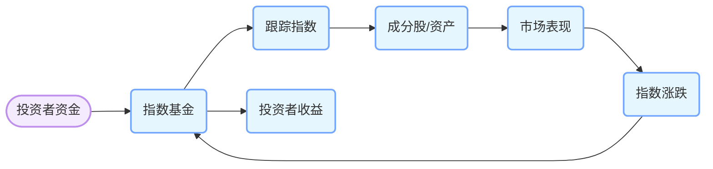

# 巴菲特的指数投资观：大多数投资者的选择

> 关键词：巴菲特、指数投资观、投资者选择、指数基金、长期投资

> 摘要：本文深入探讨了巴菲特的指数投资观，详细分析了为何这种投资观念被认为是大多数投资者的明智选择。首先介绍了相关背景知识，包括目的范围、预期读者等。接着阐述了指数投资的核心概念、原理及架构，通过Python代码解释核心算法原理和操作步骤，运用数学模型和公式进行理论分析并举例说明。然后结合实际案例，从开发环境搭建到代码实现和解读进行项目实战讲解。还列举了指数投资的实际应用场景，推荐了学习资源、开发工具框架以及相关论文著作。最后总结了指数投资的未来发展趋势与挑战，解答常见问题并提供扩展阅读和参考资料，旨在帮助投资者深入理解巴菲特的指数投资观并合理运用到投资实践中。

## 1. 背景介绍 
### 1.1 目的和范围
本文章的主要目的是全面、深入地剖析巴菲特的指数投资观，探讨为何这种投资理念适合大多数投资者。通过详细的分析和讲解，帮助投资者理解指数投资的原理、优势以及实际操作方法。范围涵盖了指数投资的核心概念、算法原理、数学模型、项目实战、应用场景等多个方面，同时提供相关的学习资源和工具推荐，为投资者提供一个完整的知识体系。

### 1.2 预期读者
本文预期读者包括广大的个人投资者，无论是初涉投资领域的新手，还是有一定投资经验但希望进一步优化投资策略的投资者。同时，也适合金融专业的学生、研究人员以及对投资领域感兴趣的人士阅读，帮助他们了解巴菲特的投资智慧和指数投资的相关知识。

### 1.3 文档结构概述
本文将按照以下结构进行阐述：首先介绍背景知识，包括目的、读者和文档结构；接着讲解指数投资的核心概念和联系，通过示意图和流程图展示其原理和架构；然后详细介绍核心算法原理和具体操作步骤，并用Python代码进行说明；再运用数学模型和公式进行理论分析并举例；之后通过项目实战展示代码实现和解读；列举实际应用场景；推荐相关的学习资源、开发工具框架和论文著作；最后总结未来发展趋势与挑战，解答常见问题并提供扩展阅读和参考资料。

### 1.4 术语表
#### 1.4.1 核心术语定义
- **指数投资**：一种被动投资策略，通过购买跟踪特定市场指数的基金，以获取与该指数大致相同的收益。
- **指数基金**：一种按照指数构成的比例，购买该指数包含的证券品种的基金，旨在复制指数的表现。
- **主动投资**：投资者通过积极的研究和分析，试图选择表现优于市场平均水平的证券进行投资。
- **长期投资**：投资者将资金投入市场较长时间，通常为数年甚至数十年，以获取资产的长期增值。

#### 1.4.2 相关概念解释
- **市场有效性**：指市场价格能够及时、准确地反映所有可用信息的程度。在有效市场中，主动投资很难持续获得超额收益。
- **分散投资**：通过投资多种不同的资产，降低单一资产波动对投资组合的影响，从而降低风险。
- **复利效应**：指在投资过程中，将所获得的收益再次投入投资，随着时间的推移，收益会不断累积，实现资产的快速增长。

#### 1.4.3 缩略词列表
- **ETF**：交易型开放式指数基金（Exchange Traded Fund），一种在证券交易所上市交易的指数基金。
- **SPDR**：标准普尔存托凭证（Standard & Poor's Depositary Receipts），是一种跟踪标准普尔500指数的ETF。

## 2. 核心概念与联系 

### 指数投资的核心概念
指数投资是一种基于市场平均收益的投资策略。其核心思想是认为市场是有效的，大多数主动投资者难以长期战胜市场。因此，投资者可以通过购买跟踪市场指数的基金，获得市场的平均收益。

指数基金是实现指数投资的主要工具。它按照特定指数的成分股构成和权重，购买相应的股票或其他资产，以复制指数的表现。例如，跟踪沪深300指数的基金，会按照沪深300指数中各成分股的权重，购买这些股票，从而使基金的收益与沪深300指数的涨跌基本一致。

### 指数投资与其他投资方式的联系
与主动投资相比，指数投资具有成本低、透明度高、分散风险等优势。主动投资需要投资者花费大量的时间和精力进行研究和分析，选择投资标的，并进行频繁的交易。而指数投资则是一种被动投资方式，不需要进行大量的研究和交易，因此成本较低。同时，指数基金的持仓和交易情况公开透明，投资者可以清楚地了解基金的投资组合。

与其他分散投资方式相比，指数投资是一种更加广泛和高效的分散投资方式。通过购买指数基金，投资者可以同时投资于多个行业和公司，降低单一行业或公司的风险。例如，购买沪深300指数基金，就相当于投资了沪深两市中规模较大、流动性较好的300家公司，分散了投资风险。

### 指数投资的架构示意图

该流程图展示了指数投资的基本架构。投资者将资金投入指数基金，指数基金跟踪特定的市场指数，该指数由一系列成分股或其他资产组成。这些成分股或资产的市场表现决定了指数的涨跌，指数的涨跌又会影响指数基金的净值，最终影响投资者的收益。

## 3. 核心算法原理 & 具体操作步骤 

### 指数基金的复制原理
指数基金的核心目标是尽可能准确地复制目标指数的表现。为了实现这一目标，指数基金通常采用两种复制方法：完全复制法和抽样复制法。

#### 完全复制法
完全复制法是指指数基金按照目标指数的成分股构成和权重，完全购买这些成分股。这种方法的优点是能够精确地复制指数的表现，但缺点是需要购买大量的股票，交易成本较高，而且对于一些流动性较差的股票，可能难以完全按照指数权重进行购买。

以下是一个简单的Python代码示例，演示如何使用完全复制法计算指数基金的净值：
```python
import pandas as pd

# 假设目标指数包含3只股票，权重分别为0.3、0.5、0.2
index_weights = [0.3, 0.5, 0.2]

# 假设这3只股票的初始价格分别为10元、20元、30元
stock_prices = [10, 20, 30]

# 计算初始指数基金的净值
initial_nav = sum([w * p for w, p in zip(index_weights, stock_prices)])

# 假设一段时间后，这3只股票的价格分别变为12元、22元、28元
new_stock_prices = [12, 22, 28]

# 计算新的指数基金的净值
new_nav = sum([w * p for w, p in zip(index_weights, new_stock_prices)])

print(f"初始净值: {initial_nav}")
print(f"新的净值: {new_nav}")
```
#### 抽样复制法
抽样复制法是指指数基金不购买目标指数的所有成分股，而是选择其中一部分具有代表性的股票进行投资。这种方法可以降低交易成本，但可能会导致基金的表现与指数存在一定的偏差。

### 具体操作步骤
#### 选择指数基金
投资者首先需要根据自己的投资目标、风险承受能力和投资期限等因素，选择适合自己的指数基金。常见的指数包括沪深300指数、中证500指数、上证50指数等。

#### 开户
投资者需要在证券公司或基金销售机构开设证券账户或基金账户，以便进行指数基金的买卖。

#### 购买指数基金
投资者可以通过证券账户或基金账户，在证券交易所或基金销售平台上购买指数基金。购买方式包括场内交易和场外交易。场内交易是指在证券交易所进行的交易，类似于股票交易；场外交易是指通过基金销售机构进行的交易，如银行、基金公司官网等。

#### 定期评估和调整
投资者需要定期评估自己的投资组合，根据市场情况和自己的投资目标，适时调整投资组合。例如，如果市场发生较大变化，或者投资者的风险承受能力发生改变，可以考虑调整指数基金的投资比例。

## 4. 数学模型和公式 & 详细讲解 & 举例说明 

### 指数基金的收益率计算
指数基金的收益率可以用以下公式计算：
$$R = \frac{NAV_1 - NAV_0}{NAV_0} \times 100\%$$
其中，$R$ 表示指数基金的收益率，$NAV_0$ 表示初始净值，$NAV_1$ 表示期末净值。

例如，某指数基金的初始净值为1元，期末净值为1.1元，则该基金的收益率为：
$$R = \frac{1.1 - 1}{1} \times 100\% = 10\%$$

### 夏普比率
夏普比率是衡量投资组合风险调整后收益的指标，其计算公式为：
$$Sharpe Ratio = \frac{R_p - R_f}{\sigma_p}$$
其中，$R_p$ 表示投资组合的预期收益率，$R_f$ 表示无风险收益率，$\sigma_p$ 表示投资组合的标准差。

夏普比率越高，说明投资组合在承担相同风险的情况下，能够获得更高的收益。例如，假设某指数基金的预期收益率为15%，无风险收益率为3%，标准差为20%，则该基金的夏普比率为：
$$Sharpe Ratio = \frac{0.15 - 0.03}{0.2} = 0.6$$

### 举例说明
假设投资者在年初购买了某只沪深300指数基金，初始净值为1元，投资金额为10000元。年末该基金的净值为1.15元。则投资者的收益为：
投资收益 = 投资金额 × 收益率 = 10000 × ($\frac{1.15 - 1}{1}$) = 1500元

假设无风险收益率为3%，该指数基金的标准差为18%，则该基金的夏普比率为：
$$Sharpe Ratio = \frac{0.15 - 0.03}{0.18} \approx 0.67$$
这表明该指数基金在承担一定风险的情况下，能够获得较好的风险调整后收益。

## 5. 项目实战：代码实际案例和详细解释说明 

### 5.1  开发环境搭建
#### 安装Python
首先，需要在计算机上安装Python。可以从Python官方网站（https://www.python.org/downloads/）下载适合自己操作系统的Python安装包，并按照安装向导进行安装。

#### 安装必要的库
在本项目中，需要使用到一些Python库，如`pandas`、`numpy`、`matplotlib`等。可以使用以下命令进行安装：
```sh
pip install pandas numpy matplotlib
```

### 5.2  源代码详细实现和代码解读
以下是一个使用Python模拟指数基金投资的代码示例：
```python
import pandas as pd
import numpy as np
import matplotlib.pyplot as plt

# 模拟指数基金的历史净值数据
np.random.seed(0)
num_periods = 100
initial_nav = 1
nav_changes = np.random.normal(0.01, 0.02, num_periods)
nav_values = [initial_nav]
for change in nav_changes:
    new_nav = nav_values[-1] * (1 + change)
    nav_values.append(new_nav)

# 创建DataFrame存储净值数据
dates = pd.date_range(start='2020-01-01', periods=num_periods + 1, freq='D')
nav_df = pd.DataFrame({'Date': dates, 'NAV': nav_values})

# 计算收益率
nav_df['Return'] = nav_df['NAV'].pct_change()

# 绘制净值和收益率曲线
plt.figure(figsize=(12, 6))
plt.subplot(2, 1, 1)
plt.plot(nav_df['Date'], nav_df['NAV'])
plt.title('Index Fund Net Asset Value')
plt.xlabel('Date')
plt.ylabel('NAV')

plt.subplot(2, 1, 2)
plt.plot(nav_df['Date'], nav_df['Return'])
plt.title('Index Fund Daily Return')
plt.xlabel('Date')
plt.ylabel('Return')

plt.tight_layout()
plt.show()

# 计算年化收益率和夏普比率
annual_return = (nav_df['NAV'].iloc[-1] / nav_df['NAV'].iloc[0]) ** (252 / num_periods) - 1
risk_free_rate = 0.02
std_dev = nav_df['Return'].std() * np.sqrt(252)
sharpe_ratio = (annual_return - risk_free_rate) / std_dev

print(f"年化收益率: {annual_return * 100:.2f}%")
print(f"夏普比率: {sharpe_ratio:.2f}")
```
### 5.3  代码解读与分析
#### 模拟指数基金的历史净值数据
使用`numpy`库生成随机的净值变化数据，模拟指数基金的净值波动。然后根据初始净值和净值变化计算每个周期的净值。

#### 创建DataFrame存储净值数据
使用`pandas`库创建一个DataFrame，将日期和净值数据存储在其中。方便后续的数据处理和分析。

#### 计算收益率
使用`pct_change()`方法计算每日的收益率。

#### 绘制净值和收益率曲线
使用`matplotlib`库绘制指数基金的净值曲线和每日收益率曲线，直观地展示基金的表现。

#### 计算年化收益率和夏普比率
根据公式计算指数基金的年化收益率和夏普比率，评估基金的收益和风险。

## 6. 实际应用场景 
### 个人投资者的长期投资
对于大多数个人投资者来说，指数投资是一种简单、有效的长期投资方式。个人投资者通常没有足够的时间和专业知识进行主动投资，而指数投资可以让他们获得市场的平均收益。例如，投资者可以每月定期定额投资沪深300指数基金，通过长期投资，享受经济增长带来的红利。

### 养老金投资
养老金是一种长期资金，需要追求稳健的收益。指数投资具有成本低、分散风险等优点，非常适合养老金投资。许多养老金计划都将一部分资金投资于指数基金，以实现资产的保值增值。

### 资产配置
在资产配置中，指数基金可以作为一种重要的资产类别。投资者可以将一部分资金投资于不同市场、不同风格的指数基金，以实现资产的多元化配置。例如，投资者可以同时投资国内的沪深300指数基金和海外的标普500指数基金，降低单一市场的风险。

## 7. 工具和资源推荐
### 7.1 学习资源推荐
#### 7.1.1 书籍推荐
- 《聪明的投资者》（The Intelligent Investor）：本杰明·格雷厄姆（Benjamin Graham）著，被誉为投资界的圣经，书中介绍了价值投资的基本理念和方法，对理解指数投资也有很大的帮助。
- 《漫步华尔街》（A Random Walk Down Wall Street）：伯顿·马尔基尔（Burton Malkiel）著，详细阐述了有效市场假说和指数投资的优势，是一本非常经典的投资书籍。
- 《巴菲特致股东的信》（Letters to Shareholders）：沃伦·巴菲特（Warren Buffett）著，收录了巴菲特多年来致股东的信，从中可以了解到巴菲特的投资理念和方法，包括他对指数投资的看法。

#### 7.1.2 在线课程
- Coursera上的“投资学原理”（Principles of Investment）课程：由知名大学的教授授课，系统地介绍了投资学的基本原理和方法，包括指数投资的相关内容。
- 网易云课堂上的“基金投资实战营”：适合初学者学习基金投资的课程，其中也会涉及到指数基金的投资策略和方法。

#### 7.1.3 技术博客和网站
- 雪球网（https://xueqiu.com/）：一个知名的投资社区，有很多投资者分享自己的投资经验和见解，也有关于指数投资的讨论和分析。
- 且慢（https://qieman.com/）：专注于基金投资的平台，提供了丰富的指数基金投资策略和工具，还有专业的投资顾问团队为投资者提供服务。

### 7.2 开发工具框架推荐
#### 7.2.1 IDE和编辑器
- PyCharm：一款专业的Python集成开发环境，具有强大的代码编辑、调试和项目管理功能，适合开发与指数投资相关的Python程序。
- Jupyter Notebook：一种交互式的开发环境，支持Python代码的编写、运行和可视化，非常适合进行数据分析和模型验证，对于研究指数投资的算法和策略很有帮助。

#### 7.2.2 调试和性能分析工具
- pdb：Python自带的调试工具，可以帮助开发者逐步调试代码，查找和解决程序中的问题。
- cProfile：Python的性能分析工具，可以分析代码的运行时间和函数调用情况，帮助开发者优化代码性能。

#### 7.2.3 相关框架和库
- pandas：一个强大的数据处理和分析库，提供了丰富的数据结构和函数，方便处理和分析指数基金的历史数据。
- numpy：Python的数值计算库，提供了高效的数组操作和数学函数，在计算指数基金的收益率、标准差等指标时非常有用。
- matplotlib：一个用于数据可视化的库，可以绘制各种类型的图表，如净值曲线、收益率曲线等，直观地展示指数基金的表现。

### 7.3 相关论文著作推荐
#### 7.3.1 经典论文
- “The Capital Asset Pricing Model: Theory and Evidence”：由威廉·夏普（William Sharpe）等学者撰写，介绍了资本资产定价模型（CAPM），该模型是理解指数投资和风险收益关系的重要理论基础。
- “Efficient Capital Markets: A Review of Theory and Empirical Work”：由尤金·法玛（Eugene F. Fama）撰写，提出了有效市场假说，为指数投资提供了理论支持。

#### 7.3.2 最新研究成果
- 关注金融学术期刊，如《金融研究》、《Journal of Finance》等，这些期刊会发表关于指数投资的最新研究成果，包括新的投资策略、风险度量方法等。

#### 7.3.3 应用案例分析
- 可以查阅一些专业的金融研究报告和案例集，了解指数投资在实际应用中的案例和经验教训，如券商的研究报告、基金公司的年度报告等。

## 8. 总结：未来发展趋势与挑战
### 未来发展趋势
#### 市场规模持续扩大
随着投资者对指数投资的认识不断提高，以及市场有效性的增强，指数投资的市场规模有望继续扩大。越来越多的个人投资者和机构投资者将选择指数基金作为投资工具。

#### 产品创新不断涌现
为了满足投资者多样化的需求，指数基金产品将不断创新。例如，出现更多的主题指数基金，如科技指数基金、环保指数基金等；同时，还会推出一些具有特殊策略的指数基金，如低波动指数基金、红利指数基金等。

#### 国际化程度加深
随着全球经济一体化的发展，投资者对海外市场的投资需求增加。指数投资将更加国际化，投资者可以通过购买海外指数基金，参与全球市场的投资。

### 挑战
#### 市场波动风险
虽然指数投资可以分散风险，但仍然无法避免市场整体波动带来的风险。当市场出现大幅下跌时，指数基金的净值也会随之下降。投资者需要具备一定的风险承受能力和长期投资的心态。

#### 跟踪误差问题
指数基金在复制指数的过程中，可能会存在一定的跟踪误差。这可能是由于交易成本、成分股调整等因素导致的。投资者需要关注指数基金的跟踪误差情况，选择跟踪误差较小的基金。

#### 投资者教育不足
目前，仍有很多投资者对指数投资的概念和优势了解不足。投资者教育是推广指数投资的关键。需要加强对投资者的教育和培训，提高他们对指数投资的认识和理解。

## 9. 附录：常见问题与解答
### 问题1：指数基金和主动基金哪个更好？
解答：指数基金和主动基金各有优缺点。指数基金具有成本低、分散风险、透明度高等优点，适合大多数投资者进行长期投资。主动基金则依赖于基金经理的投资能力，如果基金经理能够准确选股和择时，可能会获得超过市场平均水平的收益。但主动基金的管理成本较高，而且很难保证基金经理能够持续战胜市场。因此，投资者可以根据自己的投资目标、风险承受能力和投资经验等因素，选择适合自己的基金类型。

### 问题2：如何选择合适的指数基金？
解答：选择合适的指数基金可以从以下几个方面考虑：
- **跟踪指数**：选择与自己投资目标和风险偏好相匹配的指数。例如，如果希望投资大盘蓝筹股，可以选择沪深300指数基金；如果希望投资中小盘股，可以选择中证500指数基金。
- **基金规模**：一般来说，基金规模较大的指数基金流动性较好，跟踪误差较小。
- **跟踪误差**：跟踪误差是指指数基金的表现与目标指数的差异。选择跟踪误差较小的基金，能够更好地复制指数的表现。
- **管理费率**：指数基金的管理费率相对较低，但不同基金之间仍存在差异。选择管理费率较低的基金，可以降低投资成本。

### 问题3：指数投资适合短期投资吗？
解答：指数投资更适合长期投资。因为市场短期波动较大，难以预测，短期投资可能会受到市场波动的影响，导致投资收益不稳定。而从长期来看，市场通常会呈现上涨趋势，通过长期投资指数基金，可以享受经济增长带来的红利，实现资产的增值。

## 10. 扩展阅读 & 参考资料
### 扩展阅读
- 《解读基金：我的投资观与实践》：季凯帆著，详细介绍了基金投资的基本知识和技巧，对指数投资也有深入的分析和讨论。
- 《指数基金投资指南》：银行螺丝钉著，是一本专门介绍指数基金投资的书籍，适合初学者阅读。

### 参考资料
- 沪深证券交易所官方网站：获取沪深市场的指数数据和相关信息。
- 基金公司官方网站：了解指数基金的产品信息、净值数据等。
- 中国证券投资基金业协会官方网站：获取基金行业的相关政策和数据。

作者：AI天才研究院/AI Genius Institute & 禅与计算机程序设计艺术 /Zen And The Art of Computer Programming