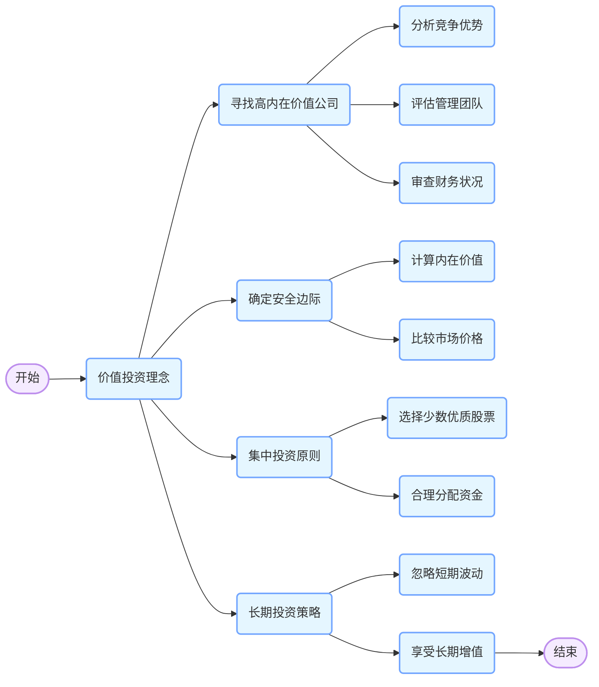

# 巴菲特的焦点投资策略

> 关键词：巴菲特、焦点投资策略、价值投资、集中投资、长期投资

> 摘要：本文深入探讨了巴菲特的焦点投资策略。从背景介绍出发，阐述了该策略的目的、适用读者、文档结构以及相关术语。详细解析了焦点投资策略的核心概念，包括其原理、架构，并通过文本示意图和Mermaid流程图展示。接着，用Python代码详细阐述了核心算法原理及具体操作步骤，同时给出了相关的数学模型和公式，并举例说明。通过项目实战部分，展示了如何在实际中应用该策略，包括开发环境搭建、源代码实现与解读。分析了该策略的实际应用场景，推荐了学习该策略的工具和资源，最后总结了其未来发展趋势与挑战，还提供了常见问题解答和扩展阅读参考资料，帮助读者全面理解和应用巴菲特的焦点投资策略。

## 1. 背景介绍 
### 1.1 目的和范围
本文章的目的在于全面且深入地剖析巴菲特的焦点投资策略。通过对这一策略的详细解读，帮助投资者理解其内在逻辑和操作方法，从而能够在实际投资中借鉴和应用。文章的范围涵盖了焦点投资策略的核心概念、算法原理、数学模型、实际案例以及未来发展趋势等方面，旨在为读者提供一个系统的学习和应用指南。

### 1.2 预期读者
预期读者主要包括各类投资者，无论是个人投资者还是专业投资机构的从业者。对于个人投资者而言，希望通过学习巴菲特的投资策略，提升自己的投资水平，实现资产的保值增值。对于专业投资者，本文可以作为一个深入研究和交流的参考资料，进一步完善自己的投资体系。此外，金融专业的学生和研究人员也可以从本文中获取关于投资策略的理论和实践知识。

### 1.3 文档结构概述
本文将按照以下结构进行阐述：首先介绍焦点投资策略的背景信息，包括目的、读者群体和文档结构。接着详细讲解核心概念与联系，通过文本示意图和Mermaid流程图展示其架构。然后阐述核心算法原理和具体操作步骤，并用Python代码进行说明。之后给出数学模型和公式，并举例说明。再通过项目实战部分，展示该策略在实际中的应用。分析实际应用场景，推荐相关的工具和资源。最后总结未来发展趋势与挑战，提供常见问题解答和扩展阅读参考资料。

### 1.4 术语表
#### 1.4.1 核心术语定义
- **焦点投资策略**：指集中投资于少数具有长期竞争优势和高内在价值的公司，通过长期持有来获取超额收益的投资策略。
- **价值投资**：一种寻找被低估股票的投资方法，通过分析公司的基本面，如财务状况、盈利能力、竞争优势等，来评估其内在价值，并在股价低于内在价值时买入。
- **集中投资**：将大部分资金集中投资于少数几只股票，而不是分散投资于大量股票，以提高投资组合的收益潜力。
- **长期投资**：指投资者持有股票或其他资产的时间较长，通常为数年甚至数十年，以获得资产的长期增值。

#### 1.4.2 相关概念解释
- **内在价值**：公司未来现金流的现值，是评估公司真实价值的重要指标。它不受市场短期波动的影响，反映了公司的长期盈利能力和发展潜力。
- **安全边际**：指股票的市场价格低于其内在价值的部分。安全边际为投资者提供了一定的缓冲，降低了投资风险。
- **护城河**：指公司具有的一种可持续的竞争优势，能够使其在市场中抵御竞争对手的攻击，保持长期的盈利能力。

#### 1.4.3 缩略词列表
- **ROE**：净资产收益率（Return on Equity），衡量公司盈利能力的重要指标，反映了股东权益的收益水平。
- **EPS**：每股收益（Earnings Per Share），指普通股股东每持有一股所能享有的企业净利润或需承担的企业净亏损。

## 2. 核心概念与联系 

### 核心概念原理
巴菲特的焦点投资策略基于价值投资的理念，核心在于寻找那些具有长期竞争优势和高内在价值的公司，并集中投资于这些公司的股票。该策略认为，市场在短期内可能会出现非理性的波动，但从长期来看，股票价格会回归其内在价值。因此，投资者应该关注公司的基本面，而不是短期的市场波动。

在选择投资标的时，巴菲特会重点考察公司的以下几个方面：
1. **竞争优势**：公司是否具有可持续的竞争优势，如品牌优势、技术优势、成本优势等。具有竞争优势的公司能够在市场中获得更高的利润率和市场份额。
2. **管理团队**：公司的管理团队是否具有优秀的管理能力和诚信品质。优秀的管理团队能够带领公司实现长期的发展。
3. **财务状况**：公司的财务状况是否健康，如资产负债表、利润表、现金流量表等。健康的财务状况是公司持续发展的基础。
4. **估值水平**：公司的股票价格是否低于其内在价值。只有在股票价格具有足够的安全边际时，才会考虑买入。

### 架构的文本示意图
```plaintext
焦点投资策略
|--价值投资理念
|   |--寻找高内在价值公司
|   |   |--分析竞争优势
|   |   |--评估管理团队
|   |   |--审查财务状况
|   |--确定安全边际
|       |--计算内在价值
|       |--比较市场价格
|--集中投资原则
|   |--选择少数优质股票
|   |--合理分配资金
|--长期投资策略
|   |--忽略短期波动
|   |--享受长期增值
```

### Mermaid流程图


## 3. 核心算法原理 & 具体操作步骤 

### 核心算法原理
焦点投资策略的核心算法在于评估公司的内在价值，并与市场价格进行比较，以确定是否具有投资价值。常用的评估方法是现金流折现法（DCF），该方法的基本原理是将公司未来的现金流折现到当前，得到公司的内在价值。

现金流折现法的公式为：
$$V = \sum_{t=1}^{n} \frac{CF_t}{(1 + r)^t}$$
其中，$V$ 表示公司的内在价值，$CF_t$ 表示第 $t$ 期的现金流，$r$ 表示折现率，$n$ 表示预测期数。

### 具体操作步骤
1. **预测未来现金流**：通过分析公司的历史财务数据、行业发展趋势和宏观经济环境，预测公司未来的现金流。
2. **确定折现率**：折现率反映了投资者对投资回报的要求，通常可以使用资本资产定价模型（CAPM）来确定。
3. **计算内在价值**：将预测的未来现金流按照折现率折现到当前，得到公司的内在价值。
4. **比较市场价格**：将公司的内在价值与市场价格进行比较，如果市场价格低于内在价值，则认为该股票具有投资价值。

### Python源代码实现
```python
import numpy as np

def dcf_valuation(cash_flows, discount_rate):
    """
    计算公司的内在价值
    :param cash_flows: 未来现金流列表
    :param discount_rate: 折现率
    :return: 公司的内在价值
    """
    n = len(cash_flows)
    present_values = []
    for t in range(n):
        present_value = cash_flows[t] / ((1 + discount_rate) ** (t + 1))
        present_values.append(present_value)
    intrinsic_value = sum(present_values)
    return intrinsic_value

# 示例数据
cash_flows = [100, 120, 150, 180, 200]
discount_rate = 0.1

# 计算内在价值
intrinsic_value = dcf_valuation(cash_flows, discount_rate)
print(f"公司的内在价值为: {intrinsic_value}")
```

### 代码解释
1. **函数定义**：`dcf_valuation` 函数接受两个参数：未来现金流列表 `cash_flows` 和折现率 `discount_rate`，返回公司的内在价值。
2. **计算现值**：通过循环遍历未来现金流列表，将每一期的现金流按照折现率折现到当前，得到每一期的现值。
3. **求和**：将每一期的现值相加，得到公司的内在价值。
4. **示例数据**：定义了一个未来现金流列表 `cash_flows` 和折现率 `discount_rate`，并调用 `dcf_valuation` 函数计算公司的内在价值。

## 4. 数学模型和公式 & 详细讲解 & 举例说明 

### 现金流折现法公式
$$V = \sum_{t=1}^{n} \frac{CF_t}{(1 + r)^t}$$
其中：
- $V$：公司的内在价值
- $CF_t$：第 $t$ 期的现金流
- $r$：折现率
- $n$：预测期数

### 详细讲解
现金流折现法的核心思想是将公司未来的现金流折现到当前，得到公司的内在价值。未来的现金流是不确定的，因此需要进行预测。折现率反映了投资者对投资回报的要求，通常可以使用资本资产定价模型（CAPM）来确定。预测期数 $n$ 表示我们预测公司未来现金流的期限。

### 举例说明
假设我们要评估一家公司的内在价值，预测该公司未来 5 年的现金流分别为 100 万元、120 万元、150 万元、180 万元和 200 万元，折现率为 10%。

根据现金流折现法公式，计算该公司的内在价值：
$$
\begin{align*}
V &= \frac{100}{(1 + 0.1)^1} + \frac{120}{(1 + 0.1)^2} + \frac{150}{(1 + 0.1)^3} + \frac{180}{(1 + 0.1)^4} + \frac{200}{(1 + 0.1)^5}\\
&= \frac{100}{1.1} + \frac{120}{1.21} + \frac{150}{1.331} + \frac{180}{1.4641} + \frac{200}{1.61051}\\
&\approx 90.91 + 99.17 + 112.69 + 122.94 + 124.18\\
&= 549.89
\end{align*}
$$

因此，该公司的内在价值约为 549.89 万元。如果该公司的市场价格低于 549.89 万元，则认为该股票具有投资价值。

## 5. 项目实战：代码实际案例和详细解释说明 

### 5.1  开发环境搭建
为了实现焦点投资策略的项目实战，我们需要搭建以下开发环境：
1. **Python 环境**：建议使用 Python 3.7 及以上版本。可以从 Python 官方网站（https://www.python.org/downloads/）下载并安装。
2. **开发工具**：推荐使用 PyCharm 或 Jupyter Notebook 作为开发工具。PyCharm 是一款专业的 Python 集成开发环境，提供了丰富的功能和工具；Jupyter Notebook 是一个交互式的开发环境，适合进行数据分析和模型验证。
3. **必要的库**：需要安装以下 Python 库：
    - `pandas`：用于数据处理和分析。
    - `numpy`：用于数值计算。
    - `matplotlib`：用于数据可视化。

可以使用以下命令安装这些库：
```sh
pip install pandas numpy matplotlib
```

### 5.2  源代码详细实现和代码解读
以下是一个使用 Python 实现焦点投资策略的实际案例：

```python
import pandas as pd
import numpy as np
import matplotlib.pyplot as plt

# 模拟股票数据
data = {
    'stock_name': ['A', 'B', 'C', 'D', 'E'],
    'intrinsic_value': [100, 120, 150, 180, 200],
    'market_price': [80, 130, 140, 160, 220]
}
df = pd.DataFrame(data)

# 计算安全边际
df['safety_margin'] = (df['intrinsic_value'] - df['market_price']) / df['intrinsic_value']

# 筛选具有安全边际的股票
selected_stocks = df[df['safety_margin'] > 0]

# 按照安全边际排序
selected_stocks = selected_stocks.sort_values(by='safety_margin', ascending=False)

# 假设总资金为 100 万元，按照安全边际分配资金
total_funds = 1000000
total_safety_margin = selected_stocks['safety_margin'].sum()
selected_stocks['allocation'] = (selected_stocks['safety_margin'] / total_safety_margin) * total_funds

# 输出结果
print("具有安全边际的股票：")
print(selected_stocks)

# 可视化资金分配
plt.bar(selected_stocks['stock_name'], selected_stocks['allocation'])
plt.xlabel('股票名称')
plt.ylabel('资金分配（元）')
plt.title('焦点投资策略资金分配')
plt.show()
```

### 代码解读
1. **数据模拟**：使用 `pandas` 库创建一个包含股票名称、内在价值和市场价格的 DataFrame。
2. **计算安全边际**：通过公式 `(内在价值 - 市场价格) / 内在价值` 计算每只股票的安全边际。
3. **筛选股票**：筛选出安全边际大于 0 的股票，即具有投资价值的股票。
4. **排序**：按照安全边际从高到低对筛选出的股票进行排序。
5. **资金分配**：假设总资金为 100 万元，按照安全边际的比例分配资金。
6. **输出结果**：打印具有安全边际的股票信息和资金分配情况。
7. **可视化**：使用 `matplotlib` 库绘制柱状图，展示资金分配情况。

### 5.3  代码解读与分析
通过上述代码，我们可以看到如何使用 Python 实现焦点投资策略的基本流程。首先，我们需要对股票的内在价值和市场价格进行评估，计算安全边际。然后，筛选出具有安全边际的股票，并按照安全边际进行排序。最后，根据安全边际的比例分配资金。

这种方法的优点是可以集中投资于具有较高安全边际的股票，提高投资组合的收益潜力。同时，通过可视化资金分配情况，可以直观地了解投资组合的结构。

## 6. 实际应用场景 
### 个人投资
对于个人投资者来说，巴菲特的焦点投资策略可以帮助他们在股票市场中找到具有长期投资价值的股票。个人投资者可以通过分析公司的基本面，评估其内在价值和安全边际，选择少数优质股票进行集中投资。长期持有这些股票，忽略短期的市场波动，享受公司成长带来的收益。

### 机构投资
专业的投资机构也可以采用焦点投资策略，通过深入的研究和分析，挑选出具有竞争优势和高内在价值的公司。机构投资者可以利用其专业的研究团队和资源，对公司进行全面的评估，提高投资决策的准确性。同时，通过集中投资，可以提高投资组合的管理效率，降低交易成本。

### 价值投资基金
价值投资基金通常采用焦点投资策略，以寻找被低估的股票为目标。基金经理会对大量的公司进行研究和分析，挑选出具有投资价值的股票，并集中投资于这些股票。价值投资基金的投资者通常是长期投资者，他们相信通过长期持有具有价值的股票，可以获得超额收益。

## 7. 工具和资源推荐
### 7.1 学习资源推荐
#### 7.1.1 书籍推荐
- 《聪明的投资者》（The Intelligent Investor）：本杰明·格雷厄姆（Benjamin Graham）的经典著作，被誉为价值投资的圣经。书中介绍了价值投资的基本理念和方法，对巴菲特的投资思想产生了深远的影响。
- 《巴菲特致股东的信：投资者和公司高管教程》（Letters to Shareholders of Berkshire Hathaway）：沃伦·巴菲特（Warren Buffett）每年写给伯克希尔·哈撒韦股东的信，包含了他的投资理念、决策过程和对市场的看法。这些信件是学习巴菲特投资策略的宝贵资料。
- 《穷查理宝典：查理·芒格的智慧箴言录》（Poor Charlie's Almanack: The Wit and Wisdom of Charles T. Munger）：介绍了查理·芒格（Charlie Munger）的投资思想和多元思维模型。芒格是巴菲特的长期合作伙伴，他的思想对巴菲特的投资决策产生了重要影响。

#### 7.1.2 在线课程
- Coursera 上的“价值投资基础”（Fundamentals of Value Investing）课程：由哥伦比亚大学商学院教授讲授，介绍了价值投资的基本原理和方法。
- edX 上的“投资学原理”（Principles of Investing）课程：涵盖了投资学的各个方面，包括股票投资、债券投资、资产配置等。

#### 7.1.3 技术博客和网站
- 雪球网（https://xueqiu.com/）：国内知名的投资社区，提供股票行情、财经新闻、投资分析等服务。投资者可以在雪球网上与其他投资者交流经验，学习投资知识。
- 价值投资网（https://www.valueinvestorsclub.com/）：一个专注于价值投资的网站，提供公司分析、投资策略讨论等内容。

### 7.2 开发工具框架推荐
#### 7.2.1 IDE和编辑器
- PyCharm：一款专业的 Python 集成开发环境，提供了丰富的功能和工具，如代码编辑、调试、版本控制等。
- Jupyter Notebook：一个交互式的开发环境，适合进行数据分析和模型验证。可以在浏览器中编写和运行 Python 代码，同时可以插入文本、图片和公式，方便进行文档编写和分享。

#### 7.2.2 调试和性能分析工具
- `pdb`：Python 内置的调试工具，可以帮助开发者在代码中设置断点，逐步执行代码，查看变量的值。
- `cProfile`：Python 标准库中的性能分析工具，可以统计代码的运行时间和函数调用次数，帮助开发者找出性能瓶颈。

#### 7.2.3 相关框架和库
- `pandas`：用于数据处理和分析的 Python 库，提供了高效的数据结构和数据操作方法。
- `numpy`：用于数值计算的 Python 库，提供了多维数组和各种数学函数。
- `matplotlib`：用于数据可视化的 Python 库，可以绘制各种类型的图表，如折线图、柱状图、散点图等。

### 7.3 相关论文著作推荐
#### 7.3.1 经典论文
- 《证券分析》（Security Analysis）：本杰明·格雷厄姆和大卫·多德（David Dodd）的经典著作，奠定了价值投资的理论基础。书中介绍了股票和债券的分析方法，以及如何评估公司的内在价值。
- 《有效市场假说》（Efficient Market Hypothesis）：由尤金·法玛（Eugene F. Fama）提出，认为市场价格已经反映了所有可用的信息，投资者无法通过分析历史数据或其他信息来获得超额收益。虽然该假说与价值投资的理念存在一定的冲突，但对于理解市场的运行机制具有重要意义。

#### 7.3.2 最新研究成果
- 近年来，学术界对焦点投资策略的研究主要集中在以下几个方面：
    - 焦点投资策略的绩效评估：通过实证研究分析焦点投资策略在不同市场环境下的绩效表现。
    - 影响焦点投资策略的因素：研究公司基本面、市场情绪、宏观经济环境等因素对焦点投资策略的影响。
    - 焦点投资策略的改进：提出一些改进焦点投资策略的方法，如结合其他投资策略、引入机器学习算法等。

#### 7.3.3 应用案例分析
- 可以通过研究一些成功的焦点投资案例，如巴菲特投资可口可乐、富国银行等，了解焦点投资策略在实际中的应用和效果。同时，也可以分析一些失败的案例，从中吸取教训，避免在投资中犯同样的错误。

## 8. 总结：未来发展趋势与挑战
### 未来发展趋势
1. **数字化和智能化**：随着科技的不断发展，焦点投资策略可能会与数字化和智能化技术相结合。例如，利用大数据和人工智能技术对公司的基本面进行更深入的分析和预测，提高投资决策的准确性和效率。
2. **多元化投资**：未来的焦点投资策略可能会更加注重多元化投资，不仅局限于股票市场，还可能涉及债券、基金、房地产等其他资产类别。通过多元化投资，可以降低投资组合的风险，提高收益的稳定性。
3. **社会责任投资**：越来越多的投资者开始关注企业的社会责任，未来的焦点投资策略可能会将社会责任纳入投资决策的考虑因素。投资者会更倾向于投资那些具有良好社会形象和环保意识的公司。

### 挑战
1. **市场不确定性**：市场环境是复杂多变的，存在许多不确定性因素，如宏观经济波动、政策变化、行业竞争等。这些因素可能会影响公司的基本面和股票价格，增加焦点投资策略的实施难度。
2. **信息不对称**：在投资过程中，投资者可能会面临信息不对称的问题。公司管理层可能会隐瞒一些重要信息，或者市场上存在虚假信息，这会影响投资者对公司内在价值的评估。
3. **情绪因素**：投资者的情绪也会对投资决策产生影响。在市场波动较大时，投资者可能会受到恐惧和贪婪情绪的影响，做出不理性的投资决策。

## 9. 附录：常见问题与解答
### 问题 1：焦点投资策略适合所有投资者吗？
答：焦点投资策略并不适合所有投资者。该策略需要投资者具备一定的专业知识和分析能力，能够对公司的基本面进行深入的研究和评估。同时，焦点投资策略要求投资者具有较强的风险承受能力和长期投资的理念，能够忽略短期的市场波动。因此，对于缺乏投资经验和风险承受能力较低的投资者来说，可能不太适合采用焦点投资策略。

### 问题 2：如何确定公司的内在价值？
答：确定公司的内在价值是焦点投资策略的关键。常用的方法是现金流折现法（DCF），该方法需要预测公司未来的现金流，并将其折现到当前。此外，还可以使用相对估值法，如市盈率法（PE）、市净率法（PB）等，将公司的估值与同行业的其他公司进行比较。在实际应用中，通常会综合使用多种方法来评估公司的内在价值。

### 问题 3：焦点投资策略的风险如何控制？
答：焦点投资策略的风险控制主要通过以下几个方面来实现：
1. **分散投资**：虽然焦点投资策略强调集中投资，但并不是将所有资金都投入到一只股票中。可以选择少数几只不同行业、不同类型的股票进行投资，以降低行业风险和个股风险。
2. **确定安全边际**：在买入股票时，要确保股票的市场价格低于其内在价值，具有足够的安全边际。这样可以在一定程度上降低投资风险。
3. **定期评估**：定期对投资组合进行评估，根据公司的基本面变化和市场情况，及时调整投资组合。

### 问题 4：焦点投资策略需要多长时间才能看到效果？
答：焦点投资策略是一种长期投资策略，通常需要数年甚至数十年的时间才能看到明显的效果。因为该策略的核心是寻找具有长期竞争优势和高内在价值的公司，并长期持有这些公司的股票。在短期内，股票价格可能会受到市场波动的影响，但从长期来看，股票价格会回归其内在价值。因此，投资者需要有耐心和长期投资的理念。

## 10. 扩展阅读 & 参考资料
### 扩展阅读
- 《金融炼金术》（The Alchemy of Finance）：乔治·索罗斯（George Soros）的著作，介绍了他的反身性理论和投资哲学。
- 《黑天鹅》（The Black Swan）：纳西姆·尼古拉斯·塔勒布（Nassim Nicholas Taleb）的著作，探讨了不可预测的重大事件对金融市场和投资的影响。

### 参考资料
- 沃伦·巴菲特官方网站（https://www.berkshirehathaway.com/）：提供了巴菲特每年写给股东的信和伯克希尔·哈撒韦公司的相关信息。
- 雅虎财经（https://finance.yahoo.com/）：提供全球股票行情、财经新闻、公司财报等信息，是投资者获取市场信息的重要来源。

作者：AI天才研究院/AI Genius Institute & 禅与计算机程序设计艺术 /Zen And The Art of Computer Programming