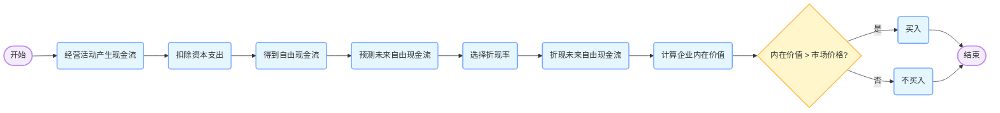

# 巴菲特的现金流分析方法

> 关键词：巴菲特、现金流分析方法、企业估值、财务分析、投资决策

> 摘要：本文深入探讨了巴菲特所采用的现金流分析方法。详细介绍了该方法的背景，包括其目的、适用读者以及文档结构等内容。对现金流分析的核心概念和联系进行了阐述，并给出了相应的原理示意图和流程图。通过Python代码详细讲解了核心算法原理和具体操作步骤，同时运用数学模型和公式对现金流分析进行了理论支持，并辅以实际例子说明。在项目实战部分，提供了开发环境搭建、源代码实现与解读。此外，还分析了现金流分析方法在实际中的应用场景，推荐了相关的学习资源、开发工具框架以及论文著作。最后对该方法的未来发展趋势与挑战进行了总结，并给出了常见问题解答和扩展阅读参考资料，旨在帮助读者全面掌握巴菲特的现金流分析方法，提升投资决策能力。

## 1. 背景介绍 
### 1.1 目的和范围
巴菲特作为全球著名的投资大师，其投资理念和方法一直备受关注。现金流分析方法是巴菲特投资决策中的重要工具之一，它能够帮助投资者评估企业的真实价值和财务健康状况。本文的目的在于深入剖析巴菲特的现金流分析方法，从理论原理到实际操作进行全面讲解，使读者能够理解并运用该方法进行投资分析。范围涵盖了现金流分析的核心概念、算法原理、数学模型、实际应用等多个方面。

### 1.2 预期读者
本文预期读者包括对投资领域感兴趣的初学者、有一定投资经验的投资者、金融专业的学生以及从事财务分析和投资研究的专业人士。无论是希望学习基础投资知识的新手，还是寻求提升投资分析能力的专业人员，都能从本文中获取有价值的信息。

### 1.3 文档结构概述
本文将按照以下结构进行阐述：首先介绍现金流分析方法的背景信息，包括目的、读者和文档结构等；接着讲解核心概念与联系，通过示意图和流程图直观展示；然后详细介绍核心算法原理和具体操作步骤，结合Python代码进行说明；再运用数学模型和公式对现金流分析进行理论解释，并举例说明；之后通过项目实战展示代码实现和解读；分析实际应用场景；推荐相关的工具和资源；最后总结未来发展趋势与挑战，给出常见问题解答和扩展阅读参考资料。

### 1.4 术语表
#### 1.4.1 核心术语定义
- **现金流**：指企业在一定会计期间按照现金收付实现制，通过一定经济活动（包括经营活动、投资活动、筹资活动和非经常性项目）而产生的现金流入、现金流出及其总量情况的总称。
- **自由现金流**：是企业产生的、在满足了再投资需要之后剩余的现金流量，这部分现金流量是在不影响公司持续发展的前提下可供分配给企业资本供应者的最大现金额。
- **折现率**：是指将未来有限期预期收益折算成现值的比率，反映了投资的风险和机会成本。
- **企业内在价值**：是企业在其剩余寿命中可以产生的现金流量的折现值，是评估企业真实价值的重要指标。

#### 1.4.2 相关概念解释
- **经营活动现金流**：反映企业主营业务的现金收支情况，是企业现金的主要来源。健康的企业经营活动现金流应该为正数，表明企业的主营业务能够产生足够的现金。
- **投资活动现金流**：涉及企业的固定资产投资、长期股权投资等活动的现金收支。负数的投资活动现金流可能表示企业正在进行扩张投资。
- **筹资活动现金流**：与企业的股权融资、债务融资等筹资行为相关的现金流量。例如，发行股票或债券获得现金，偿还债务支付现金等。

#### 1.4.3 缩略词列表
- **FCF**：自由现金流（Free Cash Flow）
- **NPV**：净现值（Net Present Value）
- **IRR**：内部收益率（Internal Rate of Return）

## 2. 核心概念与联系 

### 核心概念原理
巴菲特的现金流分析方法核心在于通过评估企业的自由现金流来确定企业的内在价值。自由现金流是企业经营活动产生的现金流量扣除必要的资本支出后剩余的现金，它代表了企业真正可用于分配给股东、偿还债务或进行再投资的现金。

企业的内在价值可以通过将未来各期的自由现金流按照一定的折现率折现到当前时刻来计算。折现率的选择反映了投资的风险程度，风险越高，折现率越高。通过比较企业的内在价值和当前市场价格，投资者可以判断该企业是否被低估或高估，从而做出投资决策。

### 文本示意图
```plaintext
企业经营活动
    |
    |-- 产生经营活动现金流
    |
    |-- 扣除资本支出
    |
    |-- 得到自由现金流
    |
    |-- 预测未来各期自由现金流
    |
    |-- 选择折现率
    |
    |-- 折现未来自由现金流
    |
    |-- 计算企业内在价值
    |
    |-- 与市场价格比较
    |
    |-- 做出投资决策
```

### Mermaid 流程图


## 3. 核心算法原理 & 具体操作步骤 

### 核心算法原理
计算企业内在价值的核心算法是使用净现值（NPV）公式，将未来各期的自由现金流折现到当前时刻。净现值公式如下：

$$NPV = \sum_{t=1}^{n} \frac{FCF_t}{(1 + r)^t}$$

其中，$NPV$ 是净现值，即企业的内在价值；$FCF_t$ 是第 $t$ 期的自由现金流；$r$ 是折现率；$n$ 是预测的期数。

### 具体操作步骤
1. **收集财务数据**：收集企业过去几年的财务报表，包括现金流量表、利润表和资产负债表，以计算历史自由现金流。
2. **计算历史自由现金流**：自由现金流可以通过以下公式计算：
    $$FCF = 经营活动现金流 - 资本支出$$
3. **预测未来自由现金流**：根据企业的历史业绩、行业发展趋势和宏观经济环境等因素，预测未来各期的自由现金流。可以采用线性增长模型、固定增长率模型等方法进行预测。
4. **选择折现率**：折现率的选择需要考虑投资的风险程度。一般可以使用资本资产定价模型（CAPM）来计算折现率：
    $$r = R_f + \beta (R_m - R_f)$$
其中，$R_f$ 是无风险利率，$\beta$ 是企业股票的贝塔系数，$R_m$ 是市场预期收益率。
5. **计算企业内在价值**：使用净现值公式将未来各期的自由现金流折现到当前时刻，得到企业的内在价值。
6. **比较内在价值和市场价格**：将计算得到的企业内在价值与当前市场价格进行比较，如果内在价值大于市场价格，则认为该企业被低估，是一个潜在的投资机会；反之，则认为该企业被高估，不建议投资。

### Python 源代码实现
```python
import numpy as np

def calculate_fcf(operating_cash_flow, capital_expenditure):
    """
    计算自由现金流
    :param operating_cash_flow: 经营活动现金流
    :param capital_expenditure: 资本支出
    :return: 自由现金流
    """
    return operating_cash_flow - capital_expenditure

def calculate_npv(fcf_list, discount_rate):
    """
    计算净现值
    :param fcf_list: 未来各期自由现金流列表
    :param discount_rate: 折现率
    :return: 净现值
    """
    periods = np.arange(1, len(fcf_list) + 1)
    discounted_fcf = [fcf / ((1 + discount_rate) ** t) for fcf, t in zip(fcf_list, periods)]
    return sum(discounted_fcf)

# 示例数据
operating_cash_flow = 100
capital_expenditure = 20
fcf = calculate_fcf(operating_cash_flow, capital_expenditure)

# 预测未来 5 年的自由现金流，假设每年增长 5%
fcf_list = [fcf * (1 + 0.05) ** i for i in range(5)]

# 折现率假设为 10%
discount_rate = 0.1

# 计算企业内在价值
intrinsic_value = calculate_npv(fcf_list, discount_rate)
print(f"企业内在价值: {intrinsic_value}")
```

## 4. 数学模型和公式 & 详细讲解 & 举例说明 

### 数学模型和公式
#### 自由现金流计算公式
$$FCF = 经营活动现金流 - 资本支出$$
该公式表明，自由现金流是企业经营活动产生的现金流量扣除必要的资本支出后剩余的现金。经营活动现金流反映了企业主营业务的现金创造能力，资本支出则是企业为了维持和扩大生产经营所进行的投资。

#### 净现值公式
$$NPV = \sum_{t=1}^{n} \frac{FCF_t}{(1 + r)^t}$$
净现值公式用于计算企业的内在价值。它将未来各期的自由现金流按照折现率 $r$ 折现到当前时刻，然后求和得到企业的内在价值。折现率反映了投资的风险和机会成本，折现后的现金流更能反映其真实价值。

#### 资本资产定价模型（CAPM）
$$r = R_f + \beta (R_m - R_f)$$
资本资产定价模型用于计算折现率。其中，$R_f$ 是无风险利率，通常可以用国债收益率来近似表示；$\beta$ 是企业股票的贝塔系数，反映了企业股票相对于市场的波动性；$R_m$ 是市场预期收益率。

### 详细讲解
- **自由现金流**：自由现金流是企业现金流分析的核心指标，它不受会计政策和非现金项目的影响，能够真实反映企业的现金创造能力。正的自由现金流表明企业有足够的现金用于支付股息、偿还债务或进行再投资，而负的自由现金流则可能意味着企业需要外部融资来维持运营。
- **净现值**：净现值是评估投资项目或企业价值的重要方法。如果净现值大于零，说明该投资项目或企业的预期收益大于成本，是一个可行的投资机会；反之，如果净现值小于零，则不建议投资。
- **资本资产定价模型**：资本资产定价模型通过考虑无风险利率、市场风险溢价和企业的贝塔系数来计算折现率。贝塔系数越大，说明企业股票的波动性越大，投资风险越高，折现率也相应越高。

### 举例说明
假设某企业过去一年的经营活动现金流为 200 万元，资本支出为 50 万元，则该企业的自由现金流为：
$$FCF = 200 - 50 = 150（万元）$$

预测该企业未来 3 年的自由现金流分别为 160 万元、170 万元和 180 万元，折现率为 12%。则该企业的内在价值为：
$$NPV = \frac{160}{(1 + 0.12)^1} + \frac{170}{(1 + 0.12)^2} + \frac{180}{(1 + 0.12)^3}$$
$$NPV = \frac{160}{1.12} + \frac{170}{1.2544} + \frac{180}{1.404928}$$
$$NPV \approx 142.86 + 135.53 + 128.12$$
$$NPV \approx 406.51（万元）$$

如果该企业当前的市场价格为 350 万元，由于内在价值大于市场价格，说明该企业被低估，可能是一个投资机会。

## 5. 项目实战：代码实际案例和详细解释说明 

### 5.1  开发环境搭建
- **Python 安装**：从 Python 官方网站（https://www.python.org/downloads/）下载并安装 Python 3.x 版本。
- **开发工具**：推荐使用 PyCharm 作为开发工具，它是一款功能强大的 Python IDE，提供了代码编辑、调试、自动补全等功能。也可以使用 Jupyter Notebook 进行交互式开发。
- **必要的库安装**：在命令行中使用以下命令安装必要的库：
```sh
pip install numpy pandas matplotlib
```
其中，`numpy` 用于数值计算，`pandas` 用于数据处理，`matplotlib` 用于数据可视化。

### 5.2  源代码详细实现和代码解读
```python
import numpy as np
import pandas as pd
import matplotlib.pyplot as plt

# 读取财务数据
def read_financial_data(file_path):
    """
    读取财务数据文件
    :param file_path: 数据文件路径
    :return: 包含财务数据的 DataFrame
    """
    data = pd.read_csv(file_path)
    return data

# 计算自由现金流
def calculate_fcf(data):
    """
    计算每年的自由现金流
    :param data: 包含经营活动现金流和资本支出的 DataFrame
    :return: 每年的自由现金流列表
    """
    operating_cash_flow = data['Operating Cash Flow'].values
    capital_expenditure = data['Capital Expenditure'].values
    fcf = operating_cash_flow - capital_expenditure
    return fcf

# 预测未来自由现金流
def predict_future_fcf(fcf, growth_rate, years):
    """
    预测未来若干年的自由现金流
    :param fcf: 历史自由现金流列表
    :param growth_rate: 自由现金流增长率
    :param years: 预测的年数
    :return: 未来自由现金流列表
    """
    last_fcf = fcf[-1]
    future_fcf = [last_fcf * (1 + growth_rate) ** i for i in range(1, years + 1)]
    return future_fcf

# 计算净现值
def calculate_npv(fcf_list, discount_rate):
    """
    计算净现值
    :param fcf_list: 自由现金流列表
    :param discount_rate: 折现率
    :return: 净现值
    """
    periods = np.arange(1, len(fcf_list) + 1)
    discounted_fcf = [fcf / ((1 + discount_rate) ** t) for fcf, t in zip(fcf_list, periods)]
    return sum(discounted_fcf)

# 主函数
def main():
    # 读取财务数据
    file_path = 'financial_data.csv'
    data = read_financial_data(file_path)
    
    # 计算历史自由现金流
    historical_fcf = calculate_fcf(data)
    
    # 预测未来 5 年的自由现金流，假设增长率为 3%
    growth_rate = 0.03
    years = 5
    future_fcf = predict_future_fcf(historical_fcf, growth_rate, years)
    
    # 合并历史和未来自由现金流
    all_fcf = np.concatenate((historical_fcf, future_fcf))
    
    # 折现率假设为 10%
    discount_rate = 0.1
    
    # 计算企业内在价值
    intrinsic_value = calculate_npv(all_fcf, discount_rate)
    print(f"企业内在价值: {intrinsic_value}")
    
    # 可视化自由现金流
    plt.plot(np.arange(len(all_fcf)), all_fcf)
    plt.xlabel('Year')
    plt.ylabel('Free Cash Flow')
    plt.title('Free Cash Flow Projection')
    plt.show()

if __name__ == "__main__":
    main()
```

### 代码解读与分析
- **读取财务数据**：`read_financial_data` 函数使用 `pandas` 库的 `read_csv` 函数读取包含经营活动现金流和资本支出的 CSV 文件，并返回一个 `DataFrame` 对象。
- **计算自由现金流**：`calculate_fcf` 函数从 `DataFrame` 中提取经营活动现金流和资本支出数据，然后相减得到每年的自由现金流。
- **预测未来自由现金流**：`predict_future_fcf` 函数根据历史自由现金流和设定的增长率，预测未来若干年的自由现金流。
- **计算净现值**：`calculate_npv` 函数将自由现金流按照折现率折现到当前时刻，然后求和得到净现值。
- **主函数**：`main` 函数调用上述函数完成整个现金流分析过程，包括读取数据、计算历史自由现金流、预测未来自由现金流、计算企业内在价值，并使用 `matplotlib` 库可视化自由现金流的变化趋势。

## 6. 实际应用场景 
### 股票投资
在股票投资中，巴菲特的现金流分析方法可以帮助投资者筛选出具有投资价值的股票。通过计算企业的内在价值，并与当前市场价格进行比较，投资者可以判断该股票是否被低估或高估。如果企业的内在价值大于市场价格，说明该股票可能被低估，具有投资潜力；反之，则不建议投资。

### 企业并购
在企业并购过程中，现金流分析方法可以用于评估目标企业的价值。收购方可以通过分析目标企业的自由现金流，预测其未来的盈利能力和现金创造能力，从而确定合理的收购价格。同时，现金流分析还可以帮助收购方评估目标企业的财务风险，避免因收购带来的财务困境。

### 项目投资决策
对于企业的项目投资决策，现金流分析方法可以帮助企业评估项目的可行性和盈利能力。通过预测项目的未来自由现金流，并计算净现值和内部收益率等指标，企业可以判断该项目是否值得投资。如果项目的净现值大于零，说明该项目的预期收益大于成本，是一个可行的投资项目；反之，则不建议投资。

### 企业财务健康评估
现金流分析方法还可以用于评估企业的财务健康状况。正的自由现金流表明企业有足够的现金用于支付债务、发放股息和进行再投资，财务状况较为健康；而负的自由现金流则可能意味着企业面临财务困境，需要进一步分析原因。

## 7. 工具和资源推荐
### 7.1 学习资源推荐
#### 7.1.1 书籍推荐
- 《巴菲特致股东的信：股份公司教程》：这本书收录了巴菲特历年致股东的信，通过这些信件可以深入了解巴菲特的投资理念和方法，包括现金流分析方法的应用。
- 《财务报表分析与证券定价》：详细介绍了财务报表分析的方法和技巧，以及如何运用财务数据进行企业估值和投资决策，对理解现金流分析方法有很大帮助。
- 《自由现金流的传奇》：专门探讨了自由现金流在企业估值和投资中的重要性，以及如何运用自由现金流进行投资分析。

#### 7.1.2 在线课程
- Coursera 上的“Financial Markets”课程：由耶鲁大学教授罗伯特·席勒（Robert Shiller）授课，介绍了金融市场的基本原理和投资分析方法，包括现金流分析和企业估值。
- edX 上的“Financial Accounting”课程：提供了财务会计的基础知识和财务报表分析的方法，有助于学习者掌握现金流分析所需的财务知识。

#### 7.1.3 技术博客和网站
- Seeking Alpha：一个金融投资领域的知名网站，提供了大量的股票分析、企业财务分析和投资策略文章，其中不乏关于现金流分析方法的应用案例和研究。
- ValueWalk：专注于价值投资领域，分享了许多投资大师的投资理念和方法，包括巴菲特的现金流分析方法。

### 7.2 开发工具框架推荐
#### 7.2.1 IDE和编辑器
- PyCharm：一款功能强大的 Python IDE，提供了代码编辑、调试、自动补全、版本控制等功能，适合 Python 开发。
- Jupyter Notebook：一个交互式的开发环境，支持多种编程语言，特别适合数据分析和可视化。可以在浏览器中编写和运行代码，并实时查看结果。

#### 7.2.2 调试和性能分析工具
- pdb：Python 自带的调试器，可以帮助开发者逐行调试代码，查找代码中的错误。
- cProfile：Python 标准库中的性能分析工具，可以分析代码的运行时间和函数调用次数，帮助开发者优化代码性能。

#### 7.2.3 相关框架和库
- Pandas：一个强大的数据处理和分析库，提供了 DataFrame 和 Series 等数据结构，方便进行数据清洗、转换和分析。
- NumPy：用于数值计算的 Python 库，提供了高效的数组操作和数学函数，是许多数据分析和机器学习库的基础。
- Matplotlib：一个用于数据可视化的 Python 库，可以绘制各种类型的图表，如折线图、柱状图、散点图等，帮助开发者直观地展示数据。

### 7.3 相关论文著作推荐
#### 7.3.1 经典论文
- “The Theory of Investment Value” by John Burr Williams：提出了现金流折现模型（DCF），是企业估值领域的经典论文，为巴菲特的现金流分析方法提供了理论基础。
- “Financial Ratios, Discriminant Analysis and the Prediction of Corporate Bankruptcy” by Edward I. Altman：介绍了 Altman Z-Score 模型，用于预测企业破产的可能性，与现金流分析方法结合可以更全面地评估企业的财务风险。

#### 7.3.2 最新研究成果
- 关注顶级金融学术期刊，如《Journal of Finance》、《Journal of Financial Economics》等，这些期刊发表了许多关于企业估值、现金流分析和投资决策的最新研究成果。
- 参加金融学术会议，如美国金融协会（AFA）年会、西部金融协会（WFA）年会等，与同行交流最新的研究进展。

#### 7.3.3 应用案例分析
- 可以通过阅读专业的金融分析报告和投资研究报告，了解现金流分析方法在实际投资中的应用案例。例如，各大证券公司的研究报告、专业投资机构的研究成果等。

## 8. 总结：未来发展趋势与挑战
### 未来发展趋势
- **数据驱动的现金流分析**：随着大数据和人工智能技术的发展，未来的现金流分析将更加依赖于海量的数据和先进的算法。通过挖掘更多的财务和非财务数据，如社交媒体数据、行业数据等，可以更准确地预测企业的未来自由现金流。
- **多维度的现金流分析**：除了传统的财务指标，未来的现金流分析将考虑更多的维度，如环境、社会和治理（ESG）因素。这些因素对企业的长期发展和现金流状况有着重要影响，将纳入现金流分析的框架中。
- **智能化的投资决策系统**：结合现金流分析方法和人工智能技术，未来将开发出智能化的投资决策系统。这些系统可以自动分析企业的财务数据，计算内在价值，并根据预设的投资策略做出投资决策，提高投资决策的效率和准确性。

### 挑战
- **数据质量和可靠性**：现金流分析依赖于准确的财务数据，但财务数据可能存在造假、错误或不完整的情况。因此，如何保证数据的质量和可靠性是现金流分析面临的重要挑战之一。
- **未来预测的不确定性**：预测未来自由现金流需要考虑许多不确定因素，如市场竞争、技术变革、宏观经济环境等。这些因素的变化难以准确预测，增加了现金流分析的难度和风险。
- **模型的局限性**：现有的现金流分析模型和方法可能存在一定的局限性，不能完全反映企业的真实价值和未来发展潜力。因此，需要不断改进和完善模型，提高现金流分析的准确性和有效性。

## 9. 附录：常见问题与解答
### 问题 1：自由现金流和净利润有什么区别？
自由现金流和净利润是两个不同的概念。净利润是根据会计准则计算出来的企业盈利指标，它考虑了非现金项目，如折旧、摊销等。而自由现金流是企业实际产生的现金流量，扣除了必要的资本支出后剩余的现金。自由现金流更能反映企业的现金创造能力和财务健康状况。

### 问题 2：如何选择合适的折现率？
折现率的选择需要考虑投资的风险程度。一般可以使用资本资产定价模型（CAPM）来计算折现率，其中无风险利率可以用国债收益率来近似表示，贝塔系数反映了企业股票相对于市场的波动性，市场预期收益率可以参考历史市场数据。此外，还可以根据行业特点和企业的具体情况进行调整。

### 问题 3：现金流分析方法是否适用于所有企业？
现金流分析方法适用于大多数企业，但对于一些特殊行业和企业可能存在一定的局限性。例如，对于处于初创期的企业，由于其经营活动现金流可能为负数，且未来发展具有较大的不确定性，现金流分析方法可能难以准确评估其价值。对于一些金融企业，由于其业务模式和财务结构的特殊性，也需要对现金流分析方法进行适当调整。

### 问题 4：如何提高现金流分析的准确性？
为了提高现金流分析的准确性，可以采取以下措施：
- 收集和分析更多的财务和非财务数据，包括企业的历史业绩、行业发展趋势、宏观经济环境等。
- 采用多种预测方法和模型，对未来自由现金流进行预测，并进行敏感性分析，评估不同假设条件下的结果。
- 定期更新和调整分析模型和参数，以反映企业和市场的变化。
- 结合其他分析方法和指标，如财务比率分析、估值倍数分析等，进行综合评估。

## 10. 扩展阅读 & 参考资料
- Buffett, Warren E. "The Essays of Warren Buffett: Lessons for Corporate America." Lawrence A. Cunningham, ed. Cunningham Group, 2008.
- Penman, Stephen H. "Financial Statement Analysis and Security Valuation." McGraw-Hill Education, 2019.
- Koller, Tim, Marc Goedhart, and David Wessels. "Valuation: Measuring and Managing the Value of Companies." Wiley, 2015.
- Shiller, Robert J. "Financial Markets." Coursera, 2014.
- Altman, Edward I. "Financial Ratios, Discriminant Analysis and the Prediction of Corporate Bankruptcy." Journal of Finance, 1968.

作者：AI天才研究院/AI Genius Institute & 禅与计算机程序设计艺术 /Zen And The Art of Computer Programming