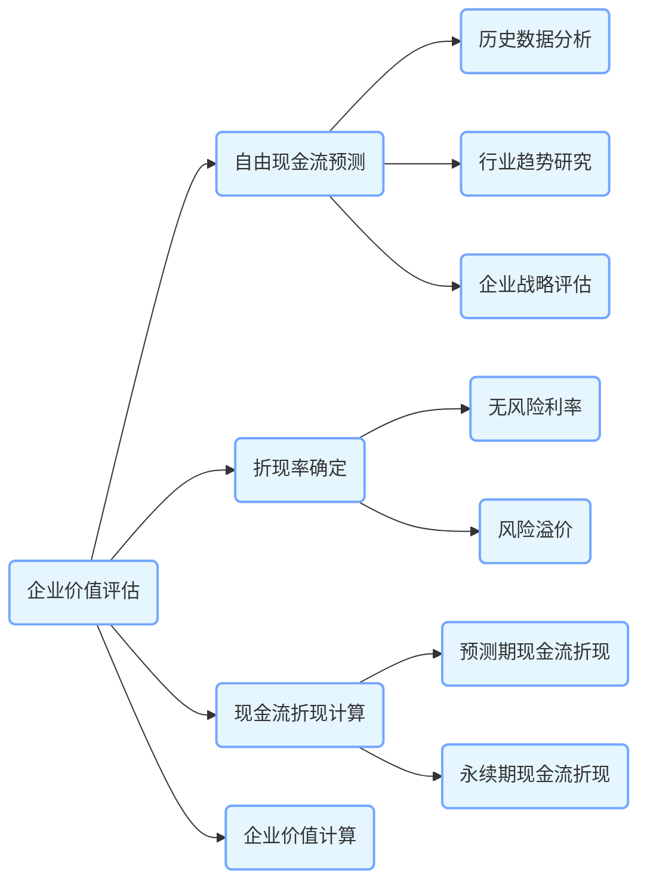

# 巴菲特的现金流评估方法

> 关键词：巴菲特、现金流评估方法、企业价值、自由现金流、折现率

> 摘要：本文深入探讨了巴菲特的现金流评估方法。从该方法的背景入手，详细介绍其核心概念、算法原理、数学模型。通过项目实战展示如何在实际中运用此方法进行企业价值评估，分析其在不同场景下的应用。同时推荐了相关的学习资源、开发工具和论文著作，最后总结该方法的未来发展趋势与挑战，并对常见问题进行解答。帮助读者全面理解和掌握巴菲特的现金流评估方法，为投资决策提供有力支持。

## 1. 背景介绍 
### 1.1 目的和范围
巴菲特作为全球著名的投资大师，其投资理念和方法备受关注。现金流评估方法是巴菲特评估企业价值的核心工具之一。本文的目的是深入剖析这一方法，详细阐述其原理、操作步骤和实际应用，帮助读者掌握该方法并运用到投资决策中。范围涵盖了现金流评估方法的各个方面，包括核心概念、算法原理、数学模型、实际案例等。

### 1.2 预期读者
本文预期读者为对投资领域感兴趣的人士，包括投资者、金融从业者、财经专业学生等。无论是初涉投资领域的新手，还是有一定经验的投资者，都能从本文中获得对巴菲特现金流评估方法的深入理解和实用指导。

### 1.3 文档结构概述
本文首先介绍巴菲特现金流评估方法的背景信息，包括目的、预期读者和文档结构。接着阐述核心概念及其联系，给出原理和架构的文本示意图与 Mermaid 流程图。然后详细讲解核心算法原理和具体操作步骤，使用 Python 源代码进行阐述。随后介绍数学模型和公式，并举例说明。通过项目实战展示代码实际案例和详细解释。分析实际应用场景，推荐相关的工具和资源。最后总结未来发展趋势与挑战，解答常见问题，并提供扩展阅读和参考资料。

### 1.4 术语表
#### 1.4.1 核心术语定义
- **自由现金流（Free Cash Flow，FCF）**：指企业在满足了所有运营成本和资本支出后剩余的现金流量，反映了企业实际可用于分配给股东、偿还债务或进行再投资的现金数量。
- **折现率（Discount Rate）**：用于将未来的现金流折算为当前价值的比率，反映了资金的时间价值和投资的风险程度。
- **企业价值（Enterprise Value，EV）**：指企业的整体价值，包括股权价值和债务价值，通过对未来自由现金流进行折现计算得出。

#### 1.4.2 相关概念解释
- **现金流预测**：对企业未来一段时间内的现金流入和流出进行预估，是现金流评估的基础。
- **永续增长率（Perpetual Growth Rate）**：假设企业在长期内保持的稳定增长率，用于计算企业在永续阶段的现金流。

#### 1.4.3 缩略词列表
- FCF：自由现金流
- EV：企业价值
- NPV：净现值（Net Present Value）

## 2. 核心概念与联系 
### 核心概念原理
巴菲特的现金流评估方法基于一个简单而深刻的原理：企业的价值等于其未来产生的自由现金流的现值之和。自由现金流是企业经营活动中真正能够为股东创造价值的现金流量，它不受会计利润的影响，更能反映企业的实际盈利能力和财务健康状况。

通过预测企业未来的自由现金流，并使用合适的折现率将这些现金流折算为当前价值，就可以得到企业的内在价值。如果企业的市场价格低于其内在价值，那么该企业就具有投资价值；反之，如果市场价格高于内在价值，则可能被高估。

### 架构的文本示意图
```plaintext
企业价值评估
|-- 自由现金流预测
|   |-- 历史数据分析
|   |-- 行业趋势研究
|   |-- 企业战略评估
|-- 折现率确定
|   |-- 无风险利率
|   |-- 风险溢价
|-- 现金流折现计算
|   |-- 预测期现金流折现
|   |-- 永续期现金流折现
|-- 企业价值计算
```

### Mermaid 流程图


## 3. 核心算法原理 & 具体操作步骤 
### 核心算法原理
巴菲特的现金流评估方法主要基于现金流折现模型（Discounted Cash Flow Model，DCF）。该模型的核心思想是将企业未来产生的自由现金流按照一定的折现率折现到当前时刻，以计算企业的内在价值。

具体来说，企业的内在价值 $V$ 可以表示为预测期内自由现金流的现值之和加上永续期自由现金流的现值，公式如下：

$$V = \sum_{t=1}^{n} \frac{FCF_t}{(1 + r)^t} + \frac{FCF_{n+1}}{(r - g)(1 + r)^n}$$

其中：
- $FCF_t$ 表示第 $t$ 年的自由现金流
- $r$ 表示折现率
- $n$ 表示预测期的年数
- $FCF_{n+1}$ 表示预测期结束后第 1 年的自由现金流
- $g$ 表示永续增长率

### 具体操作步骤
#### 步骤 1：预测自由现金流
- 收集企业的历史财务数据，包括营业收入、成本、折旧、资本支出等。
- 分析行业趋势和企业的竞争优势，对企业未来的经营状况进行预测。
- 根据预测的经营数据，计算未来各年的自由现金流。

#### 步骤 2：确定折现率
- 选择合适的无风险利率，通常可以使用国债收益率。
- 评估企业的风险水平，确定风险溢价。
- 将无风险利率和风险溢价相加，得到折现率。

#### 步骤 3：计算现金流折现
- 使用公式 $\frac{FCF_t}{(1 + r)^t}$ 计算预测期内各年自由现金流的现值。
- 计算预测期结束后第 1 年的自由现金流 $FCF_{n+1}$，并使用公式 $\frac{FCF_{n+1}}{(r - g)(1 + r)^n}$ 计算永续期自由现金流的现值。

#### 步骤 4：计算企业价值
将预测期内自由现金流的现值之和与永续期自由现金流的现值相加，得到企业的内在价值。

### Python 源代码实现
```python
def calculate_enterprise_value(fcf_list, discount_rate, perpetual_growth_rate):
    """
    计算企业的内在价值
    :param fcf_list: 预测期内每年的自由现金流列表
    :param discount_rate: 折现率
    :param perpetual_growth_rate: 永续增长率
    :return: 企业的内在价值
    """
    n = len(fcf_list)
    # 计算预测期内自由现金流的现值之和
    present_value_fcf = 0
    for t in range(n):
        present_value_fcf += fcf_list[t] / ((1 + discount_rate) ** (t + 1))
    
    # 计算永续期自由现金流的现值
    last_fcf = fcf_list[-1]
    terminal_value = last_fcf * (1 + perpetual_growth_rate) / (discount_rate - perpetual_growth_rate)
    present_value_terminal = terminal_value / ((1 + discount_rate) ** n)
    
    # 计算企业的内在价值
    enterprise_value = present_value_fcf + present_value_terminal
    return enterprise_value

# 示例数据
fcf_list = [100, 120, 140, 160, 180]  # 预测期内每年的自由现金流
discount_rate = 0.1  # 折现率
perpetual_growth_rate = 0.03  # 永续增长率

# 计算企业的内在价值
ev = calculate_enterprise_value(fcf_list, discount_rate, perpetual_growth_rate)
print(f"企业的内在价值为: {ev}")
```

## 4. 数学模型和公式 & 详细讲解 & 举例说明 
### 数学模型和公式
如前文所述，现金流折现模型的公式为：

$$V = \sum_{t=1}^{n} \frac{FCF_t}{(1 + r)^t} + \frac{FCF_{n+1}}{(r - g)(1 + r)^n}$$

### 详细讲解
- **预测期现金流折现**：$\sum_{t=1}^{n} \frac{FCF_t}{(1 + r)^t}$ 表示预测期内各年自由现金流的现值之和。其中，$\frac{FCF_t}{(1 + r)^t}$ 是将第 $t$ 年的自由现金流 $FCF_t$ 按照折现率 $r$ 折现到当前时刻的价值。随着时间的推移，未来现金流的现值会逐渐减小，这反映了资金的时间价值。
- **永续期现金流折现**：$\frac{FCF_{n+1}}{(r - g)(1 + r)^n}$ 表示永续期自由现金流的现值。假设企业在预测期结束后将以永续增长率 $g$ 持续增长，$FCF_{n+1}$ 是预测期结束后第 1 年的自由现金流。这个公式是基于永续增长模型推导出来的，它假设企业的现金流将永远以固定的增长率增长。

### 举例说明
假设我们要评估一家企业的价值，预测期为 5 年，各年的自由现金流分别为 $FCF_1 = 100$ 万元，$FCF_2 = 120$ 万元，$FCF_3 = 140$ 万元，$FCF_4 = 160$ 万元，$FCF_5 = 180$ 万元。折现率 $r = 10\%$，永续增长率 $g = 3\%$。

#### 步骤 1：计算预测期内自由现金流的现值之和
- 第 1 年：$\frac{100}{(1 + 0.1)^1} \approx 90.91$ 万元
- 第 2 年：$\frac{120}{(1 + 0.1)^2} \approx 99.17$ 万元
- 第 3 年：$\frac{140}{(1 + 0.1)^3} \approx 105.18$ 万元
- 第 4 年：$\frac{160}{(1 + 0.1)^4} \approx 109.29$ 万元
- 第 5 年：$\frac{180}{(1 + 0.1)^5} \approx 111.77$ 万元

预测期内自由现金流的现值之和为：$90.91 + 99.17 + 105.18 + 109.29 + 111.77 = 516.32$ 万元

#### 步骤 2：计算永续期自由现金流的现值
预测期结束后第 1 年的自由现金流 $FCF_6 = 180 \times (1 + 0.03) = 185.4$ 万元

永续期自由现金流的现值为：$\frac{185.4}{(0.1 - 0.03)(1 + 0.1)^5} \approx 1517.37$ 万元

#### 步骤 3：计算企业的内在价值
企业的内在价值 $V = 516.32 + 1517.37 = 2033.69$ 万元

通过以上计算，我们可以得出该企业的内在价值约为 2033.69 万元。

## 5. 项目实战：代码实际案例和详细解释说明 
### 5.1 开发环境搭建
- **Python 安装**：从 Python 官方网站（https://www.python.org/downloads/）下载并安装 Python 3.x 版本。
- **开发工具**：推荐使用 PyCharm 作为开发工具，它是一款功能强大的 Python 集成开发环境（IDE），可以提供代码编辑、调试、版本控制等功能。
- **必要库安装**：在命令行中使用以下命令安装必要的库：
```sh
pip install numpy pandas matplotlib
```

### 5.2 源代码详细实现和代码解读
```python
import numpy as np
import pandas as pd
import matplotlib.pyplot as plt

def calculate_enterprise_value(fcf_list, discount_rate, perpetual_growth_rate):
    """
    计算企业的内在价值
    :param fcf_list: 预测期内每年的自由现金流列表
    :param discount_rate: 折现率
    :param perpetual_growth_rate: 永续增长率
    :return: 企业的内在价值
    """
    n = len(fcf_list)
    # 计算预测期内自由现金流的现值之和
    present_value_fcf = 0
    for t in range(n):
        present_value_fcf += fcf_list[t] / ((1 + discount_rate) ** (t + 1))
    
    # 计算永续期自由现金流的现值
    last_fcf = fcf_list[-1]
    terminal_value = last_fcf * (1 + perpetual_growth_rate) / (discount_rate - perpetual_growth_rate)
    present_value_terminal = terminal_value / ((1 + discount_rate) ** n)
    
    # 计算企业的内在价值
    enterprise_value = present_value_fcf + present_value_terminal
    return enterprise_value

# 示例数据
years = np.arange(1, 6)
fcf_list = [100, 120, 140, 160, 180]  # 预测期内每年的自由现金流
discount_rate = 0.1  # 折现率
perpetual_growth_rate = 0.03  # 永续增长率

# 计算企业的内在价值
ev = calculate_enterprise_value(fcf_list, discount_rate, perpetual_growth_rate)
print(f"企业的内在价值为: {ev}")

# 绘制自由现金流折线图
plt.figure(figsize=(10, 6))
plt.plot(years, fcf_list, marker='o')
plt.title('预测期内自由现金流')
plt.xlabel('年份')
plt.ylabel('自由现金流（万元）')
plt.grid(True)
plt.show()

# 创建 DataFrame 展示数据
data = {
    '年份': years,
    '自由现金流': fcf_list
}
df = pd.DataFrame(data)
print(df)
```

### 代码解读与分析
- **函数 `calculate_enterprise_value`**：该函数实现了现金流折现模型的核心计算逻辑，接受预测期内每年的自由现金流列表、折现率和永续增长率作为输入，返回企业的内在价值。
- **数据准备**：使用 `numpy` 生成年份数组，定义预测期内每年的自由现金流列表、折现率和永续增长率。
- **计算企业内在价值**：调用 `calculate_enterprise_value` 函数计算企业的内在价值，并打印结果。
- **绘制自由现金流折线图**：使用 `matplotlib` 库绘制预测期内自由现金流的折线图，直观展示自由现金流的变化趋势。
- **创建 DataFrame 展示数据**：使用 `pandas` 库创建 DataFrame，将年份和自由现金流数据进行整理并打印输出。

通过以上代码，我们可以清晰地看到如何使用 Python 实现巴菲特的现金流评估方法，并对结果进行可视化展示和数据整理。

## 6. 实际应用场景 
### 股票投资
在股票投资中，巴菲特的现金流评估方法可以帮助投资者确定股票的内在价值，从而判断股票是否被低估或高估。如果股票的市场价格低于其内在价值，投资者可以考虑买入该股票；反之，如果市场价格高于内在价值，则可以考虑卖出或避免买入。

例如，投资者可以通过分析一家公司的财务报表，预测其未来的自由现金流，使用合适的折现率计算出公司的内在价值。然后将该内在价值与股票的市场价格进行比较，做出投资决策。

### 企业并购
在企业并购中，现金流评估方法可以用于评估目标企业的价值，帮助收购方确定合理的收购价格。收购方可以通过对目标企业的自由现金流进行预测和折现，计算出目标企业的内在价值。然后根据市场情况和谈判策略，确定最终的收购价格。

### 项目投资决策
在进行项目投资决策时，现金流评估方法可以帮助企业评估项目的可行性和盈利能力。企业可以预测项目未来的现金流入和流出，计算项目的净现值（NPV）。如果项目的 NPV 大于零，则说明项目具有投资价值；反之，如果 NPV 小于零，则说明项目可能不具有投资价值。

## 7. 工具和资源推荐
### 7.1 学习资源推荐
#### 7.1.1 书籍推荐
- 《巴菲特致股东的信：投资者和公司高管教程》：这本书收录了巴菲特历年致股东的信，通过这些信件可以深入了解巴菲特的投资理念和方法，包括现金流评估方法。
- 《聪明的投资者》：本杰明·格雷厄姆的经典著作，被誉为投资界的圣经。书中介绍了价值投资的基本原理和方法，对理解现金流评估方法有很大的帮助。
- 《财务报表分析与证券定价》：这本书详细介绍了如何通过分析企业的财务报表来评估企业的价值，包括自由现金流的计算和折现等内容。

#### 7.1.2 在线课程
- Coursera 上的“投资学原理”课程：该课程由知名大学的教授授课，涵盖了投资学的基本原理和方法，包括现金流折现模型的应用。
- Udemy 上的“价值投资实战课程”：课程结合实际案例，详细讲解了价值投资的方法和技巧，包括如何使用现金流评估方法进行企业价值评估。

#### 7.1.3 技术博客和网站
- 雪球网：国内知名的投资社区，有很多投资者分享自己的投资经验和研究成果，包括对现金流评估方法的应用和探讨。
- Seeking Alpha：国外知名的投资研究网站，提供大量的公司分析报告和投资策略文章，对理解现金流评估方法有很大的帮助。

### 7.2 开发工具框架推荐
#### 7.2.1 IDE和编辑器
- PyCharm：功能强大的 Python 集成开发环境，提供代码编辑、调试、版本控制等功能，适合 Python 开发。
- Jupyter Notebook：交互式的开发环境，适合进行数据分析和模型验证，可以方便地展示代码和结果。

#### 7.2.2 调试和性能分析工具
- PDB：Python 自带的调试工具，可以帮助开发者定位代码中的问题。
- cProfile：Python 内置的性能分析工具，可以分析代码的执行时间和函数调用情况，帮助优化代码性能。

#### 7.2.3 相关框架和库
- NumPy：Python 中用于科学计算的基础库，提供了高效的数组操作和数学函数。
- Pandas：用于数据处理和分析的库，提供了数据结构和数据操作方法，方便进行财务数据的处理和分析。
- Matplotlib：用于数据可视化的库，可以绘制各种类型的图表，帮助直观展示数据和结果。

### 7.3 相关论文著作推荐
#### 7.3.1 经典论文
- “The Theory of Investment Value” by John Burr Williams：该论文提出了现金流折现模型的基本思想，是现金流评估方法的经典之作。
- “Security Analysis” by Benjamin Graham and David Dodd：这本书奠定了价值投资的理论基础，对现金流评估方法的发展产生了重要影响。

#### 7.3.2 最新研究成果
- 可以关注《Journal of Financial Economics》《The Review of Financial Studies》等金融领域的顶级学术期刊，了解关于现金流评估方法的最新研究成果。

#### 7.3.3 应用案例分析
- 一些知名投资机构的研究报告中会包含现金流评估方法的应用案例分析，可以从中学习实际应用中的技巧和经验。

## 8. 总结：未来发展趋势与挑战
### 未来发展趋势
- **与大数据和人工智能结合**：随着大数据和人工智能技术的发展，未来现金流评估方法可以结合更多的数据来源和先进的算法，提高现金流预测的准确性和效率。例如，通过分析社交媒体数据、行业新闻等非结构化数据，获取更多关于企业的信息，从而更准确地预测企业的未来现金流。
- **更加注重可持续发展**：在可持续发展的背景下，未来的现金流评估方法可能会更加注重企业的环境、社会和治理（ESG）因素。这些因素可能会对企业的长期现金流产生影响，因此在评估企业价值时需要将其纳入考虑范围。
- **国际化应用**：随着全球经济的一体化，现金流评估方法将在国际范围内得到更广泛的应用。不同国家和地区的企业在财务报表、税收政策等方面存在差异，需要对现金流评估方法进行适当的调整和改进，以适应不同的市场环境。

### 挑战
- **现金流预测的不确定性**：现金流预测是现金流评估方法的关键环节，但由于市场环境的不确定性、企业经营的复杂性等因素，现金流预测往往存在较大的误差。如何提高现金流预测的准确性是未来需要解决的重要问题。
- **折现率的确定**：折现率的确定是现金流评估方法中的另一个难点，它受到无风险利率、风险溢价等多种因素的影响。不同的投资者对风险的认知和承受能力不同，因此折现率的确定具有一定的主观性。如何合理确定折现率是提高现金流评估方法准确性的关键。
- **数据质量和可用性**：现金流评估方法需要大量的财务数据和市场数据作为支撑，但在实际应用中，数据质量和可用性可能会受到限制。例如，一些企业的财务报表可能存在造假行为，市场数据可能存在误差或不完整的情况。如何获取高质量、可靠的数据是现金流评估方法面临的挑战之一。

## 9. 附录：常见问题与解答
### 问题 1：自由现金流和净利润有什么区别？
自由现金流是企业在满足了所有运营成本和资本支出后剩余的现金流量，它不受会计利润的影响，更能反映企业的实际盈利能力和财务健康状况。净利润是企业在一定时期内的经营成果，按照会计准则计算得出，可能包含非现金项目和会计估计的影响。

### 问题 2：如何确定折现率？
折现率的确定需要考虑无风险利率和风险溢价两个因素。无风险利率通常可以使用国债收益率，风险溢价则需要根据企业的行业特点、经营风险、财务风险等因素进行评估。可以参考同行业类似企业的折现率，也可以使用资本资产定价模型（CAPM）等方法进行计算。

### 问题 3：永续增长率应该如何取值？
永续增长率的取值需要综合考虑行业的发展趋势、企业的竞争优势、宏观经济环境等因素。一般来说，永续增长率不宜过高，通常在 2% - 5% 之间。如果取值过高，可能会导致企业价值被高估。

### 问题 4：现金流评估方法适用于所有企业吗？
现金流评估方法适用于大多数具有稳定现金流的企业，但对于一些处于初创期、亏损期或现金流波动较大的企业，该方法可能不太适用。在这种情况下，可以结合其他评估方法，如市场比较法、成本法等进行综合评估。

## 10. 扩展阅读 & 参考资料
- 《巴菲特的投资组合》，作者：罗伯特·哈格斯特朗
- 《价值投资实战手册》，作者：唐朝
- 巴菲特历年致股东的信，可在伯克希尔·哈撒韦公司官方网站查阅
- 相关金融学术期刊，如《Journal of Finance》《Financial Analysts Journal》等

作者：AI天才研究院/AI Genius Institute & 禅与计算机程序设计艺术 /Zen And The Art of Computer Programming