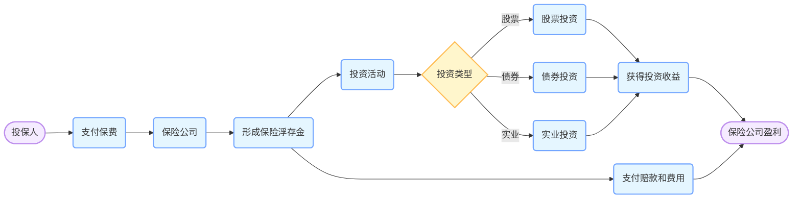

# 巴菲特的看家本领：保险浮存金的魔力

> 关键词：巴菲特、保险浮存金、投资策略、保险业务、金融魔力、资金运用、价值创造

> 摘要：本文深入探讨了巴菲特投资策略中的核心要素——保险浮存金的魔力。首先介绍了保险浮存金的背景知识，包括其目的、适用读者、文档结构和相关术语。接着阐述了保险浮存金的核心概念、原理及架构，并通过Mermaid流程图进行清晰展示。详细讲解了保险浮存金在投资中的核心算法原理，用Python代码示例说明。从数学模型和公式角度分析了保险浮存金对投资回报的影响，并举例说明。通过项目实战案例，展示了保险浮存金在实际投资中的运用和效果。探讨了保险浮存金在不同领域的实际应用场景，推荐了相关的学习资源、开发工具框架和论文著作。最后总结了保险浮存金的未来发展趋势与挑战，还给出了常见问题的解答和扩展阅读参考资料，全面剖析了保险浮存金这一巴菲特投资成功的关键因素。

## 1. 背景介绍 
### 1.1 目的和范围
本文旨在深入剖析巴菲特投资体系中保险浮存金这一关键因素的作用、原理和应用。通过全面的研究，我们将探讨保险浮存金如何成为巴菲特长期投资成功的重要支撑，以及其在金融市场中的独特价值。范围涵盖保险浮存金的基本概念、核心算法、数学模型、实际应用案例等多个方面，旨在为投资者、金融从业者和对巴菲特投资策略感兴趣的人士提供全面而深入的理解。

### 1.2 预期读者
- **投资者**：希望学习巴菲特投资理念，寻找长期投资策略和方法的个人投资者。
- **金融从业者**：包括保险行业、投资银行、资产管理等领域的专业人士，希望了解保险浮存金在金融市场中的运作机制和应用。
- **学者和研究人员**：对金融投资、保险学等领域进行学术研究的人员，为相关研究提供理论和实践参考。
- **对巴菲特投资策略感兴趣的人士**：想要深入了解巴菲特投资成功背后的奥秘，学习其独特投资智慧的普通读者。

### 1.3 文档结构概述
本文将按照以下结构展开：
1. **背景介绍**：阐述文章的目的、预期读者、文档结构和相关术语。
2. **核心概念与联系**：介绍保险浮存金的核心概念、原理和架构，并通过Mermaid流程图进行展示。
3. **核心算法原理 & 具体操作步骤**：用Python代码详细讲解保险浮存金在投资中的核心算法原理和操作步骤。
4. **数学模型和公式 & 详细讲解 & 举例说明**：通过数学模型和公式分析保险浮存金对投资回报的影响，并举例说明。
5. **项目实战：代码实际案例和详细解释说明**：通过实际案例展示保险浮存金在投资中的应用和效果。
6. **实际应用场景**：探讨保险浮存金在不同领域的实际应用场景。
7. **工具和资源推荐**：推荐相关的学习资源、开发工具框架和论文著作。
8. **总结：未来发展趋势与挑战**：总结保险浮存金的未来发展趋势和面临的挑战。
9. **附录：常见问题与解答**：解答关于保险浮存金的常见问题。
10. **扩展阅读 & 参考资料**：提供扩展阅读的建议和参考资料。

### 1.4 术语表
#### 1.4.1 核心术语定义
- **保险浮存金**：保险公司在经营保险业务过程中，从投保人处收取的保费与实际支付的赔款和费用之间的时间差所形成的资金沉淀。这部分资金归保险公司暂时持有和使用，在未来需要用于支付保险赔款等负债。
- **投资回报率（ROI）**：通过投资而应返回的价值，即企业从一项投资活动中得到的经济回报。计算公式为：$ROI = \frac{投资收益 - 投资成本}{投资成本} \times 100\%$。
- **承保利润**：保险公司在保险业务经营中，保费收入扣除赔款、费用和税金等支出后的盈余。
- **资金成本**：企业为筹集和使用资金而付出的代价，包括资金筹集费用和资金占用费用两部分。

#### 1.4.2 相关概念解释
- **保险业务模式**：保险公司通过向投保人收取保费，承担未来可能发生的保险责任。在保费收取和赔款支付之间存在时间差，这就产生了保险浮存金。
- **投资组合**：投资者将资金分散投资于不同的资产，以降低风险并实现预期的投资回报。巴菲特利用保险浮存金构建多元化的投资组合。
- **杠杆效应**：通过使用他人的资金（如保险浮存金）进行投资，以增加投资回报的潜力。但同时也增加了投资风险。

#### 1.4.3 缩略词列表
- **ROI**：Return on Investment（投资回报率）

## 2. 核心概念与联系 
### 核心概念原理
保险浮存金的核心原理源于保险业务的运营模式。保险公司在销售保险产品时，会提前收取投保人的保费。然而，保险事故的发生是不确定的，赔款的支付通常会在一段时间后才进行。这就导致了保险公司在一段时间内持有了大量的资金，即保险浮存金。

从本质上讲，保险浮存金是保险公司的一种负债，因为它最终需要用于支付保险赔款和相关费用。但在资金的持有期间，保险公司可以将其用于投资，以获取额外的收益。

### 架构的文本示意图
保险浮存金的架构可以用以下方式描述：

投保人 -> 支付保费 -> 保险公司（形成保险浮存金）
保险公司（保险浮存金） -> 投资活动（股票、债券、实业等） -> 获得投资收益
保险公司（保险浮存金） -> 支付赔款和费用

### Mermaid 流程图


这个流程图展示了保险浮存金的形成、运用和最终对保险公司盈利的影响。投保人支付保费形成保险浮存金，保险公司将其用于不同类型的投资活动以获取收益，同时需要支付赔款和费用，最终实现盈利。

## 3. 核心算法原理 & 具体操作步骤 
### 核心算法原理
保险浮存金的核心算法主要围绕投资回报率的计算和资金的合理运用。我们可以通过一个简化的模型来理解。假设保险公司每年新增的保险浮存金为 $F$，投资回报率为 $r$，资金的持有时间为 $t$ 年。那么在 $t$ 年后，投资收益 $I$ 可以通过以下公式计算：

$I = F \times r \times t$

在实际操作中，我们需要考虑多个因素，如每年新增浮存金的变化、投资回报率的波动等。

### 具体操作步骤
1. **确定保险浮存金规模**：通过分析保险公司的财务报表，确定每年新增的保险浮存金金额。
2. **评估投资回报率**：根据历史数据和市场分析，评估不同投资项目的预期回报率。
3. **构建投资组合**：根据投资回报率和风险偏好，将保险浮存金分配到不同的投资项目中。
4. **定期监控和调整**：定期评估投资组合的表现，根据市场变化和公司战略调整投资组合。

### Python 源代码示例
```python
# 假设每年新增保险浮存金
annual_float = 1000000  # 100 万美元
# 投资回报率
investment_return_rate = 0.1  # 10%
# 投资年限
years = 10

# 初始化总收益
total_income = 0

# 模拟每年的投资收益
for year in range(1, years + 1):
    # 计算当年的投资收益
    income = annual_float * investment_return_rate * year
    total_income += income

print(f"在 {years} 年后，总投资收益为: ${total_income}")
```

### 代码解释
1. **变量定义**：定义了每年新增保险浮存金 `annual_float`、投资回报率 `investment_return_rate` 和投资年限 `years`。
2. **初始化总收益**：使用 `total_income` 变量来存储总投资收益，初始值为 0。
3. **循环计算每年的投资收益**：使用 `for` 循环模拟每年的投资收益，根据公式 $I = F \times r \times t$ 计算每年的收益，并累加到 `total_income` 中。
4. **输出结果**：打印出在指定年限后，保险浮存金的总投资收益。

## 4. 数学模型和公式 & 详细讲解 & 举例说明 
### 数学模型和公式
#### 简单投资收益模型
如前面所述，简单的投资收益公式为：

$I = F \times r \times t$

其中：
- $I$ 表示投资收益
- $F$ 表示保险浮存金规模
- $r$ 表示投资回报率
- $t$ 表示资金的持有时间

#### 考虑复利的投资收益模型
在实际情况中，投资收益往往会产生复利效应。假设每年的投资回报率不变，复利计算的投资收益公式为：

$A = F \times (1 + r)^t$

其中：
- $A$ 表示最终的资金总额
- $F$ 表示初始的保险浮存金规模
- $r$ 表示投资回报率
- $t$ 表示投资年限

投资收益 $I$ 可以通过 $I = A - F$ 计算得出。

### 详细讲解
#### 简单投资收益模型
简单投资收益模型假设投资回报率在资金持有期间保持不变，且不考虑复利的影响。这种模型适用于短期投资或投资回报率相对稳定的情况。它直观地展示了保险浮存金规模、投资回报率和资金持有时间对投资收益的影响。

#### 考虑复利的投资收益模型
复利是指在每一个计息期后，将所生利息加入本金再计利息。复利计算的投资收益模型更符合实际的投资情况，因为投资收益会随着时间的推移而不断累积。在长期投资中，复利的作用会非常显著，能够大幅增加投资收益。

### 举例说明
#### 简单投资收益模型举例
假设保险公司有 500 万美元的保险浮存金，投资回报率为 8%，资金持有时间为 5 年。根据简单投资收益模型，投资收益为：

$I = 5000000 \times 0.08 \times 5 = 2000000$（美元）

即在 5 年后，保险公司通过投资保险浮存金获得了 200 万美元的收益。

#### 考虑复利的投资收益模型举例
同样假设保险公司有 500 万美元的保险浮存金，投资回报率为 8%，投资年限为 5 年。根据复利计算的投资收益模型，最终的资金总额为：

$A = 5000000 \times (1 + 0.08)^5 \approx 7346640$（美元）

投资收益为：

$I = A - F = 7346640 - 5000000 = 2346640$（美元）

可以看到，考虑复利后，投资收益比简单投资收益模型计算的结果更高。这体现了复利在长期投资中的强大威力。

## 5. 项目实战：代码实际案例和详细解释说明 
### 5.1  开发环境搭建
#### 操作系统
可以选择 Windows、Linux 或 macOS 操作系统。建议使用最新版本以获得更好的性能和兼容性。

#### Python 安装
从 Python 官方网站（https://www.python.org/downloads/）下载并安装 Python 3.x 版本。安装完成后，确保 `python` 和 `pip` 命令可以在命令行中正常使用。

#### 开发工具
推荐使用 Visual Studio Code 或 PyCharm 作为开发工具。这些工具提供了丰富的代码编辑、调试和项目管理功能。

#### 必要的库安装
在命令行中使用以下命令安装所需的库：
```sh
pip install numpy pandas matplotlib
```
- `numpy`：用于数值计算和数组操作。
- `pandas`：用于数据处理和分析。
- `matplotlib`：用于数据可视化。

### 5.2  源代码详细实现和代码解读
```python
import numpy as np
import pandas as pd
import matplotlib.pyplot as plt

# 模拟保险浮存金数据
years = 20
annual_float_increase = [np.random.randint(500000, 1000000) for _ in range(years)]  # 每年新增保险浮存金
investment_return_rate = 0.09  # 投资回报率

# 初始化数据
total_float = 0
investment_income = []
total_float_history = []

# 模拟每年的投资过程
for i in range(years):
    # 计算当年的保险浮存金总额
    total_float += annual_float_increase[i]
    total_float_history.append(total_float)
    
    # 计算当年的投资收益
    income = total_float * investment_return_rate
    investment_income.append(income)

# 创建 DataFrame 存储数据
data = {
    'Year': range(1, years + 1),
    'Annual Float Increase': annual_float_increase,
    'Total Float': total_float_history,
    'Investment Income': investment_income
}
df = pd.DataFrame(data)

# 打印数据
print(df)

# 可视化投资收益和保险浮存金总额的变化
plt.figure(figsize=(12, 6))

plt.subplot(1, 2, 1)
plt.plot(df['Year'], df['Total Float'], label='Total Float')
plt.xlabel('Year')
plt.ylabel('Total Float ($)')
plt.title('Total Insurance Float Over Years')
plt.legend()

plt.subplot(1, 2, 2)
plt.plot(df['Year'], df['Investment Income'], label='Investment Income', color='orange')
plt.xlabel('Year')
plt.ylabel('Investment Income ($)')
plt.title('Investment Income Over Years')
plt.legend()

plt.tight_layout()
plt.show()
```

### 5.3  代码解读与分析
#### 代码功能概述
这段代码模拟了一个保险公司在 20 年内的保险浮存金增长和投资收益情况。通过随机生成每年新增的保险浮存金，结合固定的投资回报率，计算每年的保险浮存金总额和投资收益。最后，使用 `pandas` 存储数据，并使用 `matplotlib` 进行可视化展示。

#### 代码详细解读
1. **导入必要的库**：导入 `numpy`、`pandas` 和 `matplotlib.pyplot` 库，用于数值计算、数据处理和可视化。
2. **模拟保险浮存金数据**：
    - `years`：设定模拟的年限为 20 年。
    - `annual_float_increase`：使用 `np.random.randint` 随机生成每年新增的保险浮存金，范围在 50 万美元到 100 万美元之间。
    - `investment_return_rate`：设定投资回报率为 9%。
3. **初始化数据**：
    - `total_float`：初始化保险浮存金总额为 0。
    - `investment_income`：用于存储每年的投资收益。
    - `total_float_history`：用于存储每年的保险浮存金总额。
4. **模拟每年的投资过程**：
    - 使用 `for` 循环模拟每年的投资过程。
    - 计算当年的保险浮存金总额，并将其添加到 `total_float_history` 中。
    - 根据保险浮存金总额和投资回报率计算当年的投资收益，并将其添加到 `investment_income` 中。
5. **创建 DataFrame 存储数据**：使用 `pandas` 的 `DataFrame` 存储模拟的数据，包括年份、每年新增保险浮存金、保险浮存金总额和投资收益。
6. **打印数据**：打印存储数据的 `DataFrame`。
7. **可视化数据**：
    - 使用 `matplotlib` 创建一个包含两个子图的图形。
    - 左子图展示保险浮存金总额随年份的变化。
    - 右子图展示投资收益随年份的变化。

#### 代码分析
通过这个模拟案例，我们可以直观地看到保险浮存金的增长和投资收益的积累过程。随着保险浮存金的不断增加，投资收益也会相应增加。这体现了保险浮存金在投资中的重要作用。同时，可视化结果可以帮助我们更好地理解保险浮存金和投资收益之间的关系，为实际投资决策提供参考。

## 6. 实际应用场景 
### 股票投资
巴菲特利用保险浮存金大量投资于优质股票。例如，伯克希尔·哈撒韦公司持有可口可乐、苹果等公司的大量股票。保险浮存金为巴菲特提供了长期稳定的资金来源，使其能够在股票市场中进行长期投资。通过长期持有优质股票，巴菲特获得了丰厚的股息收入和资本增值。

### 债券投资
保险浮存金也可以用于债券投资。债券具有相对稳定的收益和较低的风险，适合作为保险资金的一部分投资标的。巴菲特会根据市场情况和利率走势，选择合适的债券进行投资，以获取稳定的利息收入。

### 实业投资
巴菲特还利用保险浮存金进行实业投资。伯克希尔·哈撒韦公司收购了众多的企业，如 GEICO 保险公司、伯灵顿北方圣太菲铁路运输公司等。通过对实业的投资，巴菲特不仅获得了企业的经营利润，还实现了产业的协同发展。

### 并购活动
保险浮存金为巴菲特进行并购活动提供了强大的资金支持。在并购过程中，巴菲特可以利用保险浮存金支付并购款项，实现对目标企业的收购和整合。通过并购，伯克希尔·哈撒韦公司不断扩大业务版图，提升市场竞争力。

## 7. 工具和资源推荐
### 7.1 学习资源推荐
#### 7.1.1 书籍推荐
- 《巴菲特致股东的信：股份公司教程》：这本书收录了巴菲特历年致股东的信，详细阐述了他的投资理念、方法和对企业的分析。通过阅读这本书，读者可以深入了解巴菲特的投资思想和决策过程。
- 《聪明的投资者》：本杰明·格雷厄姆的经典著作，被誉为投资界的圣经。书中介绍了价值投资的基本原理和方法，对巴菲特的投资理念产生了深远的影响。
- 《滚雪球：巴菲特和他的财富人生》：这是一本关于巴菲特的传记，详细描述了他的成长经历、投资生涯和人生哲学。通过阅读这本书，读者可以更全面地了解巴菲特的个人魅力和投资智慧。

#### 7.1.2 在线课程
- Coursera 上的“投资学原理”：该课程由知名大学的教授授课，系统地介绍了投资学的基本原理和方法，包括股票投资、债券投资、资产配置等内容。
- edX 上的“价值投资：从格雷厄姆到巴菲特”：课程深入讲解了价值投资的理论和实践，分析了格雷厄姆和巴菲特的投资策略和方法，适合对价值投资感兴趣的学习者。

#### 7.1.3 技术博客和网站
- 伯克希尔·哈撒韦公司官方网站：可以获取巴菲特历年致股东的信、公司的财务报表和重要公告等信息。
- 雪球网：国内知名的投资社区，提供股票、基金等投资产品的信息和分析，还有众多投资者分享自己的投资经验和观点。
- Seeking Alpha：国际知名的金融投资网站，提供全球金融市场的新闻、分析和研究报告，有助于投资者了解市场动态和投资机会。

### 7.2 开发工具框架推荐
#### 7.2.1 IDE和编辑器
- Visual Studio Code：一款轻量级的代码编辑器，支持多种编程语言，具有丰富的插件生态系统。可以用于编写 Python 代码进行投资分析和模拟。
- PyCharm：专业的 Python 集成开发环境，提供强大的代码编辑、调试和项目管理功能，适合开发复杂的投资分析程序。

#### 7.2.2 调试和性能分析工具
- `pdb`：Python 内置的调试器，可以帮助开发者在代码运行过程中进行调试，定位和解决问题。
- `cProfile`：Python 的性能分析工具，可以分析代码的运行时间和函数调用情况，帮助开发者优化代码性能。

#### 7.2.3 相关框架和库
- `pandas`：用于数据处理和分析的 Python 库，提供了丰富的数据结构和数据操作方法，适合处理金融数据。
- `numpy`：用于数值计算的 Python 库，提供了高效的数组操作和数学函数，在投资分析中经常使用。
- `matplotlib`：用于数据可视化的 Python 库，可以创建各种类型的图表，帮助投资者直观地展示数据和分析结果。

### 7.3 相关论文著作推荐
#### 7.3.1 经典论文
- 《证券分析》：本杰明·格雷厄姆和大卫·多德的经典论文，奠定了价值投资的理论基础。论文中提出了“内在价值”的概念和评估方法，对后来的投资理论和实践产生了深远的影响。
- 《有效市场假说》：尤金·法玛的论文，提出了有效市场假说，认为在有效市场中，股票价格已经反映了所有可用的信息。这一理论对投资策略的制定和市场效率的研究具有重要意义。

#### 7.3.2 最新研究成果
- 关于保险资金运用和风险管理的最新研究论文，探讨了保险浮存金在不同市场环境下的投资策略和风险控制方法。
- 对巴菲特投资策略的实证研究论文，分析了巴菲特投资组合的绩效和风险特征，以及保险浮存金在其中的作用。

#### 7.3.3 应用案例分析
- 对伯克希尔·哈撒韦公司投资案例的分析论文，深入研究了巴菲特在不同行业和企业的投资决策过程和投资效果。
- 其他保险公司利用保险浮存金进行投资的成功案例分析，为投资者提供借鉴和参考。

## 8. 总结：未来发展趋势与挑战
### 未来发展趋势
#### 多元化投资
随着金融市场的不断发展和创新，未来保险浮存金的投资将更加多元化。除了传统的股票、债券和实业投资，保险资金可能会更多地涉足新兴领域，如科技、医疗、新能源等。多元化投资可以降低投资风险，提高投资回报。

#### 全球化投资
经济全球化的趋势将促使保险资金进行更广泛的全球化投资。保险公司可以通过投资海外市场，获取更多的投资机会和收益。同时，全球化投资也可以分散市场风险，提高保险资金的稳定性。

#### 科技赋能投资
科技的快速发展将为保险浮存金的投资带来新的机遇。人工智能、大数据、区块链等技术可以帮助保险公司更好地进行风险评估、投资决策和资产管理。例如，利用人工智能算法进行股票筛选和投资组合优化，利用大数据分析市场趋势和客户需求。

### 面临的挑战
#### 市场波动风险
金融市场的波动是保险浮存金投资面临的主要风险之一。股票市场的涨跌、债券市场的利率波动等都会影响投资收益。保险公司需要加强风险管理，制定合理的投资策略，以应对市场波动。

#### 监管政策变化
保险行业受到严格的监管，监管政策的变化可能会对保险浮存金的投资产生影响。例如，监管机构可能会调整保险资金的投资范围和比例限制，保险公司需要及时适应政策变化，调整投资策略。

#### 竞争加剧
随着保险市场的竞争加剧，保险公司获取保险浮存金的成本可能会增加。同时，其他金融机构也在争夺投资市场，这将给保险公司的投资带来更大的竞争压力。保险公司需要不断提升自身的投资能力和竞争力，以在市场中脱颖而出。

## 9. 附录：常见问题与解答
### 问题 1：保险浮存金是否有风险？
解答：保险浮存金本身存在一定的风险。一方面，投资活动存在市场风险，如股票价格下跌、债券违约等，可能导致投资收益受损。另一方面，如果保险公司的承保业务出现亏损，可能需要动用保险浮存金来弥补亏损，从而影响投资资金的规模和稳定性。

### 问题 2：保险浮存金的规模越大越好吗？
解答：保险浮存金的规模并非越大越好。虽然较大的保险浮存金规模可以为投资提供更多的资金，但也意味着保险公司需要承担更大的风险。如果投资管理不善，可能会导致巨额亏损。此外，保险浮存金的规模还受到保险公司的承保能力和风险管理能力的限制。

### 问题 3：巴菲特是如何保证保险浮存金的投资收益的？
解答：巴菲特通过以下几个方面保证保险浮存金的投资收益：
1. **价值投资理念**：坚持价值投资，寻找被低估的优质企业进行投资。通过深入的基本面分析，选择具有长期竞争优势和稳定现金流的企业。
2. **长期投资策略**：采用长期投资策略，避免短期市场波动的影响。巴菲特认为，只要企业的基本面没有发生变化，就应该长期持有股票。
3. **多元化投资组合**：构建多元化的投资组合，分散投资风险。巴菲特不仅投资于股票，还涉及债券、实业等多个领域。
4. **强大的风险管理能力**：注重风险管理，对投资项目进行严格的风险评估和控制。同时，保持充足的流动性，以应对可能的风险。

### 问题 4：普通投资者可以借鉴保险浮存金的投资模式吗？
解答：普通投资者可以借鉴保险浮存金的投资模式中的一些理念和方法，但由于普通投资者和保险公司在资金规模、投资限制和风险管理能力等方面存在差异，不能完全复制。普通投资者可以学习巴菲特的价值投资理念，坚持长期投资，构建多元化的投资组合。同时，要根据自己的风险承受能力和投资目标，合理安排投资资金。

## 10. 扩展阅读 & 参考资料
### 扩展阅读
- 《金融炼金术》：乔治·索罗斯的著作，介绍了他的投资哲学和操作方法，对理解金融市场的运行机制和投资策略有一定的启发。
- 《金融的本质》：本·伯南克的著作，深入探讨了金融体系的运作原理和金融危机的成因，有助于投资者了解金融市场的宏观环境。

### 参考资料
- Berkshire Hathaway Annual Reports：伯克希尔·哈撒韦公司历年的年报，包含了公司的财务状况、投资组合和业务发展等重要信息。
- Financial Times：英国《金融时报》，提供全球金融市场的新闻、分析和评论，是了解金融市场动态的重要来源。
- Journal of Finance：国际知名的金融学术期刊，发表了大量关于金融投资、风险管理等领域的研究论文。

作者：AI天才研究院/AI Genius Institute & 禅与计算机程序设计艺术 /Zen And The Art of Computer Programming