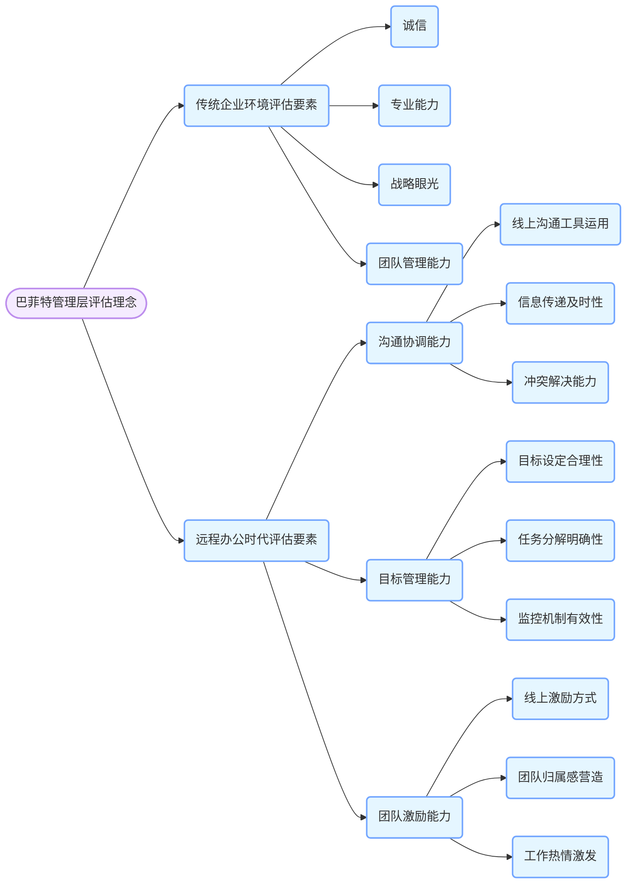

# 巴菲特的管理层评估：远程办公时代的领导力新标准

> 关键词：巴菲特、管理层评估、远程办公时代、领导力新标准、企业管理

> 摘要：本文聚焦于在远程办公时代，借鉴巴菲特的管理层评估理念来探讨领导力的新标准。首先介绍了相关背景，包括研究目的、预期读者等内容。接着阐述了核心概念及它们之间的联系，分析了在远程办公情境下管理层评估所涉及的原理和架构。详细讲解了用于评估的核心算法原理，并给出Python代码示例。通过数学模型和公式进一步深入剖析评估过程。以实际项目案例展示如何运用这些评估方法。探讨了该评估方法在不同场景下的实际应用，推荐了相关的学习资源、开发工具和论文著作。最后总结了未来发展趋势与挑战，解答常见问题，并提供扩展阅读和参考资料，旨在为企业在远程办公时代评估管理层领导力提供全面且深入的指导。

## 1. 背景介绍 
### 1.1 目的和范围
在当今数字化浪潮的推动下，远程办公模式逐渐成为一种常态。这种工作模式的转变给企业管理层的领导方式和管理效果带来了巨大的挑战和机遇。本研究的目的在于借鉴巴菲特在传统企业管理中对管理层评估的智慧，探索并确立适用于远程办公时代的领导力新标准。研究范围涵盖了远程办公环境下管理层的各项关键能力，如沟通协调能力、目标管理能力、团队激励能力等，以及如何通过科学的方法对这些能力进行评估和衡量。

### 1.2 预期读者
本文预期读者主要包括企业的高层管理人员、人力资源专家、企业管理研究者以及对远程办公时代领导力发展感兴趣的相关人士。对于企业高层管理人员，可帮助他们在远程办公环境下更精准地评估和选拔管理层人员；人力资源专家可以借鉴文中的评估方法优化招聘和绩效管理流程；企业管理研究者能从中获取新的研究思路和方向；而对远程办公时代领导力发展感兴趣的人士则可以深入了解这一领域的最新动态和趋势。

### 1.3 文档结构概述
本文首先对研究的背景进行介绍，明确研究目的、预期读者和文档结构。接着阐述核心概念，包括巴菲特的管理层评估理念以及远程办公时代领导力的相关概念，并展示它们之间的联系。然后详细讲解核心算法原理和具体操作步骤，通过Python代码进行示例。随后介绍数学模型和公式，辅以举例说明。通过实际项目案例展示如何在实际中运用这些评估方法。分析该评估方法在不同场景下的实际应用。推荐相关的学习资源、开发工具和论文著作。最后总结未来发展趋势与挑战，解答常见问题，并提供扩展阅读和参考资料。

### 1.4 术语表
#### 1.4.1 核心术语定义
- **巴菲特的管理层评估理念**：指巴菲特在长期的投资和企业管理实践中形成的一套评估企业管理层的方法和标准，注重管理层的诚信、能力、业绩等方面。
- **远程办公时代**：指由于科技发展和社会环境变化，越来越多的员工采用远程方式进行工作的时代背景。
- **领导力新标准**：在远程办公时代，为适应新的工作模式和管理需求而确立的评估管理层领导能力的新准则。

#### 1.4.2 相关概念解释
- **沟通协调能力**：在远程办公环境下，管理层能够有效地与团队成员进行信息交流，协调各方资源，解决团队内部和外部的矛盾和问题的能力。
- **目标管理能力**：管理层能够为团队设定明确、合理的目标，并通过有效的计划和监控确保目标实现的能力。
- **团队激励能力**：在远程办公环境中，管理层激发团队成员的工作积极性和创造力，提高团队绩效的能力。

#### 1.4.3 缩略词列表
暂无。

## 2. 核心概念与联系 

### 核心概念原理
巴菲特的管理层评估理念强调管理层的综合素质，包括诚信、专业能力、战略眼光、团队管理能力等。在传统企业环境中，这些能力可以通过面对面的交流、现场观察等方式进行评估。然而，在远程办公时代，工作场景发生了巨大变化，管理层的这些能力表现形式也有所不同。

在远程办公环境下，沟通协调能力变得尤为重要。由于团队成员分散在不同的地理位置，信息传递的及时性和准确性成为影响工作效率的关键因素。管理层需要通过各种线上工具，如视频会议、即时通讯软件等，确保与团队成员的有效沟通。同时，还需要协调不同成员之间的工作，避免出现信息孤岛和工作冲突。

目标管理能力在远程办公时代也面临新的挑战。管理层需要为团队设定明确的目标，并将其分解为具体的任务和指标，让每个团队成员清楚自己的工作方向和重点。由于远程办公缺乏现场监督，管理层需要建立有效的监控机制，及时了解团队成员的工作进展情况，确保目标的实现。

团队激励能力同样不可忽视。在远程办公环境中，团队成员容易感到孤独和缺乏归属感，工作积极性可能会受到影响。管理层需要通过各种方式，如线上表彰、团队活动等，激发团队成员的工作热情，提高团队的凝聚力和战斗力。

### 架构的文本示意图
```plaintext
巴菲特管理层评估理念
|
|--传统企业环境评估要素
|   |--诚信
|   |--专业能力
|   |--战略眼光
|   |--团队管理能力
|
|--远程办公时代评估要素
|   |--沟通协调能力
|   |   |--线上沟通工具运用
|   |   |--信息传递及时性
|   |   |--冲突解决能力
|   |--目标管理能力
|   |   |--目标设定合理性
|   |   |--任务分解明确性
|   |   |--监控机制有效性
|   |--团队激励能力
|   |   |--线上激励方式
|   |   |--团队归属感营造
|   |   |--工作热情激发
```

### Mermaid 流程图


## 3. 核心算法原理 & 具体操作步骤 

### 核心算法原理
为了在远程办公时代评估管理层的领导力，我们可以采用多维度综合评估的方法。将管理层的领导力分解为多个维度，如沟通协调能力、目标管理能力、团队激励能力等，每个维度再细分为若干个具体的指标。通过对这些指标的量化评估，最后综合得出管理层的领导力得分。

假设我们用 $L$ 表示管理层的领导力得分，$D_i$ 表示第 $i$ 个维度的得分，$w_i$ 表示第 $i$ 个维度的权重，且 $\sum_{i=1}^{n} w_i = 1$，则领导力得分的计算公式为：

$$L = \sum_{i=1}^{n} w_i D_i$$

### 具体操作步骤
1. **确定评估维度和指标**：根据远程办公时代的特点，确定沟通协调能力、目标管理能力、团队激励能力等评估维度，并为每个维度确定具体的评估指标。例如，沟通协调能力的指标可以包括线上沟通工具的使用频率、信息传递的准确性等。
2. **设定指标权重**：根据每个指标的重要性，为其设定相应的权重。权重的设定可以通过专家评估、问卷调查等方式确定。
3. **收集数据**：通过各种方式收集管理层在各个指标上的表现数据。例如，可以通过线上会议记录、工作汇报、团队成员反馈等方式获取数据。
4. **量化评估**：根据收集到的数据，对管理层在每个指标上的表现进行量化评估。可以采用评分制，如 1 - 5 分，其中 1 分表示表现较差，5 分表示表现优秀。
5. **计算维度得分**：根据每个指标的得分和权重，计算每个维度的得分。例如，对于沟通协调能力维度，其得分 $D_1$ 可以通过以下公式计算：

$$D_1 = \sum_{j=1}^{m} w_{1j} I_{1j}$$

其中，$w_{1j}$ 表示沟通协调能力维度下第 $j$ 个指标的权重，$I_{1j}$ 表示该指标的得分。

6. **计算领导力得分**：根据各个维度的得分和权重，计算管理层的领导力得分 $L$。

### Python 代码示例
```python
# 定义评估维度和指标
dimensions = {
    "沟通协调能力": {
        "线上沟通工具使用频率": 0.3,
        "信息传递准确性": 0.3,
        "冲突解决能力": 0.4
    },
    "目标管理能力": {
        "目标设定合理性": 0.4,
        "任务分解明确性": 0.3,
        "监控机制有效性": 0.3
    },
    "团队激励能力": {
        "线上激励方式多样性": 0.3,
        "团队归属感营造": 0.3,
        "工作热情激发": 0.4
    }
}

# 定义维度权重
dimension_weights = {
    "沟通协调能力": 0.3,
    "目标管理能力": 0.3,
    "团队激励能力": 0.4
}

# 模拟收集到的数据
data = {
    "沟通协调能力": {
        "线上沟通工具使用频率": 4,
        "信息传递准确性": 3,
        "冲突解决能力": 4
    },
    "目标管理能力": {
        "目标设定合理性": 3,
        "任务分解明确性": 3,
        "监控机制有效性": 4
    },
    "团队激励能力": {
        "线上激励方式多样性": 3,
        "团队归属感营造": 3,
        "工作热情激发": 4
    }
}

# 计算维度得分
dimension_scores = {}
for dimension, indicators in dimensions.items():
    score = 0
    for indicator, weight in indicators.items():
        score += weight * data[dimension][indicator]
    dimension_scores[dimension] = score

# 计算领导力得分
leadership_score = 0
for dimension, weight in dimension_weights.items():
    leadership_score += weight * dimension_scores[dimension]

print("各维度得分：", dimension_scores)
print("领导力得分：", leadership_score)
```

## 4. 数学模型和公式 & 详细讲解 & 举例说明 

### 数学模型和公式
在前面的核心算法原理中，我们已经介绍了领导力得分的计算公式：

$$L = \sum_{i=1}^{n} w_i D_i$$

其中，$L$ 表示管理层的领导力得分，$D_i$ 表示第 $i$ 个维度的得分，$w_i$ 表示第 $i$ 个维度的权重，且 $\sum_{i=1}^{n} w_i = 1$。

每个维度的得分 $D_i$ 可以通过以下公式计算：

$$D_i = \sum_{j=1}^{m} w_{ij} I_{ij}$$

其中，$w_{ij}$ 表示第 $i$ 个维度下第 $j$ 个指标的权重，$I_{ij}$ 表示该指标的得分。

### 详细讲解
领导力得分的计算公式是一个加权求和的过程。通过将各个维度的得分按照其权重进行加权求和，得到最终的领导力得分。这样可以综合考虑各个维度的重要性，更全面地评估管理层的领导力。

每个维度的得分计算公式同样是加权求和。将该维度下各个指标的得分按照其权重进行加权求和，得到该维度的得分。这样可以更细致地评估管理层在每个维度上的表现。

### 举例说明
假设我们有三个评估维度：沟通协调能力、目标管理能力、团队激励能力，其权重分别为 $w_1 = 0.3$，$w_2 = 0.3$，$w_3 = 0.4$。

沟通协调能力维度下有三个指标：线上沟通工具使用频率、信息传递准确性、冲突解决能力，其权重分别为 $w_{11} = 0.3$，$w_{12} = 0.3$，$w_{13} = 0.4$，对应的指标得分分别为 $I_{11} = 4$，$I_{12} = 3$，$I_{13} = 4$。

目标管理能力维度下有三个指标：目标设定合理性、任务分解明确性、监控机制有效性，其权重分别为 $w_{21} = 0.4$，$w_{22} = 0.3$，$w_{23} = 0.3$，对应的指标得分分别为 $I_{21} = 3$，$I_{22} = 3$，$I_{23} = 4$。

团队激励能力维度下有三个指标：线上激励方式多样性、团队归属感营造、工作热情激发，其权重分别为 $w_{31} = 0.3$，$w_{32} = 0.3$，$w_{33} = 0.4$，对应的指标得分分别为 $I_{31} = 3$，$I_{32} = 3$，$I_{33} = 4$。

首先，计算各个维度的得分：

沟通协调能力维度得分：

$$D_1 = w_{11} I_{11} + w_{12} I_{12} + w_{13} I_{13} = 0.3 \times 4 + 0.3 \times 3 + 0.4 \times 4 = 3.7$$

目标管理能力维度得分：

$$D_2 = w_{21} I_{21} + w_{22} I_{22} + w_{23} I_{23} = 0.4 \times 3 + 0.3 \times 3 + 0.3 \times 4 = 3.3$$

团队激励能力维度得分：

$$D_3 = w_{31} I_{31} + w_{32} I_{32} + w_{33} I_{33} = 0.3 \times 3 + 0.3 \times 3 + 0.4 \times 4 = 3.4$$

然后，计算领导力得分：

$$L = w_1 D_1 + w_2 D_2 + w_3 D_3 = 0.3 \times 3.7 + 0.3 \times 3.3 + 0.4 \times 3.4 = 3.46$$

通过以上计算，我们得到该管理层的领导力得分为 3.46 分。

## 5. 项目实战：代码实际案例和详细解释说明 

### 5.1  开发环境搭建
为了运行前面给出的 Python 代码示例，我们需要搭建相应的开发环境。具体步骤如下：

1. **安装 Python**：从 Python 官方网站（https://www.python.org/downloads/）下载并安装适合你操作系统的 Python 版本。建议安装 Python 3.6 及以上版本。
2. **安装开发工具**：可以选择安装 PyCharm、Visual Studio Code 等开发工具。这里以 Visual Studio Code 为例，从官方网站（https://code.visualstudio.com/）下载并安装 Visual Studio Code。
3. **安装 Python 扩展**：打开 Visual Studio Code，在扩展面板中搜索并安装 Python 扩展。

### 5.2  源代码详细实现和代码解读
以下是前面给出的 Python 代码示例的详细实现和代码解读：

```python
# 定义评估维度和指标
dimensions = {
    "沟通协调能力": {
        "线上沟通工具使用频率": 0.3,
        "信息传递准确性": 0.3,
        "冲突解决能力": 0.4
    },
    "目标管理能力": {
        "目标设定合理性": 0.4,
        "任务分解明确性": 0.3,
        "监控机制有效性": 0.3
    },
    "团队激励能力": {
        "线上激励方式多样性": 0.3,
        "团队归属感营造": 0.3,
        "工作热情激发": 0.4
    }
}

# 代码解读：定义了一个字典 dimensions，用于存储评估维度和每个维度下的指标及其权重。

# 定义维度权重
dimension_weights = {
    "沟通协调能力": 0.3,
    "目标管理能力": 0.3,
    "团队激励能力": 0.4
}

# 代码解读：定义了一个字典 dimension_weights，用于存储每个评估维度的权重。

# 模拟收集到的数据
data = {
    "沟通协调能力": {
        "线上沟通工具使用频率": 4,
        "信息传递准确性": 3,
        "冲突解决能力": 4
    },
    "目标管理能力": {
        "目标设定合理性": 3,
        "任务分解明确性": 3,
        "监控机制有效性": 4
    },
    "团队激励能力": {
        "线上激励方式多样性": 3,
        "团队归属感营造": 3,
        "工作热情激发": 4
    }
}

# 代码解读：定义了一个字典 data，用于模拟收集到的管理层在各个指标上的表现数据。

# 计算维度得分
dimension_scores = {}
for dimension, indicators in dimensions.items():
    score = 0
    for indicator, weight in indicators.items():
        score += weight * data[dimension][indicator]
    dimension_scores[dimension] = score

# 代码解读：通过两层循环遍历 dimensions 字典，计算每个维度的得分，并将结果存储在 dimension_scores 字典中。

# 计算领导力得分
leadership_score = 0
for dimension, weight in dimension_weights.items():
    leadership_score += weight * dimension_scores[dimension]

# 代码解读：遍历 dimension_weights 字典，根据每个维度的得分和权重计算领导力得分。

print("各维度得分：", dimension_scores)
print("领导力得分：", leadership_score)

# 代码解读：打印出每个维度的得分和最终的领导力得分。
```

### 5.3  代码解读与分析
通过上述代码，我们实现了在远程办公时代对管理层领导力的评估。代码的核心逻辑是先定义评估维度、指标及其权重，然后模拟收集到的数据，接着计算每个维度的得分，最后根据维度得分和维度权重计算领导力得分。

代码的优点在于结构清晰，易于理解和扩展。可以通过修改 dimensions 字典和 dimension_weights 字典来调整评估维度、指标及其权重，以适应不同的评估需求。同时，通过模拟数据的方式，方便进行测试和验证。

然而，代码也存在一些不足之处。例如，数据的收集和录入目前是通过模拟的方式实现的，在实际应用中需要建立更完善的数据收集机制。另外，代码没有考虑数据的异常情况和缺失值处理，在实际应用中需要进行相应的优化。

## 6. 实际应用场景 
### 企业招聘与选拔
在企业招聘和选拔管理层人员时，可以运用本文提出的评估方法。在面试过程中，可以设计相关的问题和场景，考察候选人在沟通协调能力、目标管理能力、团队激励能力等方面的表现。根据候选人在各个指标上的表现进行量化评估，计算出领导力得分，从而更科学地选拔出适合远程办公时代的管理层人员。

### 绩效管理与培训
对于企业现有的管理层人员，可以定期运用该评估方法进行绩效管理。通过评估管理层人员的领导力得分，了解他们在各个维度上的优势和不足。对于得分较低的维度，可以为管理层人员提供针对性的培训和发展计划，帮助他们提升相应的能力。

### 团队建设与优化
在团队建设和优化过程中，管理层的领导力起着关键作用。通过评估管理层的领导力，可以了解团队在管理方面存在的问题。例如，如果管理层在沟通协调能力方面得分较低，可能导致团队内部信息传递不畅，工作效率低下。此时，可以采取相应的措施，如加强线上沟通培训、建立有效的沟通机制等，来优化团队的工作流程和协作效果。

### 企业战略决策
企业在制定战略决策时，需要考虑管理层的领导能力是否能够支持战略的实施。通过对管理层领导力的评估，可以为企业战略决策提供参考依据。例如，如果企业计划拓展新的业务领域，需要具备较强战略眼光和团队管理能力的管理层来推动项目的实施。通过评估管理层的领导力得分，可以选择合适的管理层人员负责该项目。

## 7. 工具和资源推荐
### 7.1 学习资源推荐
#### 7.1.1 书籍推荐
- 《巴菲特之道》：这本书详细介绍了巴菲特的投资理念和企业管理思想，对于理解巴菲特的管理层评估理念具有重要的参考价值。
- 《卓有成效的管理者》：作者彼得·德鲁克阐述了管理者如何在组织中有效工作的方法和原则，对于提升管理层的领导力具有很大的帮助。
- 《远程工作：重新定义工作方式》：该书深入探讨了远程办公的各种问题和挑战，以及如何在远程办公环境下进行有效的管理和协作。

#### 7.1.2 在线课程
- Coursera 平台上的“领导力与团队管理”课程：该课程由知名高校的教授授课，内容涵盖了领导力的各个方面，包括沟通、激励、决策等。
- edX 平台上的“远程办公管理”课程：专门针对远程办公环境下的管理问题进行讲解，提供了实用的管理方法和技巧。
- 网易云课堂上的“巴菲特投资智慧”课程：系统介绍了巴菲特的投资理念和企业评估方法，有助于深入理解巴菲特的管理层评估理念。

#### 7.1.3 技术博客和网站
- 36氪：提供了大量的商业和科技资讯，其中不乏关于企业管理和领导力的文章和案例分析。
- 虎嗅网：聚焦于互联网和科技行业的动态，有很多关于远程办公和企业管理的深度报道和分析。
- 哈佛商业评论中文网：翻译和发布了大量来自哈佛商业评论的优秀文章，内容涉及领导力、战略管理等多个领域。

### 7.2 开发工具框架推荐
#### 7.2.1 IDE和编辑器
- PyCharm：一款专门为 Python 开发设计的集成开发环境，具有代码自动补全、调试、版本控制等功能，非常适合开发 Python 代码。
- Visual Studio Code：一款轻量级的代码编辑器，支持多种编程语言，通过安装 Python 扩展可以方便地进行 Python 开发。
- Jupyter Notebook：一种交互式的开发环境，适合进行数据分析和算法验证。可以在浏览器中编写和运行 Python 代码，方便展示和分享代码结果。

#### 7.2.2 调试和性能分析工具
- pdb：Python 自带的调试工具，可以帮助开发者逐行调试代码，查找代码中的错误。
- cProfile：Python 标准库中的性能分析工具，可以统计代码的运行时间和函数调用次数，帮助开发者优化代码性能。
- Py-Spy：一个轻量级的 Python 性能分析工具，可以实时监控 Python 程序的运行状态，找出性能瓶颈。

#### 7.2.3 相关框架和库
- NumPy：一个用于科学计算的 Python 库，提供了高效的数组操作和数学函数，可用于处理和分析评估数据。
- Pandas：一个数据处理和分析的 Python 库，提供了数据结构和数据分析工具，方便对评估数据进行清洗、整理和分析。
- Matplotlib：一个用于数据可视化的 Python 库，可以绘制各种类型的图表，如折线图、柱状图等，帮助直观展示评估结果。

### 7.3 相关论文著作推荐
#### 7.3.1 经典论文
- “The Effective Executive” by Peter F. Drucker：这篇经典论文阐述了管理者如何在组织中有效工作的原则和方法，对现代管理学产生了深远的影响。
- “The Nature of the Firm” by Ronald H. Coase：该论文探讨了企业存在的原因和边界问题，为企业管理和组织理论的发展奠定了基础。
- “The Theory of Leadership Effectiveness” by Fred E. Fiedler：提出了权变领导理论，强调领导方式的有效性取决于领导者、被领导者和情境因素的相互作用。

#### 7.3.2 最新研究成果
- “Remote Work and Leadership: Challenges and Opportunities”：该研究探讨了远程办公时代领导力面临的挑战和机遇，提出了一些适应远程办公环境的领导力发展策略。
- “Evaluating Leadership in the Digital Age”：研究了在数字化时代如何评估管理层的领导力，结合了大数据和人工智能技术，提出了新的评估方法和指标体系。
- “Team Management in Remote Work Environments”：关注远程办公环境下的团队管理问题，分析了团队协作、沟通和激励等方面的挑战，并提出了相应的解决方案。

#### 7.3.3 应用案例分析
- “Case Studies in Remote Leadership”：收集了多个企业在远程办公环境下的领导力实践案例，通过对这些案例的分析，总结了成功的经验和失败的教训。
- “Leadership Transformation in the Digital Era: A Case Study”：以某家企业为例，介绍了该企业在数字化转型过程中如何进行领导力变革，以及取得的成效。
- “Effective Team Management in Remote Work: A Case Analysis”：通过对一个远程团队的管理案例进行分析，探讨了如何在远程办公环境下实现高效的团队管理。

## 8. 总结：未来发展趋势与挑战
### 未来发展趋势
- **数字化评估工具的广泛应用**：随着科技的不断发展，未来将有更多的数字化评估工具被应用于管理层领导力评估。例如，利用人工智能和大数据技术，可以更全面、准确地收集和分析管理层的行为数据，提高评估的效率和准确性。
- **领导力的多元化发展**：在远程办公时代，管理层需要具备更多元化的领导力。除了传统的沟通、协调、决策等能力外，还需要具备数字化素养、跨文化管理能力等。未来的领导力评估将更加注重这些多元化能力的考察。
- **持续学习和发展的重要性增加**：由于工作模式和技术的不断变化，管理层需要不断学习和提升自己的能力。未来的领导力评估将不仅关注管理层当前的能力水平，还将关注他们的学习能力和发展潜力。

### 挑战
- **数据隐私和安全问题**：在收集和分析管理层的行为数据时，需要注意数据的隐私和安全问题。如何在保护个人隐私的前提下，有效地利用数据进行评估是一个亟待解决的问题。
- **评估标准的动态调整**：随着远程办公模式的不断发展和变化，领导力的评估标准也需要不断调整和完善。如何及时、准确地调整评估标准，以适应新的形势和需求，是一个挑战。
- **文化差异的影响**：在全球化的背景下，企业的团队成员可能来自不同的文化背景。文化差异可能会对管理层的领导力表现和评估结果产生影响。如何在评估过程中考虑文化差异的因素，是一个需要深入研究的问题。

## 9. 附录：常见问题与解答
### 问题 1：如何确定评估指标的权重？
解答：评估指标的权重可以通过多种方式确定。一种常见的方法是专家评估法，邀请企业管理领域的专家根据指标的重要性进行打分，然后根据打分结果确定权重。另一种方法是问卷调查法，向企业员工、管理层等相关人员发放问卷，收集他们对各指标重要性的看法，然后根据问卷结果确定权重。此外，还可以结合企业的战略目标和业务需求，确定各指标的权重。

### 问题 2：如何确保数据收集的准确性和可靠性？
解答：为了确保数据收集的准确性和可靠性，可以采取以下措施：
- 建立完善的数据收集机制，明确数据收集的渠道、方法和流程。
- 对数据收集人员进行培训，提高他们的专业素质和数据收集能力。
- 对收集到的数据进行审核和验证，去除异常数据和错误数据。
- 采用多种数据收集方法，如线上调查、线下访谈、系统记录等，相互印证，提高数据的准确性和可靠性。

### 问题 3：评估结果如何应用到实际管理中？
解答：评估结果可以应用到多个方面，如企业招聘、绩效管理、培训发展等。在企业招聘中，可以根据评估结果选拔出适合远程办公时代的管理层人员。在绩效管理中，可以将评估结果作为管理层绩效评估的重要依据，激励管理层不断提升自己的领导力。在培训发展中，可以根据评估结果为管理层提供针对性的培训和发展计划，帮助他们提升薄弱环节的能力。

## 10. 扩展阅读 & 参考资料
### 扩展阅读
- 《重新定义团队：谷歌如何工作》：介绍了谷歌在团队管理和领导力发展方面的实践经验，对于远程办公时代的团队管理具有一定的借鉴意义。
- 《赋能：打造应对不确定性的敏捷团队》：探讨了如何通过赋能的方式提升团队的战斗力和适应性，对于远程办公环境下的团队管理有很好的启示作用。
- 《原则：生活和工作》：作者瑞·达利欧分享了自己的生活和工作原则，对于提升领导力和管理能力具有一定的指导价值。

### 参考资料
- 巴菲特历年致股东的信：可以从这些信中深入了解巴菲特的投资理念和企业管理思想。
- 相关企业的年报和报告：可以了解企业在管理层评估和领导力发展方面的实践和经验。
- 学术期刊和会议论文：如《Academy of Management Journal》、《Journal of Applied Psychology》等，这些期刊和会议论文发表了很多关于领导力和企业管理的最新研究成果。

作者：AI天才研究院/AI Genius Institute & 禅与计算机程序设计艺术 /Zen And The Art of Computer Programming