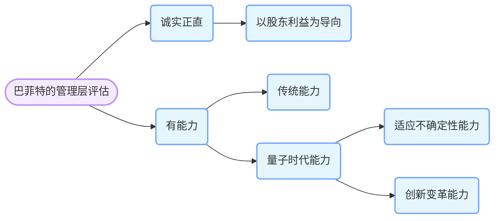

# 巴菲特的管理层评估：量子领导力时代的新标准

> 关键词：巴菲特、管理层评估、量子领导力、评估标准、企业管理

> 摘要：本文聚焦于巴菲特的管理层评估理念，并将其与量子领导力时代的特点相结合，探讨在新的时代背景下管理层评估的新标准。首先介绍了相关背景，包括目的、预期读者等内容。接着阐述了核心概念，如巴菲特的管理层评估思想和量子领导力的原理，并给出相应的示意图和流程图。然后详细讲解了评估的核心算法原理，通过Python代码进行说明，同时给出相关的数学模型和公式。通过项目实战部分的代码案例，深入解读了如何在实际中运用这些评估方法。分析了实际应用场景，推荐了学习和开发相关内容的工具和资源。最后总结了未来发展趋势与挑战，解答了常见问题并提供了扩展阅读和参考资料，旨在为企业在评估管理层时提供全面且深入的理论与实践指导。

## 1. 背景介绍 
### 1.1 目的和范围
在当今复杂多变的商业环境中，企业管理层的能力和素质对企业的兴衰成败起着关键作用。巴菲特作为投资界的传奇人物，其对管理层的评估方法一直备受关注。而随着科技的飞速发展，量子领导力这一新兴概念逐渐兴起，它强调在不确定性和复杂性的环境中领导的灵活性、创新性和适应性。本文章的目的在于将巴菲特的管理层评估理念与量子领导力时代的特点相结合，探索出一套适合新时代的管理层评估新标准。文章的范围涵盖了从理论概念的阐述到实际应用案例的分析，以及相关工具和资源的推荐，旨在为企业管理者、投资者和相关研究人员提供全面且深入的参考。

### 1.2 预期读者
本文预期读者主要包括企业管理层、企业所有者、投资者、管理咨询顾问、商学院学生以及对企业管理和投资领域感兴趣的研究人员。企业管理层可以通过本文了解如何在量子领导力时代提升自身的评估能力，以选拔和培养更优秀的管理团队；企业所有者可以借助这些标准更好地监督和评估管理层的表现；投资者可以将其作为评估投资目标企业管理层的重要依据；管理咨询顾问可以将这些理念和方法应用到实际的咨询项目中；商学院学生可以通过学习本文拓宽自己的知识面和视野；研究人员则可以在本文的基础上开展更深入的学术研究。

### 1.3 文档结构概述
本文共分为十个部分。第一部分是背景介绍，阐述了文章的目的、预期读者、文档结构概述和术语表；第二部分讲解核心概念与联系，介绍巴菲特的管理层评估思想和量子领导力的原理，并给出相应的示意图和流程图；第三部分详细说明核心算法原理和具体操作步骤，通过Python代码进行阐述；第四部分给出数学模型和公式，并进行详细讲解和举例说明；第五部分是项目实战，包括开发环境搭建、源代码详细实现和代码解读；第六部分分析实际应用场景；第七部分推荐学习和开发相关内容的工具和资源；第八部分总结未来发展趋势与挑战；第九部分是附录，解答常见问题；第十部分提供扩展阅读和参考资料。

### 1.4 术语表
#### 1.4.1 核心术语定义
- **巴菲特的管理层评估**：巴菲特在长期的投资实践中形成的一套对企业管理层的能力、品德、战略眼光等方面进行综合评估的方法和理念。
- **量子领导力**：一种适应量子时代不确定性和复杂性的领导理论，强调领导者应具备灵活性、创新性、适应性和量子思维，能够在复杂多变的环境中做出明智的决策。
- **管理层评估标准**：用于衡量企业管理层表现和能力的一系列准则和指标，包括财务指标、战略规划能力、团队管理能力等多个方面。

#### 1.4.2 相关概念解释
- **量子思维**：量子思维是一种与经典思维不同的思维方式，它强调不确定性、整体性、相关性和动态性。在量子思维中，事物的状态不是确定的，而是处于多种可能性的叠加态，并且事物之间存在着复杂的相互关联和影响。
- **战略眼光**：指管理层能够对企业所处的宏观环境、行业发展趋势和市场变化有敏锐的洞察力，能够制定出具有前瞻性和适应性的企业战略。
- **团队管理能力**：管理层有效地组织、激励和协调团队成员，使团队能够高效地完成工作任务，实现团队和企业目标的能力。

#### 1.4.3 缩略词列表
目前本文未涉及缩略词。

## 2. 核心概念与联系 
### 2.1 巴菲特的管理层评估思想
巴菲特认为，优秀的管理层应具备三个关键特质：诚实正直、有能力和以股东利益为导向。诚实正直是管理层的基本品德，只有诚实的管理层才能赢得股东和市场的信任；有能力意味着管理层具备良好的专业知识、丰富的经验和卓越的决策能力，能够带领企业在市场竞争中取得优势；以股东利益为导向则要求管理层的决策和行动始终围绕着股东的利益展开，致力于提高股东的回报率。

### 2.2 量子领导力的原理
量子领导力基于量子物理学的原理和概念，强调在不确定性和复杂性的环境中领导的新方式。量子领导力的核心包括以下几个方面：
- **不确定性与适应性**：量子世界中充满了不确定性，领导者需要适应这种不确定性，具备灵活应变的能力，能够在变化中寻找机会。
- **整体性与协同性**：量子系统强调整体性，领导者需要将企业视为一个整体，注重各部门之间的协同合作，实现企业的整体最优。
- **创新性与变革性**：量子思维鼓励创新和变革，领导者需要激发团队的创新能力，推动企业不断进行变革和发展。

### 2.3 两者的联系
在量子领导力时代，巴菲特的管理层评估标准依然具有重要的价值，但需要结合量子领导力的特点进行拓展和完善。例如，在评估管理层的能力时，不仅要考虑传统的专业能力和经验，还要考察其在不确定性环境中的适应能力和创新能力；在评估管理层的战略眼光时，要结合量子思维，考虑其对市场变化的敏感度和对未来趋势的把握能力。

### 2.4 文本示意图
```plaintext
               巴菲特的管理层评估
                    |
                    |
        +-----------------------+
        |                       |
  诚实正直               有能力
        |                       |
        |                       |
 +------+------+         +------+------+
 |              |         |              |
以股东利益为导向    传统能力     量子时代能力
                                   |
                                   |
                        +----------+----------+
                        |                     |
                适应不确定性能力      创新变革能力


```

### 2.5 Mermaid 流程图


## 3. 核心算法原理 & 具体操作步骤 
### 3.1 核心算法原理
我们可以将管理层的评估看作一个多维度的综合评价问题。假设我们有 $n$ 个评估指标 $x_1, x_2, \cdots, x_n$，每个指标对应一个权重 $w_1, w_2, \cdots, w_n$，且 $\sum_{i=1}^{n} w_i = 1$。管理层的综合得分 $S$ 可以通过以下公式计算：

$$S = \sum_{i=1}^{n} w_i x_i$$

其中，$x_i$ 可以是定量指标，如财务指标，也可以是定性指标，如团队管理能力，对于定性指标可以通过专家评分的方式转化为数值。

### 3.2 具体操作步骤
#### 3.2.1 确定评估指标
根据巴菲特的管理层评估思想和量子领导力的特点，确定以下评估指标：
- **财务指标**：如净资产收益率（ROE）、净利润增长率等。
- **战略规划能力**：包括对市场趋势的判断、战略目标的制定等。
- **团队管理能力**：如团队凝聚力、员工满意度等。
- **适应不确定性能力**：考察管理层在面对市场变化和突发事件时的应对能力。
- **创新变革能力**：评估管理层推动企业创新和变革的能力。

#### 3.2.2 确定指标权重
通过专家咨询法或层次分析法等方法确定每个指标的权重。例如，假设我们确定的权重如下：

| 指标 | 权重 |
| ---- | ---- |
| 财务指标 | 0.3 |
| 战略规划能力 | 0.2 |
| 团队管理能力 | 0.2 |
| 适应不确定性能力 | 0.15 |
| 创新变革能力 | 0.15 |

#### 3.2.3 收集数据
对于定量指标，从企业的财务报表和相关统计数据中获取；对于定性指标，通过问卷调查、专家评估等方式获取。

#### 3.2.4 计算综合得分
根据上述公式计算管理层的综合得分。

### 3.3 Python 源代码实现
```python
# 定义评估指标权重
weights = {
    "财务指标": 0.3,
    "战略规划能力": 0.2,
    "团队管理能力": 0.2,
    "适应不确定性能力": 0.15,
    "创新变革能力": 0.15
}

# 定义评估指标得分
scores = {
    "财务指标": 80,
    "战略规划能力": 70,
    "团队管理能力": 75,
    "适应不确定性能力": 60,
    "创新变革能力": 70
}

# 计算综合得分
total_score = 0
for indicator, weight in weights.items():
    total_score += weight * scores[indicator]

print(f"管理层综合得分: {total_score}")
```

## 4. 数学模型和公式 & 详细讲解 & 举例说明 
### 4.1 数学模型和公式
在前面我们已经提到，管理层的综合得分 $S$ 可以通过加权求和的公式计算：

$$S = \sum_{i=1}^{n} w_i x_i$$

其中，$S$ 表示管理层的综合得分，$w_i$ 表示第 $i$ 个评估指标的权重，$x_i$ 表示第 $i$ 个评估指标的得分，$n$ 表示评估指标的数量。

### 4.2 详细讲解
这个公式的原理是将各个评估指标的得分按照其重要性（权重）进行加权求和，得到一个综合的得分，从而全面地评估管理层的表现。权重的设置反映了每个指标在整体评估中的相对重要性，权重越大，该指标对综合得分的影响就越大。

### 4.3 举例说明
假设我们有三个评估指标：财务指标 $x_1$、战略规划能力 $x_2$ 和团队管理能力 $x_3$，对应的权重分别为 $w_1 = 0.4$，$w_2 = 0.3$，$w_3 = 0.3$。管理层在这三个指标上的得分分别为 $x_1 = 85$，$x_2 = 70$，$x_3 = 75$。

根据公式计算综合得分：

$$S = w_1 x_1 + w_2 x_2 + w_3 x_3$$

$$S = 0.4 \times 85 + 0.3 \times 70 + 0.3 \times 75$$

$$S = 34 + 21 + 22.5$$

$$S = 77.5$$

这意味着该管理层的综合得分为 77.5 分。通过这个得分，我们可以对该管理层的表现进行综合评价，并与其他管理层进行比较。

## 5. 项目实战：代码实际案例和详细解释说明 
### 5.1  开发环境搭建
#### 5.1.1 安装 Python
首先，需要安装 Python 编程语言。可以从 Python 官方网站（https://www.python.org/downloads/）下载适合自己操作系统的 Python 安装包，并按照安装向导进行安装。

#### 5.1.2 安装必要的库
在本项目中，我们只使用了 Python 的内置库，无需额外安装其他库。

### 5.2  源代码详细实现和代码解读
```python
# 定义评估指标权重
weights = {
    "财务指标": 0.3,
    "战略规划能力": 0.2,
    "团队管理能力": 0.2,
    "适应不确定性能力": 0.15,
    "创新变革能力": 0.15
}

# 代码解读：这里定义了一个字典 weights，用于存储各个评估指标的权重。
# 键为评估指标的名称，值为对应的权重，权重之和为 1。

# 定义评估指标得分
scores = {
    "财务指标": 80,
    "战略规划能力": 70,
    "团队管理能力": 75,
    "适应不确定性能力": 60,
    "创新变革能力": 70
}

# 代码解读：这里定义了一个字典 scores，用于存储管理层在各个评估指标上的得分。
# 键为评估指标的名称，值为对应的得分，得分可以通过实际的评估或数据收集得到。

# 计算综合得分
total_score = 0
for indicator, weight in weights.items():
    total_score += weight * scores[indicator]

# 代码解读：这里使用一个 for 循环遍历 weights 字典中的每个元素。
# 对于每个评估指标，将其权重乘以对应的得分，并累加到 total_score 中。

print(f"管理层综合得分: {total_score}")

# 代码解读：最后，使用 print 函数输出管理层的综合得分。
```

### 5.3  代码解读与分析
这段代码的核心逻辑是根据前面介绍的加权求和公式计算管理层的综合得分。通过定义权重字典和得分字典，我们可以方便地对不同的评估指标进行管理。使用 for 循环遍历权重字典，将每个指标的权重乘以对应的得分，并累加到综合得分中。最后输出综合得分，以便对管理层的表现进行评估。

该代码的优点是简单易懂，易于实现。但也存在一些局限性，例如评估指标的权重和得分是硬编码在代码中的，不够灵活。在实际应用中，可以考虑将权重和得分存储在文件或数据库中，以便动态调整。

## 6. 实际应用场景 
### 6.1 企业内部管理
在企业内部，管理层评估标准可以用于选拔和培养优秀的管理人才。通过对管理层的综合评估，可以发现管理层的优势和不足，为管理层的培训和发展提供有针对性的建议。同时，评估结果也可以作为管理层绩效考核和薪酬调整的重要依据，激励管理层不断提升自己的能力和表现。

### 6.2 投资者决策
对于投资者来说，管理层的能力和素质是评估投资目标企业的重要因素之一。通过运用本文提出的评估标准，投资者可以更全面地了解企业管理层的情况，从而做出更明智的投资决策。例如，如果一家企业的管理层在战略规划能力和创新变革能力方面表现出色，那么该企业可能具有更好的发展潜力，更值得投资。

### 6.3 企业并购与重组
在企业并购与重组过程中，对目标企业管理层的评估至关重要。评估结果可以帮助并购方了解目标企业管理层的能力和团队状况，判断是否能够实现双方的协同效应。如果目标企业的管理层与并购方的管理层在能力和文化方面存在较大差异，可能会给并购后的整合带来困难，需要谨慎考虑。

### 6.4 行业研究与分析
行业研究机构可以运用管理层评估标准对不同企业的管理层进行比较和分析，了解行业内管理层的整体水平和发展趋势。这有助于行业研究机构为企业提供更有针对性的咨询服务，同时也可以为政府部门制定相关政策提供参考依据。

## 7. 工具和资源推荐
### 7.1 学习资源推荐
#### 7.1.1 书籍推荐
- 《巴菲特致股东的信：投资者和公司高管教程》：这本书收录了巴菲特历年致股东的信，其中包含了他对企业管理、投资理念等方面的深刻见解，是学习巴菲特思想的经典读物。
- 《量子领导者》：详细介绍了量子领导力的概念、原理和实践方法，帮助读者了解如何在量子时代成为一名优秀的领导者。
- 《卓有成效的管理者》：彼得·德鲁克的经典著作，阐述了管理者如何有效地管理时间、决策和用人，对提升管理层的能力具有重要的指导意义。

#### 7.1.2 在线课程
- Coursera 平台上的“领导力与管理”课程：由知名商学院的教授授课，涵盖了领导力的各个方面，包括战略领导力、团队管理等内容。
- edX 平台上的“量子力学与量子信息”课程：虽然不是专门针对领导力的课程，但可以帮助读者了解量子物理学的基本原理，为理解量子领导力提供理论基础。
- 网易云课堂上的“企业管理实战课程”：结合实际案例，讲解企业管理的各个环节，包括管理层评估、战略规划等内容。

#### 7.1.3 技术博客和网站
- 巴菲特研究网：专门收集和整理与巴菲特相关的研究资料和文章，提供了丰富的关于巴菲特投资理念和管理层评估的内容。
- 量子领导力论坛：一个专注于量子领导力研究和交流的论坛，汇集了众多专家和学者的观点和研究成果。
- 哈佛商业评论官网：经常发表关于企业管理、领导力等方面的前沿文章，具有很高的学术价值和实践指导意义。

### 7.2 开发工具框架推荐
#### 7.2.1 IDE和编辑器
- PyCharm：一款专业的 Python 集成开发环境，提供了丰富的代码编辑、调试和项目管理功能，适合开发与管理层评估相关的 Python 程序。
- Visual Studio Code：一款轻量级的代码编辑器，支持多种编程语言，具有丰富的插件扩展功能，可以方便地进行 Python 代码的开发和调试。

#### 7.2.2 调试和性能分析工具
- pdb：Python 内置的调试工具，可以帮助开发者在代码执行过程中进行调试，查找和解决问题。
- cProfile：Python 标准库中的性能分析工具，可以分析代码的运行时间和函数调用情况，帮助开发者优化代码性能。

#### 7.2.3 相关框架和库
- NumPy：一个用于科学计算的 Python 库，提供了高效的数组操作和数学函数，在处理评估指标数据时非常有用。
- Pandas：一个用于数据处理和分析的 Python 库，可以方便地读取、处理和分析管理层评估数据。

### 7.3 相关论文著作推荐
#### 7.3.1 经典论文
- “The Nature of the Firm” by Ronald H. Coase：这篇经典论文探讨了企业的本质和存在的原因，对理解企业管理层的角色和职能具有重要的启示作用。
- “A Behavioral Theory of the Firm” by Richard M. Cyert and James G. March：提出了企业行为理论，强调了企业决策过程中的有限理性和不确定性，与量子领导力的理念有一定的契合度。

#### 7.3.2 最新研究成果
- “Quantum Leadership in the Digital Age”：该研究探讨了在数字时代量子领导力的应用和发展，为企业管理层在新的时代背景下提供了新的思路和方法。
- “Evaluating Management Teams: A Holistic Approach”：提出了一种全面评估管理团队的方法，结合了多个维度的指标，对本文提出的管理层评估标准有一定的参考价值。

#### 7.3.3 应用案例分析
- “Case Studies in Corporate Leadership”：收集了多个企业的领导力案例，通过对这些案例的分析，可以了解不同企业在管理层评估和领导实践方面的经验和教训。
- “Leadership in the Face of Uncertainty: Real - World Examples”：介绍了一些企业在面对不确定性时的领导策略和实践，为管理层提升适应不确定性能力提供了实际案例参考。

## 8. 总结：未来发展趋势与挑战
### 8.1 未来发展趋势
#### 8.1.1 数字化与智能化
随着科技的不断发展，数字化和智能化将在管理层评估中发挥越来越重要的作用。例如，利用大数据和人工智能技术可以更全面、准确地收集和分析管理层的相关数据，提高评估的效率和准确性。同时，智能化的评估系统可以根据实时数据进行动态评估，及时发现管理层的问题并提供建议。

#### 8.1.2 强调创新与变革能力
在量子领导力时代，企业面临的竞争环境更加激烈，变化更加快速。因此，未来的管理层评估将更加注重管理层的创新与变革能力。管理层需要能够带领企业不断推出新的产品和服务，适应市场的变化，实现企业的可持续发展。

#### 8.1.3 多元化与国际化
随着经济全球化的发展，企业的经营环境越来越多元化和国际化。未来的管理层需要具备跨文化管理能力和国际视野，能够在不同的文化和市场环境中有效地领导团队。因此，管理层评估标准也将更加多元化，包括对管理层跨文化沟通能力、国际市场开拓能力等方面的评估。

### 8.2 挑战
#### 8.2.1 数据质量与安全
在数字化评估过程中，数据的质量和安全是关键问题。如果收集到的数据不准确或不完整，将影响评估结果的可靠性。同时，管理层的相关数据涉及企业的机密信息，如何保证数据的安全和隐私也是一个挑战。

#### 8.2.2 评估指标的动态调整
由于市场环境和企业发展的不确定性，评估指标需要不断进行动态调整。如何及时、准确地确定哪些指标需要调整以及如何调整权重，是一个需要解决的问题。

#### 8.2.3 文化差异的影响
在国际化的背景下，不同国家和地区的文化差异会对管理层评估产生影响。例如，不同文化对领导力的理解和评价标准可能不同，如何在评估中考虑文化差异，制定出具有普适性的评估标准是一个挑战。

## 9. 附录：常见问题与解答
### 9.1 如何确定评估指标的权重？
确定评估指标的权重可以采用多种方法，如专家咨询法、层次分析法等。专家咨询法是通过邀请相关领域的专家，根据他们的经验和专业知识对各个指标的重要性进行打分，然后取平均值作为权重。层次分析法是一种系统分析方法，通过构建层次结构模型，比较各指标之间的相对重要性，从而确定权重。

### 9.2 对于定性指标如何进行量化？
对于定性指标，可以通过专家评分、问卷调查等方式进行量化。例如，对于团队管理能力这一定性指标，可以邀请企业内部员工、外部专家等对管理层的团队管理能力进行评分，然后取平均值作为该指标的得分。也可以设计一份问卷调查，让相关人员对管理层在团队管理方面的表现进行评价，根据评价结果进行量化。

### 9.3 评估标准是否适用于所有企业？
评估标准可以作为一个通用的框架，但在实际应用中需要根据企业的行业特点、发展阶段和战略目标等进行调整。不同行业的企业对管理层的能力要求可能不同，例如，科技行业更注重管理层的创新能力，而制造业更注重管理层的生产管理能力。同时，企业在不同的发展阶段，对管理层的重点要求也会有所不同。

### 9.4 如何保证评估结果的公正性和客观性？
为了保证评估结果的公正性和客观性，需要做到以下几点：一是评估指标和权重的确定要科学合理，采用多种方法进行验证；二是数据的收集要准确、全面，避免主观偏见；三是评估过程要透明，让相关人员了解评估的标准和方法；四是可以引入第三方评估机构进行评估，提高评估结果的可信度。

## 10. 扩展阅读 & 参考资料
### 10.1 扩展阅读
- 《创新者的窘境》：探讨了企业在创新过程中面临的挑战和困境，对理解管理层的创新变革能力具有重要的参考价值。
- 《重新定义团队：谷歌如何工作》：介绍了谷歌的团队管理经验和方法，为提升管理层的团队管理能力提供了新的思路。
- 《从优秀到卓越》：研究了一些从优秀企业发展成为卓越企业的案例，分析了这些企业管理层的特点和成功经验。

### 10.2 参考资料
- 巴菲特历年致股东的信，可从伯克希尔·哈撒韦公司官方网站获取。
- 相关学术期刊，如《管理世界》《哈佛商业评论》《战略管理杂志》等，发表了大量关于企业管理和领导力的研究成果。
- 企业年报和财务报表，是获取企业财务指标和管理层信息的重要来源。

作者：AI天才研究院/AI Genius Institute & 禅与计算机程序设计艺术 /Zen And The Art of Computer Programming