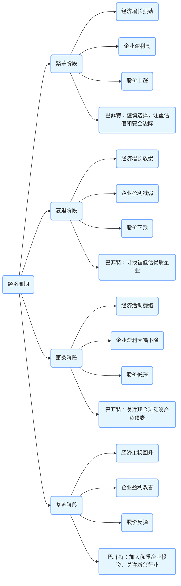

# 巴菲特的经济周期投资：如何在不同阶段调整策略

> 关键词：巴菲特、经济周期、投资策略、价值投资、周期调整

> 摘要：本文深入探讨了巴菲特的经济周期投资理念与策略调整方法。从经济周期的基本概念出发，阐述不同阶段的特点及对投资的影响。详细分析巴菲特在各个经济周期阶段所采用的投资策略，结合其经典投资案例进行解读。通过数学模型和公式进一步说明投资决策的依据，提供实际项目实战案例以供参考。同时介绍相关工具和资源，最后总结未来投资面临的发展趋势与挑战，旨在为投资者提供全面且有深度的投资思路和方法。

## 1. 背景介绍 
### 1.1 目的和范围
本文章的主要目的是深入剖析巴菲特的经济周期投资策略，探究他如何在不同的经济周期阶段灵活调整投资策略，以实现长期的投资成功。我们将研究范围界定在巴菲特的投资理念、方法以及其在不同经济周期下的具体投资实践，通过对这些内容的分析，为广大投资者提供具有借鉴意义的投资思路和策略。

### 1.2 预期读者
本文预期读者包括对投资领域感兴趣的个人投资者、金融从业者、投资研究人员以及对巴菲特投资理念有深入学习需求的人群。无论是初涉投资领域的新手，还是具有一定投资经验的专业人士，都能从本文中获取有价值的信息和启示。

### 1.3 文档结构概述
本文将按照以下结构展开：首先介绍经济周期及相关核心概念与联系，明确经济周期的不同阶段及其特点；接着阐述巴菲特在不同经济周期阶段所运用的核心投资算法原理及具体操作步骤，并给出Python源代码示例；然后通过数学模型和公式详细讲解投资决策的依据，并举例说明；再通过项目实战案例，展示在实际投资中如何应用这些策略；之后探讨这些投资策略的实际应用场景；推荐相关的学习工具和资源；最后总结未来投资的发展趋势与挑战，并提供常见问题的解答以及扩展阅读和参考资料。

### 1.4 术语表
#### 1.4.1 核心术语定义
- **经济周期**：指经济活动沿着经济发展的总体趋势所经历的有规律的扩张和收缩。一般分为繁荣、衰退、萧条和复苏四个阶段。
- **价值投资**：一种常见的投资方式，其核心思想是寻找价格低于内在价值的证券进行投资，以获取长期的资本增值。
- **安全边际**：指在评估投资价值时，为了降低投资风险，所设定的股票价格低于其内在价值的幅度。

#### 1.4.2 相关概念解释
- **内在价值**：是指企业未来现金流量的现值，它是评估企业真实价值的重要指标。内在价值的计算需要综合考虑企业的盈利能力、资产状况、行业前景等多种因素。
- **现金流贴现模型**：是一种用于估算企业内在价值的方法，通过预测企业未来的现金流量，并将其按照一定的贴现率折现到当前时刻，从而得到企业的内在价值。

#### 1.4.3 缩略词列表
- **DCF**：现金流贴现模型（Discounted Cash Flow Model）

## 2. 核心概念与联系 

### 经济周期的阶段及特点
经济周期通常包括四个阶段：繁荣、衰退、萧条和复苏。

#### 繁荣阶段
在繁荣阶段，经济增长强劲，企业盈利水平较高，就业市场稳定，消费者信心高涨。股票市场通常表现良好，股价上涨，投资者情绪乐观。此时，市场上的资金充裕，企业的融资成本较低，有利于企业的扩张和发展。

#### 衰退阶段
衰退阶段是经济从繁荣走向萧条的过渡时期。经济增长速度开始放缓，企业的盈利增长逐渐减弱，消费者信心下降。股票市场开始出现调整，股价下跌，投资者的风险偏好降低。企业的融资难度逐渐增加，信贷环境收紧。

#### 萧条阶段
萧条阶段是经济周期的低谷时期。经济活动大幅萎缩，企业盈利大幅下降，失业率上升，消费者支出减少。股票市场处于低迷状态，股价持续下跌，投资者情绪极度悲观。企业面临着巨大的生存压力，大量企业倒闭或裁员。

#### 复苏阶段
复苏阶段是经济从萧条走向繁荣的过渡时期。经济开始逐渐企稳回升，企业的盈利状况开始改善，就业市场逐渐好转，消费者信心逐渐恢复。股票市场开始触底反弹，股价上涨，投资者的风险偏好逐渐增加。企业的融资环境逐渐宽松，有利于企业的复苏和发展。

### 巴菲特投资理念与经济周期的联系
巴菲特是价值投资的坚定倡导者，他的投资理念核心是寻找具有长期竞争优势、内在价值被低估的企业进行投资。在不同的经济周期阶段，巴菲特会根据市场环境的变化，灵活调整投资策略。

在繁荣阶段，市场上的股票价格普遍较高，巴菲特会更加谨慎地选择投资标的，注重企业的估值和安全边际。他会寻找那些具有稳定现金流、强大品牌和核心竞争力的企业，即使市场整体估值较高，这些企业也能在长期内保持稳定的增长。

在衰退阶段，市场情绪悲观，股票价格大幅下跌。巴菲特会利用市场的恐慌情绪，寻找那些被低估的优质企业进行投资。他相信，在经济衰退期间，一些具有强大基本面的企业只是暂时受到市场的冲击，其内在价值并没有发生实质性的变化。

在萧条阶段，市场处于极度低迷状态，巴菲特会更加关注企业的现金流和资产负债表。他会寻找那些具有足够现金储备、能够抵御经济寒冬的企业进行投资。同时，他也会关注一些具有潜在增长机会的行业和企业，为经济复苏做好准备。

在复苏阶段，市场开始逐渐回暖，巴菲特会加大对优质企业的投资力度。他会寻找那些在经济衰退期间受到影响较小、具有较强复苏能力的企业进行投资。同时，他也会关注一些新兴行业和企业，抓住经济复苏带来的投资机会。

### 文本示意图
```plaintext
经济周期
|-- 繁荣阶段
|   |-- 经济增长强劲
|   |-- 企业盈利高
|   |-- 股价上涨
|   |-- 巴菲特：谨慎选择，注重估值和安全边际
|-- 衰退阶段
|   |-- 经济增长放缓
|   |-- 企业盈利减弱
|   |-- 股价下跌
|   |-- 巴菲特：寻找被低估优质企业
|-- 萧条阶段
|   |-- 经济活动萎缩
|   |-- 企业盈利大幅下降
|   |-- 股价低迷
|   |-- 巴菲特：关注现金流和资产负债表
|-- 复苏阶段
|   |-- 经济企稳回升
|   |-- 企业盈利改善
|   |-- 股价反弹
|   |-- 巴菲特：加大优质企业投资，关注新兴行业
```

### Mermaid 流程图


## 3. 核心算法原理 & 具体操作步骤 

### 核心算法原理 - 现金流贴现模型（DCF）
现金流贴现模型是巴菲特评估企业内在价值的重要工具。其基本原理是将企业未来的现金流量按照一定的贴现率折现到当前时刻，从而得到企业的内在价值。

公式为：$$V = \sum_{t=1}^{n} \frac{CF_t}{(1 + r)^t}$$

其中：
- $V$ 表示企业的内在价值
- $CF_t$ 表示第 $t$ 期的现金流量
- $r$ 表示贴现率
- $n$ 表示预测的期数

### 具体操作步骤

#### 步骤 1：预测未来现金流量
预测企业未来的现金流量是 DCF 模型的关键步骤。这需要对企业的业务模式、市场前景、竞争优势等进行深入分析。一般来说，可以参考企业过去的财务报表，结合行业发展趋势和宏观经济环境，对企业未来的收入、成本、利润等进行预测，从而得到未来各期的现金流量。

#### 步骤 2：确定贴现率
贴现率反映了投资者对投资回报的要求，也考虑了投资的风险。一般来说，可以使用资本资产定价模型（CAPM）来确定贴现率。

资本资产定价模型公式为：$$r = R_f + \beta (R_m - R_f)$$

其中：
- $r$ 表示贴现率
- $R_f$ 表示无风险利率
- $\beta$ 表示股票的贝塔系数，反映了股票相对于市场的波动程度
- $R_m$ 表示市场预期收益率

#### 步骤 3：计算内在价值
根据预测的未来现金流量和确定的贴现率，使用 DCF 模型公式计算企业的内在价值。

#### 步骤 4：比较内在价值和市场价格
将计算得到的内在价值与企业的市场价格进行比较。如果内在价值高于市场价格，说明股票被低估，具有投资价值；反之，如果内在价值低于市场价格，说明股票被高估，不具有投资价值。

### Python 源代码实现
```python
import numpy as np

def dcf_model(cash_flows, discount_rate):
    """
    现金流贴现模型计算企业内在价值
    :param cash_flows: 未来各期现金流量列表
    :param discount_rate: 贴现率
    :return: 企业内在价值
    """
    n = len(cash_flows)
    present_values = []
    for t in range(n):
        present_value = cash_flows[t] / (1 + discount_rate) ** (t + 1)
        present_values.append(present_value)
    intrinsic_value = np.sum(present_values)
    return intrinsic_value

# 示例数据
cash_flows = [100, 120, 150, 180, 200]  # 未来 5 期的现金流量
discount_rate = 0.1  # 贴现率为 10%

# 计算内在价值
intrinsic_value = dcf_model(cash_flows, discount_rate)
print(f"企业内在价值: {intrinsic_value}")
```

## 4. 数学模型和公式 & 详细讲解 & 举例说明 

### 现金流贴现模型（DCF）详细讲解
现金流贴现模型的核心思想是将企业未来的现金流量折现到当前时刻，以反映其真实的价值。未来的现金流量是企业创造价值的源泉，而贴现率则考虑了货币的时间价值和投资的风险。

货币的时间价值是指由于通货膨胀、机会成本等因素，同样数量的货币在不同时间点的价值是不同的。因此，需要将未来的现金流量按照一定的贴现率折现到当前时刻，才能准确地反映其价值。

投资的风险是指投资者在投资过程中面临的不确定性。贴现率中的风险溢价部分就是为了补偿投资者所承担的风险。风险越高，贴现率就越高，企业的内在价值就越低。

### 举例说明
假设我们要评估一家企业的内在价值，预测该企业未来 5 年的现金流量分别为 100 万元、120 万元、150 万元、180 万元和 200 万元。无风险利率为 3%，市场预期收益率为 8%，该股票的贝塔系数为 1.2。

#### 步骤 1：计算贴现率
根据资本资产定价模型：
$$r = R_f + \beta (R_m - R_f)$$
$$r = 0.03 + 1.2\times(0.08 - 0.03)$$
$$r = 0.03 + 1.2\times0.05$$
$$r = 0.03 + 0.06$$
$$r = 0.09$$

即贴现率为 9%。

#### 步骤 2：计算内在价值
根据 DCF 模型公式：
$$V = \frac{100}{(1 + 0.09)^1} + \frac{120}{(1 + 0.09)^2} + \frac{150}{(1 + 0.09)^3} + \frac{180}{(1 + 0.09)^4} + \frac{200}{(1 + 0.09)^5}$$
$$V \approx 91.74 + 101.73 + 115.83 + 127.83 + 129.50$$
$$V \approx 566.63$$

即该企业的内在价值约为 566.63 万元。

#### 步骤 3：比较内在价值和市场价格
如果该企业的市场价格低于 566.63 万元，说明股票被低估，具有投资价值；反之，如果市场价格高于 566.63 万元，说明股票被高估，不具有投资价值。

## 5. 项目实战：代码实际案例和详细解释说明 

### 5.1  开发环境搭建
- **编程语言**：Python 3.x
- **开发工具**：可以选择 PyCharm、Jupyter Notebook 等开发工具。
- **相关库**：需要安装 numpy 库，用于数值计算。可以使用以下命令进行安装：
```sh
pip install numpy
```

### 5.2  源代码详细实现和代码解读
```python
import numpy as np

def dcf_model(cash_flows, discount_rate):
    """
    现金流贴现模型计算企业内在价值
    :param cash_flows: 未来各期现金流量列表
    :param discount_rate: 贴现率
    :return: 企业内在价值
    """
    n = len(cash_flows)
    present_values = []
    for t in range(n):
        present_value = cash_flows[t] / (1 + discount_rate) ** (t + 1)
        present_values.append(present_value)
    intrinsic_value = np.sum(present_values)
    return intrinsic_value

# 示例数据
cash_flows = [100, 120, 150, 180, 200]  # 未来 5 期的现金流量
discount_rate = 0.1  # 贴现率为 10%

# 计算内在价值
intrinsic_value = dcf_model(cash_flows, discount_rate)
print(f"企业内在价值: {intrinsic_value}")
```

#### 代码解读
- **导入库**：`import numpy as np` 导入 numpy 库，用于数值计算。
- **定义 `dcf_model` 函数**：该函数接受两个参数，`cash_flows` 表示未来各期的现金流量列表，`discount_rate` 表示贴现率。函数内部通过循环计算各期现金流量的现值，并将其累加到 `present_values` 列表中。最后，使用 `np.sum` 函数计算所有现值的总和，得到企业的内在价值。
- **示例数据**：定义了未来 5 期的现金流量列表 `cash_flows` 和贴现率 `discount_rate`。
- **计算内在价值**：调用 `dcf_model` 函数计算企业的内在价值，并将结果打印输出。

### 5.3  代码解读与分析
- **优点**：该代码实现了现金流贴现模型的基本功能，通过简单的循环和数值计算，能够快速计算企业的内在价值。代码结构清晰，易于理解和修改。
- **局限性**：该代码只是一个简单的示例，实际应用中，预测未来现金流量和确定贴现率是非常复杂的过程，需要考虑众多因素。此外，该代码没有考虑企业的永续增长价值，对于一些具有长期稳定增长的企业，可能会低估其内在价值。

## 6. 实际应用场景 

### 个人投资者
个人投资者可以运用巴菲特的经济周期投资策略，在不同的经济周期阶段调整自己的投资组合。在繁荣阶段，适当减少股票投资比例，增加债券、现金等稳健资产的配置；在衰退阶段，寻找被低估的优质股票进行投资；在萧条阶段，保持足够的现金储备，等待投资机会；在复苏阶段，加大对股票的投资力度，分享经济复苏带来的收益。

### 机构投资者
机构投资者如基金公司、保险公司等，可以根据经济周期的变化，调整资产配置策略。在不同的经济周期阶段，选择不同的行业和企业进行投资，以实现资产的保值增值。例如，在经济衰退期间，增加对防御性行业如消费、医药等的投资；在经济复苏期间，增加对周期性行业如金融、地产等的投资。

### 企业战略决策
企业管理者可以借鉴巴菲特的投资理念，在不同的经济周期阶段制定合理的战略决策。在繁荣阶段，企业可以加大扩张力度，进行并购、投资新项目等；在衰退阶段，企业可以