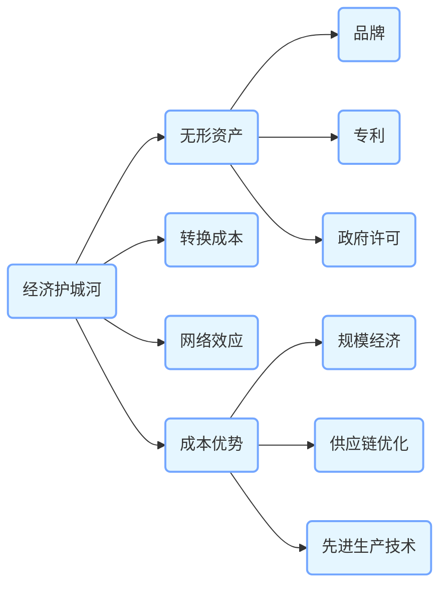

# 巴菲特的经济护城河概念详解

> 关键词：巴菲特、经济护城河、企业竞争优势、可持续性、价值投资

> 摘要：本文深入剖析了巴菲特提出的经济护城河概念。首先介绍了该概念产生的背景、目的、预期读者等内容，接着详细阐述了经济护城河的核心概念、联系及架构，分析了相关的核心算法原理与操作步骤，给出了数学模型和公式并举例说明。通过项目实战展示了经济护城河概念在实际中的应用，探讨了其实际应用场景，推荐了学习、开发相关的工具和资源，最后总结了未来发展趋势与挑战，解答了常见问题，并提供了扩展阅读和参考资料，旨在帮助读者全面理解经济护城河概念及其在投资和企业分析中的重要意义。

## 1. 背景介绍 
### 1.1 目的和范围
巴菲特的经济护城河概念是价值投资领域的重要理论，其目的在于帮助投资者识别那些具有长期竞争优势、能够在市场中持续创造价值的企业。该概念的范围涵盖了对企业多种竞争优势的分析，包括无形资产、转换成本、网络效应和成本优势等方面。通过对这些因素的评估，投资者可以判断企业是否拥有难以被竞争对手模仿和超越的“护城河”，从而为投资决策提供有力依据。

### 1.2 预期读者
本文预期读者包括广大的投资者，无论是个人投资者还是专业投资机构的从业者，都可以从对经济护城河概念的深入理解中受益。此外，企业管理者也能通过学习该概念，审视自身企业的竞争优势，寻找提升企业竞争力的途径。同时，对金融、经济领域感兴趣的学生和研究人员也可以将其作为研究企业竞争和投资策略的重要参考。

### 1.3 文档结构概述
本文将首先介绍经济护城河的核心概念及其相互联系，通过文本示意图和Mermaid流程图进行清晰展示。接着阐述核心算法原理和具体操作步骤，并用Python代码进行详细说明。然后给出相关的数学模型和公式，并结合实际例子进行讲解。在项目实战部分，将搭建开发环境，实现源代码并进行详细解读。之后探讨经济护城河概念的实际应用场景，推荐学习和开发所需的工具和资源。最后总结未来发展趋势与挑战，解答常见问题，并提供扩展阅读和参考资料。

### 1.4 术语表
#### 1.4.1 核心术语定义
- **经济护城河**：指企业所拥有的一种可持续的竞争优势，使得企业在长期内能够抵御竞争对手的侵蚀，保持较高的盈利能力和市场地位。
- **无形资产**：包括品牌、专利、政府许可等，这些资产虽然不具有实物形态，但能够为企业带来重要的竞争优势。
- **转换成本**：指客户从现有产品或服务转换到竞争对手的产品或服务时所面临的成本，包括时间、金钱、精力等方面的成本。
- **网络效应**：指随着用户数量的增加，产品或服务的价值也随之增加的现象。例如，社交网络平台的用户越多，其对新用户的吸引力就越大。
- **成本优势**：指企业通过各种方式降低生产、运营成本，从而在价格上具有竞争优势，能够吸引更多的客户。

#### 1.4.2 相关概念解释
- **可持续竞争优势**：与经济护城河密切相关，强调企业的竞争优势是长期可持续的，而不是短期的、暂时的。具有可持续竞争优势的企业能够在市场中保持领先地位，获得稳定的利润。
- **价值投资**：是一种投资策略，强调通过分析企业的内在价值来选择投资对象。经济护城河概念是价值投资的重要组成部分，投资者通过寻找具有经济护城河的企业，以合理的价格买入并长期持有，从而获得投资回报。

#### 1.4.3 缩略词列表
无

## 2. 核心概念与联系 

### 核心概念原理
经济护城河的核心在于企业所拥有的可持续竞争优势，这种优势可以来自多个方面。

#### 无形资产
品牌是一种重要的无形资产。例如，可口可乐的品牌价值极高，消费者对其品牌具有高度的认同感和忠诚度。即使市场上有其他类似的饮料产品，很多消费者仍然会优先选择可口可乐。专利也是无形资产的一种，拥有专利的企业可以在一定期限内独家生产和销售相关产品，从而获得垄断利润。例如，制药企业的新药专利可以保护其在市场上的竞争优势。政府许可则为企业进入某些特定行业提供了门槛，限制了竞争对手的进入。

#### 转换成本
当客户从一种产品或服务转换到另一种产品或服务时，会面临各种转换成本。例如，企业使用的办公软件，如果要更换为其他品牌的软件，需要员工重新学习操作方法，还可能涉及数据迁移等问题，这会带来时间和成本的增加。因此，客户往往不愿意轻易更换软件，这就为软件企业形成了一定的转换成本壁垒。

#### 网络效应
以社交网络平台为例，如Facebook。随着用户数量的不断增加，平台上的社交关系网络变得更加庞大和复杂。新用户加入该平台可以更容易地与更多的朋友、家人和同事建立联系，从而获得更大的价值。同时，更多的用户也吸引了更多的广告商和商家，进一步提升了平台的盈利能力。这种网络效应使得新的社交网络平台很难在短时间内与Facebook竞争。

#### 成本优势
企业可以通过多种方式获得成本优势。例如，规模经济是一种常见的方式。大型制造企业通过大规模生产，可以降低单位产品的生产成本。另外，企业还可以通过优化供应链管理、采用先进的生产技术等方式降低成本。例如，沃尔玛通过高效的供应链管理，降低了商品的采购和运输成本，从而能够以更低的价格销售商品，吸引更多的消费者。

### 架构的文本示意图
```plaintext
经济护城河
|-- 无形资产
|   |-- 品牌
|   |-- 专利
|   |-- 政府许可
|-- 转换成本
|-- 网络效应
|-- 成本优势
|   |-- 规模经济
|   |-- 供应链优化
|   |-- 先进生产技术
```

### Mermaid流程图


## 3. 核心算法原理 & 具体操作步骤 

### 核心算法原理
评估企业是否具有经济护城河并没有一个固定的、精确的算法，但可以通过一系列指标和方法进行综合分析。以下是一种简化的思路：

我们可以将企业的经济护城河评估分为几个维度，每个维度赋予一定的权重，然后对每个维度进行评分，最后计算加权总分来判断企业的经济护城河强度。

### 具体操作步骤

#### 步骤1：确定评估维度和权重
假设我们确定以下四个评估维度：无形资产、转换成本、网络效应、成本优势，权重分别为0.3、0.2、0.2、0.3。

#### 步骤2：对每个维度进行评分
评分范围为0 - 10分，0分表示该维度没有任何竞争优势，10分表示该维度具有极强的竞争优势。

#### 步骤3：计算加权总分
加权总分 = 无形资产得分 × 0.3 + 转换成本得分 × 0.2 + 网络效应得分 × 0.2 + 成本优势得分 × 0.3

#### 步骤4：根据总分判断经济护城河强度
- 总分在0 - 3分：经济护城河很弱，企业面临较大的竞争压力。
- 总分在3 - 6分：经济护城河一般，企业具有一定的竞争优势，但不够突出。
- 总分在6 - 10分：经济护城河较强，企业在市场中具有较强的竞争力。

### Python源代码实现
```python
# 定义评估维度和权重
dimensions = ['无形资产', '转换成本', '网络效应', '成本优势']
weights = [0.3, 0.2, 0.2, 0.3]

# 获取用户输入的每个维度的得分
scores = []
for dimension in dimensions:
    score = float(input(f"请输入 {dimension} 的得分（0 - 10分）："))
    scores.append(score)

# 计算加权总分
total_score = 0
for i in range(len(dimensions)):
    total_score += scores[i] * weights[i]

# 判断经济护城河强度
if total_score >= 0 and total_score < 3:
    strength = "很弱"
elif total_score >= 3 and total_score < 6:
    strength = "一般"
else:
    strength = "较强"

# 输出结果
print(f"该企业的经济护城河加权总分为：{total_score} 分，经济护城河强度：{strength}")
```

## 4. 数学模型和公式 & 详细讲解 & 举例说明 

### 数学模型和公式
设企业的经济护城河评估维度有 $n$ 个，分别为 $d_1, d_2, \cdots, d_n$，对应的权重为 $w_1, w_2, \cdots, w_n$，且 $\sum_{i=1}^{n} w_i = 1$。每个维度的得分分别为 $s_1, s_2, \cdots, s_n$，则企业的经济护城河加权总分 $T$ 可以用以下公式表示：

$$T = \sum_{i=1}^{n} w_i s_i$$

### 详细讲解
该公式的核心思想是将每个评估维度的得分乘以其对应的权重，然后将所有结果相加，得到企业的经济护城河加权总分。权重的设置反映了每个维度在整体评估中的重要程度。通过加权总分，我们可以综合考虑各个维度的因素，更全面地评估企业的经济护城河强度。

### 举例说明
假设我们要评估一家软件企业的经济护城河。根据前面确定的四个评估维度和权重，我们对该企业进行评分。

- 无形资产：该企业拥有知名品牌和多项软件专利，评分为8分。
- 转换成本：客户更换该企业的软件需要重新培训员工和迁移数据，成本较高，评分为7分。
- 网络效应：该软件的用户数量较多，且用户之间的互动和数据共享较为频繁，具有一定的网络效应，评分为6分。
- 成本优势：企业通过优化开发流程和采用云计算技术，降低了开发和运营成本，评分为7分。

根据公式计算加权总分：

$$T = 0.3 \times 8 + 0.2 \times 7 + 0.2 \times 6 + 0.3 \times 7$$
$$T = 2.4 + 1.4 + 1.2 + 2.1$$
$$T = 7.1$$

由于总分7.1分在6 - 10分之间，所以该企业的经济护城河较强，在市场中具有较强的竞争力。

## 5. 项目实战：代码实际案例和详细解释说明 

### 5.1  开发环境搭建
本项目使用Python进行开发，以下是开发环境搭建的步骤：

#### 步骤1：安装Python
访问Python官方网站（https://www.python.org/downloads/），根据自己的操作系统选择合适的Python版本进行下载和安装。安装过程中注意勾选“Add Python to PATH”选项，以便在命令行中可以直接使用Python命令。

#### 步骤2：安装开发工具
可以选择使用Visual Studio Code、PyCharm等集成开发环境（IDE）。这里以Visual Studio Code为例，访问Visual Studio Code官方网站（https://code.visualstudio.com/）进行下载和安装。安装完成后，在Visual Studio Code中安装Python扩展，以便支持Python代码的编写和调试。

### 5.2  源代码详细实现和代码解读
以下是完整的Python代码：

```python
# 定义评估维度和权重
dimensions = ['无形资产', '转换成本', '网络效应', '成本优势']
weights = [0.3, 0.2, 0.2, 0.3]

# 获取用户输入的每个维度的得分
scores = []
for dimension in dimensions:
    score = float(input(f"请输入 {dimension} 的得分（0 - 10分）："))
    scores.append(score)

# 计算加权总分
total_score = 0
for i in range(len(dimensions)):
    total_score += scores[i] * weights[i]

# 判断经济护城河强度
if total_score >= 0 and total_score < 3:
    strength = "很弱"
elif total_score >= 3 and total_score < 6:
    strength = "一般"
else:
    strength = "较强"

# 输出结果
print(f"该企业的经济护城河加权总分为：{total_score} 分，经济护城河强度：{strength}")
```

### 代码解读与分析
- **定义评估维度和权重**：`dimensions` 列表存储了四个评估维度的名称，`weights` 列表存储了对应的权重。
- **获取用户输入的得分**：使用 `for` 循环遍历每个评估维度，通过 `input()` 函数获取用户输入的得分，并将其转换为浮点数后添加到 `scores` 列表中。
- **计算加权总分**：使用 `for` 循环遍历每个维度，将得分乘以权重并累加到 `total_score` 中。
- **判断经济护城河强度**：根据加权总分的范围，使用 `if-elif-else` 语句判断经济护城河的强度，并将结果存储在 `strength` 变量中。
- **输出结果**：使用 `print()` 函数输出企业的经济护城河加权总分和强度。

## 6. 实际应用场景 
### 投资决策
投资者在选择投资对象时，可以运用经济护城河概念来评估企业的长期竞争力。具有较强经济护城河的企业往往能够在市场波动中保持相对稳定的业绩，为投资者带来长期的投资回报。例如，巴菲特长期持有可口可乐的股票，就是因为可口可乐拥有强大的品牌无形资产和广泛的消费群体，具有很强的经济护城河。

### 企业战略规划
企业管理者可以通过分析自身企业的经济护城河，找出企业的竞争优势和不足之处，从而制定相应的战略规划。如果企业在某一维度的竞争优势较弱，可以考虑采取措施加强该维度的建设。例如，如果企业缺乏品牌影响力，可以加大品牌推广和营销的投入。

### 行业分析
经济护城河概念也可以用于行业分析。通过比较不同企业在同一行业中的经济护城河强度，可以了解行业的竞争格局和发展趋势。如果某个行业中的大部分企业都具有较强的经济护城河，说明该行业的进入门槛较高，竞争相对缓和；反之，如果大部分企业的经济护城河较弱，说明该行业竞争激烈，企业面临较大的生存压力。

## 7. 工具和资源推荐
### 7.1 学习资源推荐
#### 7.1.1 书籍推荐
- 《巴菲特的护城河》：本书深入介绍了巴菲特的经济护城河概念，通过大量的案例分析，帮助读者理解如何识别具有经济护城河的企业。
- 《聪明的投资者》：这是价值投资领域的经典著作，虽然没有专门阐述经济护城河概念，但其中的投资理念和分析方法与经济护城河概念密切相关。
- 《竞争优势：透视企业护城河》：详细讲解了企业竞争优势的来源和评估方法，对经济护城河概念进行了深入探讨。

#### 7.1.2 在线课程
- Coursera上的“投资学原理”课程：该课程涵盖了价值投资的基本理论和方法，其中包括对企业竞争优势的分析。
- 网易云课堂上的“巴菲特投资智慧”课程：专门讲解巴菲特的投资理念和方法，对经济护城河概念有详细的介绍。

#### 7.1.3 技术博客和网站
- 雪球网：是一个投资交流社区，有很多投资者分享对企业经济护城河的分析和研究。
- 价值投资网：专注于价值投资领域，提供了大量关于经济护城河和企业分析的文章和资料。

### 7.2 开发工具框架推荐
#### 7.2.1 IDE和编辑器
- Visual Studio Code：功能强大、易于使用的开源代码编辑器，支持Python开发，有丰富的插件可以扩展功能。
- PyCharm：专业的Python集成开发环境，提供了代码调试、代码分析、代码重构等强大功能，适合大型Python项目的开发。

#### 7.2.2 调试和性能分析工具
- `pdb`：Python自带的调试器，可以帮助开发者在代码中设置断点、查看变量值等，方便调试代码。
- `cProfile`：Python标准库中的性能分析工具，可以分析代码的执行时间和函数调用次数，帮助开发者找出代码中的性能瓶颈。

#### 7.2.3 相关框架和库
- `pandas`：用于数据处理和分析的Python库，可以方便地读取、处理和分析企业的财务数据。
- `numpy`：提供了高效的数值计算功能，在处理大规模数据时非常有用。

### 7.3 相关论文著作推荐
#### 7.3.1 经典论文
- 《竞争战略》（迈克尔·波特）：提出了企业竞争战略的基本理论，对经济护城河概念的形成有重要的影响。
- 《企业的性质》（罗纳德·科斯）：探讨了企业存在的原因和边界，为理解企业的竞争优势提供了理论基础。

#### 7.3.2 最新研究成果
- 一些学术期刊如《管理世界》、《经济研究》等会发表关于企业竞争优势和经济护城河的最新研究成果，可以关注这些期刊获取相关信息。

#### 7.3.3 应用案例分析
- 哈佛商学院案例库：收录了大量的企业案例，其中不乏关于具有经济护城河企业的案例分析，可以从中学习企业的竞争策略和发展经验。

## 8. 总结：未来发展趋势与挑战
### 未来发展趋势
- **数字化转型带来新的经济护城河**：随着信息技术的快速发展，企业的数字化转型将成为未来的趋势。拥有强大的数字化能力，如大数据分析、人工智能应用等，将成为企业新的经济护城河。例如，科技巨头亚马逊通过其强大的大数据分析能力，能够精准地了解客户需求，提供个性化的推荐服务，从而增强了客户的忠诚度和企业的竞争力。
- **可持续发展成为重要的竞争优势**：在全球关注环境保护和社会责任的背景下，企业的可持续发展能力将成为重要的经济护城河。消费者越来越倾向于选择那些具有良好社会形象和环保意识的企业的产品和服务。因此，企业在可持续发展方面的投入和表现将直接影响其市场竞争力。
- **跨行业融合加剧经济护城河的复杂性**：未来，不同行业之间的融合将越来越频繁。企业可能需要同时具备多个行业的竞争优势，才能构建强大的经济护城河。例如，汽车行业与科技行业的融合，使得汽车企业不仅需要具备传统的汽车制造能力，还需要掌握智能驾驶、车联网等新兴技术。

### 挑战
- **技术更新换代快**：在快速发展的科技时代，技术更新换代的速度非常快。企业的经济护城河可能会因为技术的变革而迅速消失。例如，曾经在功能手机市场占据主导地位的诺基亚，由于未能及时跟上智能手机技术的发展，其经济护城河很快被竞争对手超越。
- **市场竞争激烈**：随着全球化的推进和市场开放程度的提高，企业面临的市场竞争越来越激烈。新的竞争对手不断涌现，可能会对企业现有的经济护城河构成威胁。企业需要不断创新和提升自身的竞争力，才能保持经济护城河的稳固。
- **法律法规和政策变化**：法律法规和政策的变化也可能对企业的经济护城河产生影响。例如，政府对某些行业的监管政策调整，可能会打破企业原有的竞争格局，削弱企业的经济护城河。企业需要密切关注政策变化，及时调整战略以适应新的环境。

## 9. 附录：常见问题与解答
### 问题1：经济护城河是否意味着企业永远不会失败？
解答：不是的。经济护城河只是表示企业具有一定的竞争优势和抵御风险的能力，但并不能保证企业永远不会失败。市场环境是不断变化的，技术创新、消费者需求变化、竞争对手的挑战等因素都可能导致企业的经济护城河受到侵蚀。例如，柯达曾经拥有强大的品牌和技术优势，但由于未能及时适应数码摄影技术的发展，最终走向衰落。

### 问题2：如何准确评估企业的经济护城河？
解答：评估企业的经济护城河需要综合考虑多个因素，包括无形资产、转换成本、网络效应和成本优势等。可以通过分析企业的财务报表、市场份额、客户满意度、行业竞争格局等方面来获取相关信息。同时，还需要对企业的未来发展趋势进行预测，考虑技术创新、市场变化等因素对企业经济护城河的影响。此外，参考专业的投资分析报告和行业研究也有助于更准确地评估企业的经济护城河。

### 问题3：经济护城河和企业的短期业绩有什么关系？
解答：经济护城河与企业的短期业绩之间没有必然的直接联系。具有经济护城河的企业并不一定在短期内就能实现高业绩增长，而短期业绩好的企业也不一定具有经济护城河。经济护城河更侧重于企业的长期竞争优势和可持续发展能力。一些具有经济护城河的企业可能会在短期内进行战略投资和研发投入，导致业绩暂时受到影响，但从长期来看，这些投资将有助于企业巩固和扩大经济护城河，实现更高的业绩增长。

## 10. 扩展阅读 & 参考资料
### 扩展阅读
- 《创新者的窘境》：探讨了企业在面对技术创新和市场变化时的困境和应对策略，与经济护城河概念有一定的关联。
- 《从0到1》：介绍了创业公司如何创造独特的价值和竞争优势，对于理解企业经济护城河的形成有一定的启发。

### 参考资料
- 巴菲特历年致股东的信：可以从中了解巴菲特对企业经济护城河的看法和投资理念。
- 相关企业的年报和财务报告：是分析企业经济护城河的重要数据来源。

作者：AI天才研究院/AI Genius Institute & 禅与计算机程序设计艺术 /Zen And The Art of Computer Programming