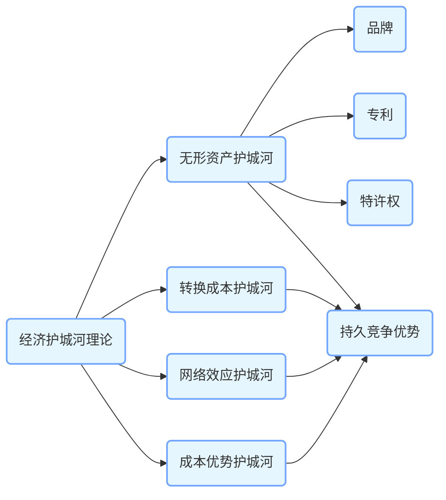

# 巴菲特的经济护城河理论：如何识别持久竞争优势

> 关键词：巴菲特、经济护城河理论、持久竞争优势、识别方法、企业分析

> 摘要：本文深入探讨了巴菲特的经济护城河理论，旨在阐述如何通过该理论识别企业的持久竞争优势。首先介绍了经济护城河理论的背景，包括其目的、预期读者、文档结构和相关术语。接着详细解释了核心概念及联系，通过文本示意图和 Mermaid 流程图进行清晰展示。然后阐述了识别持久竞争优势的核心算法原理和具体操作步骤，结合 Python 代码进行说明。同时给出了相关的数学模型和公式，并举例讲解。通过项目实战案例，详细展示了如何在实际中运用该理论进行企业分析。最后探讨了该理论的实际应用场景，推荐了相关的学习资源、开发工具和论文著作，总结了未来发展趋势与挑战，并提供常见问题解答和扩展阅读参考资料。

## 1. 背景介绍 
### 1.1 目的和范围
巴菲特的经济护城河理论是投资领域的重要理论之一。本文的目的在于深入剖析这一理论，帮助投资者、企业管理者以及对商业竞争感兴趣的人士更好地理解如何识别企业的持久竞争优势。我们将涵盖经济护城河的各种类型、识别方法、实际应用以及相关的数学模型和代码实现等方面，通过全面的分析，为读者提供一套系统的知识体系。

### 1.2 预期读者
本文的预期读者包括但不限于以下几类人群：
- 投资者：无论是个人投资者还是机构投资者，都可以通过学习该理论，更好地筛选具有投资价值的企业，提高投资决策的准确性。
- 企业管理者：有助于企业管理者认识到自身企业的竞争优势所在，以及如何进一步巩固和拓展这些优势，提升企业的市场竞争力。
- 商学院学生和研究人员：为他们提供深入研究企业竞争战略和投资理论的参考资料，丰富学术研究的视角。
- 对商业竞争和经济现象感兴趣的普通读者：可以增进对企业竞争本质的理解，了解商业世界的运行规律。

### 1.3 文档结构概述
本文将按照以下结构展开：
- 核心概念与联系：介绍经济护城河的定义、类型以及与持久竞争优势的关系，通过示意图和流程图进行直观展示。
- 核心算法原理 & 具体操作步骤：阐述识别持久竞争优势的算法原理，并给出具体的操作步骤，结合 Python 代码进行详细说明。
- 数学模型和公式 & 详细讲解 & 举例说明：建立数学模型和公式来量化企业的竞争优势，并通过实际例子进行讲解。
- 项目实战：代码实际案例和详细解释说明：通过实际的项目案例，展示如何运用该理论进行企业分析，包括开发环境搭建、源代码实现和代码解读。
- 实际应用场景：探讨经济护城河理论在投资决策、企业战略规划等方面的实际应用。
- 工具和资源推荐：推荐相关的学习资源、开发工具和论文著作，帮助读者进一步深入学习。
- 总结：未来发展趋势与挑战：总结经济护城河理论的未来发展趋势和面临的挑战。
- 附录：常见问题与解答：解答读者在学习过程中可能遇到的常见问题。
- 扩展阅读 & 参考资料：提供相关的扩展阅读资料和参考书目。

### 1.4 术语表
#### 1.4.1 核心术语定义
- **经济护城河**：指企业抵御竞争对手，保护自身长期盈利能力和市场份额的结构性优势。这种优势就像城堡周围的护城河一样，能够阻止竞争对手的入侵，使企业在市场中保持领先地位。
- **持久竞争优势**：企业在较长时间内能够持续保持的相对于竞争对手的优势，这种优势可以体现在成本、品牌、技术、客户转换成本等多个方面。
- **无形资产**：企业拥有的没有实物形态的可辨认非货币性资产，如品牌、专利、商标、特许权等，这些资产可以为企业带来竞争优势。
- **转换成本**：客户从使用一种产品或服务转换到使用另一种产品或服务时所面临的成本，包括时间成本、金钱成本、学习成本等。

#### 1.4.2 相关概念解释
- **网络效应**：指产品或服务的价值随着使用该产品或服务的用户数量的增加而增加的现象。例如，社交媒体平台的用户越多，其对新用户的吸引力就越大，因为用户可以在平台上与更多的人进行互动。
- **成本优势**：企业通过降低生产成本、运营成本等方式，使其产品或服务的价格低于竞争对手，从而在市场中获得竞争优势。成本优势可以通过规模经济、高效的生产流程、优质的供应链管理等方式实现。

#### 1.4.3 缩略词列表
- **ROE**：Return on Equity，净资产收益率，是衡量企业盈利能力的重要指标，反映了股东权益的收益水平。
- **EPS**：Earnings Per Share，每股收益，是指税后利润与股本总数的比率，反映了普通股的获利水平。

## 2. 核心概念与联系 
### 经济护城河的类型
巴菲特认为经济护城河主要有以下几种类型：
1. **无形资产护城河**
    - **品牌**：强大的品牌可以使企业的产品或服务在消费者心目中具有较高的认可度和美誉度，从而使企业能够以较高的价格销售产品或服务。例如，可口可乐凭借其全球知名的品牌，在饮料市场占据了主导地位。
    - **专利**：专利可以保护企业的技术创新，使企业在一定时期内拥有独家生产和销售相关产品或服务的权利。例如，制药企业通过研发新药并获得专利保护，可以在专利有效期内获得高额的利润。
    - **特许权**：政府或其他机构授予企业的特殊权利，如公用事业公司的特许经营权，使企业在特定领域具有垄断地位。
2. **转换成本护城河**
当客户从使用一种产品或服务转换到使用另一种产品或服务时，如果面临较高的转换成本，他们就不太可能轻易更换。例如，企业使用的企业资源规划（ERP）系统，一旦实施并投入使用，更换系统的成本非常高，包括数据迁移、员工培训等，因此客户往往会继续使用原有的系统。
3. **网络效应护城河**
网络效应使得产品或服务的价值随着用户数量的增加而增加。例如，电商平台上的卖家和买家越多，平台的交易活跃度就越高，对新的卖家和买家的吸引力也就越大。
4. **成本优势护城河**
企业通过降低生产成本、运营成本等方式获得成本优势。例如，沃尔玛通过高效的供应链管理和大规模采购，降低了商品的采购成本，从而能够以较低的价格销售商品，吸引了大量的消费者。

### 核心概念原理和架构的文本示意图
```plaintext
经济护城河理论
|-- 无形资产护城河
|   |-- 品牌
|   |-- 专利
|   |-- 特许权
|-- 转换成本护城河
|-- 网络效应护城河
|-- 成本优势护城河
|-- 持久竞争优势
```

### Mermaid 流程图


从这个流程图可以清晰地看出，经济护城河的不同类型共同作用，形成了企业的持久竞争优势。无形资产护城河中的品牌、专利和特许权，转换成本护城河、网络效应护城河以及成本优势护城河，都是构成持久竞争优势的重要因素。

## 3. 核心算法原理 & 具体操作步骤 
### 核心算法原理
识别企业的持久竞争优势可以通过对企业的财务数据和业务数据进行分析，结合经济护城河理论的各个要素来实现。以下是一个基本的算法思路：
1. **数据收集**：收集企业的财务报表、市场调研报告、行业分析数据等，获取企业的收入、利润、资产、负债等财务信息，以及市场份额、客户满意度、技术创新能力等业务信息。
2. **指标计算**：根据收集到的数据，计算一系列反映企业竞争优势的指标，如净资产收益率（ROE）、每股收益（EPS）、毛利率、净利率等。这些指标可以反映企业的盈利能力、资产运营效率等方面的情况。
3. **护城河要素评估**：对企业的无形资产、转换成本、网络效应和成本优势等护城河要素进行评估。例如，通过分析企业的品牌知名度、专利数量、客户忠诚度等指标来评估无形资产护城河；通过调查客户更换产品或服务的意愿和成本来评估转换成本护城河。
4. **综合判断**：根据指标计算和护城河要素评估的结果，综合判断企业是否具有持久竞争优势。如果企业在多个方面都表现出较强的优势，且这些优势具有可持续性，那么可以认为企业具有持久竞争优势。

### 具体操作步骤
以下是使用 Python 实现上述算法的具体步骤和代码示例：

```python
import pandas as pd

# 步骤 1: 数据收集
# 假设我们已经收集到了企业的财务数据，存储在一个 CSV 文件中
def collect_data(file_path):
    data = pd.read_csv(file_path)
    return data

# 步骤 2: 指标计算
def calculate_metrics(data):
    # 计算净资产收益率 (ROE)
    data['ROE'] = data['净利润'] / data['净资产']
    # 计算每股收益 (EPS)
    data['EPS'] = data['净利润'] / data['总股本']
    # 计算毛利率
    data['毛利率'] = (data['营业收入'] - data['营业成本']) / data['营业收入']
    # 计算净利率
    data['净利率'] = data['净利润'] / data['营业收入']
    return data

# 步骤 3: 护城河要素评估
# 这里只是一个简单的示例，实际评估需要更复杂的方法
def evaluate_moat(data):
    # 假设品牌知名度可以通过市场份额来近似衡量
    brand_score = data['市场份额'] * 100
    # 假设专利数量可以从数据中直接获取
    patent_score = data['专利数量']
    # 假设客户忠诚度可以通过客户重复购买率来衡量
    loyalty_score = data['客户重复购买率'] * 100
    # 综合评估无形资产护城河
    intangible_moat_score = (brand_score + patent_score + loyalty_score) / 3
    # 这里简单假设转换成本可以通过客户满意度来衡量
    switching_cost_score = data['客户满意度'] * 100
    # 假设网络效应可以通过用户增长率来衡量
    network_effect_score = data['用户增长率'] * 100
    # 假设成本优势可以通过成本费用率来衡量
    cost_advantage_score = (1 - data['成本费用率']) * 100
    return {
        '无形资产护城河得分': intangible_moat_score,
        '转换成本护城河得分': switching_cost_score,
        '网络效应护城河得分': network_effect_score,
        '成本优势护城河得分': cost_advantage_score
    }

# 步骤 4: 综合判断
def overall_judgment(metrics, moat_scores):
    # 这里可以根据具体的阈值进行判断，这里简单假设各项得分都大于 50 分且 ROE 大于 15% 认为具有持久竞争优势
    if all(score > 50 for score in moat_scores.values()) and metrics['ROE'].mean() > 0.15:
        return '具有持久竞争优势'
    else:
        return '不具有持久竞争优势'

# 主函数
def main():
    file_path = 'company_data.csv'
    data = collect_data(file_path)
    metrics = calculate_metrics(data)
    moat_scores = evaluate_moat(metrics)
    result = overall_judgment(metrics, moat_scores)
    print(f'企业评估结果: {result}')
    print('各项护城河得分:')
    for key, value in moat_scores.items():
        print(f'{key}: {value:.2f}')

if __name__ == "__main__":
    main()
```

### 代码解释
1. **collect_data 函数**：该函数用于读取存储企业财务数据的 CSV 文件，并将其转换为 Pandas 的 DataFrame 对象。
2. **calculate_metrics 函数**：该函数根据收集到的数据计算净资产收益率（ROE）、每股收益（EPS）、毛利率和净利率等指标，并将这些指标添加到 DataFrame 中。
3. **evaluate_moat 函数**：该函数对企业的护城河要素进行评估，通过一些简单的指标来近似衡量无形资产护城河、转换成本护城河、网络效应护城河和成本优势护城河的得分。
4. **overall_judgment 函数**：该函数根据指标计算和护城河要素评估的结果，综合判断企业是否具有持久竞争优势。这里简单假设各项得分都大于 50 分且 ROE 大于 15% 认为具有持久竞争优势。
5. **main 函数**：主函数调用上述各个函数，完成数据收集、指标计算、护城河要素评估和综合判断，并输出评估结果和各项护城河得分。

## 4. 数学模型和公式 & 详细讲解 & 举例说明 
### 净资产收益率（ROE）
净资产收益率（ROE）是衡量企业盈利能力的重要指标，它反映了股东权益的收益水平。其计算公式为：
$$ROE = \frac{净利润}{净资产} \times 100\%$$
其中，净利润是指企业在一定时期内的税后利润，净资产是指企业的所有者权益，即资产减去负债后的余额。

**详细讲解**：ROE 越高，说明企业运用自有资本的效率越高，盈利能力越强。一般来说，ROE 持续保持在 15% 以上的企业被认为具有较好的盈利能力。

**举例说明**：假设企业 A 在某一年的净利润为 1000 万元，净资产为 5000 万元，则该企业的 ROE 为：
$$ROE = \frac{1000}{5000} \times 100\% = 20\%$$
这表明企业 A 每投入 1 元的净资产，可以获得 0.2 元的净利润，盈利能力较强。

### 每股收益（EPS）
每股收益（EPS）是指税后利润与股本总数的比率，它反映了普通股的获利水平。其计算公式为：
$$EPS = \frac{净利润}{总股本}$$
其中，净利润是指企业在一定时期内的税后利润，总股本是指企业发行的普通股股份总数。

**详细讲解**：EPS 越高，说明每股普通股所获得的利润越多，股东的收益也就越高。EPS 是投资者评估企业投资价值的重要指标之一。

**举例说明**：假设企业 B 在某一年的净利润为 2000 万元，总股本为 1000 万股，则该企业的 EPS 为：
$$EPS = \frac{2000}{1000} = 2 元/股$$
这意味着每股普通股在该年度可以获得 2 元的利润。

### 毛利率
毛利率是指毛利与营业收入的比率，它反映了企业产品或服务的盈利能力。其计算公式为：
$$毛利率 = \frac{营业收入 - 营业成本}{营业收入} \times 100\%$$
其中，营业收入是指企业在一定时期内销售产品或提供服务所获得的收入，营业成本是指企业为生产产品或提供服务所发生的成本。

**详细讲解**：毛利率越高，说明企业在扣除成本后所获得的利润空间越大，产品或服务的盈利能力越强。不同行业的毛利率水平差异较大，一般来说，高科技行业、奢侈品行业等毛利率较高，而传统制造业、零售业等毛利率相对较低。

**举例说明**：假设企业 C 在某一年的营业收入为 5000 万元，营业成本为 3000 万元，则该企业的毛利率为：
$$毛利率 = \frac{5000 - 3000}{5000} \times 100\% = 40\%$$
这表明企业 C 的产品或服务在扣除成本后，还能获得 40% 的利润空间。

### 净利率
净利率是指净利润与营业收入的比率，它反映了企业在扣除所有成本和费用后所获得的利润水平。其计算公式为：
$$净利率 = \frac{净利润}{营业收入} \times 100\%$$
其中，净利润是指企业在一定时期内的税后利润，营业收入是指企业在一定时期内销售产品或提供服务所获得的收入。

**详细讲解**：净利率越高，说明企业的盈利能力越强，经营管理水平越高。净利率受到多种因素的影响，如成本控制、费用管理、税收政策等。

**举例说明**：假设企业 D 在某一年的净利润为 800 万元，营业收入为 4000 万元，则该企业的净利率为：
$$净利率 = \frac{800}{4000} \times 100\% = 20\%$$
这表明企业 D 在扣除所有成本和费用后，还能获得 20% 的利润。

## 5. 项目实战：代码实际案例和详细解释说明 
### 5.1  开发环境搭建
为了运行上述的 Python 代码，需要搭建以下开发环境：
1. **Python 安装**：建议安装 Python 3.7 及以上版本。可以从 Python 官方网站（https://www.python.org/downloads/）下载并安装适合自己操作系统的 Python 版本。
2. **安装必要的库**：需要安装 Pandas 库来处理数据。可以使用以下命令进行安装：
```sh
pip install pandas
```
3. **数据准备**：准备一个包含企业财务数据的 CSV 文件，文件中应包含以下列：`净利润`、`净资产`、`总股本`、`营业收入`、`营业成本`、`市场份额`、`专利数量`、`客户重复购买率`、`客户满意度`、`用户增长率`、`成本费用率`。

### 5.2  源代码详细实现和代码解读
以下是完整的源代码及详细解读：

```python
import pandas as pd

# 步骤 1: 数据收集
# 该函数用于读取存储企业财务数据的 CSV 文件，并将其转换为 Pandas 的 DataFrame 对象
def collect_data(file_path):
    data = pd.read_csv(file_path)
    return data

# 步骤 2: 指标计算
# 该函数根据收集到的数据计算净资产收益率（ROE）、每股收益（EPS）、毛利率和净利率等指标，并将这些指标添加到 DataFrame 中
def calculate_metrics(data):
    # 计算净资产收益率 (ROE)
    data['ROE'] = data['净利润'] / data['净资产']
    # 计算每股收益 (EPS)
    data['EPS'] = data['净利润'] / data['总股本']
    # 计算毛利率
    data['毛利率'] = (data['营业收入'] - data['营业成本']) / data['营业收入']
    # 计算净利率
    data['净利率'] = data['净利润'] / data['营业收入']
    return data

# 步骤 3: 护城河要素评估
# 该函数对企业的护城河要素进行评估，通过一些简单的指标来近似衡量无形资产护城河、转换成本护城河、网络效应护城河和成本优势护城河的得分
def evaluate_moat(data):
    # 假设品牌知名度可以通过市场份额来近似衡量
    brand_score = data['市场份额'] * 100
    # 假设专利数量可以从数据中直接获取
    patent_score = data['专利数量']
    # 假设客户忠诚度可以通过客户重复购买率来衡量
    loyalty_score = data['客户重复购买率'] * 100
    # 综合评估无形资产护城河
    intangible_moat_score = (brand_score + patent_score + loyalty_score) / 3
    # 这里简单假设转换成本可以通过客户满意度来衡量
    switching_cost_score = data['客户满意度'] * 100
    # 假设网络效应可以通过用户增长率来衡量
    network_effect_score = data['用户增长率'] * 100
    # 假设成本优势可以通过成本费用率来衡量
    cost_advantage_score = (1 - data['成本费用率']) * 100
    return {
        '无形资产护城河得分': intangible_moat_score,
        '转换成本护城河得分': switching_cost_score,
        '网络效应护城河得分': network_effect_score,
        '成本优势护城河得分': cost_advantage_score
    }

# 步骤 4: 综合判断
# 该函数根据指标计算和护城河要素评估的结果，综合判断企业是否具有持久竞争优势
def overall_judgment(metrics, moat_scores):
    # 这里可以根据具体的阈值进行判断，这里简单假设各项得分都大于 50 分且 ROE 大于 15% 认为具有持久竞争优势
    if all(score > 50 for score in moat_scores.values()) and metrics['ROE'].mean() > 0.15:
        return '具有持久竞争优势'
    else:
        return '不具有持久竞争优势'

# 主函数
# 主函数调用上述各个函数，完成数据收集、指标计算、护城河要素评估和综合判断，并输出评估结果和各项护城河得分
def main():
    file_path = 'company_data.csv'
    data = collect_data(file_path)
    metrics = calculate_metrics(data)
    moat_scores = evaluate_moat(metrics)
    result = overall_judgment(metrics, moat_scores)
    print(f'企业评估结果: {result}')
    print('各项护城河得分:')
    for key, value in moat_scores.items():
        print(f'{key}: {value:.2f}')

if __name__ == "__main__":
    main()
```

### 5.3  代码解读与分析
1. **数据收集部分**：`collect_data` 函数使用 Pandas 的 `read_csv` 函数读取 CSV 文件，并将其转换为 DataFrame 对象。这样可以方便后续的数据处理和分析。
2. **指标计算部分**：`calculate_metrics` 函数根据收集到的数据计算 ROE、EPS、毛利率和净利率等指标。这些指标是评估企业盈利能力和财务状况的重要依据。
3. **护城河要素评估部分**：`evaluate_moat` 函数通过一些简单的指标来近似衡量无形资产护城河、转换成本护城河、网络效应护城河和成本优势护城河的得分。在实际应用中，这些评估方法可能需要进一步细化和完善。
4. **综合判断部分**：`overall_judgment` 函数根据指标计算和护城河要素评估的结果，综合判断企业是否具有持久竞争优势。这里设置的阈值（各项得分大于 50 分且 ROE 大于 15%）可以根据实际情况进行调整。
5. **主函数部分**：`main` 函数调用上述各个函数，完成整个评估过程，并输出评估结果和各项护城河得分。

## 6. 实际应用场景 
### 投资决策
对于投资者来说，经济护城河理论可以帮助他们筛选具有投资价值的企业。具有持久竞争优势的企业往往能够在市场中保持稳定的盈利能力和市场份额，其股票价格也更有可能实现长期增长。投资者可以通过分析企业的经济护城河要素，如品牌、专利、转换成本等，来判断企业是否具有投资价值。例如，巴菲特在投资可口可乐时，就看中了其强大的品牌护城河，认为可口可乐的品牌具有极高的知名度和美誉度，能够在全球市场中持续获得高额的利润。

### 企业战略规划
企业管理者可以运用经济护城河理论来制定企业的战略规划。通过识别企业自身的竞争优势和劣势，企业可以采取相应的措施来巩固和拓展经济护城河。例如，如果企业拥有强大的品牌优势，可以进一步加大品牌推广力度，提升品牌价值；如果企业面临较高的转换成本，可以通过提高产品质量和服务水平，增强客户的忠诚度。同时，企业还可以通过创新和技术研发，建立新的经济护城河，如申请专利、开发新的产品或服务等。

### 行业分析
经济护城河理论也可以用于行业分析。不同行业的经济护城河要素可能存在差异，通过分析行业内企业的经济护城河情况，可以了解行业的竞争格局和发展趋势。例如，在科技行业，专利和技术创新往往是重要的经济护城河要素；而在消费品行业，品牌和渠道优势则更为关键。通过对行业内企业的经济护城河进行比较和分析，可以找出行业内的领先企业和潜在的竞争对手，为企业的战略决策提供参考。

### 风险管理
对于金融机构和投资者来说，经济护城河理论可以帮助他们进行风险管理。具有强大经济护城河的企业通常具有较强的抗风险能力，在经济衰退或市场波动时，其盈利能力和市场份额相对稳定。因此，金融机构在进行信贷评估和投资决策时，可以将企业的经济护城河情况作为重要的参考因素，降低投资风险。例如，银行在发放贷款时，可以优先考虑具有持久竞争优势的企业，以提高贷款的安全性。

## 7. 工具和资源推荐
### 7.1 学习资源推荐
#### 7.1.1 书籍推荐
- 《巴菲特的护城河》：这本书由帕特·多尔西所著，详细介绍了巴菲特的经济护城河理论，包括经济护城河的类型、识别方法和实际应用等方面的内容。书中通过大量的案例分析，帮助读者更好地理解和运用该理论。
- 《聪明的投资者》：本杰明·格雷厄姆的经典著作，这本书是价值投资的圣经，其中也涉及到了对企业竞争优势的分析和评估。巴菲特曾说过，这本书是他投资生涯的启蒙读物，对他的投资理念产生了深远的影响。
- 《竞争优势：透视企业护城河》：这本书深入探讨了企业竞争优势的来源和维持方法，结合了经济学、管理学和市场营销学等多学科的知识，为读者提供了一个全面的视角来理解企业的竞争优势。

#### 7.1.2 在线课程
- Coursera 上的“投资学原理”课程：该课程由知名大学的教授授课，涵盖了投资学的基本原理和方法，包括企业估值、财务分析、风险管理等方面的内容。课程中也会涉及到对企业竞争优势的分析和评估。
- Udemy 上的“价值投资实战课程”：该课程由经验丰富的投资专家授课，通过实际案例分析，帮助学员掌握价值投资的方法和技巧，包括如何识别具有持久竞争优势的企业。

#### 7.1.3 技术博客和网站
- Seeking Alpha：这是一个知名的投资研究网站，提供了大量的企业分析报告和投资建议。网站上的文章由专业的分析师和投资者撰写，对企业的经济护城河情况进行了深入的分析和探讨。
- Morningstar：晨星公司是一家全球知名的投资研究机构，其网站提供了丰富的金融数据和研究报告。投资者可以在该网站上查询企业的财务报表、估值数据和评级信息，了解企业的经济护城河情况。

### 7.2 开发工具框架推荐
#### 7.2.1 IDE和编辑器
- PyCharm：这是一款专业的 Python 集成开发环境（IDE），具有代码编辑、调试、版本控制等功能。PyCharm 提供了丰富的插件和工具，可以提高开发效率。
- Jupyter Notebook：这是一个开源的交互式笔记本，支持多种编程语言，包括 Python。Jupyter Notebook 可以将代码、文本、图表等内容整合在一起，方便进行数据分析和可视化。

#### 7.2.2 调试和性能分析工具
- PDB：Python 自带的调试工具，可以帮助开发者定位代码中的错误。通过设置断点、单步执行等操作，开发者可以逐步调试代码，找出问题所在。
- cProfile：Python 标准库中的性能分析工具，可以帮助开发者分析代码的性能瓶颈。通过统计函数的调用次数和执行时间，开发者可以找出代码中耗时较长的部分，进行优化。

#### 7.2.3 相关框架和库
- Pandas：这是一个强大的数据分析库，提供了数据结构和数据分析工具，方便进行数据处理和分析。在本文的代码示例中，我们使用 Pandas 来读取和处理企业的财务数据。
- NumPy：这是一个用于科学计算的 Python 库，提供了高效的数组操作和数学函数。在进行数据计算和分析时，NumPy 可以提高代码的执行效率。

### 7.3 相关论文著作推荐
#### 7.3.1 经典论文
- Michael E. Porter 的《竞争战略》：这篇论文提出了著名的“五力模型”，用于分析行业的竞争格局和企业的竞争优势。该模型包括供应商的议价能力、购买者的议价能力、潜在竞争者的威胁、替代品的威胁和现有竞争者的竞争等五个方面。
- Jay B. Barney 的《企业资源与持续竞争优势》：这篇论文提出了资源基础理论，认为企业的持续竞争优势来源于其独特的资源和能力。该理论强调了企业内部资源的重要性，为企业战略管理提供了新的视角。

#### 7.3.2 最新研究成果
- 近年来，随着人工智能和大数据技术的发展，一些学者开始运用这些技术来研究企业的竞争优势。例如，通过文本挖掘和机器学习算法，分析企业的年报、新闻报道等文本数据，挖掘企业的竞争优势和潜在风险。
- 还有一些研究关注企业的社会责任和可持续发展对其竞争优势的影响。研究表明，企业积极履行社会责任，如环境保护、员工福利等，可以提升企业的品牌形象和社会声誉，从而增强企业的竞争优势。

#### 7.3.3 应用案例分析
- 《哈佛商业评论》上经常发表一些关于企业竞争优势的案例分析文章，这些文章通过实际案例，深入分析了企业如何建立和维持经济护城河，以及如何应对市场竞争和挑战。
- 一些咨询公司和研究机构也会发布相关的研究报告，对不同行业的企业竞争优势进行分析和评估。例如，麦肯锡公司的研究报告《全球竞争力报告》，对全球不同国家和行业的企业竞争力进行了排名和分析。

## 8. 总结：未来发展趋势与挑战
### 未来发展趋势
1. **科技驱动的经济护城河**：随着科技的不断发展，科技因素在经济护城河中所占的比重将越来越大。例如，人工智能、大数据、区块链等技术的应用，将为企业带来新的竞争优势。企业可以通过技术创新，建立基于科技的经济护城河，如开发具有自主知识产权的软件、算法等。
2. **可持续发展的竞争优势**：消费者对企业的社会责任和可持续发展越来越关注，具有良好社会形象和可持续发展能力的企业将更具竞争优势。企业可以通过实施绿色战略、推动社会责任项目等方式，建立可持续发展的经济护城河。
3. **跨界融合的竞争格局**：随着产业边界的逐渐模糊，跨界融合将成为未来的发展趋势。企业需要具备跨行业的竞争能力，通过整合不同行业的资源和优势，建立新的经济护城河。例如，互联网企业与传统制造业的融合，将创造出全新的商业模式和竞争优势。

### 挑战
1. **技术更新换代快**：科技的快速发展使得技术更新换代的速度越来越快，企业建立的基于科技的经济护城河可能很快就会被竞争对手超越。因此，企业需要不断投入研发资源，保持技术创新的能力，以应对技术更新换代的挑战。
2. **市场竞争加剧**：随着全球经济一体化的发展，市场竞争越来越激烈。企业不仅要面对国内竞争对手的挑战，还要应对来自国际市场的竞争。在这种情况下，企业需要不断提升自身的竞争力，巩固和拓展经济护城河。
3. **数据安全和隐私问题**：在数字化时代，企业的运营越来越依赖于数据。然而，数据安全和隐私问题也日益突出。如果企业不能有效保护用户的数据安全和隐私，可能会导致用户信任度下降，从而影响企业的经济护城河。

## 9. 附录：常见问题与解答
### 1. 经济护城河和竞争优势有什么区别？
经济护城河是一种更持久、更稳定的竞争优势。竞争优势可能是短期的，例如企业通过降价促销获得的市场份额，但这种优势可能会随着竞争对手的跟进或市场环境的变化而消失。而经济护城河是企业基于自身的独特资源、能力和商业模式所建立的，能够在较长时间内抵御竞争对手的入侵，保护企业的盈利能力和市场份额。

### 2. 如何判断企业的经济护城河是否可持续？
可以从以下几个方面来判断企业的经济护城河是否可持续：
- **行业竞争格局**：分析行业的竞争态势，判断企业的竞争优势是否容易被竞争对手模仿或超越。如果行业竞争激烈，且竞争对手容易进入市场，那么企业的经济护城河可能不太可持续。
- **技术创新能力**：关注企业的技术创新能力，看企业是否能够不断推出新产品、新服务或新的商业模式，以保持竞争优势。如果企业缺乏技术创新能力，可能会在市场竞争中逐渐失去优势。
- **管理团队素质**：评估企业管理团队的素质和能力，看他们是否能够有效地制定和执行企业战略，应对市场变化和挑战。优秀的管理团队能够带领企业不断发展壮大，巩固和拓展经济护城河。

### 3. 经济护城河理论适用于所有行业吗？
经济护城河理论适用于大多数行业，但不同行业的经济护城河要素可能存在差异。例如，在科技行业，专利和技术创新往往是重要的经济护城河要素；而在消费品行业，品牌和渠道优势则更为关键。因此，在应用经济护城河理论时，需要结合行业特点进行具体分析。

### 4. 如何量化企业的经济护城河？
量化企业的经济护城河是一个复杂的问题，目前还没有一种统一的方法。可以通过一些财务指标和非财务指标来进行评估，如净资产收益率（ROE）、毛利率、净利率、市场份额、品牌知名度、专利数量等。同时，还可以采用专家评估、问卷调查等方法，综合评估企业的经济护城河情况。

## 10. 扩展阅读 & 参考资料
### 扩展阅读
- 《价值投资：从格雷厄姆到巴菲特》：这本书详细介绍了价值投资的发展历程和核心思想，深入探讨了如何通过分析企业的内在价值来进行投资决策。
- 《创新者的窘境》：克莱顿·克里斯坦森的经典著作，书中提出了“破坏性创新”的概念，分析了为什么一些领先企业在面对技术变革和市场变化时会失败，以及企业如何应对这种挑战。

### 参考资料
- [1] 帕特·多尔西. 《巴菲特的护城河》. 机械工业出版社, 2010.
- [2] 本杰明·格雷厄姆. 《聪明的投资者》. 人民邮电出版社, 2015.
- [3] Michael E. Porter. "Competitive Strategy: Techniques for Analyzing Industries and Competitors". Free Press, 1980.
- [4] Jay B. Barney. "Firm Resources and Sustained Competitive Advantage". Journal of Management, 1991.

作者：AI天才研究院/AI Genius Institute & 禅与计算机程序设计艺术 /Zen And The Art of Computer Programming