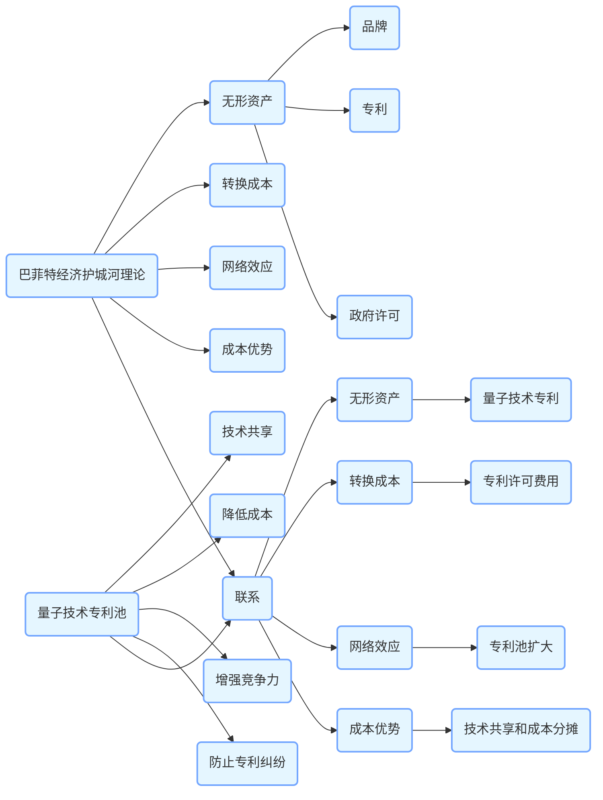

# 巴菲特的经济护城河理论：量子技术专利池的竞争优势

> 关键词：巴菲特经济护城河理论、量子技术、专利池、竞争优势、技术创新

> 摘要：本文深入探讨了巴菲特的经济护城河理论在量子技术专利池领域的应用。首先介绍了经济护城河理论的背景和基本概念，分析了量子技术的发展现状与重要性。接着阐述了量子技术专利池如何构成企业的经济护城河，包括其核心原理、架构以及与传统竞争优势的联系。通过详细的算法原理、数学模型和公式，解释了专利池在竞争中的量化优势。同时，给出了项目实战案例，包括开发环境搭建、源代码实现与解读。最后探讨了量子技术专利池的实际应用场景、推荐了相关学习资源和开发工具，总结了未来发展趋势与挑战，并对常见问题进行了解答。

## 1. 背景介绍 
### 1.1 目的和范围
本文章的目的在于深入研究巴菲特的经济护城河理论在量子技术专利池领域的应用。通过分析量子技术专利池如何形成企业的竞争优势，为企业在量子技术领域的战略布局提供理论支持和实践指导。范围涵盖了量子技术的基本概念、专利池的构建与管理、经济护城河理论的具体应用，以及相关的技术原理、数学模型和实际案例分析。

### 1.2 预期读者
本文预期读者包括科技企业的管理者、技术创新研究者、投资领域的专业人士以及对量子技术和经济理论感兴趣的爱好者。这些读者希望了解量子技术专利池在市场竞争中的重要性，以及如何运用经济护城河理论来评估和提升企业在该领域的竞争力。

### 1.3 文档结构概述
本文将按照以下结构进行阐述：首先介绍核心概念，包括巴菲特的经济护城河理论和量子技术专利池的定义与联系；接着详细讲解核心算法原理和具体操作步骤，使用 Python 代码进行说明；然后给出数学模型和公式，并举例说明；之后通过项目实战案例，展示量子技术专利池的实际应用；再探讨其实际应用场景；推荐相关的学习资源、开发工具和论文著作；最后总结未来发展趋势与挑战，解答常见问题，并提供扩展阅读和参考资料。

### 1.4 术语表
#### 1.4.1 核心术语定义
- **巴菲特经济护城河理论**：由投资大师沃伦·巴菲特提出，指企业在市场竞争中拥有的一种可持续的竞争优势，如同城堡周围的护城河保护城堡一样，保护企业免受竞争对手的侵蚀，从而实现长期稳定的盈利。
- **量子技术**：基于量子力学原理发展起来的一系列技术，包括量子计算、量子通信、量子传感等，具有高速计算、高安全性等独特优势。
- **专利池**：由多个专利所有者达成协议，将各自拥有的专利组合在一起，形成一个可供其他企业使用的专利集合。专利池的成员可以相互授权使用专利，也可以向外部企业许可使用专利。

#### 1.4.2 相关概念解释
- **竞争优势**：企业在市场中相对于竞争对手所具有的优势，包括成本优势、差异化优势、品牌优势等，能够使企业获得更高的市场份额和利润。
- **技术创新**：企业通过研发和应用新技术，推出新产品或改进现有产品和服务，从而提高企业的竞争力和市场地位。
- **知识产权保护**：通过法律手段保护企业的知识产权，包括专利、商标、著作权等，防止他人侵犯企业的技术成果和商业利益。

#### 1.4.3 缩略词列表
- **QC**：量子计算（Quantum Computing）
- **QC**：量子通信（Quantum Communication）
- **QS**：量子传感（Quantum Sensing）

## 2. 核心概念与联系 
### 2.1 巴菲特经济护城河理论
巴菲特认为，企业的经济护城河主要有以下几种类型：
- **无形资产**：包括品牌、专利、政府许可等。这些无形资产可以使企业在市场中获得独特的竞争地位，例如可口可乐的品牌价值使其在饮料市场具有强大的竞争力。
- **转换成本**：指客户从一个产品或服务转换到另一个产品或服务时所面临的成本。如果转换成本很高，客户就不太愿意更换产品或服务，从而为企业提供了一定的竞争优势。例如，企业使用的专业软件系统，更换系统需要付出很高的培训成本和数据迁移成本。
- **网络效应**：指产品或服务的价值随着用户数量的增加而增加的现象。例如，社交网络平台的用户越多，其价值就越高，因为用户可以与更多的人进行交流和互动。
- **成本优势**：企业通过降低成本，在价格上具有竞争优势。例如，沃尔玛通过高效的供应链管理和大规模采购，降低了商品的采购成本，从而能够以较低的价格销售商品。

### 2.2 量子技术专利池
量子技术作为一种新兴的前沿技术，具有巨大的发展潜力和应用前景。然而，量子技术的研发需要大量的资金、人力和时间投入，并且面临着很高的技术风险。因此，企业通过构建量子技术专利池，可以实现以下几个方面的优势：
- **技术共享**：专利池的成员可以相互分享各自的专利技术，避免重复研发，提高研发效率。
- **降低成本**：企业可以通过专利池获得更多的专利许可，降低专利使用成本。
- **增强竞争力**：拥有更多的量子技术专利可以增强企业在市场中的竞争力，提高企业的市场地位。
- **防止专利纠纷**：专利池可以协调成员之间的专利关系，减少专利纠纷的发生。

### 2.3 核心概念联系
量子技术专利池可以构成企业的经济护城河，主要体现在以下几个方面：
- **无形资产**：量子技术专利是企业的重要无形资产，拥有大量的专利可以使企业在量子技术领域获得独特的竞争地位。
- **转换成本**：如果企业在量子技术领域拥有大量的专利，其他企业想要进入该领域就需要支付很高的专利许可费用，从而增加了转换成本。
- **网络效应**：随着量子技术专利池的不断扩大，更多的企业会加入专利池，从而形成网络效应，提高专利池的价值。
- **成本优势**：通过专利池的技术共享和成本分摊，企业可以降低量子技术的研发成本和专利使用成本，从而获得成本优势。

### 2.4 文本示意图
```plaintext
巴菲特经济护城河理论
|--无形资产
|   |--品牌
|   |--专利
|   |--政府许可
|--转换成本
|--网络效应
|--成本优势

量子技术专利池
|--技术共享
|--降低成本
|--增强竞争力
|--防止专利纠纷

联系
|--量子技术专利池构成经济护城河
|   |--无形资产（量子技术专利）
|   |--转换成本（专利许可费用）
|   |--网络效应（专利池扩大）
|   |--成本优势（技术共享和成本分摊）
```

### 2.5 Mermaid 流程图


## 3. 核心算法原理 & 具体操作步骤 
### 3.1 专利价值评估算法
专利价值评估是构建量子技术专利池的重要环节，通过评估专利的价值，可以确定专利在专利池中的权重和许可费用。以下是一个简单的专利价值评估算法的 Python 实现：

```python
def patent_value_evaluation(patent):
    # 专利的技术创新性得分，范围 0-10
    innovation_score = patent.get('innovation_score', 0)
    # 专利的市场应用前景得分，范围 0-10
    market_score = patent.get('market_score', 0)
    # 专利的法律稳定性得分，范围 0-10
    legal_score = patent.get('legal_score', 0)
    
    # 计算专利价值，使用加权平均法
    value = (innovation_score * 0.4 + market_score * 0.3 + legal_score * 0.3)
    
    return value

# 示例专利数据
patent = {
    'innovation_score': 8,
    'market_score': 7,
    'legal_score': 6
}

# 评估专利价值
value = patent_value_evaluation(patent)
print(f"专利价值: {value}")
```

### 3.2 专利池构建算法
专利池构建算法的目标是选择具有较高价值的专利组成专利池，同时考虑专利之间的技术相关性和互补性。以下是一个简单的专利池构建算法的 Python 实现：

```python
def build_patent_pool(patents, num_patents):
    # 对专利按价值进行排序
    sorted_patents = sorted(patents, key=lambda x: patent_value_evaluation(x), reverse=True)
    
    # 选择前 num_patents 个专利组成专利池
    patent_pool = sorted_patents[:num_patents]
    
    return patent_pool

# 示例专利数据
patents = [
    {
        'innovation_score': 8,
        'market_score': 7,
        'legal_score': 6
    },
    {
        'innovation_score': 7,
        'market_score': 8,
        'legal_score': 5
    },
    {
        'innovation_score': 6,
        'market_score': 7,
        'legal_score': 8
    }
]

# 构建专利池，选择 2 个专利
patent_pool = build_patent_pool(patents, 2)
print("专利池中的专利:")
for patent in patent_pool:
    print(patent)
```

### 3.3 具体操作步骤
1. **专利收集**：企业首先需要收集与量子技术相关的专利，可以通过专利数据库、专利检索工具等方式进行收集。
2. **专利评估**：使用专利价值评估算法对收集到的专利进行评估，确定每个专利的价值。
3. **专利筛选**：根据专利评估结果，选择具有较高价值的专利组成专利池。
4. **专利池协议签订**：专利池的成员需要签订专利池协议，明确各方的权利和义务，包括专利许可方式、许可费用、技术共享等方面的内容。
5. **专利池管理**：建立专利池管理机构，负责专利池的日常管理工作，包括专利维护、许可管理、纠纷处理等。

## 4. 数学模型和公式 & 详细讲解 & 举例说明 
### 4.1 专利价值评估模型
专利价值评估模型可以使用加权平均法，公式如下：
$$
V = w_1 \times I + w_2 \times M + w_3 \times L
$$
其中，$V$ 表示专利价值，$I$ 表示专利的技术创新性得分，$M$ 表示专利的市场应用前景得分，$L$ 表示专利的法律稳定性得分，$w_1$、$w_2$、$w_3$ 分别表示技术创新性、市场应用前景和法律稳定性的权重，且 $w_1 + w_2 + w_3 = 1$。

例如，某专利的技术创新性得分 $I = 8$，市场应用前景得分 $M = 7$，法律稳定性得分 $L = 6$，权重 $w_1 = 0.4$，$w_2 = 0.3$，$w_3 = 0.3$，则该专利的价值为：
$$
V = 0.4 \times 8 + 0.3 \times 7 + 0.3 \times 6 = 7.1
$$

### 4.2 专利池价值模型
专利池价值可以通过计算专利池中所有专利的价值之和来得到，公式如下：
$$
V_{pool} = \sum_{i=1}^{n} V_i
$$
其中，$V_{pool}$ 表示专利池价值，$V_i$ 表示第 $i$ 个专利的价值，$n$ 表示专利池中的专利数量。

例如，某专利池中有 3 个专利，其价值分别为 $V_1 = 7.1$，$V_2 = 6.8$，$V_3 = 7.5$，则该专利池的价值为：
$$
V_{pool} = 7.1 + 6.8 + 7.5 = 21.4
$$

### 4.3 专利许可费用模型
专利许可费用可以根据专利价值和市场需求来确定，公式如下：
$$
F = k \times V
$$
其中，$F$ 表示专利许可费用，$V$ 表示专利价值，$k$ 表示许可费用系数，根据市场需求和竞争情况来确定。

例如，某专利的价值 $V = 7.1$，许可费用系数 $k = 0.1$，则该专利的许可费用为：
$$
F = 0.1 \times 7.1 = 0.71
$$

## 5. 项目实战：代码实际案例和详细解释说明 
### 5.1  开发环境搭建
- **Python 安装**：从 Python 官方网站（https://www.python.org/downloads/）下载并安装 Python 3.x 版本。
- **开发工具**：可以使用 PyCharm、VS Code 等开发工具，这里以 PyCharm 为例。从 JetBrains 官方网站（https://www.jetbrains.com/pycharm/download/）下载并安装 PyCharm。
- **依赖库安装**：在项目中可能会使用到一些依赖库，如 `pandas`、`numpy` 等，可以使用以下命令进行安装：
```sh
pip install pandas numpy
```

### 5.2  源代码详细实现和代码解读
以下是一个完整的量子技术专利池管理系统的 Python 实现示例：

```python
import pandas as pd

# 专利类
class Patent:
    def __init__(self, id, innovation_score, market_score, legal_score):
        self.id = id
        self.innovation_score = innovation_score
        self.market_score = market_score
        self.legal_score = legal_score
    
    def get_value(self):
        # 计算专利价值
        return 0.4 * self.innovation_score + 0.3 * self.market_score + 0.3 * self.legal_score

# 专利池类
class PatentPool:
    def __init__(self):
        self.patents = []
    
    def add_patent(self, patent):
        # 向专利池添加专利
        self.patents.append(patent)
    
    def get_pool_value(self):
        # 计算专利池价值
        return sum([patent.get_value() for patent in self.patents])
    
    def get_patent_licensing_fee(self, patent_id, k=0.1):
        # 计算专利许可费用
        for patent in self.patents:
            if patent.id == patent_id:
                return k * patent.get_value()
        return 0

# 创建专利池
patent_pool = PatentPool()

# 创建专利
patent1 = Patent(1, 8, 7, 6)
patent2 = Patent(2, 7, 8, 5)
patent3 = Patent(3, 6, 7, 8)

# 向专利池添加专利
patent_pool.add_patent(patent1)
patent_pool.add_patent(patent2)
patent_pool.add_patent(patent3)

# 计算专利池价值
pool_value = patent_pool.get_pool_value()
print(f"专利池价值: {pool_value}")

# 计算专利许可费用
licensing_fee = patent_pool.get_patent_licensing_fee(1)
print(f"专利 1 的许可费用: {licensing_fee}")

# 将专利信息保存到 CSV 文件
data = []
for patent in patent_pool.patents:
    data.append([patent.id, patent.innovation_score, patent.market_score, patent.legal_score, patent.get_value()])
df = pd.DataFrame(data, columns=['ID', '创新得分', '市场得分', '法律得分', '专利价值'])
df.to_csv('patent_info.csv', index=False)
```

### 5.3  代码解读与分析
- **专利类（`Patent`）**：定义了专利的基本属性，包括专利 ID、技术创新性得分、市场应用前景得分和法律稳定性得分。`get_value` 方法用于计算专利的价值。
- **专利池类（`PatentPool`）**：定义了专利池的基本操作，包括添加专利、计算专利池价值和计算专利许可费用。`add_patent` 方法用于向专利池添加专利，`get_pool_value` 方法用于计算专利池的价值，`get_patent_licensing_fee` 方法用于计算指定专利的许可费用。
- **主程序**：创建了一个专利池对象，添加了 3 个专利，计算了专利池的价值和专利 1 的许可费用，并将专利信息保存到 CSV 文件中。

## 6. 实际应用场景 
### 6.1 量子计算领域
在量子计算领域，企业通过构建量子技术专利池，可以掌握核心的量子算法、量子芯片设计等方面的专利技术，从而在量子计算市场中获得竞争优势。例如，企业可以通过专利池许可其他企业使用自己的专利技术，收取许可费用；也可以利用专利池的技术优势，开发出更先进的量子计算产品和服务。

### 6.2 量子通信领域
量子通信具有高安全性的特点，在金融、国防等领域具有广泛的应用前景。企业通过构建量子技术专利池，可以在量子密钥分发、量子隐形传态等方面拥有更多的专利技术，从而保障量子通信系统的安全性和可靠性。同时，专利池也可以促进量子通信技术的标准化和产业化发展。

### 6.3 量子传感领域
量子传感技术可以实现高精度的测量和检测，在环境监测、生物医学等领域具有重要的应用价值。企业通过构建量子技术专利池，可以在量子传感器设计、量子测量算法等方面拥有更多的专利技术，从而提高量子传感产品的性能和质量。

## 7. 工具和资源推荐
### 7.1 学习资源推荐
#### 7.1.1 书籍推荐
- 《巴菲特致股东的信：投资者和公司高管教程》：深入了解巴菲特的投资理念和经济护城河理论。
- 《量子计算与量子信息原理》：系统学习量子计算的基本原理和算法。
- 《量子通信技术》：全面了解量子通信的技术原理和应用。

#### 7.1.2 在线课程
- Coursera 上的“Quantum Computing for Everyone”：适合初学者了解量子计算的基本概念和原理。
- edX 上的“Quantum Information Science”：深入学习量子信息科学的理论和技术。

#### 7.1.3 技术博客和网站
- 量子位（https://www.qbitai.com/）：关注量子技术领域的最新动态和研究成果。
- 机器之心（https://www.alternativeroots.com/）：提供人工智能和量子技术等领域的技术文章和分析。

### 7.2 开发工具框架推荐
#### 7.2.1 IDE和编辑器
- PyCharm：功能强大的 Python 集成开发环境，适合开发量子技术相关的 Python 代码。
- VS Code：轻量级的代码编辑器，支持多种编程语言和插件扩展。

#### 7.2.2 调试和性能分析工具
- PDB：Python 自带的调试工具，可以帮助开发者调试 Python 代码。
- cProfile：Python 标准库中的性能分析工具，可以分析 Python 代码的性能瓶颈。

#### 7.2.3 相关框架和库
- Qiskit：IBM 开发的开源量子计算框架，提供了量子算法、量子电路设计等方面的工具和库。
- Cirq：Google 开发的开源量子计算框架，支持量子电路模拟和量子算法开发。

### 7.3 相关论文著作推荐
#### 7.3.1 经典论文
- Shor, P. W. (1994). Algorithms for quantum computation: discrete logarithms and factoring. In Proceedings 35th annual symposium on foundations of computer science (pp. 124-134). IEEE.
- Bennett, C. H., & Brassard, G. (1984). Quantum cryptography: Public key distribution and coin tossing. In Proceedings of IEEE international conference on computers, systems, and signal processing (Vol. 175, p. 8).

#### 7.3.2 最新研究成果
- 关注 arXiv（https://arxiv.org/）上关于量子技术的最新研究论文，了解该领域的前沿动态。

#### 7.3.3 应用案例分析
- 研究一些量子技术企业的专利布局和商业应用案例，了解量子技术专利池在实际中的应用效果和竞争优势。

## 8. 总结：未来发展趋势与挑战
### 8.1 未来发展趋势
- **技术创新加速**：随着量子技术的不断发展，量子计算、量子通信和量子传感等领域的技术创新将不断加速，新的专利技术将不断涌现。
- **产业融合加深**：量子技术将与人工智能、大数据、物联网等技术深度融合，创造出更多的应用场景和商业机会。
- **国际竞争加剧**：量子技术作为一种战略性新兴技术，受到了各国政府和企业的高度重视，国际竞争将日益加剧。

### 8.2 挑战
- **技术难题**：量子技术目前还面临着许多技术难题，如量子比特的稳定性、量子纠错等，需要进一步的研究和突破。
- **人才短缺**：量子技术是一个新兴领域，相关的专业人才短缺，企业需要加强人才培养和引进。
- **专利保护**：随着量子技术专利数量的不断增加，专利保护和专利纠纷处理将成为企业面临的重要挑战。

## 9. 附录：常见问题与解答
### 9.1 什么是量子技术专利池？
量子技术专利池是由多个专利所有者达成协议，将各自拥有的与量子技术相关的专利组合在一起，形成一个可供其他企业使用的专利集合。专利池的成员可以相互授权使用专利，也可以向外部企业许可使用专利。

### 9.2 量子技术专利池有什么优势？
量子技术专利池的优势包括技术共享、降低成本、增强竞争力、防止专利纠纷等。通过专利池，企业可以避免重复研发，降低专利使用成本，提高在量子技术领域的市场地位。

### 9.3 如何构建量子技术专利池？
构建量子技术专利池的步骤包括专利收集、专利评估、专利筛选、专利池协议签订和专利池管理。企业需要收集与量子技术相关的专利，对专利进行评估和筛选，选择具有较高价值的专利组成专利池，并签订专利池协议，明确各方的权利和义务。

### 9.4 量子技术专利池的价值如何评估？
量子技术专利池的价值可以通过计算专利池中所有专利的价值之和来得到。专利的价值可以使用加权平均法进行评估，考虑专利的技术创新性、市场应用前景和法律稳定性等因素。

## 10. 扩展阅读 & 参考资料
- 《量子技术发展报告》
- 《专利池理论与实践》
- 相关企业的年度报告和专利公告

作者：AI天才研究院/AI Genius Institute & 禅与计算机程序设计艺术 /Zen And The Art of Computer Programming