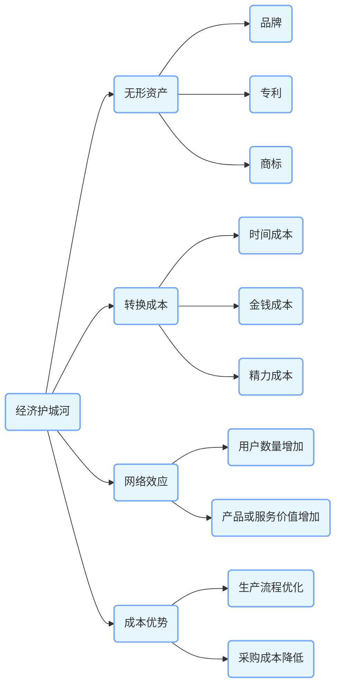

# 巴菲特的经济护城河：持久竞争优势的重要性

> 关键词：巴菲特、经济护城河、持久竞争优势、企业价值、投资分析

> 摘要：本文深入探讨了巴菲特所提出的“经济护城河”概念，即企业的持久竞争优势。详细阐述了经济护城河的核心概念、形成原理，通过数学模型和公式对其进行量化分析，结合实际案例展示了如何在项目实战中识别和评估经济护城河。同时，介绍了经济护城河在不同实际应用场景中的体现，推荐了相关的学习资源、开发工具和论文著作。最后，总结了经济护城河的未来发展趋势与挑战，并对常见问题进行了解答。旨在帮助投资者和企业管理者更好地理解和运用经济护城河理论，做出更明智的决策。

## 1. 背景介绍 
### 1.1 目的和范围
本文的目的是全面解析巴菲特的经济护城河理论，深入探讨持久竞争优势对于企业和投资者的重要性。我们将从理论基础出发，介绍经济护城河的核心概念、形成原理和评估方法，通过实际案例展示如何在投资和企业管理中应用这一理论。范围涵盖了经济护城河的各个方面，包括不同类型的护城河、数学模型分析、项目实战以及未来发展趋势等。

### 1.2 预期读者
本文预期读者包括投资者、企业管理者、金融分析师、经济学爱好者以及对巴菲特投资理念感兴趣的人群。无论您是专业人士还是初学者，都能从本文中获得对经济护城河的深入理解和实际应用的启示。

### 1.3 文档结构概述
本文将按照以下结构进行阐述：首先介绍经济护城河的背景和相关术语，接着详细讲解核心概念与联系，包括其原理和架构的文本示意图以及 Mermaid 流程图。然后深入探讨核心算法原理和具体操作步骤，并通过 Python 代码进行详细阐述。之后，运用数学模型和公式对经济护城河进行量化分析，并举例说明。在项目实战部分，将展示代码实际案例并进行详细解释。随后介绍经济护城河的实际应用场景，推荐相关的工具和资源。最后，总结未来发展趋势与挑战，解答常见问题，并提供扩展阅读和参考资料。

### 1.4 术语表
#### 1.4.1 核心术语定义
- **经济护城河**：由巴菲特提出，指企业所拥有的能够使其在长期内保持竞争优势，抵御竞争对手的侵蚀，从而获得超额利润的一种结构性优势。
- **持久竞争优势**：企业在较长时间内相对于竞争对手所具备的优势，这种优势能够持续保持并为企业带来稳定的收益。
- **无形资产**：企业拥有的不具有实物形态的资产，如品牌、专利、商标等，这些资产能够为企业带来竞争优势。
- **转换成本**：客户从一个产品或服务转换到另一个产品或服务时所面临的成本，包括时间、金钱、精力等方面的成本。
- **网络效应**：随着用户数量的增加，产品或服务的价值也随之增加的现象，这种效应能够形成强大的竞争壁垒。

#### 1.4.2 相关概念解释
- **超额利润**：企业在扣除所有成本（包括正常利润）后所获得的额外利润，经济护城河能够帮助企业长期获得超额利润。
- **竞争壁垒**：阻止竞争对手进入市场或在市场中获得优势的因素，经济护城河是一种重要的竞争壁垒。
- **可持续性**：企业的竞争优势能够在较长时间内持续存在，不受外部环境变化的影响。

#### 1.4.3 缩略词列表
- **ROE**：净资产收益率（Return on Equity），衡量企业盈利能力的重要指标。
- **EBITDA**：息税折旧摊销前利润（Earnings Before Interest, Taxes, Depreciation, and Amortization），反映企业经营业绩的指标。

## 2. 核心概念与联系 

### 核心概念原理
经济护城河的核心原理在于企业通过建立某种独特的优势，使其在市场竞争中能够长期保持领先地位，从而获得高于行业平均水平的利润。这种优势可以来自多个方面，如无形资产、转换成本、网络效应、成本优势等。

无形资产是经济护城河的重要组成部分。品牌是一种强大的无形资产，它能够让消费者对企业的产品或服务产生信任和偏好，从而愿意支付更高的价格。例如，可口可乐的品牌价值极高，消费者在选择饮料时往往会优先考虑可口可乐，即使其他品牌的饮料价格更低。专利和商标则为企业提供了法律保护，防止竞争对手模仿其产品或技术，从而保持竞争优势。

转换成本也是经济护城河的重要因素。当客户从一个产品或服务转换到另一个产品或服务时，如果面临较高的成本，他们就会更倾向于继续使用现有的产品或服务。例如，企业使用的办公软件系统，一旦员工熟悉了某种软件，更换软件就需要重新培训员工，这会带来时间和成本的增加，因此企业通常会继续使用现有的软件。

网络效应是一种特殊的竞争优势，它使得产品或服务的价值随着用户数量的增加而增加。例如，社交媒体平台如 Facebook，随着用户数量的不断增加，其对新用户的吸引力也越来越大，因为用户可以在平台上与更多的人交流和互动。这种网络效应形成了强大的竞争壁垒，使得新的竞争对手很难进入市场。

成本优势也是经济护城河的一种形式。企业通过优化生产流程、降低采购成本等方式，能够以更低的成本生产产品或提供服务，从而在价格上具有竞争力。例如，沃尔玛通过大规模采购和高效的物流管理，实现了较低的运营成本，使其能够以低价销售商品，吸引了大量的消费者。

### 架构的文本示意图
```plaintext
经济护城河
|-- 无形资产
|   |-- 品牌
|   |-- 专利
|   |-- 商标
|-- 转换成本
|   |-- 时间成本
|   |-- 金钱成本
|   |-- 精力成本
|-- 网络效应
|   |-- 用户数量增加
|   |-- 产品或服务价值增加
|-- 成本优势
|   |-- 生产流程优化
|   |-- 采购成本降低
```

### Mermaid 流程图


## 3. 核心算法原理 & 具体操作步骤 

### 核心算法原理
在评估经济护城河时，我们可以使用一些财务指标来量化企业的竞争优势。其中，净资产收益率（ROE）是一个重要的指标，它反映了企业运用自有资本的效率。一般来说，具有经济护城河的企业能够长期保持较高的 ROE。

另一个重要的指标是息税折旧摊销前利润（EBITDA），它可以反映企业的经营业绩。通过比较企业的 EBITDA 与行业平均水平，我们可以判断企业是否具有竞争优势。

### 具体操作步骤
1. **收集财务数据**：收集企业的财务报表，包括资产负债表、利润表和现金流量表，获取 ROE 和 EBITDA 等相关数据。
2. **计算 ROE**：ROE 的计算公式为：$ROE = \frac{净利润}{净资产} \times 100\%$。
3. **计算 EBITDA**：EBITDA 的计算公式为：$EBITDA = 净利润 + 利息 + 所得税 + 折旧 + 摊销$。
4. **比较分析**：将企业的 ROE 和 EBITDA 与行业平均水平进行比较，如果企业的 ROE 和 EBITDA 长期高于行业平均水平，则说明企业可能具有经济护城河。

### Python 源代码详细阐述
```python
import pandas as pd

# 示例财务数据
financial_data = {
    '年份': [2018, 2019, 2020, 2021, 2022],
    '净利润': [100, 120, 150, 180, 200],
    '净资产': [500, 550, 600, 650, 700],
    '利息': [20, 22, 25, 28, 30],
    '所得税': [30, 35, 40, 45, 50],
    '折旧': [10, 12, 15, 18, 20],
    '摊销': [5, 6, 7, 8, 9]
}

df = pd.DataFrame(financial_data)

# 计算 ROE
df['ROE'] = (df['净利润'] / df['净资产']) * 100

# 计算 EBITDA
df['EBITDA'] = df['净利润'] + df['利息'] + df['所得税'] + df['折旧'] + df['摊销']

# 打印结果
print(df[['年份', 'ROE', 'EBITDA']])
```

在上述代码中，我们首先创建了一个包含企业财务数据的 DataFrame，然后计算了 ROE 和 EBITDA，并将结果打印输出。通过分析这些数据，我们可以对企业的经济护城河进行初步评估。

## 4. 数学模型和公式 & 详细讲解 & 举例说明 

### 数学模型和公式
#### ROE 模型
$ROE = \frac{净利润}{净资产} \times 100\%$

ROE 反映了企业运用自有资本的效率，是衡量企业盈利能力的重要指标。具有经济护城河的企业通常能够长期保持较高的 ROE，因为它们能够在竞争中获得超额利润。

#### EBITDA 模型
$EBITDA = 净利润 + 利息 + 所得税 + 折旧 + 摊销$

EBITDA 可以反映企业的经营业绩，排除了利息、所得税、折旧和摊销等因素的影响，更能体现企业的核心盈利能力。

#### 经济护城河评估模型
我们可以使用以下公式来评估企业的经济护城河：

$经济护城河指数 = \frac{ROE_{企业}}{ROE_{行业平均}} \times \frac{EBITDA_{企业}}{EBITDA_{行业平均}}$

如果经济护城河指数大于 1，则说明企业的竞争优势高于行业平均水平；如果指数小于 1，则说明企业的竞争优势较弱。

### 详细讲解
ROE 模型通过计算净利润与净资产的比值，反映了企业每单位净资产所创造的利润。较高的 ROE 意味着企业能够更有效地利用自有资本，具有更强的盈利能力。

EBITDA 模型通过将净利润、利息、所得税、折旧和摊销相加，得到企业在扣除这些非经营性因素之前的利润。EBITDA 可以更准确地反映企业的经营业绩，因为它排除了不同企业在融资结构、税收政策和资产折旧等方面的差异。

经济护城河评估模型综合考虑了 ROE 和 EBITDA 两个指标，通过将企业的指标与行业平均水平进行比较，得出企业的经济护城河指数。这个指数可以帮助我们直观地判断企业的竞争优势强弱。

### 举例说明
假设某行业的平均 ROE 为 15%，平均 EBITDA 为 500 万元。某企业的 ROE 为 20%，EBITDA 为 600 万元。则该企业的经济护城河指数为：

$经济护城河指数 = \frac{20\%}{15\%} \times \frac{600}{500} = \frac{4}{3} \times \frac{6}{5} = \frac{8}{5} = 1.6$

由于经济护城河指数大于 1，说明该企业的竞争优势高于行业平均水平，具有较强的经济护城河。

## 5. 项目实战：代码实际案例和详细解释说明 

### 5.1  开发环境搭建
为了进行经济护城河的评估，我们需要搭建一个 Python 开发环境。以下是具体的步骤：

1. **安装 Python**：从 Python 官方网站（https://www.python.org/downloads/）下载并安装 Python 3.x 版本。
2. **安装必要的库**：使用以下命令安装 Pandas 和 Numpy 库：
```sh
pip install pandas numpy
```

### 5.2  源代码详细实现和代码解读
```python
import pandas as pd
import numpy as np

# 假设我们有多个企业的财务数据
financial_data = {
    '企业名称': ['企业 A', '企业 B', '企业 C'],
    'ROE': [20, 15, 12],
    'EBITDA': [600, 500, 400],
    '行业平均 ROE': [15, 15, 15],
    '行业平均 EBITDA': [500, 500, 500]
}

df = pd.DataFrame(financial_data)

# 计算经济护城河指数
df['经济护城河指数'] = (df['ROE'] / df['行业平均 ROE']) * (df['EBITDA'] / df['行业平均 EBITDA'])

# 输出结果
print(df[['企业名称', '经济护城河指数']])
```

### 代码解读与分析
1. **数据准备**：我们创建了一个包含多个企业财务数据的字典，并将其转换为 Pandas 的 DataFrame。数据包括企业名称、ROE、EBITDA、行业平均 ROE 和行业平均 EBITDA。
2. **计算经济护城河指数**：使用前面介绍的经济护城河评估模型，计算每个企业的经济护城河指数，并将结果添加到 DataFrame 中。
3. **输出结果**：打印出每个企业的名称和经济护城河指数，以便我们进行比较和分析。

通过这个代码案例，我们可以快速评估多个企业的经济护城河情况，为投资决策提供参考。

## 6. 实际应用场景 
### 投资领域
在投资领域，经济护城河理论可以帮助投资者筛选出具有长期竞争优势的企业。投资者可以通过分析企业的经济护城河，选择那些具有较高 ROE 和 EBITDA、经济护城河指数大于 1 的企业进行投资。这些企业通常能够在市场竞争中保持领先地位，为投资者带来稳定的回报。

例如，巴菲特在投资可口可乐时，就看中了可口可乐强大的品牌优势，这是一种重要的经济护城河。可口可乐的品牌价值使得它在饮料市场中具有很高的知名度和美誉度，消费者愿意为其产品支付更高的价格，从而为企业带来了超额利润。

### 企业战略规划
对于企业管理者来说，经济护城河理论可以帮助他们制定企业战略。企业可以通过建立和强化自身的经济护城河，提高企业的竞争力。例如，企业可以通过研发投入来获得更多的专利，加强品牌建设来提升品牌价值，优化生产流程来降低成本等。

以苹果公司为例，苹果通过不断创新和强大的品牌建设，建立了深厚的经济护城河。苹果的产品具有独特的设计和高性能，吸引了大量的消费者。同时，苹果的品牌价值极高，消费者对苹果产品具有很高的忠诚度，这使得苹果在智能手机市场中占据了领先地位。

### 行业竞争分析
经济护城河理论还可以用于行业竞争分析。通过比较不同企业的经济护城河指数，我们可以了解行业内企业的竞争格局。那些经济护城河指数较高的企业通常具有更强的竞争优势，能够在行业中占据主导地位。

例如，在电商行业中，阿里巴巴和京东具有较强的经济护城河。阿里巴巴通过强大的网络效应和平台优势，吸引了大量的商家和消费者；京东则通过高效的物流配送和优质的服务，赢得了消费者的信任。相比之下，一些小型电商企业由于缺乏经济护城河，在市场竞争中面临较大的压力。

## 7. 工具和资源推荐
### 7.1 学习资源推荐
#### 7.1.1 书籍推荐
- 《巴菲特之道》（The Warren Buffett Way）：这本书详细介绍了巴菲特的投资理念和方法，包括经济护城河理论的应用。
- 《竞争优势：透视企业护城河》（The Little Book That Builds Wealth: The Knockout Formula for Finding Great Investments）：深入探讨了经济护城河的概念和评估方法。
- 《财务报表分析与证券定价》（Financial Statement Analysis and Security Valuation）：帮助读者学习如何通过财务报表分析来评估企业的经济护城河。

#### 7.1.2 在线课程
- Coursera 上的“投资学原理”（Principles of Investment）：该课程涵盖了投资分析的基本原理，包括对企业竞争优势的评估。
- edX 上的“财务报表分析”（Financial Statement Analysis）：教授如何解读财务报表，识别企业的经济护城河。

#### 7.1.3 技术博客和网站
- Seeking Alpha：提供了大量的投资分析文章和研究报告，包括对企业经济护城河的分析。
- Motley Fool：是一个知名的投资网站，提供投资建议和企业分析，有助于了解经济护城河在投资中的应用。

### 7.2 开发工具框架推荐
#### 7.2.1 IDE和编辑器
- PyCharm：是一款专业的 Python 集成开发环境，提供了丰富的功能和插件，方便进行数据分析和代码开发。
- Jupyter Notebook：是一个交互式的开发环境，适合进行数据探索和分析，能够直观地展示代码和结果。

#### 7.2.2 调试和性能分析工具
- PDB：Python 自带的调试工具，用于调试 Python 代码，帮助开发者找出代码中的错误。
- cProfile：Python 标准库中的性能分析工具，用于分析代码的性能瓶颈。

#### 7.2.3 相关框架和库
- Pandas：是一个强大的数据分析库，提供了丰富的数据结构和数据处理方法，方便进行财务数据的分析和处理。
- Numpy：是 Python 中用于科学计算的基础库，提供了高效的数组操作和数学函数，支持经济护城河评估中的数值计算。

### 7.3 相关论文著作推荐
#### 7.3.1 经典论文
- “The Economic Moat: A Framework for Evaluating Competitive Advantage”：该论文系统地阐述了经济护城河的概念和评估框架。
- “Competitive Advantage and the Theory of the Firm”：探讨了企业竞争优势的理论基础，为经济护城河理论提供了理论支持。

#### 7.3.2 最新研究成果
- 关注顶级学术期刊如《Journal of Finance》《Review of Financial Studies》等，这些期刊上经常发表关于企业竞争优势和投资分析的最新研究成果。
- 参加金融学术会议，如美国金融协会（AFA）年会，了解经济护城河领域的最新研究动态。

#### 7.3.3 应用案例分析
- 研究机构如麦肯锡、波士顿咨询集团等发布的行业研究报告，其中包含了大量企业竞争优势和经济护城河的应用案例分析。
- 上市公司的年报和招股说明书，这些文档中通常会对企业的竞争优势进行详细阐述，是了解经济护城河实际应用的重要资料。

## 8. 总结：未来发展趋势与挑战
### 未来发展趋势
- **数字化转型带来新的经济护城河**：随着数字化时代的到来，企业通过数字化转型可以建立新的经济护城河。例如，大数据分析、人工智能等技术的应用可以帮助企业更好地了解消费者需求，优化产品和服务，提高客户满意度和忠诚度。
- **可持续发展成为重要的竞争优势**：消费者对可持续发展的关注度不断提高，企业在环境保护、社会责任等方面的表现将成为重要的竞争优势。具有良好可持续发展记录的企业将更容易获得消费者的信任和支持，从而建立起经济护城河。
- **行业融合加剧，经济护城河的边界变得模糊**：不同行业之间的融合越来越频繁，企业的竞争不再局限于传统的行业边界。例如，科技公司与金融公司的融合，使得企业需要建立更加多元化的经济护城河，以应对来自不同领域的竞争。

### 挑战
- **技术变革带来的不确定性**：快速的技术变革可能会使企业现有的经济护城河失去作用。例如，新兴技术的出现可能会颠覆传统行业的商业模式，使得具有传统经济护城河的企业面临巨大的挑战。
- **竞争加剧，维持经济护城河的难度增加**：随着市场竞争的加剧，企业需要不断投入资源来维持和强化自身的经济护城河。同时，竞争对手也在不断寻找突破企业经济护城河的方法，这使得企业维持经济护城河的难度越来越大。
- **数据安全和隐私问题**：在数字化时代，企业的经济护城河往往依赖于大量的数据和信息。然而，数据安全和隐私问题也日益突出，如果企业不能有效地保护用户数据，可能会导致用户信任度下降，从而削弱企业的经济护城河。

## 9. 附录：常见问题与解答
### 问题 1：如何判断企业的经济护城河是否可持续？
解答：判断企业经济护城河的可持续性需要综合考虑多个因素。首先，要分析企业的竞争优势来源，如无形资产、转换成本、网络效应等是否具有长期稳定性。其次，关注行业的发展趋势和技术变革，评估企业的经济护城河是否能够抵御这些变化。此外，还可以通过分析企业的财务指标，如 ROE 和 EBITDA 的长期稳定性，来判断经济护城河的可持续性。

### 问题 2：经济护城河与企业的市场份额有什么关系？
解答：经济护城河和企业的市场份额有一定的关联，但并不完全等同。具有经济护城河的企业通常能够在市场中获得较高的市场份额，因为它们的竞争优势能够帮助它们吸引更多的客户。然而，市场份额高并不一定意味着企业具有经济护城河。有些企业可能通过低价策略或短期的营销活动获得了较高的市场份额，但缺乏可持续的竞争优势，一旦竞争对手采取类似的策略，它们的市场份额可能会迅速下降。

### 问题 3：经济护城河理论是否适用于所有行业？
解答：经济护城河理论适用于大多数行业，但不同行业的经济护城河形式可能有所不同。例如，在科技行业，技术创新和专利可能是重要的经济护城河；在消费品行业，品牌和渠道优势可能更为关键。在一些新兴行业，如共享经济和区块链，可能需要重新定义经济护城河的概念，因为这些行业的商业模式和竞争格局与传统行业有所不同。

## 10. 扩展阅读 & 参考资料
- 巴菲特历年致股东的信，可在伯克希尔·哈撒韦公司官方网站（https://www.berkshirehathaway.com/）上查阅。
- 晨星公司（Morningstar）的研究报告，晨星公司是一家专业的投资研究机构，提供了大量关于企业经济护城河的分析和评级。
- 《哈佛商业评论》（Harvard Business Review）上的相关文章，该杂志经常发表关于企业战略和竞争优势的前沿研究。

作者：AI天才研究院/AI Genius Institute & 禅与计算机程序设计艺术 /Zen And The Art of Computer Programming