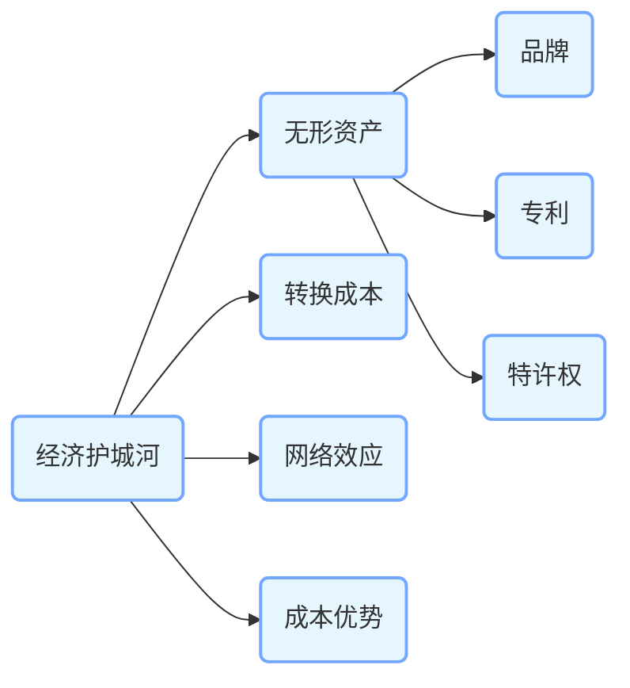

# 巴菲特的经济护城河：持久竞争优势的重要性

> 关键词：巴菲特、经济护城河、持久竞争优势、企业价值、投资策略

> 摘要：本文深入探讨了巴菲特所提出的“经济护城河”概念，即企业的持久竞争优势。详细阐述了经济护城河的核心概念、形成原理、不同类型，通过数学模型分析其对企业价值的影响，并结合实际案例展示了经济护城河在企业运营和投资决策中的重要作用。同时，介绍了与经济护城河相关的学习资源、开发工具和研究论文，最后总结了经济护城河的未来发展趋势与挑战，旨在帮助读者全面理解经济护城河的重要性以及如何在实际中运用这一概念。

## 1. 背景介绍 
### 1.1 目的和范围
本文旨在全面解析巴菲特提出的“经济护城河”这一概念，深入探讨持久竞争优势对企业的重要性。我们将从理论层面剖析经济护城河的核心原理、类型和形成机制，通过数学模型分析其对企业价值的量化影响。同时，结合实际案例展示经济护城河在企业运营和投资领域的具体应用。范围涵盖了经济护城河的各个方面，包括其在不同行业的体现、对企业长期发展的作用以及在投资决策中的参考价值。

### 1.2 预期读者
本文适合对投资领域感兴趣的人士，包括个人投资者、金融从业者等。同时，企业管理者和创业者也能从本文中获得启发，了解如何构建和维护企业的持久竞争优势。对于学术研究人员，本文提供了关于经济护城河的系统分析和相关数学模型，可作为进一步研究的参考。

### 1.3 文档结构概述
本文首先介绍了经济护城河的背景信息，包括目的、预期读者和文档结构。接着阐述了核心概念与联系，包括经济护城河的定义、原理和不同类型，并通过文本示意图和Mermaid流程图进行展示。然后详细讲解了核心算法原理和具体操作步骤，使用Python源代码进行说明。之后介绍了数学模型和公式，并结合实例进行讲解。在项目实战部分，给出了代码实际案例和详细解释。接着探讨了经济护城河的实际应用场景。随后推荐了相关的学习资源、开发工具和研究论文。最后总结了未来发展趋势与挑战，并提供了常见问题解答和扩展阅读参考资料。

### 1.4 术语表
#### 1.4.1 核心术语定义
- **经济护城河**：指企业所拥有的一种可持续的竞争优势，能够保护企业免受竞争对手的侵蚀，使其在长期内保持盈利和市场地位。
- **持久竞争优势**：与经济护城河同义，强调这种优势具有长期性和稳定性，能够使企业在市场中持续获得超额利润。
- **无形资产**：包括品牌、专利、特许权等，是企业经济护城河的重要组成部分，能够为企业带来独特的竞争优势。
- **转换成本**：指客户从一个产品或服务转换到另一个产品或服务时所面临的成本，包括时间、金钱、精力等方面的成本。
- **网络效应**：指产品或服务的价值随着用户数量的增加而增加的现象，是一种强大的经济护城河。

#### 1.4.2 相关概念解释
- **企业价值**：指企业未来现金流量的现值，经济护城河能够提高企业的盈利能力和现金流稳定性，从而增加企业价值。
- **投资回报率**：指投资所获得的收益与投资成本的比率，具有经济护城河的企业往往能够提供更高的投资回报率。
- **市场份额**：指企业在市场中所占的份额，经济护城河有助于企业维持或扩大市场份额。

#### 1.4.3 缩略词列表
- **ROE**：Return on Equity，净资产收益率，衡量企业盈利能力的重要指标。
- **DCF**：Discounted Cash Flow，现金流折现法，用于评估企业价值的一种方法。

## 2. 核心概念与联系 

### 核心概念原理
巴菲特的经济护城河概念源于他对企业长期竞争优势的深入研究。他认为，具有经济护城河的企业就像拥有一条保护城堡的护城河，能够抵御竞争对手的攻击，从而在市场中持续生存和发展。经济护城河的核心原理在于企业通过建立某种独特的竞争优势，使得竞争对手难以模仿或超越，从而实现长期的盈利和增长。

经济护城河主要有以下几种类型：
1. **无形资产**：品牌、专利和特许权等无形资产是企业经济护城河的重要来源。例如，可口可乐的品牌价值极高，消费者对其产品具有高度的认同感和忠诚度，这使得可口可乐在饮料市场中具有强大的竞争优势。专利则可以保护企业的技术创新，防止竞争对手模仿，如制药企业凭借专利可以在一定时期内独占市场。特许权是政府或其他机构授予企业的特殊权利，如公用事业公司的特许经营权，使其在特定领域具有垄断地位。
2. **转换成本**：当客户从一个产品或服务转换到另一个产品或服务时，需要付出一定的成本，这就是转换成本。例如，企业使用的办公软件系统，一旦更换会涉及到员工培训、数据迁移等成本，因此客户通常不愿意轻易更换。转换成本越高，客户的忠诚度就越高，企业的竞争优势也就越明显。
3. **网络效应**：网络效应是指产品或服务的价值随着用户数量的增加而增加的现象。例如，社交媒体平台，用户越多，平台上的信息就越丰富，对新用户的吸引力也就越大。网络效应一旦形成，就会形成强大的壁垒，使得新进入者难以与之竞争。
4. **成本优势**：企业通过降低成本来获得竞争优势，例如通过规模经济、独特的生产工艺或低成本的原材料采购等方式。沃尔玛就是通过大规模采购和高效的供应链管理，实现了低成本运营，从而在零售市场中占据了领先地位。

### 架构的文本示意图
```plaintext
经济护城河
|-- 无形资产
|   |-- 品牌
|   |-- 专利
|   |-- 特许权
|-- 转换成本
|-- 网络效应
|-- 成本优势
```

### Mermaid 流程图


## 3. 核心算法原理 & 具体操作步骤 

### 核心算法原理
在评估企业的经济护城河时，我们可以使用一些财务指标和分析方法。其中，现金流折现法（DCF）是一种常用的方法，用于评估企业的内在价值。DCF的基本原理是将企业未来的现金流量折现到当前，以确定企业的现值。

DCF的公式为：
$$V = \sum_{t=1}^{n} \frac{CF_t}{(1 + r)^t}$$
其中，$V$ 表示企业的现值，$CF_t$ 表示第 $t$ 期的现金流量，$r$ 表示折现率，$n$ 表示预测期数。

具有经济护城河的企业通常具有更稳定和持续的现金流量，因此其折现后的现值也更高。我们可以通过比较不同企业的DCF值来评估它们的经济护城河强弱。

### 具体操作步骤
以下是使用Python实现DCF方法评估企业价值的具体步骤：

```python
import numpy as np

def dcf_evaluation(cash_flows, discount_rate):
    """
    计算企业的现金流折现价值
    :param cash_flows: 未来各期的现金流量列表
    :param discount_rate: 折现率
    :return: 企业的现值
    """
    n = len(cash_flows)
    present_values = []
    for t in range(n):
        present_value = cash_flows[t] / ((1 + discount_rate) ** (t + 1))
        present_values.append(present_value)
    return np.sum(present_values)

# 示例数据
cash_flows = [100, 120, 130, 140, 150]  # 未来5年的现金流量
discount_rate = 0.1  # 折现率为10%

# 计算企业的现值
value = dcf_evaluation(cash_flows, discount_rate)
print(f"企业的现值为: {value}")
```

### 代码解释
1. **定义函数 `dcf_evaluation`**：该函数接受两个参数，`cash_flows` 表示未来各期的现金流量列表，`discount_rate` 表示折现率。函数内部通过循环计算每一期现金流量的现值，并将其累加到 `present_values` 列表中。最后，使用 `np.sum` 函数计算所有现值的总和，即企业的现值。
2. **示例数据**：我们定义了一个包含未来5年现金流量的列表 `cash_flows` 和折现率 `discount_rate`。
3. **调用函数并输出结果**：调用 `dcf_evaluation` 函数计算企业的现值，并将结果打印输出。

## 4. 数学模型和公式 & 详细讲解 & 举例说明 

### 数学模型和公式
除了DCF模型，我们还可以使用净资产收益率（ROE）来评估企业的盈利能力和经济护城河。ROE的计算公式为：
$$ROE = \frac{净利润}{净资产}$$

ROE反映了企业利用自有资本获取利润的能力，具有经济护城河的企业通常能够保持较高的ROE水平。我们可以通过分析企业的ROE历史数据和趋势，来判断其经济护城河的强弱。

### 详细讲解
ROE是一个综合性的指标，它受到多个因素的影响，包括销售净利率、总资产周转率和权益乘数。具体关系可以通过杜邦分析来表示：
$$ROE = 销售净利率 \times 总资产周转率 \times 权益乘数$$
其中，销售净利率反映了企业的盈利能力，总资产周转率反映了企业的资产运营效率，权益乘数反映了企业的财务杠杆水平。

具有经济护城河的企业通常在至少一个方面具有优势。例如，品牌强大的企业可能具有较高的销售净利率，因为消费者愿意为其品牌支付更高的价格；具有成本优势的企业可能具有较高的总资产周转率，因为其能够更高效地利用资产；而合理利用财务杠杆的企业可能具有较高的权益乘数。

### 举例说明
假设企业A和企业B在同一行业，以下是它们的财务数据：

| 企业 | 净利润（万元） | 净资产（万元） | 销售收入（万元） | 总资产（万元） | 负债（万元） |
| ---- | ---- | ---- | ---- | ---- | ---- |
| A | 1000 | 5000 | 5000 | 10000 | 5000 |
| B | 800 | 4000 | 4000 | 8000 | 4000 |

首先，计算两家企业的ROE：
- 企业A的ROE：$ROE_A = \frac{1000}{5000} = 0.2 = 20\%$
- 企业B的ROE：$ROE_B = \frac{800}{4000} = 0.2 = 20\%$

虽然两家企业的ROE相同，但我们可以进一步通过杜邦分析来比较它们的竞争力。

计算销售净利率、总资产周转率和权益乘数：
- 企业A：
  - 销售净利率：$\frac{1000}{5000} = 0.2 = 20\%$
  - 总资产周转率：$\frac{5000}{10000} = 0.5$
  - 权益乘数：$\frac{10000}{5000} = 2$
- 企业B：
  - 销售净利率：$\frac{800}{4000} = 0.2 = 20\%$
  - 总资产周转率：$\frac{4000}{8000} = 0.5$
  - 权益乘数：$\frac{8000}{4000} = 2$

从杜邦分析结果来看，两家企业在盈利能力、资产运营效率和财务杠杆方面表现相似。但如果进一步分析企业A具有强大的品牌，能够在市场中保持较高的市场份额和定价权，那么企业A可能具有更明显的经济护城河。

## 5. 项目实战：代码实际案例和详细解释说明 

### 5.1  开发环境搭建
为了实现对企业经济护城河的评估，我们可以使用Python进行开发。以下是搭建开发环境的步骤：
1. **安装Python**：从Python官方网站（https://www.python.org/downloads/）下载并安装Python 3.x版本。
2. **安装必要的库**：我们需要安装 `numpy` 和 `pandas` 库，用于数据处理和分析。可以使用以下命令进行安装：
```sh
pip install numpy pandas
```

### 5.2  源代码详细实现和代码解读
以下是一个完整的Python代码示例，用于评估企业的经济护城河：

```python
import pandas as pd
import numpy as np

def calculate_roe(net_income, net_assets):
    """
    计算净资产收益率（ROE）
    :param net_income: 净利润
    :param net_assets: 净资产
    :return: ROE
    """
    return net_income / net_assets

def dcf_evaluation(cash_flows, discount_rate):
    """
    计算企业的现金流折现价值
    :param cash_flows: 未来各期的现金流量列表
    :param discount_rate: 折现率
    :return: 企业的现值
    """
    n = len(cash_flows)
    present_values = []
    for t in range(n):
        present_value = cash_flows[t] / ((1 + discount_rate) ** (t + 1))
        present_values.append(present_value)
    return np.sum(present_values)

# 示例数据
data = {
    '企业名称': ['企业A', '企业B'],
    '净利润': [1000, 800],
    '净资产': [5000, 4000],
    '未来现金流量': [[100, 120, 130, 140, 150], [80, 90, 100, 110, 120]]
}
df = pd.DataFrame(data)

# 计算ROE
df['ROE'] = df.apply(lambda row: calculate_roe(row['净利润'], row['净资产']), axis=1)

# 计算DCF值
discount_rate = 0.1
df['DCF值'] = df['未来现金流量'].apply(lambda x: dcf_evaluation(x, discount_rate))

# 输出结果
print(df)
```

### 代码解读与分析
1. **定义函数**：
   - `calculate_roe` 函数用于计算企业的净资产收益率，接受净利润和净资产作为输入参数，返回ROE值。
   - `dcf_evaluation` 函数用于计算企业的现金流折现价值，接受未来各期的现金流量列表和折现率作为输入参数，返回企业的现值。
2. **创建示例数据**：使用字典 `data` 存储企业的相关信息，包括企业名称、净利润、净资产和未来现金流量。然后使用 `pandas` 的 `DataFrame` 函数将数据转换为表格形式。
3. **计算ROE和DCF值**：
   - 使用 `apply` 方法调用 `calculate_roe` 函数，计算每个企业的ROE，并将结果添加到 `DataFrame` 中。
   - 使用 `apply` 方法调用 `dcf_evaluation` 函数，计算每个企业的DCF值，并将结果添加到 `DataFrame` 中。
4. **输出结果**：打印 `DataFrame`，显示每个企业的ROE和DCF值，以便进行比较和分析。

通过这个示例，我们可以看到如何使用Python代码来评估企业的经济护城河，通过ROE和DCF值等指标来判断企业的盈利能力和内在价值。

## 6. 实际应用场景 
### 投资领域
在投资领域，经济护城河是投资者评估企业价值和投资潜力的重要依据。具有经济护城河的企业通常具有更稳定的盈利能力和现金流，能够在市场波动中保持较好的表现。投资者可以通过分析企业的经济护城河类型和强弱，选择具有长期投资价值的企业。例如，巴菲特在投资可口可乐时，看中了其强大的品牌优势，认为这是可口可乐的经济护城河，能够使其在饮料市场中持续获得高额利润。

### 企业战略规划
对于企业管理者来说，了解经济护城河的概念有助于制定企业的战略规划。企业可以通过构建和强化自身的经济护城河，提高企业的竞争力和市场地位。例如，企业可以通过加大研发投入来获得更多的专利，提升产品的技术含量；通过优化供应链管理来降低成本，形成成本优势；通过加强品牌建设来提高品牌知名度和美誉度，增强品牌的竞争力。

### 行业分析
经济护城河的概念也可以用于行业分析。不同行业的经济护城河类型和强弱可能存在差异。例如，在科技行业，专利和技术创新是重要的经济护城河；在消费行业，品牌和转换成本则更为关键。通过分析行业内企业的经济护城河情况，可以了解行业的竞争格局和发展趋势，为企业的战略决策提供参考。

## 7. 工具和资源推荐
### 7.1 学习资源推荐
#### 7.1.1 书籍推荐
- 《巴菲特的护城河》：这本书详细介绍了巴菲特的经济护城河概念，通过大量的案例分析了不同类型的经济护城河及其对企业价值的影响，是学习经济护城河的经典书籍。
- 《聪明的投资者》：巴菲特的导师格雷厄姆所著，书中阐述了价值投资的理念和方法，对理解经济护城河在投资中的应用具有重要的指导意义。
- 《竞争优势：透视企业护城河》：深入探讨了企业竞争优势的来源和构建方法，与经济护城河的概念密切相关。

#### 7.1.2 在线课程
- Coursera上的“投资学原理”课程：该课程涵盖了投资领域的基本原理和方法，包括企业估值和经济护城河的分析。
- edX上的“金融市场”课程：提供了对金融市场的全面介绍，其中涉及到企业竞争优势和经济护城河的相关内容。

#### 7.1.3 技术博客和网站
- Seeking Alpha：一个知名的金融投资博客平台，上面有许多关于企业分析和经济护城河的文章。
- 雪球网：国内的投资交流社区，有大量的投资者分享对企业经济护城河的分析和看法。

### 7.2 开发工具框架推荐
#### 7.2.1 IDE和编辑器
- PyCharm：一款专业的Python集成开发环境，具有强大的代码编辑、调试和项目管理功能，适合进行Python数据分析和开发。
- Jupyter Notebook：一个交互式的开发环境，支持Python、R等多种编程语言，方便进行数据探索和分析。

#### 7.2.2 调试和性能分析工具
- pdb：Python自带的调试工具，可以帮助开发者定位和解决代码中的问题。
- cProfile：Python的性能分析工具，用于分析代码的运行时间和性能瓶颈。

#### 7.2.3 相关框架和库
- pandas：一个强大的数据处理和分析库，提供了丰富的数据结构和函数，方便进行财务数据的处理和分析。
- numpy：Python的数值计算库，提供了高效的数组操作和数学函数，用于实现DCF等数学模型。

### 7.3 相关论文著作推荐
#### 7.3.1 经典论文
- "The Theory of Industrial Organization" by Jean Tirole：这本书系统地介绍了产业组织理论，对企业竞争优势和市场结构进行了深入分析，与经济护城河的概念密切相关。
- "Competitive Strategy: Techniques for Analyzing Industries and Competitors" by Michael Porter：波特的经典著作，提出了五种竞争力模型和三种基本竞争战略，为分析企业的竞争优势提供了重要的理论框架。

#### 7.3.2 最新研究成果
- 可以关注《Journal of Financial Economics》《The Review of Financial Studies》等金融经济领域的顶级学术期刊，上面有许多关于企业价值评估和竞争优势的最新研究成果。

#### 7.3.3 应用案例分析
- 一些商业杂志如《哈佛商业评论》《麦肯锡季刊》会经常发表企业案例分析文章，其中不乏关于企业经济护城河的应用案例，可以从中学习企业如何构建和维护自己的竞争优势。

## 8. 总结：未来发展趋势与挑战
### 未来发展趋势
- **数字化转型带来新的经济护城河**：随着科技的不断发展，数字化转型成为企业发展的必然趋势。企业通过数字化技术可以构建新的经济护城河，如大数据、人工智能等技术可以帮助企业更好地了解客户需求，提供个性化的产品和服务，提高客户的转换成本。
- **可持续发展成为重要的经济护城河**：在全球关注可持续发展的背景下，企业的可持续发展能力将成为重要的经济护城河。具有良好环境、社会和治理（ESG）表现的企业将更受投资者和消费者的青睐，从而获得竞争优势。
- **跨界竞争加剧，经济护城河的边界模糊**：随着行业融合的加速，跨界竞争越来越激烈。企业的经济护城河不再局限于传统的行业边界，需要不断拓展和创新，以应对来自不同领域的竞争对手。

### 挑战
- **技术更新换代快，经济护城河易被打破**：在快速变化的科技环境下，企业的技术优势可能很快被竞争对手超越。例如，智能手机行业的技术更新换代非常快，如果企业不能及时跟上技术发展的步伐，其经济护城河可能会被打破。
- **消费者需求变化迅速，品牌忠诚度下降**：消费者的需求和偏好变化越来越快，品牌忠诚度逐渐下降。企业需要不断创新和改进产品和服务，以满足消费者的需求，否则品牌这一经济护城河可能会逐渐削弱。
- **监管政策变化带来不确定性**：监管政策的变化可能会对企业的经济护城河产生影响。例如，某些行业的监管政策收紧可能会限制企业的发展，降低其竞争优势。

## 9. 附录：常见问题与解答
### 问题1：如何判断企业的经济护城河是否持久？
解答：可以从以下几个方面进行判断：一是观察企业的竞争优势是否基于核心业务和关键资源，如品牌、技术等；二是分析企业所处行业的竞争格局和发展趋势，如果行业竞争激烈且变化快速，企业的经济护城河可能较难持久；三是关注企业的创新能力和适应能力，具有较强创新能力和适应能力的企业能够更好地应对市场变化，保持经济护城河的持久性。

### 问题2：经济护城河和企业的短期业绩有什么关系？
解答：经济护城河主要影响企业的长期盈利能力和市场地位，但对短期业绩也有一定的影响。具有经济护城河的企业在短期可能由于市场波动、宏观经济环境等因素出现业绩波动，但从长期来看，其经济护城河能够使其在市场中保持相对稳定的业绩。而没有经济护城河的企业，其短期业绩可能更容易受到竞争对手的冲击，波动较大。

### 问题3：如何构建企业的经济护城河？
解答：企业可以从以下几个方面构建经济护城河：一是加强品牌建设，提高品牌知名度和美誉度，增强品牌的竞争力；二是加大研发投入，获得更多的专利和技术创新，形成技术壁垒；三是优化供应链管理，降低成本，形成成本优势；四是提高客户服务质量，增加客户的转换成本，提高客户的忠诚度；五是利用网络效应，扩大用户群体，提高产品或服务的价值。

## 10. 扩展阅读 & 参考资料
### 扩展阅读
- 《价值投资实战手册》：进一步深入探讨了价值投资的理念和方法，与经济护城河的概念相结合，提供了更多的投资实践案例。
- 《创新者的窘境》：分析了企业在面对技术创新和市场变化时可能遇到的困境，对理解企业如何维护和拓展经济护城河具有重要的启示作用。

### 参考资料
- 巴菲特历年致股东的信，可从伯克希尔·哈撒韦公司官网获取，其中包含了巴菲特对经济护城河等投资理念的阐述和实践案例。
- 各大财经媒体和研究机构发布的企业研究报告，如券商的行业研究报告、咨询公司的企业竞争力分析报告等，为本文的案例分析和数据引用提供了参考。

作者：AI天才研究院/AI Genius Institute & 禅与计算机程序设计艺术 /Zen And The Art of Computer Programming