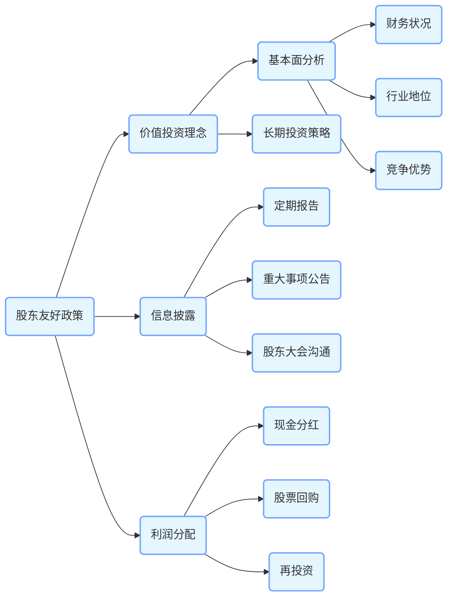

# 巴菲特的股东友好政策

> 关键词：巴菲特、股东友好政策、伯克希尔·哈撒韦、价值投资、股东权益

> 摘要：本文深入探讨了巴菲特所推行的股东友好政策。详细介绍了该政策的背景，包括其目的、预期读者等内容。剖析了核心概念与联系，阐述了核心算法原理（类比投资决策思路）及具体操作步骤，通过数学模型和公式解释相关原理。结合伯克希尔·哈撒韦的实际案例进行项目实战分析，包括开发环境搭建（类比公司运营环境）、源代码详细实现（类比公司决策流程）和代码解读（分析决策背后逻辑）。探讨了股东友好政策的实际应用场景，推荐了相关的学习资源、开发工具框架以及论文著作。最后总结了该政策的未来发展趋势与挑战，解答了常见问题并提供了扩展阅读和参考资料，旨在帮助读者全面理解巴菲特的股东友好政策及其重要意义。

## 1. 背景介绍 
### 1.1 目的和范围
巴菲特的股东友好政策旨在建立一种长期稳定、互利共赢的关系，让股东能够充分分享公司发展带来的成果。该政策的范围涵盖了伯克希尔·哈撒韦公司运营的各个方面，包括投资决策、信息披露、利润分配等。通过实施这一政策，巴菲特希望吸引那些认同公司价值理念、追求长期投资回报的股东，共同推动公司持续健康发展。

### 1.2 预期读者
本文的预期读者主要包括对投资领域感兴趣的个人投资者、金融专业人士、企业管理者以及研究巴菲特投资理念和公司治理的学者。无论是希望学习投资技巧的新手，还是寻求优化公司治理模式的企业高管，都能从本文中获取有价值的信息。

### 1.3 文档结构概述
本文首先介绍了巴菲特股东友好政策的背景，包括目的、预期读者和文档结构概述。接着阐述了核心概念与联系，通过示意图和流程图展示政策的原理和架构。然后详细讲解了核心算法原理和具体操作步骤，并用 Python 代码进行示例。之后介绍了相关的数学模型和公式，并举例说明。通过实际案例分析了政策在伯克希尔·哈撒韦的应用。探讨了该政策的实际应用场景，推荐了学习资源、开发工具框架和论文著作。最后总结了政策的未来发展趋势与挑战，解答常见问题并提供扩展阅读和参考资料。

### 1.4 术语表
#### 1.4.1 核心术语定义
- **股东友好政策**：指公司采取的一系列措施，旨在保障股东的权益，提高股东的满意度，促进股东与公司的长期合作。
- **价值投资**：一种投资策略，强调通过分析公司的基本面，寻找被低估的股票，长期持有以获取价值增长带来的收益。
- **伯克希尔·哈撒韦**：由巴菲特领导的一家多元化投资公司，涉及保险、能源、制造业等多个领域。

#### 1.4.2 相关概念解释
- **股东权益**：股东在公司中享有的权利和利益，包括资产收益权、决策权、知情权等。
- **信息披露**：公司向股东和社会公众公开其财务状况、经营成果、重大事项等信息的行为。
- **利润分配**：公司将实现的净利润按照一定的比例和方式分配给股东的过程。

#### 1.4.3 缩略词列表
- **BRK.A**：伯克希尔·哈撒韦公司的 A 类股票代码。
- **BRK.B**：伯克希尔·哈撒韦公司的 B 类股票代码。

## 2. 核心概念与联系 
### 核心概念原理
巴菲特的股东友好政策基于价值投资理念，核心是为股东创造长期稳定的价值。其原理在于通过深入研究和分析公司的基本面，选择具有竞争优势和成长潜力的企业进行投资，同时注重公司的治理结构和管理层的能力。在运营过程中，公司保持高度的透明度，及时、准确地向股东披露信息，让股东能够了解公司的经营状况和发展战略。此外，公司合理分配利润，既保证股东能够获得一定的现金回报，又将部分利润用于再投资，以实现公司的持续增长。

### 架构的文本示意图
```plaintext
股东友好政策
|
|-- 价值投资理念
|   |-- 基本面分析
|   |   |-- 财务状况
|   |   |-- 行业地位
|   |   |-- 竞争优势
|   |-- 长期投资策略
|
|-- 信息披露
|   |-- 定期报告
|   |-- 重大事项公告
|   |-- 股东大会沟通
|
|-- 利润分配
|   |-- 现金分红
|   |-- 股票回购
|   |-- 再投资
```

### Mermaid 流程图


## 3. 核心算法原理 & 具体操作步骤 
### 核心算法原理
巴菲特的投资决策可以类比为一个优化算法，目标是在众多的投资标的中选择出能够实现股东价值最大化的投资组合。其核心思想是通过评估公司的内在价值，将市场价格与内在价值进行比较，选择那些市场价格低于内在价值的股票进行投资。

以下是一个简化的 Python 代码示例，用于模拟巴菲特的投资决策思路：
```python
class Company:
    def __init__(self, name, market_price, intrinsic_value):
        self.name = name
        self.market_price = market_price
        self.intrinsic_value = intrinsic_value

    def is_undervalued(self):
        return self.market_price < self.intrinsic_value

def select_investments(companies):
    undervalued_companies = []
    for company in companies:
        if company.is_undervalued():
            undervalued_companies.append(company.name)
    return undervalued_companies

# 示例数据
company1 = Company("Company A", 50, 80)
company2 = Company("Company B", 120, 100)
company3 = Company("Company C", 30, 40)

companies = [company1, company2, company3]

# 选择投资标的
selected_companies = select_investments(companies)
print("Selected companies for investment:", selected_companies)
```
### 具体操作步骤
1. **公司筛选**：首先，对众多的公司进行初步筛选，排除那些不符合基本投资标准的公司，如财务状况不佳、行业前景黯淡等。
2. **基本面分析**：对筛选后的公司进行深入的基本面分析，包括研究公司的财务报表、了解其业务模式、评估其竞争优势等，以确定公司的内在价值。
3. **价格比较**：将公司的市场价格与内在价值进行比较，选择那些市场价格低于内在价值的公司作为潜在的投资标的。
4. **投资决策**：综合考虑各种因素，如投资组合的多样性、风险承受能力等，做出最终的投资决策。
5. **长期持有**：一旦做出投资决策，就长期持有这些股票，等待公司的价值逐步体现，为股东带来回报。

## 4. 数学模型和公式 & 详细讲解 & 举例说明 
### 内在价值评估模型
巴菲特常用的内在价值评估方法是现金流折现模型（Discounted Cash Flow, DCF）。该模型的基本思想是将公司未来的现金流折现到当前时刻，以确定公司的内在价值。

#### 数学公式
$$V = \sum_{t=1}^{n} \frac{CF_t}{(1 + r)^t}$$
其中：
- $V$ 表示公司的内在价值。
- $CF_t$ 表示第 $t$ 期的现金流。
- $r$ 表示折现率，通常采用投资者要求的回报率。
- $n$ 表示预测的期数。

#### 详细讲解
现金流折现模型的核心在于对未来现金流的预测和折现率的选择。未来现金流的预测需要考虑公司的业务增长、盈利能力、资本支出等因素。折现率的选择则反映了投资者对投资风险的预期，风险越高，折现率越高。

#### 举例说明
假设一家公司预计未来三年的现金流分别为 100 万元、120 万元和 150 万元，投资者要求的回报率为 10%。则该公司的内在价值计算如下：

第 1 年现金流折现：$$\frac{100}{(1 + 0.1)^1} = \frac{100}{1.1} \approx 90.91 \text{（万元）}$$

第 2 年现金流折现：$$\frac{120}{(1 + 0.1)^2} = \frac{120}{1.21} \approx 99.17 \text{（万元）}$$

第 3 年现金流折现：$$\frac{150}{(1 + 0.1)^3} = \frac{150}{1.331} \approx 112.69 \text{（万元）}$$

公司的内在价值：$$V = 90.91 + 99.17 + 112.69 = 302.77 \text{（万元）}$$

如果该公司的市场价值低于 302.77 万元，则可以认为该公司被低估，具有投资价值。

### 安全边际
安全边际是巴菲特投资理念中的另一个重要概念，它表示股票的内在价值与市场价格之间的差额。安全边际越大，投资的风险越低。

#### 数学公式
$$安全边际 = \frac{内在价值 - 市场价格}{内在价值} \times 100\%$$

#### 详细讲解
安全边际的作用在于为投资者提供一定的缓冲，以应对未来可能出现的不确定性。当市场价格低于内在价值时，投资者可以以较低的价格买入股票，即使未来公司的业绩出现一定的波动，也能保证投资的安全性。

#### 举例说明
假设一家公司的内在价值为 100 元，市场价格为 80 元，则安全边际为：

$$\frac{100 - 80}{100} \times 100\% = 20\%$$

这意味着投资者以 80 元的价格买入该股票，即使公司的内在价值下降 20%，投资者仍然能够保本。

## 5. 项目实战：代码实际案例和详细解释说明 
### 5.1  开发环境搭建
在模拟巴菲特的投资决策过程中，我们可以使用 Python 作为开发语言，以下是搭建开发环境的步骤：

1. **安装 Python**：从 Python 官方网站（https://www.python.org/downloads/）下载并安装适合你操作系统的 Python 版本。
2. **安装必要的库**：我们需要使用 `pandas` 库来处理数据，`numpy` 库进行数值计算。可以使用以下命令进行安装：
```sh
pip install pandas numpy
```
3. **选择开发工具**：可以使用 PyCharm、Jupyter Notebook 等开发工具进行代码编写和调试。

### 5.2  源代码详细实现和代码解读
以下是一个更完整的 Python 代码示例，用于模拟巴菲特的投资决策过程：
```python
import pandas as pd
import numpy as np

# 定义公司类
class Company:
    def __init__(self, name, market_price, earnings_per_share, growth_rate, discount_rate):
        self.name = name
        self.market_price = market_price
        self.earnings_per_share = earnings_per_share
        self.growth_rate = growth_rate
        self.discount_rate = discount_rate

    def calculate_intrinsic_value(self, years=10):
        """
        计算公司的内在价值
        """
        cash_flows = []
        current_earnings = self.earnings_per_share
        for year in range(years):
            cash_flows.append(current_earnings)
            current_earnings *= (1 + self.growth_rate)

        discounted_cash_flows = [cf / ((1 + self.discount_rate) ** (i + 1)) for i, cf in enumerate(cash_flows)]
        intrinsic_value = sum(discounted_cash_flows)
        return intrinsic_value

    def calculate_safety_margin(self):
        """
        计算安全边际
        """
        intrinsic_value = self.calculate_intrinsic_value()
        safety_margin = (intrinsic_value - self.market_price) / intrinsic_value
        return safety_margin

# 创建公司列表
companies = [
    Company("Company A", 50, 5, 0.1, 0.15),
    Company("Company B", 80, 6, 0.08, 0.12),
    Company("Company C", 30, 3, 0.12, 0.13)
]

# 计算每家公司的内在价值和安全边际
results = []
for company in companies:
    intrinsic_value = company.calculate_intrinsic_value()
    safety_margin = company.calculate_safety_margin()
    results.append({
        "Company Name": company.name,
        "Market Price": company.market_price,
        "Intrinsic Value": intrinsic_value,
        "Safety Margin": safety_margin
    })

# 将结果转换为 DataFrame 并打印
df = pd.DataFrame(results)
print(df)
```

### 代码解读与分析
1. **Company 类**：定义了公司的基本属性，包括名称、市场价格、每股收益、增长率和折现率。同时，提供了计算内在价值和安全边际的方法。
2. **calculate_intrinsic_value 方法**：使用现金流折现模型计算公司的内在价值。首先，预测未来 10 年的现金流，然后将这些现金流折现到当前时刻，最后求和得到内在价值。
3. **calculate_safety_margin 方法**：计算公司的安全边际，即内在价值与市场价格的差额占内在价值的比例。
4. **创建公司列表**：创建了一个包含三家公司的列表，并为每家公司设置了相应的参数。
5. **计算结果**：遍历公司列表，计算每家公司的内在价值和安全边际，并将结果存储在一个列表中。
6. **结果展示**：将结果转换为 Pandas 的 DataFrame 并打印，方便查看和分析。

通过这个代码示例，我们可以模拟巴菲特的投资决策过程，选择那些内在价值高于市场价格、安全边际较大的公司进行投资。

## 6. 实际应用场景 
### 个人投资
对于个人投资者来说，巴菲特的股东友好政策和投资理念提供了一种可行的投资策略。个人投资者可以学习巴菲特的价值投资方法，通过深入研究公司的基本面，选择具有长期投资价值的股票进行投资。同时，关注公司的信息披露，了解公司的经营状况和发展战略，以做出明智的投资决策。

### 企业治理
企业可以借鉴巴菲特的股东友好政策，优化自身的治理结构。通过加强信息披露，提高公司的透明度，增强股东对公司的信任。合理分配利润，兼顾股东的短期利益和公司的长期发展，吸引更多的长期投资者。此外，注重公司的核心竞争力培养，为股东创造长期稳定的价值。

### 基金管理
基金管理人可以运用巴菲特的投资理念来管理基金。在选择投资标的时，注重公司的基本面分析，寻找被低估的股票。采用长期投资策略，避免频繁交易，降低交易成本。同时，向投资者充分披露基金的投资策略和运作情况，保障投资者的知情权和权益。

## 7. 工具和资源推荐
### 7.1 学习资源推荐
#### 7.1.1 书籍推荐
- 《聪明的投资者》（The Intelligent Investor）：本杰明·格雷厄姆著，被誉为投资领域的圣经，是巴菲特的启蒙书籍，详细介绍了价值投资的基本理念和方法。
- 《巴菲特致股东的信：股份公司教程》（Letters to Shareholders of Berkshire Hathaway Inc.）：沃伦·巴菲特著，收集了巴菲特多年来致股东的信，涵盖了投资、公司治理、财务等多个方面的内容，是学习巴菲特投资理念的重要资料。
- 《穷查理宝典：查理·芒格的智慧箴言录》（Poor Charlie's Almanack: The Wit and Wisdom of Charles T. Munger）：彼得·考夫曼编著，介绍了巴菲特的搭档查理·芒格的投资思想和人生智慧，对理解巴菲特的投资理念有很大帮助。

#### 7.1.2 在线课程
- Coursera 上的“投资学原理”（Principles of Investing）：由知名教授授课，系统介绍了投资学的基本原理和方法，包括价值投资、资产定价等内容。
- edX 上的“金融市场”（Financial Markets）：耶鲁大学教授罗伯特·席勒授课，讲解了金融市场的运作机制和投资策略，对理解投资环境有很大帮助。

#### 7.1.3 技术博客和网站
- 伯克希尔·哈撒韦官方网站（https://www.berkshirehathaway.com/）：可以获取巴菲特致股东的信、公司年报等重要信息。
- 价值投资学院（https://www.valueinstitute.org/）：提供价值投资的学习资源、案例分析和交流平台。

### 7.2 开发工具框架推荐
#### 7.2.1 IDE和编辑器
- PyCharm：一款专业的 Python 集成开发环境，具有代码编辑、调试、版本控制等功能，适合开发复杂的 Python 程序。
- Jupyter Notebook：一种交互式的开发环境，支持代码、文本、图表等多种形式的展示，适合数据探索和分析。

#### 7.2.2 调试和性能分析工具
- `pdb`：Python 自带的调试工具，可以在代码中设置断点，逐步执行代码，方便查找和解决问题。
- `cProfile`：Python 的性能分析工具，可以统计代码的执行时间和函数调用次数，帮助优化代码性能。

#### 7.2.3 相关框架和库
- `pandas`：用于数据处理和分析的 Python 库，提供了丰富的数据结构和数据操作方法。
- `numpy`：用于数值计算的 Python 库，提供了高效的数组操作和数学函数。

### 7.3 相关论文著作推荐
#### 7.3.1 经典论文
- “The Superinvestors of Graham-and-Doddsville”：沃伦·巴菲特著，阐述了价值投资的有效性和成功案例。
- “Security Analysis”：本杰明·格雷厄姆和戴维·多德著，奠定了价值投资的理论基础。

#### 7.3.2 最新研究成果
- 可以关注《金融研究》《经济研究》等学术期刊，获取关于价值投资和股东权益保护的最新研究成果。

#### 7.3.3 应用案例分析
- 《巴菲特投资案例集》：收集了巴菲特的多个投资案例，详细分析了投资决策的过程和背后的逻辑。

## 8. 总结：未来发展趋势与挑战
### 未来发展趋势
- **数字化转型**：随着科技的不断发展，公司的信息披露和股东沟通将更加数字化和智能化。例如，利用大数据和人工智能技术，为股东提供个性化的信息服务，提高股东的参与度和满意度。
- **社会责任投资**：越来越多的投资者开始关注公司的社会责任表现，股东友好政策将更加注重公司在环境保护、社会公益等方面的作为，以吸引更多具有社会责任感的投资者。
- **国际化发展**：随着全球经济一体化的进程，公司的股东结构将更加多元化，股东友好政策需要适应不同国家和地区的法律法规和文化差异，加强国际间的交流与合作。

### 挑战
- **市场不确定性增加**：全球经济形势的变化、政策调整、突发事件等因素都可能导致市场的不确定性增加，给公司的投资决策和股东回报带来挑战。
- **股东需求多样化**：不同类型的股东对公司的期望和需求各不相同，如何平衡不同股东的利益，满足他们多样化的需求，是实施股东友好政策面临的一大挑战。
- **信息安全问题**：在数字化时代，公司的信息披露和股东沟通面临着信息安全的风险。如何保障股东信息的安全，防止信息泄露，是公司需要解决的重要问题。

## 9. 附录：常见问题与解答
### 问题 1：巴菲特的股东友好政策是否适用于所有公司？
解答：巴菲特的股东友好政策是基于他的价值投资理念和伯克希尔·哈撒韦的公司特点制定的，虽然具有一定的借鉴意义，但并不是适用于所有公司。不同公司的行业特点、发展阶段、股东结构等因素各不相同，需要根据自身情况制定适合的股东政策。

### 问题 2：如何判断一家公司是否实施了股东友好政策？
解答：可以从以下几个方面进行判断：一是信息披露的透明度，公司是否及时、准确地向股东披露重要信息；二是利润分配政策，是否合理兼顾股东的短期利益和公司的长期发展；三是股东参与度，公司是否重视股东的意见和建议，为股东提供参与公司决策的机会。

### 问题 3：价值投资是否一定能获得高回报？
解答：价值投资是一种基于基本面分析的投资策略，通过寻找被低估的股票，长期持有以获取价值增长带来的收益。虽然价值投资在长期来看具有较高的成功概率，但并不能保证一定能获得高回报。市场的不确定性、公司的经营风险等因素都可能影响投资回报。因此，投资者在进行价值投资时，需要做好充分的研究和风险评估。

## 10. 扩展阅读 & 参考资料
### 扩展阅读
- 《金融炼金术》（The Alchemy of Finance）：乔治·索罗斯著，介绍了索罗斯的投资哲学和金融市场的反身性原理。
- 《非理性繁荣》（Irrational Exuberance）：罗伯特·席勒著，探讨了金融市场中的非理性行为和泡沫现象。

### 参考资料
- Berkshire Hathaway Annual Reports.
- Warren Buffett's Letters to Shareholders.
- Financial journals and academic papers on value investing and corporate governance.

作者：AI天才研究院/AI Genius Institute & 禅与计算机程序设计艺术 /Zen And The Art of Computer Programming