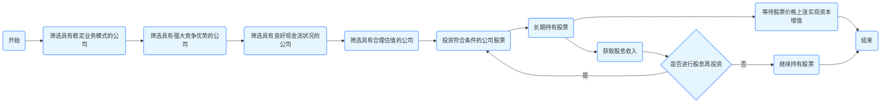

# 巴菲特的股息增长策略：稳定现金流的长期价值

> 关键词：巴菲特、股息增长策略、稳定现金流、长期价值、股票投资

> 摘要：本文深入探讨了巴菲特所推崇的股息增长策略，旨在揭示其如何通过获取稳定现金流来实现长期投资价值。首先介绍了该策略提出的背景、适用读者以及文档整体结构和相关术语。接着详细阐述了股息增长策略的核心概念、算法原理，并给出具体的数学模型和公式。通过项目实战案例展示了该策略在实际中的应用，分析了其开发环境搭建、代码实现及解读。同时列举了该策略的实际应用场景，推荐了相关的学习资源、开发工具和研究论文。最后对股息增长策略的未来发展趋势与挑战进行了总结，并提供了常见问题解答和扩展阅读参考资料。

## 1. 背景介绍 
### 1.1 目的和范围
本博客的目的在于深入剖析巴菲特的股息增长策略，全面揭示该策略如何为投资者带来稳定现金流以及实现长期投资价值。通过对股息增长策略的核心概念、算法原理、数学模型等方面的详细阐述，结合实际项目案例，让读者能够深入理解并掌握这一策略的应用方法。同时，探讨该策略在不同市场环境下的实际应用场景，为投资者提供实用的投资参考。本博客的范围涵盖了股息增长策略的理论基础、实际操作以及相关的学习资源和研究成果。

### 1.2 预期读者
本文预期读者包括对股票投资感兴趣的初学者，希望通过学习专业的投资策略来提升自己的投资水平；有一定投资经验的投资者，想要深入了解巴菲特的投资理念和股息增长策略，优化自己的投资组合；金融专业的学生和研究人员，可将本文作为研究投资策略的参考资料，丰富自己的学术知识和实践经验。

### 1.3 文档结构概述
本文将按照以下结构展开：首先介绍股息增长策略的背景信息，包括目的、预期读者、文档结构概述和术语表；接着阐述核心概念与联系，通过文本示意图和 Mermaid 流程图展示其原理和架构；然后详细讲解核心算法原理和具体操作步骤，并给出 Python 源代码示例；之后介绍数学模型和公式，并结合具体例子进行说明；再通过项目实战展示该策略的实际应用，包括开发环境搭建、源代码实现和代码解读；随后列举实际应用场景；接着推荐相关的工具和资源，包括学习资源、开发工具框架和相关论文著作；最后对股息增长策略的未来发展趋势与挑战进行总结，提供常见问题解答和扩展阅读参考资料。

### 1.4 术语表
#### 1.4.1 核心术语定义
- **股息增长策略**：一种投资策略，投资者选择那些具有稳定且持续增长股息支付历史的股票进行投资，通过长期持有这些股票获取股息收入和资本增值。
- **股息**：公司按照一定比例向股东分配的利润，通常以现金或股票的形式发放。
- **股息率**：股息与股票价格的比率，反映了投资者通过股息获得的投资回报率，计算公式为：$股息率 = \frac{每股股息}{股票价格} \times 100\%$。
- **股息增长率**：公司股息在一定时期内的增长幅度，反映了公司盈利能力和股息政策的稳定性，计算公式为：$股息增长率 = \frac{本期每股股息 - 上期每股股息}{上期每股股息} \times 100\%$。
- **稳定现金流**：指投资者在一定时期内从投资中获得的持续、稳定的现金收入，如股息收入。

#### 1.4.2 相关概念解释
- **长期投资**：投资者买入股票后持有较长时间，通常为数年甚至数十年，以获取公司长期发展带来的资本增值和股息收入。
- **价值投资**：一种投资理念，投资者通过分析公司的基本面，寻找被低估的股票进行投资，关注公司的内在价值和长期发展潜力。
- **复利效应**：在投资中，将股息收入再次投资，随着时间的推移，本金和收益会不断累积，实现资产的快速增长。

#### 1.4.3 缩略词列表
- **EPS**：Earnings Per Share，每股收益，指公司净利润与发行在外普通股股数的比率，反映了公司的盈利能力。
- **P/E**：Price-to-Earnings Ratio，市盈率，指股票价格与每股收益的比率，反映了市场对公司未来盈利的预期。

## 2. 核心概念与联系 

### 核心概念原理
巴菲特的股息增长策略基于价值投资理念，其核心原理是寻找那些具有稳定盈利能力和良好股息政策的公司进行投资。这些公司通常具有以下特点：
- **稳定的业务模式**：公司所处行业具有稳定的市场需求，业务运营相对稳定，能够持续产生利润。
- **强大的竞争优势**：公司具有独特的竞争优势，如品牌优势、技术优势、成本优势等，能够在市场中保持领先地位，抵御竞争对手的挑战。
- **良好的现金流状况**：公司具有充足的现金流，能够保证股息的稳定支付和业务的持续发展。
- **合理的估值**：公司股票价格相对其内在价值具有一定的吸引力，投资者能够以合理的价格买入股票。

通过投资这些公司的股票，投资者可以获得稳定的股息收入，同时随着公司的发展，股票价格也可能会上涨，实现资本增值。此外，股息收入还可以通过复利效应不断累积，进一步增加投资者的财富。

### 架构的文本示意图
```plaintext
股息增长策略架构
|-- 公司筛选
|   |-- 稳定业务模式
|   |-- 强大竞争优势
|   |-- 良好现金流状况
|   |-- 合理估值
|-- 股票投资
|   |-- 长期持有
|   |-- 股息再投资
|-- 收益获取
|   |-- 股息收入
|   |-- 资本增值
```

### Mermaid 流程图


## 3. 核心算法原理 & 具体操作步骤 

### 核心算法原理
股息增长策略的核心算法原理是通过筛选具有稳定股息增长的股票，并进行长期投资，以实现稳定现金流和长期价值的增长。具体步骤如下：
1. **数据收集**：收集股票的历史股息数据、财务报表数据、行业数据等，为后续的分析提供基础。
2. **股息分析**：计算股票的股息率、股息增长率等指标，评估公司的股息支付能力和增长潜力。
3. **财务分析**：分析公司的财务报表，评估公司的盈利能力、偿债能力、运营能力等，判断公司的财务状况是否健康。
4. **行业分析**：研究公司所处行业的发展趋势、市场竞争格局等，评估公司在行业中的地位和发展前景。
5. **综合评估**：综合考虑股息分析、财务分析和行业分析的结果，筛选出具有稳定股息增长和良好发展前景的股票。
6. **投资组合构建**：根据筛选结果，构建投资组合，合理分配资金，降低投资风险。
7. **长期持有**：长期持有投资组合中的股票，享受股息收入和资本增值。

### 具体操作步骤及 Python 源代码示例
以下是一个使用 Python 实现股息增长策略的简单示例，假设我们已经收集了股票的历史股息数据和股票价格数据。

```python
import pandas as pd

# 示例数据：股票历史股息数据和股票价格数据
dividend_data = {
    '股票代码': ['A', 'B', 'C'],
    '2018年股息': [1, 2, 1.5],
    '2019年股息': [1.1, 2.2, 1.6],
    '2020年股息': [1.2, 2.4, 1.7],
    '2021年股息': [1.3, 2.6, 1.8],
    '2022年股息': [1.4, 2.8, 1.9]
}
price_data = {
    '股票代码': ['A', 'B', 'C'],
    '当前价格': [20, 30, 25]
}

# 创建 DataFrame
dividend_df = pd.DataFrame(dividend_data)
price_df = pd.DataFrame(price_data)

# 计算股息增长率
years = ['2018年股息', '2019年股息', '2020年股息', '2021年股息', '2022年股息']
dividend_growth_rates = []
for index, row in dividend_df.iterrows():
    growth_rates = []
    for i in range(1, len(years)):
        growth_rate = (row[years[i]] - row[years[i - 1]]) / row[years[i - 1]]
        growth_rates.append(growth_rate)
    average_growth_rate = sum(growth_rates) / len(growth_rates)
    dividend_growth_rates.append(average_growth_rate)

# 添加股息增长率列到 DataFrame
dividend_df['股息增长率'] = dividend_growth_rates

# 计算股息率
dividend_yields = []
for index, row in dividend_df.iterrows():
    latest_dividend = row[years[-1]]
    stock_price = price_df[price_df['股票代码'] == row['股票代码']]['当前价格'].values[0]
    dividend_yield = latest_dividend / stock_price
    dividend_yields.append(dividend_yield)

# 添加股息率列到 DataFrame
dividend_df['股息率'] = dividend_yields

# 筛选具有稳定股息增长和较高股息率的股票
filtered_df = dividend_df[(dividend_df['股息增长率'] > 0.05) & (dividend_df['股息率'] > 0.03)]

print(filtered_df)
```

### 代码解释
1. **数据收集**：使用字典存储股票的历史股息数据和股票价格数据，并创建 Pandas DataFrame 进行数据处理。
2. **股息分析**：计算每只股票的股息增长率和股息率。股息增长率通过计算相邻年份股息的增长率并取平均值得到，股息率通过最新股息与当前股票价格的比率计算得到。
3. **筛选股票**：根据股息增长率和股息率的阈值筛选出具有稳定股息增长和较高股息率的股票。

## 4. 数学模型和公式 & 详细讲解 & 举例说明 

### 股息率计算公式
股息率是衡量股票股息收益的重要指标，计算公式为：
$$股息率 = \frac{每股股息}{股票价格} \times 100\%$$

**举例说明**：假设某股票的每股股息为 2 元，当前股票价格为 50 元，则该股票的股息率为：
$$股息率 = \frac{2}{50} \times 100\% = 4\%$$

### 股息增长率计算公式
股息增长率反映了公司股息的增长趋势，计算公式为：
$$股息增长率 = \frac{本期每股股息 - 上期每股股息}{上期每股股息} \times 100\%$$

**举例说明**：某公司 2021 年每股股息为 1 元，2022 年每股股息为 1.1 元，则该公司的股息增长率为：
$$股息增长率 = \frac{1.1 - 1}{1} \times 100\% = 10\%$$

### 股息折现模型
股息折现模型是一种用于评估股票内在价值的数学模型，假设股票的价值等于其未来股息的现值之和。该模型的基本公式为：
$$V = \sum_{t=1}^{n} \frac{D_t}{(1 + r)^t} + \frac{P_n}{(1 + r)^n}$$
其中，$V$ 表示股票的内在价值，$D_t$ 表示第 $t$ 期的股息，$r$ 表示折现率，$P_n$ 表示第 $n$ 期的股票价格。

在实际应用中，为了简化计算，通常假设股息以固定增长率 $g$ 增长，此时股息折现模型可以简化为：
$$V = \frac{D_1}{r - g}$$
其中，$D_1$ 表示下一期的股息。

**举例说明**：假设某公司下一期的股息为 2 元，股息增长率为 5%，折现率为 10%，则该公司股票的内在价值为：
$$V = \frac{2}{0.1 - 0.05} = 40（元）$$

如果当前股票价格低于 40 元，则该股票被低估，具有投资价值；如果当前股票价格高于 40 元，则该股票被高估，不建议投资。

## 5. 项目实战：代码实际案例和详细解释说明 

### 5.1  开发环境搭建
为了实现股息增长策略的项目实战，我们需要搭建以下开发环境：
1. **Python 环境**：建议使用 Python 3.7 及以上版本，可以从 Python 官方网站（https://www.python.org/downloads/）下载并安装。
2. **开发工具**：推荐使用 PyCharm 作为开发工具，它是一款功能强大的 Python 集成开发环境，可以从 JetBrains 官方网站（https://www.jetbrains.com/pycharm/download/）下载并安装。
3. **第三方库**：需要安装以下第三方库：
    - **Pandas**：用于数据处理和分析，可以使用以下命令安装：
```sh
pip install pandas
```
    - **Numpy**：用于数值计算，可以使用以下命令安装：
```sh
pip install numpy
```
    - **Matplotlib**：用于数据可视化，可以使用以下命令安装：
```sh
pip install matplotlib
```

### 5.2  源代码详细实现和代码解读
以下是一个完整的股息增长策略项目实战代码示例，包括数据收集、股息分析、股票筛选和可视化展示：

```python
import pandas as pd
import numpy as np
import matplotlib.pyplot as plt

# 模拟数据收集：假设我们已经从数据源获取了股票的历史股息数据和股票价格数据
dividend_data = {
    '股票代码': ['A', 'B', 'C', 'D', 'E'],
    '2018年股息': [1, 2, 1.5, 0.8, 1.2],
    '2019年股息': [1.1, 2.2, 1.6, 0.9, 1.3],
    '2020年股息': [1.2, 2.4, 1.7, 1, 1.4],
    '2021年股息': [1.3, 2.6, 1.8, 1.1, 1.5],
    '2022年股息': [1.4, 2.8, 1.9, 1.2, 1.6]
}
price_data = {
    '股票代码': ['A', 'B', 'C', 'D', 'E'],
    '当前价格': [20, 30, 25, 15, 22]
}

# 创建 DataFrame
dividend_df = pd.DataFrame(dividend_data)
price_df = pd.DataFrame(price_data)

# 计算股息增长率
years = ['2018年股息', '2019年股息', '2020年股息', '2021年股息', '2022年股息']
dividend_growth_rates = []
for index, row in dividend_df.iterrows():
    growth_rates = []
    for i in range(1, len(years)):
        growth_rate = (row[years[i]] - row[years[i - 1]]) / row[years[i - 1]]
        growth_rates.append(growth_rate)
    average_growth_rate = np.mean(growth_rates)
    dividend_growth_rates.append(average_growth_rate)

# 添加股息增长率列到 DataFrame
dividend_df['股息增长率'] = dividend_growth_rates

# 计算股息率
dividend_yields = []
for index, row in dividend_df.iterrows():
    latest_dividend = row[years[-1]]
    stock_price = price_df[price_df['股票代码'] == row['股票代码']]['当前价格'].values[0]
    dividend_yield = latest_dividend / stock_price
    dividend_yields.append(dividend_yield)

# 添加股息率列到 DataFrame
dividend_df['股息率'] = dividend_yields

# 筛选具有稳定股息增长和较高股息率的股票
filtered_df = dividend_df[(dividend_df['股息增长率'] > 0.05) & (dividend_df['股息率'] > 0.03)]

# 可视化展示筛选结果
plt.figure(figsize=(10, 6))
plt.bar(filtered_df['股票代码'], filtered_df['股息率'], label='股息率')
plt.bar(filtered_df['股票代码'], filtered_df['股息增长率'], bottom=filtered_df['股息率'], label='股息增长率')
plt.xlabel('股票代码')
plt.ylabel('比率')
plt.title('筛选股票的股息率和股息增长率')
plt.legend()
plt.show()

print(filtered_df)
```

### 代码解读
1. **数据收集**：使用字典模拟收集股票的历史股息数据和股票价格数据，并创建 Pandas DataFrame 进行数据处理。
2. **股息分析**：
    - 计算每只股票的股息增长率，通过计算相邻年份股息的增长率并取平均值得到。
    - 计算每只股票的股息率，通过最新股息与当前股票价格的比率计算得到。
3. **股票筛选**：根据股息增长率和股息率的阈值筛选出具有稳定股息增长和较高股息率的股票。
4. **可视化展示**：使用 Matplotlib 库绘制柱状图，展示筛选股票的股息率和股息增长率。

### 5.3  代码解读与分析
通过上述代码，我们可以实现股息增长策略的基本功能，包括数据收集、股息分析、股票筛选和可视化展示。在实际应用中，我们可以根据需要对代码进行扩展和优化，例如：
- **数据来源**：可以从真实的金融数据源（如雅虎财经、东方财富等）获取股票的历史股息数据和股票价格数据。
- **筛选条件**：可以根据市场情况和个人投资目标调整股息增长率和股息率的阈值，以筛选出更符合要求的股票。
- **投资组合构建**：在筛选出符合条件的股票后，可以根据不同的投资策略构建投资组合，如等权重投资组合、市值加权投资组合等。

## 6. 实际应用场景 
### 个人投资者
对于个人投资者来说，股息增长策略是一种稳健的投资方式。通过投资具有稳定股息增长的股票，个人投资者可以获得稳定的现金流收入，同时享受股票价格上涨带来的资本增值。例如，一位退休人员可以将一部分资金投资于股息增长型股票，以获取稳定的股息收入作为生活费用的补充。此外，股息增长策略还可以帮助个人投资者实现资产的长期增值，通过复利效应积累财富。

### 机构投资者
机构投资者如养老基金、保险公司等通常具有长期投资的需求和稳定的现金流要求。股息增长策略符合他们的投资目标，因为它可以提供稳定的股息收入和长期的资本增值。机构投资者可以通过构建大规模的股息增长型投资组合，分散投资风险，实现资产的稳健增长。例如，养老基金可以将一部分资金投资于股息增长型股票，以满足未来养老金支付的需求。

### 价值投资策略的补充
股息增长策略可以作为价值投资策略的重要补充。价值投资者通常关注公司的内在价值和基本面，而股息增长策略则强调公司的股息支付能力和增长潜力。通过结合股息增长策略和价值投资策略，投资者可以更全面地评估公司的投资价值，选择具有更高安全边际和增长潜力的股票。例如，价值投资者在筛选股票时，可以将股息增长率和股息率作为重要的参考指标，优先选择那些具有稳定股息增长和较高股息率的股票。

## 7. 工具和资源推荐
### 7.1 学习资源推荐
#### 7.1.1 书籍推荐
- 《聪明的投资者》（The Intelligent Investor）：作者是本杰明·格雷厄姆（Benjamin Graham），这本书是价值投资领域的经典之作，介绍了价值投资的基本理念和方法，对股息增长策略也有一定的阐述。
- 《巴菲特致股东的信：股份公司教程》（Letters to Shareholders of Berkshire Hathaway）：作者是沃伦·巴菲特（Warren Buffett），这本书收录了巴菲特历年致股东的信，从中可以了解到巴菲特的投资理念、投资策略和对股息增长的看法。
- 《股息投资策略》（The Dividend Investor's Strategy）：作者是马特·杰弗里斯（Matt Jefferies），这本书专门介绍了股息增长策略的原理、方法和实践，适合对股息投资感兴趣的投资者阅读。

#### 7.1.2 在线课程
- Coursera 上的“投资学原理”（Principles of Investing）：该课程由耶鲁大学教授授课，介绍了投资学的基本原理和方法，包括股息增长策略等内容。
- Udemy 上的“股息投资实战指南”（Dividend Investing: A Practical Guide）：该课程由专业投资人士授课，详细介绍了股息增长策略的实际应用和操作技巧。

#### 7.1.3 技术博客和网站
- Seeking Alpha（https://seekingalpha.com/）：这是一个专业的金融投资网站，提供了大量的股票分析、投资策略和股息信息，是投资者获取股息增长策略相关信息的重要来源。
- Dividend.com（https://www.dividend.com/）：该网站专注于股息投资，提供了股息股票筛选、股息收益率排名、股息历史数据等功能，方便投资者进行股息增长策略的研究和实践。

### 7.2 开发工具框架推荐
#### 7.2.1 IDE和编辑器
- PyCharm：一款功能强大的 Python 集成开发环境，提供了代码编辑、调试、版本控制等功能，适合开发股息增长策略相关的 Python 代码。
- Jupyter Notebook：一种交互式的开发环境，支持 Python、R 等多种编程语言，适合进行数据探索、分析和可视化，方便投资者进行股息增长策略的研究和实验。

#### 7.2.2 调试和性能分析工具
- PDB：Python 自带的调试工具，可以帮助开发者定位代码中的错误和问题，提高代码的稳定性和可靠性。
- cProfile：Python 自带的性能分析工具，可以分析代码的运行时间和函数调用情况，帮助开发者优化代码性能。

#### 7.2.3 相关框架和库
- Pandas：用于数据处理和分析的 Python 库，提供了丰富的数据结构和函数，方便投资者处理和分析股票的历史股息数据和股票价格数据。
- Numpy：用于数值计算的 Python 库，提供了高效的数组操作和数学函数，适合进行股息增长率、股息率等指标的计算。
- Matplotlib：用于数据可视化的 Python 库，提供了多种绘图函数和样式，方便投资者将分析结果以直观的图表形式展示出来。

### 7.3 相关论文著作推荐
#### 7.3.1 经典论文
- 《股票市场价格行为》（The Behavior of Stock Market Prices）：作者是尤金·法玛（Eugene F. Fama），这篇论文提出了有效市场假说，对股票市场的价格行为进行了深入研究，为股息增长策略的研究提供了理论基础。
- 《资本资产定价模型：风险条件下的市场均衡理论》（Capital Asset Pricing Model: A Theory of Market Equilibrium under Conditions of Risk）：作者是威廉·夏普（William F. Sharpe），这篇论文提出了资本资产定价模型，为投资者评估股票的风险和收益提供了重要的工具，对股息增长策略的投资组合构建有一定的指导意义。

#### 7.3.2 最新研究成果
- 《股息增长投资策略的有效性研究》：该研究通过实证分析验证了股息增长策略在不同市场环境下的有效性，为投资者提供了实践参考。
- 《股息政策与公司价值的关系研究》：该研究探讨了公司股息政策对公司价值的影响，有助于投资者深入理解股息增长策略的内在机制。

#### 7.3.3 应用案例分析
- 《某养老基金的股息增长投资策略实践》：该案例分析了某养老基金如何运用股息增长策略构建投资组合，实现资产的稳健增长，为机构投资者提供了实际操作的借鉴。
- 《个人投资者的股息增长投资经验分享》：该案例分享了一位个人投资者通过股息增长策略实现财富增值的经验和心得，对个人投资者有一定的启发作用。

## 8. 总结：未来发展趋势与挑战
### 未来发展趋势
- **数字化和智能化**：随着科技的不断发展，股息增长策略的研究和实践将越来越数字化和智能化。投资者可以利用大数据、人工智能等技术手段，更准确地筛选具有稳定股息增长的股票，优化投资组合。例如，通过机器学习算法对股票的历史数据进行分析和预测，提高股息增长策略的投资效果。
- **多元化投资**：未来，股息增长策略将与其他投资策略相结合，实现多元化投资。投资者可以将股息增长型股票与债券、房地产等其他资产进行组合，降低投资风险，提高投资组合的稳定性和收益性。例如，构建一个包含股息增长型股票、债券和房地产投资信托基金（REITs）的投资组合，实现资产的多元化配置。
- **全球投资**：随着全球经济一体化的发展，投资者将越来越关注全球市场的股息增长机会。通过投资全球范围内的股息增长型股票，投资者可以分散投资风险，获取更广泛的投资收益。例如，投资美国、欧洲、亚洲等不同地区的股息增长型股票，实现全球资产配置。

### 挑战
- **市场波动**：股票市场具有不确定性和波动性，股息增长型股票也不例外。市场波动可能导致股票价格下跌，股息收入减少，从而影响股息增长策略的投资效果。投资者需要具备一定的风险承受能力和应对市场波动的能力。
- **公司业绩变化**：公司的业绩和股息政策可能会发生变化，导致股息增长不稳定。例如，公司可能因为经营不善、市场竞争加剧等原因，导致净利润下降，从而减少股息支付。投资者需要密切关注公司的基本面变化，及时调整投资组合。
- **利率变化**：利率的变化会影响股息增长型股票的吸引力。当利率上升时，债券等固定收益类资产的收益率提高，可能会吸引部分投资者从股票市场转向债券市场，导致股息增长型股票价格下跌。投资者需要关注利率变化对股息增长策略的影响，合理调整投资组合。

## 9. 附录：常见问题与解答
### 1. 股息增长策略适合所有投资者吗？
股息增长策略并不适合所有投资者。该策略更适合那些追求稳定现金流和长期资本增值、风险承受能力较低的投资者。对于那些追求短期高收益、风险偏好较高的投资者来说，股息增长策略可能不是最佳选择。

### 2. 如何选择具有稳定股息增长的股票？
选择具有稳定股息增长的股票需要综合考虑多个因素，包括公司的业务模式、竞争优势、财务状况、行业前景等。具体可以从以下几个方面入手：
- **查看公司的股息历史**：选择那些具有连续多年股息增长记录的公司。
- **分析公司的财务报表**：关注公司的净利润、现金流、负债率等指标，确保公司具有良好的盈利能力和偿债能力。
- **研究公司所处行业的发展趋势**：选择那些处于稳定增长行业的公司。
- **评估公司的竞争优势**：选择那些具有独特竞争优势的公司，如品牌优势、技术优势等。

### 3. 股息增长策略的投资期限一般是多久？
股息增长策略是一种长期投资策略，投资期限一般建议在 5 年以上。通过长期持有股息增长型股票，投资者可以充分享受股息收入和资本增值的复利效应，实现资产的长期增长。

### 4. 股息再投资有什么好处？
股息再投资可以带来以下好处：
- **复利效应**：将股息收入再次投资，可以增加投资本金，随着时间的推移，本金和收益会不断累积，实现资产的快速增长。
- **降低交易成本**：股息再投资通常不需要支付交易费用，相比手动买入股票，可以降低交易成本。
- **长期投资**：股息再投资可以帮助投资者坚持长期投资，避免因短期市场波动而频繁买卖股票。

## 10. 扩展阅读 & 参考资料
### 扩展阅读
- 《金融市场与金融机构》：这本书介绍了金融市场的基本原理和金融机构的运作模式，有助于投资者更好地理解股票市场和股息增长策略的宏观环境。
- 《行为金融学》：行为金融学研究了投资者的心理和行为对金融市场的影响，对于理解股息增长策略在实际应用中的投资者行为有一定的帮助。

### 参考资料
- 雅虎财经（https://finance.yahoo.com/）：提供了丰富的股票市场数据和金融资讯，是获取股票历史股息数据和股票价格数据的重要来源。
- 东方财富（https://www.eastmoney.com/）：国内知名的金融信息服务平台，提供了全面的股票市场数据和分析工具，方便投资者进行股息增长策略的研究和实践。

作者：AI天才研究院/AI Genius Institute & 禅与计算机程序设计艺术 /Zen And The Art of Computer Programming