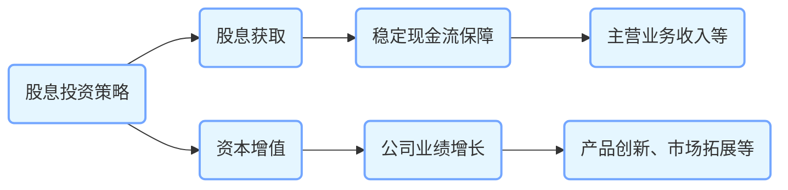

# 巴菲特的股息投资策略：稳定现金流的重要性

> 关键词：巴菲特、股息投资策略、稳定现金流、投资价值、长期投资

> 摘要：本文深入探讨了巴菲特的股息投资策略以及稳定现金流在其中的重要性。首先介绍了背景知识，包括目的、预期读者、文档结构和术语表。接着阐述了核心概念，如股息、稳定现金流等及其相互联系，并通过示意图和流程图展示。详细讲解了核心算法原理和具体操作步骤，结合数学模型和公式进行说明。通过项目实战给出代码案例及解读。分析了股息投资策略的实际应用场景，推荐了相关学习资源、开发工具框架和论文著作。最后总结未来发展趋势与挑战，解答常见问题并提供扩展阅读和参考资料，帮助投资者理解和运用巴菲特的股息投资策略。

## 1. 背景介绍 
### 1.1 目的和范围
本文章的主要目的是深入剖析巴菲特的股息投资策略，着重强调稳定现金流在这一策略中的关键作用。通过详细的理论阐述、实际案例分析以及代码实现，帮助读者全面理解股息投资策略的核心要点和操作方法，从而能够在实际投资中合理运用该策略。文章的范围涵盖了股息投资策略的基本概念、算法原理、数学模型、实际应用场景以及相关的学习资源和工具推荐等方面。

### 1.2 预期读者
本文预期读者主要包括对投资领域感兴趣的个人投资者，无论是新手投资者希望了解基本的投资策略，还是有一定经验的投资者想要深入学习巴菲特的投资理念；同时也适用于金融专业的学生和研究人员，为他们提供学术研究和实践操作的参考；此外，金融从业人员如投资顾问、基金经理等也可以从本文中获取新的思路和方法。

### 1.3 文档结构概述
本文将按照以下结构进行详细阐述：首先介绍核心概念，明确股息、稳定现金流等相关概念及其联系；接着讲解核心算法原理和具体操作步骤，并通过Python代码进行详细说明；然后引入数学模型和公式，结合实际例子进行讲解；再通过项目实战给出具体的代码案例和详细解释；分析股息投资策略的实际应用场景；推荐相关的学习资源、开发工具框架和论文著作；最后总结未来发展趋势与挑战，解答常见问题并提供扩展阅读和参考资料。

### 1.4 术语表
#### 1.4.1 核心术语定义
- **股息（Dividend）**：股息是指股份公司从提取了公积金、公益金的税后利润中按照股息率派发给股东的收益。简单来说，就是公司将盈利的一部分分配给股东的现金回报。
- **股息率（Dividend Yield）**：股息率是股息与股票价格之间的比率，通常以百分比表示。计算公式为：$股息率 = \frac{年度股息}{股票当前价格} \times 100\%$。它是衡量股票投资收益的一个重要指标。
- **稳定现金流（Stable Cash Flow）**：稳定现金流是指企业在一定时期内产生的现金流入和流出相对稳定、可预测的状态。对于投资者来说，稳定现金流意味着投资能够持续获得可靠的现金回报。
- **股息投资策略（Dividend Investment Strategy）**：股息投资策略是一种投资方法，投资者主要关注那些能够持续支付股息且股息率较高的股票，通过长期持有这些股票获取股息收益和资本增值。

#### 1.4.2 相关概念解释
- **分红政策（Dividend Policy）**：分红政策是指公司决定如何分配盈利的政策，包括是否分红、分红的比例和频率等。不同的公司可能有不同的分红政策，有些公司倾向于将大部分盈利用于分红，而有些公司则更注重将盈利用于再投资以促进公司的发展。
- **留存收益（Retained Earnings）**：留存收益是指公司在支付股息后剩余的盈利，这些收益通常会被公司用于再投资，如扩大生产、研发新产品等，以期望为公司带来更高的未来收益。

#### 1.4.3 缩略词列表
- **EPS（Earnings Per Share）**：每股收益，是指公司净利润与发行在外普通股股数的比率，反映了每股股票的盈利水平。
- **P/E（Price-to-Earnings Ratio）**：市盈率，是指股票价格与每股收益的比率，用于衡量股票的估值水平。

## 2. 核心概念与联系 

### 核心概念原理
#### 股息
股息是公司盈利的一部分分配给股东的回报，它是股东投资股票获得收益的一种方式。公司的盈利状况、分红政策等因素决定了股息的大小和稳定性。一般来说，业绩稳定、盈利能力强的公司更有可能持续支付较高的股息。

#### 稳定现金流
稳定现金流对于公司和投资者都具有重要意义。对于公司而言，稳定的现金流意味着公司能够正常运营、偿还债务、进行再投资等。对于投资者来说，稳定现金流的公司更有可能持续支付股息，从而为投资者提供稳定的收益。稳定现金流的来源可以包括公司的主营业务收入、投资收益等。

#### 股息投资策略
股息投资策略的核心思想是通过选择那些具有稳定股息支付历史和较高股息率的股票进行长期投资。投资者可以通过定期获得股息收益来实现资产的增值，同时也可以享受股票价格上涨带来的资本利得。这种策略注重投资的稳定性和长期收益，适合那些风险偏好较低、追求稳定现金流的投资者。

### 架构的文本示意图
```plaintext
                股息投资策略
                    |
            +-------+-------+
            |               |
        股息获取         资本增值
            |               |
    稳定现金流保障     公司业绩增长
            |               |
  主营业务收入等  产品创新、市场拓展等
```

### Mermaid 流程图


## 3. 核心算法原理 & 具体操作步骤 

### 核心算法原理
股息投资策略的核心算法主要涉及到股息率的计算和股票的筛选。股息率的计算公式为：$股息率 = \frac{年度股息}{股票当前价格} \times 100\%$。通过计算不同股票的股息率，投资者可以筛选出股息率较高的股票。

### 具体操作步骤
#### 步骤1：数据收集
投资者需要收集股票的相关数据，包括股票价格、年度股息等。这些数据可以从金融数据提供商、证券交易所网站等渠道获取。

#### 步骤2：计算股息率
根据收集到的数据，使用股息率计算公式计算每只股票的股息率。以下是使用Python实现的代码示例：
```python
# 定义股票价格和年度股息
stock_prices = [50, 60, 70]
annual_dividends = [2, 3, 4]

# 计算股息率
dividend_yields = []
for i in range(len(stock_prices)):
    dividend_yield = (annual_dividends[i] / stock_prices[i]) * 100
    dividend_yields.append(dividend_yield)

# 输出股息率
for i in range(len(dividend_yields)):
    print(f"股票{i+1}的股息率为: {dividend_yields[i]:.2f}%")
```

#### 步骤3：筛选股票
根据计算得到的股息率，投资者可以设定一个股息率阈值，筛选出股息率高于该阈值的股票。以下是在上述代码基础上进行股票筛选的示例：
```python
# 设定股息率阈值
threshold = 5

# 筛选股票
selected_stocks = []
for i in range(len(dividend_yields)):
    if dividend_yields[i] >= threshold:
        selected_stocks.append(i+1)

# 输出筛选结果
print(f"筛选出的股票编号为: {selected_stocks}")
```

#### 步骤4：投资决策
在筛选出符合条件的股票后，投资者还需要综合考虑其他因素，如公司的财务状况、行业前景、管理层能力等，做出最终的投资决策。

## 4. 数学模型和公式 & 详细讲解 & 举例说明 

### 股息率公式
$股息率 = \frac{年度股息}{股票当前价格} \times 100\%$

### 详细讲解
股息率反映了投资者购买股票后每年能够获得的股息收益占股票价格的比例。例如，如果一只股票的当前价格为100元，年度股息为5元，那么该股票的股息率为：$\frac{5}{100} \times 100\% = 5\%$。这意味着投资者每投资100元购买该股票，每年可以获得5元的股息收益。

### 举例说明
假设投资者考虑投资两只股票A和B。股票A的当前价格为80元，年度股息为4元；股票B的当前价格为120元，年度股息为6元。分别计算两只股票的股息率：
- 股票A的股息率：$\frac{4}{80} \times 100\% = 5\%$
- 股票B的股息率：$\frac{6}{120} \times 100\% = 5\%$

从股息率来看，两只股票的股息收益水平相同。但投资者还需要考虑其他因素，如公司的发展前景、财务状况等，来决定选择哪只股票进行投资。

### 股息再投资复利模型
如果投资者将获得的股息进行再投资，那么可以利用复利模型来计算长期投资的收益。复利计算公式为：$A = P(1 + \frac{r}{n})^{nt}$，其中：
- $A$ 是投资期末的本利和
- $P$ 是初始投资金额
- $r$ 是年利率（这里可以用股息率近似代替）
- $n$ 是每年复利的次数
- $t$ 是投资的年数

### 举例说明
假设投资者初始投资10000元购买一只股息率为5%的股票，并且将每年获得的股息进行再投资。如果每年复利一次（$n = 1$），投资期限为10年（$t = 10$），则10年后的本利和为：
$A = 10000(1 + 0.05)^{10} \approx 16288.95$（元）

通过股息再投资，投资者的资产在10年内实现了显著的增长。

## 5. 项目实战：代码实际案例和详细解释说明 

### 5.1  开发环境搭建
#### 安装Python
首先需要安装Python编程语言。可以从Python官方网站（https://www.python.org/downloads/）下载适合自己操作系统的Python版本，并按照安装向导进行安装。

#### 安装必要的库
在进行股息投资策略的项目实战中，需要使用一些Python库来获取和处理金融数据。常用的库包括`pandas`、`yfinance`等。可以使用以下命令来安装这些库：
```sh
pip install pandas yfinance
```

### 5.2  源代码详细实现和代码解读
以下是一个完整的Python代码示例，用于实现股息投资策略的基本流程：
```python
import yfinance as yf
import pandas as pd

# 定义股票列表
stock_symbols = ['AAPL', 'MSFT', 'JPM']

# 定义时间范围
start_date = '2020-01-01'
end_date = '2023-12-31'

# 获取股票数据
stock_data = {}
for symbol in stock_symbols:
    stock = yf.Ticker(symbol)
    dividends = stock.dividends.loc[start_date:end_date]
    prices = stock.history(start=start_date, end=end_date)['Close']
    stock_data[symbol] = {'dividends': dividends, 'prices': prices}

# 计算股息率
dividend_yields = {}
for symbol, data in stock_data.items():
    if not data['dividends'].empty and not data['prices'].empty:
        annual_dividend = data['dividends'].sum()
        last_price = data['prices'][-1]
        dividend_yield = (annual_dividend / last_price) * 100
        dividend_yields[symbol] = dividend_yield

# 筛选股息率高于阈值的股票
threshold = 2
selected_stocks = [symbol for symbol, yield_ in dividend_yields.items() if yield_ >= threshold]

# 输出结果
print("各股票的股息率:")
for symbol, yield_ in dividend_yields.items():
    print(f"{symbol}: {yield_:.2f}%")

print("\n筛选出的股票:")
print(selected_stocks)
```

### 代码解读与分析
#### 代码功能概述
这段代码的主要功能是获取指定股票在指定时间范围内的股息数据和价格数据，计算每只股票的股息率，并筛选出股息率高于阈值的股票。

#### 代码详细解读
1. **导入必要的库**：导入`yfinance`库用于获取股票数据，导入`pandas`库用于数据处理。
2. **定义股票列表和时间范围**：定义了要分析的股票列表`stock_symbols`和时间范围`start_date`、`end_date`。
3. **获取股票数据**：使用`yfinance`库的`Ticker`类获取每只股票的股息数据和价格数据，并存储在`stock_data`字典中。
4. **计算股息率**：遍历`stock_data`字典，计算每只股票的年度股息和最后价格，进而计算股息率，并存储在`dividend_yields`字典中。
5. **筛选股票**：根据设定的股息率阈值`threshold`，筛选出股息率高于该阈值的股票，并存储在`selected_stocks`列表中。
6. **输出结果**：打印每只股票的股息率和筛选出的股票列表。

## 6. 实际应用场景 
### 个人投资者的长期投资
对于个人投资者来说，股息投资策略是一种适合长期投资的方法。通过选择具有稳定股息支付历史的股票，投资者可以获得稳定的现金流，同时享受股票价格上涨带来的资本增值。例如，一位投资者计划为自己的退休生活进行储备，他可以选择一些大型蓝筹股，如可口可乐、宝洁等，这些公司通常具有稳定的盈利能力和分红政策，能够为投资者提供长期稳定的股息收益。

### 养老基金和保险资金的投资
养老基金和保险资金通常具有长期投资的特点，需要追求稳定的收益。股息投资策略正好符合它们的需求。这些机构投资者可以通过投资股息率较高的股票，构建多元化的投资组合，以实现资产的保值增值。例如，一些养老基金可能会将一定比例的资金投资于金融、公用事业等行业的股票，这些行业的公司通常具有较高的股息率和稳定的现金流。

### 资产配置中的一部分
股息投资策略可以作为资产配置的一部分，与其他投资策略相结合，降低投资组合的风险。例如，投资者可以将一部分资金投资于股票市场，选择股息率较高的股票；另一部分资金投资于债券市场，以获取固定的利息收益。通过合理的资产配置，投资者可以在追求收益的同时，降低投资组合的波动性。

## 7. 工具和资源推荐
### 7.1 学习资源推荐
#### 7.1.1 书籍推荐
- 《聪明的投资者》（The Intelligent Investor）：作者是本杰明·格雷厄姆（Benjamin Graham），这本书被誉为投资界的圣经，介绍了价值投资的基本理念和方法，对股息投资策略也有深入的探讨。
- 《巴菲特致股东的信》（Letters to Shareholders of Berkshire Hathaway）：这本书收录了巴菲特历年致股东的信，通过阅读这些信件，读者可以深入了解巴菲特的投资思想和策略，包括股息投资策略。
- 《漫步华尔街》（A Random Walk Down Wall Street）：作者是伯顿·马尔基尔（Burton Malkiel），这本书介绍了各种投资策略和理论，对股息投资策略的优缺点进行了客观的分析。

#### 7.1.2 在线课程
- Coursera上的“投资学原理”（Principles of Investing）课程：该课程由知名大学的教授授课，介绍了投资的基本原理和方法，包括股息投资策略的相关内容。
- Udemy上的“股息投资实战”（Dividend Investing for Beginners）课程：该课程专门针对股息投资策略进行讲解，通过实际案例和操作演示，帮助学员掌握股息投资的技巧。

#### 7.1.3 技术博客和网站
- Seeking Alpha（https://seekingalpha.com/）：这是一个知名的金融投资网站，提供各种股票分析和投资策略的文章，包括股息投资策略的相关内容。
- Dividend.com（https://www.dividend.com/）：该网站专注于股息投资，提供股息数据、股息率排名、股息新闻等信息，是股息投资者的重要参考网站。

### 7.2 开发工具框架推荐
#### 7.2.1 IDE和编辑器
- PyCharm：是一款专业的Python集成开发环境，具有代码编辑、调试、代码分析等功能，适合进行股息投资策略的代码开发。
- Jupyter Notebook：是一个交互式的开发环境，支持Python代码的编写、运行和可视化展示，适合进行数据探索和分析。

#### 7.2.2 调试和性能分析工具
- pdb：是Python自带的调试工具，可以帮助开发者调试代码，找出代码中的错误。
- cProfile：是Python的性能分析工具，可以分析代码的运行时间和函数调用情况，帮助开发者优化代码性能。

#### 7.2.3 相关框架和库
- yfinance：用于获取股票的历史数据、股息数据等，是进行股息投资策略分析的重要工具。
- pandas：用于数据处理和分析，提供了丰富的数据结构和数据分析方法，方便对股票数据进行处理和计算。

### 7.3 相关论文著作推荐
#### 7.3.1 经典论文
- “Dividend Policy, Growth, and the Valuation of Shares” by Merton H. Miller and Franco Modigliani：这篇论文提出了著名的MM定理，对股息政策和公司价值的关系进行了深入的研究。
- “The Information Content of Dividends” by H. Kent Baker, George E. Pinches, and Vijay K. Sarin：该论文探讨了股息所包含的信息对投资者决策的影响。

#### 7.3.2 最新研究成果
- 可以通过学术数据库如IEEE Xplore、ACM Digital Library等搜索关于股息投资策略的最新研究论文，了解该领域的最新发展动态。

#### 7.3.3 应用案例分析
- 一些金融研究机构和咨询公司会发布关于股息投资策略的应用案例分析报告，这些报告可以帮助投资者了解股息投资策略在实际应用中的效果和风险。

## 8. 总结：未来发展趋势与挑战
### 未来发展趋势
#### 科技公司加入股息支付行列
随着科技行业的成熟，越来越多的科技公司开始重视股东回报，可能会加入股息支付的行列。例如，苹果公司已经成为股息支付的大户，未来可能会有更多的科技公司效仿，为投资者提供更多的股息投资选择。

#### 股息投资与可持续投资的结合
投资者越来越关注企业的社会责任和可持续发展，未来股息投资可能会与可持续投资相结合。投资者会更倾向于投资那些具有良好环境、社会和治理（ESG）表现的公司，这些公司不仅能够提供稳定的股息收益，还符合投资者的价值观。

#### 数字化投资平台的发展
数字化投资平台的发展将使股息投资更加便捷和高效。投资者可以通过在线平台轻松获取股票的股息信息、进行投资组合管理等。同时，人工智能和大数据技术的应用也将为股息投资策略的优化提供支持。

### 挑战
#### 宏观经济环境的不确定性
宏观经济环境的不确定性，如经济衰退、通货膨胀、利率波动等，会对股息投资策略产生影响。在经济衰退期间，公司的盈利能力可能会下降，导致股息支付减少；通货膨胀会降低股息的实际价值；利率波动会影响股票的估值和投资者的资金成本。

#### 公司业绩的波动
公司的业绩波动是股息投资面临的另一个挑战。即使是具有稳定股息支付历史的公司，也可能会因为市场竞争、技术变革等因素导致业绩下滑，从而影响股息的支付。投资者需要密切关注公司的基本面变化，及时调整投资组合。

#### 市场情绪的影响
市场情绪的波动会导致股票价格的大幅波动，从而影响股息率的计算和投资决策。在市场恐慌时期，股票价格可能会大幅下跌，股息率会相应提高，但此时投资者可能会因为恐惧而不敢买入；在市场乐观时期，股票价格可能会过高，股息率会降低，投资者可能会因为贪婪而过度买入。

## 9. 附录：常见问题与解答
### 问题1：股息率越高的股票就一定越好吗？
不一定。股息率高可能是因为股票价格较低或者公司股息支付较多。但股票价格低可能是由于公司业绩不佳、行业前景不好等原因导致的。投资者在选择股票时，不能仅仅只看股息率，还需要综合考虑公司的财务状况、行业前景、管理层能力等因素。

### 问题2：股息投资策略适合短期投资吗？
股息投资策略更适合长期投资。因为股息投资的收益主要来自于长期的股息积累和资本增值，短期投资可能无法充分体现股息投资的优势。此外，短期市场波动较大，可能会影响股票价格和股息支付的稳定性。

### 问题3：如何判断公司的现金流是否稳定？
可以通过分析公司的财务报表来判断公司的现金流是否稳定。主要关注以下几个指标：
- 经营活动现金流量净额：该指标反映了公司主营业务产生现金的能力，持续为正且稳定增长说明公司经营活动现金流入稳定。
- 自由现金流：自由现金流是指公司经营活动现金流量净额减去资本支出后的余额，反映了公司可自由支配的现金。自由现金流稳定且为正说明公司有足够的现金用于支付股息、偿还债务等。
- 现金流量比率：如经营活动现金流量与流动负债的比率，该比率越高说明公司短期偿债能力越强，现金流越稳定。

### 问题4：股息需要缴纳税款吗？
股息是否需要缴纳税款以及缴纳的税率取决于投资者所在的国家和地区的税收政策。在一些国家和地区，股息收入需要缴纳个人所得税；而在另一些国家和地区，可能会有税收优惠政策，如对股息收入给予一定的免税额度或较低的税率。投资者在进行股息投资时，需要了解当地的税收政策，以便准确计算投资收益。

## 10. 扩展阅读 & 参考资料
### 扩展阅读
- 《金融炼金术》（The Alchemy of Finance）：作者是乔治·索罗斯（George Soros），这本书介绍了索罗斯的投资哲学和方法，对投资者的思维方式有很大的启发。
- 《投资最重要的事》（The Most Important Thing Illuminated）：作者是霍华德·马克斯（Howard Marks），这本书强调了投资中的风险管理和逆向思维，与股息投资策略中的价值判断有一定的关联。

### 参考资料
- 金融数据提供商的官方网站，如雅虎财经（https://finance.yahoo.com/）、东方财富网（https://www.eastmoney.com/）等，获取股票的历史数据和股息信息。
- 证券交易所的官方网站，如上海证券交易所（https://www.sse.com.cn/）、深圳证券交易所（https://www.szse.cn/）等，获取上市公司的公告和财务报表。

作者：AI天才研究院/AI Genius Institute & 禅与计算机程序设计艺术 /Zen And The Art of Computer Programming