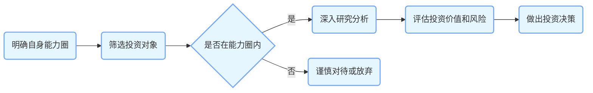

# 巴菲特的能力圈理论：了解自己的优势和局限

> 关键词：巴菲特、能力圈理论、优势、局限、投资决策

> 摘要：本文围绕巴菲特的能力圈理论展开深入探讨。详细阐述了该理论的背景、核心概念、算法原理、数学模型等内容。通过实际案例展示了如何运用能力圈理论进行投资决策，分析了其在不同应用场景中的作用。同时，推荐了相关的学习资源、开发工具和论文著作。最后总结了能力圈理论的未来发展趋势与挑战，并对常见问题进行了解答，旨在帮助读者更好地理解和应用这一重要理论，在投资及其他领域做出更明智的决策。

## 1. 背景介绍 
### 1.1 目的和范围
巴菲特的能力圈理论在投资界乃至商业领域都具有深远的影响。本文的目的在于全面深入地剖析这一理论，不仅要揭示其核心内涵，更要探讨如何将其应用于实际的投资决策和生活中的各种选择。通过对能力圈理论的研究，帮助读者清晰地认识自己的优势和局限，从而在复杂多变的环境中做出更合理、更明智的决策。

文章的范围将涵盖能力圈理论的起源、发展，核心概念的详细解读，相关的算法原理和数学模型，以及实际应用案例。同时，还会推荐与能力圈理论相关的学习资源、开发工具和研究论文，为读者提供一个全面了解和应用该理论的知识体系。

### 1.2 预期读者
本文预期的读者包括广大的投资者，无论是专业的金融从业者还是普通的个人投资者，都可以从对能力圈理论的深入理解中获得启发，优化自己的投资策略。此外，企业管理者、创业者以及对自我认知和决策方法感兴趣的人士也能从文章中找到有价值的信息，运用能力圈理论来指导企业经营和个人职业发展。

### 1.3 文档结构概述
本文将按照以下结构进行组织：
1. **背景介绍**：阐述文章的目的、范围、预期读者以及文档的整体结构，并对相关术语进行解释。
2. **核心概念与联系**：详细解释能力圈理论的核心概念，通过文本示意图和 Mermaid 流程图展示其原理和架构。
3. **核心算法原理 & 具体操作步骤**：运用 Python 源代码阐述如何将能力圈理论应用于决策过程中的算法原理，并给出具体的操作步骤。
4. **数学模型和公式 & 详细讲解 & 举例说明**：介绍与能力圈理论相关的数学模型和公式，通过详细讲解和实际例子帮助读者理解。
5. **项目实战：代码实际案例和详细解释说明**：通过具体的投资项目案例，展示如何使用能力圈理论进行决策，包括开发环境搭建、源代码实现和代码解读。
6. **实际应用场景**：分析能力圈理论在投资、企业管理、个人职业发展等不同场景中的应用。
7. **工具和资源推荐**：推荐与能力圈理论学习和应用相关的书籍、在线课程、技术博客、开发工具、框架和论文著作。
8. **总结：未来发展趋势与挑战**：总结能力圈理论的重要性，探讨其未来的发展趋势以及可能面临的挑战。
9. **附录：常见问题与解答**：对读者可能关心的常见问题进行解答。
10. **扩展阅读 & 参考资料**：提供进一步学习和研究能力圈理论的参考资料。

### 1.4 术语表
#### 1.4.1 核心术语定义
- **能力圈理论**：由巴菲特提出的一种投资和决策理念，强调投资者应该只在自己熟悉和了解的领域内进行投资，明确自己的知识边界和能力范围，避免涉足不熟悉的领域，以降低投资风险并提高成功的概率。
- **优势**：指个人或组织在特定领域所具备的独特的、优于他人的能力、知识、经验或资源。
- **局限**：表示个人或组织在某些方面的不足或限制，可能是由于知识、技能、经验、资源等方面的欠缺而导致无法在特定领域取得良好的成果。
- **投资决策**：投资者在进行投资活动时，根据自身的目标、风险承受能力和对市场的判断，选择投资对象、投资时机和投资金额等的过程。

#### 1.4.2 相关概念解释
- **知识边界**：个人或组织所掌握的知识的范围和界限，超出这个界限的知识即为未知领域。
- **风险控制**：在投资或其他决策过程中，采取各种措施来降低风险、减少损失的过程。能力圈理论通过限制投资范围，有助于投资者更好地控制风险。
- **专业能力**：在特定领域内具备的专业知识、技能和经验，是构成能力圈的重要组成部分。

#### 1.4.3 缩略词列表
本文在阐述过程中暂未使用缩略词。

## 2. 核心概念与联系 
### 核心概念原理
巴菲特的能力圈理论的核心原理在于强调自我认知的重要性。每个人都有自己擅长和熟悉的领域，这些领域构成了个人的能力圈。在投资和决策过程中，投资者应该专注于自己能力圈内的事物，因为在这个范围内，投资者拥有更深入的知识、更准确的判断和更丰富的经验，能够更好地评估投资对象的价值和风险。

例如，一位具有多年科技行业从业经验的投资者，对科技公司的技术发展、市场竞争和商业模式有深入的了解，那么科技行业就属于他的能力圈。他在进行投资时，应该优先考虑科技领域的公司，而对于一些不熟悉的行业，如农业、制造业等，应该谨慎涉足，因为在这些领域他可能缺乏必要的知识和经验，难以做出准确的投资决策。

### 架构的文本示意图
能力圈理论的架构可以用一个简单的文本示意图来表示：

个人能力圈
|-- 专业知识领域
|   |-- 行业知识
|   |   |-- 行业趋势
|   |   |-- 市场竞争格局
|   |-- 技术知识
|   |   |-- 核心技术原理
|   |   |-- 技术发展前景
|-- 经验积累
|   |-- 项目经验
|   |-- 投资经验
|-- 资源优势
|   |-- 人脉资源
|   |-- 信息资源

### Mermaid 流程图


这个流程图展示了运用能力圈理论进行投资决策的基本流程。首先，投资者需要明确自己的能力圈，然后根据这个范围筛选投资对象。对于在能力圈内的投资对象，进行深入研究分析，评估其投资价值和风险，最终做出投资决策。而对于不在能力圈内的投资对象，则需要谨慎对待或直接放弃。

## 3. 核心算法原理 & 具体操作步骤 
### 算法原理
我们可以将能力圈理论的应用抽象为一个简单的算法。假设我们有一个投资对象列表 $I = \{i_1, i_2, \cdots, i_n\}$，以及投资者的能力圈 $C$。算法的目标是从投资对象列表中筛选出在能力圈内的投资对象。

以下是用 Python 实现的算法代码：

```python
def filter_investment_objects(investment_objects, ability_circle):
    """
    筛选出在能力圈内的投资对象
    :param investment_objects: 投资对象列表
    :param ability_circle: 能力圈，用集合表示
    :return: 在能力圈内的投资对象列表
    """
    filtered_objects = []
    for obj in investment_objects:
        if obj in ability_circle:
            filtered_objects.append(obj)
    return filtered_objects

# 示例数据
investment_objects = ["科技公司A", "金融公司B", "制造业公司C", "科技公司D"]
ability_circle = {"科技公司A", "科技公司D"}

# 调用函数进行筛选
result = filter_investment_objects(investment_objects, ability_circle)
print("在能力圈内的投资对象:", result)
```

### 具体操作步骤
1. **定义投资对象列表**：将所有可能的投资对象整理成一个列表。
2. **确定能力圈**：明确自己熟悉和了解的领域，用集合或其他合适的数据结构表示能力圈。
3. **筛选投资对象**：遍历投资对象列表，检查每个投资对象是否在能力圈内，如果是，则将其添加到筛选结果列表中。
4. **深入分析筛选结果**：对筛选出的在能力圈内的投资对象进行深入的研究和分析，评估其投资价值和风险。
5. **做出决策**：根据分析结果，决定是否对这些投资对象进行投资。

## 4. 数学模型和公式 & 详细讲解 & 举例说明 
### 数学模型
我们可以用概率模型来描述能力圈理论在投资决策中的应用。假设投资者对某个投资对象 $i$ 的判断准确性为 $P(A|i)$，即给定投资对象 $i$，投资者做出正确判断的概率。而投资对象 $i$ 属于投资者能力圈 $C$ 的概率为 $P(i \in C)$。

根据贝叶斯定理，投资者在投资对象属于能力圈的条件下做出正确判断的概率可以表示为：

$$P(A|i \in C) = \frac{P(i \in C|A)P(A)}{P(i \in C)}$$

其中，$P(i \in C|A)$ 表示在做出正确判断的条件下，投资对象属于能力圈的概率，$P(A)$ 表示投资者做出正确判断的先验概率。

### 详细讲解
这个数学模型表明，当投资对象属于投资者的能力圈时，投资者做出正确判断的概率会受到多个因素的影响。如果投资对象在能力圈内的概率 $P(i \in C)$ 较高，且在做出正确判断的条件下投资对象属于能力圈的概率 $P(i \in C|A)$ 也较高，那么投资者在能力圈内做出正确判断的概率 $P(A|i \in C)$ 就会相对较高。

### 举例说明
假设投资者在自己的能力圈内做出正确判断的概率 $P(A|i \in C)$ 为 0.8，投资对象属于能力圈的概率 $P(i \in C)$ 为 0.6，投资者做出正确判断的先验概率 $P(A)$ 为 0.5。根据贝叶斯定理，在做出正确判断的条件下，投资对象属于能力圈的概率 $P(i \in C|A)$ 可以通过以下计算得出：

$$P(i \in C|A) = \frac{P(A|i \in C)P(i \in C)}{P(A)} = \frac{0.8 \times 0.6}{0.5} = 0.96$$

这意味着，当投资者做出正确判断时，投资对象有 96% 的概率属于他的能力圈。这个例子说明了能力圈理论在提高投资判断准确性方面的重要作用。

## 5. 项目实战：代码实际案例和详细解释说明 
### 5.1  开发环境搭建
为了实现基于能力圈理论的投资决策系统，我们可以使用 Python 作为开发语言。以下是搭建开发环境的步骤：

1. **安装 Python**：从 Python 官方网站（https://www.python.org/downloads/）下载并安装适合你操作系统的 Python 版本。建议安装 Python 3.6 及以上版本。
2. **安装开发工具**：可以选择使用 PyCharm、VS Code 等集成开发环境（IDE），也可以使用 Jupyter Notebook 进行交互式开发。这里以 PyCharm 为例，从 JetBrains 官方网站（https://www.jetbrains.com/pycharm/download/）下载并安装 PyCharm Community Edition。
3. **创建虚拟环境**：为了避免不同项目之间的依赖冲突，建议使用虚拟环境。在命令行中执行以下命令创建并激活虚拟环境：

```bash
# 创建虚拟环境
python -m venv myenv

# 激活虚拟环境（Windows）
myenv\Scripts\activate

# 激活虚拟环境（Linux/Mac）
source myenv/bin/activate
```

### 5.2  源代码详细实现和代码解读
以下是一个更完整的基于能力圈理论的投资决策系统的 Python 代码示例：

```python
class AbilityCircle:
    def __init__(self, industries):
        """
        初始化能力圈
        :param industries: 能力圈内的行业列表
        """
        self.industries = set(industries)

    def is_in_ability_circle(self, investment):
        """
        判断投资对象是否在能力圈内
        :param investment: 投资对象，用行业名称表示
        :return: 如果在能力圈内返回 True，否则返回 False
        """
        return investment in self.industries

class InvestmentDecisionSystem:
    def __init__(self, ability_circle):
        """
        初始化投资决策系统
        :param ability_circle: 能力圈对象
        """
        self.ability_circle = ability_circle

    def filter_investments(self, investments):
        """
        筛选出在能力圈内的投资对象
        :param investments: 投资对象列表，每个元素为行业名称
        :return: 在能力圈内的投资对象列表
        """
        filtered_investments = []
        for investment in investments:
            if self.ability_circle.is_in_ability_circle(investment):
                filtered_investments.append(investment)
        return filtered_investments

# 示例使用
ability_circle = AbilityCircle(["科技", "医疗"])
investment_decision_system = InvestmentDecisionSystem(ability_circle)

investments = ["科技", "金融", "医疗", "制造业"]
filtered_investments = investment_decision_system.filter_investments(investments)

print("在能力圈内的投资对象:", filtered_investments)
```

### 代码解读与分析
1. **AbilityCircle 类**：该类用于表示投资者的能力圈。`__init__` 方法接受一个行业列表作为参数，将其转换为集合存储在 `self.industries` 中。`is_in_ability_circle` 方法用于判断一个投资对象（用行业名称表示）是否在能力圈内。
2. **InvestmentDecisionSystem 类**：该类实现了投资决策系统的核心功能。`__init__` 方法接受一个 `AbilityCircle` 对象作为参数，将其存储在 `self.ability_circle` 中。`filter_investments` 方法遍历投资对象列表，调用 `AbilityCircle` 对象的 `is_in_ability_circle` 方法判断每个投资对象是否在能力圈内，将在能力圈内的投资对象添加到筛选结果列表中并返回。
3. **示例使用**：创建一个 `AbilityCircle` 对象，指定能力圈内的行业为“科技”和“医疗”。然后创建一个 `InvestmentDecisionSystem` 对象，并传入该 `AbilityCircle` 对象。最后，调用 `InvestmentDecisionSystem` 对象的 `filter_investments` 方法对投资对象列表进行筛选，并打印筛选结果。

通过这个代码示例，我们可以看到如何将能力圈理论应用到实际的投资决策系统中，帮助投资者筛选出在自己能力圈内的投资对象。

## 6. 实际应用场景 
### 投资领域
在投资领域，能力圈理论是巴菲特等投资大师的重要投资原则之一。投资者可以根据自己的专业知识、经验和资源，确定自己的能力圈，如科技、金融、消费等行业。在进行投资时，优先选择能力圈内的公司或项目进行深入研究和分析。例如，一位具有多年金融行业工作经验的投资者，对银行、证券等金融机构的业务模式、财务状况和市场竞争有深入的了解，那么他在投资时可以重点关注金融行业的股票、债券等投资品种，避免盲目投资不熟悉的行业，从而降低投资风险，提高投资收益。

### 企业管理
在企业管理中，能力圈理论同样具有重要的指导意义。企业管理者应该清楚地了解企业的核心竞争力和优势所在，明确企业的能力圈范围。在制定战略规划和业务拓展决策时，要围绕企业的能力圈进行，避免盲目多元化经营。例如，一家专注于软件开发的企业，其核心能力在于软件开发技术和人才资源，那么在进行业务拓展时，应该优先考虑与软件开发相关的领域，如软件服务、云计算等，而不是轻易涉足制造业、农业等不熟悉的领域，以确保企业的资源和能力能够得到充分发挥，提高企业的市场竞争力。

### 个人职业发展
在个人职业发展方面，能力圈理论可以帮助个人更好地规划自己的职业生涯。个人应该了解自己的兴趣、特长和优势，确定自己的能力圈。在选择职业和工作机会时，要优先考虑与自己能力圈相关的领域和岗位。例如，一个擅长数据分析和编程的人，其能力圈可能在于数据科学和信息技术领域，那么他可以选择从事数据分析、数据挖掘、人工智能等相关职业，在这个领域不断积累经验和知识，提升自己的专业能力，从而实现个人职业的快速发展。

## 7. 工具和资源推荐
### 7.1 学习资源推荐
#### 7.1.1 书籍推荐
- 《巴菲特致股东的信：股份公司教程》：这本书收录了巴菲特多年来致股东的信，通过这些信件，读者可以深入了解巴菲特的投资理念、方法和能力圈理论的具体应用。
- 《聪明的投资者》：本杰明·格雷厄姆的经典著作，被誉为投资界的“圣经”。书中阐述了价值投资的基本原理，对巴菲特的投资思想产生了深远的影响，也为理解能力圈理论提供了重要的理论基础。
- 《穷查理宝典：查理·芒格的智慧箴言录》：书中收录了查理·芒格的演讲、文章和名言，介绍了芒格的多元思维模型和投资哲学，与巴菲特的能力圈理论相互补充，有助于读者从不同角度理解投资和决策的方法。

#### 7.1.2 在线课程
- Coursera 上的“投资学原理”课程：由知名大学的教授授课，系统地介绍了投资学的基本原理、方法和策略，其中包括能力圈理论在投资决策中的应用。
- edX 上的“价值投资基础”课程：该课程深入讲解了价值投资的核心概念和方法，结合实际案例分析，帮助学员掌握如何运用能力圈理论进行投资分析和决策。

#### 7.1.3 技术博客和网站
- 雪球网：国内知名的投资社区，汇聚了众多投资者和投资专家。在雪球网上可以找到大量关于巴菲特投资理念和能力圈理论的讨论和分析文章，还可以与其他投资者交流投资经验和心得。
- Seeking Alpha：国外的投资研究网站，提供丰富的投资分析报告和文章，其中不乏对巴菲特能力圈理论的深入探讨和应用案例。

### 7.2 开发工具框架推荐
#### 7.2.1 IDE和编辑器
- PyCharm：一款专门为 Python 开发设计的集成开发环境，具有强大的代码编辑、调试和智能提示功能，适合开发基于 Python 的投资决策系统。
- VS Code：一款轻量级的代码编辑器，支持多种编程语言和插件扩展。通过安装 Python 相关插件，可以方便地进行 Python 代码的开发和调试。

#### 7.2.2 调试和性能分析工具
- pdb：Python 内置的调试工具，可以帮助开发者在代码执行过程中进行单步调试、查看变量值等操作，方便排查代码中的问题。
- cProfile：Python 的性能分析工具，可以统计代码中各个函数的执行时间和调用次数，帮助开发者找出代码中的性能瓶颈，进行优化。

#### 7.2.3 相关框架和库
- Pandas：一个强大的数据处理和分析库，提供了丰富的数据结构和函数，方便对投资数据进行清洗、整理和分析。
- NumPy：Python 的数值计算库，提供了高效的多维数组对象和数学函数，可用于投资数据的数值计算和模型实现。

### 7.3 相关论文著作推荐
#### 7.3.1 经典论文
- “The Superinvestors of Graham-and-Doddsville”：巴菲特发表的经典论文，通过分析多位遵循格雷厄姆投资理念的投资者的投资业绩，证明了价值投资和能力圈理论的有效性。
- “Security Analysis”：本杰明·格雷厄姆和戴维·多德合著的经典论文，奠定了价值投资的理论基础，对能力圈理论的形成和发展产生了重要影响。

#### 7.3.2 最新研究成果
- 近年来，学术界和投资界对能力圈理论的研究不断深入，一些研究论文探讨了能力圈理论在不同市场环境和投资策略中的应用效果，以及如何动态调整能力圈等问题。可以通过学术数据库如 Google Scholar、Web of Science 等搜索相关的最新研究成果。

#### 7.3.3 应用案例分析
- 一些投资研究机构和咨询公司会发布关于能力圈理论应用案例的分析报告，通过实际案例展示如何运用能力圈理论进行投资决策和风险管理。这些案例分析可以帮助读者更好地理解和应用能力圈理论。

## 8. 总结：未来发展趋势与挑战
### 未来发展趋势
- **跨领域融合**：随着科技的不断发展和经济的全球化，各个领域之间的界限越来越模糊，未来能力圈理论可能会与更多的领域进行融合。例如，在人工智能、大数据等技术的支持下，投资者可以利用更广泛的信息和数据分析工具来拓展自己的能力圈，将投资决策与科技、社会、环境等因素相结合。
- **动态调整能力圈**：市场环境和行业发展变化迅速，投资者需要不断学习和更新知识，动态调整自己的能力圈。未来，能力圈理论可能会更加注重能力圈的动态管理，帮助投资者及时适应市场变化，做出更灵活的投资决策。
- **普及应用**：随着投资者教育的不断普及和投资理念的逐渐成熟，能力圈理论将被更多的投资者所认识和应用。不仅在投资领域，能力圈理论还将在企业管理、个人职业发展等更多领域得到广泛应用，成为一种重要的决策方法和思维方式。

### 挑战
- **准确界定能力圈**：准确界定自己的能力圈是应用能力圈理论的关键，但这并不是一件容易的事情。个人的知识和经验是不断变化的，而且市场环境和行业发展也具有不确定性，这使得准确判断自己的能力边界变得困难。投资者可能会高估或低估自己的能力，从而导致投资决策失误。
- **突破能力圈的诱惑**：在市场机会众多的情况下，投资者往往会受到突破自己能力圈的诱惑。当看到一些热门行业或投资机会时，即使自己对这些领域并不熟悉，也可能会忍不住涉足。这种行为违背了能力圈理论的原则，增加了投资风险。
- **应对快速变化的市场**：市场变化日新月异，新的技术、新的商业模式不断涌现。投资者需要不断学习和适应这些变化，及时更新自己的能力圈。然而，学习和适应的速度可能跟不上市场变化的速度，这给投资者运用能力圈理论带来了挑战。

## 9. 附录：常见问题与解答
### 如何确定自己的能力圈？
确定自己的能力圈可以从以下几个方面入手：
- **专业知识和技能**：回顾自己所学的专业知识和掌握的技能，确定自己在哪些领域具有优势。例如，如果你是一名计算机专业的毕业生，并且在软件开发方面有丰富的经验，那么科技领域可能就是你的能力圈之一。
- **工作经验**：考虑自己的工作经历，在哪些行业或岗位上取得了较好的业绩和成果。这些行业和岗位相关的领域通常属于你的能力圈。
- **兴趣爱好**：兴趣是最好的老师，如果你对某个领域有浓厚的兴趣，并且投入了大量的时间和精力去学习和研究，那么这个领域也可能成为你的能力圈。
- **人脉资源**：你的人脉资源也可以反映你的能力圈。如果你在某个行业有广泛的人脉关系，能够获取到该行业的最新信息和资源，那么这个行业可能就是你的能力圈。

### 能力圈是固定不变的吗？
能力圈不是固定不变的，而是可以随着个人的学习和经验积累而不断拓展和调整。随着科技的发展和社会的进步，新的知识和技能不断涌现，个人需要不断学习和适应这些变化，以扩大自己的能力圈。同时，当市场环境和行业发展发生变化时，个人也需要对自己的能力圈进行调整，放弃一些不再具有优势的领域，专注于更有潜力的领域。

### 如果投资对象都不在自己的能力圈内，该怎么办？
如果投资对象都不在自己的能力圈内，有以下几种选择：
- **学习和拓展能力圈**：可以通过学习相关的知识和技能，了解该领域的基本情况和投资逻辑，逐步将该领域纳入自己的能力圈。但需要注意的是，学习和拓展能力圈需要时间和精力的投入，要确保自己有足够的资源和耐心。
- **寻求专业建议**：可以咨询该领域的专家或专业投资顾问，听取他们的意见和建议。但在听取建议时，要保持自己的独立思考，不要盲目跟从。
- **放弃投资**：如果经过评估，发现自己无法在短时间内了解该领域，或者该领域的投资风险过高，那么可以选择放弃投资，等待更适合自己能力圈的投资机会。

### 能力圈理论只适用于投资领域吗？
能力圈理论不仅适用于投资领域，还可以应用于企业管理、个人职业发展等多个领域。在企业管理中，企业管理者可以根据企业的核心竞争力和优势，确定企业的能力圈，制定合理的战略规划和业务拓展决策。在个人职业发展中，个人可以根据自己的兴趣、特长和优势，确定自己的能力圈，选择适合自己的职业和工作机会，实现个人价值的最大化。

## 10. 扩展阅读 & 参考资料
### 扩展阅读
- 《金融炼金术》：乔治·索罗斯的著作，介绍了他的反身性理论和投资哲学，与巴菲特的能力圈理论形成对比，有助于读者从不同角度思考投资问题。
- 《黑天鹅：如何应对不可预知的未来》：纳西姆·尼古拉斯·塔勒布的著作，探讨了不确定性和随机性对投资和决策的影响，提醒投资者要认识到能力圈的局限性，做好应对不确定性的准备。

### 参考资料
- 巴菲特历年致股东的信：可以从伯克希尔·哈撒韦公司的官方网站（https://www.berkshirehathaway.com/）获取，是研究巴菲特投资理念和能力圈理论的重要资料。
- 学术期刊和研究报告：如《Journal of Finance》、《Financial Analysts Journal》等学术期刊，以及各大投资研究机构发布的研究报告，包含了关于能力圈理论和投资决策的最新研究成果和实践经验。

作者：AI天才研究院/AI Genius Institute & 禅与计算机程序设计艺术 /Zen And The Art of Computer Programming