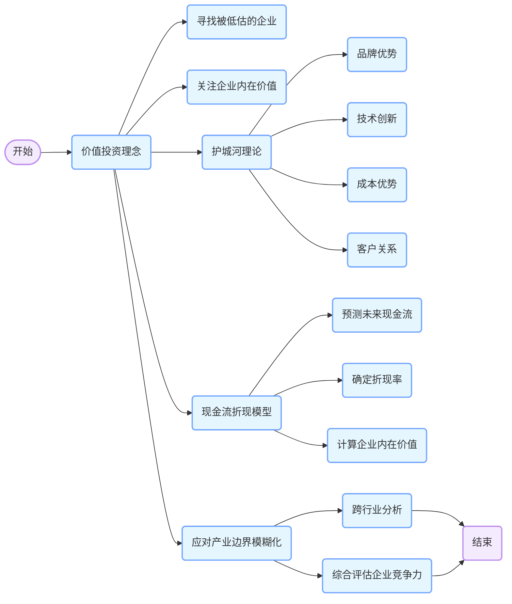

# 巴菲特的行业分析方法：应对产业边界模糊化的挑战

> 关键词：巴菲特、行业分析方法、产业边界模糊化、挑战应对、价值投资

> 摘要：本文聚焦于巴菲特的行业分析方法，在当今产业边界模糊化的大背景下，深入探讨该方法如何应对这一挑战。首先介绍相关背景知识，包括目的、预期读者等内容。接着阐述核心概念与联系，剖析核心算法原理并给出操作步骤，同时运用数学模型和公式进行详细说明。通过项目实战案例，展示该方法在实际中的应用。分析其实际应用场景，推荐相关工具和资源。最后总结未来发展趋势与挑战，解答常见问题并提供扩展阅读与参考资料，旨在为投资者和行业研究者提供全面深入的视角。

## 1. 背景介绍 
### 1.1 目的和范围
在当今快速发展的商业世界中，产业边界变得越来越模糊。不同行业之间的融合与渗透日益加剧，这给传统的行业分析方法带来了巨大的挑战。巴菲特作为全球知名的投资大师，他的行业分析方法一直备受关注。本文的目的在于深入研究巴菲特的行业分析方法，探讨其在产业边界模糊化背景下的有效性和适应性，以及如何利用该方法应对这一挑战。文章的范围涵盖了巴菲特行业分析方法的核心概念、算法原理、数学模型，通过实际案例展示其应用，并分析在不同场景下的应用效果，同时为读者提供相关的学习资源和工具推荐。

### 1.2 预期读者
本文预期读者主要包括投资者，无论是个人投资者还是专业投资机构的从业者，他们希望通过学习巴菲特的行业分析方法来提高投资决策的准确性和成功率。此外，行业研究者、企业管理者也可以从本文中获取有价值的信息，了解如何在产业边界模糊化的环境下进行行业分析和战略规划。对金融和投资领域感兴趣的学生和爱好者同样可以通过阅读本文，深入了解巴菲特的投资智慧和行业分析技巧。

### 1.3 文档结构概述
本文将按照以下结构进行阐述：首先介绍背景知识，让读者了解研究的目的、范围、预期读者和文档结构。接着深入探讨核心概念与联系，通过文本示意图和 Mermaid 流程图清晰展示相关概念的原理和架构。然后详细讲解核心算法原理和具体操作步骤，并结合 Python 源代码进行说明。运用数学模型和公式进一步剖析该方法的本质，并通过举例加深理解。通过项目实战案例，展示代码的实际实现和详细解释。分析该方法在实际中的应用场景，为读者提供实践参考。推荐相关的学习资源、开发工具框架和论文著作，帮助读者进一步深入学习。最后总结未来发展趋势与挑战，解答常见问题并提供扩展阅读与参考资料。

### 1.4 术语表
#### 1.4.1 核心术语定义
- **巴菲特行业分析方法**：是指巴菲特在长期投资实践中形成的一套用于评估行业和企业投资价值的方法，强调对企业内在价值的分析和对行业竞争格局的把握。
- **产业边界模糊化**：指不同产业之间的界限变得越来越不清晰，传统的行业分类标准难以准确界定企业的业务范围，企业可能同时涉足多个不同行业的业务。
- **价值投资**：一种投资理念，强调通过对企业基本面的分析，寻找被低估的股票并长期持有，以获得企业价值增长带来的收益。

#### 1.4.2 相关概念解释
- **护城河理论**：巴菲特提出的一个重要概念，指企业拥有的一种可持续的竞争优势，就像城堡周围的护城河一样，能够保护企业免受竞争对手的攻击，保持长期的盈利能力。
- **现金流折现模型**：一种用于评估企业内在价值的方法，通过预测企业未来的现金流，并将其折现到当前时刻，来确定企业的合理价值。

#### 1.4.3 缩略词列表
- **DCF**：Discounted Cash Flow，现金流折现。

## 2. 核心概念与联系 

### 核心概念原理
巴菲特的行业分析方法基于价值投资理念，核心在于寻找具有长期竞争优势和稳定现金流的企业。在产业边界模糊化的背景下，需要重新审视行业的定义和企业的竞争格局。传统的行业分析往往基于明确的行业边界，而现在企业的业务可能跨越多个行业，因此需要从更宏观的视角来分析企业的价值。

巴菲特强调关注企业的“护城河”，即企业的竞争优势。在产业边界模糊化的情况下，企业的“护城河”可能不再局限于传统的行业壁垒，而是来自于技术创新、品牌影响力、客户关系等多个方面。例如，科技公司可能通过技术创新进入金融领域，其技术优势就成为了在新领域竞争的“护城河”。

### 架构的文本示意图
```plaintext
巴菲特行业分析方法
|-- 价值投资理念
|   |-- 寻找被低估的企业
|   |-- 关注企业内在价值
|-- 护城河理论
|   |-- 品牌优势
|   |-- 技术创新
|   |-- 成本优势
|   |-- 客户关系
|-- 现金流折现模型
|   |-- 预测未来现金流
|   |-- 确定折现率
|   |-- 计算企业内在价值
|-- 应对产业边界模糊化
|   |-- 跨行业分析
|   |-- 综合评估企业竞争力
```

### Mermaid 流程图


## 3. 核心算法原理 & 具体操作步骤 

### 核心算法原理
巴菲特行业分析方法的核心算法原理主要基于现金流折现模型（DCF）。该模型的基本思想是，企业的价值等于其未来所有现金流的现值之和。通过预测企业未来的现金流，并选择合适的折现率将其折现到当前时刻，就可以得到企业的内在价值。

### 具体操作步骤
1. **预测未来现金流**：
    - 收集企业过去的财务数据，包括营业收入、净利润、现金流等。
    - 分析企业所处的行业环境和竞争格局，考虑宏观经济因素、行业发展趋势等。
    - 根据企业的业务模式和发展战略，预测未来几年的营业收入和净利润。
    - 通过调整净利润，考虑折旧、摊销、资本支出等因素，得到未来的自由现金流。

2. **确定折现率**：
    - 折现率反映了投资者对投资回报的要求，通常可以使用加权平均资本成本（WACC）来确定。
    - 计算债务成本和股权成本，债务成本可以根据企业的贷款利率来确定，股权成本可以使用资本资产定价模型（CAPM）来计算。
    - 根据企业的资本结构，确定债务和股权的权重，计算加权平均资本成本。

3. **计算企业内在价值**：
    - 将预测的未来现金流按照折现率进行折现，得到每年现金流的现值。
    - 将各年现金流的现值相加，得到企业的内在价值。

### Python 源代码实现
```python
import numpy as np

def predict_cash_flows(revenue_growth_rates, profit_margin, capex_ratio, depreciation_ratio):
    """
    预测未来现金流
    :param revenue_growth_rates: 营业收入增长率列表
    :param profit_margin: 净利润率
    :param capex_ratio: 资本支出占营业收入的比例
    :param depreciation_ratio: 折旧占营业收入的比例
    :return: 未来现金流列表
    """
    num_years = len(revenue_growth_rates)
    cash_flows = []
    revenue = 100  # 假设初始营业收入为 100
    for i in range(num_years):
        revenue *= (1 + revenue_growth_rates[i])
        net_income = revenue * profit_margin
        depreciation = revenue * depreciation_ratio
        capex = revenue * capex_ratio
        cash_flow = net_income + depreciation - capex
        cash_flows.append(cash_flow)
    return cash_flows

def calculate_wacc(debt_ratio, equity_ratio, debt_cost, equity_cost):
    """
    计算加权平均资本成本
    :param debt_ratio: 债务权重
    :param equity_ratio: 股权权重
    :param debt_cost: 债务成本
    :param equity_cost: 股权成本
    :return: 加权平均资本成本
    """
    return debt_ratio * debt_cost + equity_ratio * equity_cost

def calculate_intrinsic_value(cash_flows, discount_rate):
    """
    计算企业内在价值
    :param cash_flows: 未来现金流列表
    :param discount_rate: 折现率
    :return: 企业内在价值
    """
    present_values = []
    for i, cash_flow in enumerate(cash_flows):
        present_value = cash_flow / ((1 + discount_rate) ** (i + 1))
        present_values.append(present_value)
    return sum(present_values)

# 示例参数
revenue_growth_rates = [0.1, 0.08, 0.06, 0.05, 0.04]
profit_margin = 0.2
capex_ratio = 0.1
depreciation_ratio = 0.05
debt_ratio = 0.3
equity_ratio = 0.7
debt_cost = 0.05
equity_cost = 0.1
discount_rate = calculate_wacc(debt_ratio, equity_ratio, debt_cost, equity_cost)

# 预测未来现金流
cash_flows = predict_cash_flows(revenue_growth_rates, profit_margin, capex_ratio, depreciation_ratio)

# 计算企业内在价值
intrinsic_value = calculate_intrinsic_value(cash_flows, discount_rate)

print(f"企业内在价值: {intrinsic_value}")
```

## 4. 数学模型和公式 & 详细讲解 & 举例说明 

### 数学模型和公式
#### 现金流折现模型
企业的内在价值 $V$ 可以用以下公式表示：
$$V = \sum_{t=1}^{n} \frac{CF_t}{(1 + r)^t}$$
其中，$CF_t$ 表示第 $t$ 年的自由现金流，$r$ 表示折现率，$n$ 表示预测的年数。

#### 加权平均资本成本（WACC）
加权平均资本成本 $WACC$ 的计算公式为：
$$WACC = w_d \times r_d \times (1 - T) + w_e \times r_e$$
其中，$w_d$ 表示债务权重，$r_d$ 表示债务成本，$T$ 表示企业所得税税率，$w_e$ 表示股权权重，$r_e$ 表示股权成本。

### 详细讲解
现金流折现模型的核心思想是将企业未来的现金流按照一定的折现率折现到当前时刻，以反映货币的时间价值。折现率的选择非常重要，它反映了投资者对投资回报的要求和投资的风险程度。加权平均资本成本是一种常用的折现率计算方法，它考虑了企业的资本结构和债务、股权的成本。

### 举例说明
假设一家企业未来 5 年的自由现金流分别为 $100$ 万元、$110$ 万元、$120$ 万元、$130$ 万元、$140$ 万元，折现率为 $10\%$。则该企业的内在价值为：
$$V = \frac{100}{(1 + 0.1)^1} + \frac{110}{(1 + 0.1)^2} + \frac{120}{(1 + 0.1)^3} + \frac{130}{(1 + 0.1)^4} + \frac{140}{(1 + 0.1)^5}$$
$$V \approx 90.91 + 90.91 + 90.16 + 88.79 + 86.93$$
$$V \approx 447.7$$（万元）

假设该企业的债务权重为 $30\%$，债务成本为 $5\%$，股权权重为 $70\%$，股权成本为 $12\%$，企业所得税税率为 $25\%$。则加权平均资本成本为：
$$WACC = 0.3 \times 0.05 \times (1 - 0.25) + 0.7 \times 0.12$$
$$WACC = 0.01125 + 0.084$$
$$WACC = 0.09525 \approx 9.53\%$$

## 5. 项目实战：代码实际案例和详细解释说明 

### 5.1  开发环境搭建
- **Python 安装**：从 Python 官方网站（https://www.python.org/downloads/）下载并安装 Python 3.x 版本。
- **开发工具**：可以使用 PyCharm、Jupyter Notebook 等开发工具。这里以 Jupyter Notebook 为例，安装 Anaconda 集成开发环境，它包含了 Python 和常用的科学计算库。

### 5.2  源代码详细实现和代码解读
```python
import numpy as np

def predict_cash_flows(revenue_growth_rates, profit_margin, capex_ratio, depreciation_ratio):
    """
    预测未来现金流
    :param revenue_growth_rates: 营业收入增长率列表
    :param profit_margin: 净利润率
    :param capex_ratio: 资本支出占营业收入的比例
    :param depreciation_ratio: 折旧占营业收入的比例
    :return: 未来现金流列表
    """
    num_years = len(revenue_growth_rates)
    cash_flows = []
    revenue = 100  # 假设初始营业收入为 100
    for i in range(num_years):
        revenue *= (1 + revenue_growth_rates[i])
        net_income = revenue * profit_margin
        depreciation = revenue * depreciation_ratio
        capex = revenue * capex_ratio
        cash_flow = net_income + depreciation - capex
        cash_flows.append(cash_flow)
    return cash_flows

def calculate_wacc(debt_ratio, equity_ratio, debt_cost, equity_cost):
    """
    计算加权平均资本成本
    :param debt_ratio: 债务权重
    :param equity_ratio: 股权权重
    :param debt_cost: 债务成本
    :param equity_cost: 股权成本
    :return: 加权平均资本成本
    """
    return debt_ratio * debt_cost + equity_ratio * equity_cost

def calculate_intrinsic_value(cash_flows, discount_rate):
    """
    计算企业内在价值
    :param cash_flows: 未来现金流列表
    :param discount_rate: 折现率
    :return: 企业内在价值
    """
    present_values = []
    for i, cash_flow in enumerate(cash_flows):
        present_value = cash_flow / ((1 + discount_rate) ** (i + 1))
        present_values.append(present_value)
    return sum(present_values)

# 示例参数
revenue_growth_rates = [0.1, 0.08, 0.06, 0.05, 0.04]
profit_margin = 0.2
capex_ratio = 0.1
depreciation_ratio = 0.05
debt_ratio = 0.3
equity_ratio = 0.7
debt_cost = 0.05
equity_cost = 0.1
discount_rate = calculate_wacc(debt_ratio, equity_ratio, debt_cost, equity_cost)

# 预测未来现金流
cash_flows = predict_cash_flows(revenue_growth_rates, profit_margin, capex_ratio, depreciation_ratio)

# 计算企业内在价值
intrinsic_value = calculate_intrinsic_value(cash_flows, discount_rate)

print(f"企业内在价值: {intrinsic_value}")
```

### 代码解读与分析
- **predict_cash_flows 函数**：该函数用于预测未来现金流。它接受营业收入增长率列表、净利润率、资本支出占营业收入的比例和折旧占营业收入的比例作为输入。通过迭代计算每年的营业收入、净利润、折旧和资本支出，最终得到每年的自由现金流。
- **calculate_wacc 函数**：该函数用于计算加权平均资本成本。它接受债务权重、股权权重、债务成本和股权成本作为输入，根据加权平均资本成本的公式进行计算。
- **calculate_intrinsic_value 函数**：该函数用于计算企业内在价值。它接受未来现金流列表和折现率作为输入，通过将每年的现金流折现到当前时刻并求和，得到企业的内在价值。

在主程序中，我们设置了示例参数，调用上述函数进行未来现金流预测和企业内在价值计算，并输出结果。

## 6. 实际应用场景 
### 股票投资
在股票投资中，投资者可以使用巴菲特的行业分析方法来评估企业的投资价值。通过分析企业的行业地位、竞争优势、现金流等因素，预测企业未来的发展前景，并计算其内在价值。如果股票的市场价格低于其内在价值，则可以考虑买入该股票。例如，当科技公司跨界进入金融领域时，投资者可以通过跨行业分析，评估该公司在新领域的竞争力和发展潜力，从而做出更准确的投资决策。

### 企业并购
在企业并购过程中，收购方需要对目标企业进行全面的评估。巴菲特的行业分析方法可以帮助收购方了解目标企业所处的行业环境和竞争格局，评估其核心竞争力和未来发展潜力。通过计算目标企业的内在价值，收购方可以确定合理的收购价格，避免过高的收购成本。例如，一家传统制造业企业计划收购一家具有先进技术的科技企业，通过运用该方法可以更好地评估科技企业的价值和协同效应。

### 战略规划
企业在制定战略规划时，可以借鉴巴菲特的行业分析方法。通过分析行业趋势和竞争格局，企业可以识别自身的优势和劣势，寻找新的发展机会。例如，当产业边界模糊化时，企业可以通过跨行业分析，发现与自身业务相关的新兴领域，从而制定多元化发展战略。

## 7. 工具和资源推荐
### 7.1 学习资源推荐
#### 7.1.1 书籍推荐
- 《聪明的投资者》（The Intelligent Investor）：作者本杰明·格雷厄姆（Benjamin Graham），是巴菲特的导师，这本书是价值投资的经典之作，介绍了价值投资的基本理念和方法。
- 《巴菲特致股东的信：股份公司教程》（Letters to Shareholders of Berkshire Hathaway）：收录了巴菲特多年来致股东的信，从中可以了解巴菲特的投资哲学和行业分析方法。
- 《穷查理宝典：查理·芒格的智慧箴言录》（Poor Charlie's Almanack: The Wit and Wisdom of Charles T. Munger）：查理·芒格是巴菲特的长期合作伙伴，这本书介绍了芒格的多元思维模型和投资智慧。

#### 7.1.2 在线课程
- Coursera 平台上的“投资学原理”课程：由知名大学教授授课，系统介绍了投资学的基本原理和方法，包括行业分析和价值评估。
- edX 平台上的“金融市场”课程：深入讲解了金融市场的运作机制和投资策略，对理解巴菲特的投资方法有很大帮助。

#### 7.1.3 技术博客和网站
- 雪球网：是国内知名的投资社区，有很多投资者分享自己的投资经验和行业分析报告，可以从中学习到不同的投资观点和方法。
- Seeking Alpha：是国外的投资研究网站，提供大量的股票分析和行业研究报告，对全球市场的分析较为深入。

### 7.2 开发工具框架推荐
#### 7.2.1 IDE和编辑器
- PyCharm：是一款专业的 Python 集成开发环境，具有强大的代码编辑、调试和自动补全功能，适合开发复杂的数据分析和金融模型。
- Jupyter Notebook：是一个交互式的开发环境，支持多种编程语言，方便进行数据可视化和模型验证，适合进行快速的数据分析和实验。

#### 7.2.2 调试和性能分析工具
- pdb：是 Python 自带的调试工具，可以帮助开发者逐步执行代码，查看变量的值和程序的执行流程，方便排查代码中的错误。
- cProfile：是 Python 的性能分析工具，可以分析代码的运行时间和函数调用次数，帮助开发者找出性能瓶颈。

#### 7.2.3 相关框架和库
- Pandas：是 Python 的数据处理库，提供了高效的数据结构和数据处理方法，适合进行财务数据的分析和处理。
- NumPy：是 Python 的科学计算库，提供了高性能的多维数组对象和数学函数，在金融模型计算中经常使用。

### 7.3 相关论文著作推荐
#### 7.3.1 经典论文
- 《证券分析》（Security Analysis）：本杰明·格雷厄姆和大卫·多德（David Dodd）著，是价值投资领域的经典论文，奠定了价值投资的理论基础。
- 《有效市场假说》（Efficient Markets Hypothesis）：尤金·法玛（Eugene F. Fama）提出，探讨了市场效率和股票价格的形成机制，对投资决策有重要影响。

#### 7.3.2 最新研究成果
- 《行为金融学》相关研究：探讨了投资者的心理和行为对投资决策的影响，有助于理解市场的非理性波动和巴菲特的投资哲学。
- 《产业融合与创新》相关研究：关注产业边界模糊化的现象和趋势，分析企业在产业融合背景下的创新策略和竞争优势。

#### 7.3.3 应用案例分析
- 关于巴菲特投资案例的分析报告：深入研究巴菲特在不同行业的投资决策过程和方法，总结其成功经验和教训。
- 企业跨行业发展的案例研究：分析企业在产业边界模糊化背景下的跨行业发展战略和实践效果，为企业和投资者提供参考。

## 8. 总结：未来发展趋势与挑战
### 未来发展趋势
- **产业融合加速**：随着科技的不断进步和市场需求的变化，产业边界将进一步模糊，不同行业之间的融合将更加深入。例如，人工智能、大数据等技术将与金融、医疗、教育等行业深度融合，创造出更多的新业态和新模式。
- **数字化转型**：企业将加快数字化转型的步伐，利用数字技术提升运营效率、创新业务模式和增强竞争力。在这个过程中，行业的竞争格局将发生变化，传统企业需要适应新的技术环境和市场需求。
- **绿色可持续发展**：社会对环境保护和可持续发展的关注度不断提高，企业将面临更多的环境和社会责任要求。这将促使企业在战略规划和投资决策中更加注重可持续发展因素，推动相关行业的发展。

### 挑战
- **信息复杂性增加**：产业边界模糊化导致企业的业务范围更加广泛，信息来源更加复杂。投资者和企业管理者需要处理更多的信息，准确评估企业的价值和风险变得更加困难。
- **竞争加剧**：产业融合使得不同行业的企业之间竞争加剧，传统的行业壁垒被打破。企业需要不断创新和提升竞争力，以应对来自不同领域的竞争对手。
- **技术更新换代快**：科技的快速发展使得技术更新换代的速度加快，企业需要不断投入研发资源，跟上技术发展的步伐。否则，可能会面临被市场淘汰的风险。

## 9. 附录：常见问题与解答
### 问题 1：如何准确预测企业的未来现金流？
解答：预测企业的未来现金流需要综合考虑多个因素。首先，要收集企业过去的财务数据，分析其历史业绩和发展趋势。其次，要关注企业所处的行业环境和竞争格局，考虑宏观经济因素、行业政策等对企业的影响。此外，还需要了解企业的业务模式和发展战略，评估其未来的市场份额和盈利能力。可以采用多种方法进行预测，如趋势分析、情景分析等，并结合专家意见和市场调研结果进行修正。

### 问题 2：折现率的选择对企业内在价值的计算有多大影响？
解答：折现率的选择对企业内在价值的计算有很大影响。折现率反映了投资者对投资回报的要求和投资的风险程度。折现率越高，未来现金流的现值就越低，企业的内在价值也就越低；反之，折现率越低，企业的内在价值就越高。因此，在选择折现率时，需要综合考虑企业的风险特征、市场利率水平等因素，确保折现率能够合理反映投资的风险和回报。

### 问题 3：在产业边界模糊化的情况下，如何判断企业的“护城河”是否依然存在？
解答：在产业边界模糊化的情况下，判断企业的“护城河”是否依然存在需要从多个方面进行分析。首先，要关注企业的核心竞争力，如品牌影响力、技术创新能力、成本优势等是否依然具有优势。其次，要分析企业在新的行业领域中的适应能力和竞争优势，看其是否能够将原有的“护城河”延伸到新的业务中。此外，还需要关注企业的客户关系和市场份额，判断其是否能够在新的竞争环境中保持稳定的客户群体和市场地位。

## 10. 扩展阅读 & 参考资料
### 扩展阅读
- 《创新者的窘境》（The Innovator's Dilemma）：作者克莱顿·克里斯坦森（Clayton M. Christensen），探讨了企业在面对技术创新和市场变化时的困境和应对策略。
- 《黑天鹅：如何应对不可预知的未来》（The Black Swan: The Impact of the Highly Improbable）：作者纳西姆·尼古拉斯·塔勒布（Nassim Nicholas Taleb），分析了不可预测的重大事件对市场和投资的影响。

### 参考资料
- 巴菲特历年致股东的信：可以从伯克希尔·哈撒韦公司的官方网站获取。
- 金融数据提供商的报告：如 Bloomberg、Wind 等，提供了大量的企业财务数据和行业研究报告。

作者：AI天才研究院/AI Genius Institute & 禅与计算机程序设计艺术 /Zen And The Art of Computer Programming