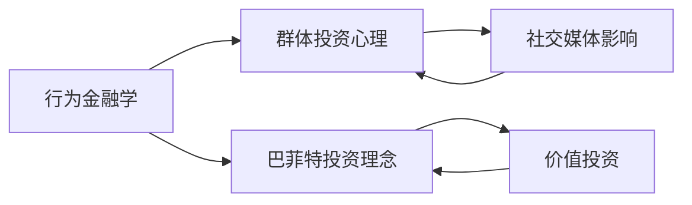

# 巴菲特的行为金融学应用：社交媒体时代的群体投资心理

> 关键词：巴菲特、行为金融学、社交媒体、群体投资心理、投资决策

> 摘要：本文深入探讨了巴菲特在行为金融学领域的应用，结合社交媒体时代群体投资心理的特点展开分析。首先介绍了研究的背景、目的、预期读者等内容。接着阐述了行为金融学、群体投资心理等核心概念及其联系，给出了相应的原理和架构示意图。详细讲解了涉及的核心算法原理，并使用Python代码进行了说明。引入数学模型和公式来解释相关现象，通过实际案例进行举例。在项目实战部分，搭建开发环境，给出源代码并进行详细解读。分析了社交媒体时代群体投资心理在实际中的应用场景，推荐了相关的学习资源、开发工具和论文著作。最后总结了未来发展趋势与挑战，解答常见问题并提供扩展阅读和参考资料。

## 1. 背景介绍 
### 1.1 目的和范围
在当今社交媒体高度发达的时代，信息传播的速度和范围都达到了前所未有的程度。群体投资心理在社交媒体的影响下呈现出与以往不同的特点。巴菲特作为投资界的传奇人物，其投资理念中蕴含着丰富的行为金融学智慧。本研究的目的在于深入剖析巴菲特的行为金融学应用，并探讨在社交媒体时代群体投资心理对投资决策的影响。研究范围涵盖了行为金融学的基本理论、巴菲特的投资策略、社交媒体的传播机制以及群体投资心理的形成和演变。

### 1.2 预期读者
本文预期读者包括金融投资领域的从业者，如基金经理、股票分析师等，他们可以从本文中获取新的投资思路和对群体投资心理的深入理解；对投资感兴趣的个人投资者，帮助他们更好地认识自己和市场中的投资行为；以及金融和经济领域的研究人员，为他们的学术研究提供参考。

### 1.3 文档结构概述
本文首先介绍背景信息，让读者了解研究的目的和意义。接着阐述核心概念与联系，为后续的分析奠定基础。然后讲解核心算法原理和具体操作步骤，通过Python代码进行详细说明。引入数学模型和公式进一步解释现象，并举例说明。在项目实战部分，搭建开发环境，实现源代码并进行解读。分析实际应用场景，推荐相关的工具和资源。最后总结未来发展趋势与挑战，解答常见问题并提供扩展阅读和参考资料。

### 1.4 术语表
#### 1.4.1 核心术语定义
- **行为金融学**：是将心理学、社会学等学科的研究成果引入金融领域，研究投资者在金融市场中的决策行为和心理特征的学科。
- **群体投资心理**：指在投资过程中，投资者受到群体的影响而产生的共同的心理倾向和行为模式。
- **社交媒体**：是指允许人们创建、分享和交流信息的在线平台和应用程序，如微博、微信、推特等。

#### 1.4.2 相关概念解释
- **羊群效应**：在投资领域，羊群效应是指投资者盲目跟随群体的投资决策，而不考虑自己的分析和判断。在社交媒体时代，羊群效应可能会因为信息的快速传播而更加明显。
- **过度自信**：投资者往往对自己的投资能力和判断过于自信，高估自己获得信息的准确性和分析能力，从而做出不合理的投资决策。

#### 1.4.3 缩略词列表
- **AI**：Artificial Intelligence，人工智能
- **ML**：Machine Learning，机器学习

## 2. 核心概念与联系 
### 2.1 行为金融学原理
行为金融学认为，投资者并非完全理性的经济人，他们的决策会受到心理、情感和认知偏差的影响。例如，投资者可能会因为过度自信而高估自己的投资能力，或者因为损失厌恶而不愿意卖出亏损的股票。行为金融学的研究旨在揭示这些非理性行为的规律，并为投资者提供更合理的投资建议。

### 2.2 群体投资心理的形成
在社交媒体时代，群体投资心理的形成受到多种因素的影响。社交媒体上的信息传播迅速且广泛，投资者很容易受到他人观点和投资决策的影响。此外，社交媒体上的群体互动也会增强投资者的归属感和认同感，从而促使他们跟随群体的投资行为。

### 2.3 巴菲特的行为金融学应用
巴菲特的投资理念中体现了许多行为金融学的思想。他强调要保持理性，不受市场情绪的影响，坚持价值投资。例如，当市场恐慌时，他会寻找被低估的股票进行投资；而当市场过热时，他会保持冷静，避免盲目跟风。

### 2.4 核心概念架构示意图


## 3. 核心算法原理 & 具体操作步骤 
### 3.1 情绪分析算法原理
在社交媒体时代，通过分析投资者在社交媒体上的言论和情绪，可以了解群体投资心理的变化。一种常用的情绪分析算法是基于机器学习的文本分类算法。具体步骤如下：
1. **数据收集**：从社交媒体平台上收集与投资相关的文本数据。
2. **数据预处理**：对收集到的文本数据进行清洗、分词、去除停用词等处理。
3. **特征提取**：从预处理后的文本中提取特征，如词频、词性等。
4. **模型训练**：使用标注好的数据集对机器学习模型进行训练，如朴素贝叶斯分类器、支持向量机等。
5. **情绪预测**：使用训练好的模型对新的文本数据进行情绪预测，判断其为积极、消极或中性情绪。

### 3.2 Python代码实现
```python
import pandas as pd
from sklearn.feature_extraction.text import TfidfVectorizer
from sklearn.naive_bayes import MultinomialNB
from sklearn.model_selection import train_test_split
from sklearn.metrics import accuracy_score

# 数据收集（假设已经有一个包含文本和情绪标签的CSV文件）
data = pd.read_csv('investment_sentiment.csv')

# 数据预处理
X = data['text']
y = data['sentiment']

# 特征提取
vectorizer = TfidfVectorizer()
X = vectorizer.fit_transform(X)

# 划分训练集和测试集
X_train, X_test, y_train, y_test = train_test_split(X, y, test_size=0.2, random_state=42)

# 模型训练
model = MultinomialNB()
model.fit(X_train, y_train)

# 情绪预测
y_pred = model.predict(X_test)

# 模型评估
accuracy = accuracy_score(y_test, y_pred)
print(f"模型准确率: {accuracy}")
```

### 3.3 具体操作步骤
1. 安装所需的Python库，如pandas、scikit-learn等。
2. 准备包含文本和情绪标签的数据集，并保存为CSV文件。
3. 运行上述代码，对数据进行处理、模型训练和情绪预测。
4. 根据模型的准确率评估模型的性能，并可以根据需要调整模型的参数或更换模型。

## 4. 数学模型和公式 & 详细讲解 & 举例说明 
### 4.1 羊群效应模型
羊群效应可以用以下数学模型来描述。假设市场中有 $n$ 个投资者，第 $i$ 个投资者的投资决策 $x_i$ 可以表示为：
$$x_i = \alpha_i + \beta \frac{1}{n-1} \sum_{j\neq i} x_j + \epsilon_i$$
其中，$\alpha_i$ 表示第 $i$ 个投资者的个人判断，$\beta$ 表示羊群效应的强度，$\epsilon_i$ 表示随机误差。

### 4.2 详细讲解
在这个模型中，投资者的投资决策不仅受到自己的个人判断的影响，还受到其他投资者决策的影响。当 $\beta$ 较大时，羊群效应较强，投资者更容易跟随群体的决策；当 $\beta$ 较小时，羊群效应较弱，投资者更倾向于根据自己的判断做出决策。

### 4.3 举例说明
假设市场中有 3 个投资者，他们的个人判断分别为 $\alpha_1 = 1$，$\alpha_2 = 2$，$\alpha_3 = 3$，羊群效应强度 $\beta = 0.5$。初始时，投资者 1 的决策 $x_1 = 1$，投资者 2 的决策 $x_2 = 2$，投资者 3 的决策 $x_3 = 3$。

根据上述公式，投资者 1 的下一次决策为：
$$x_1' = \alpha_1 + \beta \frac{x_2 + x_3}{2} + \epsilon_1 = 1 + 0.5 \frac{2 + 3}{2} + \epsilon_1 = 1 + 1.25 + \epsilon_1 = 2.25 + \epsilon_1$$

可以看到，投资者 1 的决策受到了其他投资者决策的影响。随着时间的推移，投资者的决策会逐渐趋于一致，表现出羊群效应。

## 5. 项目实战：代码实际案例和详细解释说明 
### 5.1  开发环境搭建
1. **安装Python**：从Python官方网站（https://www.python.org/downloads/）下载并安装Python 3.x版本。
2. **安装必要的库**：使用pip命令安装所需的库，如pandas、scikit-learn、numpy等。
```sh
pip install pandas scikit-learn numpy
```
3. **安装开发工具**：可以选择使用PyCharm、Jupyter Notebook等开发工具。

### 5.2  源代码详细实现和代码解读
```python
import pandas as pd
from sklearn.feature_extraction.text import CountVectorizer
from sklearn.linear_model import LogisticRegression
from sklearn.model_selection import cross_val_score

# 数据加载
data = pd.read_csv('social_media_investment_data.csv')

# 提取特征和标签
X = data['post_text']
y = data['investment_intention']

# 特征提取
vectorizer = CountVectorizer()
X = vectorizer.fit_transform(X)

# 模型选择和训练
model = LogisticRegression()
scores = cross_val_score(model, X, y, cv=5)

# 输出交叉验证得分
print(f"交叉验证平均得分: {scores.mean()}")
```
### 代码解读：
1. **数据加载**：使用pandas库的`read_csv`函数加载包含社交媒体帖子文本和投资意向标签的CSV文件。
2. **特征提取**：使用`CountVectorizer`将文本数据转换为数值特征，它会统计每个单词在文本中出现的次数。
3. **模型选择和训练**：选择逻辑回归模型进行训练，并使用交叉验证来评估模型的性能。
4. **输出结果**：打印交叉验证的平均得分，用于评估模型的准确性。

### 5.3  代码解读与分析
- **特征提取**：`CountVectorizer`是一种简单而有效的文本特征提取方法，它将文本转换为词频矩阵。这种方法的优点是简单易懂，计算速度快；缺点是没有考虑单词的语义信息。
- **模型选择**：逻辑回归是一种常用的分类模型，它具有简单、可解释性强的优点。在这个项目中，逻辑回归可以用于预测投资者的投资意向。
- **交叉验证**：使用交叉验证可以更准确地评估模型的性能，避免过拟合和欠拟合的问题。通过将数据集划分为多个子集，分别进行训练和测试，可以得到更稳定的模型评估结果。

## 6. 实际应用场景 
### 6.1 投资决策辅助
在社交媒体时代，投资者可以通过分析社交媒体上的群体投资心理来辅助自己的投资决策。例如，当社交媒体上出现大量关于某只股票的积极言论时，投资者可以进一步研究该股票的基本面，判断是否值得投资。但同时，投资者也要警惕羊群效应，避免盲目跟风。

### 6.2 市场趋势预测
通过监测社交媒体上的情绪变化和群体投资心理的动态，可以预测市场的短期趋势。例如，当社交媒体上的负面情绪急剧增加时，可能预示着市场将出现下跌趋势。金融机构和投资者可以根据这些预测提前调整投资组合。

### 6.3 风险预警
社交媒体上的群体投资心理也可以作为风险预警的指标。当市场上出现过度乐观或过度悲观的情绪时，可能意味着市场存在较大的风险。监管机构和金融机构可以及时采取措施，防范系统性风险的发生。

## 7. 工具和资源推荐
### 7.1 学习资源推荐
#### 7.1.1 书籍推荐
- 《行为金融学》：这本书系统地介绍了行为金融学的基本理论和研究方法，是学习行为金融学的经典教材。
- 《聪明的投资者》：巴菲特的老师格雷厄姆所著，书中阐述了价值投资的理念和方法，对理解巴菲特的投资思想有很大帮助。
- 《金融心理学》：从心理学的角度分析金融市场中的投资者行为，对于理解群体投资心理有重要的参考价值。

#### 7.1.2 在线课程
- Coursera上的“行为金融学”课程：由知名教授授课，内容涵盖了行为金融学的各个方面。
- edX上的“投资学原理”课程：介绍了投资的基本原理和方法，包括行为金融学在投资中的应用。

#### 7.1.3 技术博客和网站
- 雪球网：是一个投资交流社区，投资者可以在上面分享自己的投资经验和观点，了解市场动态。
- 东方财富网：提供丰富的金融信息和数据，包括股票行情、财经新闻等。

### 7.2 开发工具框架推荐
#### 7.2.1 IDE和编辑器
- PyCharm：是一款专业的Python集成开发环境，具有代码编辑、调试、自动补全等功能，适合开发Python项目。
- Jupyter Notebook：是一个交互式的开发环境，支持Python、R等多种编程语言，适合进行数据分析和模型训练。

#### 7.2.2 调试和性能分析工具
- Py-Spy：是一个用于Python程序性能分析的工具，可以帮助开发者找出程序中的性能瓶颈。
- PDB：是Python自带的调试器，可以帮助开发者调试Python代码。

#### 7.2.3 相关框架和库
- scikit-learn：是一个常用的机器学习库，提供了丰富的机器学习算法和工具，如分类、回归、聚类等。
- NLTK：是一个自然语言处理库，用于处理文本数据，如分词、词性标注、情感分析等。

### 7.3 相关论文著作推荐
#### 7.3.1 经典论文
- “The Psychology of Capital-Market Behavior”：这篇论文最早提出了行为金融学的概念，探讨了投资者的心理因素对资本市场的影响。
- “Prospect Theory: An Analysis of Decision under Risk”：提出了前景理论，解释了投资者在面对风险时的决策行为。

#### 7.3.2 最新研究成果
- 近年来，关于社交媒体对群体投资心理影响的研究逐渐增多。可以关注《Journal of Financial Economics》《Review of Financial Studies》等金融领域的顶级期刊，获取最新的研究成果。

#### 7.3.3 应用案例分析
- 一些金融机构和研究机构会发布关于行为金融学应用的案例分析报告，可以通过这些报告了解行为金融学在实际投资中的应用情况。

## 8. 总结：未来发展趋势与挑战
### 8.1 未来发展趋势
- **技术融合**：随着人工智能、大数据等技术的不断发展，行为金融学将与这些技术更加紧密地融合。例如，利用人工智能算法分析社交媒体上的海量数据，更准确地把握群体投资心理。
- **个性化投资**：根据投资者的个人心理特征和行为模式，提供个性化的投资建议和服务将成为未来的发展方向。
- **跨学科研究**：行为金融学将与心理学、社会学、神经科学等学科进行更深入的跨学科研究，拓展其理论和应用范围。

### 8.2 挑战
- **数据质量和隐私问题**：在收集和分析社交媒体数据时，数据质量和隐私保护是需要解决的重要问题。不准确的数据可能会导致错误的分析结果，而侵犯用户隐私则会引发法律和道德问题。
- **模型的有效性**：虽然已经有很多行为金融学模型，但这些模型在实际应用中的有效性还需要进一步验证。市场环境的复杂性和投资者行为的不确定性给模型的构建和应用带来了挑战。
- **投资者教育**：提高投资者的行为金融学素养，让他们认识到自己的认知偏差和非理性行为，是一个长期而艰巨的任务。

## 9. 附录：常见问题与解答
### 9.1 行为金融学和传统金融学有什么区别？
传统金融学假设投资者是完全理性的，市场是有效的；而行为金融学认为投资者会受到心理、情感和认知偏差的影响，市场并非总是有效。行为金融学更注重研究投资者的实际行为和决策过程。

### 9.2 如何避免羊群效应？
投资者可以通过加强自己的投资知识学习，提高独立分析和判断能力。在做出投资决策时，要充分考虑自己的投资目标和风险承受能力，不要盲目跟随群体的决策。同时，要保持冷静和理性，不受市场情绪的影响。

### 9.3 社交媒体上的信息都可信吗？
社交媒体上的信息来源广泛，质量参差不齐。投资者在参考社交媒体上的信息时，要保持警惕，对信息进行筛选和核实。可以参考多个来源的信息，结合自己的分析和判断，做出合理的投资决策。

## 10. 扩展阅读 & 参考资料
### 10.1 扩展阅读
- 《思考，快与慢》：作者丹尼尔·卡尼曼是行为经济学领域的重要人物，这本书介绍了人类思维的两种模式，对理解投资者的决策行为有很大帮助。
- 《非理性繁荣》：探讨了金融市场中的泡沫现象和投资者的非理性行为，对于防范金融风险有重要的启示。

### 10.2 参考资料
- 相关的学术论文和研究报告，如《Journal of Behavioral Finance》《Journal of Financial Markets》等期刊上的文章。
- 金融机构和研究机构发布的行业报告和研究成果。

作者：AI天才研究院/AI Genius Institute & 禅与计算机程序设计艺术 /Zen And The Art of Computer Programming