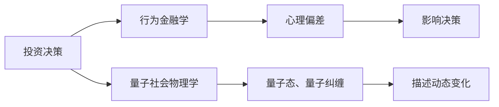

# 巴菲特的行为金融学应用：量子社会物理学在投资决策中的运用

> 关键词：巴菲特、行为金融学、量子社会物理学、投资决策、金融市场

> 摘要：本文深入探讨了巴菲特的投资策略中行为金融学的应用，并创新性地研究了量子社会物理学在投资决策过程中的运用。首先介绍了行为金融学和量子社会物理学的背景知识，阐述其与投资决策的联系。接着详细剖析相关核心概念、算法原理、数学模型及公式。通过项目实战展示如何将这些理论应用于实际投资场景，分析其在不同实际应用场景中的作用。同时推荐了学习和实践所需的工具和资源，最后对未来发展趋势与挑战进行总结，旨在为投资者和金融研究人员提供全面且深入的理论与实践指导。

## 1. 背景介绍 
### 1.1 目的和范围
本文章的主要目的是深入研究巴菲特的投资决策方法中行为金融学的体现，并探索量子社会物理学这一新兴理论在投资决策中的具体运用。范围涵盖从理论基础的阐述到实际应用案例的分析，旨在为投资者提供更全面、科学的投资决策思路，同时为金融领域的研究人员提供新的研究视角和方向。

### 1.2 预期读者
预期读者包括对投资决策感兴趣的投资者，无论是个人投资者还是机构投资者；金融领域的研究人员，如金融分析师、学者等；以及对新兴金融理论和跨学科研究有兴趣的专业人士。

### 1.3 文档结构概述
本文首先介绍相关理论的背景知识，包括术语定义和概念解释。接着阐述核心概念及其联系，用示意图和流程图展示其架构。然后深入讲解核心算法原理和具体操作步骤，结合 Python 代码进行说明。再介绍数学模型和公式，并举例详细讲解。通过项目实战展示理论在实际中的应用，分析代码实现和解读。探讨实际应用场景，推荐学习和实践所需的工具和资源。最后总结未来发展趋势与挑战，解答常见问题并提供扩展阅读和参考资料。

### 1.4 术语表
#### 1.4.1 核心术语定义
- **行为金融学**：是将心理学、社会学等学科的理论融入到金融学中，研究投资者在决策过程中的认知、情感、态度等心理特征，以及由此引起的市场非有效性的学科。
- **量子社会物理学**：是将量子物理学的概念和方法应用于社会科学领域，研究社会系统中个体行为和群体行为的学科，在金融领域可用于分析投资者行为和市场动态。
- **投资决策**：指投资者为了实现其预期的投资目标，运用一定的科学理论、方法和手段，通过一定的程序对投资的必要性、投资目标、投资规模、投资方向、投资结构、投资成本与收益等经济活动中重大问题所进行的分析、判断和方案选择。

#### 1.4.2 相关概念解释
- **市场非有效性**：传统金融学认为市场是有效的，即价格反映了所有可用信息。但行为金融学认为，由于投资者的非理性行为，市场价格可能偏离其内在价值，出现市场非有效性。
- **量子态**：在量子物理学中，量子态描述了微观粒子的状态。在量子社会物理学中，可类比为投资者的心理状态或市场的状态。

#### 1.4.3 缩略词列表
- **EMH**：有效市场假说（Efficient Market Hypothesis）
- **BF**：行为金融学（Behavioral Finance）

## 2. 核心概念与联系 

### 行为金融学核心概念
行为金融学主要关注投资者的心理偏差和认知局限对投资决策的影响。常见的心理偏差包括过度自信、损失厌恶、羊群效应等。过度自信使得投资者高估自己的能力和信息的准确性，从而做出过于激进的投资决策；损失厌恶导致投资者对损失的感受比收益更为强烈，在决策时倾向于避免损失；羊群效应则是指投资者在信息不确定的情况下，倾向于跟随大多数人的决策，而不是基于自己的分析。

### 量子社会物理学核心概念
量子社会物理学将量子力学中的一些概念引入到社会科学研究中。例如，量子态可以用来描述投资者的心理状态或市场的状态。投资者的决策可以看作是从一个量子态跃迁到另一个量子态的过程。量子纠缠的概念可以类比为投资者之间的相互影响，一个投资者的决策可能会影响到其他投资者的决策，即使他们之间没有直接的信息交流。

### 两者与投资决策的联系
行为金融学为投资决策提供了一种基于投资者心理和行为的分析视角，帮助投资者更好地理解市场的非有效性和价格波动的原因。量子社会物理学则从更微观的层面，通过量子态和量子纠缠等概念，描述投资者之间的相互作用和市场的动态变化。两者结合可以更全面地分析投资决策过程，为投资者提供更准确的决策依据。

### 文本示意图
```plaintext
         投资决策
        /         \
  行为金融学     量子社会物理学
  |              |
心理偏差       量子态、量子纠缠
  |              |
影响决策       描述动态变化
```

### Mermaid 流程图


## 3. 核心算法原理 & 具体操作步骤 

### 行为金融学算法原理
行为金融学中的一个重要算法是基于投资者情绪的市场预测算法。投资者的情绪可以通过社交媒体、新闻报道等渠道进行量化。例如，可以使用文本挖掘技术对社交媒体上的金融相关言论进行情感分析，将言论分为积极、消极和中性三类。然后根据情绪指标的变化来预测市场的走势。

以下是一个简单的 Python 代码示例，用于对社交媒体文本进行情感分析：
```python
import nltk
from nltk.sentiment import SentimentIntensityAnalyzer

# 下载情感分析所需的数据
nltk.download('vader_lexicon')

# 初始化情感分析器
sia = SentimentIntensityAnalyzer()

# 示例文本
text = "The stock market is looking great today!"

# 进行情感分析
sentiment = sia.polarity_scores(text)

# 输出结果
print(sentiment)
```
### 具体操作步骤
1. **数据收集**：收集社交媒体、新闻报道等渠道的金融相关文本数据。
2. **数据预处理**：对文本数据进行清洗，去除噪声和无用信息。
3. **情感分析**：使用情感分析工具对文本进行分析，得到情感指标。
4. **市场预测**：根据情感指标的变化，结合历史数据和其他市场因素，预测市场的走势。

### 量子社会物理学算法原理
量子社会物理学中的一个算法是基于量子态演化的投资者行为模拟算法。该算法通过模拟投资者的量子态演化过程，来预测投资者的决策行为。投资者的量子态可以用一个向量来表示，向量的每个分量表示投资者在不同决策状态下的概率。量子态的演化可以通过量子力学中的薛定谔方程来描述。

以下是一个简化的 Python 代码示例，用于模拟投资者的量子态演化：
```python
import numpy as np

# 定义初始量子态
initial_state = np.array([0.5, 0.5])

# 定义演化矩阵
evolution_matrix = np.array([[0.8, 0.2], [0.2, 0.8]])

# 模拟量子态演化
evolved_state = np.dot(evolution_matrix, initial_state)

# 输出结果
print(evolved_state)
```
### 具体操作步骤
1. **定义初始量子态**：根据投资者的初始状态，定义其量子态向量。
2. **定义演化矩阵**：根据市场环境和投资者之间的相互作用，定义量子态的演化矩阵。
3. **模拟量子态演化**：使用演化矩阵对初始量子态进行演化，得到新的量子态。
4. **预测投资者决策**：根据新的量子态，预测投资者的决策行为。

## 4. 数学模型和公式 & 详细讲解 & 举例说明 

### 行为金融学数学模型
行为金融学中的一个重要数学模型是前景理论（Prospect Theory）。前景理论由丹尼尔·卡尼曼（Daniel Kahneman）和阿莫斯·特沃斯基（Amos Tversky）提出，用于描述投资者在面对风险和不确定性时的决策行为。

前景理论的价值函数公式为：
$$
v(x) = 
\begin{cases}
x^{\alpha} & \text{if } x \geq 0 \\
-\lambda(-x)^{\beta} & \text{if } x < 0
\end{cases}
$$
其中，$x$ 表示收益或损失，$\alpha$ 和 $\beta$ 是小于 1 的正数，$\lambda$ 是损失厌恶系数，通常大于 1。

### 详细讲解
前景理论认为，投资者对收益和损失的感受是不对称的。在收益区域，价值函数是凹函数，表明投资者对收益的边际效用递减；在损失区域，价值函数是凸函数，表明投资者对损失的边际负效用递增。损失厌恶系数 $\lambda$ 表示投资者对损失的厌恶程度，$\lambda$ 越大，投资者对损失越敏感。

### 举例说明
假设一个投资者面临两个投资选择：选项 A 有 50% 的概率获得 100 元收益，50% 的概率损失 50 元；选项 B 有 100% 的概率获得 20 元收益。根据前景理论，投资者会根据价值函数来计算每个选项的价值。

设 $\alpha = 0.88$，$\beta = 0.88$，$\lambda = 2.25$。

对于选项 A：
$$
V_A = 0.5 \times 100^{0.88} + 0.5 \times (-2.25) \times (-50)^{0.88}
$$

对于选项 B：
$$
V_B = 20^{0.88}
$$

通过比较 $V_A$ 和 $V_B$ 的大小，投资者可以做出决策。

### 量子社会物理学数学模型
量子社会物理学中的一个重要数学模型是基于量子态的市场动态模型。该模型使用量子态来描述市场的状态，市场的演化可以通过量子态的演化来描述。

量子态的演化可以用薛定谔方程来描述：
$$
i\hbar\frac{\partial}{\partial t}|\psi(t)\rangle = H|\psi(t)\rangle
$$
其中，$|\psi(t)\rangle$ 表示市场的量子态，$H$ 是哈密顿量，表示市场的演化算子，$\hbar$ 是约化普朗克常数。

### 详细讲解
薛定谔方程描述了量子态随时间的演化。哈密顿量 $H$ 包含了市场的各种信息，如投资者之间的相互作用、市场的宏观经济环境等。通过求解薛定谔方程，可以得到市场量子态随时间的变化，从而预测市场的走势。

### 举例说明
假设一个简单的市场，只有两个投资者，市场的量子态可以用一个二维向量表示。哈密顿量 $H$ 可以表示为一个 $2 \times 2$ 的矩阵。通过求解薛定谔方程，可以得到市场量子态随时间的变化，从而预测投资者的决策行为和市场的走势。

## 5. 项目实战：代码实际案例和详细解释说明 

### 5.1  开发环境搭建
为了实现基于行为金融学和量子社会物理学的投资决策系统，我们需要搭建以下开发环境：
- **编程语言**：Python
- **开发工具**：PyCharm 或 Jupyter Notebook
- **所需库**：`nltk`（用于文本处理和情感分析）、`numpy`（用于数值计算）、`pandas`（用于数据处理）、`matplotlib`（用于数据可视化）

### 5.2  源代码详细实现和代码解读
以下是一个综合行为金融学和量子社会物理学的投资决策系统的代码示例：
```python
import nltk
from nltk.sentiment import SentimentIntensityAnalyzer
import numpy as np
import pandas as pd
import matplotlib.pyplot as plt

# 下载情感分析所需的数据
nltk.download('vader_lexicon')

# 初始化情感分析器
sia = SentimentIntensityAnalyzer()

# 定义初始量子态
initial_state = np.array([0.5, 0.5])

# 定义演化矩阵
evolution_matrix = np.array([[0.8, 0.2], [0.2, 0.8]])

# 模拟市场数据
market_data = pd.DataFrame({
    'text': [
        "The stock market is looking great today!",
        "The market is going down. Be careful!",
        "Stocks are performing well. Time to invest!"
    ]
})

# 进行情感分析
market_data['sentiment'] = market_data['text'].apply(lambda x: sia.polarity_scores(x)['compound'])

# 模拟量子态演化
evolved_states = []
current_state = initial_state
for sentiment in market_data['sentiment']:
    # 根据情感指标调整演化矩阵
    if sentiment > 0:
        adjusted_evolution_matrix = np.array([[0.9, 0.1], [0.1, 0.9]])
    else:
        adjusted_evolution_matrix = np.array([[0.7, 0.3], [0.3, 0.7]])
    
    # 进行量子态演化
    current_state = np.dot(adjusted_evolution_matrix, current_state)
    evolved_states.append(current_state)

# 可视化量子态演化
evolved_states = np.array(evolved_states)
plt.plot(evolved_states[:, 0], label='State 1')
plt.plot(evolved_states[:, 1], label='State 2')
plt.xlabel('Time')
plt.ylabel('Probability')
plt.title('Quantum State Evolution')
plt.legend()
plt.show()
```
### 5.3  代码解读与分析
1. **数据模拟**：使用 `pandas` 库模拟市场数据，包括社交媒体文本。
2. **情感分析**：使用 `nltk` 库的情感分析器对社交媒体文本进行情感分析，得到情感指标。
3. **量子态演化**：根据情感指标调整演化矩阵，然后使用演化矩阵对初始量子态进行演化，得到新的量子态。
4. **可视化**：使用 `matplotlib` 库将量子态的演化过程可视化，帮助我们直观地观察市场状态的变化。

通过这个项目实战，我们可以看到如何将行为金融学和量子社会物理学的理论应用于实际投资决策系统中，通过情感分析和量子态演化来预测市场走势和投资者决策行为。

## 6. 实际应用场景 
### 股票投资
在股票投资中，行为金融学可以帮助投资者识别市场中的非理性行为，如过度反应和反应不足，从而找到被低估或高估的股票。量子社会物理学可以用于分析投资者之间的相互影响，预测股票价格的波动。例如，当社交媒体上的投资者情绪普遍乐观时，根据行为金融学，股票价格可能会被高估；根据量子社会物理学，投资者之间的相互影响可能会导致股票价格进一步上涨。投资者可以根据这些分析结果，做出合理的投资决策。

### 基金投资
在基金投资中，行为金融学可以帮助投资者分析基金经理的投资行为和心理偏差，选择具有良好投资策略和风险控制能力的基金。量子社会物理学可以用于分析基金投资者的群体行为，预测基金的申购和赎回情况。例如，当市场出现大幅波动时，根据行为金融学，基金投资者可能会出现恐慌性赎回；根据量子社会物理学，投资者之间的相互影响可能会加剧这种赎回行为。基金公司可以根据这些分析结果，提前做好流动性管理。

### 风险管理
在风险管理中，行为金融学可以帮助投资者识别和评估市场中的风险因素，如投资者情绪波动、羊群效应等。量子社会物理学可以用于分析风险的传播和扩散机制，预测风险事件的发生概率和影响范围。例如，当金融市场出现系统性风险时，根据行为金融学，投资者的恐慌情绪可能会导致市场崩溃；根据量子社会物理学，风险可能会通过投资者之间的相互影响迅速传播。投资者可以根据这些分析结果，采取相应的风险控制措施，如分散投资、设置止损点等。

## 7. 工具和资源推荐
### 7.1 学习资源推荐
#### 7.1.1 书籍推荐
- 《思考，快与慢》（丹尼尔·卡尼曼著）：介绍了人类思维的两种模式，以及它们在决策过程中的影响，是行为金融学的经典著作。
- 《金融心理学》（拉斯·特维德著）：从心理学的角度分析金融市场的运行规律，帮助读者理解投资者的行为和心理。
- 《量子社会科学》（相关学者著）：系统介绍了量子社会物理学的基本理论和应用，为读者提供了深入学习的资料。

#### 7.1.2 在线课程
- Coursera 上的“行为金融学”课程：由知名教授授课，系统讲解行为金融学的理论和应用。
- edX 上的“量子物理学基础”课程：帮助读者掌握量子物理学的基本概念和方法，为学习量子社会物理学打下基础。

#### 7.1.3 技术博客和网站
- 金融界网站：提供丰富的金融资讯和分析文章，帮助读者了解市场动态和投资策略。
- 知乎上的金融话题：聚集了众多金融领域的专家和爱好者，读者可以在上面交流和学习。

### 7.2 开发工具框架推荐
#### 7.2.1 IDE和编辑器
- PyCharm：功能强大的 Python 集成开发环境，提供代码编辑、调试、版本控制等功能。
- Jupyter Notebook：交互式的开发环境，适合进行数据分析和模型验证。

#### 7.2.2 调试和性能分析工具
- `pdb`：Python 自带的调试工具，帮助开发者定位和解决代码中的问题。
- `c