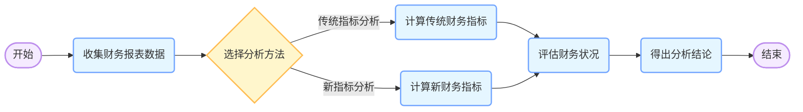

# 巴菲特的财务报表分析：解读量子科技初创公司的新指标

> 关键词：巴菲特财务报表分析、量子科技初创公司、财务指标、新指标解读、投资分析

> 摘要：本文旨在探讨如何运用巴菲特式的财务报表分析方法来解读量子科技初创公司的财务状况，并提出适用于此类公司的新指标。首先介绍了研究的背景、目的、预期读者等内容。接着阐述了核心概念，包括量子科技初创公司特点及与传统公司财务分析的联系。详细讲解了核心算法原理及具体操作步骤，通过 Python 代码进行说明。同时给出了相关数学模型和公式，并举例分析。通过项目实战展示了如何搭建开发环境、实现代码及解读代码。分析了量子科技初创公司财务报表分析的实际应用场景，推荐了学习资源、开发工具框架和相关论文著作。最后总结了未来发展趋势与挑战，解答了常见问题，并提供了扩展阅读和参考资料，以期为投资者和分析师在评估量子科技初创公司时提供全面且深入的指导。

## 1. 背景介绍 
### 1.1 目的和范围
本研究的主要目的是将巴菲特的财务报表分析方法应用于量子科技初创公司，探索并确定适合此类新兴企业的财务分析新指标。随着量子科技的快速发展，大量初创公司涌现，但传统的财务分析指标可能无法准确反映这些公司的真实价值和发展潜力。我们将深入研究量子科技初创公司的财务报表，结合巴菲特注重长期价值、现金流和盈利能力等理念，开发出更具针对性的分析指标，帮助投资者、分析师和企业管理者更好地评估量子科技初创公司的财务健康状况和投资价值。
研究范围涵盖了量子科技初创公司的各类财务报表，包括资产负债表、利润表和现金流量表。同时，会考虑量子科技行业的特点，如研发投入、技术创新能力、市场前景等因素对财务指标的影响。

### 1.2 预期读者
本文的预期读者主要包括以下几类人群：
1. **投资者**：对量子科技领域感兴趣的个人和机构投资者，希望通过财务报表分析来评估初创公司的投资价值，做出更明智的投资决策。
2. **财务分析师**：负责分析量子科技初创公司财务状况的专业人士，需要掌握适合该行业的分析方法和指标，为客户提供准确的分析报告。
3. **企业管理者**：量子科技初创公司的管理人员，通过了解财务分析方法和新指标，更好地掌握公司的财务状况，制定合理的发展战略。
4. **学术研究人员**：对量子科技和财务分析交叉领域进行研究的学者，本文可为他们的研究提供参考和思路。

### 1.3 文档结构概述
本文将按照以下结构进行阐述：
1. **核心概念与联系**：介绍量子科技初创公司的核心概念、特点以及与传统公司财务分析的联系，通过文本示意图和 Mermaid 流程图展示。
2. **核心算法原理 & 具体操作步骤**：详细讲解用于分析量子科技初创公司财务报表的核心算法原理，并给出 Python 源代码实现及具体操作步骤。
3. **数学模型和公式 & 详细讲解 & 举例说明**：建立适用于量子科技初创公司的数学模型和公式，进行详细讲解，并通过实际例子进行说明。
4. **项目实战：代码实际案例和详细解释说明**：通过一个实际的项目案例，展示如何搭建开发环境、实现代码以及对代码进行解读和分析。
5. **实际应用场景**：分析量子科技初创公司财务报表分析在不同场景下的应用，如投资决策、企业战略规划等。
6. **工具和资源推荐**：推荐学习量子科技和财务分析相关的书籍、在线课程、技术博客和网站，以及开发工具框架和相关论文著作。
7. **总结：未来发展趋势与挑战**：总结量子科技初创公司财务报表分析的未来发展趋势，分析可能面临的挑战。
8. **附录：常见问题与解答**：解答读者在阅读本文过程中可能遇到的常见问题。
9. **扩展阅读 & 参考资料**：提供与量子科技和财务分析相关的扩展阅读材料和参考资料。

### 1.4 术语表
#### 1.4.1 核心术语定义
1. **量子科技初创公司**：指专注于量子计算、量子通信、量子测量等量子科技领域，处于创业初期阶段的企业，通常具有较高的技术创新性和发展潜力，但也面临较大的不确定性和风险。
2. **财务报表分析**：通过对企业财务报表中的数据进行收集、整理、计算和分析，评估企业的财务状况、经营成果和现金流量，为决策提供依据的过程。
3. **新指标**：针对量子科技初创公司的特点，在传统财务指标基础上开发的，能够更准确反映其价值和发展潜力的财务分析指标。

#### 1.4.2 相关概念解释
1. **研发投入强度**：指企业在一定时期内的研发投入占营业收入的比例，反映了企业对技术创新的重视程度和投入水平。
2. **技术创新能力**：量子科技初创公司在量子技术领域的研发能力、专利数量、技术领先程度等方面的综合表现，是评估其核心竞争力的重要因素。
3. **市场前景**：量子科技产品或服务在未来市场中的需求、竞争状况和发展趋势，对企业的盈利能力和发展潜力有重要影响。

#### 1.4.3 缩略词列表
1. **R&D**：Research and Development，研发。
2. **EBITDA**：Earnings Before Interest, Taxes, Depreciation, and Amortization，息税折旧摊销前利润。

## 2. 核心概念与联系 

### 2.1 量子科技初创公司的特点
量子科技初创公司具有以下显著特点：
1. **高研发投入**：为了在量子技术领域取得突破和创新，这些公司需要投入大量的资金用于研发，研发投入通常占营业收入的比例较高。
2. **技术不确定性**：量子科技仍处于发展阶段，技术还不够成熟，存在较大的不确定性。公司的研发项目可能面临失败的风险，导致前期投入无法获得预期回报。
3. **长周期回报**：由于量子技术的研发和商业化过程较为漫长，初创公司可能需要较长时间才能实现盈利，投资者需要有足够的耐心等待回报。
4. **潜在高价值**：一旦量子科技取得重大突破并实现商业化应用，相关公司可能获得巨大的市场份额和利润，具有潜在的高价值。

### 2.2 与传统公司财务分析的联系
虽然量子科技初创公司具有独特的特点，但传统的财务分析方法仍然具有一定的借鉴意义。例如，资产负债表可以反映公司的资产结构和偿债能力，利润表可以展示公司的经营成果和盈利能力，现金流量表可以体现公司的现金收支情况和资金流动性。然而，由于量子科技初创公司的特殊性，传统指标可能无法全面准确地评估其价值和发展潜力，需要引入新的指标进行补充和完善。

### 2.3 文本示意图
```plaintext
量子科技初创公司财务分析
|-- 传统财务指标
|   |-- 资产负债率
|   |-- 毛利率
|   |-- 净利率
|-- 新指标
|   |-- 研发投入强度
|   |-- 技术创新指数
|   |-- 市场前景评估指标
```

### 2.4 Mermaid 流程图


## 3. 核心算法原理 & 具体操作步骤 

### 3.1 核心算法原理
我们将重点介绍几个核心算法来计算新的财务分析指标，这些指标将有助于更准确地评估量子科技初创公司的价值和发展潜力。

#### 3.1.1 研发投入强度算法
研发投入强度是衡量企业对研发重视程度和投入水平的重要指标，计算公式为：
$$研发投入强度 = \frac{研发投入}{营业收入} \times 100\%$$

#### 3.1.2 技术创新指数算法
技术创新指数综合考虑了企业的专利数量、研发人员占比等因素，计算公式为：
$$技术创新指数 = 专利数量权重 \times 专利数量 + 研发人员占比权重 \times 研发人员占比$$
其中，专利数量权重和研发人员占比权重可以根据实际情况进行设定。

#### 3.1.3 市场前景评估指标算法
市场前景评估指标可以通过分析市场规模增长率、市场份额等因素来计算，计算公式为：
$$市场前景评估指标 = 市场规模增长率权重 \times 市场规模增长率 + 市场份额权重 \times 市场份额$$
同样，市场规模增长率权重和市场份额权重可以根据实际情况进行调整。

### 3.2 具体操作步骤

#### 3.2.1 数据收集
首先，需要收集量子科技初创公司的财务报表数据，包括研发投入、营业收入、专利数量、研发人员数量、员工总数、市场规模增长率、市场份额等信息。这些数据可以从公司的年度报告、财务报表、行业研究报告等渠道获取。

#### 3.2.2 数据预处理
对收集到的数据进行预处理，包括数据清洗、缺失值处理、异常值处理等操作，确保数据的准确性和可靠性。

#### 3.2.3 指标计算
使用上述算法公式，计算研发投入强度、技术创新指数和市场前景评估指标等新的财务分析指标。

#### 3.2.4 结果分析
根据计算得到的指标值，对量子科技初创公司的财务状况、技术创新能力和市场前景进行分析和评估，为投资决策和企业战略规划提供参考。

### 3.3 Python 源代码实现
```python
# 假设已经收集到相关数据
research_and_development = 1000000  # 研发投入
operating_income = 5000000  # 营业收入
patent_count = 10  # 专利数量
r_d_staff_count = 50  # 研发人员数量
total_staff_count = 200  # 员工总数
market_growth_rate = 0.2  # 市场规模增长率
market_share = 0.1  # 市场份额

# 定义权重
patent_weight = 0.6
r_d_staff_weight = 0.4
market_growth_rate_weight = 0.7
market_share_weight = 0.3

# 计算研发投入强度
r_d_intensity = (research_and_development / operating_income) * 100

# 计算研发人员占比
r_d_staff_ratio = r_d_staff_count / total_staff_count

# 计算技术创新指数
technology_innovation_index = patent_weight * patent_count + r_d_staff_weight * r_d_staff_ratio

# 计算市场前景评估指标
market_prospect_index = market_growth_rate_weight * market_growth_rate + market_share_weight * market_share

# 输出结果
print(f"研发投入强度: {r_d_intensity}%")
print(f"技术创新指数: {technology_innovation_index}")
print(f"市场前景评估指标: {market_prospect_index}")
```

## 4. 数学模型和公式 & 详细讲解 & 举例说明 

### 4.1 研发投入强度
#### 4.1.1 公式
$$研发投入强度 = \frac{研发投入}{营业收入} \times 100\%$$

#### 4.1.2 详细讲解
研发投入强度反映了企业在研发方面的投入占营业收入的比例，该指标越高，说明企业对技术创新的重视程度越高，投入的资源越多。对于量子科技初创公司来说，高研发投入强度是必要的，因为量子技术的研发需要大量的资金和人力投入。通过持续的研发投入，公司有望在量子技术领域取得突破，提高自身的核心竞争力。

#### 4.1.3 举例说明
假设一家量子科技初创公司在某一年的研发投入为 500 万元，营业收入为 2000 万元，则该公司的研发投入强度为：
$$研发投入强度 = \frac{500}{2000} \times 100\% = 25\%$$
这表明该公司将 25% 的营业收入用于研发，显示出其对技术创新的重视。

### 4.2 技术创新指数
#### 4.2.1 公式
$$技术创新指数 = 专利数量权重 \times 专利数量 + 研发人员占比权重 \times 研发人员占比$$

#### 4.2.2 详细讲解
技术创新指数综合考虑了企业的专利数量和研发人员占比两个因素。专利数量是企业技术创新成果的重要体现，专利数量越多，说明企业在技术领域的创新能力越强。研发人员占比反映了企业对研发人才的重视程度，研发人员占比越高，企业的研发实力越强。通过设定不同的权重，可以根据实际情况调整两个因素对技术创新指数的影响程度。

#### 4.2.3 举例说明
假设专利数量权重为 0.6，研发人员占比权重为 0.4，某量子科技初创公司的专利数量为 15 项，研发人员数量为 60 人，员工总数为 200 人。则该公司的研发人员占比为：
$$研发人员占比 = \frac{60}{200} = 0.3$$
技术创新指数为：
$$技术创新指数 = 0.6 \times 15 + 0.4 \times 0.3 = 9 + 0.12 = 9.12$$
该指数越高，说明公司的技术创新能力越强。

### 4.3 市场前景评估指标
#### 4.3.1 公式
$$市场前景评估指标 = 市场规模增长率权重 \times 市场规模增长率 + 市场份额权重 \times 市场份额$$

#### 4.3.2 详细讲解
市场前景评估指标综合考虑了市场规模增长率和市场份额两个因素。市场规模增长率反映了市场的发展趋势，增长率越高，说明市场前景越好。市场份额反映了企业在市场中的竞争地位，市场份额越高，企业的竞争力越强。通过设定不同的权重，可以根据实际情况调整两个因素对市场前景评估指标的影响程度。

#### 4.3.3 举例说明
假设市场规模增长率权重为 0.7，市场份额权重为 0.3，某量子科技初创公司所处市场的规模增长率为 30%，该公司的市场份额为 5%。则市场前景评估指标为：
$$市场前景评估指标 = 0.7 \times 0.3 + 0.3 \times 0.05 = 0.21 + 0.015 = 0.225$$
该指标越高，说明公司的市场前景越好。

## 5. 项目实战：代码实际案例和详细解释说明 

### 5.1  开发环境搭建
#### 5.1.1 安装 Python
首先，需要安装 Python 编程语言。可以从 Python 官方网站（https://www.python.org/downloads/）下载适合自己操作系统的 Python 版本，并按照安装向导进行安装。

#### 5.1.2 安装必要的库
在本项目中，我们只需要使用 Python 的内置库，无需额外安装第三方库。

#### 5.1.3 选择开发工具
可以选择使用任意的 Python 开发工具，如 PyCharm、VS Code 等。这里以 VS Code 为例，在 VS Code 中安装 Python 扩展，以便更好地进行 Python 代码的编写和调试。

### 5.2  源代码详细实现和代码解读
```python
# 导入必要的库
# 由于本项目只使用 Python 内置库，无需导入额外的库

# 定义数据收集函数
def collect_data():
    # 这里可以根据实际情况从文件、数据库或网络接口获取数据
    # 为了简单起见，我们直接定义数据
    research_and_development = 800000  # 研发投入
    operating_income = 4000000  # 营业收入
    patent_count = 8  # 专利数量
    r_d_staff_count = 40  # 研发人员数量
    total_staff_count = 150  # 员工总数
    market_growth_rate = 0.25  # 市场规模增长率
    market_share = 0.08  # 市场份额
    return research_and_development, operating_income, patent_count, r_d_staff_count, total_staff_count, market_growth_rate, market_share

# 定义指标计算函数
def calculate_metrics(research_and_development, operating_income, patent_count, r_d_staff_count, total_staff_count, market_growth_rate, market_share):
    # 定义权重
    patent_weight = 0.6
    r_d_staff_weight = 0.4
    market_growth_rate_weight = 0.7
    market_share_weight = 0.3

    # 计算研发投入强度
    r_d_intensity = (research_and_development / operating_income) * 100

    # 计算研发人员占比
    r_d_staff_ratio = r_d_staff_count / total_staff_count

    # 计算技术创新指数
    technology_innovation_index = patent_weight * patent_count + r_d_staff_weight * r_d_staff_ratio

    # 计算市场前景评估指标
    market_prospect_index = market_growth_rate_weight * market_growth_rate + market_share_weight * market_share

    return r_d_intensity, technology_innovation_index, market_prospect_index

# 主函数
def main():
    # 收集数据
    research_and_development, operating_income, patent_count, r_d_staff_count, total_staff_count, market_growth_rate, market_share = collect_data()

    # 计算指标
    r_d_intensity, technology_innovation_index, market_prospect_index = calculate_metrics(research_and_development, operating_income, patent_count, r_d_staff_count, total_staff_count, market_growth_rate, market_share)

    # 输出结果
    print(f"研发投入强度: {r_d_intensity}%")
    print(f"技术创新指数: {technology_innovation_index}")
    print(f"市场前景评估指标: {market_prospect_index}")

if __name__ == "__main__":
    main()
```

### 5.3  代码解读与分析
#### 5.3.1 数据收集函数 `collect_data`
该函数用于收集量子科技初创公司的相关数据，包括研发投入、营业收入、专利数量、研发人员数量、员工总数、市场规模增长率和市场份额。在实际应用中，可以根据需要从文件、数据库或网络接口获取数据。

#### 5.3.2 指标计算函数 `calculate_metrics`
该函数根据收集到的数据，计算研发投入强度、技术创新指数和市场前景评估指标。在函数内部，首先定义了各个指标的权重，然后根据前面介绍的公式进行计算。

#### 5.3.3 主函数 `main`
主函数是程序的入口，它调用 `collect_data` 函数收集数据，调用 `calculate_metrics` 函数计算指标，并将计算结果输出。

通过以上代码，我们可以方便地对量子科技初创公司的财务状况进行分析和评估。

## 6. 实际应用场景 
### 6.1 投资决策
对于投资者来说，在评估量子科技初创公司是否值得投资时，传统的财务指标可能无法满足需求。通过运用本文提出的新指标，如研发投入强度、技术创新指数和市场前景评估指标，可以更全面地了解公司的技术实力、创新能力和市场潜力。例如，如果一家公司的研发投入强度较高，技术创新指数也较高，同时市场前景评估指标显示市场前景良好，那么该公司可能具有较高的投资价值。

### 6.2 企业战略规划
量子科技初创公司的管理者可以利用这些新指标来制定企业的战略规划。通过分析研发投入强度，管理者可以了解公司在研发方面的投入是否足够，是否需要调整研发策略。技术创新指数可以帮助管理者评估公司的技术创新能力，找出优势和不足，有针对性地进行改进。市场前景评估指标可以为管理者提供市场趋势和竞争状况的信息，指导公司制定市场拓展策略。

### 6.3 行业分析
行业分析师可以使用这些新指标对量子科技初创公司进行行业分析。通过比较不同公司的指标值，可以了解行业内各公司的竞争力和发展潜力，评估行业的整体发展态势。这有助于分析师为行业内的企业提供专业的建议和指导，也可以为投资者提供行业研究报告，帮助他们做出更明智的投资决策。

## 7. 工具和资源推荐
### 7.1 学习资源推荐
#### 7.1.1 书籍推荐
1. 《财务报表分析从入门到精通》：本书详细介绍了财务报表分析的基本方法和技巧，适合初学者入门。
2. 《巴菲特致股东的信：投资者和公司高管教程》：巴菲特的经典著作，通过阅读这本书可以了解巴菲特的投资理念和财务分析方法。
3. 《量子计算与量子信息》：对于想要深入了解量子科技的读者来说，这本书是一本很好的入门教材。

#### 7.1.2 在线课程
1. Coursera 上的“财务报表分析”课程：由知名大学的教授授课，系统地讲解了财务报表分析的理论和实践。
2. edX 上的“量子计算基础”课程：介绍了量子计算的基本概念和原理，适合对量子科技感兴趣的初学者。
3. Udemy 上的“Python 财务数据分析”课程：通过实际案例，讲解如何使用 Python 进行财务数据分析。

#### 7.1.3 技术博客和网站
1. Seeking Alpha：提供各种金融分析和投资研究文章，包括对初创公司的分析。
2. Quantum Computing Report：专注于量子计算领域的新闻和分析，提供行业最新动态。
3. Investopedia：一个综合性的金融知识网站，提供财务分析、投资等方面的知识和教程。

### 7.2 开发工具框架推荐
#### 7.2.1 IDE和编辑器
1. PyCharm：一款专业的 Python 集成开发环境，提供代码编辑、调试、版本控制等功能，适合开发大型 Python 项目。
2. VS Code：一款轻量级的代码编辑器，支持多种编程语言，通过安装 Python 扩展可以方便地进行 Python 开发。
3. Jupyter Notebook：一种交互式的开发环境，适合进行数据分析和可视化，支持 Python、R 等多种编程语言。

#### 7.2.2 调试和性能分析工具
1. pdb：Python 内置的调试器，可以帮助开发者在代码中设置断点、查看变量值等，进行代码调试。
2. cProfile：Python 内置的性能分析工具，可以分析代码的运行时间和函数调用次数，找出性能瓶颈。
3. Py-Spy：一个用于分析 Python 程序性能的工具，可以实时查看 Python 程序的 CPU 使用情况和函数调用栈。

#### 7.2.3 相关框架和库
1. Pandas：一个强大的数据分析库，提供了数据结构和数据分析工具，方便进行数据处理和分析。
2. NumPy：用于科学计算的基础库，提供了高效的数组操作和数学函数。
3. Matplotlib：一个用于数据可视化的库，可以绘制各种类型的图表，如折线图、柱状图、散点图等。

### 7.3 相关论文著作推荐
#### 7.3.1 经典论文
1. "The Security of Practical Quantum Key Distribution"：该论文对量子密钥分发的安全性进行了深入研究，是量子通信领域的经典论文。
2. "Quantum Computing in the NISQ era and beyond"：探讨了当前量子计算技术的发展现状和未来趋势，具有重要的参考价值。
3. "Financial Statement Analysis and Security Valuation"：介绍了财务报表分析在证券估值中的应用，是财务分析领域的经典之作。

#### 7.3.2 最新研究成果
可以通过学术数据库，如 IEEE Xplore、ACM Digital Library、ScienceDirect 等，搜索关于量子科技和财务分析的最新研究论文。这些论文通常反映了该领域的最新研究动态和成果。

#### 7.3.3 应用案例分析
一些知名的商业研究机构和咨询公司会发布关于量子科技初创公司的应用案例分析报告。例如，麦肯锡、波士顿咨询集团等公司的报告可以提供实际案例和行业洞察，帮助读者更好地理解量子科技初创公司的财务分析和发展策略。

## 8. 总结：未来发展趋势与挑战
### 8.1 未来发展趋势
1. **指标体系不断完善**：随着量子科技的不断发展和研究的深入，适用于量子科技初创公司的财务分析指标体系将不断完善。新的指标可能会不断涌现，以更准确地反映公司的价值和发展潜力。
2. **与人工智能融合**：人工智能技术在财务分析中的应用将越来越广泛。通过机器学习和深度学习算法，可以对量子科技初创公司的财务数据进行更深入的分析和预测，提高分析的准确性和效率。
3. **国际化合作加强**：量子科技是一个全球性的研究领域，各国的量子科技初创公司之间的合作将不断加强。在财务分析方面，也需要考虑国际化的因素，建立统一的分析标准和指标体系。

### 8.2 挑战
1. **数据获取困难**：量子科技初创公司的财务数据可能不够透明和完整，特别是一些关键信息，如研发项目的进展情况、技术创新的具体成果等，可能难以获取。这给财务分析带来了一定的困难。
2. **技术更新换代快**：量子科技领域的技术更新换代非常快，新的技术和产品不断涌现。这使得财务分析指标需要及时调整和更新，以适应技术的发展变化。
3. **风险评估难度大**：量子科技初创公司面临着较高的技术风险、市场风险和竞争风险。准确评估这些风险对公司财务状况的影响是一个挑战，需要建立更完善的风险评估模型。

## 9. 附录：常见问题与解答
### 9.1 如何确定新指标的权重？
新指标的权重可以根据实际情况进行设定。一般来说，可以参考行业经验、专家意见和历史数据。例如，在确定技术创新指数的权重时，如果认为专利数量更能反映企业的技术创新能力，可以适当提高专利数量的权重。同时，也可以通过敏感性分析等方法，对不同权重设置下的指标结果进行比较，选择最合适的权重。

### 9.2 新指标是否可以完全替代传统财务指标？
新指标不能完全替代传统财务指标。传统财务指标如资产负债率、毛利率、净利率等，仍然可以反映企业的基本财务状况和经营成果。新指标是在传统指标的基础上进行补充和完善，更侧重于反映量子科技初创公司的特点和发展潜力。在进行财务分析时，应该综合运用传统指标和新指标，以获得更全面的信息。

### 9.3 如何处理数据缺失的情况？
当遇到数据缺失的情况时，可以采用以下方法进行处理：
1. **删除缺失数据**：如果缺失数据的比例较小，可以直接删除包含缺失数据的记录。但这种方法可能会导致数据量减少，影响分析结果的准确性。
2. **插补法**：可以使用均值、中位数、众数等统计量对缺失数据进行插补。也可以使用更复杂的方法，如回归分析、机器学习算法等进行插补。
3. **估计法**：根据已有的数据和相关信息，对缺失数据进行估计。例如，如果缺失研发投入数据，可以根据公司的历史研发投入比例和营业收入进行估计。

## 10. 扩展阅读 & 参考资料
### 10.1 扩展阅读
1. 《创新者的窘境》：探讨了创新对企业发展的影响，对于理解量子科技初创公司的发展模式和面临的挑战有一定的帮助。
2. 《智能时代》：介绍了人工智能和大数据等新兴技术的发展趋势和应用，与量子科技有一定的关联。
3. 《财务分析与决策》：进一步深入讲解了财务分析的方法和应用，适合对财务分析有更高要求的读者。

### 10.2 参考资料
1. 各量子科技初创公司的年度报告和财务报表。
2. 行业研究报告，如市场调研机构发布的量子科技行业报告。
3. 相关学术论文和研究成果，可通过学术数据库获取。

作者：AI天才研究院/AI Genius Institute & 禅与计算机程序设计艺术 /Zen And The Art of Computer Programming