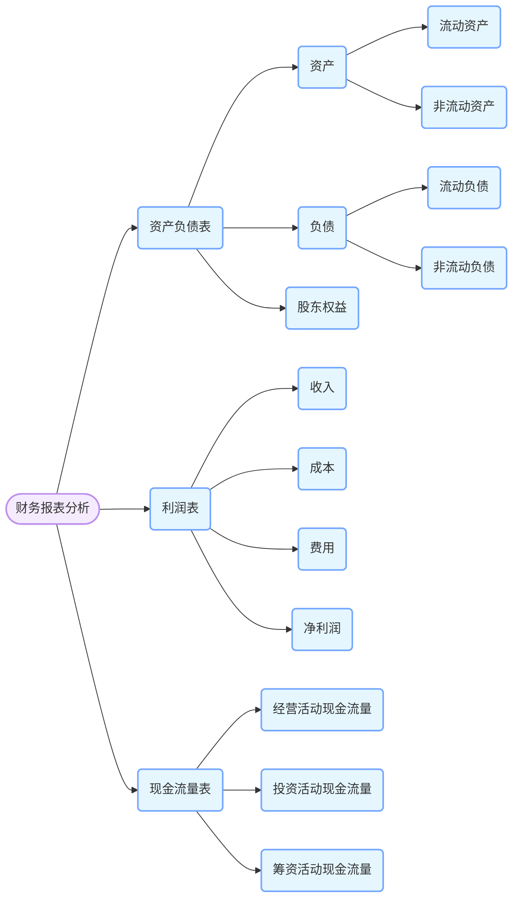

# 巴菲特的财务报表深度解析：洞察公司真实价值

> 关键词：巴菲特、财务报表、公司真实价值、财务分析、价值投资

> 摘要：本文旨在深入探讨巴菲特如何通过对财务报表的深度解析来洞察公司的真实价值。从背景介绍出发，阐述目的、预期读者等内容，接着详细讲解财务报表分析的核心概念、算法原理、数学模型等理论知识，再通过项目实战给出实际案例和代码实现，分析其在不同场景的实际应用，推荐相关工具和资源，最后总结未来发展趋势与挑战，并提供常见问题解答和扩展阅读资料，帮助读者掌握通过财务报表评估公司价值的方法。

## 1. 背景介绍 
### 1.1 目的和范围
本文章的目的是深入剖析巴菲特在投资过程中对财务报表进行深度解析的方法和理念，帮助读者学会运用这些方法洞察公司的真实价值。范围涵盖了财务报表的各个方面，包括资产负债表、利润表、现金流量表等，同时结合实际案例和相关技术手段，详细讲解如何从这些报表中提取有价值的信息，评估公司的财务健康状况、盈利能力、成长潜力等。

### 1.2 预期读者
预期读者包括对价值投资感兴趣的投资者、金融专业的学生、从事财务分析工作的专业人士以及希望提升自身财务分析能力的人士。无论你是初学者还是有一定经验的投资者，都能从本文中获取到有价值的知识和方法。

### 1.3 文档结构概述
本文将按照以下结构展开：首先介绍财务报表分析的核心概念和它们之间的联系，通过文本示意图和 Mermaid 流程图进行直观展示；接着讲解核心算法原理和具体操作步骤，并使用 Python 源代码进行详细阐述；然后介绍相关的数学模型和公式，通过举例说明其应用；之后通过项目实战给出实际案例和代码实现，并进行详细解释和分析；再探讨财务报表分析在实际中的应用场景；推荐相关的工具和资源；最后总结未来发展趋势与挑战，提供常见问题解答和扩展阅读资料。

### 1.4 术语表
#### 1.4.1 核心术语定义
- **财务报表**：是企业向外界展示其财务状况和经营成果的重要文件，主要包括资产负债表、利润表和现金流量表。
- **公司真实价值**：指公司在当前和未来能够为股东创造的经济利益的现值，它反映了公司的内在价值，而非市场价格。
- **价值投资**：一种投资策略，通过分析公司的财务报表和基本面，寻找被低估的公司进行投资，以获取长期的投资回报。
- **资产负债率**：是衡量公司长期偿债能力的指标，计算公式为负债总额除以资产总额。
- **净资产收益率（ROE）**：反映公司运用自有资本的效率，计算公式为净利润除以净资产。

#### 1.4.2 相关概念解释
- **资产负债表**：反映公司在某一特定日期的财务状况，展示了公司的资产、负债和股东权益的情况。
- **利润表**：记录公司在一定会计期间的经营成果，包括收入、成本、费用和利润等信息。
- **现金流量表**：反映公司在一定会计期间的现金流入和流出情况，分为经营活动、投资活动和筹资活动现金流量。

#### 1.4.3 缩略词列表
- **ROE**：净资产收益率（Return on Equity）
- **EPS**：每股收益（Earnings Per Share）
- **PE**：市盈率（Price-to-Earnings Ratio）

## 2. 核心概念与联系 
### 核心概念原理
财务报表分析的核心概念主要围绕资产负债表、利润表和现金流量表展开。资产负债表是公司财务状况的快照，它反映了公司在某一特定日期的资产、负债和股东权益的平衡关系。资产是公司拥有或控制的经济资源，负债是公司的债务，股东权益则是股东对公司资产的剩余索取权。利润表则反映了公司在一定会计期间的经营成果，通过收入减去成本和费用得到净利润。现金流量表则关注公司的现金流动情况，它分为经营活动、投资活动和筹资活动现金流量，反映了公司现金的来源和去向。

这三张报表相互关联，资产负债表中的未分配利润会影响利润表中的净利润，而利润表中的净利润又会影响现金流量表中的经营活动现金流量。同时，现金流量表中的现金变动也会影响资产负债表中的货币资金项目。

### 文本示意图
```plaintext
财务报表分析
|-- 资产负债表
|   |-- 资产
|   |   |-- 流动资产
|   |   |-- 非流动资产
|   |-- 负债
|   |   |-- 流动负债
|   |   |-- 非流动负债
|   |-- 股东权益
|-- 利润表
|   |-- 收入
|   |-- 成本
|   |-- 费用
|   |-- 净利润
|-- 现金流量表
|   |-- 经营活动现金流量
|   |-- 投资活动现金流量
|   |-- 筹资活动现金流量
```

### Mermaid 流程图


## 3. 核心算法原理 & 具体操作步骤 
### 核心算法原理
在财务报表分析中，有许多重要的指标和算法可以帮助我们评估公司的价值。以下是一些常见的指标及其算法原理：

#### 净资产收益率（ROE）
ROE 反映了公司运用自有资本的效率，计算公式为：
$$ROE = \frac{净利润}{净资产} \times 100\%$$
ROE 越高，说明公司利用自有资本获取利润的能力越强。

#### 资产负债率
资产负债率衡量了公司的长期偿债能力，计算公式为：
$$资产负债率 = \frac{负债总额}{资产总额} \times 100\%$$
资产负债率越低，说明公司的偿债能力越强。

#### 每股收益（EPS）
EPS 反映了每股股票的盈利情况，计算公式为：
$$EPS = \frac{净利润}{发行在外普通股股数}$$
EPS 越高，说明每股股票的盈利能力越强。

### 具体操作步骤
#### 步骤 1：收集财务报表数据
可以从公司的官方网站、证券交易所网站或金融数据提供商处获取公司的财务报表数据。

#### 步骤 2：数据清洗和预处理
对收集到的数据进行清洗，去除缺失值、异常值等，确保数据的准确性和一致性。

#### 步骤 3：计算关键指标
根据上述算法原理，使用 Python 代码计算 ROE、资产负债率、EPS 等关键指标。

#### 步骤 4：分析和评估
根据计算得到的指标，对公司的财务状况、盈利能力、偿债能力等进行分析和评估。

### Python 源代码实现
```python
import pandas as pd

# 假设我们有以下财务报表数据
data = {
    '净利润': [1000, 1200, 1500],
    '净资产': [5000, 6000, 7000],
    '负债总额': [2000, 2500, 3000],
    '资产总额': [7000, 8500, 10000],
    '发行在外普通股股数': [1000, 1000, 1000]
}

df = pd.DataFrame(data)

# 计算 ROE
df['ROE'] = df['净利润'] / df['净资产'] * 100

# 计算资产负债率
df['资产负债率'] = df['负债总额'] / df['资产总额'] * 100

# 计算 EPS
df['EPS'] = df['净利润'] / df['发行在外普通股股数']

print(df)
```

## 4. 数学模型和公式 & 详细讲解 & 举例说明 
### 数学模型和公式
#### 杜邦分析模型
杜邦分析模型将 ROE 分解为三个因素的乘积，即：
$$ROE = 销售净利率 \times 总资产周转率 \times 权益乘数$$
其中，销售净利率反映了公司的盈利能力，计算公式为：
$$销售净利率 = \frac{净利润}{营业收入} \times 100\%$$
总资产周转率反映了公司资产的运营效率，计算公式为：
$$总资产周转率 = \frac{营业收入}{资产总额}$$
权益乘数反映了公司的财务杠杆水平，计算公式为：
$$权益乘数 = \frac{资产总额}{净资产}$$

#### 自由现金流模型
自由现金流是指公司在满足了所有必要的资本支出后，能够自由支配的现金流量。自由现金流模型用于评估公司的内在价值，计算公式为：
$$V = \sum_{t=1}^{n} \frac{FCF_t}{(1 + r)^t} + \frac{TV}{(1 + r)^n}$$
其中，$V$ 是公司的内在价值，$FCF_t$ 是第 $t$ 年的自由现金流，$r$ 是折现率，$TV$ 是终值。

### 详细讲解
#### 杜邦分析模型
杜邦分析模型通过将 ROE 分解为三个因素，帮助我们深入了解公司 ROE 的驱动因素。销售净利率反映了公司在销售环节的盈利能力，总资产周转率反映了公司资产的运营效率，权益乘数反映了公司的财务杠杆水平。通过分析这三个因素的变化，可以找出公司 ROE 变化的原因，从而有针对性地进行改进。

#### 自由现金流模型
自由现金流模型是一种基于现金流的估值模型，它考虑了公司未来的现金流量和资金的时间价值。通过预测公司未来的自由现金流，并将其折现到当前时刻，得到公司的内在价值。自由现金流模型适用于评估具有稳定现金流的公司。

### 举例说明
假设某公司的财务数据如下：
| 项目 | 金额 |
| ---- | ---- |
| 营业收入 | 10000 万元 |
| 净利润 | 1000 万元 |
| 资产总额 | 5000 万元 |
| 净资产 | 3000 万元 |

#### 杜邦分析模型计算
销售净利率 = $\frac{1000}{10000} \times 100\% = 10\%$
总资产周转率 = $\frac{10000}{5000} = 2$
权益乘数 = $\frac{5000}{3000} \approx 1.67$
ROE = $10\% \times 2 \times 1.67 = 33.4\%$

#### 自由现金流模型计算
假设该公司未来三年的自由现金流分别为 1000 万元、1200 万元、1500 万元，折现率为 10%，终值为 10000 万元。
则公司的内在价值为：
$$V = \frac{1000}{(1 + 0.1)^1} + \frac{1200}{(1 + 0.1)^2} + \frac{1500}{(1 + 0.1)^3} + \frac{10000}{(1 + 0.1)^3} \approx 909.09 + 991.74 + 1126.97 + 7513.15 = 10540.95 \text{万元}$$

## 5. 项目实战：代码实际案例和详细解释说明 
### 5.1 开发环境搭建
#### 安装 Python
可以从 Python 官方网站（https://www.python.org/downloads/）下载并安装 Python 3.x 版本。

#### 安装必要的库
使用以下命令安装必要的库：
```sh
pip install pandas numpy matplotlib
```

### 5.2 源代码详细实现和代码解读
```python
import pandas as pd
import numpy as np
import matplotlib.pyplot as plt

# 读取财务报表数据
data = pd.read_csv('financial_statements.csv')

# 数据清洗和预处理
data = data.dropna()  # 去除缺失值

# 计算关键指标
data['ROE'] = data['净利润'] / data['净资产'] * 100
data['资产负债率'] = data['负债总额'] / data['资产总额'] * 100
data['EPS'] = data['净利润'] / data['发行在外普通股股数']

# 可视化分析
plt.figure(figsize=(12, 6))

plt.subplot(1, 3, 1)
plt.plot(data['年份'], data['ROE'])
plt.title('ROE 变化趋势')
plt.xlabel('年份')
plt.ylabel('ROE (%)')

plt.subplot(1, 3, 2)
plt.plot(data['年份'], data['资产负债率'])
plt.title('资产负债率变化趋势')
plt.xlabel('年份')
plt.ylabel('资产负债率 (%)')

plt.subplot(1, 3, 3)
plt.plot(data['年份'], data['EPS'])
plt.title('EPS 变化趋势')
plt.xlabel('年份')
plt.ylabel('EPS')

plt.tight_layout()
plt.show()
```

### 代码解读与分析
#### 数据读取和清洗
使用 `pandas` 库的 `read_csv` 函数读取财务报表数据，并使用 `dropna` 函数去除缺失值，确保数据的准确性。

#### 关键指标计算
根据前面介绍的算法原理，计算 ROE、资产负债率和 EPS 等关键指标。

#### 可视化分析
使用 `matplotlib` 库绘制折线图，展示 ROE、资产负债率和 EPS 的变化趋势。通过可视化分析，可以直观地了解公司的财务状况和盈利能力的变化情况。

## 6. 实际应用场景 
### 投资决策
投资者可以通过分析公司的财务报表，评估公司的真实价值，从而做出投资决策。例如，如果一家公司的 ROE 较高、资产负债率较低、EPS 增长稳定，那么该公司可能具有较高的投资价值。

### 信贷评估
银行等金融机构在进行信贷评估时，可以通过分析企业的财务报表，评估企业的偿债能力和信用风险。例如，如果一家企业的资产负债率过高、现金流量不足，那么该企业的信用风险可能较高。

### 企业内部管理
企业管理层可以通过分析财务报表，了解企业的财务状况和经营成果，发现问题并及时采取措施进行改进。例如，如果企业的销售净利率较低，管理层可以分析成本和费用的构成，寻找降低成本的方法。

### 行业分析
通过对同行业多家公司的财务报表进行分析，可以了解行业的整体状况和竞争格局。例如，比较同行业公司的 ROE、资产负债率等指标，可以找出行业内的优势企业和劣势企业。

## 7. 工具和资源推荐
### 7.1 学习资源推荐
#### 7.1.1 书籍推荐
- 《聪明的投资者》（The Intelligent Investor）：本杰明·格雷厄姆（Benjamin Graham）著，被誉为价值投资的圣经。
- 《财务报表分析与证券定价》（Financial Statement Analysis and Security Valuation）：斯蒂芬·佩因曼（Stephen Penman）著，系统介绍了财务报表分析的方法和应用。
- 《巴菲特致股东的信：股份公司教程》（Letters to Shareholders of Berkshire Hathaway）：沃伦·巴菲特（Warren Buffett）著，包含了巴菲特对投资和财务报表分析的深刻见解。

#### 7.1.2 在线课程
- Coursera 上的“财务报表分析”（Financial Statement Analysis）课程：由知名教授授课，内容丰富，适合初学者和有一定基础的学习者。
- edX 上的“会计与财务分析”（Accounting and Financial Analysis）课程：提供了系统的会计和财务分析知识。

#### 7.1.3 技术博客和网站
- Seeking Alpha：提供专业的金融分析和投资建议，包含大量的财务报表分析文章。
- Morningstar：提供金融数据和分析工具，以及对公司的深入研究报告。

### 7.2 开发工具框架推荐
#### 7.2.1 IDE和编辑器
- PyCharm：功能强大的 Python 集成开发环境，适合开发和调试 Python 代码。
- Jupyter Notebook：交互式开发环境，适合进行数据分析和可视化。

#### 7.2.2 调试和性能分析工具
- pdb：Python 自带的调试工具，可以帮助我们定位代码中的问题。
- cProfile：Python 自带的性能分析工具，可以分析代码的执行时间和函数调用情况。

#### 7.2.3 相关框架和库
- pandas：用于数据处理和分析的 Python 库，提供了丰富的数据结构和函数。
- numpy：用于科学计算的 Python 库，提供了高效的数组操作和数学函数。
- matplotlib：用于数据可视化的 Python 库，提供了各种绘图函数。

### 7.3 相关论文著作推荐
#### 7.3.1 经典论文
- “The Cross-Section of Expected Stock Returns”：Eugene F. Fama 和 Kenneth R. French 著，提出了著名的 Fama-French 三因子模型。
- “Capital Asset Prices: A Theory of Market Equilibrium Under Conditions of Risk”：William F. Sharpe 著，提出了资本资产定价模型（CAPM）。

#### 7.3.2 最新研究成果
- 关注顶尖金融学术期刊，如 The Journal of Finance、The Review of Financial Studies 等，获取最新的研究成果。

#### 7.3.3 应用案例分析
- 可以参考一些知名投资机构的研究报告，了解他们如何运用财务报表分析进行投资决策。

## 8. 总结：未来发展趋势与挑战
### 未来发展趋势
#### 数据驱动的分析
随着大数据和人工智能技术的发展，财务报表分析将越来越依赖于数据驱动的方法。通过收集和分析大量的财务数据和非财务数据，可以更准确地评估公司的价值和风险。

#### 可视化和交互性
为了更好地呈现分析结果，财务报表分析工具将越来越注重可视化和交互性。用户可以通过直观的图表和界面，深入了解公司的财务状况和经营成果。

#### 跨领域分析
财务报表分析将不再局限于传统的财务领域，而是与战略管理、市场营销、供应链管理等领域相结合，进行跨领域分析。通过综合考虑多个因素，可以更全面地评估公司的价值和竞争力。

### 挑战
#### 数据质量和可靠性
财务报表数据的质量和可靠性是财务报表分析的基础。然而，由于数据来源的多样性和数据处理的复杂性，数据质量和可靠性可能存在问题。因此，如何确保数据的准确性和一致性是一个挑战。

#### 模型和算法的局限性
现有的财务报表分析模型和算法存在一定的局限性，不能完全反映公司的真实价值和风险。例如，杜邦分析模型只考虑了三个因素，可能忽略了其他重要因素的影响。因此，如何改进和创新模型和算法是一个挑战。

#### 法律法规和监管要求
财务报表分析需要遵守相关的法律法规和监管要求。随着法律法规和监管要求的不断变化，如何确保分析过程和结果的合规性是一个挑战。

## 9. 附录：常见问题与解答
### 问题 1：财务报表分析的结果一定准确吗？
答：财务报表分析的结果受到多种因素的影响，包括数据质量、模型和算法的局限性等，因此不能保证结果一定准确。财务报表分析只是一种辅助工具，需要结合其他信息和判断进行综合评估。

### 问题 2：如何选择合适的财务指标进行分析？
答：选择合适的财务指标需要根据分析的目的和对象来确定。例如，如果分析公司的盈利能力，可以选择 ROE、销售净利率等指标；如果分析公司的偿债能力，可以选择资产负债率、流动比率等指标。同时，还需要考虑指标之间的关联性和互补性。

### 问题 3：财务报表分析可以预测公司的未来发展吗？
答：财务报表分析主要基于历史数据，虽然可以提供一些关于公司过去和现在的信息，但不能完全准确地预测公司的未来发展。未来发展受到多种因素的影响，包括市场环境、竞争态势、技术创新等。因此，在进行投资决策时，需要综合考虑多种因素。

## 10. 扩展阅读 & 参考资料
### 扩展阅读
- 《金融炼金术》（The Alchemy of Finance）：乔治·索罗斯（George Soros）著，探讨了金融市场的运行规律和投资者的心理。
- 《穷查理宝典：查理·芒格的智慧箴言录》（Poor Charlie's Almanack: The Wit and Wisdom of Charles T. Munger）：查理·芒格（Charlie Munger）著，包含了芒格的投资哲学和生活智慧。

### 参考资料
- 各公司的官方网站和证券交易所网站，获取公司的财务报表数据。
- 金融数据提供商，如 Bloomberg、Wind 等，提供专业的金融数据和分析工具。

作者：AI天才研究院/AI Genius Institute & 禅与计算机程序设计艺术 /Zen And The Art of Computer Programming