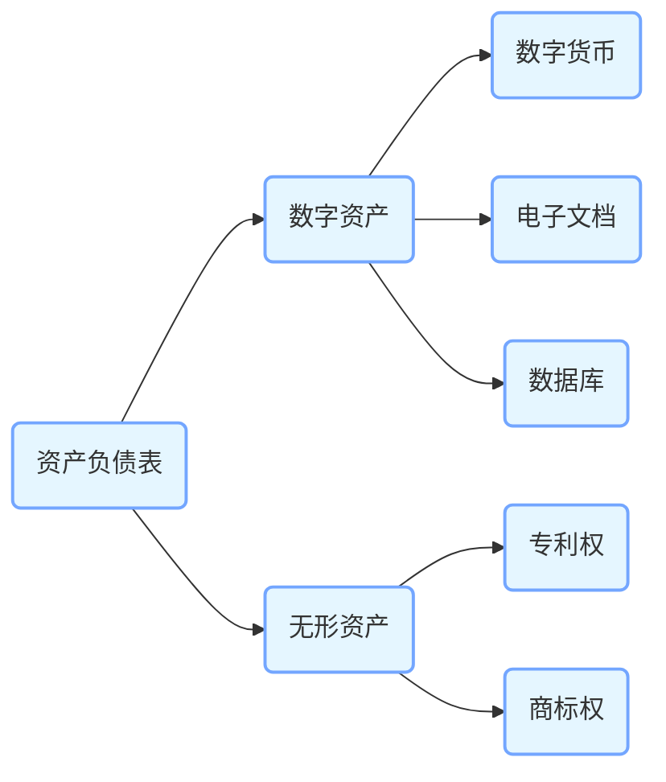

# 巴菲特的资产负债表分析：数字资产和无形资产的重新定义

> 关键词：巴菲特、资产负债表分析、数字资产、无形资产、重新定义

> 摘要：本文聚焦于巴菲特的资产负债表分析，着重探讨数字资产和无形资产在其中的重新定义。首先介绍了研究的背景、目的、预期读者等内容，接着阐述了相关核心概念及其联系，通过Python代码详细讲解核心算法原理与具体操作步骤，给出了数学模型和公式并举例说明。然后结合实际项目，进行代码案例的实现与解读。还分析了这些重新定义在实际应用场景中的情况，推荐了相关学习资源、开发工具框架和论文著作。最后总结了未来发展趋势与挑战，并给出常见问题解答和扩展阅读参考资料，旨在深入剖析数字资产和无形资产在巴菲特资产负债表分析中的新内涵和意义。

## 1. 背景介绍 
### 1.1 目的和范围
巴菲特作为投资界的传奇人物，其投资理念和对资产负债表的分析方法一直备受关注。随着时代的发展，数字资产和无形资产在企业资产中的占比日益增加，传统的资产负债表分析方法可能无法准确反映企业的真实价值。因此，本研究的目的是重新审视巴菲特的资产负债表分析方法，探讨如何对数字资产和无形资产进行重新定义和评估，以更准确地评估企业的财务状况和投资价值。本研究的范围主要涵盖数字资产和无形资产的定义、评估方法，以及它们在巴菲特资产负债表分析中的应用。

### 1.2 预期读者
本文预期读者包括投资领域的专业人士，如基金经理、分析师等，他们可以从本文中获取关于数字资产和无形资产分析的新视角，完善自己的投资分析体系。同时，企业财务管理人员也能从中了解如何更好地管理和评估企业的数字资产和无形资产。此外，对投资和财务分析感兴趣的爱好者也可以通过本文深入了解相关知识。

### 1.3 文档结构概述
本文首先介绍研究的背景信息，包括目的、预期读者和文档结构等。接着阐述数字资产和无形资产的核心概念以及它们之间的联系，并给出相应的示意图和流程图。然后详细讲解核心算法原理和具体操作步骤，通过Python代码进行说明。之后介绍相关的数学模型和公式，并举例说明其应用。再通过实际项目案例，展示代码的实现和解读。随后分析数字资产和无形资产重新定义在实际应用场景中的情况。接着推荐相关的学习资源、开发工具框架和论文著作。最后总结未来发展趋势与挑战，给出常见问题解答和扩展阅读参考资料。

### 1.4 术语表
#### 1.4.1 核心术语定义
- **数字资产**：指以电子数据形式存在的资产，包括但不限于数字货币、电子文档、数据库、软件代码等。这些资产具有可复制性、易传输性和虚拟性等特点。
- **无形资产**：是指企业拥有或者控制的没有实物形态的可辨认非货币性资产，如专利权、商标权、著作权、土地使用权、商誉等。无形资产通常具有较高的价值和较长的使用寿命。
- **资产负债表**：是反映企业在某一特定日期（如月末、季末、年末）全部资产、负债和所有者权益情况的会计报表，它表明权益在某一特定日期所拥有或控制的经济资源、所承担的现有义务和所有者对净资产的要求权。

#### 1.4.2 相关概念解释
- **可辨认性**：是指无形资产能够从企业中分离或者划分出来，并能单独或者与相关合同、资产或负债一起，用于出售、转移、授予许可、租赁或者交换；或者源自合同性权利或其他法定权利，无论这些权利是否可以从企业或其他权利和义务中转移或者分离。
- **公允价值**：是指市场参与者在计量日发生的有序交易中，出售一项资产所能收到或者转移一项负债所需支付的价格。在评估数字资产和无形资产时，公允价值是一个重要的参考指标。

#### 1.4.3 缩略词列表
- **GAAP**：Generally Accepted Accounting Principles，公认会计原则，是一套会计规则和标准，用于规范企业的财务报表编制。
- **IFRS**：International Financial Reporting Standards，国际财务报告准则，是国际会计准则理事会制定的一套全球适用的财务报告准则。

## 2. 核心概念与联系 

### 数字资产和无形资产的原理
数字资产的原理基于信息技术的发展，它以数字代码的形式存储和传输。例如，数字货币基于区块链技术，具有去中心化、不可篡改等特点；电子文档和数据库则依赖于计算机存储和管理系统。无形资产的原理在于其能够为企业带来未来经济利益，这种利益通常源于企业的技术创新、品牌形象、市场地位等。例如，专利权可以使企业在特定技术领域获得独占权，从而带来垄断利润；商标权可以提高企业产品的辨识度和市场竞争力。

### 架构的文本示意图
```plaintext
           资产负债表
          /           \
   数字资产          无形资产
  /    |    \        /      \
数字货币 电子文档 数据库  专利权  商标权
```

### Mermaid 流程图


## 3. 核心算法原理 & 具体操作步骤 

### 数字资产评估算法原理
数字资产的评估可以采用市场法、收益法和成本法。这里以市场法为例，市场法的原理是通过比较类似数字资产在市场上的交易价格来评估目标数字资产的价值。具体步骤如下：
1. 确定可比数字资产：选择与目标数字资产在类型、功能、市场环境等方面相似的数字资产作为可比对象。
2. 收集可比数字资产的交易数据：包括交易价格、交易时间、交易数量等信息。
3. 调整可比数字资产的交易价格：考虑目标数字资产与可比数字资产之间的差异，如质量、性能、市场份额等，对可比数字资产的交易价格进行调整。
4. 计算目标数字资产的价值：根据调整后的可比数字资产交易价格，计算目标数字资产的价值。

以下是使用Python实现市场法评估数字资产价值的代码示例：
```python
# 可比数字资产的交易价格列表
comparable_prices = [100, 120, 110]
# 调整系数列表，考虑目标数字资产与可比数字资产的差异
adjustment_factors = [0.9, 1.1, 1.0]

# 计算调整后的交易价格
adjusted_prices = []
for price, factor in zip(comparable_prices, adjustment_factors):
    adjusted_prices.append(price * factor)

# 计算目标数字资产的价值，这里采用平均值法
target_value = sum(adjusted_prices) / len(adjusted_prices)
print(f"目标数字资产的价值为: {target_value}")
```

### 无形资产评估算法原理
无形资产评估常用的方法有收益法和成本法。以收益法为例，收益法的原理是通过预测无形资产在未来一定时期内的收益，并将其折现到当前时刻来评估无形资产的价值。具体步骤如下：
1. 预测无形资产的未来收益：根据历史数据、市场趋势和企业发展战略，预测无形资产在未来各期的收益。
2. 确定折现率：折现率反映了资金的时间价值和投资风险，通常根据市场利率、行业风险等因素确定。
3. 计算未来收益的现值：将预测的未来收益按照折现率折现到当前时刻。
4. 计算无形资产的价值：将各期未来收益的现值相加，得到无形资产的价值。

以下是使用Python实现收益法评估无形资产价值的代码示例：
```python
# 预测的未来各期收益列表
future_earnings = [20, 30, 40, 50, 60]
# 折现率
discount_rate = 0.1

# 计算未来收益的现值
present_values = []
for i, earnings in enumerate(future_earnings):
    present_value = earnings / ((1 + discount_rate) ** (i + 1))
    present_values.append(present_value)

# 计算无形资产的价值
intangible_asset_value = sum(present_values)
print(f"无形资产的价值为: {intangible_asset_value}")
```

## 4. 数学模型和公式 & 详细讲解 & 举例说明 

### 市场法评估数字资产价值的数学模型
市场法评估数字资产价值的数学模型可以表示为：
$$V = \frac{\sum_{i=1}^{n} P_{i} \times F_{i}}{n}$$
其中，$V$ 表示目标数字资产的价值，$P_{i}$ 表示第 $i$ 个可比数字资产的交易价格，$F_{i}$ 表示第 $i$ 个可比数字资产的调整系数，$n$ 表示可比数字资产的数量。

例如，假设有三个可比数字资产，其交易价格分别为 $P_1 = 100$，$P_2 = 120$，$P_3 = 110$，调整系数分别为 $F_1 = 0.9$，$F_2 = 1.1$，$F_3 = 1.0$，则目标数字资产的价值为：
$$V = \frac{100 \times 0.9 + 120 \times 1.1 + 110 \times 1.0}{3} = \frac{90 + 132 + 110}{3} = \frac{332}{3} \approx 110.67$$

### 收益法评估无形资产价值的数学模型
收益法评估无形资产价值的数学模型可以表示为：
$$V = \sum_{t=1}^{n} \frac{E_{t}}{(1 + r)^{t}}$$
其中，$V$ 表示无形资产的价值，$E_{t}$ 表示第 $t$ 期的预测收益，$r$ 表示折现率，$n$ 表示预测期数。

例如，假设预测某无形资产未来 5 年的收益分别为 $E_1 = 20$，$E_2 = 30$，$E_3 = 40$，$E_4 = 50$，$E_5 = 60$，折现率 $r = 0.1$，则该无形资产的价值为：
$$V = \frac{20}{(1 + 0.1)^1} + \frac{30}{(1 + 0.1)^2} + \frac{40}{(1 + 0.1)^3} + \frac{50}{(1 + 0.1)^4} + \frac{60}{(1 + 0.1)^5}$$
$$V = \frac{20}{1.1} + \frac{30}{1.21} + \frac{40}{1.331} + \frac{50}{1.4641} + \frac{60}{1.61051}$$
$$V \approx 18.18 + 24.79 + 30.05 + 34.15 + 37.25 = 144.42$$

## 5. 项目实战：代码实际案例和详细解释说明 

### 5.1  开发环境搭建
本项目使用Python进行开发，需要安装以下库：
- `numpy`：用于数值计算。
- `pandas`：用于数据处理和分析。

可以使用以下命令进行安装：
```sh
pip install numpy pandas
```

### 5.2  源代码详细实现和代码解读
以下是一个综合的代码示例，用于评估数字资产和无形资产的价值：
```python
import numpy as np
import pandas as pd

# 市场法评估数字资产价值
def market_approach_digital_asset(comparable_prices, adjustment_factors):
    adjusted_prices = np.array(comparable_prices) * np.array(adjustment_factors)
    target_value = np.mean(adjusted_prices)
    return target_value

# 收益法评估无形资产价值
def income_approach_intangible_asset(future_earnings, discount_rate):
    periods = np.arange(1, len(future_earnings) + 1)
    present_values = np.array(future_earnings) / ((1 + discount_rate) ** periods)
    intangible_asset_value = np.sum(present_values)
    return intangible_asset_value

# 示例数据
comparable_prices = [100, 120, 110]
adjustment_factors = [0.9, 1.1, 1.0]
future_earnings = [20, 30, 40, 50, 60]
discount_rate = 0.1

# 评估数字资产价值
digital_asset_value = market_approach_digital_asset(comparable_prices, adjustment_factors)
print(f"数字资产的价值为: {digital_asset_value}")

# 评估无形资产价值
intangible_asset_value = income_approach_intangible_asset(future_earnings, discount_rate)
print(f"无形资产的价值为: {intangible_asset_value}")
```
代码解读：
- `market_approach_digital_asset` 函数：该函数接受可比数字资产的交易价格列表和调整系数列表作为输入，通过将交易价格与调整系数相乘得到调整后的价格，然后计算平均值得到目标数字资产的价值。
- `income_approach_intangible_asset` 函数：该函数接受预测的未来收益列表和折现率作为输入，通过将未来收益按照折现率折现到当前时刻，然后求和得到无形资产的价值。
- 示例数据部分：定义了可比数字资产的交易价格、调整系数、预测的未来收益和折现率。
- 评估部分：调用 `market_approach_digital_asset` 函数和 `income_approach_intangible_asset` 函数分别评估数字资产和无形资产的价值，并打印结果。

### 5.3  代码解读与分析
通过上述代码，我们可以看到如何使用Python实现数字资产和无形资产的评估。代码的优点在于简洁易懂，使用了 `numpy` 库进行高效的数值计算。然而，代码也存在一些局限性，例如在实际应用中，可比数字资产的选择和调整系数的确定可能需要更复杂的方法，预测未来收益也需要更深入的市场分析和企业研究。

## 6. 实际应用场景 
### 企业财务报表编制
在企业编制财务报表时，准确评估数字资产和无形资产的价值可以更真实地反映企业的资产状况。例如，一家科技企业拥有大量的软件代码和专利技术，对这些数字资产和无形资产进行合理评估并纳入资产负债表，可以提高财务报表的质量和可信度。

### 投资决策
投资者在进行投资决策时，需要考虑企业的数字资产和无形资产价值。例如，一家互联网企业的品牌价值和用户数据等无形资产可能是其核心竞争力的重要组成部分，投资者可以通过评估这些资产的价值来判断企业的投资潜力。

### 企业并购
在企业并购过程中，对目标企业的数字资产和无形资产进行评估至关重要。例如，当一家传统企业并购一家科技初创企业时，需要准确评估初创企业的数字技术、专利和品牌等资产的价值，以确定合理的并购价格。

## 7. 工具和资源推荐
### 7.1 学习资源推荐
#### 7.1.1 书籍推荐
- 《财务报表分析》：这本书系统地介绍了财务报表分析的方法和技巧，包括资产负债表的分析，对理解数字资产和无形资产在财务报表中的体现有很大帮助。
- 《投资中最简单的事》：巴菲特的投资理念在书中有深入的阐述，读者可以从中学习到如何从投资的角度分析企业的资产负债表。
- 《数字资产与区块链》：详细介绍了数字资产的概念、特点和发展趋势，对于了解数字资产的评估和管理有重要意义。

#### 7.1.2 在线课程
- Coursera上的“财务报表分析与估值”课程：由知名大学的教授授课，内容涵盖财务报表分析的各个方面，包括数字资产和无形资产的评估。
- edX上的“区块链与数字资产”课程：深入讲解了区块链技术和数字资产的相关知识，对于理解数字资产的原理和应用有很大帮助。

#### 7.1.3 技术博客和网站
- Seeking Alpha：一个专业的投资研究网站，提供大量关于企业财务分析和投资策略的文章，其中不乏对数字资产和无形资产的分析。
- Medium上的财务和投资相关博客：许多专业人士会在Medium上分享他们的研究成果和经验，读者可以从中获取最新的数字资产和无形资产分析方法。

### 7.2 开发工具框架推荐
#### 7.2.1 IDE和编辑器
- PyCharm：一款专业的Python集成开发环境，具有代码编辑、调试、自动补全、代码分析等功能，适合Python开发。
- Jupyter Notebook：一个交互式的开发环境，支持多种编程语言，适合进行数据探索和分析，对于数字资产和无形资产评估的代码实现和验证非常方便。

#### 7.2.2 调试和性能分析工具
- pdb：Python自带的调试工具，可以帮助开发者定位代码中的问题。
- cProfile：Python的性能分析工具，可以分析代码的运行时间和函数调用情况，帮助开发者优化代码性能。

#### 7.2.3 相关框架和库
- Scikit-learn：一个强大的机器学习库，提供了多种机器学习算法和工具，可用于数字资产和无形资产的预测和评估。
- TensorFlow：一个开源的深度学习框架，可用于处理复杂的数据分析和预测任务，对于数字资产和无形资产的价值预测有一定的应用前景。

### 7.3 相关论文著作推荐
#### 7.3.1 经典论文
- "The Measurement and Reporting of Intangible Assets"：该论文深入探讨了无形资产的计量和报告问题，对理解无形资产的会计处理有重要参考价值。
- "Digital Assets: A New Asset Class"：介绍了数字资产作为一种新的资产类别的特点和发展趋势，为数字资产的研究提供了理论基础。

#### 7.3.2 最新研究成果
- 关注顶级学术期刊如《Journal of Financial Economics》《The Accounting Review》等上的相关研究论文，这些论文通常反映了数字资产和无形资产研究的最新动态。

#### 7.3.3 应用案例分析
- 一些专业的商业研究机构会发布关于企业数字资产和无形资产评估的应用案例分析报告，这些报告可以帮助读者了解实际应用中的方法和经验。

## 8. 总结：未来发展趋势与挑战
### 未来发展趋势
- 数字资产和无形资产的重要性将不断提升：随着数字化时代的发展，企业的竞争力越来越依赖于数字资产和无形资产，如大数据、人工智能技术、品牌价值等。这些资产将在企业的资产负债表中占据越来越重要的地位。
- 评估方法将不断创新：为了更准确地评估数字资产和无形资产的价值，未来可能会出现更多创新的评估方法和模型。例如，结合人工智能和机器学习技术，利用大量的数据进行更精准的预测和评估。
- 监管将不断加强：由于数字资产和无形资产的特殊性，监管机构将加强对其评估和披露的监管，以保证财务信息的真实性和可靠性。

### 挑战
- 评估难度大：数字资产和无形资产具有不确定性和难以量化的特点，评估过程中需要考虑多种因素，如市场变化、技术创新等，这给评估工作带来了很大的挑战。
- 数据质量问题：数字资产和无形资产的评估需要大量的数据支持，但数据的质量和可靠性可能存在问题，如数据不完整、不准确等，这会影响评估结果的准确性。
- 会计处理标准不统一：目前，对于数字资产和无形资产的会计处理标准还存在一定的差异，不同国家和地区的会计准则可能有所不同，这给企业的财务报表编制和比较带来了困难。

## 9. 附录：常见问题与解答
### 问题1：数字资产和无形资产有什么区别？
解答：数字资产是以电子数据形式存在的资产，具有可复制性、易传输性和虚拟性等特点；无形资产是没有实物形态的可辨认非货币性资产，通常源于企业的技术创新、品牌形象等。数字资产可以看作是无形资产的一种特殊形式，但并非所有无形资产都是数字资产。

### 问题2：如何确定可比数字资产和调整系数？
解答：确定可比数字资产需要考虑资产的类型、功能、市场环境等因素，选择与目标数字资产相似的资产作为可比对象。调整系数的确定需要综合考虑目标数字资产与可比数字资产之间的差异，如质量、性能、市场份额等，可以通过专家评估、市场调研等方法来确定。

### 问题3：收益法评估无形资产价值时，如何预测未来收益和确定折现率？
解答：预测未来收益需要根据历史数据、市场趋势和企业发展战略进行分析。可以采用时间序列分析、回归分析等方法进行预测。折现率的确定需要考虑市场利率、行业风险等因素，通常可以参考同行业的平均收益率或使用资本资产定价模型（CAPM）来计算。

## 10. 扩展阅读 & 参考资料
### 扩展阅读
- 《人工智能时代的财务转型》：探讨了人工智能技术对财务领域的影响，包括数字资产和无形资产的管理和评估。
- 《区块链技术与金融创新》：深入介绍了区块链技术在金融领域的应用，对于理解数字资产的底层技术有很大帮助。

### 参考资料
- Financial Accounting Standards Board (FASB). Accounting Standards Codification.
- International Accounting Standards Board (IASB). International Financial Reporting Standards.
- Warren Buffett's annual letters to shareholders.

作者：AI天才研究院/AI Genius Institute & 禅与计算机程序设计艺术 /Zen And The Art of Computer Programming