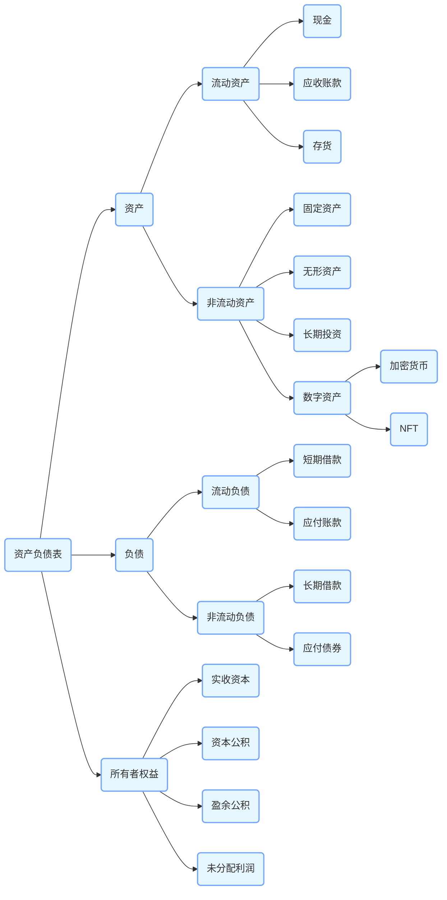

# 巴菲特的资产负债表分析：数字资产时代的财务健康

> 关键词：巴菲特、资产负债表分析、数字资产时代、财务健康、价值投资

> 摘要：本文聚焦于在数字资产时代对巴菲特的资产负债表进行深入分析。通过探讨传统资产负债表分析方法在数字资产兴起背景下的适用性与变革，详细阐述资产负债表各要素的核心概念及其相互联系，剖析核心算法原理和操作步骤，结合数学模型和公式进行理论解读与实例说明。以实际项目案例展示资产负债表分析在现实中的应用，探讨其在不同场景下的重要意义。同时推荐相关学习资源、开发工具框架以及论文著作，最后总结数字资产时代资产负债表分析的未来发展趋势与挑战，并解答常见问题，为投资者和财务分析人员提供全面且深入的指导。

## 1. 背景介绍 
### 1.1 目的和范围
在数字资产如比特币、以太坊等逐渐崛起并在金融市场中占据越来越重要地位的今天，传统的资产负债表分析方法面临着新的挑战和机遇。本研究的目的在于深入剖析巴菲特所代表的传统投资理念下的资产负债表分析方式，以及如何在数字资产时代对其进行适应性调整，以准确评估企业的财务健康状况。研究范围涵盖巴菲特旗下伯克希尔·哈撒韦公司的资产负债表，同时将数字资产纳入考量，探讨其对资产负债表结构和分析方法的影响。

### 1.2 预期读者
本文预期读者主要包括投资者，尤其是价值投资者，他们希望通过对资产负债表的分析来做出更明智的投资决策；财务分析人员，需要掌握在数字资产时代进行准确财务评估的方法；金融专业的学生和研究人员，对资产负债表分析和数字资产的融合研究感兴趣。

### 1.3 文档结构概述
本文首先介绍相关背景信息，包括研究目的、预期读者和文档结构。接着阐述资产负债表分析的核心概念及其相互联系，通过文本示意图和Mermaid流程图进行直观展示。然后详细讲解核心算法原理和具体操作步骤，结合Python代码进行说明。再运用数学模型和公式对分析过程进行理论支持，并举例说明。之后通过项目实战展示实际案例和代码解读。探讨资产负债表分析在不同场景下的实际应用。推荐相关的学习资源、开发工具框架和论文著作。最后总结数字资产时代资产负债表分析的未来发展趋势与挑战，解答常见问题，并提供扩展阅读和参考资料。

### 1.4 术语表
#### 1.4.1 核心术语定义
- **资产负债表**：反映企业在某一特定日期财务状况的会计报表，它表明企业在某一特定日期所拥有或控制的经济资源、所承担的现有义务和所有者对净资产的要求权。
- **数字资产**：以电子数据形式存在的资产，如加密货币、数字版权、虚拟土地等，具有去中心化、可交易性等特点。
- **财务健康**：企业在财务方面具有良好的稳定性、偿债能力、盈利能力和发展潜力，能够持续经营并应对各种风险。
- **价值投资**：一种投资策略，通过对企业内在价值的评估，寻找被低估的股票进行投资，以获取长期的投资回报。

#### 1.4.2 相关概念解释
- **资产负债率**：是衡量企业长期偿债能力的指标，计算公式为负债总额除以资产总额。它反映了企业负债占资产的比例，比例越高，企业的偿债风险越大。
- **流动比率**：衡量企业短期偿债能力的指标，计算公式为流动资产除以流动负债。它表明企业流动资产在短期债务到期以前，可以变为现金用于偿还负债的能力。
- **权益乘数**：反映了企业的财务杠杆程度，计算公式为资产总额除以股东权益总额。权益乘数越大，表明企业负债程度越高，财务风险也越大。

#### 1.4.3 缩略词列表
- **GAAP**：Generally Accepted Accounting Principles，公认会计原则，是一套会计核算的标准和规范。
- **NFT**：Non - Fungible Token，非同质化代币，是一种基于区块链技术的数字资产，具有唯一性和不可替代性。
- **ICO**：Initial Coin Offering，首次代币发行，是区块链项目筹集资金的一种方式。

## 2. 核心概念与联系 

### 核心概念原理
资产负债表的核心原理基于会计恒等式：$资产 = 负债 + 所有者权益$。资产是企业拥有或控制的能以货币计量的经济资源，包括流动资产（如现金、应收账款、存货等）和非流动资产（如固定资产、无形资产、长期投资等）。负债是企业过去的交易或者事项形成的、预期会导致经济利益流出企业的现时义务，分为流动负债（如短期借款、应付账款等）和非流动负债（如长期借款、应付债券等）。所有者权益是企业资产扣除负债后由所有者享有的剩余权益，包括实收资本、资本公积、盈余公积和未分配利润等。

在数字资产时代，资产的范畴得到了扩展，数字资产逐渐成为企业资产的一部分。数字资产的价值评估和会计处理与传统资产有所不同，需要考虑其独特的性质，如市场波动性、技术创新性和法律合规性等。

### 架构的文本示意图
```plaintext
资产负债表
|--资产
|   |--流动资产
|   |   |--现金
|   |   |--应收账款
|   |   |--存货
|   |   |--...
|   |--非流动资产
|   |   |--固定资产
|   |   |--无形资产
|   |   |--长期投资
|   |   |--数字资产
|   |   |   |--加密货币
|   |   |   |--NFT
|   |   |   |--...
|--负债
|   |--流动负债
|   |   |--短期借款
|   |   |--应付账款
|   |   |--...
|   |--非流动负债
|   |   |--长期借款
|   |   |--应付债券
|   |   |--...
|--所有者权益
|   |--实收资本
|   |--资本公积
|   |--盈余公积
|   |--未分配利润
```

### Mermaid流程图


## 3. 核心算法原理 & 具体操作步骤 

### 核心算法原理
在资产负债表分析中，常用的算法包括计算各种财务比率，以评估企业的财务健康状况。以下是一些重要的财务比率及其算法原理：

#### 资产负债率
资产负债率反映了企业负债占资产的比例，其计算公式为：
$资产负债率 = \frac{负债总额}{资产总额} \times 100\%$

#### 流动比率
流动比率衡量企业短期偿债能力，计算公式为：
$流动比率 = \frac{流动资产}{流动负债}$

#### 权益乘数
权益乘数反映企业的财务杠杆程度，计算公式为：
$权益乘数 = \frac{资产总额}{股东权益总额}$

### 具体操作步骤
以下是使用Python实现资产负债表分析的具体操作步骤：

```python
# 假设我们有一个资产负债表数据字典
balance_sheet = {
    "资产总额": 1000000,
    "负债总额": 400000,
    "流动资产": 300000,
    "流动负债": 150000,
    "股东权益总额": 600000
}

# 计算资产负债率
def calculate_debt_ratio(balance_sheet):
    total_assets = balance_sheet["资产总额"]
    total_liabilities = balance_sheet["负债总额"]
    debt_ratio = (total_liabilities / total_assets) * 100
    return debt_ratio

# 计算流动比率
def calculate_current_ratio(balance_sheet):
    current_assets = balance_sheet["流动资产"]
    current_liabilities = balance_sheet["流动负债"]
    current_ratio = current_assets / current_liabilities
    return current_ratio

# 计算权益乘数
def calculate_equity_multiplier(balance_sheet):
    total_assets = balance_sheet["资产总额"]
    total_equity = balance_sheet["股东权益总额"]
    equity_multiplier = total_assets / total_equity
    return equity_multiplier

# 调用函数进行计算
debt_ratio = calculate_debt_ratio(balance_sheet)
current_ratio = calculate_current_ratio(balance_sheet)
equity_multiplier = calculate_equity_multiplier(balance_sheet)

print(f"资产负债率: {debt_ratio}%")
print(f"流动比率: {current_ratio}")
print(f"权益乘数: {equity_multiplier}")
```

### 代码解释
- 首先，我们创建了一个字典`balance_sheet`来存储资产负债表的相关数据。
- 然后，定义了三个函数`calculate_debt_ratio`、`calculate_current_ratio`和`calculate_equity_multiplier`，分别用于计算资产负债率、流动比率和权益乘数。
- 最后，调用这些函数进行计算，并打印出结果。

## 4. 数学模型和公式 & 详细讲解 & 举例说明 

### 数学模型和公式
除了前面提到的财务比率公式，还有一些其他重要的数学模型和公式在资产负债表分析中也有应用。

#### 净资产收益率（ROE）
净资产收益率反映了股东权益的收益水平，计算公式为：
$ROE = \frac{净利润}{股东权益总额} \times 100\%$

#### 总资产周转率
总资产周转率衡量企业资产运营效率，计算公式为：
$总资产周转率 = \frac{营业收入}{资产总额}$

### 详细讲解
#### 净资产收益率（ROE）
ROE是衡量企业盈利能力的重要指标，它表示企业运用自有资本的效率。ROE越高，说明企业为股东创造的价值越高。一般来说，ROE连续多年保持在15%以上的企业，通常具有较强的盈利能力和竞争优势。

#### 总资产周转率
总资产周转率反映了企业资产的管理水平和运营效率。周转率越高，说明企业资产运营越高效，能够用较少的资产创造出更多的营业收入。不同行业的总资产周转率存在较大差异，一般制造业的周转率相对较低，而零售业的周转率相对较高。

### 举例说明
假设某企业的资产负债表和利润表数据如下：
- 资产总额：800000元
- 股东权益总额：500000元
- 净利润：80000元
- 营业收入：1200000元

#### 计算净资产收益率（ROE）
$ROE = \frac{80000}{500000} \times 100\% = 16\%$

这表明该企业的股东权益收益水平为16%，说明企业具有较好的盈利能力。

#### 计算总资产周转率
$总资产周转率 = \frac{1200000}{800000} = 1.5$

这意味着该企业的资产在一年内周转了1.5次，反映了企业资产的运营效率。

## 5. 项目实战：代码实际案例和详细解释说明 

### 5.1  开发环境搭建
- **Python环境**：确保你已经安装了Python 3.x版本，可以从Python官方网站（https://www.python.org/downloads/）下载并安装。
- **开发工具**：推荐使用PyCharm或Jupyter Notebook作为开发工具。PyCharm是一款专业的Python集成开发环境，提供了丰富的代码编辑、调试和运行功能；Jupyter Notebook则适合进行交互式的数据分析和代码演示。
- **必要的库**：在进行资产负债表分析时，可能需要使用到`pandas`和`numpy`库。可以使用以下命令进行安装：
```sh
pip install pandas numpy
```

### 5.2  源代码详细实现和代码解读
假设我们有一个包含多家企业资产负债表数据的CSV文件`balance_sheets.csv`，文件内容如下：
```plaintext
企业名称,资产总额,负债总额,流动资产,流动负债,股东权益总额
企业A,1000000,400000,300000,150000,600000
企业B,1200000,500000,400000,200000,700000
企业C,800000,300000,250000,120000,500000
```

以下是使用Python对这些数据进行分析的代码：

```python
import pandas as pd

# 读取CSV文件
data = pd.read_csv('balance_sheets.csv')

# 定义计算财务比率的函数
def calculate_financial_ratios(data):
    data['资产负债率'] = (data['负债总额'] / data['资产总额']) * 100
    data['流动比率'] = data['流动资产'] / data['流动负债']
    data['权益乘数'] = data['资产总额'] / data['股东权益总额']
    return data

# 计算财务比率
data_with_ratios = calculate_financial_ratios(data)

# 打印结果
print(data_with_ratios)
```

### 代码解读与分析
- **导入库**：使用`import pandas as pd`导入`pandas`库，用于数据处理和分析。
- **读取数据**：使用`pd.read_csv('balance_sheets.csv')`读取CSV文件，并将数据存储在`data`变量中。
- **定义函数**：定义`calculate_financial_ratios`函数，用于计算资产负债率、流动比率和权益乘数。在函数内部，使用`pandas`的列操作直接对数据进行计算，并将结果添加到数据框中。
- **计算财务比率**：调用`calculate_financial_ratios`函数，将计算结果存储在`data_with_ratios`变量中。
- **打印结果**：使用`print(data_with_ratios)`打印包含财务比率的数据框。

通过这个项目实战，我们可以快速计算多家企业的财务比率，从而对它们的财务健康状况进行比较和评估。

## 6. 实际应用场景 
### 投资决策
投资者在选择投资对象时，会对企业的资产负债表进行深入分析。通过计算财务比率，如资产负债率、流动比率和ROE等，评估企业的偿债能力、盈利能力和运营效率。例如，如果一家企业的资产负债率较低，流动比率较高，ROE连续多年保持在较高水平，那么该企业可能具有较好的财务健康状况，值得投资。

### 信贷评估
银行和其他金融机构在发放贷款时，会对借款人的资产负债表进行审查。通过分析借款人的负债水平、偿债能力和现金流状况，评估其还款能力和信用风险。如果借款人的资产负债率过高，流动比率过低，可能会被认为具有较高的信用风险，银行可能会拒绝贷款或要求提供更多的担保。

### 企业内部管理
企业管理层可以通过分析资产负债表，了解企业的财务状况和经营成果，发现存在的问题并及时采取措施进行改进。例如，如果企业的存货周转率较低，说明存货积压严重，管理层可以采取促销措施或优化供应链管理来降低存货水平。

### 并购重组
在企业并购重组过程中，资产负债表分析是评估目标企业价值的重要依据。通过对目标企业的资产、负债和所有者权益进行详细分析，了解其财务状况和潜在风险，为并购价格的确定和交易方案的设计提供参考。

## 7. 工具和资源推荐
### 7.1 学习资源推荐
#### 7.1.1 书籍推荐
- 《财务报表分析与证券定价》：这本书详细介绍了财务报表分析的方法和技巧，以及如何将其应用于证券定价。书中结合了大量的实际案例，对读者理解财务报表和进行投资分析具有很大的帮助。
- 《巴菲特致股东的信：投资者和公司高管教程》：巴菲特在信中分享了他的投资理念、财务分析方法和企业管理经验。通过阅读这本书，读者可以深入了解巴菲特的投资智慧和对资产负债表分析的重视。
- 《手把手教你读财报》：这本书以通俗易懂的语言介绍了财务报表的基本知识和分析方法，适合初学者阅读。书中通过大量的实例和图表，帮助读者快速掌握财务报表分析的技巧。

#### 7.1.2 在线课程
- Coursera上的“财务报表分析”课程：该课程由知名大学的教授授课，内容涵盖了财务报表的基本概念、分析方法和实际应用。课程采用视频讲解、案例分析和在线讨论等多种教学方式，帮助学员深入理解财务报表分析的原理和方法。
- edX上的“投资学原理”课程：该课程介绍了投资学的基本原理和方法，包括资产定价、投资组合理论和财务报表分析等内容。课程结合了实际案例和模拟投资实验，让学员在实践中掌握投资分析的技能。

#### 7.1.3 技术博客和网站
- 雪球网：雪球网是一个投资社区，上面有很多投资者分享自己的投资经验和财务分析报告。通过阅读这些报告，读者可以了解不同投资者对企业资产负债表的分析方法和观点。
- 东方财富网：东方财富网提供了丰富的金融数据和资讯，包括企业的财务报表、财务比率分析等内容。读者可以通过该网站获取最新的财务数据，并进行深入的分析和研究。

### 7.2 开发工具框架推荐
#### 7.2.1 IDE和编辑器
- PyCharm：一款专业的Python集成开发环境，提供了丰富的代码编辑、调试和运行功能。PyCharm支持多种版本的Python，并且可以与各种Python库和框架集成，是Python开发者的首选工具之一。
- Jupyter Notebook：一种交互式的开发环境，适合进行数据分析和代码演示。Jupyter Notebook支持多种编程语言，包括Python、R和Julia等，并且可以将代码、文本和可视化结果整合在一个文档中，方便用户进行分享和交流。

#### 7.2.2 调试和性能分析工具
- Py-Spy：一个用于Python代码性能分析的工具，可以实时监测Python程序的CPU使用率和函数调用情况。通过分析性能数据，用户可以找出代码中的性能瓶颈，并进行优化。
- pdb：Python自带的调试器，可以帮助用户在代码中设置断点、单步执行代码和查看变量值等。pdb是一个非常实用的调试工具，对于排查代码中的错误和理解代码的执行流程非常有帮助。

#### 7.2.3 相关框架和库
- pandas：一个用于数据处理和分析的Python库，提供了高效的数据结构和数据操作方法。pandas可以处理各种类型的数据，包括CSV文件、Excel文件和数据库等，是数据分析师和科学家的必备工具之一。
- numpy：一个用于科学计算的Python库，提供了高效的数组操作和数学函数。numpy是许多Python科学计算库的基础，如pandas、scikit-learn等，对于进行财务数据分析和建模非常有帮助。

### 7.3 相关论文著作推荐
#### 7.3.1 经典论文
- “The Capital Structure Puzzle” by Stewart C. Myers：这篇论文探讨了企业资本结构的决定因素和优化问题，对资产负债表分析中的负债管理具有重要的理论指导意义。
- “Financial Ratios and the Probabilistic Prediction of Bankruptcy” by Edward I. Altman：这篇论文提出了著名的Z-score模型，用于预测企业破产的概率。Z-score模型是基于企业的财务比率构建的，对于评估企业的财务健康状况和信用风险具有重要的应用价值。

#### 7.3.2 最新研究成果
- 近年来，随着数字资产的兴起，一些学者开始研究数字资产对企业资产负债表的影响。例如，研究数字资产的价值评估方法、会计处理原则和风险管理策略等。这些研究成果对于在数字资产时代进行资产负债表分析具有重要的参考价值。
- 另一个研究热点是人工智能和机器学习在资产负债表分析中的应用。一些学者尝试使用机器学习算法对企业的财务数据进行分析和预测，如预测企业的盈利能力、违约风险等。这些研究成果为资产负债表分析提供了新的方法和思路。

#### 7.3.3 应用案例分析
- 一些专业的金融研究机构和咨询公司会发布关于企业资产负债表分析的应用案例报告。这些报告通常会选取一些具有代表性的企业，对其资产负债表进行深入分析，并提出相应的投资建议和风险管理策略。通过阅读这些案例报告，读者可以学习到实际应用中的资产负债表分析方法和技巧。

## 8. 总结：未来发展趋势与挑战
### 未来发展趋势
#### 数字资产的广泛应用
随着区块链技术的不断发展和普及，数字资产将在企业资产负债表中占据越来越重要的地位。企业可能会持有更多的加密货币、NFT等数字资产，同时也会开展更多与数字资产相关的业务，如数字资产交易、数字资产托管等。这将对资产负债表的编制和分析带来新的挑战和机遇。

#### 人工智能和机器学习的应用
人工智能和机器学习技术将在资产负债表分析中得到更广泛的应用。通过使用机器学习算法对大量的财务数据进行分析和挖掘，可以发现隐藏在数据中的规律和趋势，提高财务分析的准确性和效率。例如，使用深度学习算法对企业的财务报表进行文本分析，提取关键信息和情感倾向，为投资决策提供参考。

#### 国际化和标准化
随着全球经济一体化的发展，企业的跨国经营和投资活动越来越频繁。为了提高财务信息的可比性和透明度，资产负债表的编制和分析将越来越趋向于国际化和标准化。国际会计准则理事会（IASB）和美国财务会计准则委员会（FASB）等国际组织将不断完善和更新相关的会计准则和规范，以适应数字资产时代的发展需求。

### 挑战
#### 数字资产的价值评估
数字资产的价值具有高度的波动性和不确定性，其价值评估方法尚未形成统一的标准。在资产负债表中如何准确地计量和披露数字资产的价值，是一个亟待解决的问题。此外，数字资产的市场监管还不完善，存在较大的法律风险和市场风险，这也增加了数字资产价值评估的难度。

#### 数据安全和隐私保护
在数字资产时代，企业的财务数据和数字资产信息面临着更高的安全风险和隐私泄露风险。如何保障财务数据的安全和隐私，防止数据被篡改、泄露和滥用，是资产负债表分析面临的重要挑战之一。企业需要加强数据安全管理，采用先进的技术手段和安全措施，确保财务数据的保密性、完整性和可用性。

#### 人才短缺
数字资产时代的资产负债表分析需要具备跨学科知识和技能的专业人才，既需要掌握财务会计、金融分析等传统知识，又需要了解区块链、人工智能等新兴技术。目前，市场上这类复合型人才相对短缺，这将制约资产负债表分析技术的发展和应用。

## 9. 附录：常见问题与解答
### 数字资产如何在资产负债表中进行会计处理？
目前，数字资产的会计处理方法尚未形成统一的标准。一般来说，对于企业持有的加密货币，如果将其视为金融资产，可以按照《企业会计准则第22号——金融工具确认和计量》进行处理；如果将其视为无形资产，可以按照《企业会计准则第6号——无形资产》进行处理。对于NFT等非同质化数字资产，其会计处理方法还需要进一步研究和探讨。

### 如何评估数字资产的价值？
评估数字资产的价值是一个复杂的问题，需要考虑多个因素，如市场供求关系、技术创新性、法律合规性等。目前，常用的评估方法包括市场法、收益法和成本法等。市场法是根据市场上类似数字资产的交易价格来评估目标数字资产的价值；收益法是通过预测数字资产未来的收益来评估其价值；成本法是根据数字资产的开发成本和维护成本来评估其价值。

### 资产负债表分析在数字资产时代有哪些局限性？
在数字资产时代，资产负债表分析存在以下局限性：
- 数字资产的价值波动较大，资产负债表中的数字资产价值可能无法及时反映其真实市场价值。
- 数字资产的会计处理方法尚未统一，不同企业对数字资产的会计处理可能存在差异，导致财务数据的可比性降低。
- 资产负债表主要反映企业的历史财务状况，对于数字资产的未来发展潜力和风险评估能力有限。

### 如何提高资产负债表分析的准确性？
为了提高资产负债表分析的准确性，可以采取以下措施：
- 收集和分析更多的财务数据和非财务数据，如市场数据、行业数据和企业战略信息等，以全面了解企业的财务状况和经营环境。
- 使用多种分析方法和工具，如比率分析、趋势分析、现金流量分析和机器学习算法等，从不同角度对资产负债表进行分析。
- 关注数字资产的特点和风险，采用合适的价值评估方法和会计处理原则，确保数字资产在资产负债表中的准确计量和披露。
- 加强对财务数据的质量控制和审计，确保财务数据的真实性、准确性和完整性。

## 10. 扩展阅读 & 参考资料
### 扩展阅读
- 《区块链技术与应用》：这本书详细介绍了区块链技术的原理、应用场景和发展趋势，对于理解数字资产的底层技术具有重要的帮助。
- 《人工智能：现代方法》：这本书是人工智能领域的经典教材，涵盖了人工智能的基本概念、算法和应用。通过阅读这本书，读者可以了解人工智能在财务分析中的应用原理和方法。
- 《金融科技前沿：技术驱动的金融创新》：这本书探讨了金融科技的发展趋势和应用案例，包括区块链、人工智能、大数据等技术在金融领域的应用。对于了解数字资产时代金融行业的变革具有重要的参考价值。

### 参考资料
- 国际会计准则理事会（IASB）发布的相关会计准则和解释公告。
- 美国财务会计准则委员会（FASB）发布的相关会计准则和解释公告。
- 中国财政部发布的企业会计准则和相关指南。
- 相关学术期刊和会议论文，如《会计研究》、《金融研究》等。

作者：AI天才研究院/AI Genius Institute & 禅与计算机程序设计艺术 /Zen And The Art of Computer Programming