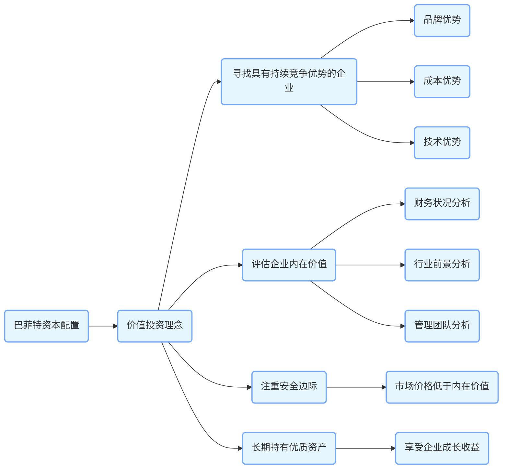

# 巴菲特的资本配置艺术：在不确定性中优化资源分配

> 关键词：巴菲特、资本配置、不确定性、资源分配、投资策略、价值投资、长期主义

> 摘要：本文深入探讨了巴菲特的资本配置艺术，分析其在充满不确定性的市场环境中如何实现资源的优化分配。通过研究巴菲特的投资理念、核心策略、背后的数学模型等内容，结合实际案例剖析其资本配置的具体操作。同时介绍相关的工具和资源，探讨未来资本配置领域的发展趋势与挑战，旨在为投资者和相关从业者提供全面且深入的参考，帮助其理解并借鉴巴菲特的投资智慧。

## 1. 背景介绍 
### 1.1 目的和范围
本文章的主要目的是全面解析巴菲特的资本配置艺术，深入探究他在复杂多变、充满不确定性的市场环境中是如何进行资源优化分配的。范围涵盖巴菲特的投资理念、核心策略、数学模型基础，通过实际案例展示其资本配置的具体操作过程，还会涉及到相关的工具资源以及对未来发展趋势的探讨，旨在为投资者、金融从业者以及对投资领域感兴趣的人士提供有价值的参考和启示。

### 1.2 预期读者
预期读者包括但不限于专业投资者、金融分析师、企业管理者、经济学专业学生以及对投资领域有浓厚兴趣的普通大众。这些读者希望通过了解巴菲特的资本配置艺术，提升自己在投资决策、资源管理等方面的能力和知识水平。

### 1.3 文档结构概述
本文将按照以下结构展开：首先介绍背景信息，包括目的、预期读者和文档结构概述等；接着阐述核心概念与联系，呈现巴菲特资本配置的原理和架构；然后详细讲解核心算法原理和具体操作步骤，通过 Python 源代码进行阐述；再介绍数学模型和公式，并举例说明；之后通过项目实战展示代码实际案例并进行详细解释；随后分析实际应用场景；接着推荐相关的工具和资源；最后进行总结，探讨未来发展趋势与挑战，同时设置附录解答常见问题并提供扩展阅读和参考资料。

### 1.4 术语表
#### 1.4.1 核心术语定义
- **资本配置**：指将资金分配到不同的资产或投资项目中，以实现特定的投资目标，如追求收益最大化、降低风险等。
- **价值投资**：一种投资策略，强调通过分析公司的内在价值，寻找被低估的股票进行投资，长期持有以获取回报。
- **安全边际**：指股票的市场价格低于其内在价值的幅度，是价值投资中重要的风险控制指标。

#### 1.4.2 相关概念解释
- **不确定性**：在投资领域中，不确定性指市场环境、经济形势、公司经营等方面存在的不可预测性和变化性，这些因素会影响投资决策和回报。
- **长期主义**：巴菲特秉持的投资理念，即不追求短期的投机收益，而是注重公司的长期发展潜力，长期持有优质资产以获得稳定的回报。

#### 1.4.3 缩略词列表
- **ROE**：Return on Equity，净资产收益率，反映公司运用自有资本的效率。
- **DCF**：Discounted Cash Flow，现金流折现法，一种用于评估企业内在价值的方法。

## 2. 核心概念与联系 
### 巴菲特资本配置的核心概念
巴菲特的资本配置艺术基于价值投资理念，核心概念包括寻找具有持续竞争优势的企业、评估企业的内在价值、注重安全边际以及长期持有优质资产。

- **具有持续竞争优势的企业**：巴菲特认为，优秀的企业应该具有独特的竞争优势，如品牌优势、成本优势、技术优势等，这些优势能够使企业在市场中持续获得高于行业平均水平的利润。
- **企业内在价值**：内在价值是指企业在其剩余寿命中可以产生的现金流量的折现值。巴菲特通过对企业的财务状况、行业前景、管理团队等多方面进行分析，来评估企业的内在价值。
- **安全边际**：安全边际是价值投资的重要原则之一。巴菲特在投资时，会寻找市场价格低于其内在价值的股票，以降低投资风险。当市场价格与内在价值之间存在足够的差距时，即使企业未来的发展出现一些意外情况，投资者仍然有可能获得较好的回报。
- **长期持有**：巴菲特坚信长期投资的价值，他认为只要企业的基本面没有发生根本性变化，就应该长期持有其股票。长期持有可以避免频繁交易带来的成本和风险，同时充分享受企业成长带来的收益。

### 核心概念的架构示意图


从这个架构图可以看出，巴菲特的资本配置是以价值投资理念为核心，围绕寻找优质企业、评估价值、控制风险和长期持有等方面展开的。各个概念之间相互关联、相互影响，共同构成了巴菲特独特的资本配置体系。

## 3. 核心算法原理 & 具体操作步骤 
### 核心算法原理：现金流折现法（DCF）
现金流折现法是巴菲特评估企业内在价值的重要方法之一。其基本原理是将企业未来预期产生的现金流按照一定的折现率折现到当前时刻，从而得到企业的内在价值。

Python 源代码实现如下：
```python
def dcf_valuation(cash_flows, discount_rate):
    """
    现金流折现法计算企业内在价值
    :param cash_flows: 未来各期的现金流列表
    :param discount_rate: 折现率
    :return: 企业内在价值
    """
    present_value = 0
    for i, cash_flow in enumerate(cash_flows):
        present_value += cash_flow / (1 + discount_rate) ** (i + 1)
    return present_value

# 示例使用
# 假设未来 5 年的现金流分别为 100, 120, 130, 140, 150
cash_flows = [100, 120, 130, 140, 150]
# 折现率为 10%
discount_rate = 0.1

intrinsic_value = dcf_valuation(cash_flows, discount_rate)
print(f"企业内在价值: {intrinsic_value}")
```

### 具体操作步骤
1. **确定未来现金流**：对企业未来的经营情况进行分析和预测，确定其未来各期的现金流。这需要考虑企业的业务模式、市场前景、竞争状况等多方面因素。可以参考企业的历史财务数据、行业研究报告以及管理层的展望等信息。
2. **选择折现率**：折现率反映了资金的时间价值和投资的风险程度。一般来说，可以使用企业的加权平均资本成本（WACC）作为折现率。WACC 的计算需要考虑企业的股权成本和债务成本，以及它们在资本结构中的比例。
3. **计算内在价值**：将未来各期的现金流按照选定的折现率折现到当前时刻，然后将它们相加，得到企业的内在价值。
4. **评估安全边际**：将计算得到的内在价值与企业的市场价格进行比较，如果市场价格低于内在价值，且两者之间的差距足够大，说明存在安全边际，可以考虑进行投资。

## 4. 数学模型和公式 & 详细讲解 & 举例说明 
### 现金流折现法的数学模型和公式
现金流折现法的基本公式为：
$$
V = \sum_{t=1}^{n} \frac{CF_t}{(1 + r)^t}
$$
其中：
- $V$ 表示企业的内在价值；
- $CF_t$ 表示第 $t$ 期的现金流；
- $r$ 表示折现率；
- $n$ 表示预测的期数。

### 详细讲解
这个公式的核心思想是将未来不同时间点的现金流按照一定的折现率折现到当前时刻，因为未来的现金流在当前时刻的价值是不同的，需要考虑资金的时间价值。折现率 $r$ 反映了投资者对资金时间价值和投资风险的要求。随着时间的推移，未来现金流的折现系数 $(1 + r)^t$ 会越来越大，因此未来较远时期的现金流对当前内在价值的影响会相对较小。

### 举例说明
假设我们要评估一家企业的内在价值，预测该企业未来 3 年的现金流分别为 $CF_1 = 200$ 万元，$CF_2 = 220$ 万元，$CF_3 = 250$ 万元，折现率 $r = 0.1$。

根据现金流折现法公式，计算该企业的内在价值：
$$
\begin{align*}
V &= \frac{CF_1}{(1 + r)^1} + \frac{CF_2}{(1 + r)^2} + \frac{CF_3}{(1 + r)^3}\\
&= \frac{200}{(1 + 0.1)^1} + \frac{220}{(1 + 0.1)^2} + \frac{250}{(1 + 0.1)^3}\\
&= \frac{200}{1.1} + \frac{220}{1.21} + \frac{250}{1.331}\\
&\approx 181.82 + 181.82 + 187.83\\
&\approx 551.47 \text{（万元）}
\end{align*}
$$

如果该企业的市场价格低于 551.47 万元，且存在足够的安全边际，那么从价值投资的角度来看，该企业可能是一个有吸引力的投资标的。

## 5. 项目实战：代码实际案例和详细解释说明 
### 5.1  开发环境搭建
为了实现巴菲特资本配置相关的代码案例，我们可以使用 Python 编程语言。以下是开发环境搭建的步骤：

1. **安装 Python**：访问 Python 官方网站（https://www.python.org/downloads/），下载并安装适合你操作系统的 Python 版本。建议选择 Python 3.x 版本。
2. **安装开发工具**：可以选择使用集成开发环境（IDE），如 PyCharm、VS Code 等，也可以使用文本编辑器，如 Sublime Text 等。这里以 PyCharm 为例，访问 PyCharm 官方网站（https://www.jetbrains.com/pycharm/download/），下载并安装社区版。
3. **安装必要的库**：在命令行中使用以下命令安装所需的库：
```sh
pip install pandas numpy matplotlib
```
- `pandas`：用于数据处理和分析。
- `numpy`：用于数值计算。
- `matplotlib`：用于数据可视化。

### 5.2  源代码详细实现和代码解读
以下是一个简单的项目实战案例，通过模拟股票数据，运用巴菲特的资本配置理念进行投资决策。

```python
import pandas as pd
import numpy as np
import matplotlib.pyplot as plt

# 模拟股票数据
np.random.seed(0)
dates = pd.date_range(start='2020-01-01', end='2022-12-31', freq='D')
stock_prices = pd.Series(np.random.randn(len(dates)).cumsum() + 100, index=dates)

# 计算股票的内在价值（简单示例，假设内在价值稳定增长）
intrinsic_value = pd.Series(np.linspace(100, 150, len(dates)), index=dates)

# 计算安全边际
safety_margin = (intrinsic_value - stock_prices) / intrinsic_value

# 定义投资决策函数
def investment_decision(safety_margin, threshold=0.2):
    decisions = []
    for margin in safety_margin:
        if margin > threshold:
            decisions.append(1)  # 买入
        else:
            decisions.append(0)  # 不操作
    return decisions

# 进行投资决策
decisions = investment_decision(safety_margin)

# 可视化结果
plt.figure(figsize=(12, 6))
plt.plot(stock_prices, label='Stock Price')
plt.plot(intrinsic_value, label='Intrinsic Value')
plt.scatter(stock_prices.index, np.where(np.array(decisions) == 1, stock_prices, np.nan),
            color='g', marker='^', label='Buy Signal')
plt.title('Stock Price, Intrinsic Value and Investment Decisions')
plt.xlabel('Date')
plt.ylabel('Price')
plt.legend()
plt.show()
```

### 5.3  代码解读与分析
1. **数据模拟**：使用 `numpy` 和 `pandas` 模拟了股票价格和内在价值的时间序列数据。股票价格是通过随机游走生成的，内在价值是线性增长的。
2. **安全边际计算**：通过计算内在价值与股票价格的差值，并除以内在价值，得到安全边际。安全边际反映了股票价格相对于内在价值的低估程度。
3. **投资决策**：定义了一个投资决策函数，根据安全边际是否超过设定的阈值（这里设定为 0.2）来决定是否买入股票。如果安全边际大于阈值，则发出买入信号。
4. **可视化结果**：使用 `matplotlib` 绘制了股票价格、内在价值的折线图，并在买入信号处标记绿色的三角形，直观地展示了投资决策的结果。

通过这个案例，我们可以看到如何运用巴菲特的资本配置理念，结合安全边际的概念，进行简单的投资决策。

## 6. 实际应用场景 
### 股票投资
在股票投资领域，巴菲特的资本配置艺术得到了广泛的应用。投资者可以通过分析企业的基本面，评估其内在价值，寻找具有安全边际的股票进行投资。例如，巴菲特投资可口可乐公司，他深入研究了可口可乐的品牌优势、市场份额、财务状况等因素，认为其具有持续的竞争优势和稳定的现金流。通过现金流折现法等方法评估其内在价值后，发现市场价格低于内在价值，于是进行了大量投资，并长期持有，获得了丰厚的回报。

### 企业并购
在企业并购中，资本配置同样重要。收购方需要评估被收购企业的价值，判断是否存在协同效应和增值潜力。巴菲特的伯克希尔·哈撒韦公司在进行并购时，会关注被收购企业的业务模式、管理团队、财务状况等方面，以确保收购能够为公司带来长期的价值增长。例如，伯克希尔·哈撒韦收购伯灵顿北方圣太菲铁路公司，就是基于对铁路行业前景的看好以及该公司的战略地位和竞争优势。

### 资产配置
在个人或机构的资产配置中，也可以借鉴巴菲特的理念。投资者可以将资金分配到不同类型的资产中，如股票、债券、房地产等，同时注重资产的内在价值和安全边际。通过合理的资产配置，可以降低投资风险，实现资产的长期稳定增长。例如，在市场不确定性较高时，增加债券等固定收益类资产的配置比例，以提高资产的安全性；在市场出现低估机会时，适当增加股票等权益类资产的配置比例。

## 7. 工具和资源推荐
### 7.1 学习资源推荐
#### 7.1.1 书籍推荐
- 《聪明的投资者》（The Intelligent Investor）：作者本杰明·格雷厄姆（Benjamin Graham）是巴菲特的导师，这本书是价值投资领域的经典之作，阐述了价值投资的基本理念和方法。
- 《巴菲特致股东的信：股份公司教程》（Letters to Shareholders of Berkshire Hathaway）：收录了巴菲特历年致股东的信，通过这些信件可以深入了解巴菲特的投资思想、决策过程和管理理念。
- 《滚雪球：巴菲特和他的财富人生》（The Snowball: Warren Buffett and the Business of Life）：作者艾丽斯·施罗德（Alice Schroeder）通过与巴菲特的深入交流，全面而生动地展现了巴菲特的人生经历、投资哲学和商业智慧。

#### 7.1.2 在线课程
- Coursera 上的“投资学原理”（Principles of Investing）：该课程由知名教授授课，涵盖了投资领域的基本原理和方法，包括价值投资、资产定价等内容。
- edX 上的“金融市场”（Financial Markets）：耶鲁大学罗伯特·席勒（Robert Shiller）教授的课程，深入讲解金融市场的运行机制和投资策略。

#### 7.1.3 技术博客和网站
- 伯克希尔·哈撒韦公司官网（https://www.berkshirehathaway.com/）：可以获取巴菲特历年致股东的信以及公司的最新动态和财务报告。
- 价值投资网（https://www.valueinvestorsclub.com/）：一个专注于价值投资的社区，投资者可以在这里分享和交流投资心得、研究报告等。

### 7.2 开发工具框架推荐
#### 7.2.1 IDE和编辑器
- PyCharm：功能强大的 Python 集成开发环境，提供代码编辑、调试、版本控制等丰富的功能，适合专业开发者使用。
- VS Code：轻量级的代码编辑器，支持多种编程语言，具有丰富的插件生态系统，可以根据需要进行个性化配置。

#### 7.2.2 调试和性能分析工具
- `pdb`：Python 自带的调试器，可以帮助开发者在代码中设置断点、单步执行、查看变量值等，方便调试程序。
- `cProfile`：Python 的性能分析工具，可以分析代码的运行时间和函数调用次数，帮助开发者找出性能瓶颈。

#### 7.2.3 相关框架和库
- `pandas`：用于数据处理和分析的 Python 库，提供了高效的数据结构和数据操作方法，适合处理金融数据。
- `numpy`：Python 的数值计算库，提供了高性能的多维数组对象和各种数学函数，是数据分析和科学计算的基础库。
- `matplotlib`：用于数据可视化的 Python 库，可以绘制各种类型的图表，如折线图、柱状图、散点图等，帮助用户直观地展示数据。

### 7.3 相关论文著作推荐
#### 7.3.1 经典论文
- 《证券分析》（Security Analysis）：本杰明·格雷厄姆和戴维·多德（David Dodd）的经典著作，奠定了价值投资的理论基础，对证券分析的方法和原则进行了系统的阐述。
- 《有效市场假说》（Efficient Markets Hypothesis）：由尤金·法玛（Eugene F. Fama）提出，探讨了市场效率与投资策略的关系，对投资领域产生了深远的影响。

#### 7.3.2 最新研究成果
- 关注《金融研究》《管理世界》等国内外知名金融学术期刊，这些期刊会发表关于投资、资本配置等领域的最新研究成果。
- 参加金融学术会议，如美国金融协会（AFA）年会、中国金融学年会等，了解行业内的前沿研究动态。

#### 7.3.3 应用案例分析
- 研究伯克希尔·哈撒韦公司的年报和投资案例，分析其在不同市场环境下的资本配置策略和投资决策过程。
- 参考各大投资机构的研究报告和案例分析，了解他们在实际投资中如何运用价值投资理念和资本配置方法。

## 8. 总结：未来发展趋势与挑战
### 未来发展趋势
1. **数字化和智能化**：随着科技的不断发展，数字化和智能化将在资本配置领域发挥越来越重要的作用。人工智能、大数据分析等技术可以帮助投资者更快速、准确地获取和分析信息，优化投资决策。例如，通过机器学习算法对海量的金融数据进行分析，挖掘潜在的投资机会和风险因素。
2. **可持续投资**：越来越多的投资者开始关注企业的社会责任和可持续发展能力。未来，可持续投资将成为资本配置的重要方向，投资者会更加倾向于投资那些具有良好环境、社会和治理（ESG）表现的企业。
3. **全球化投资**：全球经济一体化的趋势不断加强，投资者将有更多的机会参与全球市场的投资。跨境资本流动将更加频繁，投资者需要具备更广阔的视野和更深入的国际市场分析能力。

### 挑战
1. **市场不确定性增加**：未来市场环境将更加复杂多变，政治、经济、社会等因素的不确定性将给资本配置带来更大的挑战。投资者需要不断提高自己的风险识别和应对能力，以适应市场的变化。
2. **信息过载**：随着信息传播的速度和数量不断增加，投资者面临着信息过载的问题。如何从海量的信息中筛选出有价值的信息，并进行有效的分析和利用，是投资者需要解决的重要问题。
3. **竞争加剧**：资本配置领域的竞争将日益激烈，投资者需要不断提升自己的专业素养和投资能力，才能在竞争中脱颖而出。同时，新的投资理念和策略不断涌现，投资者需要及时学习和掌握，以适应市场的发展。

## 9. 附录：常见问题与解答
### 问题 1：现金流折现法中的折现率如何确定？
解答：折现率的确定需要考虑多个因素，一般可以使用企业的加权平均资本成本（WACC）作为折现率。WACC 的计算需要考虑企业的股权成本和债务成本，以及它们在资本结构中的比例。股权成本可以通过资本资产定价模型（CAPM）等方法计算，债务成本可以参考企业的借款利率。此外，折现率还需要根据投资的风险程度进行调整，风险越高，折现率越高。

### 问题 2：如何评估企业的持续竞争优势？
解答：评估企业的持续竞争优势可以从多个方面入手。首先，可以分析企业的品牌优势，如品牌知名度、美誉度、忠诚度等；其次，考察企业的成本优势，包括生产成本、运营成本等是否低于竞争对手；还可以关注企业的技术优势，如是否拥有独特的技术、专利等；另外，企业的管理团队、市场份额、客户关系等也是评估竞争优势的重要因素。

### 问题 3：巴菲特的投资理念是否适用于所有投资者？
解答：巴菲特的投资理念具有一定的普遍性和借鉴意义，但并不适用于所有投资者。巴菲特的投资理念强调长期投资、价值投资，需要投资者具备较强的财务分析能力、耐心和定力。对于一些短期投资者或风险偏好较高的投资者来说，可能需要结合自己的投资目标和风险承受能力，对巴菲特的投资理念进行适当的调整和应用。

## 10. 扩展阅读 & 参考资料
### 扩展阅读
- 《金融炼金术》（The Alchemy of Finance）：乔治·索罗斯（George Soros）的著作，阐述了他的反身性理论和投资哲学，与巴菲特的价值投资理念形成对比和补充。
- 《漫步华尔街》（A Random Walk Down Wall Street）：伯顿·马尔基尔（Burton G. Malkiel）的经典投资书籍，介绍了各种投资策略和市场理论，对投资者有很大的启发。

### 参考资料
- 伯克希尔·哈撒韦公司历年年报和致股东的信。
- 相关金融学术期刊和研究报告，如《Journal of Finance》《中国金融》等。
- 各大财经媒体的报道和分析，如《华尔街日报》《财新》等。

作者：AI天才研究院/AI Genius Institute & 禅与计算机程序设计艺术 /Zen And The Art of Computer Programming