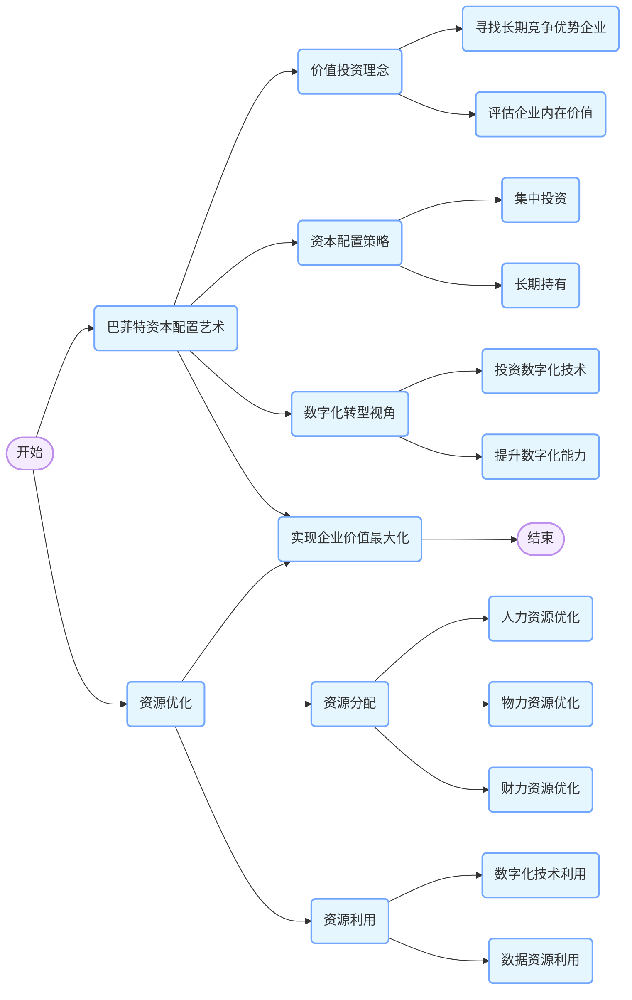

# 巴菲特的资本配置艺术：数字化转型中的资源优化

> 关键词：巴菲特、资本配置、数字化转型、资源优化、投资策略、价值创造、风险管理

> 摘要：本文深入探讨巴菲特的资本配置艺术在数字化转型背景下的应用与价值。首先介绍了研究的背景、目的、预期读者等内容，接着阐述了资本配置的核心概念与联系，详细讲解了相关核心算法原理及操作步骤，通过数学模型和公式进一步剖析资源优化的本质。结合项目实战案例，展示如何在实际中运用这些理念进行资源优化。分析了资本配置艺术在不同实际应用场景中的表现，推荐了相关的学习资源、开发工具和论文著作。最后总结未来发展趋势与挑战，并对常见问题进行解答。旨在为投资者、企业管理者等在数字化转型中实现资源优化提供有益的参考和借鉴。

## 1. 背景介绍 
### 1.1 目的和范围
在当今数字化快速发展的时代，企业面临着前所未有的挑战和机遇。数字化转型已成为企业生存和发展的必然选择，而在这个过程中，如何进行有效的资本配置和资源优化是关键问题。巴菲特作为全球著名的投资大师，其独特的资本配置艺术一直备受关注。本文章的目的在于深入研究巴菲特的资本配置理念，并探讨其在数字化转型背景下如何应用于企业的资源优化过程中。范围涵盖了资本配置的基本概念、相关算法原理、数学模型，以及在实际项目中的应用案例，同时分析其在不同实际场景中的应用情况，为企业和投资者提供全面的参考。

### 1.2 预期读者
本文预期读者主要包括企业管理者、投资者、金融分析师、数字化转型专家以及对投资和资源管理感兴趣的相关人员。企业管理者可以从中学到如何在数字化转型中合理配置企业的资源，提高企业的竞争力和价值；投资者可以借鉴巴菲特的投资策略，优化自己的投资组合；金融分析师可以深入了解资本配置的原理和方法，为客户提供更专业的建议；数字化转型专家可以思考如何将资本配置艺术融入到数字化转型的实践中；对投资和资源管理感兴趣的人员可以拓宽自己的知识面，提升对相关领域的理解。

### 1.3 文档结构概述
本文将按照以下结构展开：首先介绍研究的背景信息，包括目的、预期读者和文档结构概述等；接着阐述资本配置的核心概念与联系，通过文本示意图和 Mermaid 流程图展示其原理和架构；然后详细讲解核心算法原理和具体操作步骤，并使用 Python 源代码进行阐述；之后介绍相关的数学模型和公式，通过举例说明其应用；结合项目实战案例，介绍开发环境搭建、源代码实现和代码解读；分析资本配置艺术在不同实际应用场景中的情况；推荐相关的学习资源、开发工具和论文著作；最后总结未来发展趋势与挑战，对常见问题进行解答，并提供扩展阅读和参考资料。

### 1.4 术语表
#### 1.4.1 核心术语定义
- **资本配置**：指将资金分配到不同的资产、项目或业务领域，以实现特定的投资目标或企业战略目标的过程。
- **数字化转型**：企业利用数字技术对业务流程、商业模式、组织架构等进行全面变革和创新，以提高企业的效率、竞争力和价值创造能力的过程。
- **资源优化**：通过合理分配和利用资源，使资源的使用效率达到最大化，实现成本最小化和效益最大化的过程。
- **价值投资**：一种投资策略，强调寻找被低估的资产或企业，通过长期持有来获取资产或企业价值增长所带来的收益。

#### 1.4.2 相关概念解释
- **投资组合**：由多种不同的资产组成的集合，投资者通过合理配置投资组合中的资产，以达到分散风险、实现投资目标的目的。
- **风险调整后收益**：考虑了投资风险因素后的收益指标，用于评估投资的实际绩效。
- **企业内在价值**：企业未来预期现金流的现值，是企业真实价值的体现。

#### 1.4.3 缩略词列表
- **ROE**：Return on Equity，净资产收益率，反映股东权益的收益水平。
- **DCF**：Discounted Cash Flow，现金流折现法，一种评估企业内在价值的方法。
- **EPS**：Earnings Per Share，每股收益，反映普通股的获利水平。

## 2. 核心概念与联系 

### 核心概念原理
巴菲特的资本配置艺术基于价值投资理念，其核心在于寻找具有长期竞争优势和稳定现金流的企业，通过合理的资本配置来实现企业价值的最大化。在数字化转型的背景下，企业面临着技术创新、市场竞争和商业模式变革等多方面的挑战，资本配置需要更加注重对数字化技术和创新业务的投资，以提升企业的数字化能力和竞争力。

资源优化则是在资本配置的基础上，通过对企业内部资源的合理分配和利用，提高资源的使用效率，降低成本，实现企业的可持续发展。在数字化转型过程中，资源优化包括对人力资源、物力资源、财力资源等的优化配置，以及对数字化技术和数据资源的有效利用。

### 架构的文本示意图
```plaintext
巴菲特资本配置艺术
|-- 价值投资理念
|   |-- 寻找具有长期竞争优势的企业
|   |-- 评估企业内在价值
|-- 资本配置策略
|   |-- 集中投资
|   |-- 长期持有
|-- 数字化转型视角
|   |-- 对数字化技术和创新业务的投资
|   |-- 提升企业数字化能力

资源优化
|-- 资源分配
|   |-- 人力资源优化
|   |-- 物力资源优化
|   |-- 财力资源优化
|-- 资源利用
|   |-- 数字化技术利用
|   |-- 数据资源利用
```

### Mermaid 流程图


## 3. 核心算法原理 & 具体操作步骤 

### 核心算法原理
在巴菲特的资本配置艺术中，评估企业内在价值是关键环节。常用的方法是现金流折现法（DCF），其基本原理是将企业未来预期的现金流按照一定的折现率折现到当前时刻，得到企业的内在价值。

假设企业未来 $n$ 年的自由现金流分别为 $FCF_1, FCF_2, \cdots, FCF_n$，第 $n$ 年后企业进入稳定增长阶段，稳定增长率为 $g$，折现率为 $r$，则企业的内在价值 $V$ 可以通过以下公式计算：

$$V = \sum_{i=1}^{n} \frac{FCF_i}{(1 + r)^i} + \frac{FCF_n(1 + g)}{(r - g)(1 + r)^n}$$

### 具体操作步骤
1. **预测企业未来自由现金流**：分析企业的历史财务数据、市场前景、行业趋势等因素，预测企业未来 $n$ 年的自由现金流。
2. **确定折现率**：折现率反映了投资者对投资风险的预期，通常可以使用加权平均资本成本（WACC）作为折现率。
3. **确定稳定增长率**：根据企业所处的行业特点、市场竞争状况等因素，确定企业在稳定增长阶段的增长率。
4. **计算企业内在价值**：将预测的自由现金流、折现率和稳定增长率代入上述公式，计算企业的内在价值。
5. **进行投资决策**：将企业的内在价值与当前市场价格进行比较，如果内在价值大于市场价格，则认为该企业被低估，可以考虑投资；反之，则认为该企业被高估，不宜投资。

### Python 源代码实现
```python
def dcf_valuation(fcf_list, r, g):
    """
    现金流折现法计算企业内在价值
    :param fcf_list: 未来 n 年的自由现金流列表
    :param r: 折现率
    :param g: 稳定增长率
    :return: 企业内在价值
    """
    n = len(fcf_list)
    pv = 0
    # 计算前 n 年自由现金流的现值
    for i in range(n):
        pv += fcf_list[i] / (1 + r) ** (i + 1)
    # 计算第 n 年后稳定增长阶段的现金流现值
    terminal_value = fcf_list[-1] * (1 + g) / (r - g) / (1 + r) ** n
    # 企业内在价值
    value = pv + terminal_value
    return value

# 示例数据
fcf_list = [100, 120, 150, 180, 200]  # 未来 5 年的自由现金流
r = 0.1  # 折现率 10%
g = 0.05  # 稳定增长率 5%

# 计算企业内在价值
intrinsic_value = dcf_valuation(fcf_list, r, g)
print(f"企业内在价值: {intrinsic_value}")
```

## 4. 数学模型和公式 & 详细讲解 & 举例说明 

### 数学模型和公式
#### 现金流折现法（DCF）公式
$$V = \sum_{i=1}^{n} \frac{FCF_i}{(1 + r)^i} + \frac{FCF_n(1 + g)}{(r - g)(1 + r)^n}$$

其中：
- $V$ 表示企业的内在价值；
- $FCF_i$ 表示第 $i$ 年的自由现金流；
- $r$ 表示折现率；
- $g$ 表示稳定增长率；
- $n$ 表示预测期数。

#### 加权平均资本成本（WACC）公式
$$WACC = w_d \times r_d \times (1 - T) + w_e \times r_e$$

其中：
- $WACC$ 表示加权平均资本成本；
- $w_d$ 表示债务资本占总资本的比重；
- $r_d$ 表示债务资本成本；
- $T$ 表示企业所得税税率；
- $w_e$ 表示权益资本占总资本的比重；
- $r_e$ 表示权益资本成本。

### 详细讲解
#### 现金流折现法（DCF）
现金流折现法的核心思想是将企业未来的现金流折现到当前时刻，考虑了货币的时间价值和投资的风险。通过预测企业未来的自由现金流，选择合适的折现率和稳定增长率，可以计算出企业的内在价值。

预测自由现金流需要综合考虑企业的经营状况、市场前景、行业趋势等因素。折现率反映了投资者对投资风险的预期，通常可以使用加权平均资本成本（WACC）作为折现率。稳定增长率是指企业在长期稳定发展阶段的增长率，需要根据企业所处的行业特点和市场竞争状况进行合理估计。

#### 加权平均资本成本（WACC）
加权平均资本成本是企业各种资本来源的成本加权平均值，反映了企业的综合融资成本。债务资本成本通常可以根据企业的贷款利率或债券收益率来确定，权益资本成本可以使用资本资产定价模型（CAPM）等方法来计算。

### 举例说明
假设某企业未来 5 年的自由现金流分别为 100 万元、120 万元、150 万元、180 万元、200 万元，第 5 年后企业进入稳定增长阶段，稳定增长率为 5%。企业的债务资本占总资本的比重为 40%，债务资本成本为 6%，权益资本占总资本的比重为 60%，权益资本成本为 12%，企业所得税税率为 25%。

1. **计算加权平均资本成本（WACC）**
$$w_d = 0.4$$
$$r_d = 0.06$$
$$T = 0.25$$
$$w_e = 0.6$$
$$r_e = 0.12$$

$$WACC = 0.4 \times 0.06 \times (1 - 0.25) + 0.6 \times 0.12 = 0.018 + 0.072 = 0.09$$

2. **计算企业内在价值**
使用现金流折现法（DCF）公式，$r = 0.09$，$g = 0.05$，$n = 5$，$FCF_1 = 100$，$FCF_2 = 120$，$FCF_3 = 150$，$FCF_4 = 180$，$FCF_5 = 200$。

$$V = \frac{100}{(1 + 0.09)^1} + \frac{120}{(1 + 0.09)^2} + \frac{150}{(1 + 0.09)^3} + \frac{180}{(1 + 0.09)^4} + \frac{200}{(1 + 0.09)^5} + \frac{200(1 + 0.05)}{(0.09 - 0.05)(1 + 0.09)^5}$$

```python
import numpy as np

fcf_list = [100, 120, 150, 180, 200]
r = 0.09
g = 0.05
n = 5

pv = 0
for i in range(n):
    pv += fcf_list[i] / (1 + r) ** (i + 1)

terminal_value = fcf_list[-1] * (1 + g) / (r - g) / (1 + r) ** n
value = pv + terminal_value

print(f"企业内在价值: {value} 万元")
```

通过计算，该企业的内在价值约为 3354.84 万元。

## 5. 项目实战：代码实际案例和详细解释说明 

### 5.1  开发环境搭建
#### 编程语言
本项目使用 Python 作为开发语言，Python 具有简洁易读、丰富的库和工具等优点，非常适合进行数据分析和财务计算。

#### 开发工具
推荐使用 PyCharm 作为开发工具，PyCharm 是一款功能强大的 Python 集成开发环境（IDE），提供了代码编辑、调试、版本控制等一系列功能，能够提高开发效率。

#### 安装依赖库
本项目需要使用 `numpy` 库进行数值计算，`pandas` 库进行数据处理，可以使用以下命令进行安装：
```sh
pip install numpy pandas
```

### 5.2  源代码详细实现和代码解读
```python
import numpy as np
import pandas as pd

def dcf_valuation(fcf_list, r, g):
    """
    现金流折现法计算企业内在价值
    :param fcf_list: 未来 n 年的自由现金流列表
    :param r: 折现率
    :param g: 稳定增长率
    :return: 企业内在价值
    """
    n = len(fcf_list)
    pv = 0
    # 计算前 n 年自由现金流的现值
    for i in range(n):
        pv += fcf_list[i] / (1 + r) ** (i + 1)
    # 计算第 n 年后稳定增长阶段的现金流现值
    terminal_value = fcf_list[-1] * (1 + g) / (r - g) / (1 + r) ** n
    # 企业内在价值
    value = pv + terminal_value
    return value

def wacc_calculation(w_d, r_d, T, w_e, r_e):
    """
    计算加权平均资本成本（WACC）
    :param w_d: 债务资本占总资本的比重
    :param r_d: 债务资本成本
    :param T: 企业所得税税率
    :param w_e: 权益资本占总资本的比重
    :param r_e: 权益资本成本
    :return: 加权平均资本成本
    """
    wacc = w_d * r_d * (1 - T) + w_e * r_e
    return wacc

# 示例数据
fcf_data = pd.DataFrame({
    'Year': [1