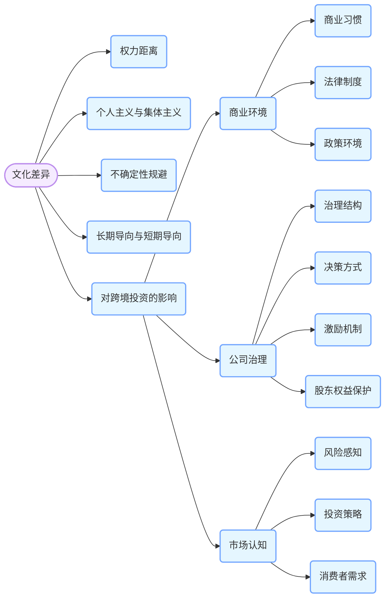

# 巴菲特的跨境投资经验：文化差异的影响

> 关键词：巴菲特、跨境投资、文化差异、投资经验、投资决策

> 摘要：本文深入探讨了巴菲特的跨境投资经验以及文化差异在其中所产生的影响。通过对巴菲特投资理念和实践的分析，详细阐述了文化差异在商业环境、公司治理、市场认知等方面对投资决策的作用机制。同时结合具体案例和相关理论，为投资者理解跨境投资中的文化因素提供了全面的视角，并总结出应对文化差异挑战的策略和方法，以期为跨境投资领域的从业者和研究者提供有价值的参考。

## 1. 背景介绍 
### 1.1 目的和范围
本研究的主要目的是深入剖析巴菲特在跨境投资过程中，文化差异所起到的影响。旨在揭示文化因素如何作用于投资决策、投资绩效等关键环节，为跨境投资者提供有益的借鉴和启示。研究范围涵盖了巴菲特主要的跨境投资案例，包括但不限于其在不同国家和地区的股票投资、企业并购等活动，以及与之相关的文化背景和商业环境分析。

### 1.2 预期读者
本文预期读者主要包括跨境投资领域的专业投资者、金融分析师、投资机构从业者等，他们可以从巴菲特的经验中获取应对文化差异的策略和方法。同时，对于对投资和文化研究感兴趣的学者、学生以及关注金融市场动态的普通投资者也具有一定的参考价值。

### 1.3 文档结构概述
本文首先介绍研究的背景和目的，明确预期读者和文档结构。接着阐述与跨境投资和文化差异相关的核心概念及其联系，包括文化差异的维度、对投资的影响机制等，并通过文本示意图和Mermaid流程图进行直观展示。然后详细讲解核心算法原理（在跨境投资中虽无严格意义算法，但会类比决策思路）及具体操作步骤，以Python代码示例辅助说明。随后引入数学模型和公式，结合实际案例进行详细讲解。在项目实战部分，以巴菲特的具体跨境投资案例为基础，介绍开发环境搭建（类比投资环境分析）、源代码详细实现（投资决策过程）和代码解读（决策分析）。之后探讨跨境投资中文化差异影响的实际应用场景，推荐相关的学习资源、开发工具框架和论文著作。最后总结未来发展趋势与挑战，解答常见问题，并提供扩展阅读和参考资料。

### 1.4 术语表
#### 1.4.1 核心术语定义
- **跨境投资**：指投资者将资金投入到本国以外的其他国家或地区的经济活动中，包括股票、债券、基金、企业并购等多种形式。
- **文化差异**：不同国家或地区在价值观、信仰、习俗、社会规范、商业习惯等方面存在的差异，这些差异会对人们的行为和决策产生影响。
- **投资决策**：投资者在进行投资活动时，根据自身的投资目标、风险承受能力、市场情况等因素，对投资对象、投资时机、投资金额等做出的选择和判断。

#### 1.4.2 相关概念解释
- **文化维度理论**：由荷兰学者霍夫斯泰德（Geert Hofstede）提出，将文化差异划分为权力距离、个人主义与集体主义、男性化与女性化、不确定性规避、长期导向与短期导向等维度，用于分析不同文化之间的差异和特点。
- **商业环境**：包括政治、经济、法律、社会文化等因素，是企业和投资者进行商业活动的外部条件。文化差异会对商业环境产生重要影响，进而影响投资决策。

#### 1.4.3 缩略词列表
- **GDP**：国内生产总值（Gross Domestic Product），是衡量一个国家或地区经济总量的重要指标。
- **PE**：市盈率（Price - Earnings Ratio），是股票价格与每股收益的比率，用于评估股票的估值水平。

## 2. 核心概念与联系 

### 核心概念原理
#### 文化差异的维度
文化差异可以从多个维度进行分析，其中霍夫斯泰德的文化维度理论具有广泛的应用。以下是几个主要维度的解释：
- **权力距离**：指社会成员对权力分配不平等的接受程度。在高权力距离的文化中，人们更倾向于接受等级制度和权威，决策往往由高层做出；而在低权力距离的文化中，人们更强调平等和参与，决策过程相对民主。
- **个人主义与集体主义**：个人主义文化强调个人的自由和利益，个人的决策和行为主要基于自身的目标和需求；集体主义文化则更注重集体的利益和和谐，个人的行为往往受到集体规范和价值观的约束。
- **不确定性规避**：反映了社会成员对不确定性和模糊性的容忍程度。高不确定性规避的文化中，人们倾向于避免风险，追求稳定和可预测性；低不确定性规避的文化中，人们更愿意接受风险和变化。
- **长期导向与短期导向**：长期导向的文化注重未来的规划和发展，强调坚持、节俭和延迟满足；短期导向的文化则更关注眼前的利益和即时满足。

#### 文化差异对跨境投资的影响机制
文化差异通过影响商业环境、公司治理、市场认知等方面，对跨境投资决策产生影响。具体如下：
- **商业环境**：不同文化背景下的商业习惯、法律制度、政策环境等存在差异，这些差异会影响企业的运营成本、市场机会和风险水平。例如，在一些国家，商业活动更注重人际关系和信任，而在另一些国家，更强调合同和法律的约束。
- **公司治理**：文化差异会影响公司的治理结构和决策方式。在个人主义文化中，公司的决策可能更倾向于个人的判断和创新；而在集体主义文化中，公司更注重团队合作和集体决策。此外，不同文化对管理层的激励机制、股东权益保护等方面也有不同的理解和实践。
- **市场认知**：投资者的文化背景会影响他们对市场的认知和判断。例如，不同文化对风险的感知和偏好不同，这会导致投资者在选择投资对象和投资策略时存在差异。同时，文化差异也会影响消费者的需求和行为，进而影响企业的市场表现。

### 架构的文本示意图
```plaintext
文化差异
├── 权力距离
├── 个人主义与集体主义
├── 不确定性规避
├── 长期导向与短期导向
│
└── 对跨境投资的影响
    ├── 商业环境
    │   ├── 商业习惯
    │   ├── 法律制度
    │   ├── 政策环境
    ├── 公司治理
    │   ├── 治理结构
    │   ├── 决策方式
    │   ├── 激励机制
    │   ├── 股东权益保护
    ├── 市场认知
        ├── 风险感知
        ├── 投资策略
        ├── 消费者需求
```

### Mermaid流程图


## 3. 核心算法原理 & 具体操作步骤 

### 核心算法原理（类比决策思路）
在跨境投资中，虽然没有严格意义上的算法，但可以类比一种决策思路。我们可以将投资决策看作是一个多因素综合评估的过程，其中文化差异作为一个重要因素参与到评估中。以下是一个简化的类比算法：

假设我们有一个投资评估函数 $f$，它综合考虑了多个因素，包括财务指标、市场环境、文化差异等。可以表示为：

$f = w_1 \times F + w_2 \times M + w_3 \times C$

其中，$F$ 表示财务指标得分，$M$ 表示市场环境得分，$C$ 表示文化差异得分，$w_1$、$w_2$、$w_3$ 分别是对应的权重，且 $w_1 + w_2 + w_3 = 1$。

### 具体操作步骤

#### 步骤 1：确定评估因素和权重
首先，需要确定参与评估的因素和它们的权重。财务指标可以包括市盈率、市净率、净资产收益率等；市场环境可以考虑市场规模、增长率、竞争程度等；文化差异得分可以通过对不同文化维度的评估得到。权重的确定可以根据投资者的经验和偏好进行调整。

#### 步骤 2：收集数据并计算得分
针对每个评估因素，收集相关的数据，并根据一定的标准计算得分。例如，对于财务指标，可以根据行业平均水平进行比较，得出相对得分。对于文化差异得分，可以使用霍夫斯泰德的文化维度数据进行量化评估。

#### 步骤 3：计算投资评估函数值
将计算得到的各个因素得分代入投资评估函数 $f$ 中，计算出最终的评估值。

#### 步骤 4：做出投资决策
根据投资评估函数值的大小，做出投资决策。一般来说，评估值越高，说明该投资项目越具有吸引力。

### Python源代码示例
```python
# 定义财务指标得分
F = 0.7

# 定义市场环境得分
M = 0.6

# 定义文化差异得分
C = 0.5

# 定义权重
w1 = 0.4
w2 = 0.3
w3 = 0.3

# 计算投资评估函数值
f = w1 * F + w2 * M + w3 * C

# 输出结果
print(f"投资评估函数值: {f}")

# 根据评估值做出决策
if f > 0.6:
    print("建议投资")
else:
    print("不建议投资")
```

## 4. 数学模型和公式 & 详细讲解 & 举例说明 

### 数学模型和公式
在跨境投资中，我们可以使用上述提到的投资评估函数 $f = w_1 \times F + w_2 \times M + w_3 \times C$ 作为数学模型。这个模型的核心思想是将多个影响投资决策的因素进行综合考虑，通过加权求和的方式得到一个综合评估值。

### 详细讲解
- **权重的意义**：权重 $w_1$、$w_2$、$w_3$ 表示每个因素在投资决策中的重要程度。例如，如果投资者更看重财务指标，那么可以将 $w_1$ 设置得较大；如果认为文化差异对投资的影响较大，则可以适当提高 $w_3$ 的值。
- **得分的计算**：财务指标得分 $F$、市场环境得分 $M$ 和文化差异得分 $C$ 可以通过不同的方法计算得到。财务指标得分可以根据财务报表数据进行分析和比较；市场环境得分可以通过市场调研和数据分析得出；文化差异得分可以参考文化维度理论和相关的研究数据。

### 举例说明
假设我们要评估一个对日本企业的投资项目。首先，我们确定各个因素的权重：$w_1 = 0.4$（财务指标），$w_2 = 0.3$（市场环境），$w_3 = 0.3$（文化差异）。

经过分析，该企业的财务指标得分 $F = 0.8$，市场环境得分 $M = 0.7$，文化差异得分 $C = 0.6$。

将这些值代入投资评估函数：

$f = 0.4 \times 0.8 + 0.3 \times 0.7 + 0.3 \times 0.6$

$= 0.32 + 0.21 + 0.18$

$= 0.71$

由于 $f = 0.71 > 0.6$，根据我们设定的决策标准，建议对该日本企业进行投资。

## 5. 项目实战：代码实际案例和详细解释说明 

### 5.1  开发环境搭建
在跨境投资分析中，我们可以使用 Python 作为主要的开发语言，借助一些常用的数据分析和可视化库。以下是搭建开发环境的步骤：

#### 安装 Python
可以从 Python 官方网站（https://www.python.org/downloads/）下载适合自己操作系统的 Python 安装包，并按照安装向导进行安装。

#### 安装必要的库
使用 pip 命令安装以下常用库：
```sh
pip install pandas numpy matplotlib
```
- **pandas**：用于数据处理和分析。
- **numpy**：提供高效的数值计算功能。
- **matplotlib**：用于数据可视化。

### 5.2  源代码详细实现和代码解读
以下是一个更完整的跨境投资分析代码示例，结合了数据读取、处理、计算和可视化：

```python
import pandas as pd
import numpy as np
import matplotlib.pyplot as plt

# 读取数据
data = pd.read_csv('investment_data.csv')

# 数据预处理
# 假设数据包含财务指标、市场环境和文化差异得分
F = data['financial_score'].values
M = data['market_score'].values
C = data['culture_score'].values

# 定义权重
w1 = 0.4
w2 = 0.3
w3 = 0.3

# 计算投资评估函数值
f = w1 * F + w2 * M + w3 * C

# 将评估值添加到数据框中
data['investment_score'] = f

# 筛选出建议投资的项目
recommended_projects = data[data['investment_score'] > 0.6]

# 可视化投资评估值分布
plt.hist(f, bins=20, edgecolor='k')
plt.xlabel('Investment Score')
plt.ylabel('Frequency')
plt.title('Distribution of Investment Scores')
plt.show()

# 输出建议投资的项目
print("建议投资的项目:")
print(recommended_projects)
```

### 代码解读与分析
- **数据读取**：使用 `pandas` 库的 `read_csv` 函数读取存储投资数据的 CSV 文件。
- **数据预处理**：从数据中提取财务指标得分、市场环境得分和文化差异得分，并将其转换为 `numpy` 数组。
- **计算投资评估函数值**：根据定义的权重，计算每个项目的投资评估函数值，并将结果添加到数据框中。
- **筛选建议投资的项目**：根据设定的决策标准（评估值大于 0.6），筛选出建议投资的项目。
- **可视化**：使用 `matplotlib` 库绘制投资评估值的直方图，直观展示评估值的分布情况。
- **输出结果**：打印出建议投资的项目信息。

## 6. 实际应用场景 
### 股票投资
在跨境股票投资中，文化差异会影响投资者对不同国家和地区上市公司的评估。例如，美国和日本的企业文化存在很大差异。美国企业更注重创新和短期业绩，而日本企业则更强调长期稳定发展和团队合作。巴菲特在进行跨境股票投资时，需要考虑这些文化差异对企业竞争力和发展前景的影响。如果投资美国科技股，可能更关注企业的创新能力和市场份额；而投资日本制造业股票，则需要考虑企业的长期战略和供应链管理能力。

### 企业并购
在跨境企业并购中，文化差异是一个重要的挑战。不同文化背景下的企业在管理模式、组织架构、员工价值观等方面存在差异，这些差异可能导致并购后的整合困难。例如，当美国企业并购欧洲企业时，可能会面临不同的劳动法规、工会文化和决策方式等问题。巴菲特在进行跨境企业并购时，会充分考虑文化差异对并购整合的影响，提前制定相应的整合策略，以确保并购的成功。

### 新兴市场投资
新兴市场通常具有独特的文化和商业环境，文化差异对投资的影响更为显著。例如，在一些亚洲和非洲国家，人际关系和政治因素在商业活动中起着重要作用。巴菲特在投资新兴市场时，需要深入了解当地的文化和政治环境，评估这些因素对企业经营和投资回报的影响。同时，新兴市场的消费者需求和消费习惯也受到文化的影响，投资者需要根据当地文化特点调整投资策略。

## 7. 工具和资源推荐
### 7.1 学习资源推荐
#### 7.1.1 书籍推荐
- 《穷查理宝典：查理·芒格的智慧箴言录》：书中包含了巴菲特的合作伙伴查理·芒格的投资智慧和多元思维模型，对于理解跨境投资中的决策思路和文化因素有很大帮助。
- 《跨国公司文化管理》：系统介绍了跨国公司在不同文化环境下的管理策略和方法，对跨境投资中的文化差异应对具有指导意义。
- 《文化与组织：心理软件的力量》：作者是霍夫斯泰德，详细阐述了文化维度理论及其在跨文化管理和投资中的应用。

#### 7.1.2 在线课程
- Coursera 上的“Cross - Cultural Management”：由知名教授授课，涵盖了跨文化管理的各个方面，包括文化差异对商业决策的影响。
- edX 上的“Investment Management”：提供了全面的投资管理知识，其中也涉及到跨境投资的相关内容。

#### 7.1.3 技术博客和网站
- Seeking Alpha：一个专业的投资研究网站，提供全球范围内的投资分析和评论，包括跨境投资的案例和观点。
- McKinsey Global Institute：麦肯锡全球研究院的网站，发布有关全球经济、商业和投资的研究报告，其中不乏关于文化差异对投资影响的分析。

### 7.2 开发工具框架推荐
#### 7.2.1 IDE和编辑器
- PyCharm：一款专业的 Python 集成开发环境，提供了丰富的代码编辑、调试和分析功能，适合进行跨境投资数据分析和算法实现。
- Jupyter Notebook：一个交互式的开发环境，方便进行数据探索、可视化和代码演示，对于快速验证投资分析思路非常有用。

#### 7.2.2 调试和性能分析工具
- pdb：Python 内置的调试工具，可以帮助开发者定位代码中的问题。
- cProfile：用于分析 Python 代码的性能，找出性能瓶颈，优化投资分析算法。

#### 7.2.3 相关框架和库
- Scikit - learn：一个强大的机器学习库，可用于构建投资预测模型，考虑文化差异等因素对投资回报的影响。
- TensorFlow：一个深度学习框架，可用于处理复杂的投资数据和进行模型训练。

### 7.3 相关论文著作推荐
#### 7.3.1 经典论文
- Geert Hofstede, "Culture's Consequences: Comparing Values, Behaviors, Institutions, and Organizations Across Nations"：该论文提出了文化维度理论，为跨文化研究奠定了基础。
- Harry C. Triandis, "Individualism and Collectivism"：深入探讨了个人主义和集体主义文化的差异及其对行为和决策的影响。

#### 7.3.2 最新研究成果
- 近年来在《Journal of International Business Studies》《Academy of Management Journal》等期刊上发表的关于跨境投资和文化差异的研究论文，反映了该领域的最新研究动态。

#### 7.3.3 应用案例分析
- 一些知名咨询公司（如贝恩、波士顿咨询等）发布的跨境投资案例分析报告，通过实际案例展示了文化差异在投资中的影响和应对策略。

## 8. 总结：未来发展趋势与挑战
### 未来发展趋势
- **文化融合促进跨境投资**：随着全球化的深入发展，不同文化之间的交流和融合将更加频繁。这将有助于减少文化差异对跨境投资的阻碍，促进跨境投资的进一步增长。例如，跨国企业将更加注重文化融合，采用更加灵活和包容的管理模式，以适应不同文化背景的市场和员工。
- **数字化技术降低文化差异影响**：数字化技术的发展将为跨境投资提供更多的便利和支持。通过互联网、大数据和人工智能等技术，投资者可以更深入地了解不同国家和地区的市场和文化信息，减少因文化差异导致的信息不对称。同时，数字化平台也为跨境投资提供了更高效的交易和沟通渠道。
- **新兴市场投资机会增加**：新兴市场的经济增长和消费升级将带来更多的投资机会。虽然新兴市场存在较大的文化差异，但随着投资者对新兴市场文化的了解和适应能力的提高，将有更多的资金流入这些市场。例如，亚洲、非洲和拉丁美洲的一些国家将成为跨境投资的热点地区。

### 挑战
- **文化冲突加剧**：尽管文化融合是趋势，但在短期内，不同文化之间的冲突仍然可能加剧。随着跨境投资的增加，不同文化背景的企业和投资者之间的摩擦可能会增多。例如，在企业并购和合作中，文化差异可能导致管理理念、决策方式和员工价值观的冲突，影响企业的运营和发展。
- **政策和法规的不确定性**：不同国家和地区的政策和法规受到文化、政治等多种因素的影响，存在较大的不确定性。投资者需要不断关注和适应这些政策和法规的变化，否则可能面临投资风险。例如，一些国家可能会出台限制外资的政策，或者对特定行业的投资进行严格监管。
- **文化差异的复杂性**：文化差异是一个复杂的概念，涉及到价值观、信仰、习俗等多个方面。随着全球化的发展，文化的多样性和复杂性将进一步增加，投资者需要具备更高的跨文化素养和分析能力，才能准确评估文化差异对投资的影响。

## 9. 附录：常见问题与解答
### 问题 1：如何量化文化差异对投资的影响？
解答：可以使用文化维度理论，如霍夫斯泰德的文化维度数据，对不同国家和地区的文化差异进行量化评估。同时，结合财务指标、市场数据等，构建综合的投资评估模型，将文化差异作为一个重要因素纳入其中。

### 问题 2：巴菲特在跨境投资中是如何应对文化差异的？
解答：巴菲特通常会深入了解目标国家和地区的文化、商业环境和法律制度。他会与当地的管理层和专业人士进行沟通，获取第一手信息。此外，他注重企业的长期价值和基本面，不会因短期的文化差异波动而轻易改变投资决策。

### 问题 3：文化差异对跨境投资的影响是否会随着时间的推移而减小？
解答：总体来说，随着全球化的发展和文化交流的增加，文化差异对跨境投资的影响可能会逐渐减小。但在某些情况下，文化差异可能会长期存在，甚至在特定时期和领域会更加凸显。投资者需要持续关注和适应文化差异的变化。

### 问题 4：在新兴市场投资中，如何平衡文化差异和投资回报的关系？
解答：首先要深入了解新兴市场的文化特点和商业环境，制定符合当地文化的投资策略。同时，要对投资项目进行充分的尽职调查，评估文化差异可能带来的风险和机遇。在追求投资回报的同时，注重风险管理，通过多元化投资等方式降低文化差异带来的不确定性。

## 10. 扩展阅读 & 参考资料
### 扩展阅读
- 《全球投资》：提供了更广泛的全球投资视角，包括不同国家和地区的投资环境、市场特点和投资策略。
- 《跨文化沟通》：深入探讨了跨文化沟通的技巧和方法，对于在跨境投资中与不同文化背景的人进行有效沟通具有重要意义。

### 参考资料
- 巴菲特历年的致股东信，可从伯克希尔·哈撒韦公司官方网站获取。
- 相关的金融数据库，如 Bloomberg、Wind 等，提供了丰富的市场数据和企业信息。
- 各国政府和国际组织发布的经济和投资报告，如世界银行、国际货币基金组织等。

作者：AI天才研究院/AI Genius Institute & 禅与计算机程序设计艺术 /Zen And The Art of Computer Programming