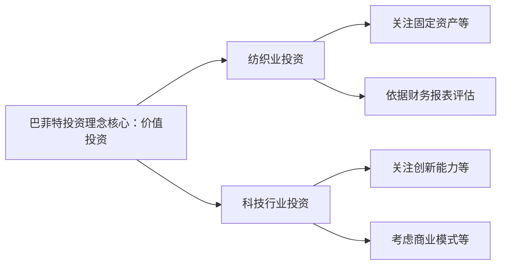

# 巴菲特的跨界投资：从纺织到科技的转变

> 关键词：巴菲特、跨界投资、纺织业、科技行业、投资策略转变

> 摘要：本文深入探讨了股神巴菲特从传统纺织业投资到科技行业投资的转变历程。详细分析了这一转变背后的原因、核心投资理念的演进、相关的投资算法与决策逻辑，结合数学模型对其投资收益进行剖析。通过实际案例展示了巴菲特在不同行业的投资操作，探讨了这种跨界投资在实际中的应用场景，同时推荐了学习相关投资知识的工具和资源。最后总结了巴菲特跨界投资对未来投资领域发展趋势的启示以及可能面临的挑战，并对常见问题进行解答，提供扩展阅读与参考资料。

## 1. 背景介绍 
### 1.1 目的和范围
本文旨在全面解析巴菲特从纺织业跨界到科技行业投资的现象。通过研究其投资决策的过程、背后的原理以及实际效果，为投资者、金融从业者和对投资领域感兴趣的人士提供深入的见解。范围涵盖巴菲特在纺织业和科技行业的主要投资案例、投资理念的转变以及对未来投资趋势的影响。

### 1.2 预期读者
本文预期读者包括专业投资者、金融分析师、投资领域的学生和研究者，以及对巴菲特投资理念和跨界投资策略感兴趣的普通读者。无论是希望学习投资技巧，还是对金融市场动态有深入了解需求的人群，都能从本文中获得有价值的信息。

### 1.3 文档结构概述
本文首先介绍相关背景信息，包括目的、预期读者和文档结构。接着阐述核心概念，如巴菲特的投资理念及其在不同行业的体现。然后详细讲解核心算法原理和具体操作步骤，通过数学模型分析投资收益。在项目实战部分，通过实际案例展示巴菲特的投资操作。之后探讨实际应用场景，推荐学习工具和资源。最后总结未来发展趋势与挑战，解答常见问题并提供扩展阅读与参考资料。

### 1.4 术语表
#### 1.4.1 核心术语定义
- **跨界投资**：指投资者从一个行业转向另一个不同行业进行投资的行为，涉及对不同行业特点、市场环境和投资风险的重新评估。
- **内在价值**：企业在其存续期间内所产生的现金流量的折现值，是巴菲特投资决策的重要依据。
- **安全边际**：股票的市场价格低于其内在价值的部分，为投资提供一定的风险缓冲。

#### 1.4.2 相关概念解释
- **价值投资**：一种基于对企业内在价值评估的投资策略，投资者寻找被低估的股票并长期持有，以获得企业成长带来的收益。
- **护城河理论**：企业拥有的可持续竞争优势，如同城堡周围的护城河，保护企业免受竞争对手的侵蚀，确保企业长期稳定的盈利。

#### 1.4.3 缩略词列表
- **ROE**：净资产收益率（Return on Equity），衡量企业盈利能力的重要指标，反映股东权益的收益水平。
- **PEG**：市盈率相对盈利增长比率（Price/Earnings to Growth Ratio），用于评估股票的估值是否合理，综合考虑了市盈率和盈利增长率。

## 2. 核心概念与联系 
### 2.1 巴菲特的投资理念核心
巴菲特的投资理念核心是价值投资，即通过深入研究企业的基本面，评估其内在价值，寻找被市场低估的股票，并长期持有。他强调企业的竞争优势和可持续盈利能力，认为投资者应该像购买整个企业一样购买股票。

### 2.2 纺织业投资的特点与理念体现
在早期投资纺织业时，巴菲特遵循价值投资理念，寻找具有一定市场地位和盈利能力的纺织企业。当时纺织业是传统制造业的代表，企业的价值主要体现在固定资产、生产能力和市场份额上。巴菲特会关注企业的财务报表，评估其资产负债状况、盈利能力和现金流情况。例如，他投资的伯克希尔 - 哈撒韦公司原本是一家纺织企业，巴菲特认为其具有一定的品牌价值和市场基础，但随着行业竞争加剧和技术变革，纺织业逐渐面临困境。

### 2.3 科技行业投资的特点与理念转变
随着科技行业的崛起，巴菲特的投资理念也逐渐发生转变。科技行业具有高增长、高风险、技术迭代快的特点，企业的价值更多地体现在创新能力、技术优势和市场潜力上。巴菲特开始关注科技企业的商业模式、用户基础和行业前景。例如，他投资苹果公司，不仅看重其强大的品牌影响力和庞大的用户群体，还看到了苹果在硬件、软件和服务生态系统方面的竞争优势。

### 2.4 核心概念联系的文本示意图
```plaintext
巴菲特投资理念核心（价值投资）
|
|-- 纺织业投资
|   |-- 关注固定资产、生产能力、市场份额
|   |-- 依据财务报表评估企业价值
|
|-- 科技行业投资
|   |-- 关注创新能力、技术优势、市场潜力
|   |-- 考虑商业模式、用户基础和行业前景
```

### 2.5 核心概念联系的 Mermaid 流程图


## 3. 核心算法原理 & 具体操作步骤 
### 3.1 内在价值评估算法
巴菲特评估企业内在价值的核心算法是现金流折现法（Discounted Cash Flow, DCF）。该算法的基本原理是将企业未来预计产生的现金流量按照一定的折现率折现到当前时刻，得到企业的内在价值。

以下是用 Python 实现的简化版现金流折现法代码：
```python
def dcf_valuation(cash_flows, discount_rate):
    """
    计算企业的内在价值
    :param cash_flows: 未来各期的现金流量列表
    :param discount_rate: 折现率
    :return: 企业的内在价值
    """
    present_value = 0
    for i, cash_flow in enumerate(cash_flows):
        present_value += cash_flow / ((1 + discount_rate) ** (i + 1))
    return present_value

# 示例
cash_flows = [100, 120, 150, 180, 200]
discount_rate = 0.1
intrinsic_value = dcf_valuation(cash_flows, discount_rate)
print(f"企业的内在价值为: {intrinsic_value}")
```
### 3.2 安全边际计算
安全边际是指股票的市场价格低于其内在价值的部分。计算安全边际的公式为：
$$安全边际 = \frac{内在价值 - 市场价格}{内在价值} \times 100\%$$

以下是用 Python 实现的安全边际计算代码：
```python
def safety_margin(intrinsic_value, market_price):
    """
    计算安全边际
    :param intrinsic_value: 企业的内在价值
    :param market_price: 股票的市场价格
    :return: 安全边际百分比
    """
    return ((intrinsic_value - market_price) / intrinsic_value) * 100

# 示例
market_price = 150
margin = safety_margin(intrinsic_value, market_price)
print(f"安全边际为: {margin}%")
```
### 3.3 具体操作步骤
1. **行业研究**：对目标行业进行深入研究，了解行业的发展趋势、竞争格局、技术变革等因素。对于纺织业，要关注原材料价格波动、劳动力成本、市场需求变化等；对于科技行业，要关注技术创新速度、行业标准制定、用户需求变化等。
2. **企业筛选**：根据行业研究结果，筛选出具有竞争优势和可持续盈利能力的企业。可以通过分析企业的财务报表、市场份额、品牌影响力、管理层能力等指标进行筛选。
3. **内在价值评估**：运用现金流折现法等方法评估企业的内在价值。在评估过程中，需要对企业未来的现金流量进行合理预测，并选择合适的折现率。
4. **安全边际计算**：计算股票的安全边际，选择安全边际较高的股票进行投资。一般来说，安全边际越高，投资风险越低。
5. **投资决策**：综合考虑企业的内在价值、安全边际、行业前景等因素，做出投资决策。如果股票的内在价值高于市场价格，且安全边际足够大，同时行业前景良好，则可以考虑买入该股票。

## 4. 数学模型和公式 & 详细讲解 & 举例说明 
### 4.1 现金流折现法公式
现金流折现法的基本公式为：
$$V = \sum_{t=1}^{n} \frac{CF_t}{(1 + r)^t}$$
其中，$V$ 表示企业的内在价值，$CF_t$ 表示第 $t$ 期的现金流量，$r$ 表示折现率，$n$ 表示预测期数。

### 4.2 公式详细讲解
- **现金流量 $CF_t$**：是指企业在未来各期实际产生的现金流入减去现金流出后的净额。预测现金流量需要考虑企业的营业收入、成本费用、资本支出等因素。一般来说，可以根据企业的历史财务数据和行业发展趋势进行预测。
- **折现率 $r$**：是将未来现金流量折现到当前时刻的比率，反映了资金的时间价值和投资风险。折现率的选择需要考虑市场利率、企业的风险水平等因素。一般来说，风险较高的企业，折现率也会相应较高。
- **预测期数 $n$**：是指预测企业现金流量的时间范围。预测期数的选择需要根据企业的行业特点和发展阶段进行合理确定。对于一些成熟的企业，可以预测较长的时间；对于一些新兴的企业，预测期数可能较短。

### 4.3 举例说明
假设一家企业未来 5 年的现金流量分别为 100 万元、120 万元、150 万元、180 万元和 200 万元，折现率为 10%。则该企业的内在价值为：
$$V = \frac{100}{(1 + 0.1)^1} + \frac{120}{(1 + 0.1)^2} + \frac{150}{(1 + 0.1)^3} + \frac{180}{(1 + 0.1)^4} + \frac{200}{(1 + 0.1)^5}$$
```python
cash_flows = [100, 120, 150, 180, 200]
discount_rate = 0.1
intrinsic_value = dcf_valuation(cash_flows, discount_rate)
print(f"企业的内在价值为: {intrinsic_value} 万元")
```
计算结果显示，该企业的内在价值约为 572.57 万元。如果该企业的股票市场价格低于 572.57 万元，则存在投资机会。

### 4.4 其他相关数学模型
除了现金流折现法，巴菲特还会使用一些其他的数学模型和指标来辅助投资决策，如净资产收益率（ROE）和市盈率相对盈利增长比率（PEG）。

- **净资产收益率（ROE）**：计算公式为：
$$ROE = \frac{净利润}{净资产} \times 100\%$$
ROE 反映了企业运用自有资本的效率，是衡量企业盈利能力的重要指标。一般来说，ROE 较高的企业，盈利能力较强。

- **市盈率相对盈利增长比率（PEG）**：计算公式为：
$$PEG = \frac{市盈率}{盈利增长率}$$
PEG 综合考虑了市盈率和盈利增长率，用于评估股票的估值是否合理。一般来说，PEG 小于 1 的股票，估值相对较低，具有一定的投资价值。

## 5. 项目实战：代码实际案例和详细解释说明 
### 5.1 开发环境搭建
在进行投资分析和代码实现时，我们可以使用 Python 编程语言和一些常用的数据分析库，如 Pandas、Numpy 等。以下是搭建开发环境的步骤：
1. **安装 Python**：可以从 Python 官方网站（https://www.python.org/downloads/）下载并安装 Python 3.x 版本。
2. **安装必要的库**：打开命令行工具，使用以下命令安装 Pandas 和 Numpy：
```sh
pip install pandas numpy
```

### 5.2 源代码详细实现和代码解读
以下是一个综合运用前面介绍的算法和指标进行股票投资分析的代码示例：
```python
import pandas as pd
import numpy as np

# 定义现金流折现法函数
def dcf_valuation(cash_flows, discount_rate):
    present_value = 0
    for i, cash_flow in enumerate(cash_flows):
        present_value += cash_flow / ((1 + discount_rate) ** (i + 1))
    return present_value

# 定义安全边际计算函数
def safety_margin(intrinsic_value, market_price):
    return ((intrinsic_value - market_price) / intrinsic_value) * 100

# 定义 ROE 计算函数
def roe(net_income, net_assets):
    return (net_income / net_assets) * 100

# 定义 PEG 计算函数
def peg(pe_ratio, growth_rate):
    return pe_ratio / growth_rate

# 示例数据
data = {
    '股票代码': ['A', 'B', 'C'],
    '未来 5 年现金流量（万元）': [[100, 120, 150, 180, 200], [80, 100, 120, 140, 160], [120, 150, 180, 210, 240]],
    '折现率': [0.1, 0.1, 0.1],
    '市场价格（万元）': [500, 400, 600],
    '净利润（万元）': [100, 80, 120],
    '净资产（万元）': [500, 400, 600],
    '市盈率': [10, 12, 8],
    '盈利增长率': [0.2, 0.15, 0.25]
}

df = pd.DataFrame(data)

# 计算内在价值
df['内在价值'] = df.apply(lambda row: dcf_valuation(row['未来 5 年现金流量（万元）'], row['折现率']), axis=1)

# 计算安全边际
df['安全边际'] = df.apply(lambda row: safety_margin(row['内在价值'], row['市场价格（万元）']), axis=1)

# 计算 ROE
df['ROE'] = df.apply(lambda row: roe(row['净利润（万元）'], row['净资产（万元）']), axis=1)

# 计算 PEG
df['PEG'] = df.apply(lambda row: peg(row['市盈率'], row['盈利增长率']), axis=1)

# 筛选投资标的
selected_stocks = df[(df['安全边际'] > 20) & (df['ROE'] > 15) & (df['PEG'] < 1)]

print(selected_stocks)
```
### 5.3 代码解读与分析
1. **数据准备**：首先定义了一个包含股票信息的字典 `data`，包括股票代码、未来 5 年现金流量、折现率、市场价格、净利润、净资产、市盈率和盈利增长率等信息。然后使用 Pandas 的 `DataFrame` 将字典转换为数据框。
2. **指标计算**：使用定义好的函数分别计算每只股票的内在价值、安全边际、ROE 和 PEG。通过 Pandas 的 `apply` 方法将函数应用到每一行数据上。
3. **投资标的筛选**：根据安全边际大于 20%、ROE 大于 15% 和 PEG 小于 1 的条件筛选出符合要求的股票。
4. **结果输出**：打印筛选出的投资标的信息。

通过这个代码示例，我们可以看到如何综合运用各种投资指标和算法进行股票投资分析和决策。

## 6. 实际应用场景 
### 6.1 个人投资者的应用
对于个人投资者来说，巴菲特的跨界投资理念和方法可以帮助他们拓宽投资视野，从不同行业中寻找投资机会。个人投资者可以学习巴菲特的价值投资理念，通过深入研究企业的基本面，评估其内在价值，选择具有安全边际的股票进行投资。例如，在科技行业快速发展的今天，个人投资者可以关注一些具有创新能力和市场潜力的科技企业，同时结合传统行业中被低估的优质企业，构建多元化的投资组合。

### 6.2 机构投资者的应用
机构投资者如基金公司、保险公司等，可以借鉴巴菲特的跨界投资策略，优化资产配置。机构投资者可以根据不同行业的发展趋势和市场环境，调整投资组合中不同行业的权重。例如，在科技行业崛起的背景下，机构投资者可以适当增加科技股的投资比例，同时保持对传统行业中优质企业的投资，以实现风险分散和收益最大化。

### 6.3 企业战略投资的应用
企业在进行战略投资时，也可以参考巴菲特的投资理念。企业可以通过跨界投资进入新的行业，拓展业务领域，实现多元化发展。例如，一家传统制造业企业可以投资科技企业，获取先进的技术和创新能力，提升自身的竞争力。同时，企业在投资过程中也需要评估目标企业的内在价值和安全边际，确保投资的合理性和安全性。

## 7. 工具和资源推荐
### 7.1 学习资源推荐
#### 7.1.1 书籍推荐
- 《聪明的投资者》（The Intelligent Investor）：本杰明·格雷厄姆著，是价值投资领域的经典之作，巴菲特称这本书是他投资生涯的启蒙读物。
- 《巴菲特致股东的信：股份公司教程》（Letters to Shareholders of Berkshire Hathaway）：沃伦·巴菲特著，收录了巴菲特历年致股东的信，详细阐述了他的投资理念和方法。
- 《穷查理宝典：查理·芒格的智慧箴言录》（Poor Charlie's Almanack: The Wit and Wisdom of Charles T. Munger）：彼得·考夫曼编著，介绍了巴菲特的合作伙伴查理·芒格的投资智慧和多元思维模型。

#### 7.1.2 在线课程
- Coursera 上的“投资学原理”（Principles of Investing）课程，由知名教授授课，系统介绍投资学的基本原理和方法。
- edX 上的“价值投资基础”（Foundations of Value Investing）课程，深入讲解价值投资的理论和实践。

#### 7.1.3 技术博客和网站
- 雪球网（https://xueqiu.com/）：国内知名的投资交流社区，提供股票、基金等投资品种的资讯和分析，用户可以在上面分享投资经验和观点。
- Seeking Alpha（https://seekingalpha.com/）：国外知名的投资研究网站，提供专业的投资分析报告和评论。

### 7.2 开发工具框架推荐
#### 7.2.1 IDE和编辑器
- PyCharm：一款专业的 Python 集成开发环境，具有代码编辑、调试、自动补全等功能，适合进行投资分析和代码开发。
- Jupyter Notebook：一个交互式的开发环境，可以在浏览器中编写和运行代码，同时支持文本、图片、公式等多种格式的展示，方便进行数据分析和可视化。

#### 7.2.2 调试和性能分析工具
- PDB：Python 自带的调试工具，可以帮助开发者定位代码中的错误和问题。
- cProfile：Python 标准库中的性能分析工具，可以分析代码的运行时间和资源消耗情况，帮助开发者优化代码性能。

#### 7.2.3 相关框架和库
- Pandas：一个强大的数据分析库，提供了数据结构和数据分析工具，方便进行数据处理和分析。
- Numpy：一个用于科学计算的库，提供了高效的数组操作和数学函数，是许多数据分析和机器学习库的基础。
- Matplotlib：一个用于数据可视化的库，可以绘制各种类型的图表，如折线图、柱状图、散点图等。

### 7.3 相关论文著作推荐
#### 7.3.1 经典论文
- 《证券分析》（Security Analysis）：本杰明·格雷厄姆和戴维·多德著，是价值投资理论的奠基之作，提出了内在价值、安全边际等重要概念。
- 《有效市场假说》（Efficient Markets Hypothesis）：尤金·法玛著，探讨了市场效率和股票价格的形成机制，对投资理论和实践产生了深远影响。

#### 7.3.2 最新研究成果
- 可以关注《金融研究》《管理世界》等国内权威金融期刊，以及 Journal of Finance、Review of Financial Studies 等国际知名金融学术期刊，了解投资领域的最新研究成果。

#### 7.3.3 应用案例分析
- 《伟大的博弈：华尔街金融帝国的崛起（1653 - 2011）》（The Great Game: The Emergence of Wall Street as a World Power, 1653 - 2011）：约翰·斯蒂尔·戈登著，通过讲述华尔街的历史，分析了不同时期的投资案例和市场变化。

## 8. 总结：未来发展趋势与挑战
### 8.1 未来发展趋势
- **科技投资比重增加**：随着科技的不断进步和创新，科技行业将继续保持快速发展的态势。巴菲特等投资者可能会进一步增加对科技行业的投资比重，尤其是人工智能、大数据、云计算、生物科技等领域。
- **跨界投资常态化**：不同行业之间的界限越来越模糊，跨界融合成为趋势。投资者将更加注重跨行业的投资机会，通过投资不同行业的企业，实现多元化的投资组合，降低投资风险。
- **可持续投资兴起**：随着社会对环境保护、社会责任和公司治理（ESG）的关注度不断提高，可持续投资将成为未来投资的重要方向。投资者将更加关注企业的可持续发展能力和社会责任感，将 ESG 因素纳入投资决策的考量范围。

### 8.2 面临的挑战
- **科技行业风险**：科技行业具有高增长、高风险的特点，技术迭代快，市场竞争激烈。投资者在投资科技企业时，需要准确评估企业的技术实力、创新能力和市场前景，避免投资失败。
- **跨界投资难度**：跨界投资需要投资者具备跨行业的知识和经验，了解不同行业的特点和规律。同时，不同行业的投资环境和风险因素也存在差异，投资者需要具备较强的风险识别和控制能力。
- **市场不确定性**：全球经济形势、政治局势、政策变化等因素都会对市场产生影响，增加投资的不确定性。投资者需要密切关注市场动态，及时调整投资策略，以应对市场变化。

## 9. 附录：常见问题与解答
### 9.1 巴菲特为什么要从纺织业转向科技行业投资？
随着时代的发展，纺织业作为传统制造业面临着诸多挑战，如原材料价格波动、劳动力成本上升、市场竞争加剧等，行业盈利能力逐渐下降。而科技行业具有高增长、高创新的特点，代表着未来经济发展的方向。巴菲特认识到科技行业的巨大潜力，为了实现投资组合的多元化和获取更高的投资回报，逐渐将投资重心转向科技行业。

### 9.2 如何准确评估企业的内在价值？
评估企业的内在价值是一个复杂的过程，需要综合考虑多个因素。常用的方法是现金流折现法，通过预测企业未来的现金流量，并按照适当的折现率折现到当前时刻。此外，还需要考虑企业的竞争优势、市场份额、品牌价值、管理层能力等因素。同时，要结合行业的发展趋势和市场环境进行分析，以提高评估的准确性。

### 9.3 安全边际在投资中有什么作用？
安全边际是投资的重要保障，它可以降低投资风险。当股票的市场价格低于其内在价值时，存在安全边际。即使企业的实际表现不如预期，或者市场出现波动，由于安全边际的存在，投资者仍然有一定的缓冲空间，避免遭受重大损失。同时，安全边际也为投资者提供了潜在的投资回报，当市场价格回归到内在价值时，投资者可以获得资本增值收益。

### 9.4 个人投资者可以模仿巴菲特的投资策略吗？
个人投资者可以借鉴巴菲特的投资理念和策略，但需要根据自身的情况进行调整。巴菲特拥有庞大的资金规模和专业的投资团队，能够进行深入的研究和分析。而个人投资者的资金有限，信息获取渠道相对较少。因此，个人投资者在模仿巴菲特的投资策略时，要结合自己的风险承受能力、投资目标和投资期限，选择适合自己的投资标的和投资方式。

## 10. 扩展阅读 & 参考资料
### 扩展阅读
- 《金融炼金术》（The Alchemy of Finance）：乔治·索罗斯著，探讨了金融市场的运行规律和投资者的心理因素，对投资决策有一定的启示作用。
- 《黑天鹅：如何应对不可预知的未来》（The Black Swan: The Impact of the Highly Improbable）：纳西姆·尼古拉斯·塔勒布著，分析了极端事件对金融市场的影响，提醒投资者要关注不确定性和风险。

### 参考资料
- 巴菲特历年致股东的信，可从伯克希尔 - 哈撒韦公司官方网站（https://www.berkshirehathaway.com/）获取。
- 金融数据可从 Wind 资讯、东方财富网等金融数据平台获取。

作者：AI天才研究院/AI Genius Institute & 禅与计算机程序设计艺术 /Zen And The Art of Computer Programming