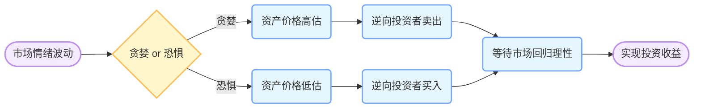

# 巴菲特的逆向投资思维：贪婪与恐惧

> 关键词：巴菲特、逆向投资思维、贪婪、恐惧、价值投资、投资策略、市场情绪

> 摘要：本文深入探讨了巴菲特的逆向投资思维，即如何在投资中应对贪婪与恐惧这两种关键情绪。通过详细剖析逆向投资思维的核心概念、算法原理、数学模型，结合实际案例展示其应用，同时介绍相关工具和资源，最后总结未来投资领域的发展趋势与挑战。旨在帮助投资者理解并运用巴菲特的逆向投资思维，提升投资决策的科学性和有效性。

## 1. 背景介绍 
### 1.1 目的和范围
本文的目的在于全面解析巴菲特的逆向投资思维，特别是其中关于贪婪与恐惧的核心要点。通过深入研究这种思维模式，帮助投资者理解在复杂多变的金融市场中，如何运用逆向投资策略来获取长期稳定的收益。范围涵盖逆向投资思维的理论基础、实际应用案例，以及与之相关的工具和资源推荐。

### 1.2 预期读者
本文预期读者包括各类投资者，无论是初涉投资领域的新手，还是有一定经验的专业投资者。同时，对金融市场和投资策略感兴趣的学者、研究人员也可以从本文中获得有价值的信息。

### 1.3 文档结构概述
本文将按照以下结构进行阐述：首先介绍逆向投资思维的核心概念和相关联系，包括其原理和架构；接着讲解核心算法原理和具体操作步骤，并通过 Python 代码进行详细说明；然后引入数学模型和公式，结合具体例子进行深入讲解；随后通过项目实战展示逆向投资思维在实际中的应用；再介绍逆向投资思维的实际应用场景；接着推荐相关的工具和资源；最后总结未来投资领域的发展趋势与挑战，并提供常见问题解答和扩展阅读参考资料。

### 1.4 术语表
#### 1.4.1 核心术语定义
- **逆向投资思维**：与市场主流投资方向相反的投资思维模式，在市场过度悲观时买入，在市场过度乐观时卖出。
- **贪婪**：在投资中，指投资者过度追求高收益，忽视风险，盲目跟风买入高价资产的心理状态。
- **恐惧**：指投资者在市场下跌时，因担心资产价值进一步缩水而恐慌抛售的心理状态。
- **价值投资**：一种基于对资产内在价值的评估进行投资的策略，寻找价格低于内在价值的资产进行投资。

#### 1.4.2 相关概念解释
- **市场情绪**：投资者对市场的整体心理感受和预期，包括乐观、悲观、贪婪、恐惧等情绪，会影响市场的走势和资产价格。
- **安全边际**：指投资时资产价格低于其内在价值的幅度，是价值投资中的重要概念，用于降低投资风险。

#### 1.4.3 缩略词列表
- **PE**：市盈率（Price-to-Earnings Ratio），指股票价格除以每股收益的比率，用于评估股票的估值水平。
- **PB**：市净率（Price-to-Book Ratio），指股票价格除以每股净资产的比率，反映股票的市场价值与账面价值的关系。

## 2. 核心概念与联系 
### 2.1 逆向投资思维的原理
逆向投资思维的核心原理基于市场的非理性波动。市场参与者的情绪往往会导致资产价格偏离其内在价值。当市场处于牛市时，投资者的贪婪情绪会推动资产价格不断上涨，使其远远高于内在价值；而在熊市时，恐惧情绪会使资产价格大幅下跌，低于内在价值。逆向投资者则利用这种市场情绪的波动，在市场过度悲观时，以低价买入被低估的资产；在市场过度乐观时，以高价卖出被高估的资产，从而实现投资收益。

### 2.2 贪婪与恐惧的影响
贪婪和恐惧是投资中两种最常见的情绪，它们对投资者的决策产生着重要影响。当市场处于上升趋势时，贪婪情绪会使投资者忽视风险，盲目追涨，导致高价买入资产。一旦市场反转，这些投资者往往会遭受巨大损失。而在市场下跌时，恐惧情绪会使投资者惊慌失措，纷纷抛售资产，进一步加剧市场的下跌。逆向投资者则需要克服这两种情绪，保持冷静和理性，以价值投资为导向进行决策。

### 2.3 逆向投资思维与价值投资的关系
逆向投资思维是价值投资的一种具体应用方式。价值投资强调寻找被低估的资产，而逆向投资则是通过观察市场情绪，在市场的极端情况下找到这些被低估的资产。逆向投资者通过逆向操作，在市场底部买入价值被低估的资产，等待市场情绪恢复正常，资产价格回归其内在价值，从而实现投资回报。

### 2.4 核心概念架构示意图


## 3. 核心算法原理 & 具体操作步骤 
### 3.1 核心算法原理
逆向投资的核心算法可以概括为以下几个步骤：
1. **评估资产的内在价值**：通过分析资产的财务状况、行业前景、竞争优势等因素，计算出资产的内在价值。
2. **判断市场情绪**：观察市场的整体走势、投资者的情绪指标等，判断市场是处于贪婪还是恐惧状态。
3. **比较资产价格与内在价值**：当市场处于恐惧状态，资产价格低于内在价值时，考虑买入；当市场处于贪婪状态，资产价格高于内在价值时，考虑卖出。

### 3.2 具体操作步骤
#### 3.2.1 数据收集
收集资产的相关数据，包括财务报表、行业数据、市场情绪指标等。可以通过金融数据提供商、公司官网、证券交易所等渠道获取这些数据。

#### 3.2.2 内在价值评估
使用合适的估值模型，如现金流折现模型（DCF）、市盈率模型、市净率模型等，评估资产的内在价值。以下是一个简单的市盈率模型的 Python 代码示例：
```python
def calculate_intrinsic_value(earnings_per_share, industry_pe_ratio):
    """
    计算股票的内在价值
    :param earnings_per_share: 每股收益
    :param industry_pe_ratio: 行业平均市盈率
    :return: 股票的内在价值
    """
    return earnings_per_share * industry_pe_ratio

# 示例数据
earnings_per_share = 2.5
industry_pe_ratio = 15

intrinsic_value = calculate_intrinsic_value(earnings_per_share, industry_pe_ratio)
print(f"股票的内在价值为: {intrinsic_value}")
```

#### 3.2.3 市场情绪判断
可以使用一些市场情绪指标，如投资者信心指数、换手率、成交量等，判断市场的情绪状态。以下是一个简单的判断市场情绪的 Python 代码示例：
```python
def judge_market_sentiment(turnover_ratio):
    """
    判断市场情绪
    :param turnover_ratio: 换手率
    :return: 市场情绪（贪婪或恐惧）
    """
    if turnover_ratio > 0.05:
        return "贪婪"
    else:
        return "恐惧"

# 示例数据
turnover_ratio = 0.03

market_sentiment = judge_market_sentiment(turnover_ratio)
print(f"当前市场情绪为: {market_sentiment}")
```

#### 3.2.4 投资决策
根据资产价格与内在价值的比较，以及市场情绪的判断，做出投资决策。当市场处于恐惧状态，资产价格低于内在价值时，买入资产；当市场处于贪婪状态，资产价格高于内在价值时，卖出资产。以下是一个简单的投资决策的 Python 代码示例：
```python
def make_investment_decision(asset_price, intrinsic_value, market_sentiment):
    """
    做出投资决策
    :param asset_price: 资产价格
    :param intrinsic_value: 资产内在价值
    :param market_sentiment: 市场情绪
    :return: 投资决策（买入、卖出或持有）
    """
    if market_sentiment == "恐惧" and asset_price < intrinsic_value:
        return "买入"
    elif market_sentiment == "贪婪" and asset_price > intrinsic_value:
        return "卖出"
    else:
        return "持有"

# 示例数据
asset_price = 20
intrinsic_value = 25
market_sentiment = "恐惧"

investment_decision = make_investment_decision(asset_price, intrinsic_value, market_sentiment)
print(f"投资决策为: {investment_decision}")
```

## 4. 数学模型和公式 & 详细讲解 & 举例说明 
### 4.1 现金流折现模型（DCF）
现金流折现模型是一种常用的估值模型，其基本原理是将资产未来的现金流折现到当前，得到资产的内在价值。公式如下：
$$V = \sum_{t=1}^{n} \frac{CF_t}{(1 + r)^t}$$
其中，$V$ 表示资产的内在价值，$CF_t$ 表示第 $t$ 期的现金流，$r$ 表示折现率，$n$ 表示现金流的期数。

#### 4.1.1 详细讲解
- **现金流（$CF_t$）**：指资产在未来各期产生的现金流入减去现金流出后的净额。可以通过分析资产的财务报表、行业前景等因素来预测现金流。
- **折现率（$r$）**：反映了投资者对投资风险的要求回报率。通常可以使用资本资产定价模型（CAPM）来计算折现率。
- **期数（$n$）**：指预测现金流的时间范围。一般可以根据资产的生命周期、行业发展趋势等因素来确定。

#### 4.1.2 举例说明
假设某公司预计未来三年的现金流分别为 100 万元、120 万元和 150 万元，折现率为 10%。则该公司的内在价值计算如下：
$$V = \frac{100}{(1 + 0.1)^1} + \frac{120}{(1 + 0.1)^2} + \frac{150}{(1 + 0.1)^3} \approx 295.06 \text{（万元）}$$

### 4.2 市盈率模型
市盈率模型是一种简单的估值模型，其公式为：
$$V = EPS \times PE$$
其中，$V$ 表示股票的内在价值，$EPS$ 表示每股收益，$PE$ 表示市盈率。

#### 4.2.1 详细讲解
- **每股收益（$EPS$）**：指公司净利润除以总股本后的每股盈利。可以通过分析公司的财务报表来获取每股收益数据。
- **市盈率（$PE$）**：反映了市场对公司盈利的预期。可以使用行业平均市盈率或公司历史平均市盈率来进行估值。

#### 4.2.2 举例说明
假设某公司的每股收益为 2 元，行业平均市盈率为 15。则该公司股票的内在价值为：
$$V = 2 \times 15 = 30 \text{（元）}$$

### 4.3 市净率模型
市净率模型的公式为：
$$V = BVPS \times PB$$
其中，$V$ 表示股票的内在价值，$BVPS$ 表示每股净资产，$PB$ 表示市净率。

#### 4.3.1 详细讲解
- **每股净资产（$BVPS$）**：指公司净资产除以总股本后的每股账面价值。可以通过分析公司的资产负债表来获取每股净资产数据。
- **市净率（$PB$）**：反映了市场对公司净资产的估值。可以使用行业平均市净率或公司历史平均市净率来进行估值。

#### 4.3.2 举例说明
假设某公司的每股净资产为 10 元，行业平均市净率为 2。则该公司股票的内在价值为：
$$V = 10 \times 2 = 20 \text{（元）}$$

## 5. 项目实战：代码实际案例和详细解释说明 
### 5.1 开发环境搭建
#### 5.1.1 安装 Python
可以从 Python 官方网站（https://www.python.org/downloads/）下载并安装 Python 3.x 版本。

#### 5.1.2 安装必要的库
使用以下命令安装必要的 Python 库：
```sh
pip install pandas numpy matplotlib
```
- **pandas**：用于数据处理和分析。
- **numpy**：用于数值计算。
- **matplotlib**：用于数据可视化。

### 5.2 源代码详细实现和代码解读
以下是一个完整的逆向投资策略的 Python 代码示例：
```python
import pandas as pd
import numpy as np
import matplotlib.pyplot as plt

# 模拟历史数据
np.random.seed(0)
dates = pd.date_range(start='2020-01-01', end='2021-12-31', freq='D')
prices = np.random.randn(len(dates)).cumsum() + 100
earnings_per_share = np.random.uniform(1, 3, len(dates))
industry_pe_ratio = 15

# 计算内在价值
intrinsic_values = earnings_per_share * industry_pe_ratio

# 计算换手率（模拟）
turnover_ratios = np.random.uniform(0.01, 0.1, len(dates))

# 判断市场情绪
market_sentiments = []
for ratio in turnover_ratios:
    if ratio > 0.05:
        market_sentiments.append("贪婪")
    else:
        market_sentiments.append("恐惧")

# 做出投资决策
investment_decisions = []
for i in range(len(prices)):
    if market_sentiments[i] == "恐惧" and prices[i] < intrinsic_values[i]:
        investment_decisions.append("买入")
    elif market_sentiments[i] == "贪婪" and prices[i] > intrinsic_values[i]:
        investment_decisions.append("卖出")
    else:
        investment_decisions.append("持有")

# 数据可视化
plt.figure(figsize=(12, 6))
plt.plot(dates, prices, label='资产价格')
plt.plot(dates, intrinsic_values, label='内在价值')
plt.scatter(dates[np.array(investment_decisions) == "买入"], prices[np.array(investment_decisions) == "买入"],
            marker='^', color='g', label='买入')
plt.scatter(dates[np.array(investment_decisions) == "卖出"], prices[np.array(investment_decisions) == "卖出"],
            marker='v', color='r', label='卖出')
plt.xlabel('日期')
plt.ylabel('价格')
plt.title('逆向投资策略')
plt.legend()
plt.show()
```

### 5.3 代码解读与分析
#### 5.3.1 数据模拟
使用 `numpy` 和 `pandas` 库模拟了历史数据，包括日期、资产价格、每股收益、行业平均市盈率和换手率。

#### 5.3.2 内在价值计算
根据每股收益和行业平均市盈率计算资产的内在价值。

#### 5.3.3 市场情绪判断
根据换手率判断市场情绪，当换手率大于 0.05 时，市场情绪为贪婪；否则为恐惧。

#### 5.3.4 投资决策
根据市场情绪和资产价格与内在价值的比较，做出投资决策（买入、卖出或持有）。

#### 5.3.5 数据可视化
使用 `matplotlib` 库将资产价格、内在价值和投资决策可视化，方便观察投资策略的执行情况。

## 6. 实际应用场景 
### 6.1 股票投资
在股票市场中，逆向投资思维可以帮助投资者在市场恐慌时买入被低估的股票，在市场狂热时卖出被高估的股票。例如，在 2008 年金融危机期间，市场一片恐慌，股票价格大幅下跌。巴菲特却逆势而行，大量买入金融股，如富国银行、高盛等。随后，随着市场的逐渐恢复，这些股票的价格大幅上涨，为巴菲特带来了丰厚的回报。

### 6.2 基金投资
对于基金投资者来说，逆向投资思维同样适用。当市场处于熊市，基金净值大幅下跌时，投资者可以考虑增加基金的投资份额；而当市场处于牛市，基金净值大幅上涨时，可以适当减少投资份额。例如，在 2015 年股灾之后，很多基金的净值大幅下跌，但一些具有逆向投资思维的投资者选择在此时加大对基金的投资，在随后的市场反弹中获得了较好的收益。

### 6.3 房地产投资
在房地产市场中，逆向投资思维也可以发挥作用。当房地产市场处于低迷期，房价下跌，市场观望情绪浓厚时，投资者可以寻找被低估的房产进行投资；而当房地产市场过热，房价大幅上涨时，投资者可以考虑出售房产，锁定收益。例如，在 2008 年金融危机后，美国房地产市场陷入低迷，房价大幅下跌。一些投资者抓住机会，在低价时买入房产。随着美国经济的逐渐复苏，房地产市场也逐渐回暖，这些投资者获得了可观的收益。

## 7. 工具和资源推荐
### 7.1 学习资源推荐
#### 7.1.1 书籍推荐
- 《聪明的投资者》（The Intelligent Investor）：作者本杰明·格雷厄姆（Benjamin Graham），是价值投资领域的经典著作，对巴菲特的投资理念产生了深远影响。
- 《巴菲特致股东的信：股份公司教程》（Letters to Shareholders of Berkshire Hathaway）：收集了巴菲特历年致股东的信，详细阐述了他的投资哲学和策略。
- 《证券分析》（Security Analysis）：同样是本杰明·格雷厄姆的著作，系统地介绍了证券分析的方法和技巧。

#### 7.1.2 在线课程
- Coursera 上的“投资学原理”（Principles of Investing）课程，由宾夕法尼亚大学沃顿商学院的教授授课，涵盖了投资的基本原理和方法。
- edX 上的“金融市场”（Financial Markets）课程，由耶鲁大学的教授授课，深入讲解了金融市场的运作机制和投资策略。

#### 7.1.3 技术博客和网站
- 雪球（https://xueqiu.com/）：国内知名的投资社区，提供股票、基金、债券等投资品种的资讯和分析，用户可以在上面交流投资经验和心得。
- Seeking Alpha（https://seekingalpha.com/）：国外知名的投资分析网站，提供大量的股票分析报告和投资策略建议。

### 7.2 开发工具框架推荐
#### 7.2.1 IDE和编辑器
- PyCharm：一款专业的 Python 集成开发环境，具有强大的代码编辑、调试和分析功能。
- Jupyter Notebook：一种交互式的开发环境，适合进行数据分析和可视化，方便代码的编写和分享。

#### 7.2.2 调试和性能分析工具
- pdb：Python 自带的调试工具，可以帮助开发者定位代码中的错误。
- cProfile：Python 的性能分析工具，可以分析代码的运行时间和函数调用情况，帮助优化代码性能。

#### 7.2.3 相关框架和库
- pandas：用于数据处理和分析的 Python 库，提供了高效的数据结构和数据操作方法。
- numpy：用于数值计算的 Python 库，提供了丰富的数学函数和数组操作功能。
- matplotlib：用于数据可视化的 Python 库，可以绘制各种类型的图表，如折线图、柱状图、散点图等。

### 7.3 相关论文著作推荐
#### 7.3.1 经典论文
- Eugene F. Fama 和 Kenneth R. French 的“Common Risk Factors in the Returns on Stocks and Bonds”，提出了著名的三因子模型，对资产定价理论产生了重要影响。
- Burton G. Malkiel 的“A Random Walk Down Wall Street”，阐述了有效市场假说的基本思想，对投资理论和实践产生了深远影响。

#### 7.3.2 最新研究成果
- 在 SSRN（https://papers.ssrn.com/sol3/default.cfm）等学术平台上，可以搜索到关于逆向投资、价值投资等领域的最新研究论文。

#### 7.3.3 应用案例分析
- 《金融炼金术》（The Alchemy of Finance）：作者乔治·索罗斯（George Soros），通过自己的投资实践案例，阐述了反身性理论在金融市场中的应用。

## 8. 总结：未来发展趋势与挑战
### 8.1 未来发展趋势
#### 8.1.1 数据驱动的逆向投资
随着大数据、人工智能等技术的发展，未来逆向投资将更加依赖于数据的分析和挖掘。投资者可以利用海量的金融数据、市场情绪数据等，通过机器学习算法建立更加准确的投资模型，提高逆向投资的成功率。

#### 8.1.2 全球化投资
随着全球经济一体化的发展，投资者的视野将更加全球化。逆向投资将不再局限于国内市场，而是可以在全球范围内寻找被低估的资产进行投资。

#### 8.1.3 社会责任投资与逆向投资的结合
未来，社会责任投资将越来越受到关注。逆向投资者可能会更加注重资产的社会责任表现，在寻找被低估资产的同时，也会考虑资产的环境、社会和治理（ESG）因素。

### 8.2 挑战
#### 8.2.1 市场不确定性增加
随着全球政治、经济环境的变化，市场的不确定性不断增加。逆向投资者需要更加准确地判断市场情绪和资产的内在价值，以应对市场的波动。

#### 8.2.2 技术风险
虽然大数据、人工智能等技术为逆向投资带来了机遇，但也带来了技术风险。例如，数据质量问题、算法模型的准确性问题等，都可能影响逆向投资的决策。

#### 8.2.3 投资者情绪管理
逆向投资需要投资者克服贪婪和恐惧等情绪，保持冷静和理性。但在实际操作中，投资者往往难以做到这一点，容易受到市场情绪的影响而做出错误的决策。

## 9. 附录：常见问题与解答
### 9.1 逆向投资是否适用于所有市场？
逆向投资并不适用于所有市场。在一些有效性较高的市场中，资产价格能够及时反映其内在价值，逆向投资的机会相对较少。而在一些有效性较低的市场中，市场情绪的波动较大，资产价格容易偏离其内在价值，逆向投资的机会相对较多。

### 9.2 如何准确评估资产的内在价值？
评估资产的内在价值需要综合考虑多个因素，如资产的财务状况、行业前景、竞争优势等。可以使用多种估值模型，如现金流折现模型、市盈率模型、市净率模型等，进行评估。同时，还需要对市场情况和行业趋势进行深入分析，以提高评估的准确性。

### 9.3 逆向投资需要具备哪些能力？
逆向投资需要投资者具备以下能力：
- **独立思考能力**：不随波逐流，能够独立分析市场和资产的价值。
- **情绪管理能力**：克服贪婪和恐惧等情绪，保持冷静和理性。
- **数据分析能力**：能够收集、整理和分析金融数据，为投资决策提供依据。
- **风险控制能力**：合理控制投资风险，避免因逆向投资而遭受过大损失。

## 10. 扩展阅读 & 参考资料
### 10.1 扩展阅读
- 《漫步华尔街》（A Random Walk Down Wall Street）：作者伯顿·马尔基尔（Burton G. Malkiel），介绍了有效市场假说和随机漫步理论，对投资理念有重要启示。
- 《金融的智慧》（The Wisdom of Finance）：作者米希尔·A·德赛（Mihir A. Desai），从历史和现实的角度，深入探讨了金融的本质和投资的智慧。

### 10.2 参考资料
- 巴菲特历年致股东的信：https://www.berkshirehathaway.com/letters/letters.html
- 金融数据提供商：雅虎财经（https://finance.yahoo.com/）、东方财富网（https://www.eastmoney.com/）等。

作者：AI天才研究院/AI Genius Institute & 禅与计算机程序设计艺术 /Zen And The Art of Computer Programming