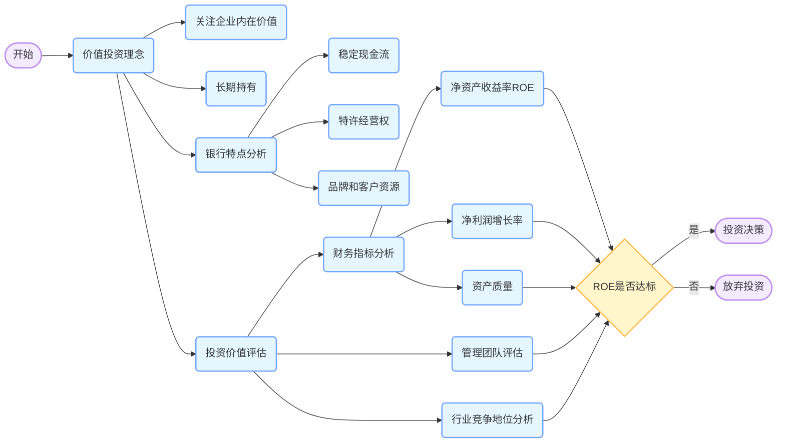

# 巴菲特的银行业投资逻辑：金融科技挑战下的重新评估

> 关键词：巴菲特、银行业投资逻辑、金融科技挑战、重新评估、银行投资策略

> 摘要：本文深入探讨了巴菲特的银行业投资逻辑，并分析了在金融科技迅猛发展的背景下，这种投资逻辑面临的挑战以及需要进行的重新评估。首先介绍了巴菲特投资银行业的背景和目的，明确预期读者群体。接着阐述了银行业投资核心概念及其联系，详细讲解了相关核心算法原理与操作步骤。通过数学模型和公式进一步剖析投资逻辑的本质，并结合实际案例进行说明。然后介绍了在项目实战中开发环境搭建、代码实现与解读等内容。探讨了银行业投资的实际应用场景，推荐了相关学习资源、开发工具框架以及论文著作。最后总结了未来银行业投资的发展趋势与挑战，解答常见问题并提供扩展阅读和参考资料，旨在为投资者和相关研究人员提供全面深入的分析和指导。

## 1. 背景介绍 
### 1.1 目的和范围
巴菲特作为投资界的传奇人物，其银行业投资逻辑一直备受关注。在金融科技不断发展的当下，传统银行业面临着前所未有的挑战。本文的目的在于深入剖析巴菲特的银行业投资逻辑，并结合金融科技带来的变化进行重新评估。范围涵盖了巴菲特投资银行业的基本理念、金融科技对银行业的影响、投资逻辑的调整方向以及相关的技术和理论知识。

### 1.2 预期读者
本文预期读者包括对投资领域感兴趣的个人投资者、金融行业从业者、研究金融投资的学者以及关注金融科技发展对传统银行业影响的相关人员。

### 1.3 文档结构概述
本文首先介绍背景信息，包括目的、预期读者和文档结构。接着阐述银行业投资的核心概念与联系，通过文本示意图和 Mermaid 流程图进行直观展示。然后讲解核心算法原理和具体操作步骤，结合 Python 源代码进行详细说明。利用数学模型和公式进一步分析投资逻辑，并举例说明。在项目实战部分，介绍开发环境搭建、源代码实现与解读。探讨实际应用场景，推荐相关工具和资源。最后总结未来发展趋势与挑战，解答常见问题并提供扩展阅读和参考资料。

### 1.4 术语表
#### 1.4.1 核心术语定义
- **巴菲特投资逻辑**：指巴菲特在投资决策中所遵循的一系列原则和方法，包括价值投资、长期持有、注重企业基本面等。
- **银行业投资**：指投资者将资金投入到银行类企业，以获取股息、资本增值等收益的投资行为。
- **金融科技**：指利用现代科技手段对金融业务进行创新和改进的领域，包括人工智能、区块链、大数据、云计算等技术在金融领域的应用。

#### 1.4.2 相关概念解释
- **价值投资**：一种投资策略，强调通过分析企业的内在价值，寻找被低估的股票进行投资，注重企业的长期发展和盈利能力。
- **长期持有**：投资者买入股票后，长期持有而不频繁买卖，以获取企业成长带来的长期收益。
- **企业基本面**：指企业的财务状况、经营业绩、市场竞争力、管理团队等基本情况，是评估企业价值的重要依据。

#### 1.4.3 缩略词列表
- **AI**：人工智能（Artificial Intelligence）
- **Blockchain**：区块链
- **Big Data**：大数据
- **Cloud Computing**：云计算

## 2. 核心概念与联系 

### 核心概念原理
巴菲特的银行业投资逻辑基于价值投资理念。他认为银行是一种特殊的企业，具有以下特点：
- **稳定的现金流**：银行通过吸收存款和发放贷款，赚取利差收入，通常具有较为稳定的现金流。
- **特许经营权**：银行拥有金融牌照，具有一定的垄断性和特许经营权，能够在特定的领域开展业务。
- **品牌和客户资源**：优秀的银行具有良好的品牌形象和广泛的客户资源，能够吸引更多的存款和贷款业务。

在评估银行的投资价值时，巴菲特注重以下几个方面：
- **财务指标**：如净资产收益率（ROE）、净利润增长率、资产质量等。
- **管理团队**：优秀的管理团队能够有效地管理银行的风险和业务，实现可持续发展。
- **行业竞争地位**：银行在行业中的竞争地位决定了其市场份额和盈利能力。

### 架构的文本示意图
```plaintext
巴菲特银行业投资逻辑
|-- 价值投资理念
|   |-- 关注企业内在价值
|   |-- 长期持有
|-- 银行特点分析
|   |-- 稳定现金流
|   |-- 特许经营权
|   |-- 品牌和客户资源
|-- 投资价值评估
|   |-- 财务指标分析
|   |   |-- 净资产收益率（ROE）
|   |   |-- 净利润增长率
|   |   |-- 资产质量
|   |-- 管理团队评估
|   |-- 行业竞争地位分析
```

### Mermaid 流程图


## 3. 核心算法原理 & 具体操作步骤 

### 核心算法原理
在评估银行的投资价值时，可以使用以下算法：
- **净资产收益率（ROE）评估**：ROE 是衡量银行盈利能力的重要指标，计算公式为：$ROE = \frac{净利润}{净资产} \times 100\%$。一般来说，ROE 越高，银行的盈利能力越强。
- **净利润增长率评估**：净利润增长率反映了银行的盈利增长趋势，计算公式为：$净利润增长率 = \frac{本期净利润 - 上期净利润}{上期净利润} \times 100\%$。持续的净利润增长表明银行具有良好的发展前景。
- **资产质量评估**：可以通过不良贷款率、拨备覆盖率等指标来评估银行的资产质量。不良贷款率越低，拨备覆盖率越高，银行的资产质量越好。

### 具体操作步骤
#### 步骤 1：数据收集
收集银行的财务报表数据，包括净利润、净资产、不良贷款率、拨备覆盖率等指标。可以从银行的官方网站、证券交易所网站等渠道获取相关数据。

#### 步骤 2：计算财务指标
使用收集到的数据，计算 ROE、净利润增长率等财务指标。以下是使用 Python 实现的示例代码：
```python
# 示例数据
net_profit_current = 1000  # 本期净利润
net_profit_previous = 800  # 上期净利润
net_assets = 5000  # 净资产
non_performing_loan_ratio = 0.02  # 不良贷款率
provision_coverage_ratio = 200  # 拨备覆盖率

# 计算 ROE
roe = (net_profit_current / net_assets) * 100

# 计算净利润增长率
net_profit_growth_rate = ((net_profit_current - net_profit_previous) / net_profit_previous) * 100

print(f"ROE: {roe}%")
print(f"净利润增长率: {net_profit_growth_rate}%")
print(f"不良贷款率: {non_performing_loan_ratio * 100}%")
print(f"拨备覆盖率: {provision_coverage_ratio}%")
```

#### 步骤 3：评估投资价值
根据计算得到的财务指标，结合银行的管理团队和行业竞争地位，评估银行的投资价值。如果 ROE 较高、净利润增长率持续为正、资产质量良好，且管理团队优秀、行业竞争地位稳固，则可以考虑投资该银行。

#### 步骤 4：投资决策
根据评估结果，做出投资决策。如果投资价值较高，可以选择适当的时机买入银行股票；如果投资价值较低，则可以放弃投资。

## 4. 数学模型和公式 & 详细讲解 & 举例说明 

### 数学模型和公式
#### 净资产收益率（ROE）
$ROE = \frac{净利润}{净资产} \times 100\%$

详细讲解：ROE 反映了银行运用自有资本获取收益的能力。ROE 越高，说明银行每单位净资产能够创造更多的净利润，盈利能力越强。例如，一家银行的净利润为 1 亿元，净资产为 10 亿元，则其 ROE 为：$\frac{1}{10} \times 100\% = 10\%$。

#### 净利润增长率
$净利润增长率 = \frac{本期净利润 - 上期净利润}{上期净利润} \times 100\%$

详细讲解：净利润增长率衡量了银行盈利的增长速度。正的净利润增长率表示银行的盈利在增加，负的增长率则表示盈利在下降。例如，一家银行上期净利润为 8000 万元，本期净利润为 1 亿元，则其净利润增长率为：$\frac{10000 - 8000}{8000} \times 100\% = 25\%$。

#### 不良贷款率
$不良贷款率 = \frac{不良贷款余额}{贷款总额} \times 100\%$

详细讲解：不良贷款率反映了银行贷款资产的质量。不良贷款率越低，说明银行的贷款风险越小，资产质量越好。例如，一家银行的不良贷款余额为 500 万元，贷款总额为 1 亿元，则其不良贷款率为：$\frac{500}{10000} \times 100\% = 5\%$。

#### 拨备覆盖率
$拨备覆盖率 = \frac{贷款损失准备}{不良贷款余额} \times 100\%$

详细讲解：拨备覆盖率衡量了银行应对不良贷款风险的能力。拨备覆盖率越高，说明银行对可能的贷款损失有更充足的准备，抗风险能力越强。例如，一家银行的贷款损失准备为 1000 万元，不良贷款余额为 500 万元，则其拨备覆盖率为：$\frac{1000}{500} \times 100\% = 200\%$。

### 举例说明
假设我们要评估两家银行 A 和 B 的投资价值。以下是两家银行的财务数据：

| 银行 | 净利润（亿元） | 净资产（亿元） | 上期净利润（亿元） | 不良贷款余额（亿元） | 贷款总额（亿元） | 贷款损失准备（亿元） |
| ---- | ---- | ---- | ---- | ---- | ---- | ---- |
| A | 20 | 200 | 18 | 5 | 100 | 10 |
| B | 15 | 150 | 12 | 3 | 80 | 6 |

#### 计算 ROE
银行 A 的 ROE：$\frac{20}{200} \times 100\% = 10\%$
银行 B 的 ROE：$\frac{15}{150} \times 100\% = 10\%$

#### 计算净利润增长率
银行 A 的净利润增长率：$\frac{20 - 18}{18} \times 100\% \approx 11.11\%$
银行 B 的净利润增长率：$\frac{15 - 12}{12} \times 100\% = 25\%$

#### 计算不良贷款率
银行 A 的不良贷款率：$\frac{5}{100} \times 100\% = 5\%$
银行 B 的不良贷款率：$\frac{3}{80} \times 100\% = 3.75\%$

#### 计算拨备覆盖率
银行 A 的拨备覆盖率：$\frac{10}{5} \times 100\% = 200\%$
银行 B 的拨备覆盖率：$\frac{6}{3} \times 100\% = 200\%$

从以上计算结果可以看出，两家银行的 ROE 和拨备覆盖率相同，但银行 B 的净利润增长率更高，不良贷款率更低。因此，在其他条件相同的情况下，银行 B 的投资价值相对较高。

## 5. 项目实战：代码实际案例和详细解释说明 

### 5.1  开发环境搭建
#### 安装 Python
首先，需要安装 Python 环境。可以从 Python 官方网站（https://www.python.org/downloads/）下载适合自己操作系统的 Python 安装包，并按照安装向导进行安装。

#### 安装必要的库
在评估银行投资价值的项目中，需要使用一些 Python 库来处理数据和进行计算。可以使用以下命令安装所需的库：
```sh
pip install pandas numpy matplotlib
```
- **pandas**：用于数据处理和分析。
- **numpy**：用于数值计算。
- **matplotlib**：用于数据可视化。

### 5.2  源代码详细实现和代码解读
以下是一个完整的 Python 代码示例，用于评估银行的投资价值：
```python
import pandas as pd
import numpy as np
import matplotlib.pyplot as plt

# 定义银行数据类
class BankData:
    def __init__(self, net_profit_current, net_profit_previous, net_assets, non_performing_loan_balance, loan_total, loan_loss_provision):
        self.net_profit_current = net_profit_current
        self.net_profit_previous = net_profit_previous
        self.net_assets = net_assets
        self.non_performing_loan_balance = non_performing_loan_balance
        self.loan_total = loan_total
        self.loan_loss_provision = loan_loss_provision

    # 计算 ROE
    def calculate_roe(self):
        return (self.net_profit_current / self.net_assets) * 100

    # 计算净利润增长率
    def calculate_net_profit_growth_rate(self):
        return ((self.net_profit_current - self.net_profit_previous) / self.net_profit_previous) * 100

    # 计算不良贷款率
    def calculate_non_performing_loan_ratio(self):
        return (self.non_performing_loan_balance / self.loan_total) * 100

    # 计算拨备覆盖率
    def calculate_provision_coverage_ratio(self):
        return (self.loan_loss_provision / self.non_performing_loan_balance) * 100

# 示例数据
bank_a = BankData(20, 18, 200, 5, 100, 10)
bank_b = BankData(15, 12, 150, 3, 80, 6)

# 计算各项指标
banks = [bank_a, bank_b]
bank_names = ['银行 A', '银行 B']
roe_values = []
net_profit_growth_rate_values = []
non_performing_loan_ratio_values = []
provision_coverage_ratio_values = []

for bank in banks:
    roe_values.append(bank.calculate_roe())
    net_profit_growth_rate_values.append(bank.calculate_net_profit_growth_rate())
    non_performing_loan_ratio_values.append(bank.calculate_non_performing_loan_ratio())
    provision_coverage_ratio_values.append(bank.calculate_provision_coverage_ratio())

# 打印结果
print("银行投资价值评估结果：")
for i in range(len(banks)):
    print(f"{bank_names[i]}:")
    print(f"ROE: {roe_values[i]}%")
    print(f"净利润增长率: {net_profit_growth_rate_values[i]}%")
    print(f"不良贷款率: {non_performing_loan_ratio_values[i]}%")
    print(f"拨备覆盖率: {provision_coverage_ratio_values[i]}%")
    print()

# 数据可视化
x = np.arange(len(bank_names))
width = 0.2

fig, ax = plt.subplots()
rects1 = ax.bar(x - 1.5 * width, roe_values, width, label='ROE')
rects2 = ax.bar(x - 0.5 * width, net_profit_growth_rate_values, width, label='净利润增长率')
rects3 = ax.bar(x + 0.5 * width, non_performing_loan_ratio_values, width, label='不良贷款率')
rects4 = ax.bar(x + 1.5 * width, provision_coverage_ratio_values, width, label='拨备覆盖率')

ax.set_ylabel('百分比')
ax.set_title('银行投资价值指标对比')
ax.set_xticks(x)
ax.set_xticklabels(bank_names)
ax.legend()

def autolabel(rects):
    for rect in rects:
        height = rect.get_height()
        ax.annotate('{}'.format(height),
                    xy=(rect.get_x() + rect.get_width() / 2, height),
                    xytext=(0, 3),
                    textcoords="offset points",
                    ha='center', va='bottom')

autolabel(rects1)
autolabel(rects2)
autolabel(rects3)
autolabel(rects4)

fig.tight_layout()
plt.show()
```

### 5.3  代码解读与分析
#### 代码结构
- **BankData 类**：用于存储银行的财务数据，并提供计算各项财务指标的方法。
- **示例数据**：创建了两个银行对象 `bank_a` 和 `bank_b`，并初始化了它们的财务数据。
- **指标计算**：遍历银行对象列表，调用 `BankData` 类的方法计算 ROE、净利润增长率、不良贷款率和拨备覆盖率。
- **结果打印**：将计算得到的各项指标打印输出。
- **数据可视化**：使用 `matplotlib` 库将各项指标进行可视化展示，方便比较不同银行的投资价值。

#### 代码分析
通过这个代码示例，我们可以清晰地看到如何使用 Python 来评估银行的投资价值。首先，将银行的财务数据封装在 `BankData` 类中，方便进行管理和计算。然后，使用循环遍历银行对象列表，计算各项指标。最后，将计算结果打印输出并进行可视化展示，使评估结果更加直观。

## 6. 实际应用场景 
### 个人投资者
对于个人投资者来说，了解巴菲特的银行业投资逻辑并结合金融科技的发展进行重新评估，可以帮助他们做出更明智的投资决策。个人投资者可以使用本文介绍的方法和工具，对不同银行的投资价值进行评估，选择具有潜力的银行股票进行投资。

### 金融机构
金融机构如基金公司、证券公司等，可以利用本文的研究成果，优化其投资组合，提高投资回报率。同时，金融机构也可以将这些方法应用于风险管理，评估银行的信用风险和市场风险。

### 监管机构
监管机构可以参考本文的分析，加强对银行业的监管，防范金融风险。通过关注银行的财务指标和行业竞争地位，监管机构可以及时发现潜在的风险点，并采取相应的监管措施。

### 银行业自身
银行可以借鉴巴菲特的投资逻辑，加强自身的财务管理和风险管理。通过提高 ROE、净利润增长率和资产质量，银行可以提升自身的投资价值，吸引更多的投资者。同时，银行也需要积极应对金融科技的挑战，加强数字化转型，提高竞争力。

## 7. 工具和资源推荐
### 7.1 学习资源推荐
#### 7.1.1 书籍推荐
- 《聪明的投资者》（The Intelligent Investor）：作者是本杰明·格雷厄姆（Benjamin Graham），这本书是价值投资的经典之作，对巴菲特的投资理念产生了深远的影响。
- 《巴菲特致股东的信：股份公司教程》（Letters to Shareholders of Berkshire Hathaway）：这本书收录了巴菲特历年致股东的信，从中可以深入了解巴菲特的投资思想和决策过程。
- 《金融科技：架构与实践》：全面介绍了金融科技的各个方面，包括人工智能、区块链、大数据等技术在金融领域的应用。

#### 7.1.2 在线课程
- Coursera 上的“Financial Markets”：由耶鲁大学教授罗伯特·席勒（Robert Shiller）授课，介绍了金融市场的基本原理和投资策略。
- edX 上的“Artificial Intelligence for Finance”：讲解了人工智能在金融领域的应用，包括风险评估、投资决策等方面。

#### 7.1.3 技术博客和网站
- Seeking Alpha：提供金融市场分析、投资建议和公司研究报告。
- Zero Hedge：关注金融市场动态、宏观经济形势和投资策略。
- Towards Data Science：发布关于数据科学、人工智能和机器学习的技术文章和案例分析。

### 7.2 开发工具框架推荐
#### 7.2.1 IDE和编辑器
- PyCharm：一款专业的 Python 集成开发环境，提供代码编辑、调试、版本控制等功能。
- Jupyter Notebook：一个交互式的开发环境，适合进行数据探索和分析。

#### 7.2.2 调试和性能分析工具
- pdb：Python 自带的调试工具，用于调试 Python 代码。
- cProfile：Python 标准库中的性能分析工具，用于分析代码的性能瓶颈。

#### 7.2.3 相关框架和库
- Pandas：用于数据处理和分析，提供了高效的数据结构和数据操作方法。
- Numpy：用于数值计算，提供了高性能的多维数组对象和数学函数。
- Matplotlib：用于数据可视化，提供了丰富的绘图功能。

### 7.3 相关论文著作推荐
#### 7.3.1 经典论文
- “The Capital Asset Pricing Model: Theory and Evidence”：由 Eugene F. Fama 和 Kenneth R. French 撰写，介绍了资本资产定价模型的理论和实证研究。
- “Efficient Capital Markets: A Review of Theory and Empirical Work”：由 Eugene F. Fama 撰写，对有效市场假说进行了全面的综述。

#### 7.3.2 最新研究成果
- “Fintech and the Future of Banking”：探讨了金融科技对银行业的影响和未来发展趋势。
- “Artificial Intelligence in Finance: Applications and Challenges”：分析了人工智能在金融领域的应用和面临的挑战。

#### 7.3.3 应用案例分析
- “Case Studies in Banking and Finance”：收录了银行业和金融领域的实际案例，包括投资决策、风险管理等方面的案例分析。

## 8. 总结：未来发展趋势与挑战
### 未来发展趋势
#### 金融科技与银行业深度融合
随着金融科技的不断发展，银行业将越来越多地应用人工智能、区块链、大数据等技术，实现数字化转型。例如，银行可以利用人工智能进行风险评估和客户服务，利用区块链技术实现跨境支付和供应链金融等。

#### 个性化金融服务
金融科技的发展使得银行能够更好地了解客户的需求和偏好，提供个性化的金融服务。例如，银行可以根据客户的消费习惯和风险承受能力，为客户推荐合适的理财产品和贷款方案。

#### 开放银行模式
开放银行模式将成为未来银行业的发展趋势。银行将通过开放 API 等方式，与金融科技公司和其他合作伙伴进行合作，实现资源共享和优势互补，为客户提供更加丰富的金融服务。

### 挑战
#### 技术安全风险
金融科技的应用带来了新的技术安全风险，如数据泄露、网络攻击等。银行需要加强技术安全管理，保障客户信息和资金的安全。

#### 监管挑战
金融科技的快速发展对监管机构提出了新的挑战。监管机构需要制定相应的监管政策和法规，规范金融科技的发展，防范金融风险。

#### 人才短缺
金融科技的发展需要既懂金融又懂技术的复合型人才。目前，市场上这类人才相对短缺，银行需要加强人才培养和引进，提高自身的创新能力和竞争力。

## 9. 附录：常见问题与解答
### 问题 1：巴菲特的银行业投资逻辑是否适用于所有银行？
解答：巴菲特的银行业投资逻辑是基于价值投资理念，注重银行的基本面和长期发展。虽然这种逻辑具有一定的普遍性，但并不是适用于所有银行。不同银行的经营模式、财务状况和市场环境存在差异，需要具体情况具体分析。在评估银行的投资价值时，还需要考虑其他因素，如金融科技的影响、行业竞争态势等。

### 问题 2：金融科技对银行业投资逻辑有哪些具体影响？
解答：金融科技对银行业投资逻辑的影响主要体现在以下几个方面：
- **改变银行的竞争格局**：金融科技公司的崛起对传统银行形成了竞争压力，一些银行可能需要加快数字化转型，以提高竞争力。
- **影响银行的盈利能力**：金融科技的应用可以降低银行的运营成本，提高效率，但也可能导致银行的收入来源发生变化。例如，互联网金融平台的发展可能会分流银行的部分贷款和存款业务。
- **增加银行的风险**：金融科技的应用带来了新的技术风险和业务风险，如数据泄露、网络攻击等。银行需要加强风险管理，以应对这些风险。

### 问题 3：如何评估银行的管理团队？
解答：评估银行的管理团队可以从以下几个方面入手：
- **管理经验**：了解管理团队成员的工作经验和在银行业的从业经历，包括是否曾在其他银行担任重要职位，以及在不同市场环境下的管理经验。
- **业绩表现**：考察银行在管理团队的领导下的业绩表现，如 ROE、净利润增长率、资产质量等指标的变化情况。
- **战略眼光**：评估管理团队的战略规划和决策能力，看其是否能够把握市场趋势，制定合理的发展战略。
- **团队稳定性**：关注管理团队的稳定性，频繁的人员变动可能会影响银行的发展。

### 问题 4：在投资银行业时，除了财务指标，还需要考虑哪些因素？
解答：在投资银行业时，除了财务指标，还需要考虑以下因素：
- **宏观经济环境**：宏观经济环境对银行业的发展有着重要影响。例如，经济增长、利率变动、通货膨胀等因素都会影响银行的盈利能力和资产质量。
- **行业竞争态势**：了解银行在行业中的竞争地位，包括市场份额、客户资源、产品创新能力等方面。
- **金融科技应用**：关注银行在金融科技方面的应用情况，如是否积极开展数字化转型，是否推出创新的金融产品和服务。
- **监管政策**：监管政策对银行业的经营和发展有着重要的约束和引导作用。投资者需要关注监管政策的变化，以及银行对监管政策的适应能力。

## 10. 扩展阅读 & 参考资料
### 扩展阅读
- 《金融科技时代的银行转型》
- 《数字金融：创新与监管》
- 《人工智能与金融风险管理》

### 参考资料
- 巴菲特历年致股东的信
- 各大银行的年度财务报告
- 金融科技相关研究报告和论文

作者：AI天才研究院/AI Genius Institute & 禅与计算机程序设计艺术 /Zen And The Art of Computer Programming