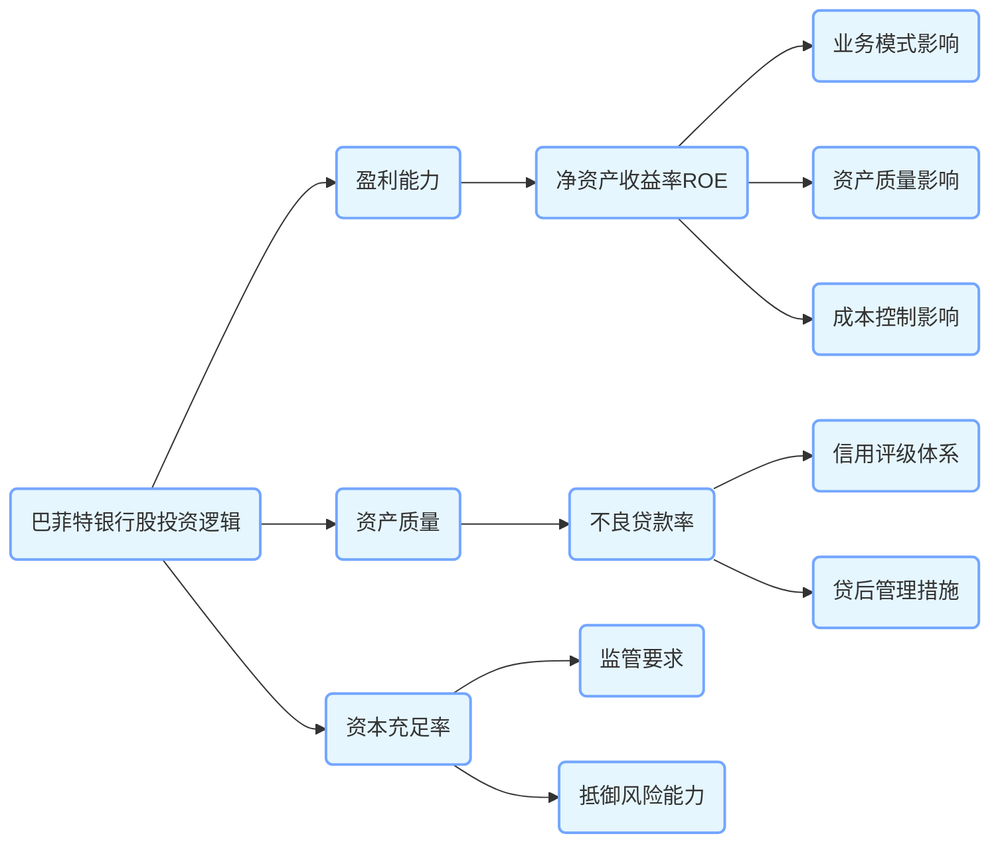

# 巴菲特的银行股投资逻辑：金融行业的吸引力

> 关键词：巴菲特、银行股投资、金融行业、投资逻辑、财务分析、风险管理

> 摘要：本文深入剖析了巴菲特投资银行股的逻辑以及金融行业对投资者的吸引力。首先介绍了背景信息，包括目的范围、预期读者等。接着阐述了与银行股投资相关的核心概念及联系，详细讲解了核心算法原理和操作步骤，并给出了数学模型和公式。通过项目实战案例，展示了如何在实际中运用相关理论进行银行股投资分析。探讨了银行股投资在不同场景下的实际应用，推荐了学习、开发工具以及相关论文著作等资源。最后总结了银行股投资的未来发展趋势与挑战，还设置了常见问题解答和扩展阅读参考资料。旨在帮助投资者更好地理解巴菲特的投资理念，把握金融行业银行股的投资机会。

## 1. 背景介绍 
### 1.1 目的和范围
本文旨在深入探究巴菲特投资银行股的逻辑，揭示金融行业对投资者尤其是像巴菲特这样的价值投资者的吸引力所在。通过对相关理论、实际案例和市场现象的分析，为投资者提供全面且深入的投资思路和决策参考。研究范围涵盖了银行股投资的各个方面，包括财务分析、风险管理、市场趋势以及宏观经济影响等。

### 1.2 预期读者
本文的预期读者主要包括对价值投资感兴趣的个人投资者、金融行业的从业者如分析师和基金经理、以及对巴菲特投资理念和金融市场有研究需求的学者和研究人员。希望通过本文的阐述，不同层次的读者都能从中获取有价值的信息，提升对银行股投资的认识和理解。

### 1.3 文档结构概述
本文将按照以下结构展开：首先介绍与银行股投资相关的核心概念和它们之间的联系，为后续的分析奠定基础；接着详细讲解核心算法原理和具体操作步骤，通过Python代码进行阐述；引入数学模型和公式，并结合实际例子进行说明；通过项目实战案例，展示如何在实际中运用这些理论和方法进行银行股投资分析；探讨银行股投资在不同场景下的实际应用；推荐学习、开发工具以及相关论文著作等资源；最后总结银行股投资的未来发展趋势与挑战，设置常见问题解答和扩展阅读参考资料。

### 1.4 术语表
#### 1.4.1 核心术语定义
- **银行股**：指的是在证券市场上发行的，代表对银行一定份额所有权的股票。投资者购买银行股后，成为银行的股东，享有股息分配和公司决策等相应权利。
- **净资产收益率（ROE）**：是衡量银行盈利能力的重要指标，计算公式为净利润与平均净资产的比率。它反映了银行运用自有资本获取收益的能力。
- **不良贷款率**：是指银行不良贷款占总贷款余额的比率。不良贷款是指借款人无法按照合同约定按时足额偿还本息的贷款，该指标反映了银行贷款资产的质量。
- **资本充足率**：是指银行持有的符合规定的资本与风险加权资产之间的比率。它反映了银行抵御风险的能力，是监管机构对银行监管的重要指标之一。

#### 1.4.2 相关概念解释
- **价值投资**：是一种投资策略，强调通过分析公司的基本面，如财务状况、盈利能力、行业地位等，寻找被市场低估的股票，并长期持有，以获取公司价值增长带来的收益。
- **金融行业**：是指经营金融商品的特殊行业，包括银行业、证券业、保险业、信托业等。金融行业在经济体系中起着资金融通、资源配置等重要作用。

#### 1.4.3 缩略词列表
- **ROE**：Return on Equity，净资产收益率
- **NPLR**：Non - Performing Loan Ratio，不良贷款率
- **CAR**：Capital Adequacy Ratio，资本充足率

## 2. 核心概念与联系 

### 核心概念原理
在巴菲特的银行股投资逻辑中，有几个核心概念起着关键作用。

#### 盈利能力
银行的盈利能力是巴菲特关注的重点之一。其中，净资产收益率（ROE）是衡量盈利能力的核心指标。高ROE意味着银行能够有效地运用股东投入的资本创造利润。例如，一家银行的ROE长期保持在15%以上，说明它在同行业中具有较强的盈利能力。ROE的高低受到多种因素的影响，如银行的业务模式、资产质量、成本控制等。

#### 资产质量
资产质量对于银行的稳健运营至关重要。不良贷款率是衡量资产质量的关键指标。较低的不良贷款率表明银行的贷款资产质量较好，违约风险较低。银行需要对贷款进行严格的风险评估和管理，以控制不良贷款的产生。例如，一家银行通过完善的信用评级体系和贷后管理措施，将不良贷款率控制在1%以内，说明其资产质量较为优良。

#### 资本充足率
资本充足率反映了银行抵御风险的能力。监管机构要求银行保持一定的资本充足率，以确保银行在面临风险时能够有足够的资本来缓冲损失。较高的资本充足率意味着银行在面对经济衰退、贷款违约等风险时具有更强的韧性。例如，一家银行的资本充足率达到12%以上，说明它在资本方面具有较好的保障。

### 架构的文本示意图
```plaintext
巴菲特银行股投资逻辑
|-- 盈利能力
|   |-- 净资产收益率（ROE）
|   |   |-- 业务模式影响
|   |   |-- 资产质量影响
|   |   |-- 成本控制影响
|-- 资产质量
|   |-- 不良贷款率
|   |   |-- 信用评级体系
|   |   |-- 贷后管理措施
|-- 资本充足率
|   |-- 监管要求
|   |-- 抵御风险能力
```

### Mermaid 流程图


## 3. 核心算法原理 & 具体操作步骤 

### 核心算法原理
在分析银行股时，我们可以通过计算一些关键指标来评估银行的投资价值。以下是几个重要指标的计算原理。

#### 净资产收益率（ROE）
ROE的计算公式为：
$$ROE=\frac{净利润}{平均净资产}\times100\%$$
平均净资产可以通过期初净资产和期末净资产的平均值来计算：
$$平均净资产=\frac{期初净资产 + 期末净资产}{2}$$

#### 不良贷款率
不良贷款率的计算公式为：
$$不良贷款率=\frac{不良贷款余额}{总贷款余额}\times100\%$$

#### 资本充足率
资本充足率的计算公式为：
$$资本充足率=\frac{资本}{风险加权资产}\times100\%$$

### 具体操作步骤
以下是使用Python代码实现这些指标计算的具体步骤。

```python
# 假设我们有以下数据
beginning_equity = 1000  # 期初净资产
ending_equity = 1200    # 期末净资产
net_income = 150        # 净利润
non_performing_loans = 20  # 不良贷款余额
total_loans = 1000      # 总贷款余额
capital = 200           # 资本
risk_weighted_assets = 1500  # 风险加权资产

# 计算平均净资产
average_equity = (beginning_equity + ending_equity) / 2

# 计算净资产收益率（ROE）
roe = (net_income / average_equity) * 100

# 计算不良贷款率
nplr = (non_performing_loans / total_loans) * 100

# 计算资本充足率
car = (capital / risk_weighted_assets) * 100

# 输出结果
print(f"净资产收益率（ROE）: {roe:.2f}%")
print(f"不良贷款率: {nplr:.2f}%")
print(f"资本充足率: {car:.2f}%")
```

### 代码解释
1. **数据定义**：首先定义了期初净资产、期末净资产、净利润、不良贷款余额、总贷款余额、资本和风险加权资产等数据。
2. **平均净资产计算**：通过期初净资产和期末净资产的平均值计算平均净资产。
3. **指标计算**：根据上述公式分别计算ROE、不良贷款率和资本充足率。
4. **结果输出**：使用`print`函数输出计算结果，并保留两位小数。

## 4. 数学模型和公式 & 详细讲解 & 举例说明 

### 净资产收益率（ROE）
#### 公式
$$ROE=\frac{净利润}{平均净资产}\times100\%$$

#### 详细讲解
ROE反映了银行利用自有资本创造利润的效率。ROE越高，说明银行在同样的净资产基础上能够获得更多的净利润，盈利能力越强。但是，ROE也可能受到一些因素的影响，如财务杠杆的使用。如果银行过度使用财务杠杆，虽然可以在短期内提高ROE，但也会增加银行的风险。

#### 举例说明
假设银行A期初净资产为500亿元，期末净资产为600亿元，净利润为80亿元。则平均净资产为：
$$平均净资产=\frac{500 + 600}{2}=550（亿元）$$
ROE为：
$$ROE=\frac{80}{550}\times100\%\approx14.55\%$$

### 不良贷款率
#### 公式
$$不良贷款率=\frac{不良贷款余额}{总贷款余额}\times100\%$$

#### 详细讲解
不良贷款率是衡量银行贷款资产质量的重要指标。不良贷款率越高，说明银行的贷款违约风险越大，可能会对银行的盈利能力和资产安全造成威胁。银行需要采取有效的风险管理措施来降低不良贷款率，如加强信用评级、完善贷后管理等。

#### 举例说明
假设银行B的不良贷款余额为30亿元，总贷款余额为1000亿元。则不良贷款率为：
$$不良贷款率=\frac{30}{1000}\times100\% = 3\%$$

### 资本充足率
#### 公式
$$资本充足率=\frac{资本}{风险加权资产}\times100\%$$

#### 详细讲解
资本充足率反映了银行抵御风险的能力。监管机构要求银行保持一定的资本充足率，以确保银行在面临风险时能够有足够的资本来缓冲损失。资本充足率越高，银行的风险承受能力越强。

#### 举例说明
假设银行C的资本为150亿元，风险加权资产为1200亿元。则资本充足率为：
$$资本充足率=\frac{150}{1200}\times100\% = 12.5\%$$

## 5. 项目实战：代码实际案例和详细解释说明 

### 5.1  开发环境搭建
#### 安装Python
首先需要安装Python，可以从Python官方网站（https://www.python.org/downloads/）下载适合你操作系统的Python版本。安装完成后，确保Python的环境变量已经正确配置。

#### 安装必要的库
在本项目中，我们主要使用`pandas`和`numpy`库进行数据处理。可以使用以下命令进行安装：
```sh
pip install pandas numpy
```

### 5.2  源代码详细实现和代码解读
以下是一个使用Python读取银行财务数据文件（假设为CSV格式），并计算ROE、不良贷款率和资本充足率的完整代码示例。

```python
import pandas as pd
import numpy as np

# 读取数据文件
data = pd.read_csv('bank_financial_data.csv')

# 计算平均净资产
data['平均净资产'] = (data['期初净资产'] + data['期末净资产']) / 2

# 计算净资产收益率（ROE）
data['ROE'] = (data['净利润'] / data['平均净资产']) * 100

# 计算不良贷款率
data['不良贷款率'] = (data['不良贷款余额'] / data['总贷款余额']) * 100

# 计算资本充足率
data['资本充足率'] = (data['资本'] / data['风险加权资产']) * 100

# 输出结果
print(data[['银行名称', 'ROE', '不良贷款率', '资本充足率']])
```

### 5.3  代码解读与分析
1. **数据读取**：使用`pandas`库的`read_csv`函数读取银行财务数据文件，将数据存储在`data`变量中。
2. **平均净资产计算**：通过对`期初净资产`和`期末净资产`取平均值，计算出`平均净资产`，并添加到数据框中。
3. **指标计算**：根据前面介绍的公式，分别计算ROE、不良贷款率和资本充足率，并将结果添加到数据框中。
4. **结果输出**：使用`print`函数输出银行名称、ROE、不良贷款率和资本充足率等信息。

## 6. 实际应用场景 
### 个人投资者
对于个人投资者来说，了解巴菲特的银行股投资逻辑可以帮助他们做出更明智的投资决策。通过分析银行的盈利能力、资产质量和资本充足率等指标，个人投资者可以筛选出具有投资价值的银行股。例如，当个人投资者发现某家银行的ROE长期保持在较高水平，不良贷款率较低，资本充足率符合监管要求时，就可以考虑将其纳入投资组合。

### 金融机构分析师
金融机构分析师可以运用这些分析方法对银行进行深入研究。他们可以通过对不同银行的各项指标进行比较和分析，为机构投资者提供投资建议。同时，分析师还可以关注银行的业务发展趋势、市场竞争地位等因素，综合评估银行的投资价值。

### 银行管理层
银行管理层可以借鉴巴菲特的投资逻辑来评估自身银行的运营状况。通过分析ROE、不良贷款率和资本充足率等指标，管理层可以发现银行存在的问题，并采取相应的措施进行改进。例如，如果银行的ROE较低，管理层可以分析是业务模式、资产质量还是成本控制方面存在问题，然后制定相应的策略来提高盈利能力。

## 7. 工具和资源推荐
### 7.1 学习资源推荐
#### 7.1.1 书籍推荐
- 《聪明的投资者》（The Intelligent Investor）：本杰明·格雷厄姆（Benjamin Graham）的经典著作，是价值投资的奠基之作，对巴菲特的投资理念产生了深远影响。
- 《巴菲特致股东的信：股份公司教程》（Letters to Shareholders of Berkshire Hathaway）：收录了巴菲特历年致股东的信，从中可以深入了解他的投资思想和方法。
- 《金融炼金术》（The Alchemy of Finance）：乔治·索罗斯（George Soros）的著作，探讨了金融市场的运行规律和投资策略。

#### 7.1.2 在线课程
- Coursera上的“Financial Markets”课程：由耶鲁大学教授罗伯特·席勒（Robert Shiller）授课，全面介绍了金融市场的基本知识和投资理论。
- edX上的“Investment Management”课程：提供了投资管理的专业知识和实践技能培训。

#### 7.1.3 技术博客和网站
- Seeking Alpha：一个提供金融市场分析和投资建议的网站，有众多专业分析师和投资者分享他们的观点和研究成果。
- ValueWalk：专注于价值投资领域，提供了大量关于价值投资的文章和研究报告。

### 7.2 开发工具框架推荐
#### 7.2.1 IDE和编辑器
- PyCharm：一款功能强大的Python集成开发环境，提供了代码编辑、调试、版本控制等丰富的功能。
- Jupyter Notebook：适合进行数据探索和分析的交互式开发环境，可以方便地展示代码和分析结果。

#### 7.2.2 调试和性能分析工具
- pdb：Python自带的调试工具，可以帮助开发者定位代码中的问题。
- cProfile：Python的性能分析工具，可以分析代码的运行时间和资源消耗情况。

#### 7.2.3 相关框架和库
- pandas：用于数据处理和分析的Python库，提供了丰富的数据结构和数据操作方法。
- numpy：用于科学计算的Python库，提供了高效的数组操作和数学函数。

### 7.3 相关论文著作推荐
#### 7.3.1 经典论文
- “The Theory of Investment Value” by John Burr Williams：提出了现金流折现模型，是价值投资理论的重要基础。
- “Efficient Capital Markets: A Review of Theory and Empirical Work” by Eugene F. Fama：探讨了有效市场假说，对金融市场的研究产生了深远影响。

#### 7.3.2 最新研究成果
- 可以关注《Journal of Financial Economics》、《Review of Financial Studies》等金融领域的顶级学术期刊，获取最新的研究成果。

#### 7.3.3 应用案例分析
- 一些知名金融机构的研究报告中会包含银行股投资的应用案例分析，可以从中学习实际的投资分析方法和决策过程。

## 8. 总结：未来发展趋势与挑战
### 未来发展趋势
#### 数字化转型
随着科技的不断发展，银行将加快数字化转型的步伐。通过引入人工智能、大数据、区块链等技术，银行可以提高运营效率、降低成本、提升客户体验。例如，利用人工智能进行风险评估和客户服务，利用区块链技术实现跨境支付和供应链金融等。

#### 多元化业务发展
银行将逐渐拓展多元化的业务领域，除了传统的存贷款业务，还将加大对财富管理、投资银行、金融科技等业务的投入。多元化的业务结构可以降低银行对单一业务的依赖，提高银行的盈利能力和抗风险能力。

#### 国际化发展
随着全球经济一体化的进程，银行将更加注重国际化发展。通过在海外设立分支机构、开展跨境业务等方式，银行可以拓展国际市场，获取更多的业务机会和利润来源。

### 挑战
#### 金融科技竞争
金融科技公司的崛起给传统银行带来了巨大的竞争压力。金融科技公司凭借其先进的技术和创新的业务模式，在支付、借贷、理财等领域抢占了市场份额。传统银行需要加快数字化转型的步伐，提升自身的科技实力和创新能力，以应对金融科技公司的竞争。

#### 监管加强
为了维护金融稳定，监管机构对银行的监管力度不断加强。银行需要遵守更加严格的监管要求，如资本充足率、风险管理等方面的规定。这将增加银行的合规成本，对银行的盈利能力和业务发展产生一定的影响。

#### 经济不确定性
全球经济形势的不确定性增加，如贸易摩擦、利率波动、经济衰退等，将对银行的业务和财务状况产生不利影响。银行需要加强风险管理，提高对经济形势的预测和应对能力，以降低经济不确定性带来的风险。

## 9. 附录：常见问题与解答
### 问题1：巴菲特投资银行股的核心原则是什么？
解答：巴菲特投资银行股的核心原则包括关注银行的盈利能力（如ROE）、资产质量（如不良贷款率）和资本充足率。他倾向于投资那些具有长期稳定盈利能力、资产质量优良、资本充足的银行。

### 问题2：如何判断银行股是否被低估？
解答：可以通过分析银行的财务指标，如ROE、PB（市净率）、PE（市盈率）等，并与同行业其他银行进行比较。如果一家银行的ROE较高，但PB和PE较低，可能意味着该银行股被低估。此外，还需要考虑银行的业务发展前景、市场竞争地位等因素。

### 问题3：银行的不良贷款率对投资有什么影响？
解答：不良贷款率是衡量银行资产质量的重要指标。较高的不良贷款率意味着银行的贷款违约风险较大，可能会对银行的盈利能力和资产安全造成威胁。投资者在选择银行股时，通常会倾向于选择不良贷款率较低的银行。

### 问题4：资本充足率对银行的重要性体现在哪些方面？
解答：资本充足率反映了银行抵御风险的能力。监管机构要求银行保持一定的资本充足率，以确保银行在面临风险时能够有足够的资本来缓冲损失。较高的资本充足率意味着银行在面对经济衰退、贷款违约等风险时具有更强的韧性，能够保障银行的稳健运营。

## 10. 扩展阅读 & 参考资料
### 扩展阅读
- 《摩根财团：美国一代银行王朝和现代金融业的崛起》：讲述了摩根财团的发展历程，从中可以了解银行在金融市场中的重要地位和作用。
- 《金融的本质：伯南克四讲美联储》：美联储前主席伯南克对金融体系和货币政策的深入解读。

### 参考资料
- 各银行的年度报告和财务报表，可从银行官方网站获取。
- 金融监管机构发布的相关政策和报告，如中国银保监会、美国联邦储备委员会等。

作者：AI天才研究院/AI Genius Institute & 禅与计算机程序设计艺术 /Zen And The Art of Computer Programming