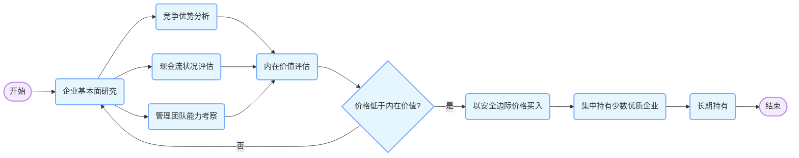

# 巴菲特的集中投资理念

> 关键词：巴菲特、集中投资理念、价值投资、投资组合、风险控制、长期收益

> 摘要：本文深入探讨了巴菲特的集中投资理念。从背景介绍出发，阐述了该理念产生的时代背景、目的和适用范围，明确了预期读者。接着详细解释了集中投资理念的核心概念及其联系，包括与传统分散投资的差异等，并给出了相应的示意图和流程图。在核心算法原理和具体操作步骤部分，虽无严格数学算法，但用代码逻辑类比了投资决策过程。同时给出了相关的数学模型和公式，结合实例进行讲解。通过项目实战，模拟了集中投资的实际操作，包括开发环境搭建、代码实现和解读。分析了集中投资理念在不同场景下的实际应用，推荐了学习该理念的工具和资源，最后总结了其未来发展趋势与挑战，解答了常见问题，并提供了扩展阅读和参考资料，旨在帮助投资者全面理解和运用巴菲特的集中投资理念。

## 1. 背景介绍 
### 1.1 目的和范围
巴菲特的集中投资理念旨在通过深入研究和分析，将投资资金集中于少数优质企业，以获取长期的超额收益。其范围涵盖了股票市场投资领域，主要针对具有长期竞争优势、稳定现金流和良好管理团队的企业。这种投资理念并非适用于所有投资者和所有市场情况，它更适合那些有能力进行深入研究、具备长期投资眼光和较强风险承受能力的投资者。

### 1.2 预期读者
本文预期读者包括对价值投资感兴趣的个人投资者、专业投资机构从业者、金融专业学生以及对巴菲特投资思想有深入研究需求的人士。无论是初涉投资领域的新手，还是经验丰富的专业投资者，都能从本文中获取对巴菲特集中投资理念的更深入理解和应用思路。

### 1.3 文档结构概述
本文首先介绍巴菲特集中投资理念的背景，包括目的、预期读者和文档结构。接着阐述核心概念与联系，明确集中投资的定义、原理和与其他投资理念的关系。然后讲解核心算法原理和具体操作步骤，虽投资决策无严格算法，但用代码逻辑类比。随后给出数学模型和公式，结合实例分析。通过项目实战模拟集中投资操作，包括环境搭建、代码实现和解读。分析实际应用场景，推荐学习工具和资源，最后总结未来趋势与挑战，解答常见问题并提供扩展阅读和参考资料。

### 1.4 术语表
#### 1.4.1 核心术语定义
- **集中投资**：将大部分投资资金集中于少数精心挑选的投资标的上，而非广泛分散投资于众多不同的资产。
- **价值投资**：寻找被市场低估的具有内在价值的资产进行投资，注重资产的基本面和长期发展潜力。
- **内在价值**：企业在其存续期间所产生的未来现金流的折现值，是评估企业真实价值的重要指标。
- **安全边际**：股票的市场价格低于其内在价值的部分，是价值投资中重要的风险控制手段。

#### 1.4.2 相关概念解释
- **投资组合**：由多种不同的投资资产组成的集合，旨在通过分散投资降低风险。集中投资是一种特殊的投资组合策略，强调集中于少数优质资产。
- **长期投资**：持有投资标的的时间较长，通常为数年甚至数十年，以获取资产的长期增值收益。
- **市场先生**：巴菲特借用本杰明·格雷厄姆的概念，将市场比喻为一个情绪不稳定的“市场先生”，他每天都会给出不同的资产报价，投资者应利用市场先生的情绪波动进行投资决策。

#### 1.4.3 缩略词列表
- **DCF**：Discounted Cash Flow，现金流折现法，用于计算企业内在价值的一种常用方法。

## 2. 核心概念与联系 
### 核心概念原理
巴菲特的集中投资理念基于价值投资的基础。其核心原理在于深入研究企业的基本面，寻找那些具有长期竞争优势、稳定现金流和良好管理团队的企业。通过对企业内在价值的准确评估，当股票市场价格低于其内在价值时，以具有安全边际的价格买入并集中持有这些股票。

与传统的分散投资理念不同，集中投资并不追求通过广泛分散来降低非系统性风险，而是通过深入研究和对优质企业的精准选择，认为集中持有少数优质企业可以在长期内获得更高的收益。因为优质企业在市场竞争中往往能够不断扩大市场份额、提高盈利能力，其价值会随着时间的推移而不断增长。

### 架构的文本示意图
```plaintext
集中投资理念架构
|-- 价值投资基础
|   |-- 企业基本面研究
|   |   |-- 竞争优势分析
|   |   |-- 现金流状况评估
|   |   |-- 管理团队能力考察
|   |-- 内在价值评估
|       |-- 现金流折现法（DCF）
|       |-- 其他估值方法
|-- 安全边际原则
|   |-- 价格低于内在价值买入
|-- 集中持有策略
|   |-- 少数优质企业
|   |-- 长期持有
```

### Mermaid 流程图


## 3. 核心算法原理 & 具体操作步骤 
### 核心算法原理
虽然投资决策并非严格基于数学算法，但可以用代码逻辑来类比巴菲特集中投资理念的决策过程。以下是一个简化的 Python 代码示例，用于模拟投资决策的核心思路：

```python
# 定义企业类
class Company:
    def __init__(self, name, competitive_advantage, cash_flow, management_quality):
        self.name = name
        self.competitive_advantage = competitive_advantage
        self.cash_flow = cash_flow
        self.management_quality = management_quality

    def calculate_intrinsic_value(self):
        # 这里简单模拟内在价值计算，实际中可能使用 DCF 等复杂方法
        return self.competitive_advantage * self.cash_flow * self.management_quality

# 定义投资决策函数
def investment_decision(companies, market_prices):
    investment_portfolio = []
    for i, company in enumerate(companies):
        intrinsic_value = company.calculate_intrinsic_value()
        market_price = market_prices[i]
        # 计算安全边际
        safety_margin = intrinsic_value - market_price
        if safety_margin > 0:
            investment_portfolio.append(company.name)
    return investment_portfolio

# 创建企业实例
company1 = Company("Company A", 0.8, 1.2, 0.9)
company2 = Company("Company B", 0.6, 1.0, 0.7)
company3 = Company("Company C", 0.9, 1.5, 0.8)

companies = [company1, company2, company3]
market_prices = [100, 80, 120]

# 进行投资决策
portfolio = investment_decision(companies, market_prices)
print("投资组合:", portfolio)
```

### 具体操作步骤
1. **企业筛选**：通过各种渠道收集企业信息，对大量企业进行初步筛选，重点关注那些具有行业领先地位、品牌优势、技术创新能力等竞争优势的企业。
2. **基本面研究**：对筛选出的企业进行深入的基本面研究，包括分析企业的财务报表、市场份额、产品竞争力、管理团队等方面。
3. **内在价值评估**：运用合适的估值方法，如现金流折现法（DCF），计算企业的内在价值。这需要对企业未来的现金流进行预测，并选择合适的折现率。
4. **安全边际判断**：比较企业的市场价格和内在价值，确定是否存在足够的安全边际。只有当市场价格明显低于内在价值时，才考虑买入。
5. **集中投资**：将资金集中投资于少数经过深入研究和评估的优质企业，避免过度分散投资。
6. **长期持有**：一旦买入股票，要坚持长期持有，不受短期市场波动的影响，等待企业价值的逐步实现。

## 4. 数学模型和公式 & 详细讲解 & 举例说明 
### 现金流折现法（DCF）模型
现金流折现法是评估企业内在价值的常用方法，其基本公式为：

$$V = \sum_{t=1}^{n} \frac{CF_t}{(1 + r)^t} + \frac{TV}{(1 + r)^n}$$

其中：
- $V$ 表示企业的内在价值
- $CF_t$ 表示第 $t$ 期的自由现金流
- $r$ 表示折现率
- $n$ 表示预测期数
- $TV$ 表示终值

### 详细讲解
- **自由现金流（$CF_t$）**：是指企业在满足了所有运营成本和资本支出后剩余的现金流量，它反映了企业实际可用于分配给股东或进行再投资的现金数量。预测自由现金流需要对企业的收入、成本、折旧、资本支出等进行详细分析。
- **折现率（$r$）**：反映了投资者对投资风险的预期回报要求。通常可以使用加权平均资本成本（WACC）作为折现率，它考虑了企业的股权成本和债务成本。
- **预测期数（$n$）**：一般根据企业的发展阶段和行业特点来确定，通常为 5 - 10 年。
- **终值（$TV$）**：是指预测期结束后企业的持续价值。常用的计算方法是使用永续增长模型，公式为：

$$TV = \frac{CF_{n+1}}{r - g}$$

其中 $CF_{n+1}$ 是预测期结束后下一期的自由现金流，$g$ 是永续增长率。

### 举例说明
假设一家企业未来 5 年的自由现金流预测如下：

| 年份 | 自由现金流（万元） |
|------|-------------------|
| 1    | 100               |
| 2    | 120               |
| 3    | 130               |
| 4    | 140               |
| 5    | 150               |

预测期结束后，假设企业的自由现金流以 3% 的永续增长率增长，折现率为 10%。

首先计算预测期内自由现金流的现值：

$$PV_{CF} = \frac{100}{(1 + 0.1)^1} + \frac{120}{(1 + 0.1)^2} + \frac{130}{(1 + 0.1)^3} + \frac{140}{(1 + 0.1)^4} + \frac{150}{(1 + 0.1)^5}$$

```python
import math

cf = [100, 120, 130, 140, 150]
r = 0.1
pv_cf = sum([cf[i] / math.pow(1 + r, i + 1) for i in range(len(cf))])
print("预测期内自由现金流现值:", pv_cf)
```

然后计算终值：

$$CF_{6} = 150 \times (1 + 0.03) = 154.5$$

$$TV = \frac{154.5}{0.1 - 0.03} = 2207.14$$

终值的现值为：

$$PV_{TV} = \frac{2207.14}{(1 + 0.1)^5}$$

```python
cf_6 = 150 * (1 + 0.03)
tv = cf_6 / (0.1 - 0.03)
pv_tv = tv / math.pow(1 + r, 5)
print("终值的现值:", pv_tv)
```

最后计算企业的内在价值：

$$V = PV_{CF} + PV_{TV}$$

```python
v = pv_cf + pv_tv
print("企业内在价值:", v)
```

## 5. 项目实战：代码实际案例和详细解释说明 
### 5.1  开发环境搭建
- **编程语言**：Python，它具有丰富的数据分析和金融计算库，如 Pandas、Numpy 等。
- **开发工具**：可以使用 Jupyter Notebook 进行交互式开发，也可以使用 PyCharm 等专业的 Python IDE。
- **数据获取**：可以使用第三方金融数据接口，如 Tushare、BaoStock 等获取股票市场数据。

### 5.2  源代码详细实现和代码解读
以下是一个使用 Python 实现的简单集中投资模拟代码：

```python
import tushare as ts
import pandas as pd
import numpy as np

# 设置 Tushare token
ts.set_token('your_token')
pro = ts.pro_api()

# 定义企业筛选函数
def select_companies():
    # 这里简单筛选市值排名前 10 的企业
    data = pro.daily_basic(ts_code='', trade_date='', fields='ts_code,total_mv')
    top_10 = data.nlargest(10, 'total_mv')
    return top_10['ts_code'].tolist()

# 定义获取股票历史数据函数
def get_stock_data(ts_code, start_date, end_date):
    df = pro.daily(ts_code=ts_code, start_date=start_date, end_date=end_date)
    df = df.sort_values(by='trade_date')
    df['close'] = pd.to_numeric(df['close'])
    return df

# 定义投资组合模拟函数
def portfolio_simulation(ts_codes, start_date, end_date):
    portfolio_returns = []
    for ts_code in ts_codes:
        df = get_stock_data(ts_code, start_date, end_date)
        returns = df['close'].pct_change()
        portfolio_returns.append(returns)
    portfolio_returns = pd.concat(portfolio_returns, axis=1)
    portfolio_returns.columns = ts_codes
    # 等权重投资组合
    weights = np.ones(len(ts_codes)) / len(ts_codes)
    portfolio_returns['portfolio'] = portfolio_returns.dot(weights)
    return portfolio_returns

# 筛选企业
ts_codes = select_companies()
start_date = '20200101'
end_date = '20231231'

# 进行投资组合模拟
portfolio_returns = portfolio_simulation(ts_codes, start_date, end_date)

# 绘制投资组合收益曲线
import matplotlib.pyplot as plt

plt.figure(figsize=(12, 6))
plt.plot((1 + portfolio_returns['portfolio']).cumprod() - 1)
plt.title('集中投资组合累计收益率')
plt.xlabel('日期')
plt.ylabel('累计收益率')
plt.show()
```

### 代码解读与分析
1. **企业筛选函数（`select_companies`）**：使用 Tushare 接口获取所有股票的基本信息，筛选出市值排名前 10 的企业代码。
2. **获取股票历史数据函数（`get_stock_data`）**：根据企业代码和日期范围，使用 Tushare 接口获取股票的历史交易数据，并按日期排序。
3. **投资组合模拟函数（`portfolio_simulation`）**：对筛选出的企业股票进行历史收益率计算，构建等权重投资组合，并计算投资组合的收益率。
4. **绘制投资组合收益曲线**：使用 Matplotlib 库绘制投资组合的累计收益率曲线，直观展示投资组合的表现。

需要注意的是，这只是一个简单的模拟代码，实际的集中投资决策需要更深入的企业研究和基本面分析。

## 6. 实际应用场景 
### 个人投资者
对于个人投资者来说，巴菲特的集中投资理念可以帮助他们避免盲目跟风和过度交易。通过深入研究少数优质企业，集中投资可以提高资金的使用效率，获取长期的超额收益。例如，个人投资者可以关注那些自己熟悉的行业和企业，如消费、医药等，通过分析企业的财务报表、品牌价值等因素，选择具有长期竞争优势的企业进行集中投资。

### 专业投资机构
专业投资机构可以运用集中投资理念构建核心投资组合。在对市场进行广泛研究的基础上，筛选出少数具有高增长潜力和稳定现金流的企业进行集中配置。同时，投资机构可以利用自身的研究团队和资源优势，对企业进行更深入的分析和跟踪，及时调整投资组合。例如，一些价值投资型的基金公司会采用集中投资策略，将大部分资金集中于少数优质股票，以实现长期的业绩目标。

### 长期投资计划
集中投资理念非常适合长期投资计划，如养老基金、教育基金等。这些资金通常具有较长的投资期限，更注重资产的长期增值。通过集中投资于优质企业，投资者可以分享企业成长带来的红利，避免短期市场波动的干扰。例如，投资者可以选择一些具有稳定分红和持续增长能力的蓝筹股进行长期投资，为未来的养老或子女教育提供资金保障。

## 7. 工具和资源推荐
### 7.1 学习资源推荐
#### 7.1.1 书籍推荐
- 《聪明的投资者》（The Intelligent Investor）：本杰明·格雷厄姆著，被誉为投资界的圣经，介绍了价值投资的基本理念和方法，是理解巴菲特投资思想的基础读物。
- 《巴菲特致股东的信：投资者和公司高管教程》（Letters to Shareholders of Berkshire Hathaway）：沃伦·巴菲特著，收录了巴菲特历年致股东的信，通过这些信件可以深入了解巴菲特的投资理念、决策过程和对企业的分析方法。
- 《穷查理宝典：查理·芒格的智慧箴言录》（Poor Charlie's Almanack）：彼得·考夫曼编著，介绍了巴菲特的合作伙伴查理·芒格的投资哲学和多元思维模型，对投资者拓展思维和分析问题具有重要启示。

#### 7.1.2 在线课程
- Coursera 平台上的“投资学原理”课程：由知名大学教授授课，系统介绍了投资学的基本理论和方法，包括价值投资、资产定价等内容。
- 网易云课堂上的“巴菲特投资思想解读”课程：专门讲解巴菲特的投资理念和实践案例，适合对巴菲特投资思想感兴趣的学习者。

#### 7.1.3 技术博客和网站
- 雪球网：国内知名的投资社区，汇聚了众多投资者和投资专家，提供股票分析、投资策略分享等内容。
- Seeking Alpha：国外知名的金融投资网站，提供大量的股票研究报告、投资分析文章和专家观点。

### 7.2 开发工具框架推荐
#### 7.2.1 IDE和编辑器
- PyCharm：专业的 Python 集成开发环境，具有强大的代码编辑、调试和项目管理功能，适合进行金融数据分析和投资模拟代码的开发。
- Jupyter Notebook：交互式开发环境，支持 Python、R 等多种编程语言，方便进行数据探索、可视化和代码演示。

#### 7.2.2 调试和性能分析工具
- PDB：Python 内置的调试器，可以帮助开发者定位代码中的问题和错误。
- cProfile：Python 标准库中的性能分析工具，可以分析代码的运行时间和函数调用情况，帮助优化代码性能。

#### 7.2.3 相关框架和库
- Pandas：强大的数据处理和分析库，提供了高效的数据结构和数据操作方法，适合处理金融数据。
- Numpy：Python 的数值计算库，提供了高性能的多维数组对象和数学函数，用于数值计算和统计分析。
- Matplotlib：Python 的绘图库，可以绘制各种类型的图表，如折线图、柱状图、散点图等，用于数据可视化。

### 7.3 相关论文著作推荐
#### 7.3.1 经典论文
- “The Superinvestors of Graham-and-Doddsville”：沃伦·巴菲特著，阐述了价值投资的有效性和集中投资的优势，通过对格雷厄姆和多德的学生投资业绩的分析，证明了价值投资策略可以战胜市场。
- “Common Stocks and Uncommon Profits”：菲利普·费雪著，提出了成长投资的理念和方法，对巴菲特的投资思想产生了重要影响。

#### 7.3.2 最新研究成果
- 一些学术期刊如《金融研究》、《Journal of Financial Economics》等会发表关于价值投资、投资组合管理等方面的最新研究成果，可以关注这些期刊获取最新的学术动态。

#### 7.3.3 应用案例分析
- 一些投资研究机构会发布关于集中投资策略的应用案例分析报告，通过对实际投资组合的分析，展示集中投资策略的实施过程和效果。例如，晨星公司的研究报告可以为投资者提供参考。

## 8. 总结：未来发展趋势与挑战
### 未来发展趋势
- **数字化和科技应用**：随着信息技术的发展，投资者可以利用大数据、人工智能等技术进行更深入的企业研究和投资决策。例如，通过分析企业的社交媒体数据、电商销售数据等，更全面地了解企业的市场表现和竞争力。
- **全球化投资**：经济全球化的趋势使得投资者可以更容易地进行全球范围内的投资。巴菲特的集中投资理念可以应用于全球市场，寻找具有全球竞争优势的企业进行投资。
- **可持续投资**：越来越多的投资者开始关注企业的社会责任和可持续发展。未来，集中投资理念可能会与可持续投资相结合，选择那些具有良好环境、社会和治理（ESG）表现的企业进行投资。

### 挑战
- **市场不确定性**：股票市场充满了不确定性，宏观经济环境、政策变化、行业竞争等因素都会影响企业的业绩和股票价格。集中投资由于持有股票数量较少，一旦所选企业出现问题，可能会导致较大的损失。
- **信息不对称**：投资者在获取企业信息方面可能存在不对称性，企业内部人员可能掌握更多的真实信息，而外部投资者难以全面了解企业的实际情况。这增加了投资决策的难度和风险。
- **投资者心理因素**：集中投资需要投资者具备较强的心理素质和长期投资的耐心。在市场波动较大时，投资者可能会受到情绪的影响，做出错误的投资决策。

## 9. 附录：常见问题与解答
### 集中投资是否意味着不分散风险？
集中投资并非完全不考虑风险分散。虽然集中投资将资金集中于少数企业，但这些企业通常来自不同的行业和领域，以降低行业风险。同时，通过深入研究和选择具有长期竞争优势的企业，可以降低企业特定风险。

### 如何确定集中投资的股票数量？
巴菲特并没有明确规定集中投资的股票数量，但一般认为持有 5 - 10 只股票较为合适。具体数量应根据投资者的研究能力、资金规模和风险承受能力等因素来确定。

### 集中投资适合短期投资吗？
集中投资更适合长期投资。因为集中投资的核心是通过持有优质企业分享其长期成长带来的收益，短期市场波动可能会导致股票价格的大幅波动，但优质企业的价值通常会在长期内得到体现。

### 如何评估企业的内在价值？
评估企业内在价值的方法有很多种，如现金流折现法（DCF）、相对估值法（如市盈率、市净率等）。投资者可以根据企业的特点和行业情况选择合适的估值方法，并结合定性分析，如企业的竞争优势、管理团队等因素，综合评估企业的内在价值。

## 10. 扩展阅读 & 参考资料
### 扩展阅读
- 《金融炼金术》（The Alchemy of Finance）：乔治·索罗斯著，介绍了索罗斯的投资哲学和反身性理论，与巴菲特的价值投资理念形成对比和补充。
- 《漫步华尔街》（A Random Walk Down Wall Street）：伯顿·马尔基尔著，探讨了有效市场假说和投资组合理论，对投资者理解市场和投资策略有一定的帮助。

### 参考资料
- 沃伦·巴菲特历年致股东的信：https://www.berkshirehathaway.com/letters/letters.html
- Tushare 金融数据接口文档：https://tushare.pro/document/1
- Pandas 官方文档：https://pandas.pydata.org/docs/

作者：AI天才研究院/AI Genius Institute & 禅与计算机程序设计艺术 /Zen And The Art of Computer Programming