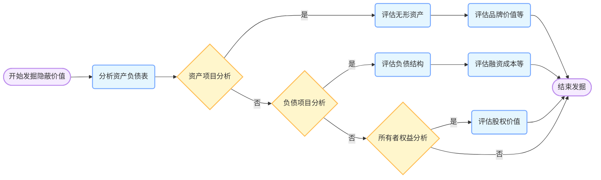

# 布鲁斯·格林沃尔德的隐蔽价值：发掘资产负债表中的秘密

> 关键词：布鲁斯·格林沃尔德、隐蔽价值、资产负债表、价值发掘、财务分析

> 摘要：本文围绕布鲁斯·格林沃尔德所提出的隐蔽价值概念，深入探讨如何从资产负债表中发掘这些秘密。首先介绍了相关背景，包括目的范围、预期读者等内容。接着阐述了隐蔽价值的核心概念及联系，给出原理和架构的示意图与流程图。详细讲解了核心算法原理和具体操作步骤，并结合 Python 代码进行说明。通过数学模型和公式进一步剖析隐蔽价值的计算和分析方法。以项目实战的方式展示代码实际案例并进行解读。探讨了隐蔽价值在实际中的应用场景，推荐了相关的学习资源、开发工具框架以及论文著作。最后总结了未来发展趋势与挑战，还设置了附录解答常见问题，并提供扩展阅读和参考资料，旨在帮助读者全面理解和掌握从资产负债表中发掘隐蔽价值的方法。

## 1. 背景介绍 
### 1.1 目的和范围
本文章的主要目的是深入解读布鲁斯·格林沃尔德所提出的隐蔽价值理论，并详细阐述如何从资产负债表中发掘这些隐蔽价值。通过对资产负债表的分析，帮助投资者、财务分析师以及相关专业人士更好地理解企业的真实价值，从而做出更明智的投资决策和财务判断。文章的范围涵盖了隐蔽价值的核心概念、算法原理、数学模型、实际案例以及相关的工具和资源推荐等方面。

### 1.2 预期读者
本文预期读者主要包括以下几类人群：
- 投资者：无论是个人投资者还是机构投资者，都可以通过学习从资产负债表中发掘隐蔽价值的方法，提高投资决策的准确性和成功率。
- 财务分析师：帮助他们更深入地分析企业财务状况，挖掘企业潜在价值，为企业的财务评估和战略规划提供更有价值的建议。
- 金融专业学生：作为学习财务分析和投资学的参考资料，加深对资产负债表分析和价值评估的理解。
- 企业管理者：了解自身企业资产负债表中的隐蔽价值，有助于更好地进行企业资源管理和战略决策。

### 1.3 文档结构概述
本文将按照以下结构进行阐述：
- 核心概念与联系：介绍隐蔽价值的核心概念，包括其定义、原理和架构，并通过文本示意图和 Mermaid 流程图进行直观展示。
- 核心算法原理 & 具体操作步骤：详细讲解从资产负债表中发掘隐蔽价值的核心算法原理，并给出具体的操作步骤，同时使用 Python 源代码进行说明。
- 数学模型和公式 & 详细讲解 & 举例说明：运用数学模型和公式对隐蔽价值进行量化分析，并通过具体例子进行详细讲解。
- 项目实战：代码实际案例和详细解释说明：通过实际项目案例，展示如何运用前面所学的知识和方法从资产负债表中发掘隐蔽价值，并对代码进行详细解读和分析。
- 实际应用场景：探讨隐蔽价值在实际投资和财务分析中的应用场景。
- 工具和资源推荐：推荐相关的学习资源、开发工具框架以及论文著作，帮助读者进一步深入学习和研究。
- 总结：未来发展趋势与挑战：总结从资产负债表中发掘隐蔽价值的未来发展趋势，并分析可能面临的挑战。
- 附录：常见问题与解答：解答读者在学习和应用过程中可能遇到的常见问题。
- 扩展阅读 & 参考资料：提供相关的扩展阅读材料和参考资料，方便读者进一步深入学习。

### 1.4 术语表
#### 1.4.1 核心术语定义
- **隐蔽价值（Hidden Value）**：指企业资产负债表中未被市场充分认识和反映的价值，这些价值可能由于各种原因被低估或忽视，如无形资产、潜在的业务机会等。
- **资产负债表（Balance Sheet）**：反映企业在某一特定日期财务状况的会计报表，它展示了企业的资产、负债和所有者权益之间的平衡关系。
- **账面价值（Book Value）**：指资产负债表上资产或负债的记录价值，通常根据历史成本原则计算得出。
- **市场价值（Market Value）**：指资产在市场上的交易价格，反映了市场对资产的预期和评估。

#### 1.4.2 相关概念解释
- **无形资产（Intangible Assets）**：指企业拥有或控制的没有实物形态的可辨认非货币性资产，如专利权、商标权、商誉等。无形资产的价值往往难以准确衡量，但可能对企业的未来发展产生重要影响。
- **潜在业务机会（Potential Business Opportunities）**：指企业尚未充分开发或利用的业务领域或市场机会，这些机会可能隐藏在企业的资产负债表中，需要通过深入分析才能发现。
- **财务分析（Financial Analysis）**：指通过对企业财务报表和相关财务数据的分析，评估企业的财务状况、经营成果和现金流量，为投资者、管理者等提供决策依据的过程。

#### 1.4.3 缩略词列表
- **GAAP**：Generally Accepted Accounting Principles，公认会计原则
- **ROE**：Return on Equity，净资产收益率
- **EPS**：Earnings Per Share，每股收益

## 2. 核心概念与联系 
### 隐蔽价值的定义与原理
隐蔽价值是布鲁斯·格林沃尔德提出的一个重要概念，它强调企业资产负债表中存在一些未被市场充分认识和反映的价值。这些价值可能由于会计处理方法、市场认知偏差等原因而被低估或忽视。例如，企业拥有的一些无形资产，如品牌价值、专利技术等，在资产负债表上可能只以较低的账面价值记录，但其实际价值可能远远高于账面价值。另外，企业潜在的业务机会、未充分利用的资产等也可能构成隐蔽价值。

### 隐蔽价值与资产负债表的联系
资产负债表是发掘隐蔽价值的重要依据。通过对资产负债表的详细分析，可以发现企业的一些潜在资产和价值。例如，资产负债表中的无形资产项目可能包含着企业的核心竞争力和未来发展潜力；存货和固定资产的账面价值可能与市场价值存在差异，通过合理评估可以发现其中的隐蔽价值。同时，负债项目也会影响企业的真实价值，合理的负债结构可以降低企业的融资成本，提高企业的价值。

### 核心概念原理和架构的文本示意图
```plaintext
              隐蔽价值
                |
        资产负债表分析
      /           |           \
  资产项目分析  负债项目分析  所有者权益分析
    |             |             |
无形资产评估  负债结构评估  股权价值评估
    |             |             |
品牌价值等  融资成本等  净资产价值等
```

### Mermaid 流程图


## 3. 核心算法原理 & 具体操作步骤 
### 核心算法原理
从资产负债表中发掘隐蔽价值的核心算法原理主要基于对资产和负债的重新评估和分析。具体来说，包括以下几个方面：
- **资产重估**：对资产负债表中的各项资产进行重新评估，考虑其市场价值、潜在价值等因素，以确定其真实价值。例如，对于固定资产，可以采用重置成本法或市场比较法进行评估；对于无形资产，可以通过收益法或市场法进行评估。
- **负债调整**：分析企业的负债结构，考虑负债的成本、期限等因素，对负债进行调整。例如，对于高成本的负债，可以考虑进行债务重组或提前偿还，以降低企业的融资成本。
- **价值计算**：通过对资产和负债的重新评估，计算企业的真实价值。企业的真实价值可以表示为：
    - 真实价值 = 重估后的资产价值 - 调整后的负债价值

### 具体操作步骤
#### 步骤 1：收集资产负债表数据
首先，需要收集企业的资产负债表数据。可以从企业的财务报表、证券交易所网站等渠道获取。确保数据的准确性和完整性。

#### 步骤 2：资产项目分析
- **固定资产分析**：查看固定资产的账面价值、折旧方法和折旧年限等信息。采用合适的评估方法对固定资产进行重新评估，如重置成本法或市场比较法。
- **无形资产分析**：识别企业的无形资产，如专利权、商标权、商誉等。采用收益法或市场法对无形资产进行评估，考虑其未来的收益潜力和市场价值。
- **存货分析**：分析存货的种类、数量和账面价值。考虑存货的市场需求、保质期等因素，对存货进行减值测试或重新评估。

#### 步骤 3：负债项目分析
- **负债结构分析**：查看企业的负债结构，包括短期负债和长期负债的比例、不同类型负债的成本等。评估负债的风险和成本，考虑是否需要进行债务重组或调整。
- **或有负债分析**：识别企业的或有负债，如未决诉讼、担保责任等。评估或有负债的可能性和影响程度，对其进行合理的估计和披露。

#### 步骤 4：所有者权益分析
- **股权价值评估**：计算企业的净资产价值，即所有者权益。考虑企业的盈利能力、成长潜力等因素，对股权价值进行评估。
- **股东权益变动分析**：查看股东权益的变动情况，分析其原因和影响。例如，股东的增资、减资、分红等行为都会对股东权益产生影响。

#### 步骤 5：计算隐蔽价值
根据对资产和负债的重新评估结果，计算企业的真实价值。将真实价值与企业的市场价值进行比较，两者之间的差异即为隐蔽价值。

### Python 源代码实现
```python
import pandas as pd

# 定义资产负债表数据类
class BalanceSheet:
    def __init__(self, assets, liabilities, equity):
        self.assets = assets
        self.liabilities = liabilities
        self.equity = equity

    # 资产重估方法（示例：简单的固定资产增值）
    def revalue_assets(self, fixed_asset_increase_rate=0.1):
        fixed_assets = self.assets.get('固定资产', 0)
        new_fixed_assets = fixed_assets * (1 + fixed_asset_increase_rate)
        self.assets['固定资产'] = new_fixed_assets
        return self.assets

    # 负债调整方法（示例：降低负债成本）
    def adjust_liabilities(self, liability_cost_decrease_rate=0.05):
        total_liabilities = sum(self.liabilities.values())
        new_total_liabilities = total_liabilities * (1 - liability_cost_decrease_rate)
        for key in self.liabilities:
            self.liabilities[key] = self.liabilities[key] * (new_total_liabilities / total_liabilities)
        return self.liabilities

    # 计算真实价值
    def calculate_true_value(self):
        revalued_assets = self.revalue_assets()
        adjusted_liabilities = self.adjust_liabilities()
        total_assets = sum(revalued_assets.values())
        total_liabilities = sum(adjusted_liabilities.values())
        true_value = total_assets - total_liabilities
        return true_value

# 示例资产负债表数据
assets = {
    '货币资金': 1000,
    '应收账款': 2000,
    '存货': 3000,
    '固定资产': 5000
}

liabilities = {
    '短期借款': 2000,
    '长期借款': 3000
}

equity = 6000

# 创建资产负债表对象
balance_sheet = BalanceSheet(assets, liabilities, equity)

# 计算真实价值
true_value = balance_sheet.calculate_true_value()
print(f"企业的真实价值为: {true_value}")
```

### 代码解释
- `BalanceSheet` 类：用于表示资产负债表数据，包含资产、负债和所有者权益三个属性。
- `revalue_assets` 方法：对固定资产进行简单的增值处理，模拟资产重估的过程。
- `adjust_liabilities` 方法：降低负债成本，模拟负债调整的过程。
- `calculate_true_value` 方法：根据资产重估和负债调整的结果，计算企业的真实价值。
- 示例代码中，创建了一个资产负债表对象，并调用 `calculate_true_value` 方法计算企业的真实价值。

## 4. 数学模型和公式 & 详细讲解 & 举例说明 
### 数学模型和公式
#### 资产重估模型
对于固定资产的重估，可以采用重置成本法，其公式为：
$$V_{fixed\_asset\_new} = V_{fixed\_asset\_old} \times (1 + r_{increase})$$
其中，$V_{fixed\_asset\_new}$ 表示重估后的固定资产价值，$V_{fixed\_asset\_old}$ 表示固定资产的账面价值，$r_{increase}$ 表示固定资产的增值率。

对于无形资产的评估，可以采用收益法，其公式为：
$$V_{intangible} = \sum_{t=1}^{n} \frac{CF_t}{(1 + r)^t}$$
其中，$V_{intangible}$ 表示无形资产的价值，$CF_t$ 表示第 $t$ 期的现金流量，$r$ 表示折现率，$n$ 表示预测期数。

#### 负债调整模型
对于负债的调整，可以考虑降低负债成本，其公式为：
$$V_{liability\_new} = V_{liability\_old} \times (1 - r_{decrease})$$
其中，$V_{liability\_new}$ 表示调整后的负债价值，$V_{liability\_old}$ 表示负债的账面价值，$r_{decrease}$ 表示负债成本的降低率。

#### 真实价值计算模型
企业的真实价值计算公式为：
$$V_{true} = \sum_{i=1}^{m} V_{asset\_i} - \sum_{j=1}^{k} V_{liability\_j}$$
其中，$V_{true}$ 表示企业的真实价值，$V_{asset\_i}$ 表示第 $i$ 项资产的重估价值，$V_{liability\_j}$ 表示第 $j$ 项负债的调整价值，$m$ 表示资产的种类数，$k$ 表示负债的种类数。

### 详细讲解
#### 资产重估
- **固定资产重估**：固定资产的账面价值通常是按照历史成本记录的，随着时间的推移和市场环境的变化，其实际价值可能会发生变化。采用重置成本法对固定资产进行重估，可以考虑到当前的市场价格和技术水平，更准确地反映固定资产的真实价值。
- **无形资产评估**：无形资产的价值主要体现在其未来的收益潜力上。收益法通过预测无形资产在未来各期的现金流量，并将其折现到当前时刻，来计算无形资产的价值。折现率的选择需要考虑到无形资产的风险水平和市场利率等因素。

#### 负债调整
企业的负债成本会影响企业的盈利能力和价值。通过降低负债成本，可以提高企业的净利润和股东权益。负债成本的降低可以通过债务重组、提前偿还高成本负债等方式实现。

#### 真实价值计算
企业的真实价值是通过对资产和负债进行重新评估后计算得出的。真实价值反映了企业的实际财务状况和潜在价值，与企业的市场价值进行比较，可以发现企业是否存在隐蔽价值。

### 举例说明
假设某企业的资产负债表数据如下：
| 资产项目 | 账面价值（万元） |
| ---- | ---- |
| 货币资金 | 100 |
| 应收账款 | 200 |
| 存货 | 300 |
| 固定资产 | 500 |
| 无形资产（专利权） | 100 |

| 负债项目 | 账面价值（万元） |
| ---- | ---- |
| 短期借款 | 200 |
| 长期借款 | 300 |

所有者权益为 700 万元。

#### 资产重估
- 固定资产增值率为 10%，则重估后的固定资产价值为：
$$V_{fixed\_asset\_new} = 500 \times (1 + 0.1) = 550 \text{（万元）}$$
- 专利权预计未来 5 年的现金流量分别为 20 万元、30 万元、40 万元、50 万元、60 万元，折现率为 10%，则专利权的价值为：
$$V_{intangible} = \frac{20}{(1 + 0.1)^1} + \frac{30}{(1 + 0.1)^2} + \frac{40}{(1 + 0.1)^3} + \frac{50}{(1 + 0.1)^4} + \frac{60}{(1 + 0.1)^5} \approx 138.16 \text{（万元）}$$

重估后的资产总价值为：
$$\sum_{i=1}^{m} V_{asset\_i} = 100 + 200 + 300 + 550 + 138.16 = 1288.16 \text{（万元）}$$

#### 负债调整
负债成本降低率为 5%，则调整后的负债总价值为：
$$V_{liability\_new} = (200 + 300) \times (1 - 0.05) = 475 \text{（万元）}$$

#### 真实价值计算
企业的真实价值为：
$$V_{true} = 1288.16 - 475 = 813.16 \text{（万元）}$$

假设该企业的市场价值为 750 万元，则隐蔽价值为：
$$V_{hidden} = 813.16 - 750 = 63.16 \text{（万元）}$$

通过以上计算可以发现，该企业存在一定的隐蔽价值，可能被市场低估。

## 5. 项目实战：代码实际案例和详细解释说明 
### 5.1 开发环境搭建
#### 安装 Python
首先，需要安装 Python 环境。可以从 Python 官方网站（https://www.python.org/downloads/）下载适合自己操作系统的 Python 版本，并按照安装向导进行安装。

#### 安装必要的库
在项目中，需要使用 `pandas` 库来处理和分析数据。可以使用以下命令来安装 `pandas` 库：
```sh
pip install pandas
```

### 5.2 源代码详细实现和代码解读
```python
import pandas as pd

# 定义资产负债表数据类
class BalanceSheet:
    def __init__(self, assets, liabilities, equity):
        """
        初始化资产负债表对象
        :param assets: 资产字典，键为资产项目名称，值为资产账面价值
        :param liabilities: 负债字典，键为负债项目名称，值为负债账面价值
        :param equity: 所有者权益
        """
        self.assets = assets
        self.liabilities = liabilities
        self.equity = equity

    # 资产重估方法（示例：简单的固定资产增值）
    def revalue_assets(self, fixed_asset_increase_rate=0.1):
        """
        对固定资产进行重估
        :param fixed_asset_increase_rate: 固定资产增值率，默认为 0.1
        :return: 重估后的资产字典
        """
        fixed_assets = self.assets.get('固定资产', 0)
        new_fixed_assets = fixed_assets * (1 + fixed_asset_increase_rate)
        self.assets['固定资产'] = new_fixed_assets
        return self.assets

    # 负债调整方法（示例：降低负债成本）
    def adjust_liabilities(self, liability_cost_decrease_rate=0.05):
        """
        对负债进行调整
        :param liability_cost_decrease_rate: 负债成本降低率，默认为 0.05
        :return: 调整后的负债字典
        """
        total_liabilities = sum(self.liabilities.values())
        new_total_liabilities = total_liabilities * (1 - liability_cost_decrease_rate)
        for key in self.liabilities:
            self.liabilities[key] = self.liabilities[key] * (new_total_liabilities / total_liabilities)
        return self.liabilities

    # 计算真实价值
    def calculate_true_value(self):
        """
        计算企业的真实价值
        :return: 企业的真实价值
        """
        revalued_assets = self.revalue_assets()
        adjusted_liabilities = self.adjust_liabilities()
        total_assets = sum(revalued_assets.values())
        total_liabilities = sum(adjusted_liabilities.values())
        true_value = total_assets - total_liabilities
        return true_value

# 示例资产负债表数据
assets = {
    '货币资金': 1000,
    '应收账款': 2000,
    '存货': 3000,
    '固定资产': 5000
}

liabilities = {
    '短期借款': 2000,
    '长期借款': 3000
}

equity = 6000

# 创建资产负债表对象
balance_sheet = BalanceSheet(assets, liabilities, equity)

# 计算真实价值
true_value = balance_sheet.calculate_true_value()
print(f"企业的真实价值为: {true_value}")
```

### 代码解读与分析
#### 类定义
- `BalanceSheet` 类用于表示资产负债表数据，包含三个属性：`assets`（资产）、`liabilities`（负债）和 `equity`（所有者权益）。

#### 方法定义
- `__init__` 方法：初始化资产负债表对象，接收资产、负债和所有者权益作为参数。
- `revalue_assets` 方法：对固定资产进行重估，通过增加固定资产的账面价值来模拟资产重估的过程。
- `adjust_liabilities` 方法：对负债进行调整，通过降低负债成本来模拟负债调整的过程。
- `calculate_true_value` 方法：根据资产重估和负债调整的结果，计算企业的真实价值。

#### 示例数据和计算
- 定义了示例资产负债表数据，包括资产、负债和所有者权益。
- 创建了 `BalanceSheet` 类的对象，并调用 `calculate_true_value` 方法计算企业的真实价值。
- 最后打印出企业的真实价值。

### 代码扩展
可以对代码进行扩展，例如：
- 增加更多的资产重估方法，如对存货进行减值测试、对无形资产进行更复杂的评估等。
- 增加更多的负债调整方法，如考虑不同类型负债的期限结构、利率调整等。
- 引入更多的财务指标和分析方法，如计算净资产收益率、每股收益等，以更全面地评估企业的价值。

## 6. 实际应用场景 
### 投资决策
在投资决策中，发掘资产负债表中的隐蔽价值可以帮助投资者发现被市场低估的企业。通过对企业资产负债表的深入分析，投资者可以评估企业的真实价值，并与市场价格进行比较。如果企业的真实价值高于市场价格，说明企业可能存在隐蔽价值，具有投资潜力。投资者可以根据自己的投资策略和风险偏好，选择合适的投资时机和投资方式。

### 企业并购
在企业并购过程中，了解目标企业的隐蔽价值至关重要。通过对目标企业资产负债表的分析，可以发现其潜在的资产和价值，如未充分利用的土地、专利技术等。这些隐蔽价值可以增加目标企业的并购价值，为并购方带来额外的收益。同时，对目标企业负债的分析也可以帮助并购方评估并购的风险和成本。

### 财务分析
财务分析师可以通过发掘资产负债表中的隐蔽价值，为企业的财务评估和战略规划提供更有价值的建议。例如，通过对企业无形资产的评估，可以了解企业的核心竞争力和未来发展潜力；通过对负债结构的分析，可以评估企业的财务风险和融资能力。财务分析师可以根据分析结果，为企业提出优化资产配置、调整负债结构等建议，以提高企业的价值和竞争力。

### 企业估值
在企业估值过程中，考虑隐蔽价值可以更准确地评估企业的价值。传统的估值方法往往只关注企业的账面价值和市场价值，而忽略了企业的隐蔽价值。通过发掘资产负债表中的隐蔽价值，可以对企业的真实价值进行更全面的评估，为企业的股权融资、上市等提供更合理的估值依据。

## 7. 工具和资源推荐
### 7.1 学习资源推荐
#### 7.1.1 书籍推荐
- 《价值投资：从格雷厄姆到巴菲特》：本书详细介绍了价值投资的理论和方法，包括如何从财务报表中发掘企业的价值，对理解布鲁斯·格林沃尔德的隐蔽价值理论有很大的帮助。
- 《财务报表分析与证券定价》：该书系统地阐述了财务报表分析的方法和技巧，以及如何运用财务报表信息进行证券定价，是学习财务分析和价值评估的经典教材。
- 《聪明的投资者》：本杰明·格雷厄姆的经典著作，强调了价值投资的重要性和基本原则，对投资者的投资理念和决策方法有很大的启发。

#### 7.1.2 在线课程
- Coursera 上的“财务报表分析”课程：由知名大学教授授课，内容涵盖了财务报表的基本概念、分析方法和应用，通过案例分析和实践操作，帮助学员掌握财务报表分析的技能。
- edX 上的“价值投资原理”课程：该课程介绍了价值投资的基本原理和方法，包括如何评估企业的内在价值、如何寻找被低估的股票等，适合对价值投资感兴趣的学员学习。

#### 7.1.3 技术博客和网站
- Seeking Alpha：一个知名的投资研究网站，提供了大量的股票分析、投资策略和市场评论文章，其中不乏对企业资产负债表和隐蔽价值的分析。
- 雪球财经：国内知名的投资交流社区，聚集了众多投资者和财务专家，用户可以在社区中分享自己的投资经验和分析报告，学习他人的投资思路和方法。

### 7.2 开发工具框架推荐
#### 7.2.1 IDE和编辑器
- PyCharm：一款专业的 Python 集成开发环境，提供了丰富的代码编辑、调试和项目管理功能，适合开发和调试 Python 代码。
- Jupyter Notebook：一个交互式的开发环境，支持多种编程语言，特别适合数据处理和分析。用户可以在 Jupyter Notebook 中编写代码、运行代码和展示结果，方便进行数据探索和可视化。

#### 7.2.2 调试和性能分析工具
- pdb：Python 自带的调试工具，可以帮助用户在代码中设置断点、单步执行代码、查看变量值等，方便调试代码。
- cProfile：Python 的性能分析工具，可以帮助用户分析代码的执行时间和资源消耗情况，找出代码中的性能瓶颈。

#### 7.2.3 相关框架和库
- pandas：一个强大的数据处理和分析库，提供了丰富的数据结构和数据操作方法，适合处理和分析财务数据。
- numpy：一个用于科学计算的库，提供了高效的数组操作和数学函数，在财务分析和数值计算中经常使用。

### 7.3 相关论文著作推荐
#### 7.3.1 经典论文
- 《Security Analysis》（《证券分析》）：本杰明·格雷厄姆和戴维·多德的经典著作，奠定了价值投资的理论基础，其中对财务报表分析和企业价值评估的方法和理念至今仍具有重要的指导意义。
- 《The Theory of Investment Value》（《投资价值理论》）：约翰·伯尔·威廉姆斯的经典著作，提出了现金流折现模型，为企业估值提供了重要的理论依据。

#### 7.3.2 最新研究成果
- 关注顶级学术期刊，如《Journal of Finance》、《Review of Financial Studies》等，这些期刊发表了大量关于财务分析、价值评估和投资决策的最新研究成果。
- 参加学术会议和研讨会，与国内外的专家学者交流和分享最新的研究进展和实践经验。

#### 7.3.3 应用案例分析
- 研究一些知名投资机构和投资者的投资案例，如巴菲特的投资案例、彼得·林奇的投资案例等，学习他们如何从资产负债表中发掘隐蔽价值，以及如何进行投资决策。
- 分析一些成功的企业并购案例，了解并购方如何评估目标企业的隐蔽价值，以及如何实现并购后的价值创造。

## 8. 总结：未来发展趋势与挑战
### 未来发展趋势
#### 数据驱动的分析方法
随着信息技术的不断发展和大数据的广泛应用，未来从资产负债表中发掘隐蔽价值的方法将更加数据驱动。通过收集和分析大量的财务数据和非财务数据，结合机器学习和人工智能算法，可以更准确地评估企业的真实价值和隐蔽价值。

#### 跨学科的融合
未来的财务分析将不再局限于传统的财务领域，而是与经济学、管理学、统计学等多个学科进行深度融合。跨学科的融合可以为发掘隐蔽价值提供更广阔的视角和更丰富的方法，提高分析的准确性和有效性。

#### 国际化的视野
随着经济全球化的不断深入，企业的经营和投资活动越来越具有国际化的特征。未来，从资产负债表中发掘隐蔽价值需要具备国际化的视野，考虑不同国家和地区的会计制度、税收政策、市场环境等因素的影响。

### 挑战
#### 数据质量和可靠性
数据质量和可靠性是从资产负债表中发掘隐蔽价值的关键。然而，由于企业财务报表的编制存在一定的主观性和不确定性，以及数据采集和处理过程中可能存在的误差，数据质量和可靠性面临着挑战。如何确保数据的准确性和完整性，是未来需要解决的重要问题。

#### 模型和算法的复杂性
随着分析方法的不断发展和创新，模型和算法的复杂性也在不断增加。复杂的模型和算法需要更高的技术水平和计算资源，同时也增加了模型和算法的解释难度和应用风险。如何在保证分析准确性的前提下，简化模型和算法的复杂性，是未来需要面对的挑战。

#### 市场环境的不确定性
市场环境的不确定性是影响企业价值评估和投资决策的重要因素。未来，市场环境将更加复杂多变，如宏观经济形势的波动、政策法规的变化、行业竞争的加剧等，都将给从资产负债表中发掘隐蔽价值带来更大的挑战。如何应对市场环境的不确定性，提高投资决策的灵活性和适应性，是未来需要研究的重要课题。

## 9. 附录：常见问题与解答
### 问题 1：如何确定固定资产的增值率？
解答：确定固定资产的增值率需要综合考虑多个因素，如市场价格波动、技术进步、固定资产的使用年限和状况等。可以参考同行业类似固定资产的市场价格走势，以及相关的市场研究报告和行业数据。同时，也可以咨询专业的资产评估机构，获取更准确的增值率建议。

### 问题 2：无形资产的评估方法有哪些？
解答：无形资产的评估方法主要有收益法、市场法和成本法。收益法是通过预测无形资产未来的收益，并将其折现到当前时刻来计算无形资产的价值；市场法是通过比较类似无形资产的市场交易价格来评估无形资产的价值；成本法是通过计算无形资产的研发成本、取得成本等成本来评估无形资产的价值。在实际应用中，需要根据无形资产的特点和评估目的选择合适的评估方法。

### 问题 3：如何评估或有负债的可能性和影响程度？
解答：评估或有负债的可能性和影响程度需要综合考虑多个因素，如未决诉讼的进展情况、担保责任的金额和期限、相关法律法规的规定等。可以收集和分析相关的法律文件、合同协议、财务报表等资料，了解或有负债的具体情况。同时，也可以咨询专业的律师和会计师，获取更准确的评估建议。

### 问题 4：隐蔽价值一定能转化为实际收益吗？
解答：隐蔽价值并不一定能直接转化为实际收益。隐蔽价值只是企业潜在的价值，需要通过一定的方式和条件才能实现。例如，企业需要有效地利用其拥有的无形资产，开发潜在的业务机会，才能将隐蔽价值转化为实际的经济效益。同时，市场环境、行业竞争等因素也会影响隐蔽价值的实现。因此，在发掘隐蔽价值的同时，还需要关注企业的经营管理能力和市场环境的变化。

## 10. 扩展阅读 & 参考资料
### 扩展阅读
- 《巴菲特致股东的信：股份公司教程》：该书收录了巴菲特多年来致股东的信，详细阐述了他的投资理念和方法，对理解价值投资和发掘企业隐蔽价值有很大的帮助。
- 《财务智慧：如何理解数字的真正含义》：这本书以通俗易懂的方式介绍了财务报表的基本概念和分析方法，帮助读者掌握财务分析的技巧，提高对企业财务状况的理解能力。

### 参考资料
- 布鲁斯·格林沃尔德的相关著作和论文。
- 企业的财务报表和年报。
- 证券交易所网站和金融数据提供商的相关数据。

作者：AI天才研究院/AI Genius Institute & 禅与计算机程序设计艺术 /Zen And The Art of Computer Programming