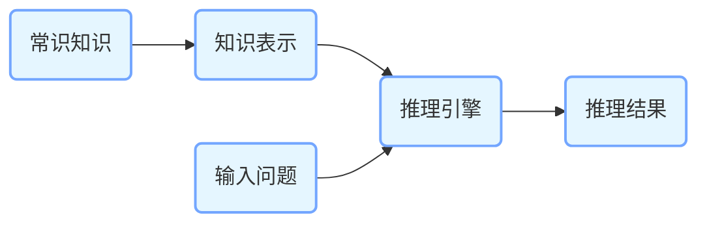

# 常识推理:当前AI系统的瓶颈与突破口

> 关键词：常识推理、AI系统、瓶颈、突破口、知识表示

> 摘要：本文深入探讨了常识推理在当前AI系统中的重要性、面临的瓶颈以及可能的突破口。首先介绍了常识推理的背景，包括其目的、预期读者、文档结构和相关术语。接着阐述了常识推理的核心概念与联系，通过文本示意图和Mermaid流程图进行直观展示。详细讲解了核心算法原理，并给出Python源代码示例。对涉及的数学模型和公式进行了详细讲解和举例说明。通过项目实战展示了代码的实际应用和解读。分析了常识推理的实际应用场景，推荐了相关的学习资源、开发工具框架和论文著作。最后总结了未来发展趋势与挑战，解答了常见问题，并提供了扩展阅读和参考资料。

## 1. 背景介绍 
### 1.1 目的和范围
常识推理是人工智能领域中的一个关键问题，旨在让AI系统能够像人类一样利用日常生活中的常识进行推理和决策。本文章的目的是全面分析当前AI系统在常识推理方面所面临的瓶颈，并探讨可能的突破口。范围涵盖了常识推理的基本概念、相关算法、数学模型、实际应用场景以及未来发展趋势等方面。

### 1.2 预期读者
本文预期读者包括人工智能领域的研究人员、开发者、学生以及对AI技术感兴趣的专业人士。对于正在从事常识推理相关研究的人员，本文可以提供最新的研究动态和思路；对于开发者，有助于了解如何在实际项目中应用常识推理技术；对于学生，可以作为学习人工智能中常识推理部分的参考资料。

### 1.3 文档结构概述
本文将按照以下结构进行组织：首先介绍常识推理的核心概念与联系，通过文本示意图和流程图进行清晰展示；接着讲解核心算法原理，并给出Python代码示例；然后阐述相关的数学模型和公式，并举例说明；通过项目实战展示代码的实际应用和解读；分析常识推理的实际应用场景；推荐相关的学习资源、开发工具框架和论文著作；最后总结未来发展趋势与挑战，解答常见问题，并提供扩展阅读和参考资料。

### 1.4 术语表
#### 1.4.1 核心术语定义
- **常识推理**：指基于人类日常生活中普遍知晓的事实、经验和规则进行推理的过程，以解决各种实际问题。
- **知识表示**：将知识以计算机能够理解和处理的形式进行表示，例如逻辑公式、语义网络等。
- **知识图谱**：一种以图的形式表示知识的方法，节点表示实体，边表示实体之间的关系。

#### 1.4.2 相关概念解释
- **语义理解**：指计算机对自然语言文本的含义进行理解的能力，是常识推理的重要基础。
- **推理引擎**：用于执行推理任务的软件模块，根据输入的知识和规则进行推理计算。

#### 1.4.3 缩略词列表
- **AI**：Artificial Intelligence，人工智能
- **NLP**：Natural Language Processing，自然语言处理

## 2. 核心概念与联系 

### 核心概念原理
常识推理的核心在于让AI系统能够利用大量的常识知识进行推理和决策。常识知识可以分为不同的类型，如物理常识（物体的运动、重力等）、社会常识（人际关系、礼仪等）和文化常识（不同文化的习俗、传统等）。

AI系统要进行常识推理，首先需要将常识知识进行有效的表示和存储，这就是知识表示的过程。常见的知识表示方法包括一阶逻辑、语义网络、框架表示等。知识表示的好坏直接影响到AI系统对常识知识的理解和利用能力。

在知识表示的基础上，推理引擎可以根据输入的问题和已有的常识知识进行推理计算。推理的方法有演绎推理、归纳推理和类比推理等。演绎推理是从一般到特殊的推理过程，例如从“所有的人都会死亡”和“苏格拉底是人”可以推出“苏格拉底会死亡”；归纳推理是从特殊到一般的推理过程，例如通过观察多个苹果落地的现象归纳出“物体在重力作用下会下落”；类比推理是根据两个或多个事物之间的相似性进行推理，例如根据地球和火星在很多方面的相似性，推测火星上可能存在生命。

### 文本示意图
```plaintext
常识知识
├── 物理常识
│   ├── 物体运动
│   ├── 重力
│   └── 力学原理
├── 社会常识
│   ├── 人际关系
│   ├── 礼仪规范
│   └── 社会规则
└── 文化常识
    ├── 文化习俗
    ├── 传统节日
    └── 价值观念

知识表示
├── 一阶逻辑
├── 语义网络
└── 框架表示

推理引擎
├── 演绎推理
├── 归纳推理
└── 类比推理
```

### Mermaid流程图


## 3. 核心算法原理 & 具体操作步骤 

### 核心算法原理
在常识推理中，一种常用的算法是基于规则的推理算法。该算法的基本思想是将常识知识表示为一系列的规则，推理引擎根据输入的问题和规则进行匹配和推理。

例如，我们可以定义一些规则来表示物理常识：
- 规则1：如果一个物体没有受到外力作用，那么它将保持静止或匀速直线运动状态。
- 规则2：如果一个物体受到重力作用，那么它将向下运动。

当输入一个问题，如“一个苹果在没有外力作用下会怎样”，推理引擎会将问题与规则进行匹配，根据规则1得出结论：苹果将保持静止或匀速直线运动状态。

### 具体操作步骤
1. **知识表示**：将常识知识表示为规则的形式，每条规则由前提条件和结论组成。
2. **规则存储**：将规则存储在规则库中，方便推理引擎进行查询和匹配。
3. **问题输入**：用户输入需要推理的问题。
4. **规则匹配**：推理引擎将问题与规则库中的规则进行匹配，找出满足前提条件的规则。
5. **推理计算**：根据匹配的规则得出结论。
6. **结果输出**：将推理结果输出给用户。

### Python源代码示例
```python
# 定义规则库
rules = [
    {
        "前提条件": "物体没有受到外力作用",
        "结论": "物体将保持静止或匀速直线运动状态"
    },
    {
        "前提条件": "物体受到重力作用",
        "结论": "物体将向下运动"
    }
]

def common_sense_reasoning(question):
    for rule in rules:
        if rule["前提条件"] in question:
            return rule["结论"]
    return "未找到匹配的规则"

# 测试
question = "一个苹果在没有外力作用下会怎样"
result = common_sense_reasoning(question)
print(result)
```

## 4. 数学模型和公式 & 详细讲解 & 举例说明 

### 数学模型
在常识推理中，可以使用逻辑推理的数学模型。一阶逻辑是一种常用的逻辑系统，它可以用来表示和推理常识知识。

一阶逻辑中的基本元素包括常量、变量、谓词和量词。常量表示具体的对象，如“苏格拉底”；变量表示不确定的对象，如“x”；谓词表示对象之间的关系或属性，如“是人”；量词包括全称量词（∀）和存在量词（∃），全称量词表示“对于所有的”，存在量词表示“存在一个”。

### 数学公式
例如，我们可以用一阶逻辑来表示“所有的人都会死亡”这个常识知识：
$$\forall x (Human(x) \rightarrow Mortal(x))$$
其中，$x$ 是变量，$Human(x)$ 表示“$x$ 是人”，$Mortal(x)$ 表示“$x$ 会死亡”，$\rightarrow$ 表示逻辑蕴含关系。

### 详细讲解
这个公式的含义是：对于所有的 $x$，如果 $x$ 是人，那么 $x$ 会死亡。当我们要判断“苏格拉底是否会死亡”时，可以引入常量 $s$ 表示“苏格拉底”，并将 $x$ 替换为 $s$，得到：
$$Human(s) \rightarrow Mortal(s)$$
如果已知 $Human(s)$ 为真（即苏格拉底是人），根据逻辑蕴含的规则，就可以推出 $Mortal(s)$ 为真（即苏格拉底会死亡）。

### 举例说明
再举一个例子，用一阶逻辑表示“存在一个苹果是红色的”：
$$\exists x (Apple(x) \land Red(x))$$
其中，$Apple(x)$ 表示“$x$ 是苹果”，$Red(x)$ 表示“$x$ 是红色的”，$\land$ 表示逻辑与关系。这个公式的含义是：存在一个 $x$，使得 $x$ 是苹果并且 $x$ 是红色的。

## 5. 项目实战：代码实际案例和详细解释说明 

### 5.1  开发环境搭建
为了实现一个简单的常识推理系统，我们可以使用Python作为开发语言。以下是搭建开发环境的步骤：
1. **安装Python**：从Python官方网站（https://www.python.org/downloads/）下载并安装Python 3.x版本。
2. **安装必要的库**：本项目只需要使用Python的标准库，无需额外安装其他库。

### 5.2  源代码详细实现和代码解读
```python
# 定义常识知识规则库
rules = [
    {
        "前提条件": "天空是乌云密布的",
        "结论": "可能会下雨"
    },
    {
        "前提条件": "水在加热到100摄氏度",
        "结论": "水会沸腾"
    },
    {
        "前提条件": "汽车没油了",
        "结论": "汽车不能开动"
    }
]

def common_sense_reasoning(question):
    """
    常识推理函数
    :param question: 用户输入的问题
    :return: 推理结果
    """
    for rule in rules:
        if rule["前提条件"] in question:
            return rule["结论"]
    return "未找到匹配的规则"

# 主程序
if __name__ == "__main__":
    while True:
        question = input("请输入需要推理的问题（输入 '退出' 结束程序）：")
        if question == "退出":
            break
        result = common_sense_reasoning(question)
        print("推理结果：", result)
```

### 代码解读与分析
- **规则库定义**：`rules` 列表中存储了一系列的常识知识规则，每个规则是一个字典，包含“前提条件”和“结论”两个键。
- **常识推理函数**：`common_sense_reasoning` 函数接受用户输入的问题作为参数，遍历规则库，查找与问题匹配的规则。如果找到匹配的规则，则返回该规则的结论；否则返回“未找到匹配的规则”。
- **主程序**：使用一个无限循环，不断接收用户输入的问题，直到用户输入“退出”为止。对于每个问题，调用 `common_sense_reasoning` 函数进行推理，并输出推理结果。

## 6. 实际应用场景 
### 智能客服
在智能客服系统中，常识推理可以帮助客服机器人更好地理解用户的问题，并给出合理的回答。例如，当用户询问“我把手机掉进水里了怎么办”，客服机器人可以利用常识推理得出“应尽快将手机捞出，擦干水分，并避免开机”等建议。

### 自动驾驶
在自动驾驶领域，常识推理可以帮助车辆理解复杂的交通场景。例如，当遇到前方车辆突然刹车时，自动驾驶车辆可以根据常识推理判断可能是前方有障碍物或交通信号变化，从而及时做出相应的决策。

### 医疗诊断
在医疗诊断中，常识推理可以辅助医生进行病情判断。例如，根据患者的症状和一些常见的医学常识，推理可能的疾病类型，为医生提供参考。

### 智能家居
在智能家居系统中，常识推理可以实现更加智能化的控制。例如，根据时间和天气情况，推理是否需要打开空调、窗户等设备。

## 7. 工具和资源推荐
### 7.1 学习资源推荐
#### 7.1.1 书籍推荐
- 《人工智能：一种现代的方法》：这本书是人工智能领域的经典教材，全面介绍了人工智能的各个方面，包括常识推理。
- 《知识表示与推理》：专门介绍知识表示和推理的方法和技术，对于深入理解常识推理有很大帮助。

#### 7.1.2 在线课程
- Coursera上的“人工智能基础”课程：由知名高校的教授授课，系统地介绍了人工智能的基础知识，包括常识推理的相关内容。
- edX上的“知识表示与推理”课程：深入讲解了知识表示和推理的理论和实践。

#### 7.1.3 技术博客和网站
- AI Stack Exchange：一个专门讨论人工智能问题的问答社区，可以在上面找到关于常识推理的各种问题和解答。
- Medium上的人工智能相关博客：有很多专业人士分享关于常识推理的最新研究成果和实践经验。

### 7.2 开发工具框架推荐
#### 7.2.1 IDE和编辑器
- PyCharm：一款功能强大的Python集成开发环境，适合开发Python项目，包括常识推理系统。
- Visual Studio Code：轻量级的代码编辑器，支持多种编程语言，具有丰富的插件扩展功能。

#### 7.2.2 调试和性能分析工具
- PDB：Python自带的调试工具，可以帮助开发者调试Python代码。
- cProfile：Python的性能分析工具，可以分析代码的运行时间和函数调用情况。

#### 7.2.3 相关框架和库
- PyKE：一个Python的规则引擎库，可以用于实现基于规则的常识推理系统。
- NLTK：自然语言处理工具包，提供了各种自然语言处理的功能，对于常识推理中的语义理解有很大帮助。

### 7.3 相关论文著作推荐
#### 7.3.1 经典论文
- “Commonsense Reasoning: An Overview”：对常识推理的概念、方法和应用进行了全面的综述。
- “Knowledge Representation and Reasoning in Artificial Intelligence”：深入探讨了知识表示和推理在人工智能中的重要性和应用。

#### 7.3.2 最新研究成果
- 每年在人工智能领域的顶级会议（如AAAI、IJCAI等）上发表的关于常识推理的论文，反映了该领域的最新研究动态。

#### 7.3.3 应用案例分析
- 一些实际应用项目的论文，如智能客服、自动驾驶等领域中常识推理的应用案例分析，可以帮助我们了解如何将常识推理技术应用到实际项目中。

## 8. 总结：未来发展趋势与挑战
### 未来发展趋势
- **多模态融合**：将文本、图像、语音等多种模态的信息进行融合，以获取更全面的常识知识，提高常识推理的能力。
- **深度学习与常识推理的结合**：利用深度学习的强大表示能力，学习常识知识的特征和模式，提升推理的准确性和效率。
- **常识知识的自动获取和更新**：开发自动获取和更新常识知识的方法和技术，使AI系统能够及时获取最新的常识信息。

### 挑战
- **常识知识的表示和存储**：如何有效地表示和存储大量的常识知识，是一个亟待解决的问题。目前的知识表示方法还存在一些局限性，需要进一步研究和改进。
- **常识知识的获取和验证**：常识知识通常是隐性的、分散的，如何从各种数据源中获取准确的常识知识，并进行有效的验证，是一个具有挑战性的任务。
- **推理的可解释性**：目前的AI系统在进行常识推理时，往往缺乏可解释性，难以让用户理解推理的过程和依据。提高推理的可解释性是未来发展的一个重要方向。

## 9. 附录：常见问题与解答
### 问题1：常识推理和逻辑推理有什么区别？
解答：常识推理是基于人类日常生活中的常识知识进行推理，这些常识知识通常是经验性的、不精确的；而逻辑推理是基于严格的逻辑规则进行推理，具有确定性和精确性。常识推理更注重实际应用和对自然语言的理解，而逻辑推理更注重理论的严谨性。

### 问题2：如何提高常识推理系统的性能？
解答：可以从以下几个方面提高常识推理系统的性能：
- 增加常识知识的数量和质量，扩大规则库的规模。
- 改进知识表示方法，提高系统对常识知识的理解和利用能力。
- 优化推理算法，提高推理的效率和准确性。
- 结合机器学习和深度学习技术，学习常识知识的特征和模式。

### 问题3：常识推理在自然语言处理中有哪些应用？
解答：在自然语言处理中，常识推理可以用于以下方面：
- 语义理解：帮助计算机更好地理解自然语言文本的含义。
- 问答系统：根据用户的问题进行常识推理，给出合理的回答。
- 文本生成：在生成文本时，利用常识推理使生成的文本更加符合逻辑和常理。

## 10. 扩展阅读 & 参考资料
### 扩展阅读
- 《人工智能哲学》：从哲学的角度探讨人工智能的本质和发展，对于理解常识推理的哲学基础有很大帮助。
- 《认知心理学》：研究人类认知过程的学科，了解人类的常识推理机制可以为AI系统的设计提供参考。

### 参考资料
- McCarthy, J. (1960). Programs with common sense. In Proceedings of the Teddington Conference on the Mechanization of Thought Processes.
- Lenat, D. B. (1995). Cyc: A large-scale investment in knowledge infrastructure. Communications of the ACM, 38(11), 33-38.

作者：AI天才研究院/AI Genius Institute & 禅与计算机程序设计艺术 /Zen And The Art of Computer Programming