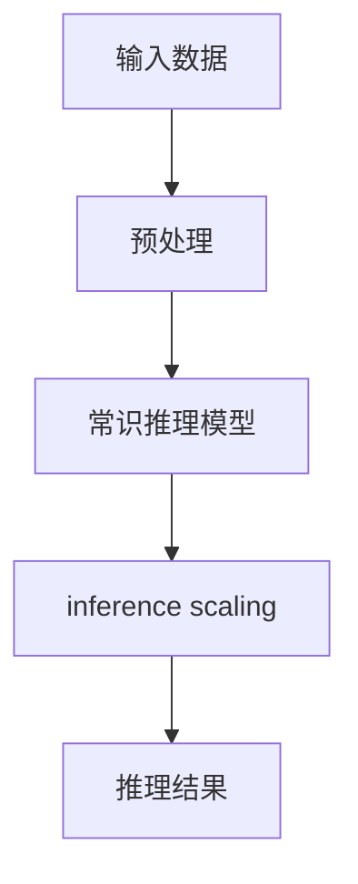

# 常识推理任务中inference scaling的有效性探讨

> 关键词：常识推理、inference scaling、有效性、算法原理、应用场景

> 摘要：本文围绕常识推理任务中inference scaling的有效性展开深入探讨。首先介绍了研究的背景、目的和预期读者等信息，接着阐述了核心概念及联系，详细讲解了核心算法原理和具体操作步骤，并给出相应的Python代码。通过数学模型和公式进一步剖析inference scaling在常识推理中的作用，结合项目实战案例展示其实际应用。分析了inference scaling在不同场景下的应用情况，推荐了相关的学习资源、开发工具框架和论文著作。最后总结了其未来发展趋势与挑战，解答了常见问题并提供扩展阅读和参考资料，旨在为相关领域的研究者和开发者提供全面而深入的技术指导。

## 1. 背景介绍 
### 1.1 目的和范围
常识推理在自然语言处理、人工智能等领域具有重要地位，它能够使机器像人类一样基于常识进行思考和决策。而inference scaling作为一种技术手段，旨在优化常识推理过程中的性能。本研究的目的在于深入探讨inference scaling在常识推理任务中的有效性，分析其在不同场景下的表现，确定其适用范围和局限性。具体范围涵盖了从理论原理的剖析到实际应用案例的研究，包括核心算法的实现、数学模型的建立以及实际项目中的开发和测试。

### 1.2 预期读者
本文预期读者包括人工智能、自然语言处理领域的研究者、开发者，对常识推理和inference scaling技术感兴趣的学生，以及相关行业中从事智能系统开发和优化的专业人士。这些读者希望通过本文深入了解inference scaling在常识推理中的作用，获取相关的技术知识和实践经验，为自己的研究和开发工作提供参考。

### 1.3 文档结构概述
本文将按照以下结构展开：首先介绍相关背景信息，包括研究目的、预期读者和文档结构。接着阐述核心概念与联系，通过文本示意图和Mermaid流程图直观展示。然后详细讲解核心算法原理和具体操作步骤，结合Python代码进行说明。之后建立数学模型和公式，举例说明其在常识推理中的应用。通过项目实战案例，展示开发环境搭建、源代码实现和代码解读。分析inference scaling的实际应用场景，推荐相关的学习资源、开发工具框架和论文著作。最后总结未来发展趋势与挑战，解答常见问题并提供扩展阅读和参考资料。

### 1.4 术语表
#### 1.4.1 核心术语定义
- **常识推理**：指机器根据普遍认可的常识知识进行推理和决策的能力，例如知道鸟通常会飞，火会产生热等基本常识，并利用这些知识解决问题。
- **inference scaling**：一种用于优化推理过程的技术，通过调整推理过程中的某些参数或策略，提高推理的效率、准确性或其他性能指标。
- **推理效率**：指在给定时间内完成推理任务的速度，通常用单位时间内完成的推理次数或推理任务的处理时间来衡量。
- **推理准确性**：指推理结果与实际情况的符合程度，通常用准确率、召回率等指标来衡量。

#### 1.4.2 相关概念解释
- **知识图谱**：一种以图形结构表示知识的方法，将实体和实体之间的关系以节点和边的形式存储，可用于常识推理中的知识表示和检索。
- **预训练模型**：在大规模数据上进行无监督学习得到的模型，可作为常识推理任务的基础模型，通过微调或其他方式应用于具体任务。

#### 1.4.3 缩略词列表
- **NLP**：Natural Language Processing，自然语言处理
- **ML**：Machine Learning，机器学习
- **DL**：Deep Learning，深度学习

## 2. 核心概念与联系 
### 核心概念原理
常识推理的核心在于让机器能够理解和运用常识知识进行推理。传统的推理方法往往基于规则或逻辑，而现代的常识推理则更多地依赖于机器学习和深度学习技术。inference scaling技术通过调整推理过程中的参数或策略，例如调整模型的输入输出规模、优化推理算法的复杂度等，来提高推理的性能。

例如，在一个基于知识图谱的常识推理系统中，inference scaling可以通过调整知识图谱的搜索范围或推理规则的应用顺序，减少不必要的计算，提高推理效率。同时，通过调整模型的参数，可以提高推理的准确性。

### 架构的文本示意图
以下是一个简单的常识推理系统中inference scaling的架构示意图：

```plaintext
输入数据（自然语言文本、知识图谱等）
    |
    | 预处理（分词、实体识别等）
    v
常识推理模型（预训练模型、规则引擎等）
    |
    | inference scaling（调整参数、优化算法等）
    v
推理结果（答案、决策等）
```

### Mermaid流程图


## 3. 核心算法原理 & 具体操作步骤 
### 核心算法原理
在常识推理任务中，inference scaling的核心算法原理主要基于对推理过程的优化。一种常见的方法是基于动态规划的思想，通过对推理步骤进行合理的规划和调整，减少不必要的计算。

例如，在一个基于规则的常识推理系统中，推理过程可以看作是一个规则应用的序列。inference scaling可以通过分析规则之间的依赖关系，确定最优的规则应用顺序，避免重复计算。

另一种方法是基于模型压缩和量化技术，通过减少模型的参数数量或降低参数的精度，提高推理的效率。例如，使用剪枝算法去除模型中不重要的参数，或者使用量化技术将参数从高精度表示转换为低精度表示。

### 具体操作步骤
以下是使用Python实现一个简单的基于规则的常识推理系统中inference scaling的示例代码：

```python
# 定义规则类
class Rule:
    def __init__(self, antecedent, consequent):
        self.antecedent = antecedent
        self.consequent = consequent

    def apply(self, facts):
        if all(fact in facts for fact in self.antecedent):
            return self.consequent
        return None

# 定义推理引擎类
class InferenceEngine:
    def __init__(self, rules):
        self.rules = rules

    def infer(self, facts):
        new_facts = set(facts)
        while True:
            old_facts = set(new_facts)
            for rule in self.rules:
                result = rule.apply(new_facts)
                if result is not None:
                    new_facts.add(result)
            if new_facts == old_facts:
                break
        return new_facts

# 定义inference scaling函数
def inference_scaling(rules, facts):
    # 简单的规则排序，根据规则的复杂度排序
    sorted_rules = sorted(rules, key=lambda rule: len(rule.antecedent))
    engine = InferenceEngine(sorted_rules)
    return engine.infer(facts)

# 示例规则和事实
rules = [
    Rule(['A', 'B'], 'C'),
    Rule(['C'], 'D'),
    Rule(['D'], 'E')
]
facts = {'A', 'B'}

# 进行推理
result = inference_scaling(rules, facts)
print("推理结果:", result)
```

### 代码解释
1. **Rule类**：表示一个推理规则，包含前提条件（antecedent）和结论（consequent）。`apply`方法用于检查前提条件是否满足，如果满足则返回结论。
2. **InferenceEngine类**：表示推理引擎，包含一组规则。`infer`方法用于进行推理，通过不断应用规则直到没有新的事实产生。
3. **inference_scaling函数**：对规则进行排序，根据规则的复杂度（前提条件的数量）进行排序，然后使用排序后的规则进行推理。
4. **示例规则和事实**：定义了一组规则和初始事实，调用`inference_scaling`函数进行推理，并输出结果。

## 4. 数学模型和公式 & 详细讲解 & 举例说明 
### 数学模型
在常识推理任务中，我们可以将推理过程看作是一个状态转移过程。设 $S$ 表示推理的状态空间，$s \in S$ 表示一个具体的状态，$R$ 表示推理规则集合，$r \in R$ 表示一个具体的规则。推理过程可以表示为一个状态转移函数 $f: S \times R \to S$，即给定一个状态 $s$ 和一个规则 $r$，通过应用规则 $r$ 得到一个新的状态 $f(s, r)$。

设 $F$ 表示初始事实集合，推理的目标是从初始状态 $s_0 = F$ 出发，通过不断应用规则，达到一个最终状态 $s_n$，使得 $s_n$ 包含我们需要的推理结果。

### 数学公式
设 $s_{i+1} = f(s_i, r_j)$ 表示在第 $i$ 步状态 $s_i$ 应用规则 $r_j$ 得到的新状态。推理过程可以表示为一个序列：

$$s_0, s_1, s_2, \cdots, s_n$$

其中 $s_0 = F$，$s_{i+1} = f(s_i, r_{j_i})$，$r_{j_i} \in R$。

### 详细讲解
在实际应用中，推理过程可能会遇到多种情况。例如，可能存在多个规则可以应用于同一个状态，这时需要选择一个最优的规则进行应用。inference scaling的作用就是通过调整规则的选择策略，优化推理过程。

例如，我们可以定义一个规则的优先级函数 $p: R \to \mathbb{R}$，表示每个规则的优先级。在选择规则时，优先选择优先级高的规则。设 $P(s)$ 表示在状态 $s$ 下可以应用的规则集合，则选择的规则 $r^*$ 可以表示为：

$$r^* = \arg\max_{r \in P(s)} p(r)$$

### 举例说明
假设我们有以下规则和初始事实：

规则：
- $r_1$: 如果 $A$ 和 $B$ 成立，则 $C$ 成立
- $r_2$: 如果 $C$ 成立，则 $D$ 成立
- $r_3$: 如果 $D$ 成立，则 $E$ 成立

初始事实：$F = \{A, B\}$

我们可以将状态空间 $S$ 定义为所有可能的事实集合，初始状态 $s_0 = F$。规则的优先级可以根据规则的复杂度定义，例如 $p(r_1) = 2$，$p(r_2) = 1$，$p(r_3) = 1$。

推理过程如下：
1. 在状态 $s_0 = \{A, B\}$ 下，可应用的规则集合 $P(s_0) = \{r_1\}$，选择规则 $r_1$ 应用，得到新状态 $s_1 = \{A, B, C\}$。
2. 在状态 $s_1 = \{A, B, C\}$ 下，可应用的规则集合 $P(s_1) = \{r_2\}$，选择规则 $r_2$ 应用，得到新状态 $s_2 = \{A, B, C, D\}$。
3. 在状态 $s_2 = \{A, B, C, D\}$ 下，可应用的规则集合 $P(s_2) = \{r_3\}$，选择规则 $r_3$ 应用，得到新状态 $s_3 = \{A, B, C, D, E\}$。

最终推理结果为 $s_3 = \{A, B, C, D, E\}$。

## 5. 项目实战：代码实际案例和详细解释说明 
### 5.1  开发环境搭建
为了实现一个基于深度学习的常识推理系统并应用inference scaling技术，我们可以使用Python和一些常用的深度学习框架，如PyTorch。以下是开发环境搭建的步骤：

1. **安装Python**：建议使用Python 3.7及以上版本，可以从Python官方网站（https://www.python.org/downloads/）下载安装包进行安装。
2. **安装PyTorch**：根据自己的操作系统和CUDA版本（如果使用GPU），从PyTorch官方网站（https://pytorch.org/get-started/locally/）选择合适的安装命令进行安装。例如，使用CPU版本的PyTorch可以使用以下命令：
```sh
pip install torch torchvision
```
3. **安装其他依赖库**：还需要安装一些其他的依赖库，如`transformers`用于处理预训练模型，`numpy`用于数值计算等。可以使用以下命令进行安装：
```sh
pip install transformers numpy
```

### 5.2  源代码详细实现和代码解读
以下是一个基于预训练模型（如BERT）的常识推理系统的示例代码，并应用了简单的inference scaling技术：

```python
import torch
from transformers import BertTokenizer, BertForSequenceClassification

# 加载预训练模型和分词器
tokenizer = BertTokenizer.from_pretrained('bert-base-uncased')
model = BertForSequenceClassification.from_pretrained('bert-base-uncased', num_labels=2)

# 定义推理函数
def infer(input_text, model, tokenizer):
    # 对输入文本进行分词和编码
    inputs = tokenizer(input_text, return_tensors='pt')
    # 进行推理
    outputs = model(**inputs)
    # 获取预测结果
    logits = outputs.logits
    predictions = torch.argmax(logits, dim=1)
    return predictions.item()

# 定义inference scaling函数
def inference_scaling(input_texts, model, tokenizer, batch_size=16):
    results = []
    for i in range(0, len(input_texts), batch_size):
        batch_texts = input_texts[i:i+batch_size]
        batch_results = []
        for text in batch_texts:
            result = infer(text, model, tokenizer)
            batch_results.append(result)
        results.extend(batch_results)
    return results

# 示例输入文本
input_texts = [
    "Birds can fly. So if there is a bird, it can fly.",
    "Fire is hot. If there is a fire, it will be hot."
]

# 进行推理
results = inference_scaling(input_texts, model, tokenizer)
print("推理结果:", results)
```

### 代码解读
1. **加载预训练模型和分词器**：使用`transformers`库加载BERT预训练模型和分词器。`BertForSequenceClassification`用于序列分类任务，这里我们设置分类标签数量为2。
2. **定义推理函数**：`infer`函数用于对单个输入文本进行推理。首先使用分词器对输入文本进行分词和编码，然后将编码后的输入传递给模型进行推理，最后获取预测结果。
3. **定义inference scaling函数**：`inference_scaling`函数用于对多个输入文本进行推理。通过将输入文本分成多个批次，逐批进行推理，提高推理效率。
4. **示例输入文本**：定义了两个示例输入文本，调用`inference_scaling`函数进行推理，并输出结果。

### 5.3  代码解读与分析
- **效率提升**：通过将输入文本分成多个批次进行推理，减少了单次推理的计算量，提高了推理效率。特别是在处理大量输入文本时，这种方法可以显著减少推理时间。
- **可扩展性**：代码结构清晰，易于扩展。可以通过修改`batch_size`参数来调整批次大小，也可以更换不同的预训练模型和分词器。
- **局限性**：该示例代码只是一个简单的实现，没有考虑更复杂的inference scaling技术，如模型压缩、量化等。在实际应用中，可能需要根据具体情况进行优化。

## 6. 实际应用场景 
### 智能客服
在智能客服系统中，常识推理和inference scaling技术可以帮助客服机器人更好地理解用户的问题，并快速给出准确的回答。例如，当用户询问“空调不制冷怎么办”时，客服机器人可以根据常识知识和推理规则，分析可能的原因（如制冷剂不足、压缩机故障等），并给出相应的解决方案。通过inference scaling技术，可以优化推理过程，提高客服机器人的响应速度和回答准确率。

### 自动驾驶
在自动驾驶领域，常识推理可以帮助车辆理解周围环境和其他交通参与者的行为。例如，当车辆遇到行人时，它可以根据常识知识判断行人的意图（如是否要过马路），并做出相应的决策（如减速、停车等）。inference scaling技术可以提高推理的效率，确保车辆在短时间内做出正确的决策，提高自动驾驶的安全性和可靠性。

### 智能教育
在智能教育系统中，常识推理可以帮助系统根据学生的学习情况和问题，提供个性化的学习建议和指导。例如，当学生在学习数学时遇到困难，系统可以根据常识知识和推理规则，分析学生的错误原因，并提供相应的辅导材料和练习。inference scaling技术可以优化推理过程，提高系统的响应速度和辅导效果。

### 金融风险评估
在金融领域，常识推理可以帮助评估机构对客户的信用风险和投资风险进行评估。例如，通过分析客户的个人信息、财务状况和市场情况，结合常识知识和推理规则，评估机构可以预测客户的违约概率和投资回报。inference scaling技术可以提高推理的效率，使评估机构能够快速处理大量的客户信息，做出准确的风险评估。

## 7. 工具和资源推荐
### 7.1 学习资源推荐
#### 7.1.1 书籍推荐
- 《人工智能：一种现代的方法》：这本书全面介绍了人工智能的各个领域，包括常识推理、机器学习、深度学习等，是人工智能领域的经典教材。
- 《自然语言处理入门》：详细介绍了自然语言处理的基本概念、算法和技术，对于理解常识推理在自然语言处理中的应用有很大帮助。
- 《深度学习》：由深度学习领域的三位顶尖专家撰写，系统地介绍了深度学习的理论和实践，对于掌握深度学习在常识推理中的应用有重要意义。

#### 7.1.2 在线课程
- Coursera上的“人工智能基础”课程：由斯坦福大学的教授授课，涵盖了人工智能的基本概念、算法和应用，包括常识推理的相关内容。
- edX上的“自然语言处理”课程：由华盛顿大学的教授授课，深入介绍了自然语言处理的各个方面，包括常识推理和预训练模型的应用。
- 吴恩达的“深度学习专项课程”：在Coursera上提供，系统地介绍了深度学习的各个领域，对于学习深度学习在常识推理中的应用非常有帮助。

#### 7.1.3 技术博客和网站
- Medium上的人工智能和自然语言处理相关博客：许多专家和研究者会在Medium上分享他们的最新研究成果和实践经验，对于了解常识推理和inference scaling的最新动态非常有帮助。
- arXiv.org：一个预印本平台，提供了大量的学术论文，包括常识推理和inference scaling领域的最新研究成果。
- Hugging Face的博客：Hugging Face是一个专注于自然语言处理的开源组织，他们的博客上经常分享一些关于预训练模型和常识推理的技术文章和实践案例。

### 7.2 开发工具框架推荐
#### 7.2.1 IDE和编辑器
- PyCharm：一款专门为Python开发设计的集成开发环境，提供了丰富的功能和插件，对于开发基于Python的常识推理系统非常方便。
- Jupyter Notebook：一个交互式的开发环境，可以实时运行代码、查看结果，并进行可视化展示，适合进行实验和数据分析。
- Visual Studio Code：一款轻量级的代码编辑器，支持多种编程语言和插件，对于快速开发和调试常识推理代码非常有用。

#### 7.2.2 调试和性能分析工具
- PyTorch Profiler：PyTorch提供的性能分析工具，可以帮助开发者分析模型的运行时间、内存使用等情况，优化模型的性能。
- TensorBoard：TensorFlow提供的可视化工具，也可以用于PyTorch模型的可视化和性能分析，帮助开发者更好地理解模型的训练过程和性能。
- cProfile：Python内置的性能分析工具，可以帮助开发者分析Python代码的运行时间和函数调用情况，找出性能瓶颈。

#### 7.2.3 相关框架和库
- Transformers：Hugging Face开发的一个开源库，提供了大量的预训练模型和工具，方便开发者进行自然语言处理任务，包括常识推理。
- AllenNLP：一个用于自然语言处理的深度学习框架，提供了丰富的模型和工具，支持常识推理任务的开发和实验。
- SpaCy：一个快速、高效的自然语言处理库，提供了多种语言的处理功能，对于预处理和特征提取非常有用。

### 7.3 相关论文著作推荐
#### 7.3.1 经典论文
- “Attention Is All You Need”：介绍了Transformer架构，是现代自然语言处理和深度学习领域的经典论文，为预训练模型的发展奠定了基础。
- “BERT: Pre-training of Deep Bidirectional Transformers for Language Understanding”：提出了BERT预训练模型，在自然语言处理任务中取得了显著的效果，对于常识推理也有重要的应用。
- “Commonsense Knowledge Base Completion with Neural Link Prediction”：研究了如何使用神经网络进行常识知识库的补全，对于常识推理中的知识表示和推理有重要的参考价值。

#### 7.3.2 最新研究成果
- 在ACL（Association for Computational Linguistics）、EMNLP（Conference on Empirical Methods in Natural Language Processing）等自然语言处理领域的顶级会议上，经常会有关于常识推理和inference scaling的最新研究成果发表。可以关注这些会议的论文集，了解最新的研究动态。
- arXiv.org上也会有很多关于常识推理和inference scaling的预印本论文，及时关注这些论文可以获取最新的研究思路和方法。

#### 7.3.3 应用案例分析
- 一些知名科技公司（如Google、Microsoft、Facebook等）会在他们的技术博客或研究报告中分享常识推理和inference scaling在实际应用中的案例分析。可以关注这些公司的官方网站，了解他们在相关领域的实践经验和成果。

## 8. 总结：未来发展趋势与挑战
### 未来发展趋势
- **多模态融合**：未来的常识推理系统将不仅仅依赖于文本信息，还会融合图像、语音等多模态信息，提高推理的准确性和全面性。例如，在自动驾驶领域，车辆可以结合摄像头图像、雷达数据和语音指令进行常识推理，做出更准确的决策。
- **强化学习与常识推理的结合**：强化学习可以通过与环境的交互不断优化推理策略，提高推理的效率和适应性。将强化学习与常识推理相结合，可以使系统在不同的场景下自动调整推理策略，实现更智能的决策。
- **大规模预训练模型的优化**：随着计算资源的不断增加，大规模预训练模型将继续发展。未来的研究将重点关注如何优化预训练模型的结构和训练方法，提高模型在常识推理任务中的性能。

### 挑战
- **常识知识的获取和表示**：常识知识具有多样性和复杂性，如何有效地获取和表示常识知识是一个挑战。目前的知识图谱虽然可以表示一部分常识知识，但仍然存在覆盖范围有限、知识更新不及时等问题。
- **推理效率和准确性的平衡**：在实际应用中，需要在推理效率和准确性之间找到一个平衡点。提高推理效率可能会牺牲一定的准确性，而提高准确性可能会增加推理的时间和计算成本。如何通过inference scaling等技术实现两者的平衡是一个亟待解决的问题。
- **可解释性和可信赖性**：随着人工智能系统在越来越多的关键领域得到应用，系统的可解释性和可信赖性变得越来越重要。在常识推理中，如何解释推理结果的合理性和可靠性，以及如何避免系统出现错误和偏见，是需要解决的挑战。

## 9. 附录：常见问题与解答
### 问题1：inference scaling技术是否适用于所有的常识推理任务？
解答：不是的。inference scaling技术的有效性取决于具体的任务和数据集。对于一些简单的常识推理任务，可能不需要使用inference scaling技术就可以达到较好的性能。而对于一些复杂的任务，如涉及大量知识和复杂推理的任务，inference scaling技术可能会有更明显的效果。此外，不同的inference scaling技术也适用于不同的场景，需要根据具体情况进行选择和调整。

### 问题2：如何评估inference scaling技术在常识推理任务中的有效性？
解答：可以从多个方面评估inference scaling技术的有效性。首先是推理效率，如推理时间、吞吐量等指标，可以通过实验对比使用和不使用inference scaling技术时的推理效率。其次是推理准确性，如准确率、召回率等指标，可以使用测试数据集评估推理结果的准确性。此外，还可以考虑模型的资源占用情况，如内存使用、计算资源消耗等。

### 问题3：在实际应用中，如何选择合适的inference scaling技术？
解答：选择合适的inference scaling技术需要考虑多个因素。首先是任务的特点，如推理的复杂度、数据的规模等。如果推理任务比较简单，可以选择一些轻量级的inference scaling技术；如果任务比较复杂，可以考虑使用更高级的技术，如模型压缩、量化等。其次是计算资源的限制，如果计算资源有限，可以选择一些能够减少模型参数和计算量的技术。此外，还可以参考相关的研究成果和实践经验，选择在类似任务中表现较好的技术。

### 问题4：inference scaling技术是否会影响模型的可解释性？
解答：这取决于具体的inference scaling技术。一些技术，如规则排序、批次推理等，通常不会对模型的可解释性产生太大影响。而一些模型压缩和量化技术，可能会改变模型的结构和参数，从而对模型的可解释性产生一定的影响。在使用这些技术时，需要注意保留模型的可解释性，例如可以通过可视化等方法帮助理解模型的推理过程。

## 10. 扩展阅读 & 参考资料
### 扩展阅读
- 《知识图谱：方法、实践与应用》：深入介绍了知识图谱的构建、推理和应用，对于理解常识推理中的知识表示和推理有重要的参考价值。
- 《人工智能时代的认知升级》：探讨了人工智能在各个领域的应用和发展趋势，以及如何提升人类的认知能力以适应人工智能时代的挑战。
- 《智能时代》：介绍了智能技术的发展历程和应用场景，对于了解常识推理和inference scaling技术在智能时代的重要性有一定的帮助。

### 参考资料
- Hugging Face官方文档：https://huggingface.co/docs
- PyTorch官方文档：https://pytorch.org/docs/stable/index.html
- 相关学术论文和研究报告：可以从ACM Digital Library、IEEE Xplore等学术数据库中获取。

作者：AI天才研究院/AI Genius Institute & 禅与计算机程序设计艺术 /Zen And The Art of Computer Programming