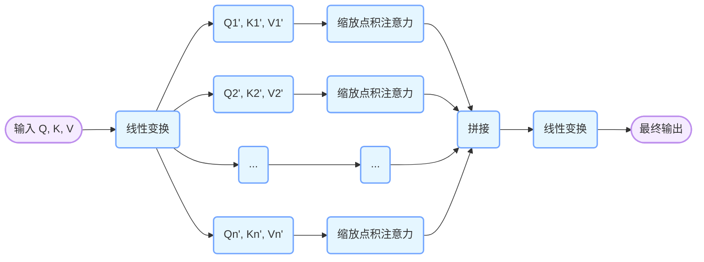

# 并行推理任务中多头注意力机制的效率优化

> 关键词：并行推理、多头注意力机制、效率优化、Transformer、深度学习

> 摘要：本文聚焦于并行推理任务中多头注意力机制的效率优化问题。首先介绍了相关背景，包括研究目的、预期读者、文档结构和术语表。接着深入剖析了多头注意力机制的核心概念、原理及架构，并用Mermaid流程图直观展示。详细阐述了核心算法原理，给出Python源代码示例，同时讲解了相关数学模型和公式，并举例说明。通过项目实战，从开发环境搭建、源代码实现到代码解读与分析，全面呈现了优化过程。探讨了多头注意力机制在实际中的应用场景，推荐了学习资源、开发工具框架以及相关论文著作。最后总结了未来发展趋势与挑战，提供了常见问题解答和扩展阅读参考资料，旨在为相关领域的研究者和开发者提供全面且深入的技术指导。

## 1. 背景介绍 
### 1.1 目的和范围
在当今深度学习领域，Transformer架构凭借其强大的序列建模能力，在自然语言处理、计算机视觉等诸多任务中取得了显著成果。多头注意力机制作为Transformer架构的核心组件，在处理长序列数据时表现出色。然而，随着模型规模的不断增大和数据量的急剧增加，多头注意力机制在并行推理任务中的效率问题逐渐凸显，成为限制模型性能和应用范围的关键因素。

本文的目的在于深入研究并行推理任务中多头注意力机制的效率优化方法，通过理论分析、算法设计和实践验证，探索提高其计算效率和资源利用率的有效途径。具体范围涵盖多头注意力机制的核心原理、算法优化策略、数学模型分析、项目实战以及实际应用场景等方面。

### 1.2 预期读者
本文主要面向深度学习领域的研究者、开发者以及对并行计算和Transformer架构感兴趣的技术人员。对于正在从事自然语言处理、计算机视觉等相关任务，且希望优化模型推理效率的读者，本文将提供有价值的技术参考和实践指导。同时，对于刚接触深度学习的初学者，也可以通过本文了解多头注意力机制的基本原理和效率优化的重要性。

### 1.3 文档结构概述
本文将按照以下结构展开：
1. **背景介绍**：阐述研究目的、预期读者、文档结构和术语表。
2. **核心概念与联系**：详细介绍多头注意力机制的核心概念、原理和架构，并用Mermaid流程图进行直观展示。
3. **核心算法原理 & 具体操作步骤**：深入讲解多头注意力机制的核心算法原理，给出Python源代码示例，并详细说明具体操作步骤。
4. **数学模型和公式 & 详细讲解 & 举例说明**：介绍相关数学模型和公式，对其进行详细讲解，并通过具体例子进行说明。
5. **项目实战：代码实际案例和详细解释说明**：从开发环境搭建、源代码实现到代码解读与分析，全面呈现多头注意力机制效率优化的项目实战过程。
6. **实际应用场景**：探讨多头注意力机制在自然语言处理、计算机视觉等领域的实际应用场景。
7. **工具和资源推荐**：推荐学习资源、开发工具框架以及相关论文著作。
8. **总结：未来发展趋势与挑战**：总结多头注意力机制效率优化的未来发展趋势和面临的挑战。
9. **附录：常见问题与解答**：提供常见问题的解答，帮助读者更好地理解和应用本文内容。
10. **扩展阅读 & 参考资料**：列出扩展阅读的相关资料和参考文献，方便读者进一步深入研究。

### 1.4 术语表
#### 1.4.1 核心术语定义
- **多头注意力机制（Multi-Head Attention Mechanism）**：Transformer架构中的核心组件，通过多个注意力头并行计算，捕捉输入序列中不同位置之间的依赖关系。
- **并行推理（Parallel Inference）**：在多个计算单元（如GPU、TPU等）上同时进行模型推理，以提高推理效率。
- **Transformer**：一种基于注意力机制的深度学习架构，广泛应用于自然语言处理、计算机视觉等领域。
- **注意力分数（Attention Scores）**：衡量输入序列中不同位置之间相关性的数值。
- **掩码（Masking）**：在注意力计算中，用于屏蔽某些位置的操作，避免无效计算。

#### 1.4.2 相关概念解释
- **自注意力（Self-Attention）**：多头注意力机制的一种特殊形式，用于捕捉输入序列自身不同位置之间的依赖关系。
- **缩放点积注意力（Scaled Dot-Product Attention）**：一种常见的注意力计算方式，通过计算查询（Query）、键（Key）和值（Value）之间的点积来得到注意力分数。
- **残差连接（Residual Connection）**：在神经网络中，将输入直接加到输出上，有助于缓解梯度消失问题，提高模型的训练稳定性。

#### 1.4.3 缩略词列表
- **GPU（Graphics Processing Unit）**：图形处理器，常用于加速深度学习模型的训练和推理。
- **TPU（Tensor Processing Unit）**：张量处理器，是专门为深度学习设计的硬件加速器。
- **Q（Query）**：查询向量，用于计算注意力分数。
- **K（Key）**：键向量，与查询向量进行点积运算。
- **V（Value）**：值向量，根据注意力分数进行加权求和得到输出。

## 2. 核心概念与联系 
### 核心概念原理
多头注意力机制是Transformer架构的核心创新之一，其核心思想是通过多个注意力头并行计算，让模型能够在不同的表示子空间中捕捉输入序列中不同位置之间的依赖关系。具体来说，多头注意力机制将输入的查询（Query）、键（Key）和值（Value）分别通过不同的线性变换投影到多个低维子空间中，每个子空间对应一个注意力头。然后，在每个注意力头中独立计算注意力分数，并根据这些分数对值进行加权求和，最后将所有注意力头的输出拼接起来，再通过一个线性变换得到最终的输出。

### 架构的文本示意图
```plaintext
输入：Query (Q), Key (K), Value (V)
|
|-- 线性变换（多个） --> 多个低维子空间的 Q', K', V'
|
|-- 每个子空间计算缩放点积注意力 --> 多个注意力头输出
|
|-- 拼接所有注意力头输出
|
|-- 线性变换 --> 最终输出
```

### Mermaid流程图


## 3. 核心算法原理 & 具体操作步骤 
### 核心算法原理
多头注意力机制的核心是缩放点积注意力（Scaled Dot-Product Attention），其计算公式如下：
$$
\text{Attention}(Q, K, V) = \text{softmax}\left(\frac{QK^T}{\sqrt{d_k}}\right)V
$$
其中，$Q$ 是查询矩阵，$K$ 是键矩阵，$V$ 是值矩阵，$d_k$ 是键向量的维度。$\frac{QK^T}{\sqrt{d_k}}$ 用于计算注意力分数，通过除以 $\sqrt{d_k}$ 来缩放点积，避免点积值过大导致 softmax 函数的梯度消失。最后，使用 softmax 函数将注意力分数归一化，得到注意力分布，并根据该分布对值矩阵 $V$ 进行加权求和，得到注意力输出。

多头注意力机制则是在多个注意力头中并行计算缩放点积注意力，然后将所有注意力头的输出拼接起来，再通过一个线性变换得到最终的输出。其计算公式如下：
$$
\text{MultiHead}(Q, K, V) = \text{Concat}(\text{head}_1, \text{head}_2, \ldots, \text{head}_h)W^O
$$
其中，$\text{head}_i = \text{Attention}(QW_i^Q, KW_i^K, VW_i^V)$，$h$ 是注意力头的数量，$W_i^Q$、$W_i^K$、$W_i^V$ 是每个注意力头的线性变换矩阵，$W^O$ 是用于拼接后输出的线性变换矩阵。

### 具体操作步骤
1. **线性变换**：将输入的查询 $Q$、键 $K$ 和值 $V$ 分别通过多个线性变换矩阵 $W_i^Q$、$W_i^K$、$W_i^V$ 投影到多个低维子空间中，得到每个注意力头的查询 $Q_i'$、键 $K_i'$ 和值 $V_i'$。
2. **缩放点积注意力计算**：在每个注意力头中，根据缩放点积注意力公式计算注意力分数，并对值进行加权求和，得到每个注意力头的输出 $\text{head}_i$。
3. **拼接**：将所有注意力头的输出 $\text{head}_i$ 拼接起来。
4. **最终线性变换**：将拼接后的输出通过线性变换矩阵 $W^O$ 进行变换，得到最终的多头注意力输出。

### Python源代码示例
```python
import torch
import torch.nn as nn

class MultiHeadAttention(nn.Module):
    def __init__(self, input_dim, num_heads):
        super(MultiHeadAttention, self).__init__()
        self.input_dim = input_dim
        self.num_heads = num_heads
        self.head_dim = input_dim // num_heads

        # 定义线性变换矩阵
        self.W_q = nn.Linear(input_dim, input_dim)
        self.W_k = nn.Linear(input_dim, input_dim)
        self.W_v = nn.Linear(input_dim, input_dim)
        self.W_o = nn.Linear(input_dim, input_dim)

    def forward(self, Q, K, V, mask=None):
        batch_size = Q.size(0)

        # 线性变换
        Q = self.W_q(Q)
        K = self.W_k(K)
        V = self.W_v(V)

        # 分割成多个注意力头
        Q = Q.view(batch_size, -1, self.num_heads, self.head_dim).transpose(1, 2)
        K = K.view(batch_size, -1, self.num_heads, self.head_dim).transpose(1, 2)
        V = V.view(batch_size, -1, self.num_heads, self.head_dim).transpose(1, 2)

        # 计算注意力分数
        attn_scores = torch.matmul(Q, K.transpose(-2, -1)) / torch.sqrt(torch.tensor(self.head_dim, dtype=torch.float32))

        # 应用掩码
        if mask is not None:
            attn_scores = attn_scores.masked_fill(mask == 0, -1e9)

        # 计算注意力分布
        attn_dist = torch.softmax(attn_scores, dim=-1)

        # 加权求和
        attn_output = torch.matmul(attn_dist, V)

        # 拼接注意力头
        attn_output = attn_output.transpose(1, 2).contiguous().view(batch_size, -1, self.input_dim)

        # 最终线性变换
        output = self.W_o(attn_output)

        return output

# 示例使用
input_dim = 512
num_heads = 8
batch_size = 32
seq_len = 10

Q = torch.randn(batch_size, seq_len, input_dim)
K = torch.randn(batch_size, seq_len, input_dim)
V = torch.randn(batch_size, seq_len, input_dim)

multihead_attn = MultiHeadAttention(input_dim, num_heads)
output = multihead_attn(Q, K, V)
print(output.shape)  # 输出形状应为 (batch_size, seq_len, input_dim)
```

## 4. 数学模型和公式 & 详细讲解 & 举例说明 
### 缩放点积注意力公式
$$
\text{Attention}(Q, K, V) = \text{softmax}\left(\frac{QK^T}{\sqrt{d_k}}\right)V
$$
详细讲解：
- $Q$ 是查询矩阵，形状为 $(n, d_k)$，其中 $n$ 是查询序列的长度，$d_k$ 是键向量的维度。
- $K$ 是键矩阵，形状为 $(m, d_k)$，其中 $m$ 是键序列的长度。
- $V$ 是值矩阵，形状为 $(m, d_v)$，其中 $d_v$ 是值向量的维度。
- $QK^T$ 的形状为 $(n, m)$，表示查询序列中每个位置与键序列中每个位置之间的点积。
- $\frac{QK^T}{\sqrt{d_k}}$ 是对 $QK^T$ 进行缩放，避免点积值过大导致 softmax 函数的梯度消失。
- $\text{softmax}\left(\frac{QK^T}{\sqrt{d_k}}\right)$ 是对缩放后的点积进行 softmax 操作，得到注意力分布，形状为 $(n, m)$。
- 最后，将注意力分布与值矩阵 $V$ 相乘，得到注意力输出，形状为 $(n, d_v)$。

举例说明：
假设 $Q = \begin{bmatrix} 1 & 2 \\ 3 & 4 \end{bmatrix}$，$K = \begin{bmatrix} 5 & 6 \\ 7 & 8 \end{bmatrix}$，$V = \begin{bmatrix} 9 & 10 \\ 11 & 12 \end{bmatrix}$，$d_k = 2$。
首先计算 $QK^T$：
$$
QK^T = \begin{bmatrix} 1 & 2 \\ 3 & 4 \end{bmatrix} \begin{bmatrix} 5 & 7 \\ 6 & 8 \end{bmatrix} = \begin{bmatrix} 1\times5 + 2\times6 & 1\times7 + 2\times8 \\ 3\times5 + 4\times6 & 3\times7 + 4\times8 \end{bmatrix} = \begin{bmatrix} 17 & 23 \\ 39 & 53 \end{bmatrix}
$$
然后进行缩放：
$$
\frac{QK^T}{\sqrt{d_k}} = \frac{1}{\sqrt{2}} \begin{bmatrix} 17 & 23 \\ 39 & 53 \end{bmatrix} \approx \begin{bmatrix} 12.02 & 16.26 \\ 27.58 & 37.43 \end{bmatrix}
$$
接着计算 softmax：
$$
\text{softmax}\left(\frac{QK^T}{\sqrt{d_k}}\right) = \begin{bmatrix} \frac{e^{12.02}}{e^{12.02} + e^{16.26}} & \frac{e^{16.26}}{e^{12.02} + e^{16.26}} \\ \frac{e^{27.58}}{e^{27.58} + e^{37.43}} & \frac{e^{37.43}}{e^{27.58} + e^{37.43}} \end{bmatrix} \approx \begin{bmatrix} 0.01 & 0.99 \\ 0.00 & 1.00 \end{bmatrix}
$$
最后计算注意力输出：
$$
\text{Attention}(Q, K, V) = \text{softmax}\left(\frac{QK^T}{\sqrt{d_k}}\right)V = \begin{bmatrix} 0.01 & 0.99 \\ 0.00 & 1.00 \end{bmatrix} \begin{bmatrix} 9 & 10 \\ 11 & 12 \end{bmatrix} \approx \begin{bmatrix} 10.98 & 11.98 \\ 11.00 & 12.00 \end{bmatrix}
$$

### 多头注意力公式
$$
\text{MultiHead}(Q, K, V) = \text{Concat}(\text{head}_1, \text{head}_2, \ldots, \text{head}_h)W^O
$$
详细讲解：
- $\text{head}_i = \text{Attention}(QW_i^Q, KW_i^K, VW_i^V)$，表示第 $i$ 个注意力头的输出。
- $\text{Concat}(\text{head}_1, \text{head}_2, \ldots, \text{head}_h)$ 是将所有注意力头的输出拼接起来。
- $W^O$ 是用于拼接后输出的线性变换矩阵，形状为 $(h\times d_v, d_{out})$，其中 $d_{out}$ 是最终输出的维度。

举例说明：
假设 $h = 2$，$d_v = 2$，$d_{out} = 4$，$\text{head}_1 = \begin{bmatrix} 1 & 2 \\ 3 & 4 \end{bmatrix}$，$\text{head}_2 = \begin{bmatrix} 5 & 6 \\ 7 & 8 \end{bmatrix}$，$W^O = \begin{bmatrix} 1 & 2 & 3 & 4 \\ 5 & 6 & 7 & 8 \\ 9 & 10 & 11 & 12 \\ 13 & 14 & 15 & 16 \end{bmatrix}$。
首先进行拼接：
$$
\text{Concat}(\text{head}_1, \text{head}_2) = \begin{bmatrix} 1 & 2 & 5 & 6 \\ 3 & 4 & 7 & 8 \end{bmatrix}
$$
然后进行线性变换：
$$
\text{MultiHead}(Q, K, V) = \text{Concat}(\text{head}_1, \text{head}_2)W^O = \begin{bmatrix} 1 & 2 & 5 & 6 \\ 3 & 4 & 7 & 8 \end{bmatrix} \begin{bmatrix} 1 & 2 & 3 & 4 \\ 5 & 6 & 7 & 8 \\ 9 & 10 & 11 & 12 \\ 13 & 14 & 15 & 16 \end{bmatrix} = \begin{bmatrix} 126 & 140 & 154 & 168 \\ 202 & 228 & 254 & 280 \end{bmatrix}
$$

## 5. 项目实战：代码实际案例和详细解释说明 
### 5.1  开发环境搭建
为了实现并行推理任务中多头注意力机制的效率优化，我们需要搭建相应的开发环境。以下是具体步骤：

#### 安装Python
首先，确保你已经安装了Python 3.6及以上版本。你可以从Python官方网站（https://www.python.org/downloads/）下载并安装适合你操作系统的Python版本。

#### 安装深度学习框架
我们使用PyTorch作为深度学习框架，因为它提供了丰富的工具和函数，方便我们实现多头注意力机制。可以使用以下命令安装PyTorch：
```bash
pip install torch torchvision
```
根据你的CUDA版本和操作系统，你可能需要调整安装命令。具体安装指南可以参考PyTorch官方网站（https://pytorch.org/get-started/locally/）。

#### 安装其他依赖库
除了PyTorch，我们还需要安装一些其他的依赖库，如NumPy、Matplotlib等。可以使用以下命令安装：
```bash
pip install numpy matplotlib
```

### 5.2  源代码详细实现和代码解读
以下是一个完整的项目实战代码示例，包括多头注意力机制的实现和效率优化：

```python
import torch
import torch.nn as nn
import torch.nn.functional as F
import time

# 定义多头注意力机制类
class MultiHeadAttention(nn.Module):
    def __init__(self, input_dim, num_heads):
        super(MultiHeadAttention, self).__init__()
        self.input_dim = input_dim
        self.num_heads = num_heads
        self.head_dim = input_dim // num_heads

        # 定义线性变换矩阵
        self.W_q = nn.Linear(input_dim, input_dim)
        self.W_k = nn.Linear(input_dim, input_dim)
        self.W_v = nn.Linear(input_dim, input_dim)
        self.W_o = nn.Linear(input_dim, input_dim)

    def forward(self, Q, K, V, mask=None):
        batch_size = Q.size(0)

        # 线性变换
        Q = self.W_q(Q)
        K = self.W_k(K)
        V = self.W_v(V)

        # 分割成多个注意力头
        Q = Q.view(batch_size, -1, self.num_heads, self.head_dim).transpose(1, 2)
        K = K.view(batch_size, -1, self.num_heads, self.head_dim).transpose(1, 2)
        V = V.view(batch_size, -1, self.num_heads, self.head_dim).transpose(1, 2)

        # 计算注意力分数
        attn_scores = torch.matmul(Q, K.transpose(-2, -1)) / torch.sqrt(torch.tensor(self.head_dim, dtype=torch.float32))

        # 应用掩码
        if mask is not None:
            attn_scores = attn_scores.masked_fill(mask == 0, -1e9)

        # 计算注意力分布
        attn_dist = torch.softmax(attn_scores, dim=-1)

        # 加权求和
        attn_output = torch.matmul(attn_dist, V)

        # 拼接注意力头
        attn_output = attn_output.transpose(1, 2).contiguous().view(batch_size, -1, self.input_dim)

        # 最终线性变换
        output = self.W_o(attn_output)

        return output

# 定义一个简单的Transformer编码器层
class TransformerEncoderLayer(nn.Module):
    def __init__(self, input_dim, num_heads, dropout=0.1):
        super(TransformerEncoderLayer, self).__init__()
        self.self_attn = MultiHeadAttention(input_dim, num_heads)
        self.feed_forward = nn.Sequential(
            nn.Linear(input_dim, 4 * input_dim),
            nn.ReLU(),
            nn.Linear(4 * input_dim, input_dim)
        )
        self.norm1 = nn.LayerNorm(input_dim)
        self.norm2 = nn.LayerNorm(input_dim)
        self.dropout = nn.Dropout(dropout)

    def forward(self, x, mask=None):
        # 自注意力计算
        attn_output = self.self_attn(x, x, x, mask)
        x = self.norm1(x + self.dropout(attn_output))

        # 前馈网络计算
        ff_output = self.feed_forward(x)
        x = self.norm2(x + self.dropout(ff_output))

        return x

# 定义一个简单的Transformer编码器
class TransformerEncoder(nn.Module):
    def __init__(self, input_dim, num_heads, num_layers, dropout=0.1):
        super(TransformerEncoder, self).__init__()
        self.layers = nn.ModuleList([
            TransformerEncoderLayer(input_dim, num_heads, dropout) for _ in range(num_layers)
        ])

    def forward(self, x, mask=None):
        for layer in self.layers:
            x = layer(x, mask)
        return x

# 效率优化测试
def efficiency_test():
    input_dim = 512
    num_heads = 8
    num_layers = 6
    batch_size = 32
    seq_len = 10

    # 初始化模型
    encoder = TransformerEncoder(input_dim, num_heads, num_layers)
    encoder = encoder.cuda()  # 移动到GPU上

    # 生成输入数据
    x = torch.randn(batch_size, seq_len, input_dim).cuda()
    mask = torch.ones(batch_size, 1, seq_len, seq_len).cuda()

    # 预热
    for _ in range(10):
        _ = encoder(x, mask)

    # 计时
    start_time = time.time()
    for _ in range(100):
        _ = encoder(x, mask)
    end_time = time.time()

    # 计算推理时间
    inference_time = end_time - start_time
    print(f"推理100次的总时间: {inference_time:.4f} 秒")
    print(f"每次推理的平均时间: {inference_time / 100:.4f} 秒")

if __name__ == "__main__":
    efficiency_test()
```

### 代码解读与分析
#### 多头注意力机制类（MultiHeadAttention）
- `__init__` 方法：初始化多头注意力机制的参数，包括输入维度、注意力头数量、线性变换矩阵等。
- `forward` 方法：实现多头注意力机制的前向传播过程，包括线性变换、注意力分数计算、掩码应用、注意力分布计算、加权求和、注意力头拼接和最终线性变换等步骤。

#### Transformer编码器层类（TransformerEncoderLayer）
- `__init__` 方法：初始化Transformer编码器层的参数，包括多头注意力机制、前馈网络、层归一化和 dropout 层等。
- `forward` 方法：实现Transformer编码器层的前向传播过程，包括自注意力计算、残差连接、前馈网络计算和残差连接等步骤。

#### Transformer编码器类（TransformerEncoder）
- `__init__` 方法：初始化Transformer编码器的参数，包括多个Transformer编码器层。
- `forward` 方法：实现Transformer编码器的前向传播过程，依次调用每个Transformer编码器层。

#### 效率优化测试函数（efficiency_test）
- 初始化模型和输入数据，并将其移动到GPU上。
- 进行预热，让GPU达到稳定状态。
- 计时并进行100次推理，计算总推理时间和平均推理时间。

通过以上代码和解读，我们可以看到如何实现多头注意力机制和Transformer编码器，并进行效率优化测试。

## 6. 实际应用场景 
多头注意力机制在多个领域都有广泛的实际应用，以下是一些常见的应用场景：

### 自然语言处理
- **机器翻译**：在机器翻译任务中，多头注意力机制可以捕捉源语言和目标语言之间的语义依赖关系，帮助模型更好地理解和生成翻译结果。例如，在Transformer架构的机器翻译模型中，多头注意力机制可以同时关注输入句子的不同部分，提高翻译的准确性和流畅性。
- **文本生成**：在文本生成任务中，如故事生成、对话系统等，多头注意力机制可以根据上下文信息生成合理的文本内容。通过捕捉输入文本中不同位置之间的依赖关系，模型可以生成更连贯、更有逻辑性的文本。
- **文本分类**：在文本分类任务中，多头注意力机制可以帮助模型聚焦于文本中的关键信息，提高分类的准确性。例如，在情感分析任务中，模型可以通过多头注意力机制关注文本中的情感关键词，从而更准确地判断文本的情感倾向。

### 计算机视觉
- **图像分类**：在图像分类任务中，多头注意力机制可以帮助模型关注图像中的重要区域，提高分类的准确性。例如，在卷积神经网络（CNN）中引入多头注意力机制，可以让模型自动学习图像中不同区域的重要性，从而更有效地提取图像特征。
- **目标检测**：在目标检测任务中，多头注意力机制可以帮助模型更好地定位和识别目标物体。通过捕捉图像中不同位置之间的空间依赖关系，模型可以更准确地检测出目标物体的位置和类别。
- **图像生成**：在图像生成任务中，如生成对抗网络（GAN）、变分自编码器（VAE）等，多头注意力机制可以帮助模型生成更逼真、更清晰的图像。通过关注图像中的不同部分，模型可以生成更符合真实图像分布的图像。

### 语音识别
- **语音识别**：在语音识别任务中，多头注意力机制可以帮助模型捕捉语音信号中的时序依赖关系，提高识别的准确性。例如，在循环神经网络（RNN）或长短时记忆网络（LSTM）中引入多头注意力机制，可以让模型更好地处理长序列语音信号，从而提高语音识别的性能。

### 推荐系统
- **推荐系统**：在推荐系统中，多头注意力机制可以帮助模型捕捉用户和物品之间的复杂关系，提高推荐的准确性和个性化程度。例如，通过将用户的历史行为和物品的特征作为输入，多头注意力机制可以学习到用户对不同物品的偏好，从而为用户推荐更符合其兴趣的物品。

## 7. 工具和资源推荐
### 7.1 学习资源推荐
#### 7.1.1 书籍推荐
- 《深度学习》（Deep Learning）：由Ian Goodfellow、Yoshua Bengio和Aaron Courville所著，是深度学习领域的经典教材，涵盖了深度学习的基本概念、算法和应用。
- 《动手学深度学习》（Dive into Deep Learning）：由李沐等人所著，是一本开源的深度学习教材，提供了丰富的代码示例和实践项目，适合初学者入门。
- 《Python深度学习》（Deep Learning with Python）：由Francois Chollet所著，介绍了如何使用Python和Keras库进行深度学习开发，内容包括神经网络、卷积神经网络、循环神经网络等。

#### 7.1.2 在线课程
- Coursera上的“深度学习专项课程”（Deep Learning Specialization）：由Andrew Ng教授授课，包括五门课程，全面介绍了深度学习的理论和实践。
- edX上的“强化学习基础”（Foundations of Reinforcement Learning）：由Pieter Abbeel教授授课，介绍了强化学习的基本概念、算法和应用。
- 吴恩达的“机器学习”课程：是一门经典的机器学习课程，介绍了机器学习的基本概念、算法和应用，为深度学习的学习打下坚实的基础。

#### 7.1.3 技术博客和网站
- Medium：是一个技术博客平台，有许多深度学习领域的专家和开发者分享他们的经验和见解。
- arXiv：是一个预印本服务器，提供了大量的深度学习研究论文，方便读者了解最新的研究动态。
- Kaggle：是一个数据科学竞赛平台，提供了丰富的数据集和代码示例，适合读者进行实践和学习。

### 7.2 开发工具框架推荐
#### 7.2.1 IDE和编辑器
- PyCharm：是一款专业的Python集成开发环境（IDE），提供了丰富的代码编辑、调试和分析功能，适合深度学习开发。
- Jupyter Notebook：是一个交互式的笔记本环境，方便用户进行代码编写、数据可视化和实验记录，是深度学习研究和开发的常用工具。
- Visual Studio Code：是一款轻量级的代码编辑器，支持多种编程语言和插件，具有丰富的扩展功能，适合快速开发和调试。

#### 7.2.2 调试和性能分析工具
- PyTorch Profiler：是PyTorch官方提供的性能分析工具，可以帮助用户分析模型的运行时间、内存使用情况等，找出性能瓶颈。
- TensorBoard：是TensorFlow官方提供的可视化工具，也可以与PyTorch结合使用，用于可视化模型的训练过程、损失曲线、准确率等。
- NVIDIA Nsight Systems：是NVIDIA提供的性能分析工具，专门用于分析GPU上的程序性能，可以帮助用户优化深度学习模型的GPU利用率。

#### 7.2.3 相关框架和库
- PyTorch：是一个开源的深度学习框架，提供了丰富的工具和函数，方便用户实现各种深度学习模型，具有动态图、易于调试等优点。
- TensorFlow：是另一个广泛使用的开源深度学习框架，提供了强大的分布式训练和部署功能，适用于大规模深度学习应用。
- Hugging Face Transformers：是一个开源的自然语言处理库，提供了预训练的Transformer模型和工具，方便用户进行自然语言处理任务的开发。

### 7.3 相关论文著作推荐
#### 7.3.1 经典论文
- “Attention Is All You Need”：提出了Transformer架构和多头注意力机制，是深度学习领域的经典论文之一。
- “Neural Machine Translation by Jointly Learning to Align and Translate”：提出了注意力机制在机器翻译中的应用，为后续的研究奠定了基础。
- “ImageNet Classification with Deep Convolutional Neural Networks”：提出了AlexNet卷积神经网络，开启了深度学习在计算机视觉领域的应用热潮。

#### 7.3.2 最新研究成果
- 关注arXiv上的最新研究论文，了解多头注意力机制在不同领域的最新应用和优化方法。
- 参加相关的学术会议，如NeurIPS、ICML、CVPR等，听取最新的研究报告和成果分享。

#### 7.3.3 应用案例分析
- 阅读相关的技术博客和开源项目，了解多头注意力机制在实际应用中的具体实现和优化策略。
- 参考一些知名的开源项目，如BERT、GPT等，学习它们在多头注意力机制的应用和优化方面的经验。

## 8. 总结：未来发展趋势与挑战
### 未来发展趋势
- **模型架构创新**：未来可能会出现更多基于多头注意力机制的创新模型架构，进一步提高模型的性能和效率。例如，通过改进注意力计算方式、引入新的注意力机制等，来提升模型的表达能力和计算效率。
- **多模态融合**：随着深度学习在多个领域的应用，多模态融合将成为一个重要的发展趋势。多头注意力机制可以帮助模型更好地处理不同模态的数据，如文本、图像、语音等，实现更强大的多模态交互和理解。
- **硬件优化**：随着硬件技术的不断发展，如GPU、TPU等硬件加速器的性能不断提升，将为多头注意力机制的效率优化提供更多的可能性。未来可能会出现专门针对多头注意力机制设计的硬件架构，进一步提高其计算效率。
- **应用拓展**：多头注意力机制将在更多领域得到应用，如医疗、金融、交通等。通过结合不同领域的专业知识和数据，多头注意力机制可以帮助解决更多实际问题，创造更大的价值。

### 挑战
- **计算资源需求大**：多头注意力机制的计算复杂度较高，尤其是在处理长序列数据时，需要大量的计算资源和内存。如何在有限的计算资源下提高多头注意力机制的效率，是一个亟待解决的问题。
- **可解释性差**：多头注意力机制是一种黑盒模型，其决策过程和输出结果难以解释。在一些对可解释性要求较高的领域，如医疗、金融等，如何提高多头注意力机制的可解释性，是一个重要的挑战。
- **数据质量和规模**：多头注意力机制需要大量的高质量数据进行训练，才能取得良好的性能。然而，在实际应用中，数据的质量和规模往往受到限制。如何在有限的数据条件下训练出高性能的多头注意力机制模型，是一个需要解决的问题。
- **模型训练不稳定**：多头注意力机制的训练过程往往比较不稳定，容易出现梯度消失、梯度爆炸等问题。如何提高模型的训练稳定性，加快模型的收敛速度，是一个重要的挑战。

## 9. 附录：常见问题与解答
### 问题1：多头注意力机制中的注意力头数量如何选择？
答：注意力头数量的选择通常需要根据具体的任务和数据集进行调整。一般来说，增加注意力头数量可以让模型捕捉到更多不同的依赖关系，提高模型的表达能力。但同时，增加注意力头数量也会增加模型的计算复杂度和内存需求。因此，需要在模型性能和计算资源之间进行权衡。在实际应用中，可以通过实验的方法，尝试不同的注意力头数量，选择性能最优的设置。

### 问题2：多头注意力机制中的掩码操作有什么作用？
答：掩码操作在多头注意力机制中主要用于屏蔽某些位置的信息，避免无效计算。在不同的任务中，掩码操作有不同的应用场景。例如，在序列生成任务中，为了避免模型在生成当前位置的输出时看到未来的信息，需要使用掩码操作屏蔽未来的位置。在处理变长序列时，为了避免对填充位置进行注意力计算，也需要使用掩码操作屏蔽填充位置。

### 问题3：如何优化多头注意力机制的计算效率？
答：可以从以下几个方面优化多头注意力机制的计算效率：
- **硬件加速**：使用GPU、TPU等硬件加速器来加速计算。
- **算法优化**：采用更高效的注意力计算算法，如稀疏注意力、局部注意力等。
- **并行计算**：利用并行计算技术，如数据并行、模型并行等，提高计算效率。
- **内存优化**：合理管理内存，避免内存溢出，如采用内存复用、分块计算等方法。

### 问题4：多头注意力机制和传统的注意力机制有什么区别？
答：传统的注意力机制通常只有一个注意力头，而多头注意力机制有多个注意力头。多头注意力机制通过多个注意力头并行计算，让模型能够在不同的表示子空间中捕捉输入序列中不同位置之间的依赖关系，从而提高模型的表达能力。相比传统的注意力机制，多头注意力机制可以学习到更丰富、更复杂的依赖关系，在处理长序列数据时表现更出色。

### 问题5：多头注意力机制在训练过程中容易出现哪些问题？
答：多头注意力机制在训练过程中容易出现以下问题：
- **梯度消失和梯度爆炸**：由于多头注意力机制的计算复杂度较高，在训练过程中容易出现梯度消失和梯度爆炸的问题。可以采用梯度裁剪、层归一化等方法来缓解这些问题。
- **训练不稳定**：多头注意力机制的训练过程往往比较不稳定，容易出现波动。可以采用学习率调整、正则化等方法来提高训练的稳定性。
- **过拟合**：如果模型的复杂度过高，而训练数据不足，容易出现过拟合的问题。可以采用数据增强、正则化等方法来避免过拟合。

## 10. 扩展阅读 & 参考资料
### 扩展阅读
- Vaswani, A., Shazeer, N., Parmar, N., Uszkoreit, J., Jones, L., Gomez, A. N.,... & Polosukhin, I. (2017). Attention is all you need. Advances in neural information processing systems, 5998-6008.
- Devlin, J., Chang, M. W., Lee, K., & Toutanova, K. (2018). Bert: Pre-training of deep bidirectional transformers for language understanding. arXiv preprint arXiv:1810.04805.
- Radford, A., Wu, J., Child, R., Luan, D., Amodei, D., & Sutskever, I. (2019). Language models are unsupervised multitask learners. OpenAI blog, 1(8), 9.

### 参考资料
- PyTorch官方文档：https://pytorch.org/docs/stable/index.html
- TensorFlow官方文档：https://www.tensorflow.org/api_docs
- Hugging Face Transformers文档：https://huggingface.co/docs/transformers/index

作者：AI天才研究院/AI Genius Institute & 禅与计算机程序设计艺术 /Zen And The Art of Computer Programming