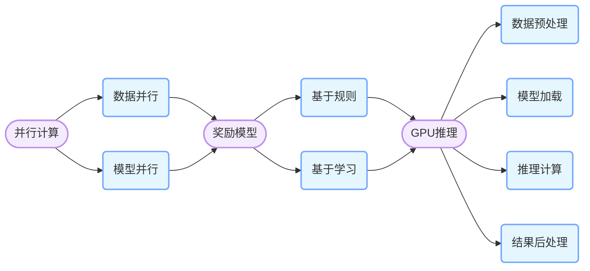

# 并行计算效率:奖励模型对GPU推理的影响

> 关键词：并行计算效率、奖励模型、GPU推理、计算资源分配、推理性能

> 摘要：本文深入探讨了奖励模型对GPU推理并行计算效率的影响。首先介绍了相关背景知识，包括研究目的、预期读者和文档结构等。接着阐述了核心概念，如并行计算、奖励模型和GPU推理，并给出了它们之间联系的示意图和流程图。详细讲解了核心算法原理，通过Python代码进行示例，同时介绍了相关数学模型和公式。通过项目实战，展示了代码的实际应用和详细解读。分析了奖励模型在不同实际场景中的影响，并推荐了学习资源、开发工具框架和相关论文著作。最后总结了未来发展趋势与挑战，并提供了常见问题解答和扩展阅读参考资料，旨在为读者全面理解奖励模型对GPU推理并行计算效率的影响提供深入的指导。

## 1. 背景介绍 
### 1.1 目的和范围
在当今的计算机科学领域，GPU凭借其强大的并行计算能力，在深度学习、科学计算等众多领域得到了广泛应用。GPU推理是将训练好的模型应用于新数据以获取预测结果的过程，其效率直接影响着系统的性能和响应速度。而奖励模型在强化学习、优化问题等场景中起着关键作用，它能够为决策提供反馈，指导模型朝着更优的方向发展。本研究的目的在于深入探究奖励模型对GPU推理并行计算效率的影响，分析奖励模型的设计、参数设置等因素如何影响GPU在推理过程中的资源利用和计算速度。研究范围涵盖了不同类型的奖励模型，包括基于规则的奖励模型、基于学习的奖励模型等，以及常见的GPU推理任务，如图像识别、自然语言处理等。

### 1.2 预期读者
本文预期读者主要包括计算机科学、人工智能、机器学习等领域的研究人员和从业者，他们对GPU计算、奖励模型和并行计算效率有一定的基础了解，希望深入研究奖励模型与GPU推理之间的关系，以优化系统性能和提高计算效率。此外，也适合相关专业的研究生和高年级本科生，作为学习和研究的参考资料。

### 1.3 文档结构概述
本文共分为十个部分。第一部分为背景介绍，阐述了研究的目的、预期读者和文档结构。第二部分介绍核心概念与联系，包括并行计算、奖励模型和GPU推理的原理，以及它们之间的关系，并给出示意图和流程图。第三部分讲解核心算法原理和具体操作步骤，通过Python代码详细说明。第四部分介绍数学模型和公式，并进行详细讲解和举例说明。第五部分进行项目实战，包括开发环境搭建、源代码实现和代码解读。第六部分分析实际应用场景。第七部分推荐学习资源、开发工具框架和相关论文著作。第八部分总结未来发展趋势与挑战。第九部分为附录，提供常见问题与解答。第十部分列出扩展阅读和参考资料。

### 1.4 术语表
#### 1.4.1 核心术语定义
- **并行计算**：指同时使用多个计算资源（如CPU核心、GPU线程等）来协同完成一个计算任务，以提高计算速度和效率。
- **奖励模型**：在强化学习等领域中，用于评估智能体的行为并给予相应奖励的模型，其目的是引导智能体学习到最优的行为策略。
- **GPU推理**：将训练好的深度学习模型部署到GPU上，对新的输入数据进行预测或分类的过程。
- **计算效率**：指在完成特定计算任务时，所消耗的计算资源（如时间、能量等）与获得的计算结果之间的比值，通常用单位时间内完成的计算量来衡量。

#### 1.4.2 相关概念解释
- **强化学习**：一种机器学习范式，智能体通过与环境进行交互，根据环境反馈的奖励信号来学习最优的行为策略。
- **深度学习模型**：一类基于神经网络的机器学习模型，具有强大的特征提取和模式识别能力，广泛应用于图像识别、自然语言处理等领域。
- **CUDA**：NVIDIA推出的一种并行计算平台和编程模型，用于在NVIDIA GPU上进行高效的并行计算。

#### 1.4.3 缩略词列表
- **GPU**：Graphics Processing Unit，图形处理单元
- **CPU**：Central Processing Unit，中央处理器
- **CUDA**：Compute Unified Device Architecture，统一计算设备架构
- **API**：Application Programming Interface，应用程序编程接口

## 2. 核心概念与联系 

### 核心概念原理
#### 并行计算
并行计算的核心思想是将一个大的计算任务分解为多个小的子任务，这些子任务可以同时在多个计算资源上进行处理。根据并行的粒度和方式，可以分为数据并行和模型并行。数据并行是将输入数据分割成多个部分，每个部分在不同的计算资源上进行相同的计算操作；模型并行是将模型的不同部分分配到不同的计算资源上进行计算。并行计算可以显著提高计算速度，尤其是对于大规模的计算任务。

#### 奖励模型
奖励模型在强化学习中起着至关重要的作用。它根据智能体的行为和环境的状态，为智能体提供一个奖励值。智能体的目标是通过不断地与环境交互，学习到能够获得最大累积奖励的行为策略。奖励模型的设计直接影响着智能体的学习效果和性能。常见的奖励模型包括基于规则的奖励模型和基于学习的奖励模型。基于规则的奖励模型根据预先定义的规则来计算奖励值，而基于学习的奖励模型则通过学习环境数据来自动生成奖励值。

#### GPU推理
GPU推理是将训练好的深度学习模型部署到GPU上进行预测的过程。由于GPU具有大量的计算核心和高带宽的内存，能够并行处理大量的数据，因此在深度学习推理任务中具有显著的优势。GPU推理的过程通常包括数据预处理、模型加载、推理计算和结果后处理等步骤。

### 架构的文本示意图
```plaintext
+---------------------+
|      并行计算       |
|                     |
|  +---------------+  |
|  |  数据并行     |  |
|  +---------------+  |
|  |  模型并行     |  |
|  +---------------+  |
+---------------------+
           |
           v
+---------------------+
|      奖励模型       |
|                     |
|  +---------------+  |
|  |  基于规则     |  |
|  +---------------+  |
|  |  基于学习     |  |
|  +---------------+  |
+---------------------+
           |
           v
+---------------------+
|      GPU推理       |
|                     |
|  +---------------+  |
|  |  数据预处理  |  |
|  +---------------+  |
|  |  模型加载    |  |
|  +---------------+  |
|  |  推理计算    |  |
|  +---------------+  |
|  |  结果后处理 |  |
|  +---------------+  |
+---------------------+
```

### Mermaid流程图


## 3. 核心算法原理 & 具体操作步骤 

### 算法原理
在探讨奖励模型对GPU推理并行计算效率的影响时，我们可以从计算资源分配的角度来考虑。奖励模型可以用于指导GPU资源的分配，使得在推理过程中能够更高效地利用GPU的计算能力。例如，在一个多任务的GPU推理场景中，我们可以根据每个任务的奖励值来决定分配给每个任务的GPU资源比例。

### Python源代码示例
```python
import torch
import torch.nn as nn
import torch.optim as optim

# 定义一个简单的神经网络模型
class SimpleModel(nn.Module):
    def __init__(self, input_size, hidden_size, output_size):
        super(SimpleModel, self).__init__()
        self.fc1 = nn.Linear(input_size, hidden_size)
        self.relu = nn.ReLU()
        self.fc2 = nn.Linear(hidden_size, output_size)

    def forward(self, x):
        out = self.fc1(x)
        out = self.relu(out)
        out = self.fc2(out)
        return out

# 初始化模型和数据
input_size = 10
hidden_size = 20
output_size = 1
model = SimpleModel(input_size, hidden_size, output_size)
device = torch.device("cuda" if torch.cuda.is_available() else "cpu")
model.to(device)

# 模拟多个推理任务
num_tasks = 5
tasks = [torch.randn(32, input_size).to(device) for _ in range(num_tasks)]

# 定义奖励模型（简单示例：随机奖励）
rewards = [torch.rand(1).item() for _ in range(num_tasks)]

# 根据奖励分配计算资源
total_reward = sum(rewards)
resource_allocation = [reward / total_reward for reward in rewards]

# 进行推理
results = []
for i in range(num_tasks):
    # 根据资源分配调整推理计算
    with torch.no_grad():
        output = model(tasks[i])
        results.append(output)

print("推理结果:", results)
```

### 具体操作步骤
1. **定义模型**：定义一个简单的神经网络模型，这里使用PyTorch实现。
2. **初始化数据**：生成多个推理任务的数据，并将其移动到GPU上。
3. **定义奖励模型**：这里使用随机奖励作为示例，实际应用中可以根据具体情况设计更复杂的奖励模型。
4. **计算资源分配**：根据每个任务的奖励值计算分配给每个任务的计算资源比例。
5. **进行推理**：使用分配的计算资源对每个任务进行推理计算，并保存推理结果。

## 4. 数学模型和公式 & 详细讲解 & 举例说明 

### 数学模型
假设我们有 $n$ 个推理任务，每个任务 $i$ 的奖励值为 $r_i$，总奖励值为 $R=\sum_{i=1}^{n}r_i$。我们将GPU的计算资源总量设为 $C$，分配给任务 $i$ 的计算资源为 $c_i$，则资源分配公式为：

$$c_i = \frac{r_i}{R} \times C$$

### 详细讲解
这个公式的含义是，每个任务分配到的计算资源比例与其奖励值成正比。奖励值越高的任务，分配到的计算资源就越多，从而可以更快地完成推理计算。这种资源分配方式可以使得整个系统在满足一定的奖励目标下，提高计算效率。

### 举例说明
假设我们有3个推理任务，奖励值分别为 $r_1 = 2$，$r_2 = 3$，$r_3 = 5$，总奖励值 $R = 2 + 3 + 5 = 10$。如果GPU的计算资源总量 $C = 100$，则分配给每个任务的计算资源分别为：

$$c_1 = \frac{2}{10} \times 100 = 20$$
$$c_2 = \frac{3}{10} \times 100 = 30$$
$$c_3 = \frac{5}{10} \times 100 = 50$$

这意味着任务3由于奖励值最高，将获得最多的计算资源，任务1获得的计算资源最少。

## 5. 项目实战：代码实际案例和详细解释说明 

### 5.1  开发环境搭建
#### 安装Python和相关库
首先，确保你已经安装了Python 3.x版本。可以从Python官方网站（https://www.python.org/downloads/）下载并安装。然后，使用pip安装必要的库，包括PyTorch和CUDA支持：
```bash
pip install torch torchvision torchaudio --extra-index-url https://download.pytorch.org/whl/cu113
```
这里假设你使用的是CUDA 11.3版本，如果你使用的是其他版本的CUDA，请相应地调整下载链接。

#### 检查GPU支持
安装完成后，可以使用以下代码检查PyTorch是否能够正常使用GPU：
```python
import torch
print(torch.cuda.is_available())
```
如果输出为 `True`，则表示PyTorch已经成功配置了GPU支持。

### 5.2  源代码详细实现和代码解读
```python
import torch
import torch.nn as nn
import torch.optim as optim

# 定义一个简单的神经网络模型
class SimpleModel(nn.Module):
    def __init__(self, input_size, hidden_size, output_size):
        super(SimpleModel, self).__init__()
        self.fc1 = nn.Linear(input_size, hidden_size)
        self.relu = nn.ReLU()
        self.fc2 = nn.Linear(hidden_size, output_size)

    def forward(self, x):
        out = self.fc1(x)
        out = self.relu(out)
        out = self.fc2(out)
        return out

# 初始化模型和数据
input_size = 10
hidden_size = 20
output_size = 1
model = SimpleModel(input_size, hidden_size, output_size)
device = torch.device("cuda" if torch.cuda.is_available() else "cpu")
model.to(device)

# 模拟多个推理任务
num_tasks = 5
tasks = [torch.randn(32, input_size).to(device) for _ in range(num_tasks)]

# 定义奖励模型（简单示例：随机奖励）
rewards = [torch.rand(1).item() for _ in range(num_tasks)]

# 根据奖励分配计算资源
total_reward = sum(rewards)
resource_allocation = [reward / total_reward for reward in rewards]

# 进行推理
results = []
for i in range(num_tasks):
    # 根据资源分配调整推理计算
    with torch.no_grad():
        output = model(tasks[i])
        results.append(output)

print("推理结果:", results)
```

#### 代码解读
1. **模型定义**：定义了一个简单的两层全连接神经网络模型 `SimpleModel`，包含一个输入层、一个隐藏层和一个输出层。
2. **模型初始化**：初始化模型的参数，并将模型移动到GPU上（如果可用）。
3. **数据生成**：生成5个随机的推理任务数据，并将其移动到GPU上。
4. **奖励模型**：使用随机数作为每个任务的奖励值。
5. **资源分配**：根据每个任务的奖励值计算分配给每个任务的计算资源比例。
6. **推理计算**：对每个任务进行推理计算，并将结果保存到 `results` 列表中。

### 5.3  代码解读与分析
#### 资源分配的影响
通过根据奖励值分配计算资源，我们可以使得奖励值高的任务获得更多的计算资源，从而提高整个系统的计算效率。在实际应用中，奖励模型可以根据任务的重要性、紧急程度等因素来设计，以实现更合理的资源分配。

#### 并行计算的潜力
在上述代码中，虽然没有显式地实现并行计算，但可以通过使用多线程或异步编程的方式，将多个任务并行地在GPU上进行推理计算，进一步提高计算效率。例如，可以使用 `torch.multiprocessing` 模块来实现多进程并行计算。

## 6. 实际应用场景 
### 图像识别系统
在图像识别系统中，可能同时需要处理多个图像的识别任务。不同的图像可能具有不同的重要性或优先级，例如，安全监控系统中的关键区域图像可能比普通区域图像更重要。通过使用奖励模型，可以根据图像的重要性分配GPU计算资源，使得关键图像能够更快地得到识别结果，提高系统的响应速度和效率。

### 自然语言处理任务
在自然语言处理任务中，如文本分类、情感分析等，可能会同时处理多个文本输入。不同的文本可能来自不同的用户或业务场景，其重要性和价值也不同。奖励模型可以根据文本的重要性、紧急程度等因素来分配GPU计算资源，提高系统的整体性能。

### 自动驾驶系统
在自动驾驶系统中，需要实时处理大量的传感器数据，如摄像头图像、雷达数据等。不同的传感器数据对于车辆的决策和控制具有不同的重要性。通过奖励模型，可以根据数据的重要性分配GPU计算资源，确保关键数据能够及时得到处理，提高自动驾驶系统的安全性和可靠性。

## 7. 工具和资源推荐
### 7.1 学习资源推荐
#### 7.1.1 书籍推荐
- 《深度学习》（Deep Learning）：由Ian Goodfellow、Yoshua Bengio和Aaron Courville撰写，是深度学习领域的经典教材，涵盖了深度学习的基本原理、算法和应用。
- 《Python深度学习》（Deep Learning with Python）：由Francois Chollet撰写，以Python和Keras为工具，介绍了深度学习的实际应用和开发技巧。
- 《并行计算导论》（Introduction to Parallel Computing）：由Ananth Grama、Anshul Gupta、George Karypis和Vipin Kumar撰写，系统地介绍了并行计算的基本概念、算法和编程模型。

#### 7.1.2 在线课程
- Coursera上的“深度学习专项课程”（Deep Learning Specialization）：由Andrew Ng教授授课，包括深度学习的基础、卷积神经网络、循环神经网络等多个方面的内容。
- edX上的“并行计算”（Parallel Computing）：由加州大学伯克利分校的教授授课，介绍了并行计算的原理、算法和编程技巧。
- 哔哩哔哩（Bilibili）上的相关课程：有许多优质的深度学习和并行计算相关的教学视频，可以免费观看学习。

#### 7.1.3 技术博客和网站
- Medium：有许多机器学习和深度学习领域的优秀博客文章，作者们会分享最新的研究成果和实践经验。
- arXiv：是一个预印本平台，提供了大量的学术论文，涵盖了人工智能、机器学习等多个领域。
- 机器之心：专注于人工智能领域的科技媒体，提供了丰富的技术文章、研究报告和行业动态。

### 7.2 开发工具框架推荐
#### 7.2.1 IDE和编辑器
- PyCharm：是一款专业的Python集成开发环境，提供了丰富的代码编辑、调试和项目管理功能。
- Jupyter Notebook：是一个交互式的开发环境，适合进行数据分析、模型训练和实验验证。
- Visual Studio Code：是一款轻量级的代码编辑器，支持多种编程语言和插件扩展，具有强大的代码编辑和调试功能。

#### 7.2.2 调试和性能分析工具
- PyTorch Profiler：是PyTorch自带的性能分析工具，可以帮助开发者分析模型的性能瓶颈，优化代码性能。
- NVIDIA Nsight Systems：是NVIDIA提供的一款性能分析工具，专门用于分析GPU应用程序的性能。
- TensorBoard：是TensorFlow提供的可视化工具，可以用于监控模型的训练过程、分析模型的性能指标等。

#### 7.2.3 相关框架和库
- PyTorch：是一个开源的深度学习框架，具有动态图计算、易于使用等优点，广泛应用于深度学习研究和开发。
- TensorFlow：是另一个流行的深度学习框架，具有强大的分布式计算能力和丰富的工具库。
- CUDA：是NVIDIA推出的并行计算平台和编程模型，用于在NVIDIA GPU上进行高效的并行计算。

### 7.3 相关论文著作推荐
#### 7.3.1 经典论文
- “ImageNet Classification with Deep Convolutional Neural Networks”：由Alex Krizhevsky、Ilya Sutskever和Geoffrey E. Hinton撰写，介绍了AlexNet卷积神经网络，开启了深度学习在图像识别领域的新纪元。
- “Long Short-Term Memory”：由Sepp Hochreiter和Jürgen Schmidhuber撰写，提出了长短期记忆网络（LSTM），解决了传统循环神经网络中的梯度消失问题。
- “Attention Is All You Need”：由Ashish Vaswani等人撰写，提出了Transformer模型，在自然语言处理领域取得了巨大的成功。

#### 7.3.2 最新研究成果
- 可以关注顶级学术会议如NeurIPS（神经信息处理系统大会）、ICML（国际机器学习会议）、CVPR（计算机视觉与模式识别会议）等上的最新研究成果，了解奖励模型和GPU推理领域的最新进展。

#### 7.3.3 应用案例分析
- 可以参考一些实际应用案例的论文，如自动驾驶系统中的GPU推理优化、图像识别系统中的资源分配策略等，学习如何将奖励模型应用于实际场景中，提高GPU推理的并行计算效率。

## 8. 总结：未来发展趋势与挑战
### 未来发展趋势
#### 更复杂的奖励模型设计
随着人工智能技术的不断发展，奖励模型的设计将越来越复杂。未来的奖励模型可能会考虑更多的因素，如任务的长期影响、环境的动态变化等，以更准确地评估任务的价值和重要性，从而实现更合理的计算资源分配。

#### 硬件与软件的协同优化
为了进一步提高GPU推理的并行计算效率，未来的研究将更加注重硬件与软件的协同优化。例如，开发专门的GPU硬件架构，以更好地支持奖励模型引导的资源分配策略；同时，优化软件算法，充分利用硬件的特性，提高计算效率。

#### 多模态融合推理
在实际应用中，往往需要同时处理多种类型的数据，如图像、文本、音频等。未来的研究将关注多模态融合推理，如何在GPU上高效地处理多模态数据，并根据不同模态数据的重要性分配计算资源，是一个重要的研究方向。

### 挑战
#### 奖励模型的可解释性
复杂的奖励模型可能会导致其可解释性降低，难以理解模型是如何计算奖励值的。这在一些对安全性和可靠性要求较高的应用场景中是一个重要的问题，如自动驾驶系统。因此，如何提高奖励模型的可解释性是一个亟待解决的挑战。

#### 计算资源的动态变化
在实际应用中，计算资源的状态可能会动态变化，如GPU的负载、温度等。如何在计算资源动态变化的情况下，实时调整奖励模型和资源分配策略，保证系统的稳定性和高效性，是一个具有挑战性的问题。

#### 数据隐私和安全
在使用奖励模型进行资源分配时，可能会涉及到大量的数据隐私和安全问题。例如，奖励模型的训练数据可能包含敏感信息，如何在保证数据隐私和安全的前提下，实现高效的资源分配，是一个需要关注的问题。

## 9. 附录：常见问题与解答
### 问题1：如何选择合适的奖励模型？
解答：选择合适的奖励模型需要考虑具体的应用场景和任务需求。如果任务的规则比较明确，可以选择基于规则的奖励模型；如果任务的环境比较复杂，难以用规则来描述，可以选择基于学习的奖励模型。同时，还需要考虑奖励模型的可解释性、计算复杂度等因素。

### 问题2：GPU推理的性能受哪些因素影响？
解答：GPU推理的性能受多种因素影响，包括模型的复杂度、输入数据的大小、GPU的硬件性能、计算资源的分配等。一般来说，模型越复杂、输入数据越大，推理所需的时间就越长；GPU的硬件性能越好，推理速度就越快；合理的计算资源分配可以提高GPU的利用率，从而提高推理效率。

### 问题3：如何优化GPU推理的并行计算效率？
解答：可以从多个方面优化GPU推理的并行计算效率。例如，选择合适的模型架构，减少模型的计算量；使用数据并行和模型并行技术，将计算任务分配到多个GPU上进行处理；根据任务的重要性和奖励值，合理分配计算资源；使用优化的算法和库，提高代码的执行效率等。

### 问题4：奖励模型对GPU推理的影响是否显著？
解答：奖励模型对GPU推理的影响是否显著取决于具体的应用场景和奖励模型的设计。在一些对计算资源要求较高、任务重要性差异较大的场景中，合理的奖励模型可以显著提高GPU推理的并行计算效率；而在一些计算资源充足、任务重要性差异较小的场景中，奖励模型的影响可能相对较小。

## 10. 扩展阅读 & 参考资料
### 扩展阅读
- 《强化学习：原理与Python实现》：进一步深入学习强化学习的原理和应用，了解奖励模型在强化学习中的更多应用场景和设计方法。
- 《高性能计算：从算法到体系结构》：学习高性能计算的基本原理和技术，了解如何在GPU等并行计算平台上实现高效的算法。
- 《人工智能安全与隐私》：了解人工智能领域中的安全和隐私问题，以及如何在使用奖励模型和GPU推理时保护数据的安全和隐私。

### 参考资料
- 相关学术论文和研究报告，可以从IEEE Xplore、ACM Digital Library等学术数据库中获取。
- 开源项目和代码库，如GitHub上的相关项目，可以参考他人的实现和经验。
- 官方文档和技术博客，如PyTorch、TensorFlow等框架的官方文档和博客，提供了最新的技术信息和使用指南。

作者：AI天才研究院/AI Genius Institute & 禅与计算机程序设计艺术 /Zen And The Art of Computer Programming