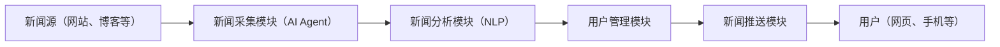

# 开发AI Agent支持的智能新闻聚合系统

> 关键词：AI Agent、智能新闻聚合系统、新闻采集、新闻分析、信息推送

> 摘要：本文旨在详细介绍如何开发一个由AI Agent支持的智能新闻聚合系统。从系统的背景知识入手，阐述核心概念及相互联系，深入剖析核心算法原理并给出Python代码示例，探讨相关数学模型和公式。通过项目实战，展示系统的具体实现过程，包括开发环境搭建、源代码详细实现与解读。分析该系统的实际应用场景，推荐相关的学习资源、开发工具框架以及论文著作。最后总结系统的未来发展趋势与挑战，解答常见问题并提供扩展阅读和参考资料，为开发者构建此类系统提供全面的指导。

## 1. 背景介绍 
### 1.1 目的和范围
在信息爆炸的时代，新闻资讯海量且分散，用户获取有价值、个性化的新闻变得困难。开发AI Agent支持的智能新闻聚合系统的目的是整合来自不同来源的新闻，利用AI Agent的智能特性，对新闻进行筛选、分类、分析和推送，为用户提供定制化的新闻服务。

本系统的范围涵盖新闻的采集、存储、处理和展示。它可以收集多种类型的新闻，包括但不限于政治、经济、科技、娱乐等领域，支持不同格式的新闻源，如网页、RSS订阅等。系统具备智能分析能力，能够理解新闻内容，提取关键信息，并根据用户的偏好和行为进行个性化推荐。

### 1.2 预期读者
本文的预期读者包括对人工智能和新闻技术感兴趣的开发者、软件架构师、数据分析师等专业人士，也适合希望了解智能新闻聚合系统原理和开发过程的技术爱好者。

### 1.3 文档结构概述
本文将按照以下结构展开：首先介绍核心概念与联系，帮助读者理解系统的基本原理和架构；接着详细阐述核心算法原理和具体操作步骤，并给出Python代码示例；然后介绍相关的数学模型和公式，并举例说明；通过项目实战展示系统的实际开发过程，包括环境搭建、代码实现和解读；分析系统的实际应用场景；推荐相关的学习资源、开发工具框架和论文著作；最后总结系统的未来发展趋势与挑战，解答常见问题并提供扩展阅读和参考资料。

### 1.4 术语表
#### 1.4.1 核心术语定义
- **AI Agent**：人工智能代理，是一种能够感知环境、自主决策并采取行动以实现特定目标的软件实体。在本系统中，AI Agent负责新闻的采集、分析和推送等任务。
- **新闻聚合系统**：将来自不同来源的新闻整合到一个平台上，为用户提供一站式新闻服务的系统。
- **自然语言处理（NLP）**：是人工智能的一个分支，研究如何让计算机理解和处理人类语言。在本系统中，NLP技术用于新闻内容的分析和理解。
- **个性化推荐**：根据用户的偏好、行为和历史记录，为用户推荐符合其兴趣的新闻内容。

#### 1.4.2 相关概念解释
- **RSS订阅**：一种用于共享网站内容的XML格式标准，用户可以通过RSS订阅器订阅感兴趣的网站，及时获取最新的新闻更新。
- **文本分类**：将文本内容划分到不同的类别中，以便对新闻进行组织和管理。
- **情感分析**：通过对文本内容的分析，判断文本所表达的情感倾向，如积极、消极或中性。

#### 1.4.3 缩略词列表
- **NLP**：Natural Language Processing（自然语言处理）
- **RSS**：Really Simple Syndication（简易信息聚合）

## 2. 核心概念与联系 
### 核心概念原理
智能新闻聚合系统主要由以下几个核心部分组成：新闻采集模块、新闻分析模块、用户管理模块和新闻推送模块。

#### 新闻采集模块
该模块负责从各种新闻源收集新闻数据。新闻源可以是新闻网站、博客、社交媒体等。AI Agent通过网络爬虫技术，自动访问这些新闻源，提取新闻内容，并将其存储到系统的数据库中。

#### 新闻分析模块
利用自然语言处理技术，对采集到的新闻进行分析。包括文本分类、关键词提取、情感分析等。通过这些分析，系统可以更好地理解新闻内容，为后续的个性化推荐提供依据。

#### 用户管理模块
管理用户的信息和偏好。用户可以注册、登录系统，并设置自己感兴趣的新闻类别、关键词等。系统根据用户的设置，为用户提供个性化的新闻服务。

#### 新闻推送模块
根据用户的偏好和新闻分析结果，将合适的新闻推送给用户。推送方式可以是网页展示、邮件通知、手机应用推送等。

### 架构的文本示意图
```plaintext
+---------------------+
| 新闻源（网站、博客等） |
+---------------------+
         |
         v
+---------------------+
| 新闻采集模块（AI Agent） |
+---------------------+
         |
         v
+---------------------+
| 新闻分析模块（NLP） |
+---------------------+
         |
         v
+---------------------+
| 用户管理模块 |
+---------------------+
         |
         v
+---------------------+
| 新闻推送模块 |
+---------------------+
         |
         v
+---------------------+
| 用户（网页、手机等） |
+---------------------+
```

### Mermaid 流程图


## 3. 核心算法原理 & 具体操作步骤 
### 新闻采集算法
新闻采集主要使用网络爬虫技术。下面是一个简单的Python代码示例，使用`requests`和`BeautifulSoup`库来采集新闻内容：

```python
import requests
from bs4 import BeautifulSoup

def fetch_news(url):
    try:
        response = requests.get(url)
        response.raise_for_status()
        soup = BeautifulSoup(response.text, 'html.parser')
        # 假设新闻标题在h1标签中，内容在p标签中
        title = soup.find('h1').text
        paragraphs = soup.find_all('p')
        content = ' '.join([p.text for p in paragraphs])
        return title, content
    except Exception as e:
        print(f"Error fetching news: {e}")
        return None, None

# 示例用法
url = 'https://example.com/news/article'
title, content = fetch_news(url)
if title and content:
    print(f"Title: {title}")
    print(f"Content: {content}")
```

### 新闻分类算法
新闻分类可以使用朴素贝叶斯算法。以下是一个简单的Python代码示例，使用`sklearn`库实现：

```python
from sklearn.feature_extraction.text import TfidfVectorizer
from sklearn.naive_bayes import MultinomialNB
from sklearn.pipeline import Pipeline

# 假设我们有一些训练数据
train_data = [
    ("This is a tech news article.", "tech"),
    ("The stock market is up today.", "finance"),
    ("The latest movie reviews are out.", "entertainment")
]

X_train = [data[0] for data in train_data]
y_train = [data[1] for data in train_data]

# 创建分类器管道
text_clf = Pipeline([
    ('tfidf', TfidfVectorizer()),
    ('clf', MultinomialNB())
])

# 训练分类器
text_clf.fit(X_train, y_train)

# 测试分类器
test_news = "New smartphone released."
predicted_category = text_clf.predict([test_news])
print(f"Predicted category: {predicted_category[0]}")
```

### 具体操作步骤
1. **新闻采集**：使用网络爬虫技术，按照一定的规则访问新闻源，提取新闻内容，并将其存储到数据库中。
2. **新闻分析**：对采集到的新闻进行预处理，如去除停用词、分词等。然后使用分类算法对新闻进行分类，提取关键词和进行情感分析。
3. **用户管理**：用户注册、登录系统，设置自己的偏好。系统将用户信息存储到数据库中。
4. **新闻推送**：根据用户的偏好和新闻分析结果，筛选出合适的新闻，推送给用户。

## 4. 数学模型和公式 & 详细讲解 & 举例说明 
### 词频 - 逆文档频率（TF-IDF）
TF-IDF是一种常用的文本特征提取方法，用于评估一个词在文档中的重要性。

#### 公式
$$TF-IDF(t, d, D) = TF(t, d) \times IDF(t, D)$$

其中：
- $TF(t, d)$ 表示词 $t$ 在文档 $d$ 中的词频，计算公式为：
$$TF(t, d) = \frac{词 t 在文档 d 中出现的次数}{文档 d 中的总词数}$$
- $IDF(t, D)$ 表示词 $t$ 的逆文档频率，计算公式为：
$$IDF(t, D) = \log\frac{|D|}{|{d \in D : t \in d}| + 1}$$

其中 $|D|$ 是文档集合 $D$ 中的文档总数，$|{d \in D : t \in d}|$ 是包含词 $t$ 的文档数。

#### 详细讲解
TF-IDF的核心思想是，如果一个词在某个文档中出现的频率很高，但在整个文档集合中出现的频率很低，那么这个词对于该文档的区分度就很高。因此，TF-IDF值越高，说明该词在文档中的重要性越大。

#### 举例说明
假设我们有一个文档集合 $D$ 包含三个文档：
- $d_1$: "This is a tech news article."
- $d_2$: "The stock market is up today."
- $d_3$: "The latest movie reviews are out."

对于词 "tech"，在文档 $d_1$ 中出现了1次，$d_1$ 中的总词数为6，所以 $TF("tech", d_1) = \frac{1}{6}$。在整个文档集合 $D$ 中，只有 $d_1$ 包含词 "tech"，所以 $|{d \in D : "tech" \in d}| = 1$，$|D| = 3$，则 $IDF("tech", D) = \log\frac{3}{1 + 1} \approx 0.405$。因此，$TF-IDF("tech", d_1, D) = \frac{1}{6} \times 0.405 \approx 0.0675$。

### 朴素贝叶斯分类器
朴素贝叶斯分类器是一种基于贝叶斯定理的分类算法，假设特征之间相互独立。

#### 公式
对于一个文本 $x = (x_1, x_2, \cdots, x_n)$，要判断它属于类别 $c$ 的概率，根据贝叶斯定理有：
$$P(c|x) = \frac{P(x|c)P(c)}{P(x)}$$

由于 $P(x)$ 对于所有类别都是相同的，所以可以忽略。朴素贝叶斯假设特征之间相互独立，即 $P(x|c) = \prod_{i=1}^{n}P(x_i|c)$。因此，我们只需要计算 $P(c|x) \propto P(c)\prod_{i=1}^{n}P(x_i|c)$，选择使得 $P(c|x)$ 最大的类别 $c$ 作为预测结果。

#### 详细讲解
朴素贝叶斯分类器通过计算文本属于各个类别的概率，选择概率最大的类别作为预测结果。在训练过程中，需要计算每个类别的先验概率 $P(c)$ 和每个特征在每个类别下的条件概率 $P(x_i|c)$。

#### 举例说明
假设我们有一个简单的文本分类问题，有两个类别："tech" 和 "finance"，训练数据如下：
- 类别 "tech": ["This is a tech news article.", "New smartphone released."]
- 类别 "finance": ["The stock market is up today.", "Investment opportunities are high."]

对于测试文本 "New tech gadget launched."，我们需要计算它属于 "tech" 和 "finance" 类别的概率。首先计算先验概率：$P("tech") = \frac{2}{4} = 0.5$，$P("finance") = \frac{2}{4} = 0.5$。然后计算条件概率，例如对于词 "new"，在 "tech" 类别中出现了1次，在 "tech" 类别的总词数为10，所以 $P("new"|"tech") = \frac{1}{10}$。同理计算其他词的条件概率，最后根据公式计算 $P("tech"|x)$ 和 $P("finance"|x)$，选择概率大的类别作为预测结果。

## 5. 项目实战：代码实际案例和详细解释说明 
### 5.1  开发环境搭建
#### 安装Python
首先需要安装Python，建议使用Python 3.7及以上版本。可以从Python官方网站（https://www.python.org/downloads/）下载并安装。

#### 安装必要的库
使用`pip`安装以下必要的库：
```sh
pip install requests beautifulsoup4 scikit-learn pandas
```

### 5.2  源代码详细实现和代码解读
以下是一个完整的智能新闻聚合系统的Python代码示例：

```python
import requests
from bs4 import BeautifulSoup
from sklearn.feature_extraction.text import TfidfVectorizer
from sklearn.naive_bayes import MultinomialNB
from sklearn.pipeline import Pipeline
import pandas as pd

# 新闻采集模块
def fetch_news(url):
    try:
        response = requests.get(url)
        response.raise_for_status()
        soup = BeautifulSoup(response.text, 'html.parser')
        title = soup.find('h1').text
        paragraphs = soup.find_all('p')
        content = ' '.join([p.text for p in paragraphs])
        return title, content
    except Exception as e:
        print(f"Error fetching news: {e}")
        return None, None

# 新闻分类模块
def train_classifier():
    # 假设我们有一些训练数据
    train_data = [
        ("This is a tech news article.", "tech"),
        ("The stock market is up today.", "finance"),
        ("The latest movie reviews are out.", "entertainment")
    ]
    X_train = [data[0] for data in train_data]
    y_train = [data[1] for data in train_data]

    # 创建分类器管道
    text_clf = Pipeline([
        ('tfidf', TfidfVectorizer()),
        ('clf', MultinomialNB())
    ])

    # 训练分类器
    text_clf.fit(X_train, y_train)
    return text_clf

# 用户管理模块
class UserManager:
    def __init__(self):
        self.users = {}

    def register_user(self, user_id, preferences):
        self.users[user_id] = preferences

    def get_user_preferences(self, user_id):
        return self.users.get(user_id, [])

# 新闻推送模块
def push_news(user_manager, classifier, news_list):
    for user_id, preferences in user_manager.users.items():
        for news_title, news_content in news_list:
            predicted_category = classifier.predict([news_content])[0]
            if predicted_category in preferences:
                print(f"Pushing news '{news_title}' to user {user_id}")

# 主程序
if __name__ == "__main__":
    # 新闻源URL列表
    news_urls = [
        'https://example.com/news/article1',
        'https://example.com/news/article2'
    ]

    # 采集新闻
    news_list = []
    for url in news_urls:
        title, content = fetch_news(url)
        if title and content:
            news_list.append((title, content))

    # 训练分类器
    classifier = train_classifier()

    # 用户管理
    user_manager = UserManager()
    user_manager.register_user(1, ['tech', 'finance'])

    # 推送新闻
    push_news(user_manager, classifier, news_list)
```

### 5.3  代码解读与分析
#### 新闻采集模块
`fetch_news`函数使用`requests`库发送HTTP请求，获取新闻页面的HTML内容，然后使用`BeautifulSoup`库解析HTML，提取新闻标题和内容。

#### 新闻分类模块
`train_classifier`函数使用`sklearn`库的`TfidfVectorizer`和`MultinomialNB`构建一个分类器管道，并使用训练数据进行训练。

#### 用户管理模块
`UserManager`类用于管理用户信息和偏好。`register_user`方法用于注册新用户，`get_user_preferences`方法用于获取用户的偏好。

#### 新闻推送模块
`push_news`函数根据用户的偏好和新闻分类结果，将合适的新闻推送给用户。

#### 主程序
主程序首先定义了新闻源URL列表，调用`fetch_news`函数采集新闻，然后调用`train_classifier`函数训练分类器，注册用户并设置偏好，最后调用`push_news`函数推送新闻。

## 6. 实际应用场景 
### 个性化新闻阅读平台
用户可以根据自己的兴趣爱好设置新闻偏好，系统会自动为用户推送符合其兴趣的新闻。例如，用户对科技和体育新闻感兴趣，系统会重点推送这两个领域的新闻。

### 企业新闻监控
企业可以使用智能新闻聚合系统监控与自身相关的新闻，及时了解行业动态、竞争对手信息等。例如，一家科技公司可以关注科技新闻、行业报告等，以便及时调整战略。

### 新闻媒体内容推荐
新闻媒体可以利用该系统为读者提供个性化的新闻推荐，提高用户的阅读体验和粘性。例如，根据读者的历史阅读记录和偏好，推荐相关的新闻文章。

## 7. 工具和资源推荐
### 7.1 学习资源推荐
#### 7.1.1 书籍推荐
- 《Python网络爬虫从入门到实践》：介绍了Python网络爬虫的基本原理和实现方法，对于新闻采集模块的开发有很大帮助。
- 《自然语言处理入门》：系统地介绍了自然语言处理的基本概念、算法和应用，适合学习新闻分析模块的相关知识。
- 《机器学习实战》：通过实际案例介绍了机器学习的基本算法和应用，对于新闻分类算法的学习很有帮助。

#### 7.1.2 在线课程
- Coursera上的“Natural Language Processing Specialization”：由知名教授授课，深入讲解自然语言处理的各个方面。
- edX上的“Introduction to Machine Learning”：介绍了机器学习的基本概念和算法，适合初学者。

#### 7.1.3 技术博客和网站
- Medium：有很多关于人工智能、自然语言处理和新闻技术的优质文章。
- 机器之心：专注于人工智能领域的技术和应用，提供最新的研究成果和行业动态。

### 7.2 开发工具框架推荐
#### 7.2.1 IDE和编辑器
- PyCharm：功能强大的Python集成开发环境，提供代码编辑、调试、版本控制等功能。
- Visual Studio Code：轻量级的代码编辑器，支持多种编程语言，有丰富的插件扩展。

#### 7.2.2 调试和性能分析工具
- Py-Spy：用于分析Python程序的性能，找出性能瓶颈。
- PDB：Python自带的调试器，可以帮助开发者调试代码。

#### 7.2.3 相关框架和库
- Scrapy：强大的Python网络爬虫框架，用于高效地采集新闻数据。
- NLTK：自然语言处理工具包，提供了丰富的文本处理功能。
- Flask：轻量级的Python Web框架，可用于开发新闻聚合系统的Web界面。

### 7.3 相关论文著作推荐
#### 7.3.1 经典论文
- “A Mathematical Theory of Communication”：香农的经典论文，奠定了信息论的基础，对于文本特征提取和分类有重要的理论指导意义。
- “Naive Bayes Text Classification”：介绍了朴素贝叶斯文本分类的基本原理和应用。

#### 7.3.2 最新研究成果
- 关注ACM SIGIR、ACL等顶级学术会议的论文，了解自然语言处理和信息检索领域的最新研究成果。

#### 7.3.3 应用案例分析
- 一些知名的新闻聚合平台，如今日头条、Flipboard等的技术博客和论文，介绍了它们在新闻推荐和个性化服务方面的实践经验。

## 8. 总结：未来发展趋势与挑战
### 未来发展趋势
- **智能化程度不断提高**：随着人工智能技术的不断发展，AI Agent将具备更强的学习和推理能力，能够更准确地理解新闻内容和用户需求，提供更加个性化、智能化的新闻服务。
- **多模态新闻聚合**：除了文本新闻，未来的新闻聚合系统将整合图片、视频、音频等多种模态的新闻内容，为用户提供更加丰富的新闻体验。
- **与社交媒体的深度融合**：社交媒体已经成为人们获取新闻的重要渠道之一，未来的新闻聚合系统将与社交媒体深度融合，实现新闻的实时传播和互动。

### 挑战
- **数据质量和隐私问题**：新闻数据的质量直接影响系统的性能和用户体验，同时，用户的隐私保护也是一个重要的问题。如何确保数据的准确性、完整性和安全性，是开发智能新闻聚合系统面临的挑战之一。
- **算法复杂度和性能问题**：随着新闻数据量的不断增加和算法的不断复杂，系统的性能和效率将面临挑战。如何优化算法，提高系统的处理速度和响应时间，是需要解决的问题。
- **新闻真实性和可靠性问题**：在信息爆炸的时代，虚假新闻和谣言泛滥，如何利用AI技术识别和过滤虚假新闻，确保新闻的真实性和可靠性，是智能新闻聚合系统需要解决的重要问题。

## 9. 附录：常见问题与解答
### 问题1：如何确保新闻采集的合法性？
解答：在进行新闻采集时，需要遵守相关的法律法规和网站的使用条款。可以使用合法的API接口获取新闻数据，或者在网站允许的情况下进行爬虫采集。同时，要注意不要过度采集，以免对网站造成负担。

### 问题2：如何提高新闻分类的准确性？
解答：可以从以下几个方面提高新闻分类的准确性：增加训练数据的数量和质量，选择合适的特征提取方法和分类算法，进行模型调优和评估等。

### 问题3：如何处理新闻数据的更新和变化？
解答：可以定期对新闻数据进行更新，使用增量学习的方法对分类器进行更新和维护。同时，要关注新闻源的变化，及时调整采集策略。

## 10. 扩展阅读 & 参考资料
### 扩展阅读
- 《人工智能时代的新闻业》：探讨了人工智能技术对新闻业的影响和变革。
- 《智能推荐系统》：介绍了智能推荐系统的原理、算法和应用，对于新闻推送模块的开发有一定的参考价值。

### 参考资料
- Python官方文档（https://docs.python.org/）
- scikit-learn官方文档（https://scikit-learn.org/）
- BeautifulSoup官方文档（https://www.crummy.com/software/BeautifulSoup/bs4/doc/）

作者：AI天才研究院/AI Genius Institute & 禅与计算机程序设计艺术 /Zen And The Art of Computer Programming