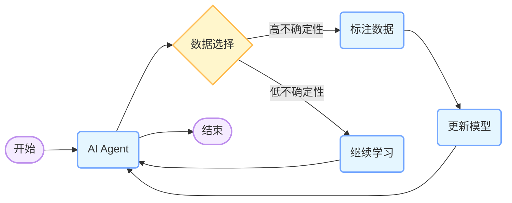
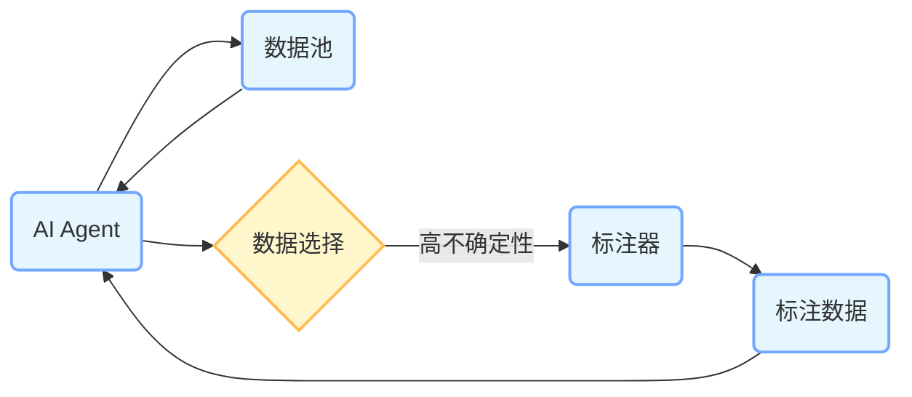

# 开发AI Agent的主动学习能力：优化学习效率

> 关键词：AI Agent、主动学习能力、学习效率优化、机器学习、强化学习

> 摘要：本文聚焦于开发AI Agent的主动学习能力以优化学习效率这一核心主题。首先介绍了相关背景知识，包括目的范围、预期读者、文档结构等。接着阐述了主动学习的核心概念及联系，给出了原理和架构的示意图与流程图。详细讲解了核心算法原理及具体操作步骤，并使用Python代码进行了说明。还介绍了相关数学模型和公式，并举例说明。通过项目实战，展示了代码的实际案例和详细解释。分析了主动学习在不同场景下的实际应用，推荐了学习资源、开发工具框架以及相关论文著作。最后总结了未来发展趋势与挑战，提供了常见问题解答和扩展阅读参考资料，旨在为开发者和研究者提供全面深入的指导。

## 1. 背景介绍 
### 1.1 目的和范围
在当今人工智能快速发展的时代，AI Agent被广泛应用于各个领域，如游戏、机器人控制、自动驾驶等。然而，传统的学习方式往往需要大量的标注数据和长时间的训练，效率较低。开发AI Agent的主动学习能力，能够让AI Agent自主地选择最有价值的数据进行学习，从而优化学习效率，减少对大量标注数据的依赖。本文的范围涵盖了主动学习的核心概念、算法原理、数学模型、项目实战以及实际应用场景等方面，旨在为读者提供全面的技术指导。

### 1.2 预期读者
本文预期读者包括人工智能领域的开发者、研究者、学生，以及对AI Agent主动学习感兴趣的技术爱好者。无论您是初学者还是有一定经验的专业人士，都能从本文中获取有价值的信息。

### 1.3 文档结构概述
本文共分为十个部分。第一部分为背景介绍，阐述了目的、范围、预期读者和文档结构。第二部分介绍主动学习的核心概念与联系，包括原理和架构的示意图与流程图。第三部分详细讲解核心算法原理和具体操作步骤，并给出Python代码示例。第四部分介绍相关数学模型和公式，并举例说明。第五部分通过项目实战展示代码的实际应用和详细解释。第六部分分析主动学习的实际应用场景。第七部分推荐学习资源、开发工具框架和相关论文著作。第八部分总结未来发展趋势与挑战。第九部分为附录，提供常见问题与解答。第十部分列出扩展阅读和参考资料。

### 1.4 术语表
#### 1.4.1 核心术语定义
- **AI Agent**：人工智能代理，是一种能够感知环境、做出决策并执行行动的智能实体。
- **主动学习**：一种机器学习方法，AI Agent主动地选择最有价值的数据进行学习，而不是被动地接受给定的数据。
- **学习效率**：指AI Agent在学习过程中获取知识和技能的速度和质量。

#### 1.4.2 相关概念解释
- **标注数据**：带有标签或标记的训练数据，用于监督学习。
- **不确定性采样**：主动学习中常用的一种采样策略，选择那些模型预测不确定性最大的数据进行标注和学习。
- **强化学习**：一种通过智能体与环境进行交互，根据环境反馈的奖励信号来学习最优策略的机器学习方法。

#### 1.4.3 缩略词列表
- **ML**：Machine Learning，机器学习
- **RL**：Reinforcement Learning，强化学习
- **AL**：Active Learning，主动学习

## 2. 核心概念与联系 
主动学习的核心思想是让AI Agent在学习过程中主动地选择最有价值的数据进行学习，从而提高学习效率。其基本原理是基于模型的不确定性，即选择那些模型对其预测结果不确定性最大的数据进行标注和学习。这样可以使模型更快地学习到关键信息，减少对大量标注数据的依赖。

### 核心概念原理示意图


### 核心概念架构图
主动学习的架构主要包括三个部分：AI Agent、数据池和标注器。AI Agent根据当前模型对数据池中的数据进行预测，计算每个数据的不确定性，选择不确定性最大的数据发送给标注器进行标注。标注器将标注好的数据返回给AI Agent，AI Agent使用这些数据更新模型。



## 3. 核心算法原理 & 具体操作步骤 
### 核心算法原理
主动学习中常用的算法是不确定性采样算法。该算法的基本思想是选择那些模型对其预测结果不确定性最大的数据进行标注和学习。常见的不确定性度量方法有：
- **信息熵**：信息熵是一种衡量随机变量不确定性的指标。对于分类问题，信息熵可以定义为：
  $$H(p) = -\sum_{i=1}^{n} p_i \log(p_i)$$
  其中，$p_i$ 是模型预测第 $i$ 类的概率，$n$ 是类别的数量。信息熵越大，说明模型对该数据的预测不确定性越大。
- **最小置信度**：选择模型预测概率最小的类别对应的概率作为不确定性度量。即：
  $$u(x) = 1 - \max_{i=1}^{n} p_i$$
  其中，$p_i$ 是模型预测第 $i$ 类的概率，$n$ 是类别的数量。最小置信度越大，说明模型对该数据的预测不确定性越大。

### 具体操作步骤
1. **初始化模型和数据池**：选择一个合适的机器学习模型，并初始化数据池，数据池中包含未标注的数据。
2. **选择数据**：AI Agent使用当前模型对数据池中的数据进行预测，计算每个数据的不确定性，选择不确定性最大的数据。
3. **标注数据**：将选择的数据发送给标注器进行标注。
4. **更新模型**：使用标注好的数据更新模型。
5. **重复步骤2-4**：直到满足停止条件，如达到最大迭代次数或模型性能达到满意水平。

### Python代码示例
```python
import numpy as np
from sklearn.datasets import make_classification
from sklearn.model_selection import train_test_split
from sklearn.linear_model import LogisticRegression

# 生成数据集
X, y = make_classification(n_samples=1000, n_features=20, n_informative=10, n_classes=2, random_state=42)
X_train, X_test, y_train, y_test = train_test_split(X, y, test_size=0.2, random_state=42)

# 初始化数据池
unlabeled_data = X_train.copy()
labeled_data = []
labeled_labels = []

# 初始化模型
model = LogisticRegression()

# 主动学习循环
for _ in range(10):
    # 训练模型
    if len(labeled_data) > 0:
        model.fit(np.array(labeled_data), np.array(labeled_labels))
    
    # 选择数据
    if len(unlabeled_data) > 0:
        probabilities = model.predict_proba(unlabeled_data)
        uncertainties = 1 - np.max(probabilities, axis=1)
        selected_index = np.argmax(uncertainties)
        selected_data = unlabeled_data[selected_index]
        
        # 模拟标注数据
        selected_label = y_train[np.where((X_train == selected_data).all(axis=1))[0][0]]
        
        # 更新数据池
        labeled_data.append(selected_data)
        labeled_labels.append(selected_label)
        unlabeled_data = np.delete(unlabeled_data, selected_index, axis=0)
    
    # 评估模型
    if len(labeled_data) > 0:
        accuracy = model.score(X_test, y_test)
        print(f"Accuracy after {_+1} iterations: {accuracy}")
```

## 4. 数学模型和公式 & 详细讲解 & 举例说明 
### 信息熵
信息熵是一种衡量随机变量不确定性的指标。对于一个离散随机变量 $X$，其取值为 $x_1, x_2, \cdots, x_n$，对应的概率为 $p_1, p_2, \cdots, p_n$，则信息熵定义为：
$$H(X) = -\sum_{i=1}^{n} p_i \log(p_i)$$
信息熵越大，说明随机变量的不确定性越大。在主动学习中，我们可以使用信息熵来衡量模型对某个数据的预测不确定性。例如，对于一个二分类问题，模型预测某个数据属于正类的概率为 $p$，则属于负类的概率为 $1 - p$，信息熵为：
$$H(p) = -p \log(p) - (1 - p) \log(1 - p)$$
当 $p = 0.5$ 时，信息熵最大，为 $H(0.5) = -0.5 \log(0.5) - 0.5 \log(0.5) = \log(2) \approx 0.693$，说明模型对该数据的预测不确定性最大。

### 最小置信度
最小置信度是另一种常用的不确定性度量方法。对于一个分类问题，模型对某个数据预测属于 $n$ 个类别的概率分别为 $p_1, p_2, \cdots, p_n$，则最小置信度定义为：
$$u(x) = 1 - \max_{i=1}^{n} p_i$$
最小置信度越大，说明模型对该数据的预测不确定性越大。例如，对于一个三分类问题，模型对某个数据预测属于三个类别的概率分别为 $0.2, 0.3, 0.5$，则最小置信度为 $1 - 0.5 = 0.5$。

### 举例说明
假设我们有一个简单的二分类问题，模型对三个数据的预测概率分别为：
- 数据1：$p_1 = [0.9, 0.1]$
- 数据2：$p_2 = [0.5, 0.5]$
- 数据3：$p_3 = [0.2, 0.8]$

#### 信息熵计算
- 数据1的信息熵：$H(p_1) = -0.9 \log(0.9) - 0.1 \log(0.1) \approx 0.325$
- 数据2的信息熵：$H(p_2) = -0.5 \log(0.5) - 0.5 \log(0.5) = \log(2) \approx 0.693$
- 数据3的信息熵：$H(p_3) = -0.2 \log(0.2) - 0.8 \log(0.8) \approx 0.722$

#### 最小置信度计算
- 数据1的最小置信度：$u(p_1) = 1 - 0.9 = 0.1$
- 数据2的最小置信度：$u(p_2) = 1 - 0.5 = 0.5$
- 数据3的最小置信度：$u(p_3) = 1 - 0.8 = 0.2$

从上述计算结果可以看出，数据2的信息熵和最小置信度都比较大，说明模型对该数据的预测不确定性最大，应该优先选择该数据进行标注和学习。

## 5. 项目实战：代码实际案例和详细解释说明 
### 5.1  开发环境搭建
为了实现主动学习的项目实战，我们需要搭建一个Python开发环境，并安装相关的库。以下是具体的步骤：
1. **安装Python**：从Python官方网站（https://www.python.org/downloads/）下载并安装Python 3.x版本。
2. **创建虚拟环境**：使用`venv`模块创建一个虚拟环境，避免不同项目之间的依赖冲突。
```bash
python -m venv myenv
```
3. **激活虚拟环境**：在Windows系统上，使用以下命令激活虚拟环境：
```bash
myenv\Scripts\activate
```
在Linux或Mac系统上，使用以下命令激活虚拟环境：
```bash
source myenv/bin/activate
```
4. **安装依赖库**：安装`numpy`、`scikit-learn`等必要的库。
```bash
pip install numpy scikit-learn
```

### 5.2  源代码详细实现和代码解读
```python
import numpy as np
from sklearn.datasets import make_classification
from sklearn.model_selection import train_test_split
from sklearn.linear_model import LogisticRegression

# 生成数据集
X, y = make_classification(n_samples=1000, n_features=20, n_informative=10, n_classes=2, random_state=42)
X_train, X_test, y_train, y_test = train_test_split(X, y, test_size=0.2, random_state=42)

# 初始化数据池
unlabeled_data = X_train.copy()
labeled_data = []
labeled_labels = []

# 初始化模型
model = LogisticRegression()

# 主动学习循环
for _ in range(10):
    # 训练模型
    if len(labeled_data) > 0:
        model.fit(np.array(labeled_data), np.array(labeled_labels))
    
    # 选择数据
    if len(unlabeled_data) > 0:
        probabilities = model.predict_proba(unlabeled_data)
        uncertainties = 1 - np.max(probabilities, axis=1)
        selected_index = np.argmax(uncertainties)
        selected_data = unlabeled_data[selected_index]
        
        # 模拟标注数据
        selected_label = y_train[np.where((X_train == selected_data).all(axis=1))[0][0]]
        
        # 更新数据池
        labeled_data.append(selected_data)
        labeled_labels.append(selected_label)
        unlabeled_data = np.delete(unlabeled_data, selected_index, axis=0)
    
    # 评估模型
    if len(labeled_data) > 0:
        accuracy = model.score(X_test, y_test)
        print(f"Accuracy after {_+1} iterations: {accuracy}")
```

### 代码解读与分析
1. **数据生成**：使用`make_classification`函数生成一个二分类数据集，并将其划分为训练集和测试集。
2. **数据池初始化**：将训练集数据分为未标注数据和已标注数据，初始时所有训练数据都为未标注数据。
3. **模型初始化**：选择逻辑回归模型作为分类器。
4. **主动学习循环**：
    - **训练模型**：如果已标注数据不为空，则使用已标注数据训练模型。
    - **选择数据**：使用当前模型对未标注数据进行预测，计算每个数据的最小置信度，选择最小置信度最大的数据。
    - **标注数据**：模拟标注过程，从原始训练集中获取该数据的真实标签。
    - **更新数据池**：将选择的数据添加到已标注数据中，并从未标注数据中删除该数据。
    - **评估模型**：使用测试集评估模型的准确率，并输出结果。

通过上述代码，我们可以看到主动学习的基本流程，即不断选择最有价值的数据进行标注和学习，从而逐步提高模型的性能。

## 6. 实际应用场景 
主动学习在许多领域都有广泛的应用，以下是一些常见的实际应用场景：
### 医疗诊断
在医疗诊断中，标注大量的医学图像（如X光、CT等）需要专业的医生花费大量的时间和精力。主动学习可以让AI Agent主动选择那些对诊断结果影响最大的图像进行标注，从而减少医生的标注工作量，提高诊断效率。例如，在乳腺癌筛查中，AI Agent可以选择那些特征不明显、诊断难度较大的乳腺图像让医生进行标注，以提高模型对复杂病例的诊断能力。

### 自然语言处理
在自然语言处理任务中，如文本分类、情感分析等，标注大量的文本数据是一项耗时费力的工作。主动学习可以帮助选择那些最能代表不同类别特征的文本进行标注，从而提高模型的分类性能。例如，在新闻文本分类中，AI Agent可以选择那些主题模糊、难以分类的新闻文本让标注人员进行标注，以提高模型对各种类型新闻的分类准确性。

### 自动驾驶
在自动驾驶领域，标注大量的驾驶场景数据是训练自动驾驶模型的关键。主动学习可以让AI Agent主动选择那些对驾驶决策影响最大的场景数据进行标注，如复杂的交通路口、恶劣的天气条件等。通过对这些关键数据的学习，自动驾驶模型可以更快地适应各种复杂的驾驶环境，提高驾驶安全性。

### 游戏AI
在游戏开发中，训练游戏AI需要大量的游戏数据。主动学习可以让游戏AI主动选择那些对游戏策略影响最大的游戏状态进行学习，从而提高游戏AI的智能水平。例如，在策略游戏中，游戏AI可以选择那些局势复杂、决策困难的游戏状态进行学习，以提高在不同游戏场景下的决策能力。

## 7. 工具和资源推荐
### 7.1 学习资源推荐
#### 7.1.1 书籍推荐
- 《机器学习》（周志华）：这本书全面介绍了机器学习的基本概念、算法和应用，是机器学习领域的经典教材。
- 《深度学习》（Ian Goodfellow、Yoshua Bengio、Aaron Courville）：本书详细介绍了深度学习的理论和实践，适合有一定机器学习基础的读者深入学习。
- 《主动学习》（Burr Settles）：这是一本专门介绍主动学习的书籍，涵盖了主动学习的基本概念、算法和应用，是学习主动学习的权威资料。

#### 7.1.2 在线课程
- Coursera上的“机器学习”课程（Andrew Ng教授主讲）：该课程是机器学习领域最受欢迎的在线课程之一，讲解深入浅出，适合初学者入门。
- edX上的“深度学习”课程（由MIT等知名高校教授主讲）：该课程系统地介绍了深度学习的理论和实践，是深入学习深度学习的优质课程。
- Kaggle上的“主动学习”教程：Kaggle是一个知名的数据科学竞赛平台，其提供的主动学习教程结合了实际案例，有助于学习者快速掌握主动学习的应用。

#### 7.1.3 技术博客和网站
- Medium：Medium上有许多关于人工智能和机器学习的技术博客，其中不乏主动学习相关的文章，作者们会分享自己的研究成果和实践经验。
- arXiv：arXiv是一个免费的预印本论文库，上面有大量关于主动学习的最新研究论文，适合关注前沿技术的研究者阅读。
- Towards Data Science：这是一个专注于数据科学和机器学习的技术博客平台，上面有很多关于主动学习的实用教程和案例分析。

### 7.2 开发工具框架推荐
#### 7.2.1 IDE和编辑器
- PyCharm：PyCharm是一款专门为Python开发设计的集成开发环境（IDE），具有代码编辑、调试、版本控制等强大功能，适合开发大型Python项目。
- Jupyter Notebook：Jupyter Notebook是一个交互式的开发环境，支持多种编程语言，尤其适合数据分析和机器学习项目的开发。它可以将代码、文本、图像等内容整合在一起，方便用户进行实验和分享。
- Visual Studio Code：Visual Studio Code是一款轻量级的代码编辑器，支持多种编程语言和插件扩展，具有丰富的代码编辑和调试功能，适合快速开发和调试Python代码。

#### 7.2.2 调试和性能分析工具
- PDB：PDB是Python自带的调试工具，可以在代码中设置断点，逐步执行代码，查看变量的值和程序的执行流程，帮助开发者定位和解决问题。
- cProfile：cProfile是Python的性能分析工具，可以统计程序中各个函数的执行时间和调用次数，帮助开发者找出程序的性能瓶颈。
- TensorBoard：TensorBoard是TensorFlow的可视化工具，也可以用于其他深度学习框架。它可以可视化模型的训练过程、参数分布、计算图等信息，帮助开发者监控和优化模型的性能。

#### 7.2.3 相关框架和库
- scikit-learn：scikit-learn是一个常用的机器学习库，提供了丰富的机器学习算法和工具，包括分类、回归、聚类等。它也支持主动学习，可以方便地实现主动学习算法。
- PyTorch：PyTorch是一个开源的深度学习框架，具有动态计算图、易于使用等优点。它提供了丰富的深度学习模型和工具，适合开发各种深度学习应用，包括主动学习。
- ActiveLearner：ActiveLearner是一个专门用于主动学习的Python库，提供了多种主动学习算法和策略，方便开发者快速实现主动学习功能。

### 7.3 相关论文著作推荐
#### 7.3.1 经典论文
- “Active Learning Literature Survey”（Burr Settles）：这篇论文是主动学习领域的经典综述论文，全面介绍了主动学习的发展历程、基本概念、算法和应用，是学习主动学习的必读文献。
- “Query by Committee”（H. S. Seung、M. Opper、H. Sompolinsky）：该论文提出了基于委员会查询的主动学习算法，是主动学习领域的重要算法之一。
- “Uncertainty Sampling for Active Learning”（David A. Cohn、Zoubin Ghahramani、Michael I. Jordan）：这篇论文详细介绍了基于不确定性采样的主动学习算法，为主动学习的发展奠定了基础。

#### 7.3.2 最新研究成果
- 近年来，主动学习领域的研究不断取得新的进展，如结合强化学习的主动学习、基于深度学习的主动学习等。可以通过arXiv、IEEE Xplore等学术数据库搜索最新的研究论文，了解主动学习的前沿技术。

#### 7.3.3 应用案例分析
- 许多实际应用场景中都有主动学习的成功案例，可以通过阅读相关的研究报告和论文，了解主动学习在不同领域的应用方法和效果。例如，在医疗诊断、自然语言处理等领域的应用案例分析，有助于我们更好地将主动学习应用到实际项目中。

## 8. 总结：未来发展趋势与挑战
### 未来发展趋势
- **与强化学习结合**：将主动学习与强化学习相结合，可以让AI Agent在与环境交互的过程中主动地选择最有价值的数据进行学习，从而提高学习效率和智能水平。例如，在机器人控制、自动驾驶等领域，结合主动学习和强化学习可以使机器人更快地学习到最优的控制策略。
- **基于深度学习的主动学习**：随着深度学习的发展，将主动学习应用于深度学习模型中是一个重要的发展趋势。深度学习模型通常需要大量的标注数据进行训练，主动学习可以帮助选择最有价值的数据，减少标注工作量，提高模型的训练效率。
- **多模态主动学习**：在实际应用中，数据往往具有多种模态，如图像、文本、音频等。多模态主动学习可以综合利用不同模态的数据，选择最有价值的数据进行标注和学习，提高模型的性能和泛化能力。

### 挑战
- **不确定性度量的准确性**：主动学习中常用的不确定性度量方法，如信息熵、最小置信度等，在某些情况下可能无法准确地衡量模型的不确定性。因此，需要研究更准确的不确定性度量方法，以提高主动学习的效率。
- **标注成本的控制**：虽然主动学习可以减少标注数据的数量，但标注过程仍然需要一定的成本。如何在保证模型性能的前提下，进一步降低标注成本，是主动学习面临的一个挑战。
- **模型的可解释性**：随着深度学习模型的复杂性不断增加，模型的可解释性成为一个重要的问题。在主动学习中，如何选择具有可解释性的数据进行学习，以及如何解释模型的决策过程，是需要解决的挑战之一。

## 9. 附录：常见问题与解答
### 问题1：主动学习与传统机器学习有什么区别？
主动学习与传统机器学习的主要区别在于数据的获取方式。传统机器学习通常是被动地接受给定的标注数据进行学习，而主动学习则是让AI Agent主动地选择最有价值的数据进行学习。主动学习可以减少对大量标注数据的依赖，提高学习效率。

### 问题2：主动学习适用于哪些类型的问题？
主动学习适用于标注数据成本较高的问题，如医疗诊断、自然语言处理等。在这些领域，标注大量的数据需要专业的知识和大量的时间，主动学习可以帮助选择最有价值的数据进行标注，从而减少标注工作量。

### 问题3：如何选择合适的不确定性度量方法？
选择合适的不确定性度量方法需要考虑具体的问题和模型。信息熵和最小置信度是常用的不确定性度量方法，但在某些情况下可能不适用。例如，对于一些复杂的深度学习模型，可能需要使用更复杂的不确定性度量方法。可以通过实验比较不同的不确定性度量方法，选择最适合的方法。

### 问题4：主动学习的停止条件是什么？
主动学习的停止条件可以根据具体的问题和需求来确定。常见的停止条件包括达到最大迭代次数、模型性能达到满意水平、标注数据达到一定数量等。

## 10. 扩展阅读 & 参考资料
### 扩展阅读
- 《人工智能：一种现代的方法》（Stuart Russell、Peter Norvig）：这本书全面介绍了人工智能的基本概念、算法和应用，是人工智能领域的经典教材，适合深入学习人工智能的读者阅读。
- 《动手学深度学习》（阿斯顿·张、李沐等）：本书通过大量的代码示例和实践项目，详细介绍了深度学习的理论和实践，适合有一定编程基础的读者学习深度学习。

### 参考资料
- [scikit-learn官方文档](https://scikit-learn.org/stable/)
- [PyTorch官方文档](https://pytorch.org/docs/stable/index.html)
- [ActiveLearner库文档](https://active-learner.readthedocs.io/en/latest/)

作者：AI天才研究院/AI Genius Institute & 禅与计算机程序设计艺术 /Zen And The Art of Computer Programming