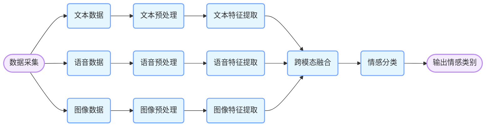

# 开发AI Agent的多模态情感识别系统

> 关键词：AI Agent、多模态情感识别、情感分析、深度学习、跨模态融合

> 摘要：本文聚焦于开发AI Agent的多模态情感识别系统，旨在全面介绍该系统的开发原理、实现步骤和应用场景。首先阐述了多模态情感识别的背景和相关概念，包括其目的、预期读者、文档结构和术语表。接着深入讲解核心概念与联系，通过文本示意图和Mermaid流程图展示其架构。详细介绍核心算法原理并给出Python源代码示例，同时阐述相关数学模型和公式。在项目实战部分，从开发环境搭建、源代码实现到代码解读进行了全面分析。探讨了该系统的实际应用场景，推荐了学习资源、开发工具框架和相关论文著作。最后总结了未来发展趋势与挑战，并提供常见问题解答和扩展阅读参考资料，为开发多模态情感识别系统提供了全面且深入的技术指导。

## 1. 背景介绍 
### 1.1 目的和范围
多模态情感识别系统的开发目的在于使AI Agent能够更准确、全面地理解人类的情感状态。在现实生活中，人类表达情感的方式是多样的，不仅仅局限于语言，还包括面部表情、语音语调、肢体动作等多种模态信息。传统的单模态情感识别方法往往只能捕捉到单一维度的情感信息，存在一定的局限性。而多模态情感识别系统通过融合多种模态的信息，可以更准确地判断人类的情感，为AI Agent在智能客服、智能教育、心理健康监测等领域的应用提供更强大的支持。

本系统的开发范围涵盖了从数据采集、预处理、特征提取、跨模态融合到情感分类的整个流程。同时，还将涉及到多种深度学习模型的应用，如卷积神经网络（CNN）用于图像特征提取，循环神经网络（RNN）及其变体（如LSTM、GRU）用于文本和语音序列特征提取，以及注意力机制等用于跨模态信息的融合。

### 1.2 预期读者
本文预期读者主要包括以下几类人群：
- **人工智能开发者**：希望了解多模态情感识别系统的开发流程和技术细节，以便将其应用到自己的项目中。
- **研究人员**：对多模态情感分析领域感兴趣，希望深入研究相关算法和模型，推动该领域的发展。
- **企业技术人员**：负责开发智能客服、智能机器人等产品，需要借助多模态情感识别技术提升产品的智能化水平。
- **学生**：学习人工智能、计算机科学等相关专业，希望通过本文了解多模态情感识别的基本原理和实践方法。

### 1.3 文档结构概述
本文将按照以下结构进行组织：
- **核心概念与联系**：介绍多模态情感识别的核心概念、原理和架构，通过文本示意图和Mermaid流程图进行直观展示。
- **核心算法原理 & 具体操作步骤**：详细讲解核心算法的原理，并给出Python源代码示例，说明具体的操作步骤。
- **数学模型和公式 & 详细讲解 & 举例说明**：阐述相关的数学模型和公式，进行详细的讲解，并通过具体的例子进行说明。
- **项目实战：代码实际案例和详细解释说明**：从开发环境搭建、源代码实现到代码解读，全面介绍项目实战的过程。
- **实际应用场景**：探讨多模态情感识别系统在不同领域的实际应用场景。
- **工具和资源推荐**：推荐学习资源、开发工具框架和相关论文著作。
- **总结：未来发展趋势与挑战**：总结多模态情感识别系统的未来发展趋势和面临的挑战。
- **附录：常见问题与解答**：提供常见问题的解答，帮助读者解决在开发过程中遇到的问题。
- **扩展阅读 & 参考资料**：提供扩展阅读的建议和参考资料，方便读者进一步深入学习。

### 1.4 术语表
#### 1.4.1 核心术语定义
- **AI Agent**：人工智能代理，是一种能够感知环境、做出决策并采取行动以实现特定目标的智能实体。
- **多模态情感识别**：通过融合多种模态（如文本、语音、图像等）的信息来识别人类情感状态的技术。
- **跨模态融合**：将不同模态的特征信息进行整合，以获得更全面、准确的情感表达。
- **情感分类**：将识别到的情感状态划分到不同的类别中，如高兴、悲伤、愤怒等。

#### 1.4.2 相关概念解释
- **特征提取**：从原始数据中提取出能够代表数据特征的信息，以便后续的处理和分析。
- **深度学习模型**：一类基于人工神经网络的机器学习模型，具有强大的特征学习和表达能力，常用于多模态情感识别。
- **注意力机制**：一种能够自动关注输入信息中重要部分的机制，在跨模态融合中可以帮助模型更好地处理不同模态之间的关系。

#### 1.4.3 缩略词列表
- **CNN**：Convolutional Neural Network，卷积神经网络
- **RNN**：Recurrent Neural Network，循环神经网络
- **LSTM**：Long Short-Term Memory，长短期记忆网络
- **GRU**：Gated Recurrent Unit，门控循环单元

## 2. 核心概念与联系 

### 核心概念原理
多模态情感识别系统的核心原理是通过融合多种模态的信息来更准确地理解人类的情感状态。不同模态的信息包含了不同方面的情感线索，例如文本信息可以传达语义层面的情感，语音信息可以反映语调、语速等情感特征，图像信息可以捕捉面部表情等情感线索。通过将这些不同模态的信息进行整合，可以获得更全面、准确的情感表达。

### 架构的文本示意图
多模态情感识别系统的架构主要包括以下几个部分：
1. **数据采集模块**：负责采集不同模态的数据，如文本、语音、图像等。
2. **预处理模块**：对采集到的数据进行预处理，包括数据清洗、归一化、特征提取等操作。
3. **特征提取模块**：使用不同的深度学习模型对不同模态的数据进行特征提取，如CNN用于图像特征提取，RNN用于文本和语音序列特征提取。
4. **跨模态融合模块**：将不同模态的特征信息进行融合，常用的方法包括早期融合、晚期融合和混合融合等。
5. **情感分类模块**：使用分类器对融合后的特征进行情感分类，输出最终的情感类别。

### Mermaid流程图


## 3. 核心算法原理 & 具体操作步骤 

### 核心算法原理
在多模态情感识别系统中，常用的核心算法包括卷积神经网络（CNN）、循环神经网络（RNN）及其变体（如LSTM、GRU）和注意力机制等。

#### 卷积神经网络（CNN）
CNN主要用于图像特征提取，其核心思想是通过卷积层、池化层和全连接层等结构，自动学习图像中的特征。卷积层通过卷积核在图像上滑动，提取局部特征；池化层用于降低特征图的维度，减少计算量；全连接层将提取到的特征进行整合，输出最终的特征向量。

#### 循环神经网络（RNN）及其变体
RNN及其变体（如LSTM、GRU）主要用于处理序列数据，如文本和语音。RNN的特点是具有循环结构，可以处理序列中的上下文信息。LSTM和GRU是RNN的改进版本，通过引入门控机制，解决了RNN在处理长序列时的梯度消失和梯度爆炸问题。

#### 注意力机制
注意力机制可以帮助模型自动关注输入信息中重要的部分，在跨模态融合中可以更好地处理不同模态之间的关系。注意力机制通过计算每个输入元素的权重，将权重较高的元素赋予更多的注意力。

### 具体操作步骤及Python源代码示例
以下是一个简单的多模态情感识别系统的Python代码示例，使用了PyTorch深度学习框架。

```python
import torch
import torch.nn as nn
import torch.optim as optim

# 定义文本特征提取模型
class TextFeatureExtractor(nn.Module):
    def __init__(self, input_size, hidden_size):
        super(TextFeatureExtractor, self).__init__()
        self.rnn = nn.LSTM(input_size, hidden_size, batch_first=True)

    def forward(self, x):
        _, (h_n, _) = self.rnn(x)
        return h_n.squeeze(0)

# 定义图像特征提取模型
class ImageFeatureExtractor(nn.Module):
    def __init__(self, input_size, hidden_size):
        super(ImageFeatureExtractor, self).__init__()
        self.conv1 = nn.Conv2d(input_size, 32, kernel_size=3, padding=1)
        self.pool = nn.MaxPool2d(2, 2)
        self.fc1 = nn.Linear(32 * 16 * 16, hidden_size)

    def forward(self, x):
        x = self.pool(torch.relu(self.conv1(x)))
        x = x.view(-1, 32 * 16 * 16)
        x = torch.relu(self.fc1(x))
        return x

# 定义跨模态融合模型
class MultiModalFusion(nn.Module):
    def __init__(self, text_hidden_size, image_hidden_size, fusion_hidden_size):
        super(MultiModalFusion, self).__init__()
        self.fc1 = nn.Linear(text_hidden_size + image_hidden_size, fusion_hidden_size)
        self.fc2 = nn.Linear(fusion_hidden_size, 3)  # 假设情感类别有3种

    def forward(self, text_features, image_features):
        combined_features = torch.cat((text_features, image_features), dim=1)
        x = torch.relu(self.fc1(combined_features))
        x = self.fc2(x)
        return x

# 初始化模型
text_input_size = 100
text_hidden_size = 128
image_input_size = 3
image_hidden_size = 128
fusion_hidden_size = 256

text_model = TextFeatureExtractor(text_input_size, text_hidden_size)
image_model = ImageFeatureExtractor(image_input_size, image_hidden_size)
fusion_model = MultiModalFusion(text_hidden_size, image_hidden_size, fusion_hidden_size)

# 定义损失函数和优化器
criterion = nn.CrossEntropyLoss()
optimizer = optim.Adam(list(text_model.parameters()) + list(image_model.parameters()) + list(fusion_model.parameters()), lr=0.001)

# 训练模型
num_epochs = 10
for epoch in range(num_epochs):
    # 假设这里有训练数据 text_data, image_data, labels
    text_data = torch.randn(32, 20, text_input_size)  # 批量大小为32，序列长度为20
    image_data = torch.randn(32, 3, 32, 32)
    labels = torch.randint(0, 3, (32,))

    optimizer.zero_grad()

    text_features = text_model(text_data)
    image_features = image_model(image_data)
    outputs = fusion_model(text_features, image_features)

    loss = criterion(outputs, labels)
    loss.backward()
    optimizer.step()

    print(f'Epoch {epoch+1}/{num_epochs}, Loss: {loss.item()}')
```

## 4. 数学模型和公式 & 详细讲解 & 举例说明 

### 卷积神经网络（CNN）的数学模型和公式
#### 卷积层
卷积层的核心操作是卷积运算，其数学公式如下：
$$y_{i,j}^l = \sum_{m=0}^{M-1} \sum_{n=0}^{N-1} x_{i+m,j+n}^{l-1} \cdot w_{m,n}^l + b^l$$
其中，$y_{i,j}^l$ 是第 $l$ 层卷积层在位置 $(i,j)$ 处的输出，$x_{i+m,j+n}^{l-1}$ 是第 $l-1$ 层在位置 $(i+m,j+n)$ 处的输入，$w_{m,n}^l$ 是第 $l$ 层的卷积核在位置 $(m,n)$ 处的权重，$b^l$ 是第 $l$ 层的偏置，$M$ 和 $N$ 分别是卷积核的高度和宽度。

#### 池化层
池化层常用的操作是最大池化和平均池化。以最大池化为例，其数学公式如下：
$$y_{i,j}^l = \max_{m=0}^{M-1} \max_{n=0}^{N-1} x_{i \cdot s + m,j \cdot s + n}^{l-1}$$
其中，$y_{i,j}^l$ 是第 $l$ 层池化层在位置 $(i,j)$ 处的输出，$x_{i \cdot s + m,j \cdot s + n}^{l-1}$ 是第 $l-1$ 层在位置 $(i \cdot s + m,j \cdot s + n)$ 处的输入，$s$ 是池化窗口的步长，$M$ 和 $N$ 分别是池化窗口的高度和宽度。

### 循环神经网络（RNN）的数学模型和公式
RNN的核心公式如下：
$$h_t = \tanh(W_{hh} h_{t-1} + W_{xh} x_t + b_h)$$
$$y_t = W_{hy} h_t + b_y$$
其中，$h_t$ 是时刻 $t$ 的隐藏状态，$x_t$ 是时刻 $t$ 的输入，$W_{hh}$ 是隐藏状态到隐藏状态的权重矩阵，$W_{xh}$ 是输入到隐藏状态的权重矩阵，$W_{hy}$ 是隐藏状态到输出的权重矩阵，$b_h$ 和 $b_y$ 分别是隐藏状态和输出的偏置。

### 注意力机制的数学模型和公式
注意力机制的核心思想是计算每个输入元素的权重，其数学公式如下：
$$\alpha_i = \frac{\exp(e_i)}{\sum_{j=1}^{n} \exp(e_j)}$$
$$c = \sum_{i=1}^{n} \alpha_i \cdot h_i$$
其中，$e_i$ 是第 $i$ 个输入元素的得分，可以通过不同的方式计算，如点积注意力：
$$e_i = h_i^T \cdot q$$
其中，$h_i$ 是第 $i$ 个输入元素的特征向量，$q$ 是查询向量。$\alpha_i$ 是第 $i$ 个输入元素的权重，$c$ 是上下文向量。

### 举例说明
假设我们有一个简单的图像，其尺寸为 $3 \times 3$，像素值如下：
$$
\begin{bmatrix}
1 & 2 & 3 \\
4 & 5 & 6 \\
7 & 8 & 9
\end{bmatrix}
$$
我们使用一个 $2 \times 2$ 的卷积核，其权重如下：
$$
\begin{bmatrix}
1 & 0 \\
0 & 1
\end{bmatrix}
$$
偏置 $b = 0$。

首先，我们将卷积核在图像上滑动，计算卷积结果。以左上角的 $2 \times 2$ 子图像为例：
$$
\begin{bmatrix}
1 & 2 \\
4 & 5
\end{bmatrix}
$$
卷积运算如下：
$$
\begin{align*}
y_{0,0} &= 1 \times 1 + 2 \times 0 + 4 \times 0 + 5 \times 1 + 0 \\
&= 6
\end{align*}
$$
以此类推，我们可以计算出整个卷积层的输出。

## 5. 项目实战：代码实际案例和详细解释说明 

### 5.1  开发环境搭建
#### 安装Python和Anaconda
首先，我们需要安装Python和Anaconda。Anaconda是一个用于科学计算的Python发行版，包含了许多常用的科学计算库和工具。可以从Anaconda官方网站（https://www.anaconda.com/products/individual）下载适合自己操作系统的安装包，并按照提示进行安装。

#### 创建虚拟环境
为了避免不同项目之间的依赖冲突，我们可以创建一个虚拟环境。打开终端或命令提示符，输入以下命令：
```sh
conda create -n multimodal_env python=3.8
```
其中，`multimodal_env` 是虚拟环境的名称，`python=3.8` 指定了Python的版本。

激活虚拟环境：
```sh
conda activate multimodal_env
```

#### 安装必要的库
在虚拟环境中，我们需要安装一些必要的库，如PyTorch、NumPy、Pandas等。可以使用以下命令进行安装：
```sh
conda install pytorch torchvision torchaudio cudatoolkit=11.3 -c pytorch
conda install numpy pandas matplotlib
```
如果不需要使用GPU，可以去掉 `cudatoolkit=11.3`。

### 5.2  源代码详细实现和代码解读
以下是一个更完整的多模态情感识别系统的源代码示例，包含数据加载、模型定义、训练和测试等部分。

```python
import torch
import torch.nn as nn
import torch.optim as optim
from torch.utils.data import Dataset, DataLoader
import numpy as np
import pandas as pd

# 定义数据集类
class MultiModalDataset(Dataset):
    def __init__(self, text_data, image_data, labels):
        self.text_data = text_data
        self.image_data = image_data
        self.labels = labels

    def __len__(self):
        return len(self.labels)

    def __getitem__(self, idx):
        text = self.text_data[idx]
        image = self.image_data[idx]
        label = self.labels[idx]
        return text, image, label

# 定义文本特征提取模型
class TextFeatureExtractor(nn.Module):
    def __init__(self, input_size, hidden_size):
        super(TextFeatureExtractor, self).__init__()
        self.rnn = nn.LSTM(input_size, hidden_size, batch_first=True)

    def forward(self, x):
        _, (h_n, _) = self.rnn(x)
        return h_n.squeeze(0)

# 定义图像特征提取模型
class ImageFeatureExtractor(nn.Module):
    def __init__(self, input_size, hidden_size):
        super(ImageFeatureExtractor, self).__init__()
        self.conv1 = nn.Conv2d(input_size, 32, kernel_size=3, padding=1)
        self.pool = nn.MaxPool2d(2, 2)
        self.fc1 = nn.Linear(32 * 16 * 16, hidden_size)

    def forward(self, x):
        x = self.pool(torch.relu(self.conv1(x)))
        x = x.view(-1, 32 * 16 * 16)
        x = torch.relu(self.fc1(x))
        return x

# 定义跨模态融合模型
class MultiModalFusion(nn.Module):
    def __init__(self, text_hidden_size, image_hidden_size, fusion_hidden_size):
        super(MultiModalFusion, self).__init__()
        self.fc1 = nn.Linear(text_hidden_size + image_hidden_size, fusion_hidden_size)
        self.fc2 = nn.Linear(fusion_hidden_size, 3)  # 假设情感类别有3种

    def forward(self, text_features, image_features):
        combined_features = torch.cat((text_features, image_features), dim=1)
        x = torch.relu(self.fc1(combined_features))
        x = self.fc2(x)
        return x

# 加载数据
text_data = np.random.randn(100, 20, 100)  # 100个样本，序列长度为20，特征维度为100
image_data = np.random.randn(100, 3, 32, 32)  # 100个样本，通道数为3，图像尺寸为32x32
labels = np.random.randint(0, 3, 100)

# 划分训练集和测试集
train_size = int(0.8 * len(text_data))
train_text = text_data[:train_size]
train_image = image_data[:train_size]
train_labels = labels[:train_size]
test_text = text_data[train_size:]
test_image = image_data[train_size:]
test_labels = labels[train_size:]

# 创建数据集和数据加载器
train_dataset = MultiModalDataset(train_text, train_image, train_labels)
train_loader = DataLoader(train_dataset, batch_size=32, shuffle=True)
test_dataset = MultiModalDataset(test_text, test_image, test_labels)
test_loader = DataLoader(test_dataset, batch_size=32, shuffle=False)

# 初始化模型
text_input_size = 100
text_hidden_size = 128
image_input_size = 3
image_hidden_size = 128
fusion_hidden_size = 256

text_model = TextFeatureExtractor(text_input_size, text_hidden_size)
image_model = ImageFeatureExtractor(image_input_size, image_hidden_size)
fusion_model = MultiModalFusion(text_hidden_size, image_hidden_size, fusion_hidden_size)

# 定义损失函数和优化器
criterion = nn.CrossEntropyLoss()
optimizer = optim.Adam(list(text_model.parameters()) + list(image_model.parameters()) + list(fusion_model.parameters()), lr=0.001)

# 训练模型
num_epochs = 10
for epoch in range(num_epochs):
    running_loss = 0.0
    for text, image, labels in train_loader:
        text = text.float()
        image = image.float()
        labels = labels.long()

        optimizer.zero_grad()

        text_features = text_model(text)
        image_features = image_model(image)
        outputs = fusion_model(text_features, image_features)

        loss = criterion(outputs, labels)
        loss.backward()
        optimizer.step()

        running_loss += loss.item()

    print(f'Epoch {epoch+1}/{num_epochs}, Loss: {running_loss / len(train_loader)}')

# 测试模型
correct = 0
total = 0
with torch.no_grad():
    for text, image, labels in test_loader:
        text = text.float()
        image = image.float()
        labels = labels.long()

        text_features = text_model(text)
        image_features = image_model(image)
        outputs = fusion_model(text_features, image_features)
        _, predicted = torch.max(outputs.data, 1)
        total += labels.size(0)
        correct += (predicted == labels).sum().item()

print(f'Accuracy on test set: {100 * correct / total}%')
```

### 5.3  代码解读与分析
#### 数据集类 `MultiModalDataset`
该类继承自 `torch.utils.data.Dataset`，用于封装多模态数据。`__init__` 方法接收文本数据、图像数据和标签作为输入，`__len__` 方法返回数据集的长度，`__getitem__` 方法根据索引返回对应的文本、图像和标签。

#### 文本特征提取模型 `TextFeatureExtractor`
该模型使用LSTM网络对文本数据进行特征提取。`__init__` 方法初始化LSTM层，`forward` 方法定义了前向传播过程，返回最后一个时间步的隐藏状态。

#### 图像特征提取模型 `ImageFeatureExtractor`
该模型使用卷积神经网络对图像数据进行特征提取。`__init__` 方法初始化卷积层、池化层和全连接层，`forward` 方法定义了前向传播过程，返回提取到的图像特征。

#### 跨模态融合模型 `MultiModalFusion`
该模型将文本特征和图像特征进行融合，并输出情感分类结果。`__init__` 方法初始化全连接层，`forward` 方法将文本特征和图像特征拼接在一起，经过全连接层进行分类。

#### 数据加载和训练
使用 `torch.utils.data.DataLoader` 加载数据集，将数据划分为训练集和测试集。在训练过程中，使用交叉熵损失函数和Adam优化器进行模型训练。

#### 测试模型
在测试集上评估模型的准确率，使用 `torch.max` 函数获取预测结果，计算准确率。

## 6. 实际应用场景 
### 智能客服
在智能客服系统中，多模态情感识别系统可以帮助客服人员更好地理解客户的情感状态。通过分析客户的语音语调、文本内容和面部表情等信息，系统可以判断客户是高兴、生气还是沮丧，从而提供更个性化的服务。例如，如果客户处于愤怒状态，客服人员可以及时采取安抚措施，提高客户满意度。

### 智能教育
在智能教育领域，多模态情感识别系统可以用于监测学生的学习状态和情感变化。通过分析学生的面部表情、语音和文本反馈等信息，系统可以了解学生是否对学习内容感兴趣、是否遇到困难等，从而为学生提供更有针对性的学习建议和辅导。例如，如果学生表现出困惑或沮丧的情绪，系统可以及时调整教学策略，提供额外的帮助。

### 心理健康监测
多模态情感识别系统可以用于心理健康监测，帮助专业人员及时发现潜在的心理问题。通过长期监测个体的语音、文本和面部表情等信息，系统可以分析个体的情感变化趋势，判断是否存在抑郁、焦虑等心理问题的迹象。例如，如果一个人的情绪长期处于低落状态，系统可以及时提醒专业人员进行干预。

### 智能娱乐
在智能娱乐领域，多模态情感识别系统可以用于实现更加个性化的娱乐体验。例如，在虚拟现实游戏中，系统可以根据玩家的情感状态实时调整游戏情节和难度，提高游戏的趣味性和沉浸感。如果玩家表现出兴奋的情绪，系统可以增加游戏的刺激程度；如果玩家感到紧张，系统可以适当降低难度。

## 7. 工具和资源推荐
### 7.1 学习资源推荐
#### 7.1.1 书籍推荐
- 《深度学习》（Deep Learning）：由Ian Goodfellow、Yoshua Bengio和Aaron Courville所著，是深度学习领域的经典教材，涵盖了深度学习的基本原理、算法和应用。
- 《Python深度学习》（Deep Learning with Python）：由Francois Chollet所著，介绍了如何使用Python和Keras框架进行深度学习开发，包含了许多实际案例。
- 《人工智能：一种现代的方法》（Artificial Intelligence: A Modern Approach）：由Stuart Russell和Peter Norvig所著，是人工智能领域的权威教材，涵盖了人工智能的各个方面，包括多模态情感识别。

#### 7.1.2 在线课程
- Coursera上的“深度学习专项课程”（Deep Learning Specialization）：由Andrew Ng教授授课，包含了深度学习的基础课程和高级课程，是学习深度学习的优质资源。
- edX上的“人工智能导论”（Introduction to Artificial Intelligence）：由MIT的教师授课，介绍了人工智能的基本概念和算法，包括多模态情感识别的相关内容。
- 哔哩哔哩（B站）上有许多关于深度学习和人工智能的教学视频，如李宏毅教授的“机器学习”课程，讲解生动易懂。

#### 7.1.3 技术博客和网站
- Medium：是一个技术博客平台，有许多关于深度学习和多模态情感识别的优质文章。
- arXiv：是一个预印本平台，提供了许多最新的学术研究论文，可以及时了解多模态情感识别领域的最新进展。
- Kaggle：是一个数据科学竞赛平台，有许多关于情感分析和多模态数据处理的竞赛和数据集，可以通过参与竞赛来提高自己的实践能力。

### 7.2 开发工具框架推荐
#### 7.2.1 IDE和编辑器
- PyCharm：是一款专门为Python开发设计的集成开发环境（IDE），具有代码自动补全、调试、版本控制等功能，非常适合深度学习开发。
- Jupyter Notebook：是一个交互式的开发环境，可以在浏览器中编写和运行代码，支持Markdown文本和可视化，非常适合数据探索和模型实验。
- Visual Studio Code：是一款轻量级的代码编辑器，支持多种编程语言和插件，通过安装相关插件可以实现深度学习开发的功能。

#### 7.2.2 调试和性能分析工具
- PyTorch Profiler：是PyTorch官方提供的性能分析工具，可以帮助开发者分析模型的运行时间、内存使用等情况，优化模型性能。
- TensorBoard：是TensorFlow官方提供的可视化工具，也可以与PyTorch结合使用，用于可视化模型的训练过程、损失曲线、准确率等指标。
- NVIDIA Nsight Systems：是NVIDIA提供的性能分析工具，可以帮助开发者分析GPU的使用情况，优化GPU代码。

#### 7.2.3 相关框架和库
- PyTorch：是一个开源的深度学习框架，具有动态图机制，易于使用和调试，广泛应用于多模态情感识别领域。
- TensorFlow：是另一个流行的深度学习框架，具有强大的分布式训练和部署能力，也有许多关于多模态数据处理的工具和库。
- Scikit-learn：是一个用于机器学习的Python库，提供了许多常用的机器学习算法和工具，如数据预处理、特征提取、模型评估等。

### 7.3 相关论文著作推荐
#### 7.3.1 经典论文
- "Attention Is All You Need"：提出了Transformer模型，引入了注意力机制，对自然语言处理和多模态情感识别领域产生了深远影响。
- "Long Short-Term Memory"：介绍了LSTM网络的原理和应用，解决了RNN在处理长序列时的梯度消失和梯度爆炸问题。
- "Convolutional Neural Networks for Sentence Classification"：将卷积神经网络应用于文本分类任务，为文本情感分析提供了新的思路。

#### 7.3.2 最新研究成果
- 可以通过arXiv、ACM Digital Library、IEEE Xplore等学术数据库搜索最新的多模态情感识别研究成果，了解该领域的前沿技术和发展趋势。

#### 7.3.3 应用案例分析
- 许多学术会议和期刊会发表多模态情感识别系统的应用案例分析，如ACM Multimedia、IEEE International Conference on Multimedia and Expo等，可以从中学习到实际项目的开发经验和方法。

## 8. 总结：未来发展趋势与挑战
### 未来发展趋势
#### 多模态数据融合技术的进一步发展
随着传感器技术的不断进步，未来可以获取到更多种类、更高质量的多模态数据。因此，如何更有效地融合这些数据将是未来的研究重点。例如，开发更先进的跨模态融合算法，能够更好地处理不同模态数据之间的关系，提高情感识别的准确率。

#### 结合更多的上下文信息
目前的多模态情感识别系统主要关注当前时刻的多模态数据，未来可以结合更多的上下文信息，如对话历史、用户的个人信息等，以更全面地理解用户的情感状态。例如，在智能客服系统中，结合用户的历史咨询记录和购买行为，能够更准确地判断用户的情感和需求。

#### 应用领域的不断拓展
多模态情感识别系统的应用领域将不断拓展，除了智能客服、智能教育、心理健康监测和智能娱乐等领域，还可以应用于智能家居、自动驾驶、医疗保健等领域。例如，在智能家居中，根据用户的情感状态自动调节室内环境，提供更加个性化的服务。

### 面临的挑战
#### 数据标注的困难
多模态情感识别需要大量的标注数据来训练模型，但数据标注是一项非常耗时、耗力的工作。特别是对于多模态数据，需要同时标注不同模态的数据，增加了标注的难度。此外，情感的主观性也使得标注结果存在一定的差异，影响模型的训练效果。

#### 跨模态信息的语义鸿沟
不同模态的数据具有不同的语义表示，如何跨越这些语义鸿沟，实现有效的跨模态信息融合是一个挑战。例如，文本中的情感表达和图像中的情感表达可能存在很大的差异，需要开发新的方法来处理这种差异。

#### 模型的可解释性
深度学习模型在多模态情感识别中取得了很好的效果，但这些模型往往是黑盒模型，缺乏可解释性。在一些对安全性和可靠性要求较高的应用场景中，如医疗保健和自动驾驶，模型的可解释性是非常重要的。因此，如何提高模型的可解释性是未来需要解决的问题之一。

## 9. 附录：常见问题与解答
### 问题1：多模态情感识别系统需要哪些硬件设备？
答：多模态情感识别系统需要根据具体的应用场景选择合适的硬件设备。一般来说，需要摄像头来采集图像数据，麦克风来采集语音数据。如果需要处理大量的数据和进行复杂的模型训练，可能需要配备高性能的GPU服务器。

### 问题2：如何选择合适的深度学习模型？
答：选择合适的深度学习模型需要考虑多个因素，如数据的特点、任务的复杂度和计算资源等。对于图像数据，可以选择卷积神经网络（CNN）；对于文本和语音序列数据，可以选择循环神经网络（RNN）及其变体（如LSTM、GRU）或Transformer模型。在跨模态融合方面，可以根据具体情况选择早期融合、晚期融合或混合融合等方法。

### 问题3：如何提高多模态情感识别系统的准确率？
答：可以从以下几个方面提高多模态情感识别系统的准确率：
- 收集更多高质量的标注数据，增加数据的多样性和丰富性。
- 优化数据预处理步骤，如数据清洗、归一化、特征提取等，提高数据的质量。
- 选择合适的深度学习模型，并进行模型调优，如调整超参数、使用正则化方法等。
- 采用更先进的跨模态融合算法，充分利用不同模态数据之间的互补信息。

### 问题4：多模态情感识别系统的部署有哪些注意事项？
答：在部署多模态情感识别系统时，需要注意以下几点：
- 确保硬件设备的性能能够满足系统的需求，特别是对于实时性要求较高的应用场景。
- 对模型进行优化和压缩，减少模型的大小和计算量，提高模型的运行效率。
- 考虑数据的安全性和隐私保护，采取必要的措施对数据进行加密和存储。
- 进行充分的测试和验证，确保系统在实际应用中的稳定性和可靠性。

## 10. 扩展阅读 & 参考资料
### 扩展阅读
- 《自然语言处理入门》：深入了解自然语言处理的基本原理和技术，有助于更好地处理文本数据在多模态情感识别中的应用。
- 《计算机视觉：算法与应用》：学习计算机视觉的相关知识，包括图像特征提取、目标检测等技术，对处理图像数据有很大帮助。
- 《语音信号处理》：了解语音信号的处理方法和技术，如语音特征提取、语音识别等，为处理语音数据提供理论支持。

### 参考资料
- Goodfellow, I., Bengio, Y., & Courville, A. (2016). Deep Learning. MIT Press.
- Chollet, F. (2017). Deep Learning with Python. Manning Publications.
- Russell, S. J., & Norvig, P. (2020). Artificial Intelligence: A Modern Approach. Pearson.
- Vaswani, A., Shazeer, N., Parmar, N., Uszkoreit, J., Jones, L., Gomez, A. N.,... & Polosukhin, I. (2017). Attention is all you need. Advances in neural information processing systems, 5998-6008.
- Hochreiter, S., & Schmidhuber, J. (1997). Long short-term memory. Neural computation, 9(8), 1735-1780.
- Kim, Y. (2014). Convolutional neural networks for sentence classification. arXiv preprint arXiv:1408.5882.

作者：AI天才研究院/AI Genius Institute & 禅与计算机程序设计艺术 /Zen And The Art of Computer Programming