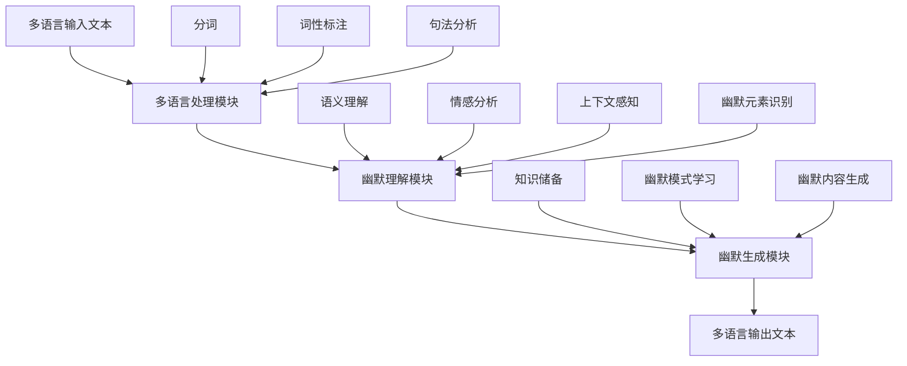

# 开发AI Agent的多语言幽默理解与生成系统

> 关键词：AI Agent、多语言、幽默理解、幽默生成、自然语言处理

> 摘要：本文围绕开发AI Agent的多语言幽默理解与生成系统展开深入探讨。首先介绍了该系统开发的背景、目的、预期读者和文档结构等信息。接着详细阐述了系统涉及的核心概念、联系以及相关原理架构，并通过Mermaid流程图直观展示。核心算法原理部分使用Python代码进行了详细讲解，同时给出了数学模型和公式并举例说明。项目实战环节涵盖了开发环境搭建、源代码实现与解读。还分析了系统的实际应用场景，推荐了学习资源、开发工具框架以及相关论文著作。最后对系统的未来发展趋势与挑战进行总结，并给出常见问题解答和扩展阅读参考资料，旨在为开发多语言幽默理解与生成系统提供全面而深入的指导。

## 1. 背景介绍 
### 1.1 目的和范围
在当今全球化的时代，不同语言和文化背景的人们之间的交流日益频繁。幽默作为人类交流中不可或缺的一部分，能够增进人际关系、缓解紧张气氛。开发AI Agent的多语言幽默理解与生成系统的目的在于让AI能够理解不同语言中的幽默表达，并生成合适的幽默内容，以提升人机交互的趣味性和自然度。

本系统的范围涵盖了多种常见语言，如英语、汉语、法语、德语等，能够处理不同类型的幽默，包括双关语、讽刺、笑话等。同时，系统将具备一定的学习和自适应能力，能够随着时间的推移不断提高幽默理解和生成的准确性和质量。

### 1.2 预期读者
本文的预期读者主要包括以下几类人群：
- 人工智能领域的研究人员和开发者，他们对自然语言处理、机器学习等技术有一定的了解，希望探索幽默理解与生成的相关技术。
- 软件工程师，负责开发实际的AI Agent系统，需要掌握多语言处理和幽默生成的具体实现方法。
- 对人工智能和幽默研究感兴趣的学者和爱好者，他们希望了解该领域的最新进展和技术原理。

### 1.3 文档结构概述
本文将按照以下结构进行组织：
- 核心概念与联系：介绍系统涉及的核心概念、原理和架构，并通过示意图和流程图进行展示。
- 核心算法原理 & 具体操作步骤：使用Python代码详细讲解核心算法的原理和实现步骤。
- 数学模型和公式 & 详细讲解 & 举例说明：给出系统所使用的数学模型和公式，并进行详细解释和举例。
- 项目实战：代码实际案例和详细解释说明，包括开发环境搭建、源代码实现和代码解读。
- 实际应用场景：分析系统在不同领域的实际应用场景。
- 工具和资源推荐：推荐学习资源、开发工具框架和相关论文著作。
- 总结：未来发展趋势与挑战：对系统的未来发展进行展望，并分析可能面临的挑战。
- 附录：常见问题与解答：解答读者在开发过程中可能遇到的常见问题。
- 扩展阅读 & 参考资料：提供相关的扩展阅读材料和参考资料。

### 1.4 术语表
#### 1.4.1 核心术语定义
- **AI Agent**：人工智能代理，是一种能够感知环境、做出决策并采取行动的智能实体。
- **多语言**：指系统能够处理和理解多种不同语言的文本。
- **幽默理解**：指系统能够识别和理解文本中的幽默元素和意图。
- **幽默生成**：指系统能够根据给定的情境和要求生成合适的幽默内容。
- **自然语言处理（NLP）**：是计算机科学与人工智能领域中的一个重要方向，主要研究如何让计算机理解和处理人类语言。

#### 1.4.2 相关概念解释
- **语义理解**：指对文本的语义信息进行分析和理解，包括词汇、句子和篇章的含义。
- **情感分析**：指对文本中表达的情感倾向进行分析和判断，如积极、消极或中性。
- **上下文感知**：指系统能够根据文本的上下文信息来理解和生成幽默内容，以确保其合理性和连贯性。

#### 1.4.3 缩略词列表
- **NLP**：Natural Language Processing（自然语言处理）
- **ML**：Machine Learning（机器学习）
- **DL**：Deep Learning（深度学习）
- **RNN**：Recurrent Neural Network（循环神经网络）
- **LSTM**：Long Short-Term Memory（长短期记忆网络）
- **GRU**：Gated Recurrent Unit（门控循环单元）

## 2. 核心概念与联系 
### 核心概念原理
本系统的核心目标是实现AI Agent对多语言幽默的理解与生成。为了达到这个目标，需要涉及多个关键概念和技术。

#### 多语言处理
多语言处理是系统的基础，它包括对不同语言的文本进行分词、词性标注、句法分析等操作。由于不同语言的语法和词汇结构差异很大，需要使用专门的工具和技术来处理。例如，对于中文，需要使用中文分词工具将文本分割成单个的词语；对于英语，可以使用NLTK等工具进行词性标注和句法分析。

#### 幽默理解
幽默理解是一个复杂的过程，需要结合语义理解、情感分析和上下文感知等技术。系统需要能够识别文本中的幽默元素，如双关语、夸张、讽刺等，并理解其背后的意图。例如，对于句子“Time flies like an arrow. Fruit flies like a banana.”，系统需要能够识别出“flies”这个词的双关含义，从而理解其中的幽默。

#### 幽默生成
幽默生成是在理解幽默的基础上，根据给定的情境和要求生成合适的幽默内容。这需要系统具备一定的知识储备和创造力。系统可以通过学习大量的幽默文本，掌握幽默的模式和规律，然后根据这些模式和规律生成新的幽默内容。例如，系统可以学习到笑话的结构和套路，然后根据不同的主题生成新的笑话。

### 架构的文本示意图
```plaintext
多语言输入文本
|
|-- 多语言处理模块
|   |-- 分词
|   |-- 词性标注
|   |-- 句法分析
|
|-- 幽默理解模块
|   |-- 语义理解
|   |-- 情感分析
|   |-- 上下文感知
|   |-- 幽默元素识别
|
|-- 幽默生成模块
|   |-- 知识储备
|   |-- 幽默模式学习
|   |-- 幽默内容生成
|
|-- 多语言输出文本
```

### Mermaid流程图


## 3. 核心算法原理 & 具体操作步骤 
### 多语言处理算法
多语言处理的核心是对不同语言的文本进行分词和词性标注。这里我们以Python为例，使用NLTK库进行英语文本的处理，使用jieba库进行中文文本的处理。

```python
import nltk
import jieba

# 英语文本处理
def english_text_processing(text):
    # 分词
    tokens = nltk.word_tokenize(text)
    # 词性标注
    pos_tags = nltk.pos_tag(tokens)
    return pos_tags

# 中文文本处理
def chinese_text_processing(text):
    # 分词
    tokens = jieba.lcut(text)
    return tokens

# 示例
english_text = "Time flies like an arrow."
chinese_text = "时间过得像箭一样快。"

english_result = english_text_processing(english_text)
chinese_result = chinese_text_processing(chinese_text)

print("英语处理结果:", english_result)
print("中文处理结果:", chinese_result)
```

### 幽默理解算法
幽默理解的核心是识别文本中的幽默元素。这里我们可以使用机器学习算法，如支持向量机（SVM），来进行幽默分类。首先，我们需要准备一个包含幽默和非幽默文本的数据集，然后使用这个数据集训练SVM模型。

```python
from sklearn.feature_extraction.text import TfidfVectorizer
from sklearn.svm import SVC
from sklearn.model_selection import train_test_split
from sklearn.metrics import accuracy_score

# 示例数据集
humorous_texts = ["Why is the doctor so angry? Because he has no patience (patients).", "I'm reading a book about anti-gravity. It's impossible to put down."]
non_humorous_texts = ["I went to the supermarket and bought some fruits.", "The weather is nice today."]

# 合并数据集
texts = humorous_texts + non_humorous_texts
labels = [1] * len(humorous_texts) + [0] * len(non_humorous_texts)

# 特征提取
vectorizer = TfidfVectorizer()
X = vectorizer.fit_transform(texts)

# 划分训练集和测试集
X_train, X_test, y_train, y_test = train_test_split(X, labels, test_size=0.2, random_state=42)

# 训练SVM模型
model = SVC()
model.fit(X_train, y_train)

# 预测
y_pred = model.predict(X_test)

# 计算准确率
accuracy = accuracy_score(y_test, y_pred)
print("幽默分类准确率:", accuracy)
```

### 幽默生成算法
幽默生成可以使用基于模板的方法。首先，我们需要定义一些幽默模板，然后根据不同的主题和情境填充模板中的变量。

```python
# 幽默模板
templates = [
    "Why is the {noun} so {adjective}? Because it has no {pun_noun} ({real_noun}).",
    "I'm {verb_ing} a {noun} about {topic}. It's {adjective} to {verb}."
]

# 填充模板
def generate_humor(template_index, noun, adjective, pun_noun, real_noun, verb_ing, topic, verb):
    template = templates[template_index]
    humor = template.format(noun=noun, adjective=adjective, pun_noun=pun_noun, real_noun=real_noun, verb_ing=verb_ing, topic=topic, verb=verb)
    return humor

# 示例
humor = generate_humor(0, "teacher", "angry", "pupilience", "pupils")
print("生成的幽默内容:", humor)
```

## 4. 数学模型和公式 & 详细讲解 & 举例说明 
### TF-IDF模型
TF-IDF（Term Frequency-Inverse Document Frequency）是一种常用的文本特征提取方法，用于衡量一个词在文档中的重要性。

#### 公式
- **词频（TF）**：指一个词在文档中出现的频率。
$$TF_{t,d}=\frac{f_{t,d}}{\sum_{t'\in d}f_{t',d}}$$
其中，$f_{t,d}$ 表示词 $t$ 在文档 $d$ 中出现的次数，$\sum_{t'\in d}f_{t',d}$ 表示文档 $d$ 中所有词的出现次数之和。

- **逆文档频率（IDF）**：指一个词在整个文档集合中的普遍程度。
$$IDF_{t}=\log\frac{N}{df_{t}}$$
其中，$N$ 表示文档集合中的文档总数，$df_{t}$ 表示包含词 $t$ 的文档数。

- **TF-IDF值**：
$$TF - IDF_{t,d}=TF_{t,d}\times IDF_{t}$$

#### 详细讲解
TF-IDF的核心思想是，如果一个词在某个文档中出现的频率很高，但在整个文档集合中出现的频率很低，那么这个词对于该文档的重要性就很高。通过计算TF-IDF值，可以将文本转化为向量表示，用于机器学习算法的输入。

#### 举例说明
假设我们有一个文档集合包含3个文档：
- $d_1$: "I like apples."
- $d_2$: "I like bananas."
- $d_3$: "He likes oranges."

对于词 "apples"，在文档 $d_1$ 中出现的次数 $f_{apples,d_1}=1$，文档 $d_1$ 中所有词的出现次数之和为3，所以 $TF_{apples,d_1}=\frac{1}{3}$。包含词 "apples" 的文档数 $df_{apples}=1$，文档集合中的文档总数 $N = 3$，所以 $IDF_{apples}=\log\frac{3}{1}\approx1.099$。则 $TF - IDF_{apples,d_1}=\frac{1}{3}\times1.099\approx0.366$。

### 支持向量机（SVM）模型
支持向量机是一种常用的二分类模型，用于将数据分为两个类别。

#### 公式
SVM的目标是找到一个最优的超平面，使得不同类别的数据点能够被最大程度地分开。对于线性可分的情况，超平面的方程为：
$$w^T x + b = 0$$
其中，$w$ 是超平面的法向量，$b$ 是偏置项，$x$ 是数据点的特征向量。

SVM的优化目标是最大化间隔，即：
$$\max_{\omega,b}\frac{2}{\|\omega\|}$$
subject to:
$$y_i(\omega^T x_i + b)\geq1, i = 1,2,\cdots,n$$
其中，$y_i$ 是数据点 $x_i$ 的类别标签（$y_i\in\{-1,1\}$），$n$ 是数据点的数量。

#### 详细讲解
SVM通过寻找最优的超平面来实现分类。间隔是指超平面到最近的数据点的距离，最大化间隔可以提高模型的泛化能力。在实际应用中，数据往往不是线性可分的，这时可以使用核函数将数据映射到高维空间，使得数据在高维空间中线性可分。

#### 举例说明
假设我们有一个二维数据集，包含两个类别的数据点：
- 类别1：$(1,1)$，$(2,2)$
- 类别2：$(3,3)$，$(4,4)$

我们可以使用SVM来找到一个最优的超平面将这两个类别分开。通过求解优化问题，得到超平面的方程为 $w^T x + b = 0$，其中 $w$ 和 $b$ 是最优解。

## 5. 项目实战：代码实际案例和详细解释说明 
### 5.1  开发环境搭建
#### 安装Python
首先，需要安装Python环境。可以从Python官方网站（https://www.python.org/downloads/）下载适合自己操作系统的Python版本，并按照安装向导进行安装。

#### 安装必要的库
在项目中，我们需要使用一些Python库，如NLTK、jieba、scikit-learn等。可以使用pip命令来安装这些库：
```sh
pip install nltk jieba scikit-learn
```

#### 下载NLTK数据
安装NLTK库后，还需要下载一些必要的数据，如分词器和词性标注器。可以在Python交互式环境中运行以下代码来下载数据：
```python
import nltk
nltk.download('punkt')
nltk.download('averaged_perceptron_tagger')
```

### 5.2  源代码详细实现和代码解读
以下是一个完整的多语言幽默理解与生成系统的源代码示例：

```python
import nltk
import jieba
from sklearn.feature_extraction.text import TfidfVectorizer
from sklearn.svm import SVC
from sklearn.model_selection import train_test_split
from sklearn.metrics import accuracy_score

# 英语文本处理
def english_text_processing(text):
    # 分词
    tokens = nltk.word_tokenize(text)
    # 词性标注
    pos_tags = nltk.pos_tag(tokens)
    return pos_tags

# 中文文本处理
def chinese_text_processing(text):
    # 分词
    tokens = jieba.lcut(text)
    return tokens

# 幽默理解模块
def humor_understanding(texts, labels):
    # 特征提取
    vectorizer = TfidfVectorizer()
    X = vectorizer.fit_transform(texts)

    # 划分训练集和测试集
    X_train, X_test, y_train, y_test = train_test_split(X, labels, test_size=0.2, random_state=42)

    # 训练SVM模型
    model = SVC()
    model.fit(X_train, y_train)

    # 预测
    y_pred = model.predict(X_test)

    # 计算准确率
    accuracy = accuracy_score(y_test, y_pred)
    return model, accuracy

# 幽默生成模块
templates = [
    "Why is the {noun} so {adjective}? Because it has no {pun_noun} ({real_noun}).",
    "I'm {verb_ing} a {noun} about {topic}. It's {adjective} to {verb}."
]

def generate_humor(template_index, noun, adjective, pun_noun, real_noun, verb_ing, topic, verb):
    template = templates[template_index]
    humor = template.format(noun=noun, adjective=adjective, pun_noun=pun_noun, real_noun=real_noun, verb_ing=verb_ing, topic=topic, verb=verb)
    return humor

# 示例数据集
humorous_texts = ["Why is the doctor so angry? Because he has no patience (patients).", "I'm reading a book about anti-gravity. It's impossible to put down."]
non_humorous_texts = ["I went to the supermarket and bought some fruits.", "The weather is nice today."]

# 合并数据集
texts = humorous_texts + non_humorous_texts
labels = [1] * len(humorous_texts) + [0] * len(non_humorous_texts)

# 幽默理解
model, accuracy = humor_understanding(texts, labels)
print("幽默分类准确率:", accuracy)

# 幽默生成
humor = generate_humor(0, "teacher", "angry", "pupilience", "pupils")
print("生成的幽默内容:", humor)
```

### 5.3  代码解读与分析
#### 多语言处理部分
- `english_text_processing` 函数使用NLTK库对英语文本进行分词和词性标注。
- `chinese_text_processing` 函数使用jieba库对中文文本进行分词。

#### 幽默理解部分
- `humor_understanding` 函数使用TF-IDF进行特征提取，然后使用SVM模型进行幽默分类。通过划分训练集和测试集，计算模型的准确率。

#### 幽默生成部分
- `generate_humor` 函数根据预定义的幽默模板，填充变量生成幽默内容。

通过这个代码示例，我们可以看到一个简单的多语言幽默理解与生成系统的实现过程。在实际应用中，可以根据需要对代码进行扩展和优化。

## 6. 实际应用场景 
### 智能客服
在智能客服系统中，引入多语言幽默理解与生成系统可以提升用户体验。当用户遇到问题或感到不满时，客服AI可以使用幽默的语言来缓解用户的情绪，增加用户的好感度。例如，当用户抱怨商品发货慢时，客服AI可以回复：“别着急，您的宝贝正在乘坐‘慢悠悠号’列车向您赶来呢！”

### 社交聊天机器人
社交聊天机器人可以利用多语言幽默理解与生成系统与用户进行更加有趣和自然的对话。在聊天过程中，机器人能够识别用户的幽默表达并给予回应，同时也可以主动生成幽默内容来活跃气氛。比如，当用户提到天气很热时，机器人可以说：“这天气热得我都快变成‘热狗’啦！”

### 教育领域
在教育领域，该系统可以应用于智能教学助手。在讲解枯燥的知识时，教学助手可以使用幽默的方式来吸引学生的注意力，提高学习的趣味性。例如，在讲解数学公式时，教学助手可以说：“这个公式就像一个神秘的魔法咒语，只要你念对了，答案就会乖乖跑出来！”

### 娱乐产业
在娱乐产业中，多语言幽默理解与生成系统可以用于创作笑话、剧本等内容。编剧可以利用该系统获取灵感，生成新颖的幽默情节和台词。同时，在一些互动娱乐游戏中，也可以使用该系统让游戏角色说出幽默的话语，增加游戏的趣味性。

## 7. 工具和资源推荐
### 7.1 学习资源推荐
#### 7.1.1 书籍推荐
- 《自然语言处理入门》：这本书详细介绍了自然语言处理的基本概念、算法和技术，适合初学者入门。
- 《Python自然语言处理》：以Python为工具，讲解了自然语言处理的实际应用，包含大量的代码示例。
- 《深度学习》：深度学习在自然语言处理中有着广泛的应用，这本书是深度学习领域的经典著作。

#### 7.1.2 在线课程
- Coursera上的“Natural Language Processing Specialization”：由顶尖高校的教授授课，系统地介绍了自然语言处理的各个方面。
- edX上的“Deep Learning for Natural Language Processing”：专注于深度学习在自然语言处理中的应用。
- 中国大学MOOC上的“自然语言处理”：国内高校开设的课程，结合了理论和实践。

#### 7.1.3 技术博客和网站
- Medium：上面有很多关于自然语言处理和人工智能的技术文章，涵盖了最新的研究成果和实践经验。
- arXiv：提供了大量的学术论文，包括自然语言处理领域的最新研究。
- 机器之心：关注人工智能领域的前沿动态，有很多关于自然语言处理的深度报道和解读。

### 7.2 开发工具框架推荐
#### 7.2.1 IDE和编辑器
- PyCharm：是一款专业的Python集成开发环境，提供了丰富的功能和插件，方便代码的编写和调试。
- Jupyter Notebook：交互式的开发环境，适合进行数据探索和模型实验，能够实时展示代码的运行结果。
- Visual Studio Code：轻量级的代码编辑器，支持多种编程语言，有丰富的扩展插件。

#### 7.2.2 调试和性能分析工具
- PDB：Python自带的调试工具，可以帮助开发者定位代码中的问题。
- cProfile：用于分析Python代码的性能，找出代码中的瓶颈。
- TensorBoard：用于可视化深度学习模型的训练过程和性能指标。

#### 7.2.3 相关框架和库
- NLTK：自然语言处理工具包，提供了丰富的文本处理功能，如分词、词性标注、句法分析等。
- jieba：中文分词库，在中文自然语言处理中广泛使用。
- scikit-learn：机器学习库，包含了多种机器学习算法和工具，方便进行模型训练和评估。
- TensorFlow和PyTorch：深度学习框架，用于构建和训练深度学习模型。

### 7.3 相关论文著作推荐
#### 7.3.1 经典论文
- “A Statistical Approach to Machine Translation”：奠定了统计机器翻译的基础，对自然语言处理的发展产生了深远影响。
- “Long Short-Term Memory”：介绍了长短期记忆网络（LSTM），解决了循环神经网络中的梯度消失问题。
- “Attention Is All You Need”：提出了Transformer模型，在自然语言处理领域取得了巨大的成功。

#### 7.3.2 最新研究成果
- 在ACL（Association for Computational Linguistics）、EMNLP（Conference on Empirical Methods in Natural Language Processing）等顶级自然语言处理会议上发表的论文，代表了该领域的最新研究成果。
- arXiv上关于幽默理解与生成的最新研究论文，可以关注相关的关键词，如“humor understanding”、“humor generation”等。

#### 7.3.3 应用案例分析
- 一些企业和研究机构发布的关于多语言幽默理解与生成系统的应用案例分析报告，可以了解该技术在实际应用中的效果和挑战。

## 8. 总结：未来发展趋势与挑战
### 未来发展趋势
#### 融合多模态信息
未来的多语言幽默理解与生成系统将不仅仅局限于文本信息，还会融合图像、音频、视频等多模态信息。例如，在识别幽默时，可以结合表情、语气等因素，提高幽默理解的准确性；在生成幽默时，可以生成包含图像和音频的幽默内容，增强幽默的表现力。

#### 个性化幽默生成
随着人工智能技术的发展，系统将能够根据用户的个性化信息，如兴趣爱好、语言习惯、情感状态等，生成更加符合用户口味的幽默内容。这样可以提高用户与系统的互动体验，增强用户的粘性。

#### 跨文化幽默处理
在全球化的背景下，跨文化幽默处理将成为一个重要的发展方向。系统需要能够理解不同文化背景下的幽默差异，生成适合不同文化的幽默内容，促进不同文化之间的交流和理解。

### 挑战
#### 幽默的主观性和多样性
幽默是一种非常主观的现象，不同的人对幽默的理解和感受可能不同。同时，幽默的形式和类型也非常多样，包括双关语、讽刺、笑话等，这给幽默理解和生成带来了很大的挑战。

#### 多语言语义理解
不同语言的语法、词汇和语义结构差异很大，要实现准确的多语言语义理解是一个难题。特别是一些具有文化内涵的幽默表达，需要深入了解语言背后的文化背景才能理解其含义。

#### 数据稀缺性
幽默文本相对普通文本来说比较稀缺，尤其是高质量的多语言幽默数据集更是难以获取。缺乏足够的数据会影响模型的训练效果，导致幽默理解和生成的准确性下降。

## 9. 附录：常见问题与解答
### 问题1：如何提高幽默分类的准确率？
- 解答：可以尝试以下方法来提高幽默分类的准确率：
    - 增加训练数据的数量和多样性，包含更多不同类型的幽默文本和非幽默文本。
    - 使用更复杂的特征提取方法，如词嵌入、深度学习模型等。
    - 对数据进行预处理，如去除停用词、进行词干提取等，减少噪声的影响。
    - 尝试不同的机器学习算法，比较它们的性能，选择最优的算法。

### 问题2：如何生成更自然、更有趣的幽默内容？
- 解答：可以从以下几个方面入手：
    - 收集更多的幽默模板和语料库，学习不同类型的幽默结构和表达方式。
    - 结合上下文信息和用户的个性化信息，生成更符合情境和用户口味的幽默内容。
    - 引入情感分析，根据用户的情感状态生成相应的幽默内容，增强幽默的感染力。
    - 不断优化生成算法，提高生成内容的逻辑性和连贯性。

### 问题3：在处理多语言时，遇到一些生僻词或专业术语怎么办？
- 解答：可以采取以下措施：
    - 使用专业的词典和语料库，包含生僻词和专业术语的定义和用法。
    - 利用深度学习模型进行词嵌入，让模型自动学习生僻词和专业术语的语义信息。
    - 结合上下文信息进行推断，通过周围的词汇和句子结构来理解生僻词和专业术语的含义。

## 10. 扩展阅读 & 参考资料
### 扩展阅读
- 《幽默心理学》：从心理学的角度探讨幽默的本质和作用，有助于深入理解幽默的内涵。
- 《跨文化交际学》：了解不同文化之间的差异和交流方式，对于处理跨文化幽默非常有帮助。
- 《人工智能哲学》：思考人工智能的发展和应用所带来的哲学问题，拓宽对人工智能的认识。

### 参考资料
- NLTK官方文档：https://www.nltk.org/
- jieba官方文档：https://github.com/fxsjy/jieba
- scikit-learn官方文档：https://scikit-learn.org/
- TensorFlow官方文档：https://www.tensorflow.org/
- PyTorch官方文档：https://pytorch.org/

作者：AI天才研究院/AI Genius Institute & 禅与计算机程序设计艺术 /Zen And The Art of Computer Programming