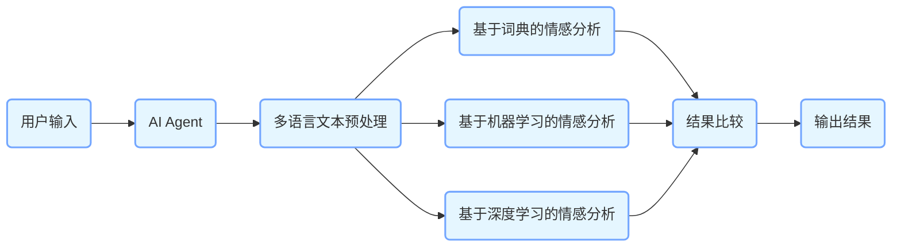

# 开发AI Agent的多语言情感分析比较系统

> 关键词：AI Agent、多语言情感分析、比较系统、自然语言处理、机器学习

> 摘要：本文旨在深入探讨开发AI Agent的多语言情感分析比较系统的相关技术和方法。随着全球化的发展，多语言文本的情感分析需求日益增长。通过构建一个能够对多种语言进行情感分析并比较结果的系统，可以为不同语言背景下的文本情感评估提供更全面、准确的支持。文章将从背景介绍入手，详细阐述核心概念、算法原理、数学模型，通过项目实战展示系统的开发过程，分析实际应用场景，推荐相关工具和资源，最后总结未来发展趋势与挑战，并提供常见问题解答和扩展阅读参考资料。

## 1. 背景介绍 
### 1.1 目的和范围
本项目的目的是开发一个AI Agent驱动的多语言情感分析比较系统。该系统旨在对多种语言的文本进行情感分析，并对不同分析方法或模型的结果进行比较。其范围涵盖了多种主流语言，如英语、中文、法语、德语等，同时支持多种常见的情感分析算法和模型，包括基于机器学习和深度学习的方法。通过该系统，用户可以直观地了解不同语言文本的情感倾向，以及不同分析方法在不同语言上的性能表现。

### 1.2 预期读者
本文的预期读者包括自然语言处理领域的研究人员、AI开发者、对多语言情感分析感兴趣的技术爱好者以及需要进行多语言文本情感评估的企业和机构人员。这些读者希望通过了解本系统的开发过程和技术细节，为自己的研究、开发或业务应用提供参考。

### 1.3 文档结构概述
本文将按照以下结构进行阐述：首先介绍核心概念与联系，包括多语言情感分析和AI Agent的基本原理和架构；接着详细讲解核心算法原理和具体操作步骤，并使用Python源代码进行说明；然后介绍数学模型和公式，通过具体例子进行详细讲解；随后进行项目实战，包括开发环境搭建、源代码实现和代码解读；分析实际应用场景；推荐相关的工具和资源；最后总结未来发展趋势与挑战，提供常见问题解答和扩展阅读参考资料。

### 1.4 术语表
#### 1.4.1 核心术语定义
- **AI Agent**：人工智能代理，是一种能够感知环境、做出决策并采取行动以实现特定目标的智能实体。在本系统中，AI Agent负责协调多语言情感分析的各个环节，包括文本处理、模型选择、结果比较等。
- **多语言情感分析**：对不同语言的文本进行情感倾向的判断，通常分为积极、消极和中性三种情感类别。
- **情感分析比较系统**：将不同的情感分析方法或模型应用于同一文本，比较它们的分析结果，以评估不同方法的性能和适用性。

#### 1.4.2 相关概念解释
- **自然语言处理（NLP）**：是计算机科学与语言学的交叉领域，主要研究如何让计算机理解和处理人类语言。多语言情感分析是自然语言处理的一个重要应用方向。
- **机器学习**：是一门多领域交叉学科，涉及概率论、统计学、逼近论、凸分析、算法复杂度理论等多门学科。它专门研究计算机怎样模拟或实现人类的学习行为，以获取新的知识或技能，重新组织已有的知识结构使之不断改善自身的性能。在情感分析中，机器学习算法可以通过训练数据学习文本特征与情感标签之间的关系。
- **深度学习**：是机器学习的一个分支领域，它是一种基于对数据进行表征学习的方法。深度学习通过构建具有多个层次的神经网络，自动从数据中学习复杂的特征表示，在自然语言处理任务中取得了很好的效果。

#### 1.4.3 缩略词列表
- **NLP**：Natural Language Processing（自然语言处理）
- **ML**：Machine Learning（机器学习）
- **DL**：Deep Learning（深度学习）
- **RNN**：Recurrent Neural Network（循环神经网络）
- **LSTM**：Long Short-Term Memory（长短期记忆网络）
- **GRU**：Gated Recurrent Unit（门控循环单元）
- **BERT**：Bidirectional Encoder Representations from Transformers（基于变换器的双向编码器表示）

## 2. 核心概念与联系 

### 核心概念原理
#### 多语言情感分析
多语言情感分析的核心原理是通过对文本中的词汇、语法和语义信息进行分析，判断文本所表达的情感倾向。不同语言具有不同的语法结构、词汇特点和文化背景，因此在进行多语言情感分析时，需要考虑这些因素。常见的方法包括基于词典的方法、基于机器学习的方法和基于深度学习的方法。

基于词典的方法是通过构建情感词典，将文本中的词汇与词典中的情感极性进行匹配，从而计算文本的情感得分。例如，在英语中，“happy”通常表示积极情感，“sad”表示消极情感。

基于机器学习的方法则是通过训练一个分类器，将文本作为输入，情感类别作为输出。常用的机器学习算法包括朴素贝叶斯、支持向量机等。

基于深度学习的方法则是利用神经网络自动学习文本的特征表示，从而进行情感分类。例如，RNN、LSTM、GRU等循环神经网络可以处理序列数据，BERT等预训练模型可以学习通用的语言表示。

#### AI Agent
AI Agent是一个具有自主性、反应性和社会性的智能实体。在多语言情感分析比较系统中，AI Agent的主要任务是感知用户的需求，选择合适的情感分析方法和模型，对文本进行情感分析，并比较不同方法的结果。AI Agent可以通过规则引擎、机器学习算法或深度学习模型来实现决策和行动。

### 架构示意图


该架构图展示了多语言情感分析比较系统的主要流程。用户输入多语言文本后，AI Agent负责协调整个分析过程。首先对文本进行预处理，然后分别使用基于词典、机器学习和深度学习的方法进行情感分析，最后对不同方法的结果进行比较，并输出最终结果。

## 3. 核心算法原理 & 具体操作步骤 

### 基于词典的情感分析算法原理
基于词典的情感分析算法的基本思想是通过构建一个情感词典，将文本中的词汇与词典中的情感极性进行匹配，从而计算文本的情感得分。具体步骤如下：
1. **构建情感词典**：收集和整理具有情感极性的词汇，并为每个词汇标注积极、消极或中性的情感标签。例如，在英语中，“good”可以标注为积极，“bad”可以标注为消极。
2. **文本分词**：将输入的文本分割成单个的词汇。
3. **词汇匹配**：遍历文本中的每个词汇，查找其在情感词典中的情感极性。
4. **情感得分计算**：根据匹配到的词汇的情感极性，计算文本的情感得分。例如，可以简单地将积极词汇的数量减去消极词汇的数量作为情感得分。

以下是使用Python实现基于词典的情感分析的示例代码：
```python
# 定义情感词典
sentiment_dict = {
    "good": 1,
    "bad": -1,
    "happy": 1,
    "sad": -1
}

def dictionary_based_sentiment_analysis(text):
    # 文本分词
    words = text.split()
    score = 0
    for word in words:
        if word in sentiment_dict:
            score += sentiment_dict[word]
    if score > 0:
        return "Positive"
    elif score < 0:
        return "Negative"
    else:
        return "Neutral"

# 测试代码
text = "I am happy today"
result = dictionary_based_sentiment_analysis(text)
print(f"Sentiment: {result}")
```

### 基于机器学习的情感分析算法原理
基于机器学习的情感分析算法通常使用分类器来对文本进行情感分类。常见的分类器包括朴素贝叶斯、支持向量机等。具体步骤如下：
1. **数据收集和预处理**：收集带有情感标签的文本数据，并进行预处理，如分词、去除停用词等。
2. **特征提取**：从预处理后的文本中提取特征，如词袋模型、TF-IDF等。
3. **模型训练**：使用训练数据训练分类器。
4. **模型评估**：使用测试数据评估分类器的性能。
5. **情感分类**：使用训练好的分类器对新的文本进行情感分类。

以下是使用Python和Scikit-learn库实现基于朴素贝叶斯的情感分析的示例代码：
```python
from sklearn.feature_extraction.text import CountVectorizer
from sklearn.naive_bayes import MultinomialNB
from sklearn.model_selection import train_test_split
from sklearn.metrics import accuracy_score

# 示例数据
corpus = [
    "This movie is great",
    "The food is terrible",
    "I love this book",
    "This product is awful"
]
labels = ["Positive", "Negative", "Positive", "Negative"]

# 特征提取
vectorizer = CountVectorizer()
X = vectorizer.fit_transform(corpus)

# 划分训练集和测试集
X_train, X_test, y_train, y_test = train_test_split(X, labels, test_size=0.2, random_state=42)

# 模型训练
clf = MultinomialNB()
clf.fit(X_train, y_train)

# 模型评估
y_pred = clf.predict(X_test)
accuracy = accuracy_score(y_test, y_pred)
print(f"Accuracy: {accuracy}")

# 情感分类
new_text = "This song is amazing"
new_text_vector = vectorizer.transform([new_text])
result = clf.predict(new_text_vector)
print(f"Sentiment: {result[0]}")
```

### 基于深度学习的情感分析算法原理
基于深度学习的情感分析算法通常使用神经网络来自动学习文本的特征表示。常见的神经网络包括RNN、LSTM、GRU和BERT等。具体步骤如下：
1. **数据收集和预处理**：收集带有情感标签的文本数据，并进行预处理，如分词、转换为数字序列等。
2. **模型构建**：构建神经网络模型，如LSTM或BERT。
3. **模型训练**：使用训练数据训练神经网络模型。
4. **模型评估**：使用测试数据评估模型的性能。
5. **情感分类**：使用训练好的模型对新的文本进行情感分类。

以下是使用Python和Keras库实现基于LSTM的情感分析的示例代码：
```python
from keras.preprocessing.text import Tokenizer
from keras.preprocessing.sequence import pad_sequences
from keras.models import Sequential
from keras.layers import Embedding, LSTM, Dense
import numpy as np

# 示例数据
corpus = [
    "This movie is great",
    "The food is terrible",
    "I love this book",
    "This product is awful"
]
labels = [1, 0, 1, 0]

# 数据预处理
tokenizer = Tokenizer()
tokenizer.fit_on_texts(corpus)
sequences = tokenizer.texts_to_sequences(corpus)
max_length = max([len(seq) for seq in sequences])
padded_sequences = pad_sequences(sequences, maxlen=max_length)

# 模型构建
model = Sequential()
model.add(Embedding(input_dim=len(tokenizer.word_index) + 1, output_dim=100, input_length=max_length))
model.add(LSTM(100))
model.add(Dense(1, activation='sigmoid'))

# 模型编译
model.compile(optimizer='adam', loss='binary_crossentropy', metrics=['accuracy'])

# 模型训练
model.fit(padded_sequences, np.array(labels), epochs=10, batch_size=1)

# 情感分类
new_text = "This song is amazing"
new_sequence = tokenizer.texts_to_sequences([new_text])
new_padded_sequence = pad_sequences(new_sequence, maxlen=max_length)
result = model.predict(new_padded_sequence)
if result[0][0] > 0.5:
    print("Positive")
else:
    print("Negative")
```

## 4. 数学模型和公式 & 详细讲解 & 举例说明 

### 基于词典的情感分析数学模型
基于词典的情感分析的数学模型可以表示为：
$$S = \sum_{i=1}^{n} p_i$$
其中，$S$ 表示文本的情感得分，$n$ 表示文本中的词汇数量，$p_i$ 表示第 $i$ 个词汇的情感极性。如果 $p_i = 1$ 表示积极情感，$p_i = -1$ 表示消极情感，$p_i = 0$ 表示中性情感。

例如，对于文本 “I am happy today”，分词后得到 ["I", "am", "happy", "today"]。假设 “happy” 的情感极性为 1，其他词汇的情感极性为 0，则该文本的情感得分 $S = 0 + 0 + 1 + 0 = 1$，因此该文本的情感倾向为积极。

### 基于机器学习的情感分析数学模型
基于机器学习的情感分析通常使用分类器来进行情感分类。以朴素贝叶斯分类器为例，其数学模型基于贝叶斯定理：
$$P(c|x) = \frac{P(x|c)P(c)}{P(x)}$$
其中，$P(c|x)$ 表示在给定文本 $x$ 的情况下，属于类别 $c$ 的概率；$P(x|c)$ 表示在类别 $c$ 下，文本 $x$ 出现的概率；$P(c)$ 表示类别 $c$ 出现的先验概率；$P(x)$ 表示文本 $x$ 出现的概率。

在实际应用中，为了简化计算，通常假设文本中的每个特征是独立的，即：
$$P(x|c) = \prod_{i=1}^{n} P(x_i|c)$$
其中，$x_i$ 表示文本 $x$ 的第 $i$ 个特征。

例如，对于一个二分类问题（积极和消极），假设文本 $x$ 由词汇 $x_1, x_2, \cdots, x_n$ 组成，我们需要计算 $P(Positive|x)$ 和 $P(Negative|x)$，并选择概率较大的类别作为文本的情感分类结果。

### 基于深度学习的情感分析数学模型
基于深度学习的情感分析通常使用神经网络来进行情感分类。以LSTM为例，其数学模型可以表示为：
- **输入门**：
$$i_t = \sigma(W_{ii}x_t + W_{hi}h_{t-1} + b_i)$$
- **遗忘门**：
$$f_t = \sigma(W_{if}x_t + W_{hf}h_{t-1} + b_f)$$
- **输出门**：
$$o_t = \sigma(W_{io}x_t + W_{ho}h_{t-1} + b_o)$$
- **细胞状态更新**：
$$\tilde{C}_t = \tanh(W_{ic}x_t + W_{hc}h_{t-1} + b_c)$$
$$C_t = f_t \odot C_{t-1} + i_t \odot \tilde{C}_t$$
- **隐藏状态更新**：
$$h_t = o_t \odot \tanh(C_t)$$
其中，$x_t$ 表示时刻 $t$ 的输入，$h_{t-1}$ 表示时刻 $t-1$ 的隐藏状态，$C_{t-1}$ 表示时刻 $t-1$ 的细胞状态，$W$ 表示权重矩阵，$b$ 表示偏置向量，$\sigma$ 表示 sigmoid 函数，$\tanh$ 表示双曲正切函数，$\odot$ 表示逐元素相乘。

在情感分类任务中，最后一个时刻的隐藏状态 $h_T$ 会被输入到一个全连接层中，通过 softmax 函数输出每个情感类别的概率。

例如，对于一个三分类问题（积极、消极、中性），softmax 函数的输出可以表示为：
$$P(y_j|x) = \frac{e^{z_j}}{\sum_{k=1}^{3} e^{z_k}}$$
其中，$y_j$ 表示第 $j$ 个情感类别，$z_j$ 表示全连接层的输出，$P(y_j|x)$ 表示在给定文本 $x$ 的情况下，属于类别 $y_j$ 的概率。

## 5. 项目实战：代码实际案例和详细解释说明 

### 5.1  开发环境搭建
为了开发多语言情感分析比较系统，我们需要搭建以下开发环境：
- **操作系统**：可以选择 Windows、Linux 或 macOS。
- **Python 环境**：建议使用 Python 3.7 及以上版本。可以从 Python 官方网站（https://www.python.org/downloads/）下载并安装。
- **依赖库**：需要安装以下 Python 库：
    - **Scikit-learn**：用于机器学习算法的实现。可以使用 `pip install scikit-learn` 进行安装。
    - **Keras**：用于深度学习模型的构建和训练。可以使用 `pip install keras` 进行安装。
    - **TensorFlow**：Keras 的后端，用于深度学习模型的计算。可以使用 `pip install tensorflow` 进行安装。
    - **NLTK**：用于自然语言处理任务，如分词、词性标注等。可以使用 `pip install nltk` 进行安装，并下载必要的数据：
```python
import nltk
nltk.download('punkt')
nltk.download('stopwords')
```
    - **jieba**：用于中文文本的分词。可以使用 `pip install jieba` 进行安装。

### 5.2  源代码详细实现和代码解读
以下是一个完整的多语言情感分析比较系统的示例代码：
```python
import nltk
from nltk.corpus import stopwords
from nltk.tokenize import word_tokenize
import jieba
from sklearn.feature_extraction.text import CountVectorizer
from sklearn.naive_bayes import MultinomialNB
from keras.preprocessing.text import Tokenizer
from keras.preprocessing.sequence import pad_sequences
from keras.models import Sequential
from keras.layers import Embedding, LSTM, Dense
import numpy as np

# 定义情感词典
sentiment_dict = {
    "good": 1,
    "bad": -1,
    "happy": 1,
    "sad": -1
}

def dictionary_based_sentiment_analysis(text, language='english'):
    if language == 'chinese':
        words = jieba.lcut(text)
    else:
        words = word_tokenize(text.lower())
        stop_words = set(stopwords.words(language))
        words = [word for word in words if word.isalnum() and word not in stop_words]
    score = 0
    for word in words:
        if word in sentiment_dict:
            score += sentiment_dict[word]
    if score > 0:
        return "Positive"
    elif score < 0:
        return "Negative"
    else:
        return "Neutral"

def machine_learning_sentiment_analysis(text, language='english'):
    # 示例数据
    if language == 'english':
        corpus = [
            "This movie is great",
            "The food is terrible",
            "I love this book",
            "This product is awful"
        ]
        labels = ["Positive", "Negative", "Positive", "Negative"]
    elif language == 'chinese':
        corpus = [
            "这部电影很棒",
            "这食物很难吃",
            "我喜欢这本书",
            "这个产品很差劲"
        ]
        labels = ["Positive", "Negative", "Positive", "Negative"]
    else:
        raise ValueError("Unsupported language")

    # 特征提取
    if language == 'chinese':
        vectorizer = CountVectorizer(tokenizer=jieba.lcut)
    else:
        vectorizer = CountVectorizer()
    X = vectorizer.fit_transform(corpus)

    # 模型训练
    clf = MultinomialNB()
    clf.fit(X, labels)

    # 情感分类
    text_vector = vectorizer.transform([text])
    result = clf.predict(text_vector)
    return result[0]

def deep_learning_sentiment_analysis(text, language='english'):
    # 示例数据
    if language == 'english':
        corpus = [
            "This movie is great",
            "The food is terrible",
            "I love this book",
            "This product is awful"
        ]
        labels = [1, 0, 1, 0]
    elif language == 'chinese':
        corpus = [
            "这部电影很棒",
            "这食物很难吃",
            "我喜欢这本书",
            "这个产品很差劲"
        ]
        labels = [1, 0, 1, 0]
    else:
        raise ValueError("Unsupported language")

    # 数据预处理
    if language == 'chinese':
        tokenizer = Tokenizer()
        tokenizer.fit_on_texts([jieba.lcut(sentence) for sentence in corpus])
        sequences = [tokenizer.texts_to_sequences([jieba.lcut(sentence)])[0] for sentence in corpus]
    else:
        tokenizer = Tokenizer()
        tokenizer.fit_on_texts(corpus)
        sequences = tokenizer.texts_to_sequences(corpus)
    max_length = max([len(seq) for seq in sequences])
    padded_sequences = pad_sequences(sequences, maxlen=max_length)

    # 模型构建
    model = Sequential()
    model.add(Embedding(input_dim=len(tokenizer.word_index) + 1, output_dim=100, input_length=max_length))
    model.add(LSTM(100))
    model.add(Dense(1, activation='sigmoid'))

    # 模型编译
    model.compile(optimizer='adam', loss='binary_crossentropy', metrics=['accuracy'])

    # 模型训练
    model.fit(padded_sequences, np.array(labels), epochs=10, batch_size=1)

    # 情感分类
    if language == 'chinese':
        new_sequence = tokenizer.texts_to_sequences([jieba.lcut(text)])
    else:
        new_sequence = tokenizer.texts_to_sequences([text])
    new_padded_sequence = pad_sequences(new_sequence, maxlen=max_length)
    result = model.predict(new_padded_sequence)
    if result[0][0] > 0.5:
        return "Positive"
    else:
        return "Negative"

def compare_sentiment_analysis(text, language='english'):
    dict_result = dictionary_based_sentiment_analysis(text, language)
    ml_result = machine_learning_sentiment_analysis(text, language)
    dl_result = deep_learning_sentiment_analysis(text, language)
    print(f"Dictionary-based result: {dict_result}")
    print(f"Machine learning result: {ml_result}")
    print(f"Deep learning result: {dl_result}")

# 测试代码
text = "This movie is really amazing"
compare_sentiment_analysis(text, language='english')

text = "这部电影真的很棒"
compare_sentiment_analysis(text, language='chinese')
```

### 5.3  代码解读与分析
- **dictionary_based_sentiment_analysis 函数**：实现了基于词典的情感分析。根据输入的文本和语言，对文本进行分词和去除停用词处理，然后遍历每个词汇，查找其在情感词典中的情感极性，最后计算文本的情感得分并返回情感类别。
- **machine_learning_sentiment_analysis 函数**：实现了基于机器学习的情感分析。使用示例数据进行特征提取和模型训练，然后对输入的文本进行情感分类。
- **deep_learning_sentiment_analysis 函数**：实现了基于深度学习的情感分析。使用示例数据进行数据预处理和模型构建，然后对输入的文本进行情感分类。
- **compare_sentiment_analysis 函数**：调用上述三个函数，对输入的文本进行情感分析，并比较不同方法的结果。

通过这个示例代码，我们可以看到如何使用不同的方法对多语言文本进行情感分析，并比较它们的结果。

## 6. 实际应用场景 
多语言情感分析比较系统在许多实际场景中都有广泛的应用：
- **社交媒体监测**：企业可以使用该系统监测不同语言的社交媒体平台上用户对其产品或服务的评价，了解用户的情感倾向，及时发现问题并采取措施。
- **市场调研**：在进行市场调研时，该系统可以帮助分析不同语言的消费者反馈，了解消费者的需求和意见，为产品开发和营销策略制定提供参考。
- **客户服务**：客服人员可以使用该系统快速判断客户的情感状态，提供更个性化的服务，提高客户满意度。
- **舆情分析**：政府和媒体可以使用该系统对不同语言的新闻报道和网络言论进行情感分析，了解公众对重大事件的态度和反应，及时进行舆情引导。

## 7. 工具和资源推荐
### 7.1 学习资源推荐
#### 7.1.1 书籍推荐
- 《自然语言处理入门》：作者何晗，本书全面介绍了自然语言处理的基础知识和常用技术，适合初学者入门。
- 《深度学习》：作者Ian Goodfellow、Yoshua Bengio和Aaron Courville，本书是深度学习领域的经典教材，详细介绍了深度学习的理论和实践。
- 《Python自然语言处理》：作者Steven Bird、Ewan Klein和Edward Loper，本书介绍了如何使用Python进行自然语言处理，包含大量的代码示例。

#### 7.1.2 在线课程
- Coursera上的“Natural Language Processing Specialization”：由深度学习领域的知名学者授课，涵盖了自然语言处理的各个方面。
- edX上的“Introduction to Artificial Intelligence”：介绍了人工智能的基本概念和技术，包括自然语言处理。
- 中国大学MOOC上的“自然语言处理”：由国内高校的教师授课，内容丰富，适合国内学习者。

#### 7.1.3 技术博客和网站
- Medium上的“Towards Data Science”：有许多关于自然语言处理和机器学习的优秀文章。
- 机器之心：专注于人工智能领域的技术报道和分析，提供了很多有价值的信息。
- 开源中国：国内知名的开源技术社区，有很多关于自然语言处理的开源项目和技术文章。

### 7.2 开发工具框架推荐
#### 7.2.1 IDE和编辑器
- PyCharm：一款功能强大的Python集成开发环境，提供了代码编辑、调试、版本控制等功能。
- Jupyter Notebook：一个交互式的编程环境，适合进行数据分析和模型实验。
- Visual Studio Code：一款轻量级的代码编辑器，支持多种编程语言，有丰富的插件扩展。

#### 7.2.2 调试和性能分析工具
- TensorBoard：TensorFlow的可视化工具，可以用于查看模型的训练过程、损失函数曲线等。
- Py-Spy：一个Python性能分析工具，可以帮助找出代码中的性能瓶颈。
- Memory Profiler：一个Python内存分析工具，可以帮助检测代码中的内存泄漏问题。

#### 7.2.3 相关框架和库
- Scikit-learn：一个简单易用的机器学习库，提供了各种机器学习算法和工具。
- Keras：一个高级神经网络API，支持多种深度学习框架，如TensorFlow、Theano等。
- Transformers：Hugging Face开发的一个深度学习库，提供了许多预训练的模型，如BERT、GPT等，方便进行自然语言处理任务。

### 7.3 相关论文著作推荐
#### 7.3.1 经典论文
- “A Sentimental Education: Sentiment Analysis Using Subjectivity Summarization Based on Minimum Cuts”：提出了一种基于最小割的主观性总结方法，用于情感分析。
- “Convolutional Neural Networks for Sentence Classification”：介绍了如何使用卷积神经网络进行句子分类，在情感分析任务中取得了很好的效果。
- “Attention Is All You Need”：提出了Transformer模型，为自然语言处理领域带来了革命性的变化。

#### 7.3.2 最新研究成果
- 每年的ACL（Association for Computational Linguistics）会议和EMNLP（Conference on Empirical Methods in Natural Language Processing）会议都会发表许多关于自然语言处理和情感分析的最新研究成果。
- arXiv上也有很多关于自然语言处理的预印本论文，可以及时了解最新的研究动态。

#### 7.3.3 应用案例分析
- 一些知名企业和研究机构会发布关于多语言情感分析的应用案例，如谷歌、微软等公司的相关报告。这些案例可以帮助我们了解如何将多语言情感分析技术应用到实际业务中。

## 8. 总结：未来发展趋势与挑战
### 未来发展趋势
- **多模态情感分析**：未来的情感分析系统将不仅仅局限于文本，还会结合图像、音频等多种模态的信息，提供更全面、准确的情感分析结果。
- **跨语言迁移学习**：通过跨语言迁移学习技术，可以利用一种语言的大量标注数据来训练模型，然后将模型应用到其他语言上，减少对不同语言标注数据的依赖。
- **个性化情感分析**：根据用户的个人偏好、历史行为等信息，提供个性化的情感分析服务，提高情感分析的准确性和实用性。

### 挑战
- **语言多样性**：不同语言具有不同的语法结构、词汇特点和文化背景，这给多语言情感分析带来了很大的挑战。需要开发更加通用的情感分析模型，能够适应不同语言的特点。
- **数据标注**：高质量的标注数据是训练情感分析模型的关键。然而，标注多语言数据需要耗费大量的人力和时间，而且不同语言的数据分布也可能存在差异。
- **模型解释性**：深度学习模型在情感分析任务中取得了很好的效果，但这些模型往往是黑盒模型，缺乏解释性。在一些应用场景中，如法律、医疗等领域，需要模型能够提供可解释的结果。

## 9. 附录：常见问题与解答
### 问题1：如何选择合适的情感分析方法？
答：选择合适的情感分析方法需要考虑多个因素，如数据规模、语言类型、应用场景等。如果数据规模较小，可以选择基于词典的方法；如果数据规模较大，可以选择基于机器学习或深度学习的方法。对于不同语言，需要考虑语言的特点和可用的资源。在实际应用中，可以尝试多种方法，并比较它们的性能，选择最适合的方法。

### 问题2：如何处理多语言文本中的特殊字符和表情符号？
答：可以在文本预处理阶段对特殊字符和表情符号进行处理。对于特殊字符，可以选择去除或替换为空格；对于表情符号，可以根据其情感极性进行标注，并将其作为一个特殊的词汇纳入情感分析中。

### 问题3：如何提高情感分析模型的准确性？
答：可以从以下几个方面提高情感分析模型的准确性：
- 增加训练数据的规模和多样性，提高模型的泛化能力。
- 选择合适的特征提取方法和模型结构，根据不同的语言和应用场景进行调整。
- 进行数据增强，如对文本进行同义词替换、随机插入或删除词汇等操作，增加数据的多样性。
- 对模型进行调优，如调整超参数、使用正则化方法等。

## 10. 扩展阅读 & 参考资料
- 《自然语言处理实战：基于Python和深度学习》
- 《Python机器学习实战》
- 官方文档：Scikit-learn（https://scikit-learn.org/stable/documentation.html）、Keras（https://keras.io/）、TensorFlow（https://www.tensorflow.org/api_docs）
- 学术论文：可以在IEEE Xplore、ACM Digital Library等学术数据库中搜索相关的论文。

作者：AI天才研究院/AI Genius Institute & 禅与计算机程序设计艺术 /Zen And The Art of Computer Programming