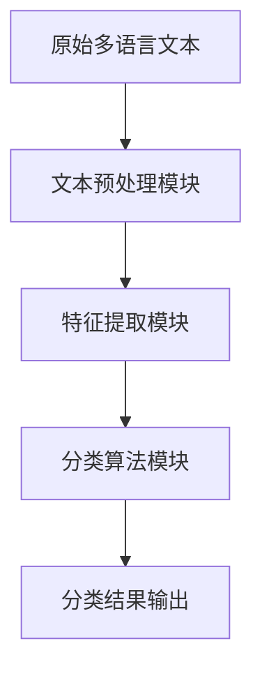

# 开发AI Agent的多语言文本分类器

> 关键词：AI Agent、多语言文本分类器、文本分类算法、自然语言处理、深度学习

> 摘要：本文旨在深入探讨开发AI Agent的多语言文本分类器的相关技术和方法。首先介绍了开发多语言文本分类器的背景和目的，包括其在不同领域的应用场景。接着详细阐述了核心概念，如多语言文本特征提取、分类算法原理等，并给出了相应的架构示意图和流程图。通过Python代码详细讲解了核心算法的实现步骤，同时介绍了相关的数学模型和公式。在项目实战部分，提供了开发环境搭建的步骤、源代码实现和详细的代码解读。此外，还列举了该技术的实际应用场景，推荐了学习资源、开发工具框架以及相关论文著作。最后总结了未来发展趋势与挑战，并提供了常见问题的解答和扩展阅读的参考资料。

## 1. 背景介绍 
### 1.1 目的和范围
随着全球化的发展，信息的传播和交流跨越了语言的界限。在处理大量多语言文本数据时，需要一种高效准确的方法来对这些文本进行分类。开发AI Agent的多语言文本分类器的目的就是为了实现对不同语言文本的自动分类，帮助用户快速筛选和处理信息。

本文章的范围涵盖了多语言文本分类器的核心概念、算法原理、实际开发步骤以及应用场景等方面。从理论知识到实际项目开发，为读者提供全面的指导。

### 1.2 预期读者
本文预期读者包括对自然语言处理、人工智能感兴趣的开发者、研究人员，以及希望将多语言文本分类技术应用到实际项目中的企业技术人员。具备一定的Python编程基础和机器学习知识将有助于更好地理解本文内容。

### 1.3 文档结构概述
本文将按照以下结构进行组织：
1. 背景介绍：阐述开发多语言文本分类器的目的、预期读者和文档结构。
2. 核心概念与联系：介绍多语言文本分类的核心概念，如特征提取、分类算法等，并给出架构示意图和流程图。
3. 核心算法原理 & 具体操作步骤：使用Python代码详细讲解核心算法的实现步骤。
4. 数学模型和公式 & 详细讲解 & 举例说明：介绍相关的数学模型和公式，并通过具体例子进行说明。
5. 项目实战：代码实际案例和详细解释说明，包括开发环境搭建、源代码实现和代码解读。
6. 实际应用场景：列举多语言文本分类器在不同领域的实际应用场景。
7. 工具和资源推荐：推荐学习资源、开发工具框架以及相关论文著作。
8. 总结：未来发展趋势与挑战。
9. 附录：常见问题与解答。
10. 扩展阅读 & 参考资料。

### 1.4 术语表
#### 1.4.1 核心术语定义
- **AI Agent**：人工智能代理，是一种能够感知环境、做出决策并采取行动的智能实体。
- **多语言文本分类器**：一种能够对不同语言的文本进行分类的模型。
- **文本特征提取**：从文本中提取有代表性的特征，以便用于分类任务。
- **分类算法**：用于对文本进行分类的算法，如朴素贝叶斯、支持向量机、深度学习算法等。

#### 1.4.2 相关概念解释
- **自然语言处理（NLP）**：是一门研究如何让计算机理解和处理人类语言的学科，多语言文本分类是NLP的一个重要应用领域。
- **深度学习**：是一种基于神经网络的机器学习方法，在文本分类任务中取得了很好的效果。

#### 1.4.3 缩略词列表
- **NLP**：Natural Language Processing（自然语言处理）
- **SVM**：Support Vector Machine（支持向量机）
- **CNN**：Convolutional Neural Network（卷积神经网络）
- **RNN**：Recurrent Neural Network（循环神经网络）
- **LSTM**：Long Short-Term Memory（长短期记忆网络）

## 2. 核心概念与联系 

### 核心概念原理
多语言文本分类器的核心原理是将不同语言的文本转换为计算机能够处理的特征向量，然后使用分类算法对这些特征向量进行分类。主要包括以下几个步骤：
1. **文本预处理**：对原始文本进行清洗，去除噪声，如标点符号、停用词等。
2. **特征提取**：从预处理后的文本中提取有代表性的特征，如词频、词向量等。
3. **分类算法选择**：选择合适的分类算法，如朴素贝叶斯、支持向量机、深度学习算法等。
4. **模型训练**：使用训练数据对分类模型进行训练，调整模型参数。
5. **模型评估**：使用测试数据对训练好的模型进行评估，计算分类准确率等指标。
6. **模型应用**：将训练好的模型应用到实际的文本分类任务中。

### 架构的文本示意图
```plaintext
+-------------------+
|  原始多语言文本   |
+-------------------+
          |
          v
+-------------------+
|  文本预处理模块   |
|  - 去除噪声       |
|  - 分词           |
|  - 词干提取       |
+-------------------+
          |
          v
+-------------------+
|  特征提取模块     |
|  - 词频统计       |
|  - 词向量生成     |
+-------------------+
          |
          v
+-------------------+
|  分类算法模块     |
|  - 朴素贝叶斯     |
|  - 支持向量机     |
|  - 深度学习模型   |
+-------------------+
          |
          v
+-------------------+
|  分类结果输出     |
+-------------------+
```

### Mermaid流程图


## 3. 核心算法原理 & 具体操作步骤 

### 朴素贝叶斯算法原理
朴素贝叶斯算法是一种基于贝叶斯定理的简单概率分类器，假设特征之间相互独立。对于文本分类任务，我们可以将文本的每个词看作一个特征。

贝叶斯定理的公式为：
$$P(c|x) = \frac{P(x|c)P(c)}{P(x)}$$
其中，$P(c|x)$ 是在给定特征 $x$ 的情况下类别 $c$ 的概率，$P(x|c)$ 是在类别 $c$ 下特征 $x$ 的概率，$P(c)$ 是类别 $c$ 的先验概率，$P(x)$ 是特征 $x$ 的先验概率。

在朴素贝叶斯分类器中，我们选择具有最大后验概率的类别作为预测结果：
$$\hat{c} = \arg\max_{c \in C} P(c|x) = \arg\max_{c \in C} \frac{P(x|c)P(c)}{P(x)} = \arg\max_{c \in C} P(x|c)P(c)$$

### Python代码实现
```python
import numpy as np
from sklearn.feature_extraction.text import CountVectorizer
from sklearn.naive_bayes import MultinomialNB
from sklearn.model_selection import train_test_split
from sklearn.metrics import accuracy_score

# 示例数据
texts = ["This is an English sentence.", "这是一个中文句子。", "Dies ist ein deutscher Satz."]
labels = [0, 1, 2]  # 假设0表示英语，1表示中文，2表示德语

# 文本特征提取
vectorizer = CountVectorizer()
X = vectorizer.fit_transform(texts)

# 划分训练集和测试集
X_train, X_test, y_train, y_test = train_test_split(X, labels, test_size=0.2, random_state=42)

# 创建朴素贝叶斯分类器
clf = MultinomialNB()

# 模型训练
clf.fit(X_train, y_train)

# 模型预测
y_pred = clf.predict(X_test)

# 计算准确率
accuracy = accuracy_score(y_test, y_pred)
print(f"Accuracy: {accuracy}")
```

### 具体操作步骤
1. **数据准备**：收集多语言文本数据，并为每个文本样本标注类别标签。
2. **文本特征提取**：使用 `CountVectorizer` 等工具将文本转换为词频向量。
3. **划分训练集和测试集**：将数据划分为训练集和测试集，用于模型训练和评估。
4. **创建分类器**：选择合适的分类算法，如 `MultinomialNB`。
5. **模型训练**：使用训练集对分类器进行训练。
6. **模型预测**：使用训练好的模型对测试集进行预测。
7. **模型评估**：计算分类准确率等指标，评估模型性能。

## 4. 数学模型和公式 & 详细讲解 & 举例说明 

### 词频统计模型
词频统计是一种简单而有效的文本特征提取方法。对于一个文本集合 $D = \{d_1, d_2, \cdots, d_n\}$，其中 $d_i$ 表示第 $i$ 个文本，我们可以统计每个词在文本中出现的频率。

设 $V = \{v_1, v_2, \cdots, v_m\}$ 是文本集合中的所有词的集合，$tf_{ij}$ 表示词 $v_j$ 在文本 $d_i$ 中出现的频率，则文本 $d_i$ 的词频向量可以表示为：
$$\mathbf{x}_i = [tf_{i1}, tf_{i2}, \cdots, tf_{im}]$$

### 举例说明
假设我们有以下两个文本：
- $d_1$: "apple banana apple"
- $d_2$: "banana cherry"

词集合 $V = \{"apple", "banana", "cherry"\}$，则文本 $d_1$ 和 $d_2$ 的词频向量分别为：
- $\mathbf{x}_1 = [2, 1, 0]$
- $\mathbf{x}_2 = [0, 1, 1]$

### TF-IDF模型
TF-IDF（Term Frequency-Inverse Document Frequency）是一种常用的文本特征加权方法，它结合了词频（TF）和逆文档频率（IDF）。

词频 $tf_{ij}$ 表示词 $v_j$ 在文本 $d_i$ 中出现的频率，逆文档频率 $idf_j$ 表示词 $v_j$ 在整个文本集合中出现的文档频率的倒数，计算公式为：
$$idf_j = \log\frac{N}{df_j}$$
其中，$N$ 是文本集合中的文档总数，$df_j$ 是包含词 $v_j$ 的文档数。

TF-IDF值 $tfidf_{ij}$ 为：
$$tfidf_{ij} = tf_{ij} \times idf_j$$

### 举例说明
假设我们有一个包含100个文档的文本集合，其中包含词 "apple" 的文档有10个，词 "banana" 的文档有20个。在某个文档中，"apple" 出现了3次，"banana" 出现了2次。

- 词频：$tf_{apple} = 3$，$tf_{banana} = 2$
- 逆文档频率：$idf_{apple} = \log\frac{100}{10} = 1$，$idf_{banana} = \log\frac{100}{20} \approx 0.699$
- TF-IDF值：$tfidf_{apple} = 3 \times 1 = 3$，$tfidf_{banana} = 2 \times 0.699 \approx 1.398$

## 5. 项目实战：代码实际案例和详细解释说明 

### 5.1  开发环境搭建
#### 安装Python
首先需要安装Python，建议使用Python 3.7及以上版本。可以从Python官方网站（https://www.python.org/downloads/）下载并安装。

#### 创建虚拟环境
为了避免不同项目之间的依赖冲突，建议使用虚拟环境。可以使用 `venv` 模块创建虚拟环境：
```bash
python -m venv myenv
```
激活虚拟环境：
- 在Windows上：
```bash
myenv\Scripts\activate
```
- 在Linux/Mac上：
```bash
source myenv/bin/activate
```

#### 安装依赖库
安装项目所需的依赖库，如 `scikit-learn`、`numpy` 等：
```bash
pip install scikit-learn numpy
```

### 5.2  源代码详细实现和代码解读
```python
import numpy as np
from sklearn.feature_extraction.text import TfidfVectorizer
from sklearn.svm import SVC
from sklearn.model_selection import train_test_split
from sklearn.metrics import accuracy_score

# 示例数据
texts = ["This is an English movie review.", "这是一篇中文电影评论。", "Dies ist eine deutsche Filmkritik."]
labels = [0, 1, 2]  # 假设0表示英语评论，1表示中文评论，2表示德语评论

# 文本特征提取
vectorizer = TfidfVectorizer()
X = vectorizer.fit_transform(texts)

# 划分训练集和测试集
X_train, X_test, y_train, y_test = train_test_split(X, labels, test_size=0.2, random_state=42)

# 创建支持向量机分类器
clf = SVC()

# 模型训练
clf.fit(X_train, y_train)

# 模型预测
y_pred = clf.predict(X_test)

# 计算准确率
accuracy = accuracy_score(y_test, y_pred)
print(f"Accuracy: {accuracy}")
```

### 代码解读与分析
1. **导入必要的库**：导入 `numpy`、`TfidfVectorizer`、`SVC`、`train_test_split` 和 `accuracy_score` 等库。
2. **准备数据**：定义示例文本数据和对应的类别标签。
3. **文本特征提取**：使用 `TfidfVectorizer` 将文本转换为TF-IDF向量。
4. **划分训练集和测试集**：使用 `train_test_split` 将数据划分为训练集和测试集。
5. **创建分类器**：使用 `SVC` 创建支持向量机分类器。
6. **模型训练**：使用训练集对分类器进行训练。
7. **模型预测**：使用训练好的模型对测试集进行预测。
8. **模型评估**：使用 `accuracy_score` 计算分类准确率。

## 6. 实际应用场景 
### 新闻分类
在新闻网站中，每天会有大量来自不同语言的新闻文章。使用多语言文本分类器可以将这些新闻自动分类到不同的类别中，如政治、经济、体育等，方便用户快速浏览和查找感兴趣的新闻。

### 社交媒体监控
社交媒体平台上的用户发言使用多种语言。通过多语言文本分类器，可以对用户的发言进行分类，如正面评价、负面评价、中性评价等，帮助企业了解用户的反馈和意见。

### 客户服务
在跨国企业的客户服务中，客户可能使用不同的语言进行咨询和反馈。多语言文本分类器可以快速识别客户问题的类别，将其分配给相应的客服人员进行处理，提高客户服务效率。

### 信息检索
在搜索引擎中，用户可能使用不同的语言进行搜索。多语言文本分类器可以对搜索结果进行分类，提供更精准的搜索结果，提高用户的搜索体验。

## 7. 工具和资源推荐
### 7.1 学习资源推荐
#### 7.1.1 书籍推荐
- 《自然语言处理入门》：介绍了自然语言处理的基本概念和方法，适合初学者。
- 《深度学习》：详细讲解了深度学习的原理和应用，对于理解多语言文本分类中的深度学习模型有很大帮助。
- 《Python自然语言处理实战》：通过实际案例介绍了如何使用Python进行自然语言处理，包括文本分类等任务。

#### 7.1.2 在线课程
- Coursera上的“自然语言处理专项课程”：由知名教授授课，涵盖了自然语言处理的多个方面。
- edX上的“深度学习基础”：帮助学习者掌握深度学习的基本原理和应用。
- 网易云课堂上的“Python自然语言处理实战教程”：通过实际项目讲解自然语言处理的应用。

#### 7.1.3 技术博客和网站
- 机器之心：提供人工智能领域的最新技术和研究成果。
- 开源中国：有很多关于自然语言处理的技术文章和开源项目。
- 博客园：一些开发者会分享自己在自然语言处理方面的经验和心得。

### 7.2 开发工具框架推荐
#### 7.2.1 IDE和编辑器
- PyCharm：功能强大的Python集成开发环境，支持代码调试、版本控制等功能。
- Jupyter Notebook：交互式的开发环境，适合进行数据探索和模型实验。
- Visual Studio Code：轻量级的代码编辑器，支持多种编程语言和插件扩展。

#### 7.2.2 调试和性能分析工具
- PDB：Python自带的调试工具，可以帮助开发者定位代码中的问题。
- TensorBoard：用于可视化深度学习模型的训练过程和性能指标。
- cProfile：Python的性能分析工具，可以分析代码的运行时间和内存使用情况。

#### 7.2.3 相关框架和库
- scikit-learn：提供了丰富的机器学习算法和工具，包括文本分类算法。
- TensorFlow：开源的深度学习框架，支持多种深度学习模型的开发和训练。
- PyTorch：另一个流行的深度学习框架，具有简洁易用的特点。

### 7.3 相关论文著作推荐
#### 7.3.1 经典论文
- "A Comparison of Event Models for Naive Bayes Text Classification"：比较了朴素贝叶斯文本分类中的不同事件模型。
- "Support-Vector Networks"：介绍了支持向量机的基本原理和算法。
- "Convolutional Neural Networks for Sentence Classification"：提出了使用卷积神经网络进行句子分类的方法。

#### 7.3.2 最新研究成果
- 关注ACL（Association for Computational Linguistics）、EMNLP（Conference on Empirical Methods in Natural Language Processing）等自然语言处理领域的顶级会议，了解最新的研究成果。
- 一些知名学术期刊，如《Journal of Artificial Intelligence Research》《Artificial Intelligence》等，也会发表相关的研究论文。

#### 7.3.3 应用案例分析
- 一些企业和研究机构会发布多语言文本分类在实际应用中的案例分析，可以从中学习到实际项目的开发经验和技巧。

## 8. 总结：未来发展趋势与挑战
### 未来发展趋势
- **深度学习的广泛应用**：随着深度学习技术的不断发展，越来越多的多语言文本分类器将采用深度学习模型，如卷积神经网络（CNN）、循环神经网络（RNN）及其变体（如LSTM、GRU）等，以提高分类的准确率和性能。
- **多模态融合**：将文本信息与其他模态信息（如图像、音频等）进行融合，实现更全面、准确的分类。例如，在电影评论分类中，可以结合评论的文本内容和电影的海报图像进行分类。
- **跨语言迁移学习**：利用已有的单语言或多语言模型，通过迁移学习的方法快速适应新的语言和任务，减少对大规模标注数据的依赖。
- **实时分类**：在一些实时性要求较高的场景中，如社交媒体监控、在线客服等，需要实现实时的多语言文本分类。未来的多语言文本分类器将更加注重实时性和效率。

### 挑战
- **数据稀缺性**：对于一些小语种或特定领域的语言，标注数据往往非常稀缺，这给模型的训练带来了很大的困难。需要探索有效的数据增强和无监督学习方法来解决这个问题。
- **语言差异**：不同语言在语法、词汇、语义等方面存在很大的差异，如何有效地处理这些差异，提取跨语言的通用特征，是多语言文本分类面临的一个挑战。
- **计算资源需求**：深度学习模型通常需要大量的计算资源进行训练和推理，对于一些资源受限的设备和场景，如何优化模型结构和算法，降低计算成本，是一个需要解决的问题。
- **语义理解**：虽然现有的多语言文本分类器在语法和词法层面取得了较好的效果，但在语义理解方面还存在不足。如何更好地理解文本的语义信息，提高分类的准确性，是未来的研究方向之一。

## 9. 附录：常见问题与解答
### 问题1：如何选择合适的分类算法？
解答：选择合适的分类算法需要考虑多个因素，如数据规模、数据特征、分类任务的复杂度等。对于小规模数据和简单的分类任务，可以选择朴素贝叶斯、决策树等算法；对于大规模数据和复杂的分类任务，深度学习算法（如CNN、RNN等）通常能取得更好的效果。

### 问题2：如何处理不同语言的文本编码问题？
解答：在处理多语言文本时，建议使用UTF-8编码，它支持全球范围内的各种语言。在Python中，大多数库都默认支持UTF-8编码，在读取和处理文本数据时，确保文件以UTF-8编码保存和打开。

### 问题3：如何提高多语言文本分类器的准确率？
解答：可以从以下几个方面提高多语言文本分类器的准确率：
- 收集更多的标注数据，特别是对于小语种和特定领域的数据。
- 选择合适的特征提取方法，如TF-IDF、词向量等。
- 尝试不同的分类算法，并进行参数调优。
- 进行数据增强和预处理，如去除噪声、分词、词干提取等。

### 问题4：多语言文本分类器能否处理未见过的语言？
解答：传统的多语言文本分类器通常是基于已有的语言数据进行训练的，对于未见过的语言，其分类效果可能会受到影响。可以采用跨语言迁移学习的方法，利用已有的多语言模型进行微调，以适应新的语言。

## 10. 扩展阅读 & 参考资料
### 扩展阅读
- 《自然语言处理综论》：全面介绍了自然语言处理的各个方面，包括文本分类、信息检索、机器翻译等。
- 《人工智能：现代方法》：系统讲解了人工智能的基本概念、算法和应用，对于理解多语言文本分类器的原理和背景有很大帮助。
- 《神经网络与深度学习》：深入探讨了神经网络和深度学习的理论和实践，适合进一步学习深度学习在多语言文本分类中的应用。

### 参考资料
- 维基百科上关于自然语言处理、文本分类、深度学习等相关词条，提供了基本的概念和原理介绍。
- 各开源库的官方文档，如scikit-learn、TensorFlow、PyTorch等，详细介绍了库的使用方法和示例代码。
- 相关学术会议和期刊的论文，如ACL、EMNLP、AAAI等，提供了最新的研究成果和技术方法。

作者：AI天才研究院/AI Genius Institute & 禅与计算机程序设计艺术 /Zen And The Art of Computer Programming